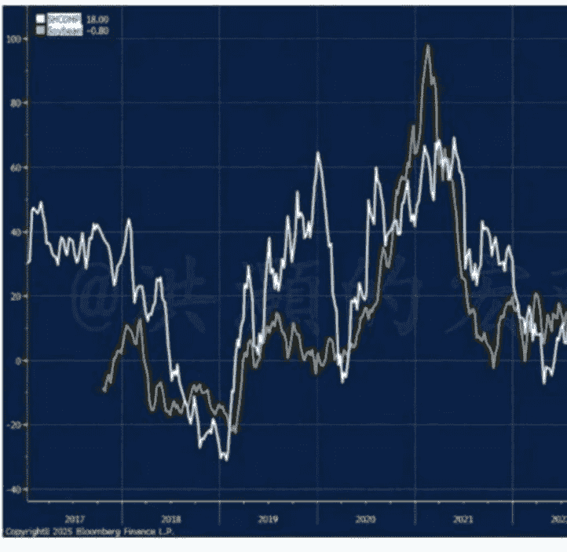
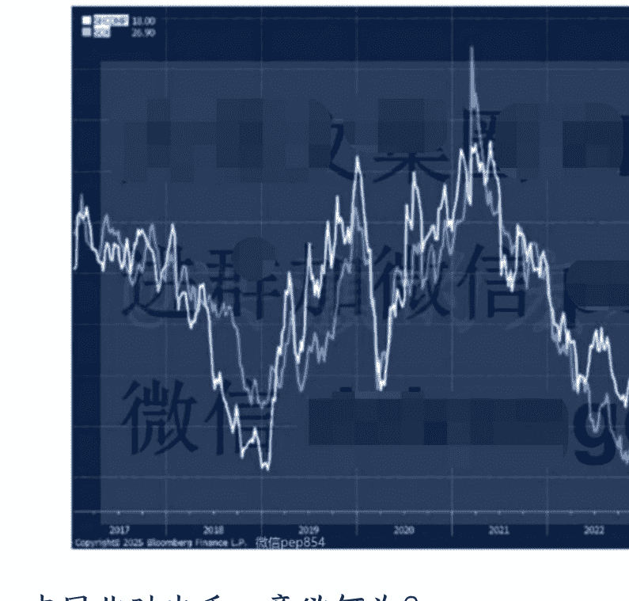
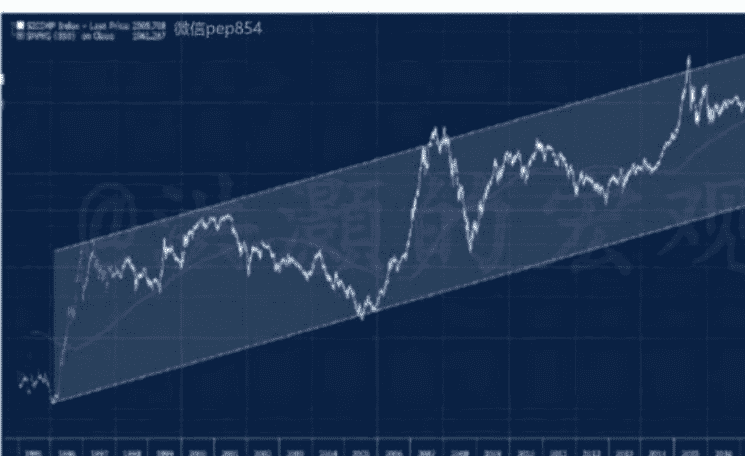
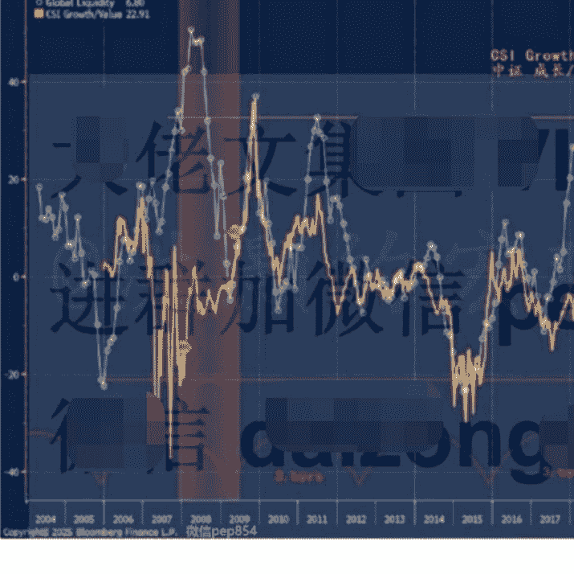

# 贸易波澜再起，中国先声夺人
251013 洪灝
整理：公众号懒人搜索，懒人专属群独享懒人微信：lazyhelper

中国市场将如何反映贸易波澜。

日前，中国宣布对稀土加强出口管制，此类战略资源乃半导体与国防武器之命脉。我方掌控全球逾七成供应、九成加工产能。上周五深夜，特朗普仓促反制，悍然宣布对华加征100%关税。美股四月“解放日”创痕未愈，纳斯达克隔夜遭遇四月以来最大单日跌幅，恒生夜期更重挫超 5%直至跌停。

然则，我们追踪的数项衡量贸易关系指标仍显从容。譬如，2018 年曾精准预警贸易摩擦的大豆价格，此刻依然波澜不惊（图一）。当然，今年迄今中国未尝采购美豆，而美国豆农正面临历史性丰产之困。大豆或已不复当年之敏锐。同时，历史往绩表明，大豆价格往往是中国市场之滞后指标，而非先行信号。

## 图一：美豆价格波澜不惊，并很可能

以下内容仅 V+会员可见

虽大豆价格波动可折射贸易关系之紧张程度，此刻却难窥其踪。然若历史可鉴，近期上证综指之走势，或预示大豆价格将趋升。若如此，豆价回暖可安抚美国豆农，为正在进行之贸易谈判营造积极氛围。周末有消息称，美国豆农已愿接受人民币作为结算货币。这是对于美元霸权的又一挑战。

衡量贸易紧张的另一风向标，为美股半导体板块表现。周五，费城半导体指数因担忧稀土出口管制扼住全球供应链而暴跌超 6%。自 2023 年美国强化芯片出口管制以来，美半导体板块与中国股市之关联已然逆转，迥异于 2023 年前之正相关态势（图二）。虽全面评估贸易紧张对中国股市之影响为时尚早，但美半导体行业承压已不容忽视。以其举足轻重之地位，美股很可能将面临进一步回调。

## 图二：美国半导体板块与中国股指相关性反转。

中国此时出手，意欲何为？APEC 峰会近在二十日之遥，何以我方选此节骨眼，祭出颇为严苛的稀土出口管制，尤其是在 A 股牛市刚刚开始提振市场信心之际？溯其缘由，2025 年 9 月 29 日，美国 BIS 颁布 “关联企业规则” 终稿，将重大许可限制扩大在受美出口管制与制裁清单上的实体公司的外国子公司。此规则效仿了 OFAC 的 “50%规则” 。

具体而言，BIS“关联企业规则”对由清单实体直接或间接、单独或合计持股逾 50%之外国企业，施加与母公司相同之出口许可要求。此新规意在封堵一切“转圜伎俩”，杜绝清单实体借道规避限制。

早有报道揭示，一些企业仍能购得管制清单上的英伟达先进芯片。鉴于产业链企业所有权结构往往盘根错节、难以厘清，此项“关联企业规则”实则基本上堵死了我方获取先进芯片的一切潜在路径。然而，两周前，我方已叫停头部科技企业采购英伟达芯片，彰显我方对国产芯片之信心日增。此外，十月中旬，美方将开始对我方船舶、乃至非中企运营但驶往美国港口的中国制造船舶收取费用。近日，亦有报道称，巴基斯坦或与美合作加工稀土，意图弥补美稀土供应链缺口。

美方此番系列举措，被我方认为违背了呼吁在最终协议落定前不再追加制裁的“马德里精神”。APEC 峰会迫近，从博弈论视角观之，我方必须先发制人、表明姿态，令美方明晰我方底线，为谈判奠定对等起点。若待谈判开启后再行反制，则将丧失先手优势，陷于被动。

稀土，乃中国手中之“王牌”。于当下乃至未来数年，全球无一国能撼动中国在稀土供应与加工之主导地位。

此优势，乃中国过去数十年以环境代价积累而来，更是当今及未来“硅基生命”不可或缺之养分。我们看不到任何屈从之可能。

那么，中国市场将何去何从？

中国股市此轮波澜壮阔之牛市，已推升股指至十年未见之高位。如此强劲之修复，使中国股指雄踞全球表现榜首。譬如科创板 50 指数，已逼近历史高点，过去一年回报约达 180%，堪称冠绝全球。

然则，市场亦不乏对此“星火燎原”之势能否持续之质疑。毕竟，中国经济基本面仍显疲弱，股市表现与经济现实有所背离。甚有担忧者，谓 A 股已现泡沫之虞，恐有破裂之险。

若以深证综指来度量 A 股的表现，并自其诞生之日开始绘制长期上升趋势线，可见指数确处于长期上升通道下沿附近——这意味着，深证综指依然估值低廉（图三）。对其他主要 A 股指数进行类似推演，结论相仿。

## 图三：深综指处于其长期趋势之下，升未竟之势。

话虽如此，未来数周 A 股风格将面临切换。成长板块相对价值板块之表现已逼近历史高位，均值回归在即（图四）。此类风格转换将引致市场波动加剧。然鉴于价值板块多为权重股，风格轮动未必意味着股指回调，反而很能推动市场指数进一步上行。

## 图四：中国市场风格轮动将在未来几周展开。

# 结语

我方通过强化稀土出口管制，为即将到来之 APEC 峰会预设谈判底线，摆明姿态。此乃一场先声夺人之局，意在为对手厘清游戏规则。

我方已明确表态，出口管制并非禁运，且在特朗普宣布对华加征 100%关税后，未以对等关税进一步反制。此举意在为局势降温，亦为中国市场提供下行缓冲。大豆价格预示未来数周贸易紧张很可能将趋缓和，而美国半导体板块承压则昭示美股仍有回调空间。

此番景象，与四月份那场史诗级市场动荡有所不同。美股由特朗普关税所触发从历史高位回调，而中国股市尽管年内表现冠绝全球，估值却仍处低位。未来数周，中国市场从成长向价值的风格转换即将展开，波动随之而来，然指数权重股将成为定船之锚，并推动中国市场股指再攀新高。

洪灏，CFA 2025.10.12 发布于中国香港

最后，安利小懒的付费群：

懒人专属群（介绍）

📚 懒人专属群持续更新中，已持续运营 6 年，整理超 3000 份各类精选付费文章 & 年费社群干货，全部开放下载。

本资料为付费群内部分享，仅供真实有需要的朋友查阅 👨‍💻

懒人专属群更新记录：
https://lazy2025.top/blog/record2

懒人专属群更新记录（需梯子，备用）：
https://lazybook.fun/blog/record2