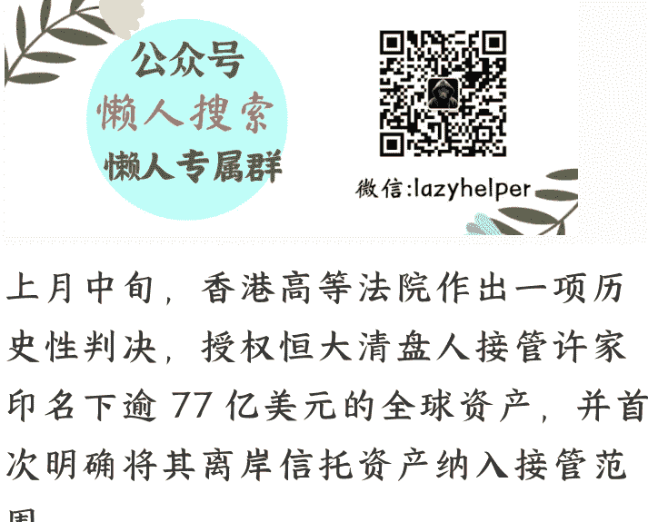

# 如何看待许家印离岸信托被击穿这件事

251013猫哥

整理:公众号懒人搜索,懒人专属群独享懒人微信:lazyhelper

上月中旬，香港高等法院作出一项历史性判决，授权恒大清盘人接管许家印名下逾77亿美元的全球资产，并首次明确将其离岸信托资产纳入接管范围。

其中包括：许家印给儿子在美国成立的23亿美元家族信托、离岸公司持有的恒大物业约35%的股权、香港豪宅、伦敦房产、私人飞机、游艇、离岸公司股权及银行账户等。

并且委任资产接管人，将联合开曼群岛、英属维尔京群岛、英国等地法院启动跨境追索程序，并签发全球禁制令。

之所以把这项判决称为历史性，主要还是因为是香港法院开了直接执行境外信托财产的先河。

不过大家在对这判决感到过瘾的同时，也不要高兴太早了。

因为个人认为，这项判决还不能彻底粉碎通过离岸信托建立财富护身符的神话，至少很多博主在这件事上，存在夸大、不够客观的解读。本期内容就聊聊这个话题。

首先，大家要知道，为啥顶级富豪都热衷于设立离岸信托？

简单说，核心原因是离岸信托在资产隔离、财富传承、税务筹划和隐私保护这 4 个功能上，正好满足富豪们的关键诉求。

- 其一，资产注入信托后，法律上就不属于个人，彻底和企业经营风险（包括债务、担保）进行隔离，债权人无法追索。
- 其二，虽然严格意义上本金动不了（注意，是严格意义，大家都懂），但富豪们可以通过规则设立，把信托产生的利息、分红或其它投资收益，定向、分期分配给受益人。这不仅是一笔可观的收入，还能有效防止挥霍或婚变导致财富分割，避免富不过三代的情况出现。
- 其三，这种渐进式分配机制，同时利用离岸地优惠税制，可以最大限度的降低税负，特别是可能涉及的遗产税。
- 其四，利用离岸地的法律保障隐私。可通过“意愿书”指导受托人，或设立私人信托公司，能够保留一定程度的控制权。

因此，对于顶级富豪而言，设立离岸信托，通俗理解就是为家族财富量身定制的“超级保险柜”和“财富传承计划”。

你说能不香吗？换作自己是一个超级大富翁，多半都要选择它。

但对于普通人，特别是债权人而言，离岸信托是一个最深恶痛绝的东西。

因为它可以让债务人留下一堆烂摊子后，就算自己身陷囹圄，跑到境外的家属仍然可以吃香的、喝辣的。

那么问题来了，充当债务人财富保护伞的离岸信托，为啥会在全球大行其道呢？

其实答案非常简单。

- 其一，这个世界的规则主要是由塔尖尖那部分人设计，人都是利己主义，设计离岸信托，本质上就是方便他人，同时也方便自己。
- 其二，为了激励社会生产效率，总得牺牲一部分公平，对创业者形成保护措施。否则有几个人愿意拼死拼活创造价值呢。比如有限责任公司就是如此，并不会承担无限连带责任。

所以，大家要明白，离岸信托并不会因为许家印这桩事而颠覆产品逻辑，许家印的离岸信托之所以被击穿，主要原因还是越界和不合规的问题导致。

这里，用通俗易懂地给大家梳理一下香港高等法院的 2 个核心判决内容：

- 第一，法院认定，许家印注入信托的资金属于个人非法收入，因为恒大从2017年开始就已经进行系统性财务造假，作为管理者，对此应该心知肚明。那么，既然明明知道已经要暴雷了，还搞大额分红，其本质就是规避债务，侵犯债权人利益。所以适用于欺诈性转移原则。同时，法院判定，许家印两口子的离婚，“缺乏真实情感破裂基础，具有显著避债动机”，资金流向与信托转移高度关联。所以，这种技术性离婚又强化欺诈证据。
- 第二，信托要合法合规，必须满足一个核心条件就是委托人必须彻底不管钱，也就是最大限度的进行隔离，保持信托独立性。但显然，许家印不是。他仍然保留过度控制权，包括投资决策权、撤销权、变更受益人权等，甚至证据显示，许家印及家属还通过信托资金用于大宗资产购买。也就是完全把信托资金当成私人银行使用，侵犯信托资金独立性原则。

用一句话形容，许家印搞的离岸信托，资金来源不合规，管理运行不合规，完完全全就是虚假信托，障眼法而言。这东西，无论是我们的大陆法系还是西方普通法系都不会认可。

搭建信托，特别是离岸信托，是一个非常复杂且专业的过程，设立的首要目的是什么？是防范子女挥霍或者婚姻风险、是隔离企业风险还是税务筹划，不同的目标直接影响后续设计环节。

那种既要、又要、还要的想法，最终结果就是让搭建的信托千疮百孔，成了自以为是的面子工程，经不起法律检验。

所以归纳总结就是，香港高等法院击穿许家印的离岸信托，并不是离岸信托崩塌了，仅仅只是许家印的个案，合规合法的离岸信托还是受保护的。

而且个人认为，香港高等法院作出这项判决，从化债的角度看，其象征意义大于实际意义，为啥？

- 其一，香港的判决在英美法系管辖区（如开曼、BVI）虽然可申请执行，但跨境配合程度如何，这还有待观察，不排除人家不鸟你。虽然CRS税务信息交换使离岸资产透明度提升，但承认和执行、以及执行深度，不是一回事。
- 就算配合执行，不要忘了，恒大还涉及几百亿美元外债，填境外的坑还差一大截，轮不到国内债务。
- 其二，恒大的综合债务是万亿级，就算不考虑冻结资产处置打骨折因素，满打满算77亿美元对应万亿债务规模都是杯水车薪。

那么看到这里，是不是就认为许家印离岸信托被击穿这件事，就没啥意义，纯粹是口嗨了呢？

当然不是，个人认为震慑效应还是很大。（这里要强调一下，并不是指所有富豪都如此，我们还是有很多富豪，人家光明正大赚钱，合法合规的）。

前面说了，搭建离岸信托是一件非常复杂且专业的活，那么对于非法持有财富的富豪而言，要满足资金来源合法、运作合规其实很难。东方人的思维和西方人思维并不在一条线上，心里总想着给自己多藏点私房钱。在这种思维的影响下，很难不留尾巴。

一旦尾巴被我们抓住，甚至通过证据固定、判决定性，那么无论境外执行情况如何，离岸信托都成了案板上的肉，无非就是由谁吃、何时吃的问题，本质上离岸信托就成了高风险产品。

还有，海外信托并不是绝对安全，在西方体制内，被击穿的案例比比皆是，特别是华人设立的离岸信托，更是被觊觎的对象，很多时候要动手，找个理由就冻结了完全有可能。

甚至要满足独立运作这条也很难做到，因为信托管理人存在不可控因素，把钱拿来做投资，通过几年时间洗大半出去都存在。很多欧美顶级富豪都是设立家族基金，名义上是慈善基金，实际上核心诉求就是钱还是要掌控在自己手上。

换个角度说，假如资金运作都合规合法了，那搭建离岸信托还玩个灯呀，排除政治因素，国内不比国外更安全呀。难道国外就没政治因素干预吗，赵长鹏就是现实案例。

所以，许家印离岸信托被击穿，虽然从化债角度看，象征意义大于实际意义，但从法制建设和金融监管的层面看，对违法所得、失去社会责任感、费尽心思钻空子搞资产转移的富豪们来说，震慑效应还是很大。

当下中国的国力，已经没多大的空间给他们花式包装逃脱监管。财富安全的底线是合法性与诚信，否则终将竹篮打水一场空。这也许是许家印离岸信托被击穿判决给国内蠢蠢欲动的富豪最大的启示。

## 最后，安利小懒的付费群：
懒人专属群（介绍）

懒人专属群持续更新中，已持续运营 6 年，整理超 3000 份各类精选付费文章 & 年费社群干货，全部开放下载。

本资料为付费群内部分享，仅供真实有需要的朋友查阅

## 懒人专属群更新记录：
- https://lazy2025.top/blog/record2

## 懒人专属群更新记录（需梯子，备用）：
- https://lazybook.fun/blog/record2