# Tiktokshop 美区跨境店代采手册

## 251013 生财精华

公众号懒人搜索，懒人专属群独享

懒人微信：lazyhelper

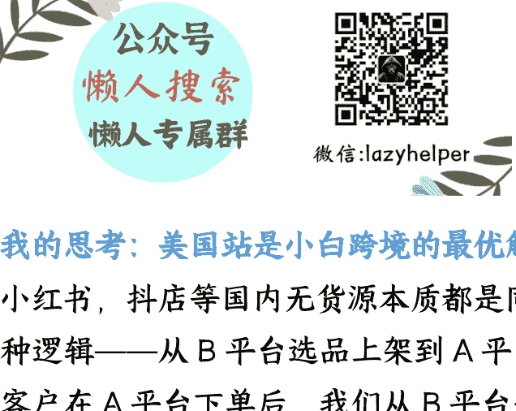

## 我的思考：美国站是小白跨境的最优解？

小红书，抖店等国内无货源本质都是同一种逻辑——从B平台选品上架到A平台，客户在A平台下单后，我们从B平台采购发货，用单号同步完成A平台履约，最终赚差价。而今天我们要聚焦的“TikTok美区无货源”，就是把这个逻辑搬到了更大的跨境赛道上。

先把核心玩法说透：这里的“A平台”就是我们的 TikTok 美区店铺，“B平台”则是所有能满足 TikTok 发货时效、单号可识别的美国本土第三方平台——比如亚马逊美国站、希音（shein）美国站，速卖通美国站，只要能做到“客户下单后，单号能同步到 TikTok 后台、时效符合平台要求”，都能成为我们的货源池。

关于利润，我给大家一个在用公式：按 B 平台原价 2.5 倍上架，再统一设置 40%优惠，最终以 1.5 倍原价成交。

美区跨境的成本里藏着很多“隐性支出”——税率，汇率，提款软件手续费等；选择 20 美金以上的产品；用 1.5 倍定价就一定守住利润，这是我经过无数次试错总结的“不亏线”。

为什么偏偏选美区，而不是大家常听说的东南亚、欧洲、日本、墨西哥？这里给大家拆解 3 个核心原因：

### 第一，成本最低，利润高；
开始我也试过东南亚五国的店铺，客单价低，利润低，不出单，空跑消耗心气；中间封店后，我和朋友 AA2800 块买英国个人本土店铺，还没上架，4 天秒没；最后自己注册执照做美区，就做美区了——美区出单后对“风险”的包容度，是所有跨境站点里最高的。

### 第二，商家数量少，竞争低。
TikTok 美区最大的优势是商家数量少、竞争低。东南亚卷烂了，新站点开店成本与准入门槛都高。

### 第三，赛道天花板高，现在入局不晚。
国内电商早已进入红海，而全球跨境电商的增量，tiktoker 是一个巨大的趋势——这里不仅有庞大的用户基数，还有“从短视频种草到直播带货”的完整闭环，甚至能结合独立站做私域沉淀。对比国内平台“流量越来越贵、规则越来越严”，美区现在还是“增量市场”：你不用和千万商家抢流量，只要会用数据选品、懂基础履约，就能赚到第一波红利。

接下来的教程里，我会带着大家从 0 到 1 搭建 TikTok 美区无货源店铺：从 B 平台选品逻辑，到 TikTok 上架技巧，再到履约避坑、利润优化，每一步都是经过实测的可落地方法。而今天这部分，既是给大家讲透“我的雷与成绩”，也是帮大家建立信心——这个赛道不需要你有百万资金，也不需要你有多年跨境经验，只要跟着这套逻辑走，就能在全球最大的跨境赛道里分到一杯羹。

## 1. 目前的店铺成绩

因为我是自己直接摸索的，所以面对全新的生态有点踩坑，但本质上遇到的问题并不多且不难；为解决我的困难，我使用了很多的第三方工具，下方提到的第三方供应商就是我认为的精华。

- 8 月 5 日：下定决心买一个执照，7 天后开店
- 8 月 13 日：开了东南亚和菲律宾的店铺，开始上品
- 8 月 14 日：开了一个美区运动户外店铺，四天后封号
- 9 月 6 日：东南亚店铺批量上品不出单，开了一个美区五金店铺
- 9 月 12 日：懒人一天上 20 个品，上够 120 个，出了第一单
- 9 月 16 日：美区店铺持续出单，因 P图太随意，收到两个违规
- 9 月 26 日：关掉东南亚店铺，开了一个美区宠物店铺
- 10 月 1 日-10 月 7 日：国庆旅游基本没管，限时折扣没续；无折扣出 3 单；2.5 倍上架；利润 150%

整段实操的总结是：30 天的时间售出 16 单 1667 美元产品，扣除杂费利润率 40%；项目想象空间非常大

| 日期 | 账号类型 | 国家 | 类目 | 平台 | 状态 | 关店 | 保证金 |
|---|---|---|---|---|---|---|---|
| 2025年8月13日 | 主账号 | 泰国 | 居家日用 | tiktok | 关店中 | 2025年10月26日 | 90美金 |
| 2025年8月13日 | 主账号 | 菲律宾 | 运动户外 | tiktok | 关店中 | 2025年10月26日 | 90美金 |
| 2025年8月14日 | 主账号 | 美国 | 运动户外 | tiktok | 已关店 | 2025年9月29日 | 500美金 |
| 2025年9月6日 | 主账号 | 美国 | 五金用品 | tiktok | 存续 | | 500美金 |
| 2025年9月26日 | 主账号 | 美国 | 宠物用品 | tiktok | 存续 | | 500美金 |

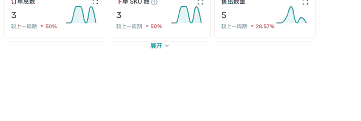

### 数据分析

首页、成长和数据分析、直播和视频、商城页和搜索、商品、营销、客户、售后

### 成长和数据分析

### 销售表现

#### Key Metrics

25天: Sep 12, 2025 - Oct 06, 2025

- 总销售额 ③ $1,667 较上一周期 -
- GMV with Tax ③ $1,157.11 较上一周期 -
- 商品交易总额 ③ $1,078.58 较上一周期 -
- 订单总数 16 较上一周期 -
- 下单 SKU 数 ③ 16 较上一周期 -
- 售出数量 20 较上一周期 -

## 2. 项目逻辑流程图

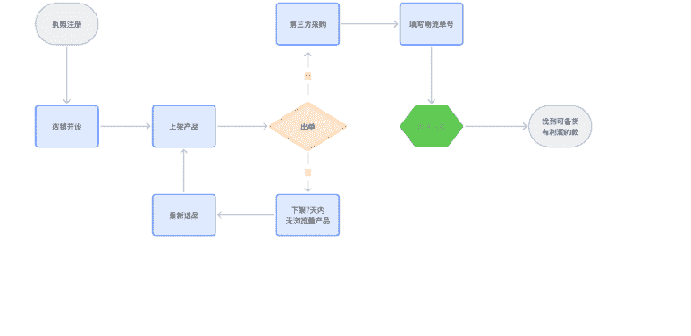

## 3. 开店前的准备工作

### 3.1 关于新开店首月费用

至少需要手上有 1w 块钱；当然，保证金我是刷卡的，我刚开始实操的时候也没出单。

| 准备事项分类 | 具体内容 | 金额 (元) | 时限 | 关键说明 |
| :--- | :--- | :--- | :--- | :--- |
| 平台保证金 | 店铺保证金 | 3560 | 永久 | 保证金500美元；10月9日汇率 |
| 代办执照费用 | 广州有限公司营业执照代办 | 200 | 永久 | 无资源，可联系推荐 |
| 注销执照费用 | 用于封店后注销 | 200 | 永久 | |
| 税务 | 测品代采生命周期短，可不办理 | 0 | 永久 | |
| 海外仓对接 | 可上传合同的共享仓库 | 300 | 永久 | 无资源，可联系推荐 |
| 收款软件 | 派安盈/连连国际-个人账号 | 0 | 永久 | |
| 代发采购 | beetle | 0 | 永久 | |
| 商品搬运 | 妙手浏览器 | 20 | 一个月 | |
| 数据分析工具 | 知和数据 | 9 | 一个月 | 无资源，可联系推荐 |
| IP浏览器 | 加速狮浏览器 | 58 | 一个月 | 优惠码: vkbn792 |
| 翻墙软件 | 快连 | 50 | 一个月 | 6.99美元 |
| 货款准备 | 店铺备货货款 | 5000 | 一个月 | |
| 总金额 | 9397 | - | | |
| 预估利润 | 2000 | - | 1.5倍上架，利润预设为货款40% | |

### 3.2 必须学会使用的工具

打开美国购物软件你得懂翻墙，不然很多网页都打不开。

## 4. 注册国内收款工具

### 4.1 连连国际

百度进入连连国际官网选择注册个人账户，绑定银行卡等待审核，需要1天，完成后依据流程绑定 tiktokshop

#### 收款展示:

今天 21:18
号码已更改为数据流量

【LianLian Global】您的账户于10月10日21:18成功入账121.03美元。可登录连连官网查看。

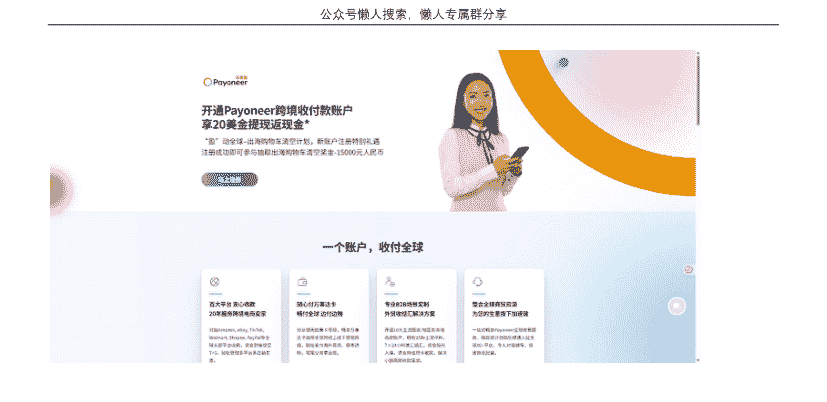

### 4.2 派安盈

百度搜索进入派安盈官网注册个人账户绑定银行卡，审核需要一天；完成后依据流程绑定 tiktokshop

### 4.3 其他软件

tiktok 后台支持四个第三方均可，无太大差别；如需开通，百度搜索即可。

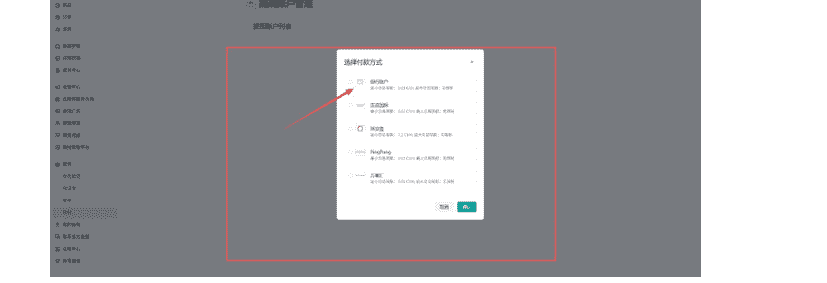

## 5. 快连注册使用教程

### 5.1 百度搜索下载安装

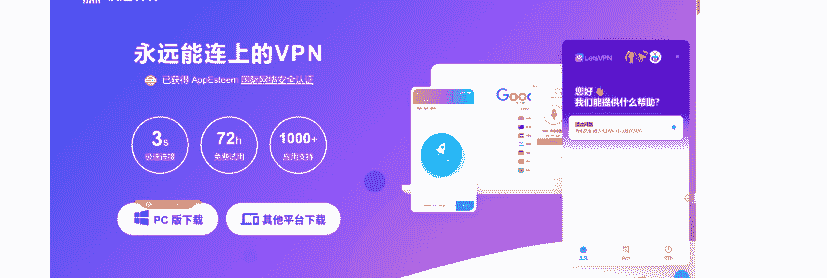

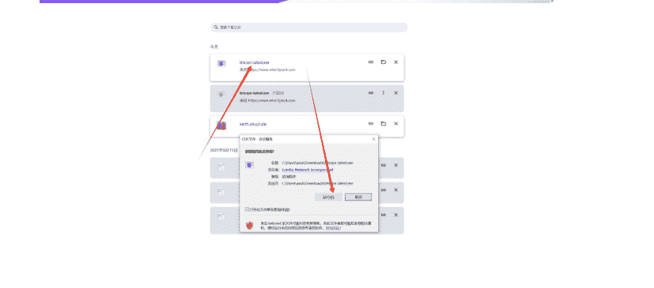

### 5.2 选择网络配置与国家

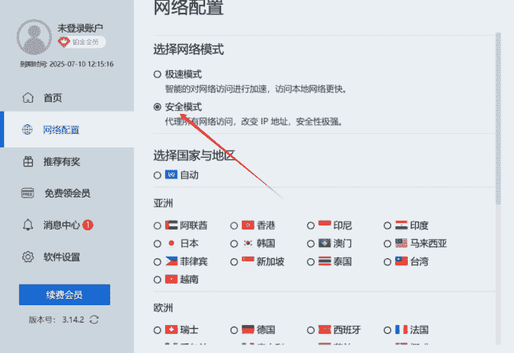

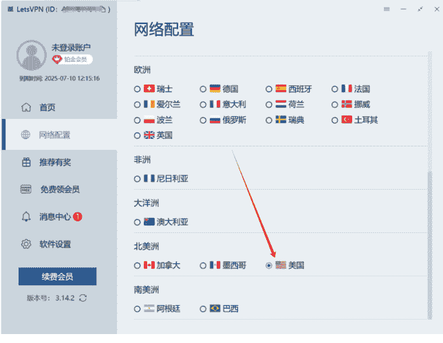

### 5.3 购买会员开启即可

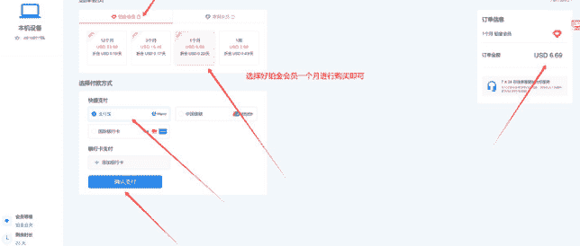

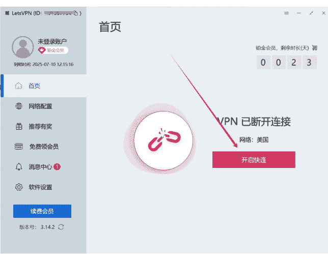

## 6. 店铺注册流程

### 6.1 营业执照查询

企业执照代办下来后一般需要7天左右再去注册店铺，可以通过企查查进行查询企业的经营状态。

一个营业执照最多入驻一个店铺，一个法人最多只能开一个店铺，否则会出现主体关联违规的行为!(8月新规)

切记不要一个法人开多个店铺，以防店铺关联二审等违规导致店铺封店。

### 6.2 IP浏览器下载

加速狮浏览器:(紫鸟，战斧都差不多，任君选择)

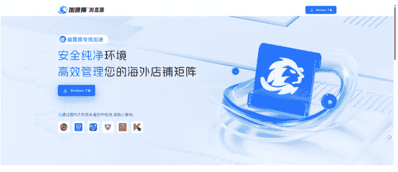

(复制到谷歌浏览器打开)

您的专属邀请码是：vkbn792，减免10元，58块钱一个月，国内最便宜的ip隔离浏览器。

| 序号 | 所属公司 | 店铺名称 | 所属平台 | 所属国家/地区 | 店铺销售额(USD) | 最近12个月销售金额(USD) | 创建时间 | 备注 | 状态 |
|---|---|---|---|---|---|---|---|---|---|
| 1 | 美国 | 旗舰店卖家2号 | 美国 | 美国 | 166,082,350.16 | 美国: 美元(USD) | 2025-10-09 12:56:28 | 2025-09-26 14:59:43 | 已激活 |
| 2 | 美国 | 五店代运营1号 | 美国 | 美国 | 38,244,113.23 | 美国: 美元(USD) | 2025-10-09 12:56:26 | 2025-09-26 18:41 | 未激活 |

### 6.3 店铺注册教程

- 1、加速狮打开搜索 tiktokshop 网址，选择商家自运营 POP 店：
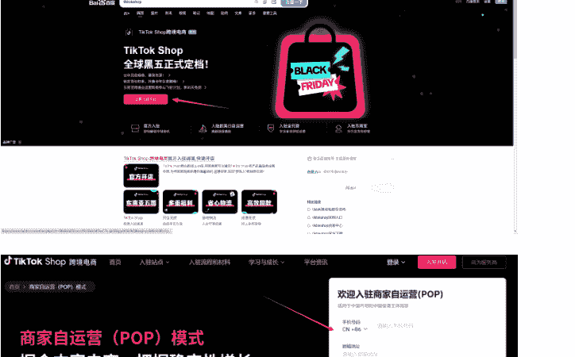
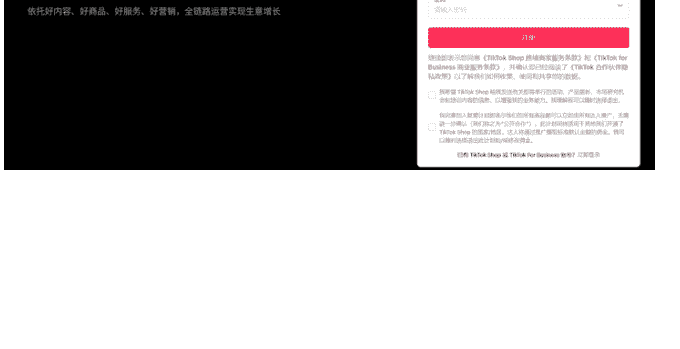

- 2、选择美国市场和填写基础信息
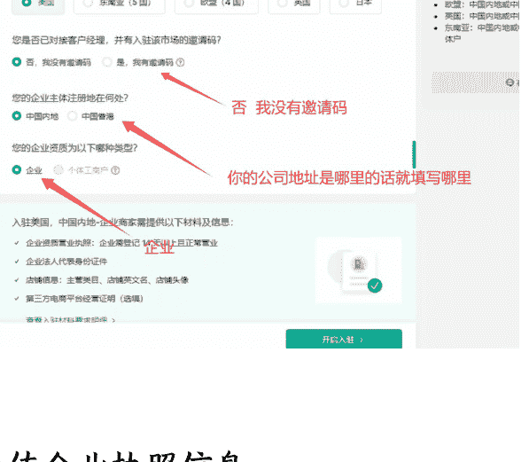
选择美国
否 我没有邀请码
你的公司地址是哪里的话就填写哪里
企业

- 3、上传企业执照信息
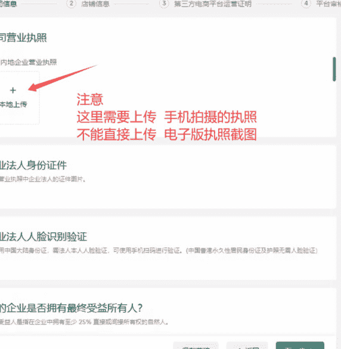
注意：这里需要上传手机拍摄的执照，不能直接上传电子版执照截图。
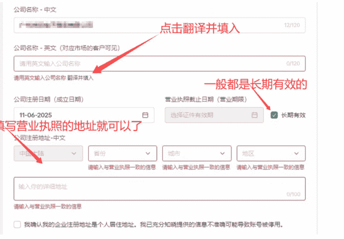
点击翻译并填入
填写营业执照的地址就可以了
一般都是长期有效的

- 4、上传法人信息与人脸识别

#### 企业法人身份证件
证件类型
- 中国内地身份证
- 中国香港永久居民身份证
- 护照

证件照片

请仔细核对下方自动填入的信息，确保与证件上的信息一致，若不一致可手动修改。
法人姓名 - 中文
法人姓名 - 英文
请输入法人英文名
0/100
2/20
请输入法人英文名 翻译并填入
证件号码
证件有效期限
18/18
长期有效

#### 企业法人人脸识别验证
人脸验证通过
恭喜您已完成企业法人张凤的人脸验证!

您的企业是否拥有最终受益人?
最终受益人是指在企业中拥有至少25%直接或间接所有权的自然人。
- 是的，我的企业拥有最终受益人
- 不，我们的企业没有最终受益人

保存草稿
< 返回
下一步>

- 5、选择店铺的类目和名称，绑定机构账号

入驻 TikTok Shop 美国 市场
公司信息
店铺信息
第三方电商平台运营证明
平台审核

主营类目
仅支持选择一个主营类目。该账号在所有国家站点只能发布主营类目下的商品，查看类目匹配商品标准
运动与户外

店铺名称与头像
店铺名称 - 英文
请输入英文名称，首字母需大写，不能使用拼音
0/120

店铺头像
本地上传

创建 TikTok 机构号
自动创建一个有电商权限的 TikTok 账号并绑定为店铺官方号，以通过短视频和直播获取订单。
需要创建 TikTok 机构号，并与店铺绑定
不需要创建 TikTok 机构号，绑定已有的个人 TikTok 账号
入驻成功后，可前往【我的账号-绑定TikTok】绑定已有的个人 TikTok 账号。

保存草稿
< 返回
下一步>

上传后点击
根据提示法人扫脸认证
是的

客户看到的店铺示例
5.0
1.2k+ sold>
选择自己想做的
建议用豆包ai生成一个店铺名称
建议用豆包ai生成一个店铺头像
TikTok 官方号示例
不需要

- 6、选择第三方运营经验与等待审核
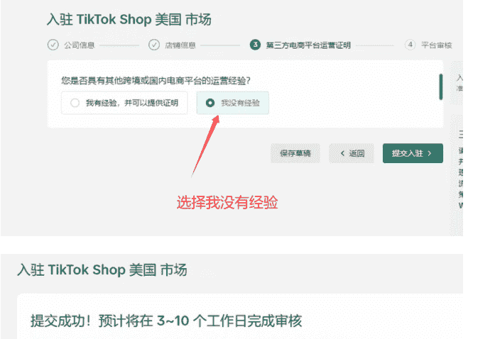
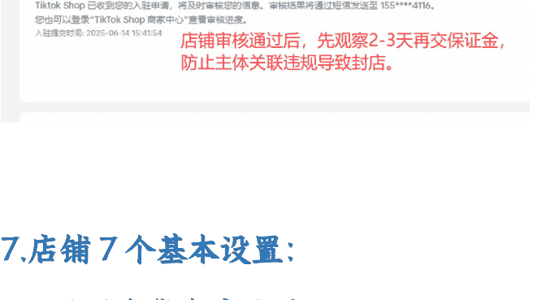

## 7. 店铺7个基本设置

### 7.1 设置发货仓库地址

在首页选择添加已合作有合同的仓库设置收发货地址（收发货地址一定要填真实的海外仓）

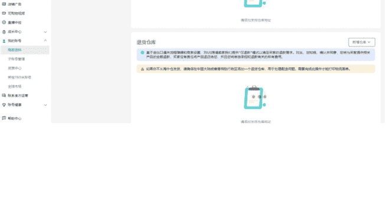

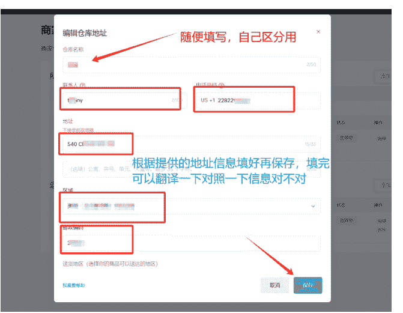

### 7.2 设置退货仓库地址

退货地址依旧选择与你合作的退换货的海外仓

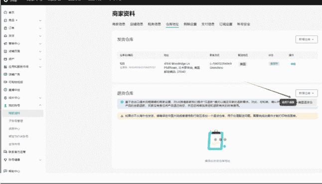

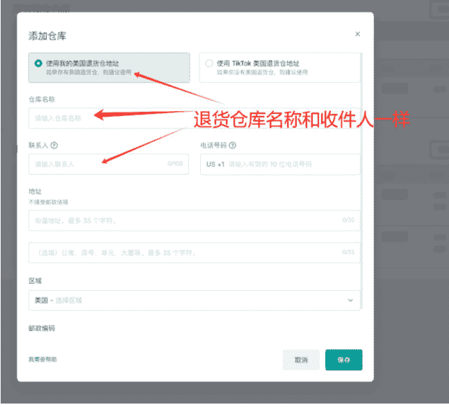

### 7.3 设置店铺运费模板

设置完成发货、退货仓库后，回到首页，设置一下运费模板，选择刚刚设置的发货仓，然后设置3.99美刀的模板。因为我们的代采包邮的品；这里我们只需要设置标准运输，快速跟经济运费模板可以不用勾选!

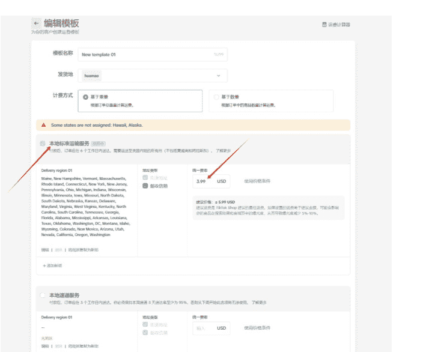

### 7.4 设置店铺税务信息

设置完成运费模板后，回到首页，点击添加税务信息，根据下图所示进行填写即可！名称填写公司翻译为英文的名称、所在地区勾选中国大陆、邮箱信息使用下方的邮箱(默认注册邮箱)、地址填写营业执照翻译为英文的地址、收入是否与在美国进行的贸易或业务实际相关勾选否，最后点击提交即可。

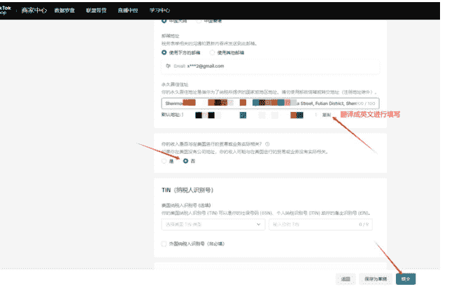

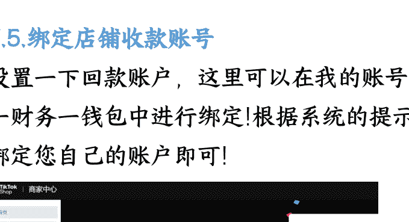

### 7.5 绑定店铺收款账号

设置一下回款账户，这里可以在我的账号-财务-钱包中进行绑定!根据系统的提示绑定您自己的账户即可!

#### 卖家钱包

供应商付款功能正式上线，抢先体验内测资格！资金余额一键直达供应商账户，省去繁琐流程，支付快一步！点击页面右侧供应商付款，开启支付新体验！

本店铺与公司账户互通，资源均可领取且提现功能，各权限已开通自动提现

对账通知
总额 7.16 USD
自动提现
跨境支付

#### 交易记录

| 交易时间 | 交易流水号 | 交易类型 | 账号类型 | 交易状态 | 金额 | 币种 | 汇率 |
|---|---|---|---|---|---|---|---|
| 2025.08.24 11:59:32 | AtzAAO... | 商户结算 | 钱包余额 | 成功 | +7.16 | USD | 1.00000 |
| 2025.08.22 21:04:56 | AcoAANv9... | 提现 | 钱包余额 | 成功 | -7.16 | USD | 1.00000 |
| 2025.08.22 12:24:31 | AtzAALC... | 商户结算 | 钱包余额 | 成功 | +7.16 | USD | 1.00000 |
| 2025.08.21 21:04:51 | AcoAAN... | 提现 | 钱包余额 | 成功 | -19.24 | USD | 1.00000 |

#### 自动提现设置

USD 自动提现规则 每个工作日提现金额大于 5000******059

JPY 打开开关可设置 JPY 账户自动提现规则，系统会按照规则发起自动提现。

CNH 打开开关可设置 CNH 账户自动提现规则，系统会按照规则发起自动提现。

### 设置自动提款与绑定第三方连连国际方便提款到国内银行卡（这一步无敌重要）

#### 设置规则
- 自动提现周期
  - 每个工作日
  - 每周
- 自动提现起始金额
  - 无起始金额
  - 自定义金额

自动提现账号
选择账户

#### 添加提现方式
- Airwallex
  - 最低提现金额: 0.01 CNH; 最高提现金额: 无限制
- 连连国际
  - 最低提现金额: 0.01 CNH; 最高提现金额: 无限制
- Payoneer
  - 最低提现金额: 1.00 USD; 最高提现金额: 无限制
- PingPong
  - 最低提现金额: 0.01 CNH; 最高提现金额: 无限制
- WORLDFIRST
  - 最低提现金额: 0.01 CNH; 最高提现金额: 无限制
- 对公银行账户
  - 最低提现金额: 0.01 CNY; 最高提现金额: 无限制

返回
继续
付款交易由 PIPO 处理，继续操作即表示你同意 PIPO 的隐私政策

如果店铺出大事了，你没有及时提款，问题会很大！你需要花很多钱去解决；第三方会收 3-15%的货款作为手续费。所以必须设置自动提款！！！！

### 7.6. 开启店铺二次认证

返回首页，点击 我的账号→商家资料，开启短信验证，邮箱验证

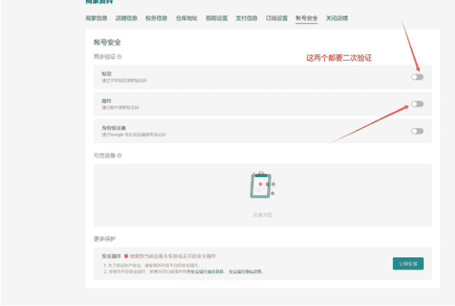

### 7.7. 缴纳店铺保证金

点击首页缴纳保证金，后期可退（店铺注册后 4 天后进行，防止法人关联和执照关联）

## 8. 注册妙手账号与下载插件

### 1. 绑定妙手插件

店铺第三方直接搜索妙手，注册妙手账号与关联店铺（做无货源离不开妙手，就像...）

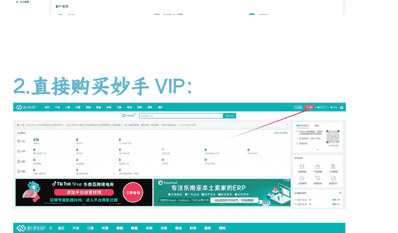

### 2. 直接购买妙手 VIP：

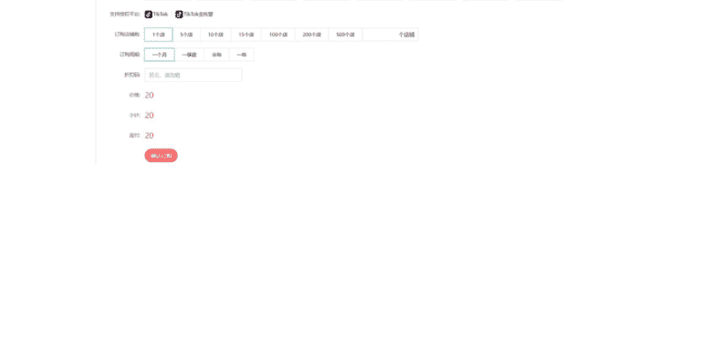

## 注意事项

这一切都需要在加速狮浏览器上进行；不可在谷歌上登录 TikTok 店铺（封号警告）

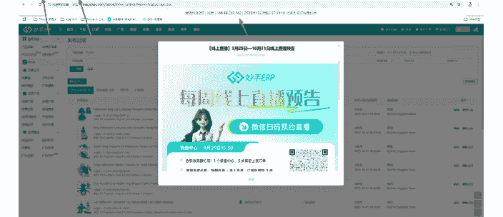

### 3. 下载妙手采集拓展程序：

打开妙手官网，选择产品采集，插件采集，安装对应的插件

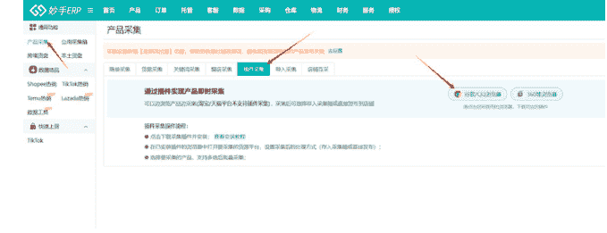

下载完成之后在拓展程序中打开与安装：

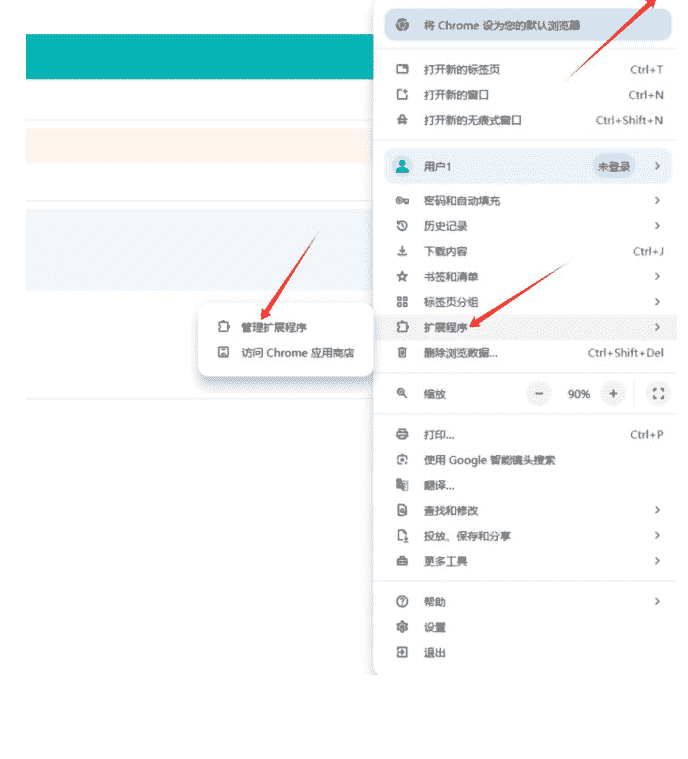

打开谷歌浏览器插件安装的开发者模式，然后打开下载好的安装包的文件夹，并将安装包直接拖入谷歌浏览器插件页面即可!

### 4. 插件单个与批量采集

安装完软件后，选择到对应的产品的图片，采集到妙手的产品库即可完成上架

#### 单个产品采集：

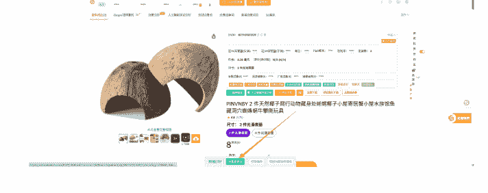

#### 关键词首页批量采集：

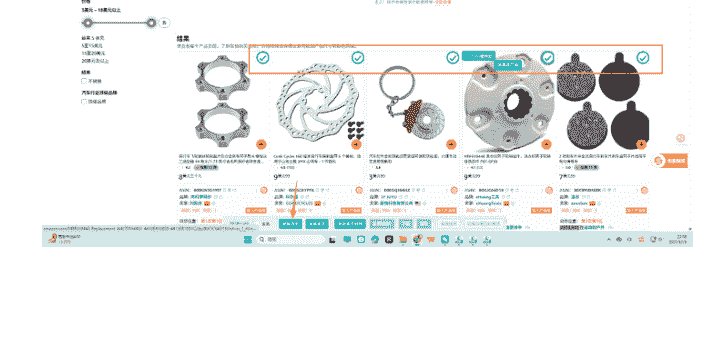

采集完成后即可在后台查看：

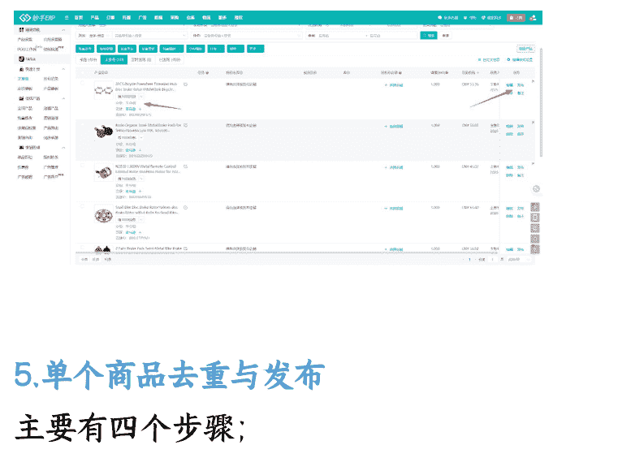

### 5. 单个商品去重与发布

主要有四个步骤：

- 1. 商品亚马逊采集演示
- 2. 商品的主图和标题品牌词去除（非常重要）
- 3. 修改后商品的批量修改价格
- 4. 修改后商品的批量上架

## 9. 注册代采软件与绑定店铺

无论是希音、亚马逊、速卖通出单发货我都不推荐自己去下单；因为我在尝试的过程中已经被封过6个希音的账号和2个亚马逊的账号；下面是我实践出来的规律。

**境外电商软件养号节奏：**

亚马逊风控太严，模拟真人用户时间太长了，不建议做。

采购 1-3 天内/每天 Shein 和速卖通只能各下 2 单
采购 4-6 天内/每天 Shein 或速卖通只能各下 4 单
采购 7-9 天内/每天 Shein 或速卖通只能各下 6 单
采购 10-12 天内/每天 Shein 或速卖通只能各下 8 单

**需提前准备：**

多个美国纯净住宅 IP（这是一笔对我来说较大的开支）

速蜂 BEETOOL 目前是我在市面上找的比较符合我预期的一个代采的供应商；服务质量和响应时间都很高；当然大家如果发现有棒的第三方，麻烦推荐给我~

| 代采平台 | 订单金额 | 佣金 |
|---|---|---|
| 亚马逊 | 100刀以内 | $1 |
|  | 100-200刀 | $2 |
|  | 200-300刀 | $3 |
|  | 300-500刀 | $4 |
| 希音 | 150刀以内 | $2 |
|  | 150-200刀 | $5 |
|  | 200-300刀 | $6 |
|  | 300-500刀 | $7 |
| 速卖通 | 150刀以内 | $3 |
|  | 150-200刀 | $5 |
|  | 200-300刀 | $6 |
|  | 300-500刀 | $7 |
| 其他说明 | B单0.3刀/单（代采后匹配B单有物流预警功能） |  |
|  | ps:自养号，一手代采，白资金。支持美金派安盈支付，欢迎各位老板测试 |  |
|  | 下单流程：注册软件+上传订单，22点前上传的订单当天采完 |  |
|  | 所有余额未用完都可以退。汇率【7.4】。服务费（10刀起充）：佣金。货款费（根据采购金额预充值）：采购实付价格金额。 |  |

公众号懒人搜索，懒人专属群分享

### 9.1. 店铺页面搜索速蜂电商工具箱

弹出链接注册，选择安装与授权后

公众号懒人搜索，懒人专属群分享

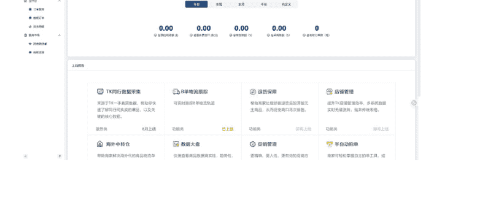

点击右上角选择客服，添加完成后对方会拉群进行服务，有疑惑就在群里咨询

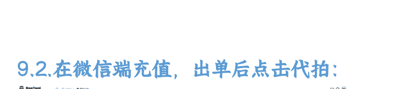

### 9.2. 在微信端充值，出单后点击代拍：

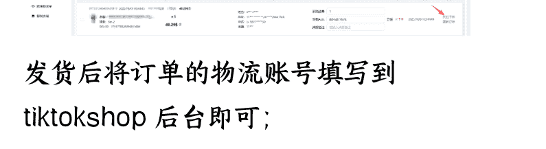

发货后将订单的物流账号填写到 TikTok Shop 后台即可；

### 9.3. 订单明细均可在后台看到；

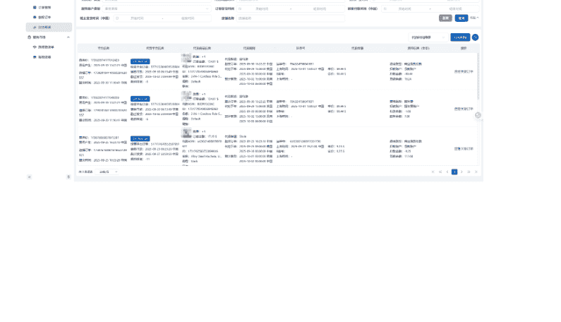

## 10. 关于违规风险与后果

### 10.1 常见违规类型罗列

| 封店风险类型 | 具体情况 | 关键注意点 |
|---|---|---|
| 关联风险 | 包含法人关联、IP 关联、注册地址关联、经营产品关联、海外仓关联等共六七种关联场景 | 避免多店铺共用同一法人信息、IP 地址、注册地址或海外仓资源，从源头减少关联概率 |
| 注册信息风险 | 开店上传信息与平台审核信息存在微小出入。需提交海外仓证明、水电账单、采购发票合同、法人出纳视频等材料过二审 | 注册时务必核对信息一致性（如法人姓名、地址与证件完全匹配），提前准备二审材料，避免因信息疏漏卡审核 |
| 侵权违规风险 - 品牌敏感词 | 未规避大众化品牌（如 LV 等），易触发疑似山寨 / 售假判定；可通过采集软件预设敏感词过滤 | 必须在选品 / 上架前用工具截取敏感品牌词，不触碰知名品牌侵权红线 |
| 侵权违规风险 - 专利侵权 | 涉及产品专利侵权，平台通常冻结产品并发送警告，未处理则升级处罚 | 上架前通过专利查询工具（如 USPTO）核查产品专利，提前规避有专利风险的单品 |
| 侵权违规风险 - 图片侵权 | 采集亚马逊图片风险高，采集 1688、速卖通图片风险较低；未改动直接使用易侵权 | 若用亚马逊图片，需精细化抠图换主图 / 详情图，或批量加水印（改动幅度超 80% 可降低风险） |
| 货不对版风险 | 平台严查材质、版型、尺码、主图宣传与实际产品不符，是无货源模式的核心查控点 | 选品时核对产品详情与实物描述一致性，避免夸大宣传（如“纯棉”实际为化纤） |
| 物流风险 | 海外仓不配合履约、提供虚假签收单、包裹丢失，且投诉率过高 | 选择合作度高的正规海外仓，及时处理物流异常（如丢失包裹优先补发），控制投诉率 |
| 虚假订单 / 刷单风险 | 海外用户抵制造假，虚假下单、恶意刷单易被平台算法标记，触发店铺风险预警 |  |

### 10.2 风险与后果

做无货源多少都沾点侵权，目前我的处理方式是只要不死店，其他都是些许风霜罢了。

| 封店风险类型 | 处理结果 |
|---|---|
| 关联风险 | 死店 |
| 注册信息风险 | 死店 |
| 侵权违规风险 - 品牌敏感词 | 扣除信誉分 |
| 侵权违规风险 - 专利侵权 | 扣除信誉分 |
| 侵权违规风险 - 图片侵权 | 扣除信誉分 |
| 货不对版风险 | 扣除信誉分 |
| 物流风险 | 扣除信誉分 |
| 虚假订单 / 刷单风险 | 扣除信誉分 |

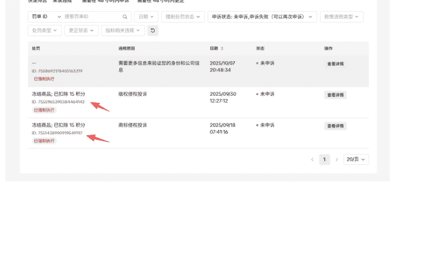

## 11. 写在最后 - 选品：

选品对于新人来说是一个非常复杂的事情，我预估一个月后有更多的心得再跟大家分享；

建议大家可以去参考生财航海实战，无论是截流，爆品复刻，测品；都有很详细的教程和理论依据。

目前我已经测出了两个品，正在走海运到美国的海外仓，转向平台的正规打法（因为备货比代采利润高 10 倍）

我会开始做短视频带货和达人带货，同时依旧保持无货源 2-3 个店的持续测品。

希望这个无货源测品的模式对大家有用。也可以配合以下文章观看，加深对这个模式的理解；

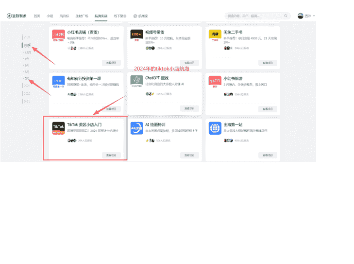

## TikTok 实操经验分享！各位详细阅读

飞书查阅详情。内容包含：项目介绍、执行过程、短视频和直播 SOP 以及后续发展方向等。关键要点包括：

- 1. 项目优势：具有高客单、高复购特点，团队全矩阵日收益最低3万美金，月均超100万美金，C端复购率超40%，常获B端大单。
- 2. 执行过程：准备阶段确定产品定位，搭建基础能力，做好网络与设备准备；实施阶段通过短视频和直播 SOP 进行引流变现。

## TikTok 小店无货源模式，新手第一个月盈利 5000+ 复盘：

大家好，我是北苑，大二加入的生财，现在快4年啦！！！我从4月16号开始做 TikTok 无货源，4.20号上架选品，4.21号就出单了，算是上架即出单。

目前做了一个月，每单利润在几十到一两百人民币不等，首月盈利是5000人民币。

这篇内容主要分享关于 TikTok 无货源的具体玩法。感兴趣的小伙伴可以转到飞书阅读：

https://zpbk45x53e.feishu.cn/docx/F1uUdMqyFoiC6zxZuFIC3bpdnmJ?from=from_copylink

感谢观看。

## 最后，安利小懒的付费群：

### 懒人专属群（介绍）

📚 懒人专属群持续更新中，已持续运营 6 年，整理超 3000 份各类精选付费文章 & 年费社群干货，全部开放下载。

本资料为付费群内部分享，仅供真实有需要的朋友查阅 🙇

## 懒人专属群更新记录：

https://lazy2025.top/blog/record2

## 懒人专属群更新记录（需梯子，备用）：

https://lazybook.fun/blog/record2