## 【2.0】1个月用小红书ip+蓝v+自然流的方式快速跑通海外生活服务赛道0到1 251013 生财精华

公众号懒人搜索，懒人专属群独享

懒人微信：lazyhelper

公众号：懒人搜索
懒人专属群

微信：lazyhelper

## 一、前言：从倒闭所有公司到跑通海外项目

大家好，我是易芝。

一个普通的连续创业者，21年毕业后靠知乎好物赚到第一桶金，23年又因为第一次开公司没经验，把赚的钱亏了回去。去年9月，我关掉公司，兜里揣着迷茫，参加了几次生财的线下航海活动散心，最后在今年2月，把自己“扔”进了生财的联合办公空间。

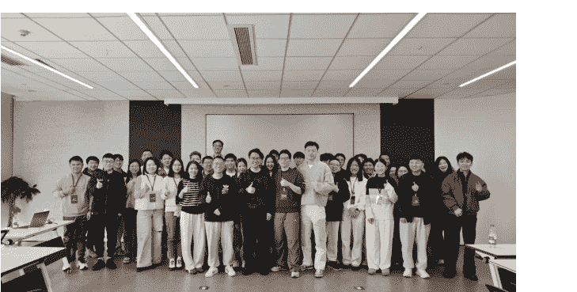

很幸运，在这里，我遇到了新的合作伙伴，找到了新的方向——小红书海外项目。

我们用一个月时间，从零跑通了一个海外某生活服务赛道的 0-1 闭环，通过【“自然搜索流+蓝 V 付费”的打法，获取了 150+的精准客咨，成交 60 单，实现了 8400 元的收入】，做到了当月回本。

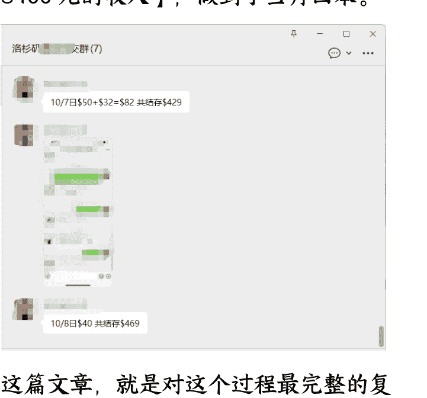

这篇文章，就是对这个过程最完整的复盘。我将毫无保留地分享我们是如何判断赛道机会（Why），如何用 SMART 原则拆解目标（What），以及我们具体的矩阵获客策略（How）。

我希望这篇文章，能对以下圈友有真实的价值：

- 正在寻找低成本、高确定性项目的探索者
- 希望将运营个人能力，升级为可复制的团队系统的管理者
- 对小红书同城及海外赛道感兴趣的流量操盘手

## 二、判断与选择：为什么是这个生活服务赛道？

一个项目的成败，80%取决于开始前的判断。我们判断一个赛道值不值得做，主要看三点：需求是否真实存在、平台是否存在机会、以及我们自己是否具备优势。

### 需求验证：在评论区里“捡钱”

我们选择这个赛道的起点，非常朴素。我们通过工具，抓取了大量小红书上关于海外生活的笔记，然后一篇篇去看。我们发现一个很有趣的现象：在大量关于海外的笔记下面，都有“求联系”、“求推荐”的评论，但很多博主并没有回复和承接。这些掉在地上没人捡的线索，就是最真实的需求。这证明了：需求真实存在，但服务供给严重不足。

| 用户 | 评论内容 | 时间/状态 |
|---|---|---|
| Guht | 你好，请问地址和价格 | 2024-11-24 |
| 🌸Sun💎shine🦋 | 价格? | 2024-10-30 |
| Christian | 请问价格和联系方式? | 2024-05-30 |
| 用户已注销 | 怎么收费 | 2024-05-27 |
| 🍪 | 请问价格 | 2024-02-11 |
| 喜欢呆在没有天花板的地方 | 私信这边可以看一下不 | 2024-01-10 |
| Jz | 求联系方式 | 2023-12-13 |
| sallyisgood | 怎么联系 | 2023-12-09 |
| 小陈yyds | 看一下私信 | 2023-09-11 |
| Mushroom | Monobello有一家，中文粤语英文都会说。Vincent C. Cheng, DDS | 09-15 美国 |
| 白菜信息咨询 作者 | 谢谢，我查一下打个电话问一下 | 09-15 美国 |
| machi | 我想找家靠谱又不太贵做个牙齿矫正 | 09-15 美国 |
| 辛德瑞拉 | 蹲 | 09-16 美国 |
| 邪恶棉花糖 | 蹲蹲，最近也在查哪家好😥 | 09-15 美国 |
| 小红薯6265983344 | 您好，懷恩牙科西科汶納 / 奇諾 / 爾灣都有診所，私您了🥰 | 6天前 美国 |
| 白菜信息咨询 作者 | 🥰谢谢 | 6天前 美国 |
| 小肥薯要减肥啊啊 | 蹲e | 09-15 美国 |

### 平台机会：国内打法的“降维打击”

我们做的虽然是海外项目，但目标用户是海外华人，他们依然在使用小红书。但我们发现，大多数海外本地商家，并不懂国内这套成熟的内容打法。

以“汽车改装”为例，你搜国内任何一个城市，出来的封面、标题都极具营销感和冲击力。

但你搜海外的华人聚集区，比如洛杉矶，内容还处在一个非常“野生”的阶段。

这意味着，我们完全可以把国内已经被验证过的、成熟的内容模板，直接“迁移”到海外赛道，形成“降维打击”。

以汽车改装举例子，直接搜地区+项目名称，几乎一整屏幕都是可以用的。

北京

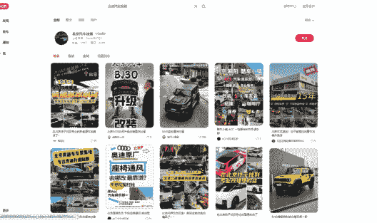

杭州

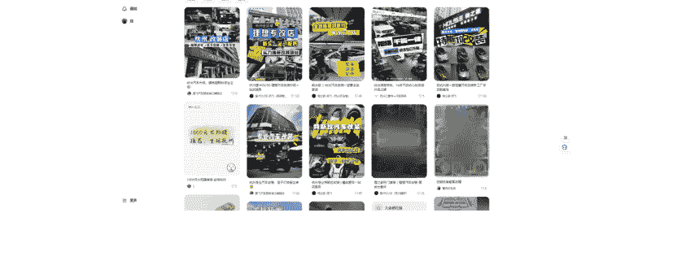

深圳

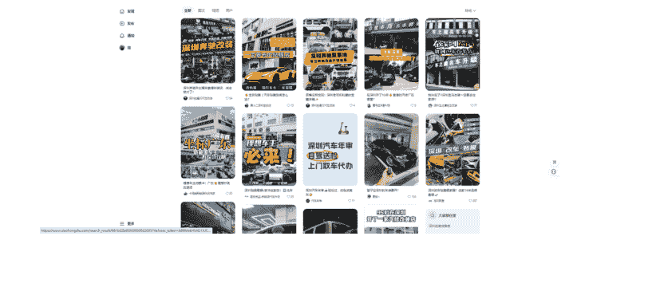

我们再看海外

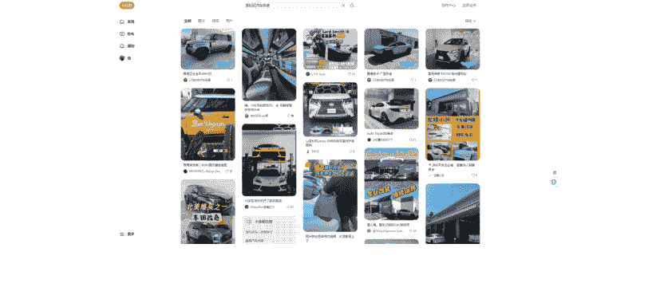

真的把国内的封面模版全部做一遍到国外，我们就可以把这个赛道打下来了。

### 自身优势：刚需高频，快速回款

我上一个做的海外项目是一个高客单、低频的业务，虽然利润高，但回款周期长，对现金流压力略微有一些。

所以这一次，我刻意选择了一个“刚需+高频+低客单”的赛道。

这个生活服务赛道完美符合这个模型，它能让我们快速验证模式，并获得正向的现金流，来支撑我们后续更大胆的尝试。

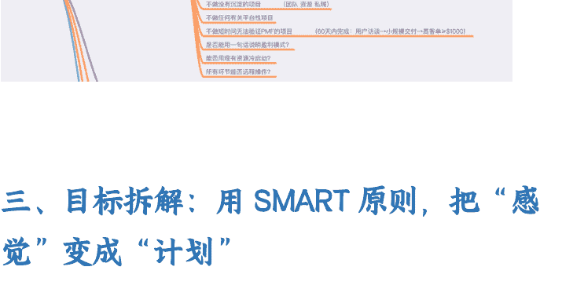

## 三、目标拆解：用 SMART 原则，把“感觉”变成“计划”

方向对了，下一步就是把目标变得具体。我们严格使用 SMART 原则来拆解。

目标： 月营收达到 2000 刀

拆解： 营收 = 客单价利润 × 转化率 × 客资数。

反推： 假设我们的平均客单利润为 100 元 RMB，预估转化率为 40%，那么我们需要 350 个客咨才能完成目标。350 个客咨分摊到 30 天，每天需要获取 11.6 个精准客户。

有了这个清晰的目标，我们就可以把工作拆解得无比具体：

- **S (Specific - 具体的):** 为了获取 350 个客咨，假设最差情况“一篇笔记带来一个有效客咨”，我们需要发布 350 篇有质量的笔记。一篇笔记由“5 张图+1 个标题+1 段正文”构成，我们需要准备 1750 张素材图，和大约 70 个笔记模板。
- **M (Measurable - 可测量的):** 素材准备： 搜集图片（17.5 小时）、制作封面模板（8 小时）、搜集标题模板（16 小时），总计约 41.5 个小时，分配给 7 天完成。内容发布： 350 篇笔记，分配到 8 个账号（2 个主号+6 个素人号），一个月发布完，平均每个账号每天发布 1-2 篇。
- **A (Achievable - 可达到的):** 素材来源： 图片素材可从国外的大众点评 Yelp、Google Map 商家评论区获取。标题和内容框架，可大量借鉴国内成熟赛道的模板。这个工作量是完全可以达成的。
- **R (Relevant - 相关的):** 我们所有的动作——找素材、做模板、铺关键词——都直接服务于“发布 350 篇笔记”这个核心指标，而这个指标又直接关联着“每天获取 11.6 个客咨”的最终目标。
- **T (Time-bound - 有时限的):** 我们设定了清晰的里程碑：第 7 天完成需求验证和素材准备 -> 第 14 天稳定日更并获得第一批客资 -> 第 21 天转化流程成型 -> 第 30 天实现净利润转正。

SMART 原则
- S：具体的
- M：可测量的
- A：可达到的
- R：相关的
- T：有时间限制的

通过 SMART 的拆解，一个模糊的“赚钱想法”，就变成了一张清晰的、每个人都知道自己该干什么的“作战地图”。先算明白获客数，然后就是内容量和付费量的事情了。

## 四、执行策略：我的 “IP+自然流+蓝V付费” 打法

地图有了，怎么打赢这场仗？我们的核心打法，可以概括为“一个中心，两个基本点”。

### 一个中心：以 IP 为信任基石

在小红书这个“人生地不熟”的市场，信任比什么都重要。所以，我们从一开始就决定，必须后端的人员有露脸出来做 IP。

建立联系： 账号被封是常态，但用户的记忆不会。当主关键词下 10 篇笔记有 7 篇都是你的脸时，用户就已经对你产生了初步的信任。【真的挺恐怖的，站在一个用户角度，搜关键词全是这张脸，不记住都很难，这时候后端的交付还不错，前端积累的势能就会越来越强】

具象化卖点：不要说“我们团队很专业”，而是把卖点融入到具体的服务细节里。比如，“连客户自己都没要求的XXX，我们都会做到位。”这种可被感知的细节，远比空洞的口号更能建立信任。

### 两个基本点：自然流铺量，付费流放大

#### 矩阵策略与关键词占位

我们采用了“2个官方蓝V主号 + 6个素人分发号”的矩阵策略。

为什么开蓝V？交保护费，换账号稳定。我之前没开蓝V的账号，被红书秋后算账，违规一片。而蓝V号至今安然无恙。在人家的地盘赚钱，就要遵守人家的规则。

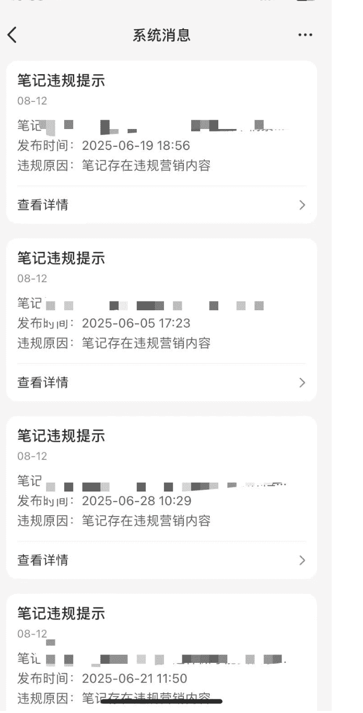

#### 关键词策略：这是自然流的灵魂

摒弃无效铺词： 我们不做泛流量，只做精准流量。通过深度用户调研，我们放弃了那些看起来流量大但转化意图弱的泛词，聚焦于“城市+具体场景+需求”这类精准长尾词。

标题公式： 城市 + 具体场景 + 结果/解决路径。并且，我们用表格记录每一篇笔记埋了哪个关键词，确保核心阵地都被占领。只有把这些细节做到位，你才算从 “知道” 关键词重要，进入了 “做到” 的阶段。

城市一定要带上，这可以说是标题里必须一定要带的词，带了这个词，能收录到主词下面去，总有被看到的可能性。并且随着动作的细化，我让员工在做标题的时候，前面又加了一列，关于这个关键词完整地埋下去了哪个关键词。比如我的关键词有洛杉矶A,洛杉矶B,洛杉矶C,洛杉矶D。

前期做了这个动作，后期做阅读复盘的时候就不让他们回头去再给一个个标题打上使用的关键词，因为随着对项目的理解，就能挖掘有效关键词，对于没有铺满的加多一点去铺，满了的就再铺一点下去。

我觉得做运营最重要的在于知道和做到是两个事情。知道要弄关键词，把关键词埋入标题，正文，参加过红书航海过的圈友应该都知道这个道理。但是真正做到这种细节的圈友应该不多吧？

只有做着做着，在关键词的布局上有了体感和信心，你才过了知道的阶段，到了做到的阶段。

| 查找选项 |
|---|
| 洛杉矶 |
| 洛杉矶 |
| 洛杉矶 |
| 洛杉矶 |
| 洛杉矶 |
| ... |
| 洛杉矶 |
| 北美 |
| 北美 |
| 北美 |
| 洛杉矶 |

真没有想象那么贵！

#### 内容制作模板化

##### 2.1 封面图

为了实现规模化生产，我们把内容制作的每一个环节都变成了 SOP 和模板库。

封面模板库： 我们购买了多个 “稿定设计” 会员，强制要求所有内容人员把模板沉淀在云端。这样做的好处是，即便人员离职，下一个新人也能立刻上手，保证风格的统一。

我所有的项目都是单开一个稿定的会员，然后专门让一个内容去负责一个项目。

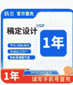

##### 2.2 标题【标题这一 part 已获珍妮授权】

一般来说，小红书文字标题【注意是文字标题，不是封面标题】需要有以下信息：

1) 植入你的城市（这样方便别人通过搜索功能搜到你。）
比如我们是深圳厨艺班，你就要植入深圳。如果你不植入你的城市，可不可以呢？也可以，但是客资来的可能没有那么精准。

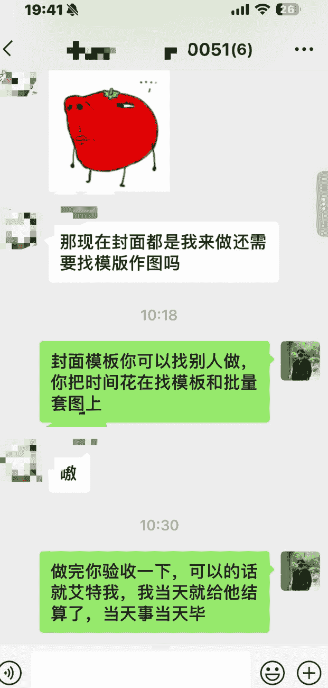

小红书是这样的：
如果你的笔记出了爆款，比如超级多人阅读点赞收藏评论你的笔记，他就会把你的笔记推给下一个更大的流量池，让更多人看到你的笔记，哪怕你没有在一开始植入你的城市，但只要你的笔记爆了，你的笔记就可能被全国的人看到。

但是，如果你的笔记没有爆，你还不在文字标题里植入你的城市，那你就很难来精准客资了。因为当你的笔记没有爆的时候，你只能依赖【客户主动搜索】带来的流量。比如有客户主动搜索【深圳少儿厨艺】，刷到你了，诶？然后可能就找你下单了。

2) 植入你卖的产品/服务（这一步非常关键，如果你不植入，客户大概也没法通过主动搜索搜到你了）
比如我们做少儿厨艺班，那你文字标题里就要植入“少儿厨艺班”或者“儿童厨艺班”。

如果你连产品或者服务都不植入，你只在文字标题里说一句：老母亲好开心，儿子长大了。

那就完了。只要你的笔记没有成为爆款，你的客户大概率都没法遇到你了，而且你的标题一定要足够细分。如果你写“厨艺班”，那你的效果大概率没有“少儿厨艺班”好。因为“少儿厨艺班”吸引的是家长，家长会愿意为了孩子花钱。你如果只写“厨艺班”，那你就可能遇到成年人了。成年人要为自己负责任，他们的钱全是我辛苦赚的。（富二代除外）成年人可能找你学厨艺还得找你讨价还价，这很麻烦，你吸引家长的话，家长为了孩子的成长，一般不会找你讨价还价消耗你的时间，比如珍妮帮自己在佛山遇到的神仙化妆师在线上获客过，我的化妆师，她写了一篇小红书笔记，文字标题是：“素人改造化妆”，那她这样做，她吸引到的客户就很不精准。因为“化妆”，可以细分到“新娘妆”“日常妆”“约会妆”等等。

如果只说改造化妆，一般没有那么多客户会特意去搜索“素人改造化妆”这个词的。大家要化妆都是有目的的，比如我临时有晚会要参加，我搜索“晚会妆”，我要结婚，我搜“新娘妆”，我想学化妆，我就搜“学化妆”“化妆私教”“化妆小班课”“化妆大班课”等等。

你只有提前去想：客户会因为什么原因搜到你，遇到你，你才会知道你要怎么写文字标题。

3) 植入你的产品价格,如果有必要的话。但不是每次都需要把产品价格明码标价出来,尤其是这次厨艺课,有可能后面会涨价,如果你前期就明码标价,可能后面就不好弄了。所以你可以写的模糊一点,你写成“白菜价”,而不是把价格直接标记出来。

4) 去小红书上搜“美食爆款标题”
“2024 美食爆款标题” “2023 美食爆款标题” “2025 美食爆款标题”,把里面的标题格式拿过来,套一套,改一改。如下图:

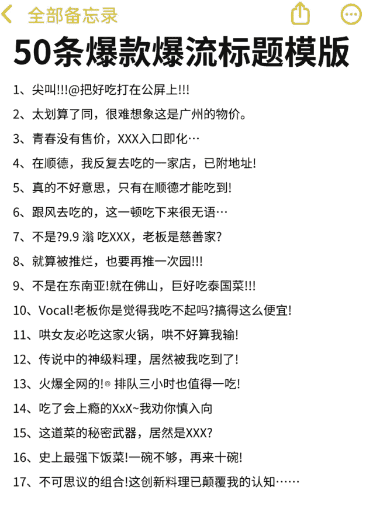

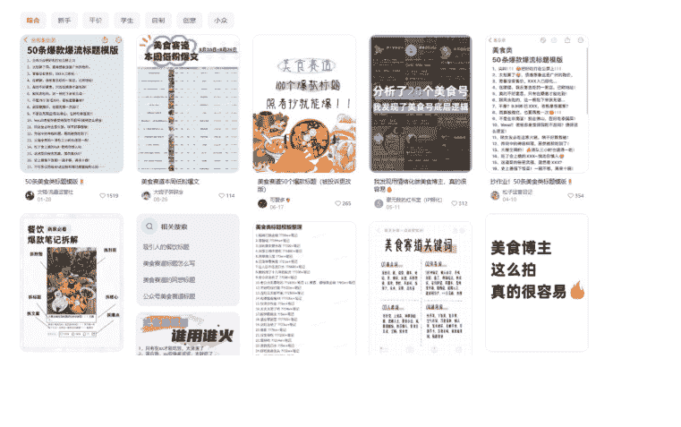

我把这个标题改成洛杉矶 XX 赛道，就变成了：

| 序号 | 原始标题 | 适配洛杉矶标题 | 备注/其他 |
|---|---|---|---|
| 1 | 标题测试 | | |
| 2 | 在上海，我最怕倒闭的本帮菜餐厅。 | | |
| 3 | 来上海必打卡的本帮菜餐厅，问1000次都是这家 | | |
| 4 | 感谢网友推荐，真的没让我失望 | | |
| 5 | 答应我，下次见面一定要这样拍 | | |
| 6 | | | |
| 7 | 严重低估的XX小众城市，真的有被惊艳到! | | |
| 8 | X元玩到爽!!国内适合穷游的XX个城市 | | |
| 9 | 打卡XX睡了2个月的酒店，果然绝美! | | |
| 10 | 不懂就问，如何花不到1000在XX玩5天! | | |
| 11 | 一直以为XXX很贵，直到我亲自去了一趟 | | |
| 12 | 这家12万平米小城，凭啥一年有3亿人来? | 这... | |
| 13 | 去住了北京100元内的青旅...已经这样了吗? | 去找了浴... | |
| 14 | 不懂就问，去XX玩，花了500算多吗? | 不懂就问洛杉... | |
| 15 | 《国家地理》诚不欺我，被严重低估的XXX | 小红书诚不欺... | |
| 16 | | | |
| 17 | XX后劲太大了!|真实旅游感受 | } | |
| 18 | 问爆了n遍的XXX问题，这里有最全答案： | { | |
| 19 | 突击检查，你的XXX是否符合这些标准? | | |

同样的做法，你还可以去小红书搜索“长沙足浴”，把你找到的爆款标题套到儿童厨艺赛道：

如下图，这是搜索“长沙足浴”能看到的小红书前两页的爆款：

我们现在把上述红圈的标题变一变：

原标题：长沙女生你们的嘴可真严啊.... 现在我改成：深圳妈妈你们的嘴可真严啊...

原标题：体验了一把男团足浴，狠狠共情男人了… 现在我改成： 娃体验了一把儿童厨艺班，狠狠解救老母亲了…

原标题：但凡你闺蜜有点实力，躺在这里就是你 现在我改成： 但凡我儿子有点实力，下班等着喂饭的就是我。

原标题：刚落地长沙选哪个好啊 在线等 现在我改成： 周末了送儿子去哪个兴趣班好啊 在线等

当然，你会发现：以上这种标题，并没有完全尊重“植入具体城市”“植入具体服务/产品”的规则，

那是因为：他这是足浴赛道，他就是要靠这种几乎全是男模的封面去博人眼球，我们做儿童厨艺赛道的，基本没法有这么博人眼球的封面。

那么：当你文字标题里没有“植入具体城市、服务、产品”的时候，你一定要在你的文案里去提到“城市、服务、产品”，尤其是在第一段就提到。此外，你要在封面标题里把“城市、服务、产品”放进去。这样可以弥补你文字标题里没有植入的遗憾。

##### 2.3 正文

正文框架： 我们沉淀了多种正文框架（如痛点共鸣型、服务对比型、客户好评展示型），让内容生产变成“填空题”，而不是“作文题”。

我们认为这就需要把内容做一个框架性质的拆解，并且做出对重要要素的判定，能帮助批量的内容达到及格线往上。

内容来说，分为开头、中间和结尾，那我们拿中间来举例，我认为存在 3 个要素：
- 第一，用户卖点的要素。卖点里存在核心的痛点，我认为起码有三个点的痛点和四到六个不等的痒点。
  那我们一篇内容大概会提到三个点，那我们可以是一个核心痛点加两个痒点，或者两个核心痛点加一个痒点。
- 第二个要素是文案的表述形式。一句话是可以由很多的表达形式的，所以说如果我们自己想不出来的话，我们可以让 AI 写也可以去找对标，把对标文案里面的总结出来。

### 第三，文案衔接
不同的文案为什么看起来不一样？在中间段里面我们就不能叫他框架了，我认为他是一种衔接，就是他把相同的卖点用不一样的话衔接起来让你有了相对不同的感觉。基于以上 3 点就构成了中间段为什么看着非常不一样的感觉？

再加上开头和结尾的话，那一篇内容就出现了五个要素，而现在我们让基础员工在做的事情就是不断地积累这五个要素作为变量，只要这五个要素库的变量越多，我们就可以组出更多的内容，并且观感不同，质量也有一定的保证。

在表达清楚这个逻辑之后，我还希望稍微再讲多一点点，帮助大家改观一个对于内容的认知点。

### 这是亦仁老大在星球的观点
信任来自于内容的频次闭环，而不是一条爆款。
内容→信任→产品→服务→内容……内容是起点也是终点。
每一轮都积累信任，每一次闭环都带来更多可复用资产。
所以内容更新的频次，能持续可持续才是交易的轮子。

商业模式，大多时候是结果论而推导出来的。但是，顶级设计的那个位置和方向，更多是方向对，就干的过程。
所以更新频次上来，和内容质量的问题，频次始终要保在第一位。因为，里面有时间空间上的巨大变量。好的内容好着发，不好的内容就不好着发。因为，好不好那个评价，是用户视角。因为用户视角的认知，参差不齐。一个怎样的内容，就会钻进喜欢那类内容的黑洞里去。

我们很多时候做流量就是进入了死胡同，就是太执着于内容本身，我们是来平台做流量的，不是来做内容的，所以我就开始尝试新形式，做内容，我不会和科班学习，我只信奉一条铁律，那就是对手做出结果的事，我们只需要模仿就可以了，就是极致的去模仿对手，这就是最大的内容策略。

##### 2.3.1 正文框架上看
| 渠道 | 选题强化方向 | 原始链接 | 选题类型 | 播放大小 | 客户精准度 | 我做的有用的说明 | 我觉得有用的说明 | 选择原因 |
|---|---|---|---|---|---|---|---|---|
| | 已经开学半个月了，直播？开课？都是有用的吗？ | 0.71 复制打开抖音，查看【小北学姐的内容】是你吗？想要？评论区还没动吗？# 开课啦 ... https://v.douyin.com/... Kbw= 1205 HeSJ | | | | 1. 标题为用户观看与开课转化做的铺垫，这样的开头转化... 2. 第二个作用是deepseek生成的金句，利用提示词生成开篇的钩子（前3秒文案，研究问题，就是第11课的内容生成指令），能快捷示范提问截图。最终进一步deepseek生成视频素材库、完整标题、设备格式等等图文视频，补为一体。建议没有短视频时候先作为参考，为我的产品引进做铺垫。 3. 送课件（产品展示） 15分钟生成开课报告，从公众号打开（内容是签到扣底），进入后网站介绍每个模块简单介绍一下，剩下的就是我们在看到的操作视频。 | 1. 评论5个整车用户评价，回复基本都很真实... 2. 内容输入对应文案，主播扩... | 1. 可以站在... 平台。 2. 视频内容制作成本低... 和这一样。 |

- 1. 选题类型
你需要概括这篇具体选题是什么？有时候你觉得这个内容好，但是一概括出选题，你会不会觉得这个内容选题不对，做了也白费。

- 2. 赚钱的大小
我们发内容是为了搞到流量，而流量越精准，我们的成交单数越多也就决定了我们赚钱就越多。这里最重要的一个思路就是我们应该提前假设这个选题能不能赚到这么多钱，如果不能赚到的话，那你做他就没什么意义。

##### 3. 客户精准度
因为我们的观点是精准流量大于泛流量，所以我在挑内容的时候，我觉得这条内容没有什么精准客户，哪怕流量很好，我觉得也是没什么用的。当然，我也看到后期为了把这个账号的流量推大也是需要一些流量，并且你的销售团队能够做好分流量标准，那我觉得你可以去做一些客户精准度没有这么高的选题。

##### 4. 我觉得有用的观点
有用的观点可以从内容里产生也可以从其他渠道看到能佐证你这条内容是有用的观点。这样做的好处是能够帮助你更加理解业务，也理解这条内容为什么火的原因。

##### 5. 选择理由
最后一个观点，其实就是综合前面的几个要素，最终对内容做出假设。所有的这一切动作都是为了让你更加的了解，以及对内容火不火做一个假设，而数据就是给你这个假设的答案。数据好，那你的假设成立你就多按照这个逻辑去推进内容，如果数据不好，那就重新假设继续做内容验证。

这个方法我觉得挺有效的，但是也挺笨拙的，刚学会这个方法的时候，我想着自己做 500 个选题，但是做到 100 个选题的时候，你对这个项目已经跟同行差不多了。

##### 2.3.2 正文素材上看
有了选题的分析方法，依然免不了找对标过程，从对标里面我们如下这些好东西
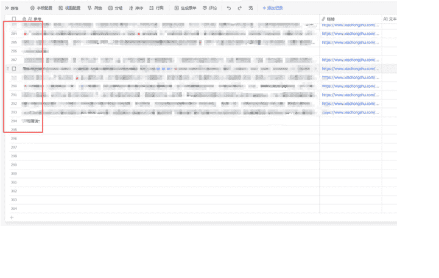
- 1. 能把文案的框架拆解出来直接让 AI 使用
- 2. 能把每个卖点不同的描述方法拆出来下次使用
- 3. 用户自己查看不断加深对项目痛点和用户体验的理解
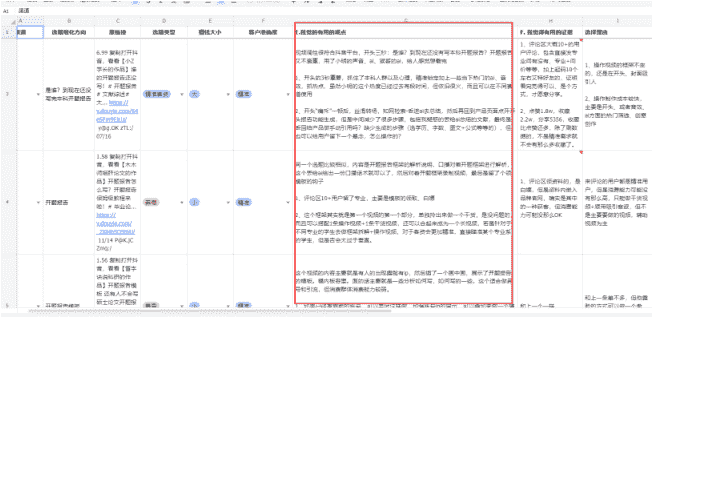

| | A | B | C | D |
|---|---|---|---|---|
| 2 | | 1 | | |
| 3 | | 2 | | |
| 4 | | 3 | | |
| 5 | | 4 | | |
| 6 | | 5 | | |
| 7 | | 6 | | |
| 8 | | 7 | | |
| 9 | | 8 | | |
| 10 | | 1 | | |
| 11 | | 2 | | |
| 12 | | 3 | | |
| 13 | | 4 | | |
| 14 | | 5 | | |
| 15 | | 6 | | |
| 16 | | 7 | | |
| 17 | | 8 | | |
| 18 | | 1 | | 玻璃 |

用户调研 → A语料库（包含私域话术）
用户沟通话术整理
今天修改
这个素材怎么来的？
这个素材如果变了，那么客户会见到什么？
这个素材如果取消了，那么客户会见到什么？
好的过程（服务过程）：
有想法的（适合引流）
关于…做了3个…背后的故事
分析评论区
跟着A公司删帖员介绍
…方法论：A1具体介绍
私域聊活技术
1
2
9月3.8版本
g
实更近约A客户吃与服的需求的理解
一、国内与A的区别：
1. 我们…客户是什么户？
二、A方面的建立
三、了解每个…需求特点，对应下沉
五、海外A…特点是什么？
2. 自然

##### 2.3.3 正文数量上看
9 月份的最后让这个项目的员工最后做下阅读复盘，这位员工的大概为两个项目一共做了 1400 套内容，并且每套笔记都是涵盖了 5-6 张图片，这个素材量是一个项目配 30 台手机都够用了。
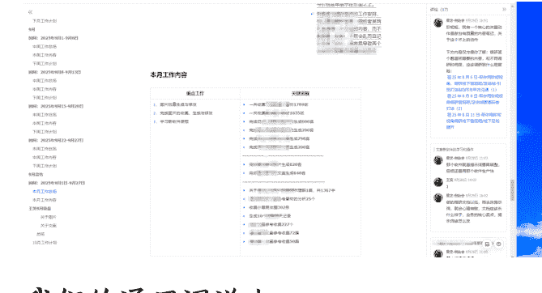
我们的通用词送上

我会给你一个爆款的文案框架，请你基于这个文案框架，文案的框架不要变！不要变！变的是表达的意思即可，而表达的意思我也会为你提供对应的几份资料：
- 1. A项目的网站，我对A行业10个痛点的整理以及这些痛点背后所代表的良好服务
- 2. 几百篇的小红书笔记，这是我从红书上爬取下来，里面有大量关于A的描述，可以作为你的学习资料库，在变化文案框架的时候，不要乱写我们的服务信息，比如我们家叫XXX，我们的服务范围是：洛杉矶市区，不要写到其他地方去

具体要求：
- 模仿爆款文案比重：我给你提供的爆款文案，开头的风格、表达、小故事、介绍等，你可以换一种意思表达，生成给我的文案至少要和爆款文案有60%的不同。
中间部分你可以自行根据资料里的内容发挥，可以增加段落和内容，也可以缩减段落和内容，这里我不限制你们之间的相同比例。
结尾和爆款文案的结尾在风格、表达、小故事、收尾介绍、引导用户评论等，你可以换一种意思表达，生成给我的文案至少要和爆款文案有60%的不同。

我从开头，中间，结尾三个角度告诉你修改的限制，确保既能模仿爆款文案，也能有一定差异化。
可根据 A 的服务特点，一定要资料里的内容对爆款文案内容进行随机补充和调整，使文案既符合原文风格，又突出品牌优势。
另外我们是机构本身，不要站在自己第三方较多推荐，这样子效果很差。

### 另外我现在同步你：A 团队的优势
我们团队最大的优势就是“中文沟通的 70 后专业团队 + 透明收费”，完美解决了华人在 A 服务中的三大核心痛点！
#### 一级优势（最强差异化卖点）
团队背景可信赖
解决痛点：安全信任担忧、服务态度问题
价格透明无套路
解决痛点：价格不透明、临时加价
#### 二级优势（专业服务优势）
服务范围全面专业
解决痛点：服务标准不统一、专业度不足
华人生活习惯理解
解决痛点：文化差异、A 标准不匹配
#### 三级优势（服务体验优势）
### 灵活定制化服务
解决痛点：服务不够个性化、频率固定
### 本地化服务优势
解决痛点：服务区域限制、响应不及时
### A 团队可信赖背景
#### 为什么必须放正文：
需要通过人物形象建立信任感
年龄优势需要对比反衬来体现
安全感是决策的关键因素
### 使用方式：
- 1. 提供爆款文案后，文案创作者可以直接模仿其语言和结构，并结合资料的内容进行灵活补充和调整。
- 2. 确保生成的文案符合美国 A 公司的实际情况，表情包只能在文案小标题前面加一个。
- 3. 如果你要提到引导用户评论，你应该说“下方”这个词。私信应该用“后台”这个词代替，必须隐晦的表达，否则小红书会提示违规。
- 4. 多用短句，每 1-2 句短句换行，适当加入 emoji 增强情感，适当加入小标题，整体的字数控制在 700 字之内！
### 注意用语
另外，我要严肃的强调：另外我们是机构本身，不要站在自己第三方较多推荐，这样子效果很差。
另外我们是机构本身，不要站在自己第三方较多推荐，这样子效果很差。
另外我们是机构本身，不要站在自己第三方较多推荐，这样子效果很差。
另外我们是机构本身，不要站在自己第三方较多推荐，这样子效果很差。
如果你在用第三方视角推荐我们70后团队，我就罚款你一万美金。另外要注意的是，在描述我们的机构身份需要隐晦一点，称呼我们为：我们。避免平台认为站在机构视角吹嘘自己的服务，但是我们还是需要去表达出我们机构的身份，所以折中用了这个介绍我们团队的词。

### 3. 付费放大“异常值”
我们对付费的理解是：流量成本占总成本的25%以下，也是roi在3-4之间，就可以用钱去放大确定性。
何时付费？当一篇笔记在自然流中的数据（点赞、收藏、评论）出现“异常值”，比如互动率比普通笔记高5-10倍时，我们就会立刻介入。
如何付费？我们会先用评论互动，把它的基础数据做得更好看，然后再开启“聚光”投放。
核心逻辑：我们不做盲目的测试，我们只为已经被市场验证过的、优质的内容支付“放大器”的费用。这能保证我们的每一分钱都花在刀刃上。

## 五、复盘与规划：系统>个体，复利>暴利
### 5.1 成功的关键因素
现在复盘，这个项目能在一个月内跑通，核心有三点：
- 选对了赛道：找到了一个需求真实、竞争蓝海、且适合我们自身优势的领域。
- 构建了系统：我们没有依赖某个人的天才创意，而是把每一步都变成了可复制、可优化的SOP。
- 数据驱动决策：无论是关键词选择，还是付费投放，我们都基于真实的数据反馈来做调整，而不是凭感觉。

### 5.2 项目沉淀 SOP
这个项目最大的收获，不是那8400块钱，而是一套可以复用到任何一个同城赛道的SOP。它包括：
《赛道选择与需求验证清单》

### 《 SMART 目标拆解与周计划模板 》
### 《 小红书矩阵内容生产流程 》

### 5.3 给圈友入局小红书的建议
### 构建系统比盲目干重要:
不要满足于做出一条爆款，要去思考这条爆款背后的逻辑是什么，如何把它变成一个可以复制的流程。
它要求我们不能只满足于流量的增长。我们必须思考：当前端涌入 100 个线索时，需要匹配多少客服？转化率的目标是多少？当流量增长到 1000 个时，我们的转化效率，决不能不增反降。
这其中的数学关系，这种对投入产出比的精细化运营，才是构建一个真正系统的关键。
它把竞争，从“你多吃一点，我就少吃一点”的零和游戏，变成了一场关于系统效率的无限游戏。我们不再恐惧有人进来抢流量，因为我们竞争的，是看谁能用更高效的系统，去服务好这些流量。
所以，我们选择放弃那个眼前的、轻松的果实。
因为我们想做的，不是一个依赖于我个人精力、有明显天花板的“项目”，而是一个能够自我进化、持续增长、让团队里每个人都能获得成长的“事业”。
一个稳定的系统，才能带来稳定的收益。这条路，走起来更慢，也更难，但我们相信，它会更远。

### 理解用户比研究技巧重要：
所有技巧都会过时，但对人性的深刻理解永远不会。花最多时间去做用户调研，自己当一个月客服，你会得到比任何课程都宝贵的洞察。
这句话，是我最近所有思考和行动的原点。尤其是在我们专注的海外生活服务赛道，这句话更是颠扑不破的真理。

### 我们的核心，是“海外小红书”，不是“小红书海外”
我常常和团队强调，我们对自己的核心定义，是生活服务赛道“海外小红书”，而不是“小红书海外”。
这听起来像个文字游戏，但背后是两种截然不同的战略定位。
“小红书海外”，意味着我们的根基是“小红书”这个平台，我们所有的动作，都是在研究这个平台的规则和技巧。平台的红利在，我们的业务就在；平台的红利消失，我们的业务就岌岌可危。我们是被平台定义的。
而“海外小红书”，意味着我们的根基是“海外华人”这个人群，以及他们亘古不变的需求。我们现在做的所有海外细分项目——这些需求已经存在了几十年，只要有人在海外生活，这些需求就永远不会消失。
你发现了吗？现在国内所有人都在喊“做同城”，那海外也是一样的。这些城市里的同城生活服务，是一个可以反复做、做十年甚至更久的生意。
所以，小红书只是我们当前服务这群人的、性价比最高的一个“渠道”和“工具”。

### 我们现在最重要的动作：囤粉
想明白了这一点，我们当下所有工作的核心目标就变得无比清晰：利用当前小红书的渠道红利，不断地把属于我们目标人群的粉丝，沉淀到我们的私域里。
我们在做的，就是一个朴素的“囤粉”动作。

## 企业微信高级功能
-299.80
- 原价：¥300.00
- 优惠：银行卡多笔立减优惠¥0.20
- 当前状态：支付成功
- 支付时间：2025年10月6日 12:26:53
- 商品：获客助手
- 商户全称：深圳市腾讯计算机系统有限公司
- 收单机构：财付通支付科技有限公司
- 支付方式：招商银行信用卡(8756)
由中国银联股份有限公司提供付款清算服务
- 交易单号：4200002820202510063701656634
- 商户单号：20251006239231357

### 为什么这个动作最重要？
因为我们很清楚，没有哪个平台的红利是永恒的。但只要我们对这群海外华人的理解足够深刻，只要我们手里握着这批最精准的、与我们建立了信任的客户，我们就拥有了穿越一切平台周期的底气。
等到有一天，小红书的红利不在了，或者出现了比小红书更高效的海外平台，我们根本不会焦虑。因为我们手里有源源不断产生现金流的客户关系，我们可以随时带着这批用户，无缝迁移到任何一个新的战场。
我们的生意，并不会被限制在小红书这一个篮子里。
而这一切的基础，就是我们对这个人群的洞察足够深刻，我们知道他们需要什么，所以我们能一直服务他们。这才是我们最核心、最不可被替代的资产。
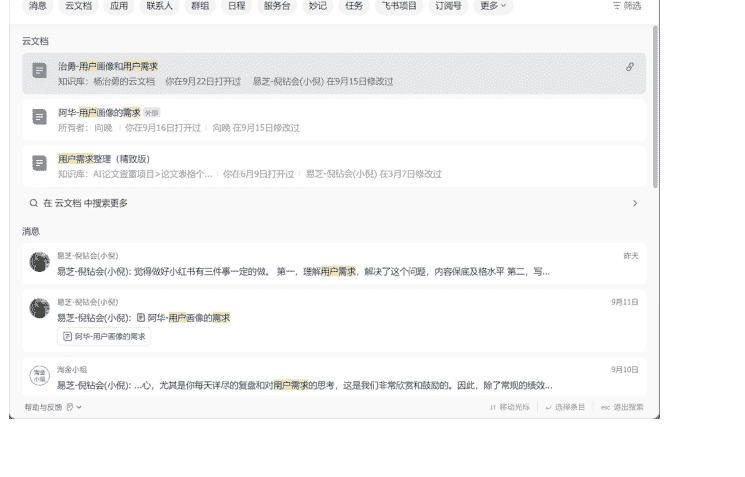
技巧会变，平台会变，但你对一群人的深刻理解，以及他们对你的深度信任，这是别人永远拿不走的东西。
所以，我看到每一位真正做到长期的老师，给出的建议都惊人地一致：
如果你现在感觉业务还起不来，多做理解用户的动作。

### 常做复盘比一直干重要
我强制要求团队的每一个人，都要写日报和周报，并且要沉淀自己做事的方法论（SOP）。因为我坚信，未来的每一天，都是由你之前每一个“今天”的思考决定的。
我们已经准备将这个模式，复制到全球华人聚集的其他城市。因为我们做的不是一个项目，而是一个可以不断产生复利、沉淀价值的系统。
最后，祝圈友们都能找到自己的“窄门”，在长期的道路上，一起生财有术。

最后，安利小懒的付费群：
懒人专属群（介绍）

懒人专属群持续更新中，已持续运营6年，整理超 3000 份各类精选付费文章 & 年费社群干货，全部开放下载。
本资料为付费群内部分享，仅供真实有需要的朋友查阅 🤫
懒人专属群更新记录：
https://lazy2025.top/blog/record2
懒人专属群更新记录（需梯子，备用）：
https://lazybook.fun/blog/record2