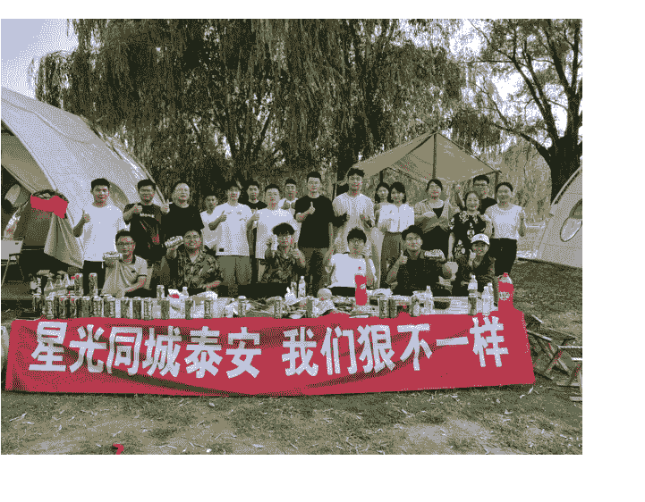
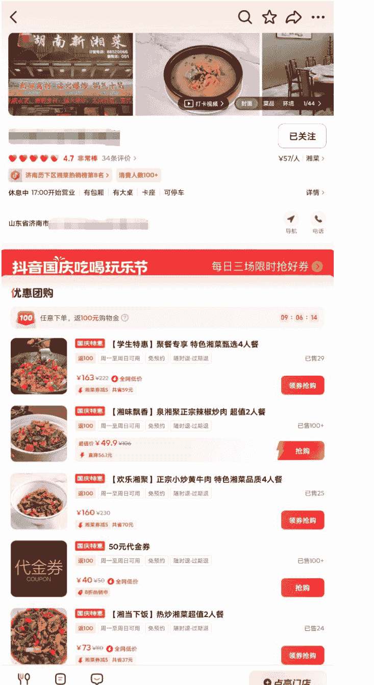
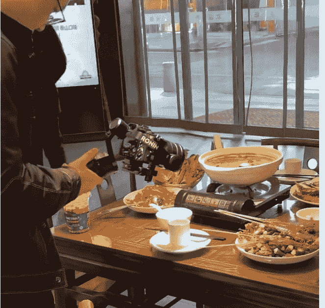
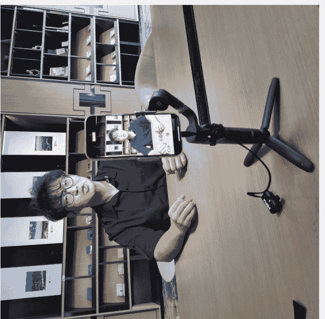
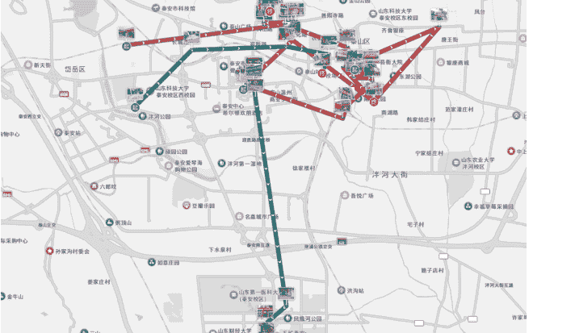
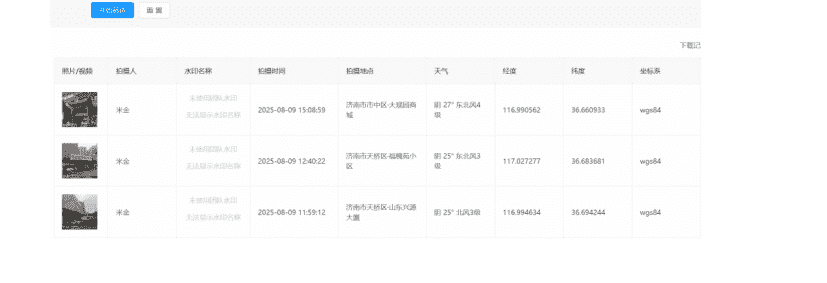
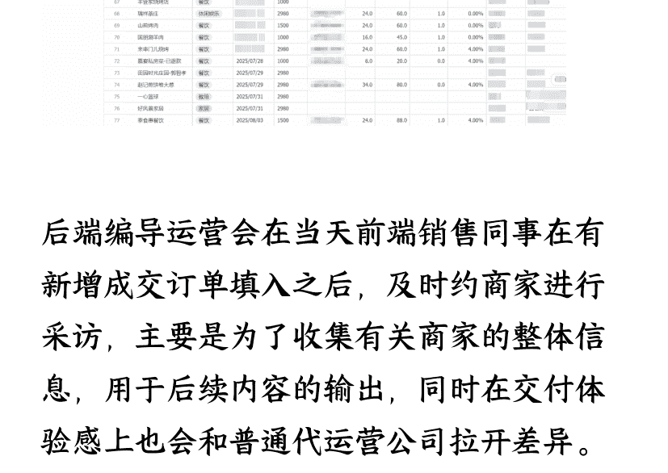
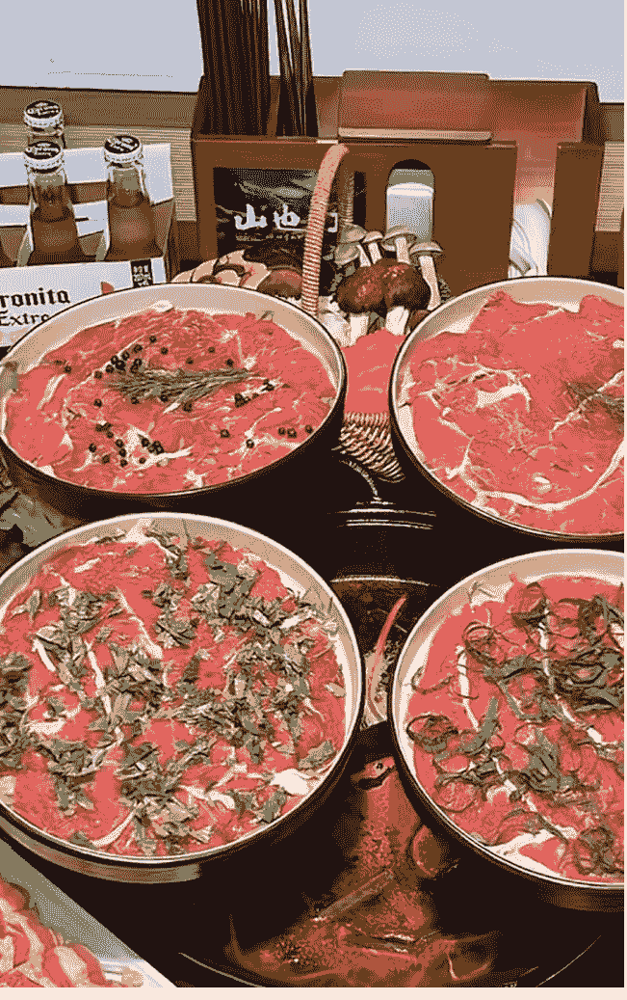

# 万字复盘：AI如何引爆同城业务?两个月营收15万的实战方法论

## 251013生财精华

公众号懒人搜索，懒人专属群独享
懒人微信: lazyhelper

微信: lazyhelper

从传统代运营到AI赋能，我们如何将“重”模式变“轻”，打造降维打击的“AIP同城操盘手”团队

Hi，各位圈友，我是天豪。

目前，我正深耕于@孙策老师的「AI同城IP自运营」体系，致力于为中国广大的同城商家，提供一套真正穿透市场、直达效果的引流与转化解决方案。

距离上一篇分享已过去数月。这期间，我们团队经历了一场深刻的变革，核心是围绕一个问题的反复追问与实践：“对未来的同城商家而言，什么才是真正有效的赋能？”

答案逐渐清晰：AI赋能的自主运营，才是终极归宿。

过去，同城赛道由传统的代运营公司主导，这是一条涉及脚本、编导、拍摄、剪辑、投放、团购运营的“重”链条。而今天，我们尝试用AI武装的“智能体”，去重构这条价值链上的每一个环节。

结果如何？我们不仅实现了商业闭环，更是在不到 2 个月的时间，单纯我负责的团队在山东泰安以及济南签约了 80 余家商家，团队总营收达到 15 万元。我们验证了一个全新的公式：

> 「AI + 同城 IP 操盘手 = 复合型“商家运营单兵” x N = 一支轻装上阵、实现降维打击的新型运营公司」

这篇复盘，我将毫无保留地分享：
- 顶层设计： AI 如何与同城 IP 操盘手的业务流深度耦合？
- 实战推演： 两个月从 0 到 10 的全流程战术拆解。
- 模式验证： 真实案例的深度剖析与价值提炼。
- 未来图景： 如何进化为一名“AIP 同城操盘手”？

# 第一章：风暴前夜——同城赛道的“双重困境”与我们的“起心动念”

## 1.1 “一千个人心中，有一千种被误读的 AI”

> “一千个人心中有一千个哈姆雷特”，这句话同样适用于当下的 AI。

市场对 AI 的宣传无所不用其极，但对大多数人而言，各大模型最终沦为了“高级百度”。生产力的变革已经到来，但许多人仅仅停留在基础问答的浅层应用，这无疑是对这场技术革命的“盖棺定论”。

这种现象在同城商家群体中尤为普遍。我们发现，大量实体商家尽管在为新媒体、AI 的发展持续“知识付费”，却往往沦为被收割的“韭菜”。主营业务占据了他们绝大部分精力，几万元的短视频课程尚未消化，AI 又来了——宣称能一键生成脚本、一键剪辑、一键出投放计划。学习门槛与经营现实之间的鸿沟，让结果可想而知。

> 涛哥曾说：“念头一转，黄金万两。”

我们转动的念头是：如果，我们将赋能的对象，从精力分散的商家，转移到一群高认知、懂互联网、懂同城、懂AI的操盘手身上呢？如果，手握AI智能体的是他们，结果将会怎样？




## 1.2 市场的“卷”与行业的“痛”

让我们审视当下的战场：

自 2021 年抖音本地生活业务上线，海量实体商家涌入。如同曾经的美团、点评时代，商家习惯于将账号托付给代运营服务商，采用“服务费+抽成”模式。

但抖音的逻辑截然不同。作为一个基于“兴趣电商”的短视频平台，新商家的自然曝光几乎为零。持续的短视频内容创作，成为链接 POI（兴趣点）、引流团购、到店核销的唯一路径。这道“天堑”催生了庞大的短视频代运营市场。

# 公众号懒人搜索，懒人专属群分享


+关注
4.9 超赞 1462条评价 >
¥55/人 湘菜 >
济南槐荫区湘菜热销榜第2名 > 铜冠好店 回头客600+
收录2年 营业中 11:00-21:30 有大桌 沙发位 宝宝椅 可停车 详情 >
山东省济南市
导航 电话

# 抖音国庆吃喝玩乐节 每日三场限时抢好券
# 优惠团购

100 任意下单，返100元购物金 09:05:29

| 商品名称 | 规则/标签 | 销量/价格 | 优惠/操作 |
|---|---|---|---|
| 国庆特惠 湘菜·现切现炒黄牛肉2-3人餐 | 返100 周一至周日可用 免预约 随时退·过期退 | 已售2万+ \| ¥109.8 \| ¥175.9 全网低价 | 抢购 \| 特惠补贴减12.2 共省64.1元 |
| 国庆特惠 湘菜·现切现炒吊龙4人餐 | 返100 周一至周日可用 免预约 随时退·过期退 | 已售3000+ \| ¥145.8 \| ¥229 全网低价 | 抢购 \| 特惠补贴减16.2 共省83.2元 |
| 国庆特惠 【楠城湘】家庭免辣欢乐套餐 | 返100 周一至周日可用 免预约 随时退·过期退 | 已售2000+ \| 超值价 ¥127.8 \| ¥197 | 抢购 \| 直降69.2元 |
| 国庆特惠 辣椒炒肉尝鲜双人餐 | 返100 周一至周日可用 免预约 随时退·过期退 | 已售2000+ \| ¥78.9 \| ¥116 全网低价 | 抢购 \| 特惠补贴减9.1 共省37.1元 |
| 国庆特惠 【楠城湘】46.5代50元代金券 | 代金券 楠城 返100 周一至周日可用 免预约 随时退·过期退 | 已售1万+ \| x | 写3图45字评价，本周五抽iPhone |

逛美食 订单 写评价 点亮门店
5 / 28



# 同类目新老店数据对比（新店已开业3个月）

需求一直存在，且极其旺盛。但有需求的地方，就逃不开一个“卷”字。

代运营行业鱼龙混杂，即便强如“薛辉老师”、“大斌老师”等头部IP，也面临着整个行业的结构性痛点。全国各地的大型服务商，无一不被一个问题所困扰：规模与质量的悖论。

这个痛点，用商业术语来说，就是“边际成本无法有效递减”。

传统的代运营公司，想要在保证交付质量的前提下服务更多客户，就必须线性地扩充后端团队——编导、拍摄、剪辑、运营。每增加一个客户，成本就增加一分。这种“人肉堆砌”的模式，决定了其增长曲线必然是沉重而缓慢的。

这就是我们项目的「起心动念」：

如果，用 AI 脚本智能体结合客户真实访谈，去替代传统编导的“灵感枯竭”？

如果，用 AI 智能剪辑工具，去释放剪辑师的重复性劳动产能？

如果，用一套标准化的爆款素材库和完整的 AI 工作流，去重塑交付流程？

那么，我们就能在产能上，实现对传统代运营公司的“弯道超车”。这不仅是效率的提升，更是商业模式的颠覆。





# 第二章：从0到10——两个月，一支“铁军”的诞生

## 2.1 阶段一：MVP（最小可行产品）验证（1.0 模型）

我们的产品服务，本质上是在传统代运营基础上的“升维”，因此团队初期架构也沿用了“前端销售+后端交付”的模式。


我主要负责泰安部分团队和济南团队，包括销售部门的搭建与管理、业务开发等等。

项目启动的第一个月，我们以“案例收集”为目的，将原计划 2980 元的服务包，设置了 980 元、1980 元、2980 元三个测试档位。

第一天外出 BD，我们就拿下了第一个 980 元的订单——一家位于泰安当地万达商圈的老牌餐饮新店。

我们抛弃了早已被市场滥用、甚至带有一丝贬义的“短视频代运营”概念，而是主打“抖音老板 IP 全托管服务”，其核心价值主张是构建“三位一体”的短视频矩阵：

### 抖音老板IP全托管服务
### 让老板出镜一次，带火一家门店！

为什么要打造“老板IP”？
- 1. 在抖音时代，顾客不再信广告，只信“你是谁”。
- 2. 平台偏爱真人出镜，品牌自嗨越来越难起量。
- 3. 一个会讲故事、能引流、能成交的老板IP，就是实体门店穿越流量内卷的“内容护城河”。
- 4. 老板出镜一次，真的可以带火一家门店。

【我们提供的是一套企业级老板IP内容解决方案】
围绕老板、员工、顾客、平台四大关键角色，打造“势能+成交+口碑+转化”的内容系统，帮助门店实现从曝光到复购的完整闭环。

【服务内容·核心卖点】
我们不仅帮你拍摄视频，而是构建一整套：老板IP+成交内容+顾客种草+投流闭环的高效协同系统，实现“内容即品牌，视频即成交”。

老板做IP·打造品牌信任力
> <<<老板出镜，讲初心、讲品牌、讲坚持，强化人格魅力与客户信任>>>
- **账号定位**：结合行业与门店特色，规划账号风格与内容主线
- **人设打造**：策划贴合老板气质的人设标签，增强吸引力
- **脚本创作**：围绕品牌故事、客户信任、价值主张，策划完整内容方案
- **拍摄剪辑**：专业上门拍摄、统一风格剪辑、封面标题包装
- **矩阵搭建**：支持分发至老板号、企业号、达人号、视频号等多端平台
最终效果：打造一个能讲故事、能吸粉、能成交的老板IP账号，成为品牌信任入口

碰碰卡=员工矩阵+顾客种草+一键分发
员工卖产品·激活企业亲人矩阵
> <<<围绕核心产品打造“易传播、能成交”的内容，员工不用会拍视频，只需“碰一下”或扫码，就能一键领取剪好的内容，直接分发到自己的账号。>>>
- **爆点策划**：提炼好讲、好看、易传播的主推产品结构
- **团购套餐设计**：引流+下单兼顾的高转化团购组合
- **标签包装**：卖点视觉化、话术结构化，轻松带货
- **视频剪辑**：总部统一生成，员工一键领取→一键发
最终效果：员工即销售，视频即广告，人人都是流量入口。

【服务内容·核心卖点】
顾客做种草·打造用户信任矩阵
> 顾客到店后，不再只是拍照留念，而是“碰一下”直接生成视频或领取体验视频，一键同步到抖音、小红书、快手、视频号四大平台。
- **内容方向**：体验感受+情绪共鸣+真实好评
- **使用场景**：朋友圈、评论区互动、门店打卡、顾客账号分发
- **视频生成**：主素材统一剪辑，顾客扫码即可发布
最终效果：顾客自己说好，变成真实口碑扩散器，形成社交裂变。

> 一句话总结：有了“碰碰卡”，员工=销售员，顾客=种草官，内容=成交利器，四个平台一键分发，形成真正的流量闭环。

投流放大+转化闭环·曝光不是终点，成交才是结果
> <<<从曝光到复购，全流程内容运营闭环，助力门店实现“流量变生意”>>>
- **官方投流**：由平台认证投手操盘，确保视频有曝光、有点击、有进店
- **门店活动策划**：结合IP和内容，设计高转化落地活动（如试吃、探店、转发送礼）
- **私域+直播承接**：私域+直播承接：通过直播转化与私域留存，实现持续成交与客户资产积累
最终效果：从“吸引”到“成交”再到“复购”的持续增长链路

>>服务套餐一览表<<
| 模块 | 服务项目 | 服务说明 | 价格 |
|---|---|---|---|
| 老板做IP打造品牌信任力 | IP定制类视频·24条 | 围绕老板人设与品牌故事，定制24条短视频，含脚本策划、上门拍摄、精剪封面标题、平台投流 | ¥4680元 |
| 碰碰卡：员工，顾客做产品、种草类辅助成交内容" | 产品，种草类视频300条 | 300条产品种草类视频，“碰一下”或扫码，就能一键领取剪好的内容，直接分发到顾客或者是员工的账号。 | ¥1980元 |
| 团购运营 | 团购指导 | 提供榜单优化、账号健康维护、平台活动协同等服务，提升曝光与账号权重 | 抽成4% |
| 大场直播 | 直播咨询 | 系统教会你搭建直播间，包含直播脚本定制，助你从0到1实现“自己能播、播了能卖” | ¥980元/场 |
| 注：所有服务为“拎包入住式”交付 | | | |

抖音老板IP全托管服务 一口价：4980元+4%的核销

老板 IP 账号（信任基石）： 商家老板真人出镜，人格化的内容天然具备信任度，是品牌最好的背书。

员工账号矩阵（产品窗口）： 员工账号分发店铺、产品相关视频，与老板 IP 形成互补，扩大触点。

客户内容种草（社交裂变）： 引导消费后的顾客发布体验视频。真实素人账号的权重高，且能通过“可能认识的人”、“通讯录好友”等社交推荐机制精准触达潜在客群，效率远超传统传单。

几天之内，我们迅速签下六七家商户。市场验证成功后，我们立刻启动两项核心工作：

销售标准化： 梳理销冠话术，搭建销售部门的 SOP（标准作业流程）。

交付流程化： 后端团队开始摸索标准化的交付路径。

## 2.2 阶段二：规模化扩张与体系构建

0 到 1 的快速跑通给了团队巨大信心。我们果断启动社招，目标是快速扩张销售 BD 团队。我们采用了“7 天试岗期 + 高薪酬高 KPI”的模式，通过高频次的“大浪淘沙”机制，快速筛选高潜力人才。

在这个时候我们开始做两个事情
- 1、销售话术的梳理、销售部门 SOP 的搭建
- 2、后端交付人员开始摸索交付

### 销售话术3.0
- 破冰
  - 你好，请问咱店的老板在吗
- 明确身份
  - 我们是想和您聊一下合作的，和您之前了解的不一样，我们不是做那种“低价引流、薅羊毛”的，我们主要是给您打造抖音老板IP的，帮您把咱们店自己的账号做起来，员工矩阵账号搭建起来，再通过老板亲自出镜，建立起跟顾客的信任，获得更多的曝光，源源不断带来更多的销售额，比方说芙蓉居的徐鹏、顺泽鲁菜馆这种类型的账号
- 阐述优势
  - 而且我们是从ip定位、账号定位、到拍摄剪辑，还有投流都由我们搞定，包括我们您店里所有员工的矩阵账号搭建，客户种草分发的视频制作等等，您作为老板您这边只要负责出镜就好了。
- 介绍服务内容（坐下聊）
  - 现在实体商家老板说生意不好做，实际上很多老板不知道在新媒体时代，到底应该如何打造一套能够持续带来客户的解决方案，都以为随便拍几条视频就能爆，但实际一家店的生意要有突破，是需要一整套的围绕老板、员工、顾客、平台四大角色的，从曝光到复购完整的整体方案。
  - 首先，一家店、一个品牌的老板要做IP，我们会打造专属于您的抖音账号，这里面包括您的账号定位，我们会结合您的创业背景故事、行业、门店特色来规划您的账号风格和内容方向。然后我们会打造一个适合您气质的人设，让人记住您。定好大方向之后，具体的脚本制作、拍摄剪辑都是我们来做，包括视频效果出来之后，我们投流也是专业的，我们会教您怎么把效果放大，去覆盖周边精准人群，整个过程您只需要出境就行。
  - 第二，员工卖产品，很多老板苦恼自己没有那么多账号去帮自己做分发，实际上你的员工就是最好的选择，他们的账号都是真实的素人账号，权重高，我们帮你们制作好用于分发的视频之后我们会上传到云端，我们会给你们提供一个爆店码，让您的员工一扫码或者碰一碰就可以进行一键转发视频，这样您就能打造出素人矩阵，相当于多账号同时在推广同一家店，很多品牌店现在都是这样来扩大自己的宣传面的。
  - 同样的道理，顾客也可以通过这套一键分发视频的方法，形成矩阵，每一个来店里消费的客户，我们可以结合一些小福利小优惠，让他们帮您店里分发种草视频，这样您的每一个客户都会成为我们扩大宣传中的一环，一传十传百，久而久之，您店里的复购客户就会越来越多，而且最关键的是这样来的客户质量都会高很多，绝对不是那种低价引流，薅羊毛的客户。


### 重赏之下必有勇夫。我们的销售精英培养机制如下：
#### Day 1 (上午)：体系化培训（产品、市场、话术、模式、薪酬）。
#### Day 1 (下午)：主管带教实战，熟悉破冰、谈单、打卡、录音、晚复盘流程。并布置次日话术考核。
#### Day 2 (上午)：话术考核（70 分通过，两次机会），通过后进行电销流程培训。
#### Day 2 (下午)：主管带队“团战”，组员独立破冰，主管随时支援，熟悉“1 带多”作战模式。
#### Day 3 起：进入正式 KPI 考核。

### 一、绩效考核标准
乙方每月应完成以下绩效指标：
- 每月全款到账订单数不低于 4 单；
- 每月绩效完成度不低于 70%（按照100分绩效基准算）。

### 二、试用期内绩效淘汰机制
1. 乙方已知悉并签署《销售岗位录用条件确认书》（附件二），确认录用核心标准包括：
- 半月内全款到账订单≥2单
- 半月内绩效完成度≥35%
- 半月内无重大违纪或客户有效投诉（以员工手册为准，包含但不限于工作日志造假或虚假拜访≥2次等）

在这套体系下，优秀销售能做到月均 10 单以上，平均水平也能达到月均 5 单。我们通过“今日水印相机”等工具进行中台监管，保证过程透明。

短短两个月，这支队伍完成了 80+商家的签约，总收款 15 万元。

### 拍照路线



而在后端方面，我们通过飞书多维表格搭建了一套可以实现多部门数据同步的可视化管理表，用于订单的及时录入和跟进进度，确保每个订单不会出现遗漏而带来客诉问题。



后端编导运营会在当天前端销售同事在有新增成交订单填入之后，及时约商家进行采访，主要是为了收集有关商家的整体信息，用于后续内容的输出，同时在交付体验感上也会和普通代运营公司拉开差异。

待脚本完成创作之后，摄影同事会第一时间约商家到店进行拍摄，拍摄完毕后将所有视频素材按照脚本进行分类并打包交给剪辑同事，成片出来后由客户确认没问题情况下定时进行发布。

## 2.3 危机与转机：当“人效”遭遇“产能天花板”

前端高歌猛进，后端的压力陡增。我们亲手打造的这套体系，本质上仍是传统的代运营模型，那个行业固有的“产能魔咒”在我们身上更早地暴露了出来。

订单开始积压，交付周期拉长。所有的脚本创作、视频剪辑都依赖于人力，客户的响应也开始变得不及时。

变革，迫在眉睫。AI，必须登场了。

# 第三章：AI赋能——重塑交付流程，引爆产能革命

## 3.1 脚本创作：从“三天一人”到“半天一人”

我们对后端交付的时间消耗进行了精准统计，发现编导环节是最大的时间黑洞。为单个客户创作 24 条短视频脚本，从搜集对标、融合客户访谈内容到最终成稿，往往需要 2-3 天。

我们的解决方案是：构建脚本生成智能体（Agent）。

## 公众号懒人搜索，懒人专属群分享

## GPT

探索并创建结合了指令、额外知识和任何技能组合的自定义版本的 ChatGPT。

Q 搜索 GPT

精选推荐 写作 工作效率 研究与分析 教育 生活方式 DALL·E 编程

## Featured

Curated top picks from this week


### 菜品、店铺、品牌故事短视频脚本生成

我是一个专门把【真实访谈文稿】打造成“有爆点、有场景、有传播力”的短视频脚本的智能体，

我的目标是：把老板讲的菜品故事、店铺理念、品牌价值，转化成适合抖音/视频号/快手等平台的爆款短视频脚本，让顾客被种草、让品牌被记住。

### 我能做什么？

我擅长从你提供的真实访谈中，提炼出那些能打动人、能代表你独特价值的内容点——

- 一道菜的来历与工艺
- 一家店的构想与细节
- 一个品牌的初心与坚持

然后，一键生成结构清晰、情绪浓烈、画面感强的短视频脚本。每条脚本都控制在 260-400字，适配 80-110秒口播，语气自然、镜头感强，适合一镜到底直接拍。

### 创作：

可生成3-6个关于这个店铺的，菜品、品牌、店铺的脚本

访问链接

https://chatgpt.com/g/g-68b12e7be3fc8191add5836515429e7a-cai-pin-dian-pu-pin-pai-zhi-neng-ti

菜品、店铺、品牌智能体 5 v

```
访谈内容已接收，正在进行初步评估...

【品牌内容识别】
检测到品牌相关内容：
“泉湘聚”品牌名称来源于“泉”(济南)与“湘”(湖南)的结合，表达“在济南能吃到正宗湘菜”的愿景。创始人强调品牌的真诚、坚持和对细节的重视。致力于打造“正宗、火辣、地道”的湘菜标杆餐厅。

检测到菜品相关内容：
重点菜品包括剁椒鱼头、小炒黄牛肉、干锅鱼杂等，均由湖南本地厨师主理，食材坚持使用新鲜原料，辣度可调但不改变湘菜本质。特别强调菜色香味俱全，适合短视频传播。

检测到店铺相关内容：
位于济南沙坪路，定位年轻消费群体，追求性价比和人情味。装修温馨、服务热情，注重客户体验与员工培训。顾客回头率高，强调品质和服务并重。

【调度PO分析师】
请使用 PO-内容分析师GPT 分析此访谈内容，它将为您提供3-5个专业的品牌故事点。
分析完成后，请回到我这里告知：“PO已完成，故事点为：[列出标题]”
```

| 镜头编号 | 场景内容 | 画面描述 | 文案/旁白 | 拍摄建议 |
| :--- | :--- | :--- | :--- | :--- |
| 镜头1 | 店内高峰压力开场 | 餐厅客满，服务员穿梭、老板亲自上菜 | “有时候，他也会问自己，50岁了，还能撑多久？” | 多机位快切+轻喘气音效，表现忙碌和压力 |
| 镜头2 | 疲惫瞬间动摇 | 老板深夜落座，摘口罩喝水，神情疲惫 | 字幕：“那天太累了，差点决定放弃。” | 静态镜头+低饱和滤镜，突出孤独与疲惫 |
| 镜头3 | 坚持的理由 | 顾客点赞、老夫妻送礼、员工认真工作 | “但第二天，他还是准时出现在厨房。” | 蒙太奇剪辑，增强情绪波动与回忆感 |
| 镜头4 | 标志菜品呈现 | 剁椒鱼头翻滚热气、上菜镜头 | “每一份坚持，都有回报。” | 慢镜+顶拍+热气叠加特效 |
| 镜头5 | 个人坚定表态 | 老板镜头前受访，说出内心 | “不管多少岁，只要心还热，就不晚。” | 特写镜头+轻推+字幕强调金句 |
| 镜头6 | LOGO收尾定格 | 店LOGO、热菜镜头收尾 | “泉湘聚——用火辣的湘味，煨一碗坚持的温情。” | 稳定延时+品牌字体淡入 |

我们利用 ChatGPT，围绕脚本创作这一核心需求，定制了多个专用的生成体：

- 人物故事脚本 Agent
- 老板 IP 团购脚本 Agent
- 老板观点输出脚本 Agent
- 产品/店铺/品牌故事脚本 Agent

在设计环节，我们向这些 Agent “投喂”了海量的爆款脚本范例和精确的输出指令。现在，一个成熟的 Agent 本身就是一个动态的、智能的“爆款脚本库”。

编导运营的工作流被彻底改变：

- 输入：将与商家的访谈录音或文稿直接交给 Agent。
- 处理：Agent 快速消化信息、提取核心要素，并按照预设的 P0-P6 步骤执行创作。
- 输出：Agent 提供多种脚本风格选项，快速生成结构化的脚本和分镜表。
- 结果：同样是 24 条脚本的创作任务，总耗时（含访谈）从 3 天，被压缩到了 0.6 天。产能提升了 5 倍。

## 3.2 拍摄标准化：让“技术”变为“流程”

有了高度体系化的脚本和分镜表，拍摄效率也随之提升。我们将拍摄从一种依赖个人技术的“艺术创作”，转变为一种可复制的“流水线作业”。

- 混剪类视频模板：
  - 门头 + 环境 + 菜品/产品展示 + 客流 + 局部细节
  - 门头 + 制作过程 + 产品展示
- 人设类视频模板：
  - 口播类： 固定镜头语言（第一/第三视角），只需变换场景。
  - 旁白类： 抓拍老板的日常动作（收银、备菜、与顾客交流等），分镜表固定，按表拍摄即可。

标准化的拍摄流程，确保了素材质量的稳定性和可用性，为下一步的智能剪辑奠定了基础。


### 49.9元双人享正宗湖南美味。


## 3.3 剪辑智能化:流水线作业的最后一环

无论是剪映还是其他工具,都内置了 AI 智能剪辑功能。我们的核心在于,让 AI 能“听懂”我们的标准化素材。

由于我们的客户以餐饮业为主,内容形式多为“经典混剪+IP人设”的组合。我们选择了“花儿朵朵”等智能剪辑工具,并建立了一套严谨的素材标记系统。

从脚本、分镜到拍摄的每一个镜头,都被提前打上了标记和序号。剪辑师的工作不再是繁琐的“精剪”,而是将标记好的素材“填入”到对应的流程节点中。



## HI，请选择创作方式

- 智能剪辑4.0：全新模版创作模式，快速产出针对行业的高质量成片
- 智能剪辑3.0：经典剪辑模式，通过片段素材快速合成高质量成片
- 脚本剪辑：根据文案脚本进行分场景创作，批量高效产出定制化场景成片
- AI一键成片：提供创作关键词与素材，实现一键智能化批量成片
- AI数字人：只需输入文字，即可生成逼真的数字人视频，轻松制作各类短视频


至此，一条完整的“AI驱动内容生产线”正式打通。

我们还结合了“爆店码”这类营销工具，让到店的每一位顾客、每一位店员，都能通过扫码一键分发视频，瞬间形成强大的传播矩阵。


目前，在清空积压订单后，单个客户的交付周期稳定在2天以内。经过测试，一个独立的操盘手，完全可以胜任过去需要3个人（编导、拍摄、剪辑）才能完成的全套交付工作。

## 第四章：站在未来——定义下一代“AIP同城操盘手”

## 4.1 两大万亿市场的交汇点

我们的业务，恰好站在两个巨大市场的交汇处：

同城赛道： 实体商业永不消亡。以餐饮为例，2025年5月数据显示，仅山东泰安这座三线城市，餐饮门店就高达26000多家。这是一个存量巨大、增量不息的庞大市场。

AI 赛道： 从 DeepSeek 等国产大模型的崛起，到 OpenAI 生态的持续完善，AI 正在以前所未有的深度和广度，重构各行各业的生产力。

当 AI 的“赋能”属性，与同城赛道的“实体”需求相结合，一个崭新的、落地性强且竞争蓝海的职业角色应运而生。

过去，我们称自己为「同城实体操盘手」。

今天，通过 AI 智能体和工作流的武装，一个独立个体就能成为一家“一人代运营公司”。我们将其升级为 2.0 版本：

「AIP 同城操盘手」：通过 AI 赋能，为商家提供 IP 打造、门店运营、客资获取、引流增长等一站式服务的复合型商业人才。


文章开头的公式，在此刻得到了最终的诠释：

「AIP 同城操盘手 = 复合型“商家运营单兵” x N = 一支轻装上阵、实现降维打击的精锐部队」

### 4.2 AIP 同城操盘手的核心能力矩阵

如何成为一名合格的 AIP 同城操盘手？这意味着你回到任何一座城市，都能独立完成从客户开发到后端交付的全流程闭环。

这需要你具备以下五维能力：


- 市场开拓能力（销售 BD）：具备多渠道获客能力，包括但不限于陌拜、电销、面销转化、本地信息流广告投放及线索跟进。
- 行业洞察能力（商业认知）：深刻理解同城赛道的生态、客户的核心痛点，并能针对不同业态的商家，提供定制化的产品解决方案。
- 流量操盘能力（互联网认知）：精通各大短视频、团购、社交平台的规则与玩法，熟悉短视频制作、直播带货、巨量引擎投放等核心引流技能。
- 技术应用能力（AI 工具驾驭）：熟练掌握并能组合运用不同的大模型及 AI 工具。例如，用 GPT 进行策略规划与多模态内容生成，用 Claude 深化文案创作，用豆包（及抖音生态工具）高效制作短视频、提取对标文案等。
- 组织构建能力（团队管理）：独木难成林。单兵作战虽强，但天花板可见。你必须具备设计、搭建和持续优化团队组织结构与 SOP 的能力，无论是销售端还是交付端，才能将个人能力放大为组织势能。

# 写在最后

这篇复盘，是我对过去数月探索的总结与沉淀。

“AI+同城”，两大市场的交集，蕴藏着巨大的、可落地的、且尚未过度内卷的商业机会。我们有幸踏出了第一步，并验证了其可行性。

如果你也对成为一名 AIP 同城操盘手，对这个充满想象力的赛道感兴趣，欢迎链接交流。

感谢各位圈友的耐心阅读，感谢生财有术平台。祝我们，都能在时代的浪潮中，找到属于自己的船。八方来财！

最后，安利小懒的付费群：

懒人专属群（介绍）


🛖 懒人专属群持续更新中，已持续运营 6 年，整理超 3000 份各类精选付费文章 & 年费社群干货，全部开放下载。

本资料为付费群内部分享，仅供真实有需要的朋友查阅

懒人专属群更新记录：
https://lazy2025.top/blog/record2

懒人专属群更新记录（需梯子，备用）：
https://lazybook.fun/blog/record2