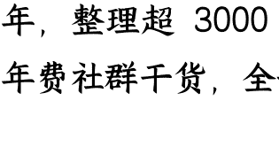
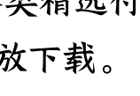

# 138 | 重估中国:“Anything But China”结束了?

251014

整理:公众号懒人搜索,懒人专属群独享懒人微信:lazyhelper

公众号懒人搜索 懒人专属群

微信:lazyhelper

欢迎打开《蔡钰·商业参考4》，我是蔡钰。

美国对中国的关税，又给加回去了。就在美国当地时间10月10日，美国总统特朗普宣布，要从11月1日开始，在现有关税基础上，对中国商品加征100%的进口关税，作为对中国加强稀土管制的报复。

这个态度引发了美股在周末的暴跌。中国市场会受怎样的影响？我们得等到周一工作时间才能看到。不过在那之前，我注意到的一个中期变化，想要分享给你。

## ABC 到 EAC

我们从一件具体的事儿说起：2025年10月9日，国庆长假刚结束，汇丰就宣布了一个大动作：用30%的溢价私有化香港的恒生银行。汇丰管理层说，这是为了押注香港的长期增长，而不是短期套利。

这个时间点很有意思。就在此前半个月，《华尔街日报》还有一篇报道的标题是《The New Plan for Western Companies Is ABC：‘Anything But China’》，大谈西方科技公司在供应链上回避中国的策略。

这是一个我要提醒你留意的重要变化：

2025年以来，全球资本看待中国资产的态度正在微妙转向——从“Anything But China”，切换成了“Everything About China”。

Anything But China，避开中国，是过往几年国际资本的一大共识。最早在2018年美国国际贸易委员会的一场听证记录里，就出现过“an anything but China segment”，“一个‘去中国化’业务板块”的表述，用来描述市场参与者对中国制造的回避倾向。

到了2022年，“Anything But China”已经被缩减成了共识术语ABC，出现在华尔街的资产配置框架里，被投资人和金融机构心领神会。但是从2025年开始，华尔街的态度变了。

高盛在2月上调了MSCI China与沪深300的目标点位，3月又继续上调MSCI新兴市场的12个月目标，直接理由是“中国AI推动上涨”。

5月底，中东卡塔尔主权财富基金收购了中国第二大基金公司华夏基金10%的股份，成为中国公募行业少见的中东主权资本股东。

到了8月底，摩根士丹利披露说，全球对冲基金在8月份实现了对中国股票的6个月内买入新高，冲进的还不是港股市场，而是A股。

9月16日，路透社的报道标题直接写道：《曾被视为“不可投资”的中国股市，正在再次吸引海外资金》，说“一年前，人们还想把中国排除在指数之外。而现在，中国被看成了一个无法忽视的独立资产类别”。

## 转变脉络

从 Anything But China 到 Everything About China，这个转变是怎么发生的？

这一年来，我个人感受到的、影响全球资本态度变化的脉络里，有6个关键事件，给你汇报一下。

- 第一件事，A 股的“924 转向”。
2024 年 9 月 24 日，中国央行拿出了一揽子“真金白银”的稳增长组合拳：降准、降政策利率、资本市场工具配套等等，这刺激得 A 股出现了快速拉升，两周内就从 2700 点涨上了 3600 点。这之后的半年，A 股虽然回落震荡，但借助 DeepSeek 的破局，基本稳在了 3000 点之上。有家伦敦资产管理机构叫 Polar Capital，管理资产规模在 200 亿美元左右，透露说，自己 2 月份开中国主题的投资会，吸引来的客户是 2023 年出席人数的两倍多，主要原因就是 DeepSeek 的突破，让“中国创新资产”又回到了投资者们的对话框里。

- 第二件事：中国扛住了美国政府的关税攻击。
这件事，《商业参考》在前面已经陪你关注过。简单来说，美国在 4 月份突然对全球发起对等关税，其中对中国的关税一路拉升到了 145%。而中国保持了对等反制。这之后双方谈判，美方把关税从 145%降到 30%，中方从 125%降到 10%，并且一再延期。这在全球资本看来，意味着中国的反制能力经受住了考验。于是，8 月份，就发生了摩根士丹利说的全球对冲基金对 A 股“战术性加仓”。说是“战术性加仓”，因为还有一个风险因素没有消除——战乱风险。这两年，全球战争频发，中国在地缘上也频频遭遇摩擦。华尔街资本来来回回，但仍然保持着随时撤退的警惕。

- 第三件事来了：2025年9月3日，中国举行了九三大阅兵，引发全球关注。
连没到场的美国总统特朗普，都公开评价了一句“阅兵很美很震撼”。英国媒体BBC说，这场盛典，反映了中国正在填补美国退出国际社会所留下的真空，反映了一种“新世界秩序”。这给全球资本发出的信号是什么？是“东亚的战争折价，也就是由于地缘风险引发的资产价格折扣在减小”。于是，全球资本，尤其是西方资本，对中国的加仓，从战术转向了战略——用我们的话说，当起了“耐心资本”。于是我们在10月份看到，汇丰用溢价收购恒生银行，来表达对香港的长期看好。你可能会说，不对呀，不是说卡塔尔主权基金5月份就来了吗？卡塔尔主权基金跟汇丰和华尔街的情况不同。它所在的中东，这些年早就成为了中国军工产品与科技产品的大客户，它不需要等到九三阅兵才能领会中国“武力捍卫和平”的理念和能力。

- 第四件事，9月中旬，中美高层在西班牙马德里，就TikTok的归属问题达成了框架性协议。
这件事，我们在 125 讲（《 TikTok 归属问题，中美谈妥了？ 》）也关注过了。TikTok 的框架协议，用某种奇特的方式，让美方认为得到了想要的东西，同时让中方认为没有丧失原则。但这也没那么重要，更重要的是，它给全球资本又释放了一个信号：中美的利益之争不是一味对抗，终归是可以坐下来谈判、妥协、成交的。而且这个模式，很可能可以复用到其他跨境争端上。这种成交意愿本身就是确定性，当然也是中国资产的又一个风险消减因子。

- 第五件事，9 月份，美国政界开始意识到，美国的豆农们的出口压力到了红线，怨气要影响政局了。
怎么回事呢？2024 年，美国对中国出口的大豆占它出口总量的 51%，但 2025 年前 8 个月这个数字降到了 29%，6 到 8 月的丰收季，这个数字干脆为零。为什么？在美国新的关税政策下，中国大豆采购商们纷纷转向了巴西。同样是 2025 年前 8 个月，中国买走了巴西 76% 的大豆。这让美国豆农哪里受得了。所以，美国大豆协会主席 8 月份就给特朗普写信了，说美国 30 多万豆农正在面临巨大的财务压力，要求他在美中贸易谈判时优先考虑大豆议题。接下来几个月，各种媒体和研究机构也纷纷加码描绘豆农的悲惨处境，给特朗普政府施压。大豆贸易带来的损失虽然只有几十亿美元，也就是英伟达几个小时的市值涨幅，但它对应的美国农民群体，恰恰是特朗普的基本盘票仓。所以在压力之下，我们国庆放假期间，特朗普公开承诺说，4周内要跟中国领导人会面，重点聊大豆。这件事释放的信号是什么？一句话：产业票仓也在倒逼美国政府，把对华议题继续从“对立”往“可以谈”的方向缓和。

- 第六件事：9月30日，中国矿产资源集团给国内钢厂和贸易商发通知，要求暂停接收澳大利亚必和必拓公司的所有美元计价铁矿石，要求对方同意“浮动价格+人民币结算”的新交易模式。
中国矿产资源集团，是中国在2022年组建的国有企业，意图是把本国买方力量集中起来，来改变“卖方主导”的国际矿产贸易节奏。所以，这次通知暂停接收必和必拓的美元铁矿石，就是中国在强势出牌，既要求价格友好，又推动人民币走出去。2022 年组建的买方合力，为什么 2025 年才强势出牌呢？很大原因是，中国开始有了其他选项。你可能记得，中国跟巴西在 2024 年底把关系升级到了“中巴命运共同体”的高度，驱动了美团、蜜雪冰城的巴西出海。这种关系也让巴西的铁矿石巨头淡水河谷，成了中国的铁矿石稳定供应商。而巴西和中国之间的本币互换协议，规模接近 2000 亿元人民币。这之外，中国这几年在西非、北非也有高品质的铁矿项目布局，2025 年也临近投产了。这次这份通知发出去后，市场很快传出消息，必和必拓同意：2025 年四季度起，跟中国的铁矿石交易用人民币结算。你看，国际资本从这里收到的信号是：中国的主动出击还真有效果，也有机会重塑全球大宗商品市场的定价权和结算权。这些权力的提升，当然也会反映到中国资产的价格上。

## 总结

这是我过去一年来，感受和确认国际资本对中国资产态度，从 ABC——Anything but China，逐渐转向 EAC——Everything about China 的六个关键事件，也供你参考。

从 ABC 到 EAC，在这条心理链路当中，国际资本不是一脚油门地调头，而是一连串“把无限恐惧压回有限风险”的逻辑叠加。简单来说，这一系列事件让资本发现，中国的政治意志虽强，但可预测；东亚的冲突风险虽在，但可控；中美的制度摩擦虽有，但可沟通。

至于这次美国宣称的再加 100%关税能不能落实、会带来什么影响，对国际格局是波动还是趋势，我们可以等事情有了下一步进展再来关注。

回到我们自身。

如果你是创业者，这轮国际资本重估也许意味着，一级市场的美元融资窗口在重新打开。

如果你是投资者，这轮重估对你更重要的提醒可能是，站在重新回来的全球资本视角，哪些资产会更受益。

如果你是观察者，这六个事件串起来，其实是一个更大的故事：中国在全球经济中的地位质变开始了。

最近还有个好玩的言论，来自新加坡政治家马凯硕，他认为，美国对华政策最近发生了重大转变，已经在实质上默认跟中国平等共存了。这个质变有待继续验证，但它光是出现，就已经会深刻影响未来 5 年的全球商业格局。

所以啊，去感知和验证这个质变，对我们做未来几年的事业与生活选择，没准很重要。再见。

最后，安利小懒的付费群：

懒人专属群（[介绍]( )）

懒人专属群持续更新中，已持续运营6年，整理超3000份各类精选付费文章&年费社群干货，全部开放下载。

本资料为付费群内部分享，仅供真实有需要的朋友查阅 🙏

懒人专属群更新记录：
https://lazy2025.top/blog/record2

懒人专属群更新记录（需梯子，备用）：
https://lazybook.fun/blog/record2