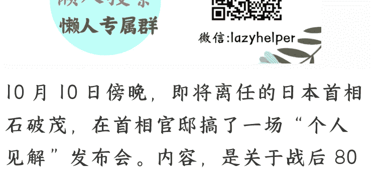

# 石破茂“最后一舞”——战后 80 周年见解

20251014 文/卢克文工作室嘉宾 低调老弟

整理：公众号懒人搜索，懒人专属群独享

懒人微信：lazyhelper

10 月 10 日傍晚，即将离任的日本首相石破茂，在首相官邸搞了一场“个人见解”发布会。内容，是关于战后 80 周年的反思。

这些话，在 8 月 15 号这个日本战败纪念日，石破茂没敢说。

9 月 24 号他在联合国大会的演讲，也没敢提。快下台了，仍不敢以首相身份谈话，只用个人见解的名义发出来。这出戏，演得颇有几分“欲说还休”的暧昧。

可这份个人见解，却像一把无形的利刃，直戳日本极右翼的肺管子。就在石破茂发表演说前几个小时，公明党告知高市早苗，退出执政联盟，来了一招措手不及的背刺。

公明党高举“政治资金监管”的大旗，开出的条件却暗藏杀机：一旦执行，自民党数千个基层支部将彻底“断粮”（政治捐款）。

这种条件，换了石破茂也不敢接。

可蹊跷的是，石破茂当总裁时，公明党对此只字未提——这分明是看人下菜，摆明了针对高市早苗。

公明党这个国会“老五”宣布“分手”后，“老二”立宪民主党和“老四”国民民主党迅速眉来眼去。

原本向高市早苗大献殷勤的“老三”维新会，瞬间撤回了之前向高市早苗表的忠心，转而在两大阵营间待价而沽。

1993年以后，就互相扯后腿的日本在野党，在公明党务实、石破茂务虚的双重夹击下——重新集结！如今，自民党在两院的席位都不过半。

下一任日本首相的宝座，高市早苗未必坐得上了。为什么石破茂的这次演说，冲击力如此之大？

答案，藏在他那篇暗藏五大灵魂拷问的雄文里。

## 「01 石破茂文本解析」

在石破茂之前，日本三任首相分别在战后五十、六十、七十周年谈话中，分别围绕日本应不应该谢罪、二战历史要不要翻篇儿的主题，展开论述。

到了今年八十周年，争论的焦点已经变成了安倍晋三的七十周年谈话是不是最佳版本的问题。

石破茂却讨巧地另辟蹊径，从日本为什么没能阻止战争爆发这个视角切入。

这个视角既新颖，又任谁都很难挑出毛病。

开篇，石破茂先表明立场，今年四次参加战争纪念活动，一直都很重视对战争的反思，不是快下台了，才借题发挥攻击政敌。

紧接着他以继承的名义，引用安倍晋三的原话，展开了第一次灵魂拷问：

> 即便在战后 70 年谈话中，也只是写道：“日本试图动用武力来解决外交与经济的穷途；国内的政治体制未能成为其刹车。除此之外，（安倍）并未展开更多论述。国内的政治体制，为何没有成为有效的刹车？”

高市早苗他们不是说安倍的谈话已经是最佳版本，既然安倍自己都说了，“国内的政治体制未能成为其刹车”，那么，我拿这个来批判，即便极右翼不满，也挑不出毛病。

紧接着，石破茂爆出猛料：

开战前由内阁设立的“总体战研究所”以及由陆军省设立的所谓“秋丸机关”等机构的预测皆认为，战败乃必然。

这是石破茂的第二次灵魂拷问：明知道打不赢，为什么还要打？

石破茂没有明说，但大家自然会联系到 2023 年以来日本智库对台海战事的三次兵棋推演。兵推暴露出日本决策机构反映迟缓，至少需要两个星期才能介入。

按照日本智库最乐观的估计，也只是在付出惨重代价之后暂时击退中国。这种兵棋推演和二战前一样，不可能把打不过的结论向社会公开。

石破茂引用历史，是在暗示：现在日本高层，和当年一样，明知打不赢，也不敢说。

接下来，石破茂从《大日本帝国宪法》、政府、议会、媒体、情报机构五个层面展开反思。

乍看起来，没什么新鲜的。其实，石破茂最犀利的第三次灵魂拷问就在其中：

1935年，关于宪法学者、贵族院议员美浓部达吉的“天皇机关说”，立宪政友会（在野党）将之作为攻击政府的材料加以非难，并演变为军部也被卷入的政治问题。

“天皇机关说”主张天皇只是国家机关之一，与之对立的是“天皇主权说”。

军部逼着政府查禁了“天皇机关说”，等于是承认了“天皇主权说”。

既然主权在天皇，那么答案显而易见。日本没能阻止战争的主要责任，就在昭和天皇身上。战后八十年了，有哪个首相，敢暗示天皇是战争责任人？

极右翼即使看出来了也没法反驳，因为他们还在叫嚣，日本应该是天皇统治的神国。如果他们说天皇没有责任，那就等于说天皇没有权力也不应该有权力。

所以在这个问题上，他们只能无能狂怒。

在“迈向当下的教训”这一最后的章节里，石破茂指出日本已经解决的问题，是改变了统帅权在天皇的制度，确立了文官统治，然后话锋一转：

> “这些毕竟只是制度，如不能得到妥善运用，其意义便无从成立。”

顺着这句话，石破茂展开了第四次，也是最具现实意义的灵魂拷问：

政治绝不可迎合一时舆论、以“博取人气”的政策损害国家利益，更不可为政党利益与一己私利而动。不可陷入过度商业主义；也不可容忍狭隘民族主义、歧视与排外主义。

这是明着指向高市早苗。

因为日本极右翼政客们，指责务实派过度商业主义，掉进钱眼儿里不敢得罪中韩。可他们这么干，是在迎合一时的舆论，损害国家利益，就像八十多年前一样。

历史的责任在天皇，现实的责任在首相。高市早苗啊，你可长点儿心吧。

演说的末尾，石破茂语重心长、文采飞扬地说了这样一句话：

如今仍持有战争记忆之人的数量逐年减少，记忆风化之虞渐增。

意思是，现在绝大部分日本人对战争都没有记忆，纯粹凭资料去了解二战，可他们看到的资料是删减版的。

石破茂的演讲里介绍了 1940 年，众议院议员斋藤隆夫发表的反军演说。并明确指出那份文件直到现在还有三分之二被删减不允许公开。

顺着石破茂的思路，我们也可以继续追问，历史认知不完整的就只有日本吗？列强在帝国争霸时代的所作所为与日本就有很大区别吗？如果他们不被清算的理由只是他们赢得了战争，那么日本人更容易反思的就不是战争，而是战败。

毕竟做正确的事，而不是做容易的事，很难。

问题来了，石破茂做的这件比较正确的事，得到了多少认同，又影响了多少人呢？

## 「02 石破茂演说反响」

按照我们对日本舆论的印象，石破茂这番言论估计会被一边倒地喷成“非国民”、“媚中”、“卖国”。

可日本最大的门户网站（雅虎日本)评论区下，竟是夸他的最多、理性讨论的次之、开喷的倒是少数。

正在我惊叹于日本网民的言论还比较正常时，又一个消息传来——日本在野党对石破茂演说的评价也是五五开。

- 立宪民主党（老二）：对战后和战前进行总结绝不是坏事。
- 维新会（老三）：不经内阁会议敲定，搞不清楚正式还是非正式的形式发表，这种做法有待商榷。
- 国民民主党（老四）：洞察到导致战争的体制问题，这一点很新颖。具有一定的意义。
- 日本共产党（老七）：石破茂完全没有对侵略战争和殖民统治的反省。

日本共产党向石破茂提出了灵魂拷问。这也是中国人民最关心的问题之一。就在个人见解发表后，面对NHK电视台的采访，石破茂说道：

> 「“必须正确认识日本曾经在中国和亚洲的所作所为。我们必须清楚地认识到，即使我们忘记了，但各地区的人民并没有忘记。我坚信，为了国家利益，让其他国家承认日本是一个诚实面对历史的国家是绝对必要的。”」

这段话，石破茂不敢放在演讲稿里，只敢事后小声逼逼的真“个人见解”。

尽管石破茂的演说具有局限性，毕竟他还是作出了五个贡献：

- 阻止了极右翼用安倍的 70 周年谈话盖棺定论的企图。
- 引出了美日同盟打不赢中国的可能性。
- 暗示了侵略战争的主要责任在天皇。
- 成为第一个讽刺极右翼政客迎合民粹不负责任的日本首相。
- 明确指出了日本二战史料的删减问题。

所以，中国媒体在指出石破茂演说局限性的同时，也基本给予了正面评价。但是，说一千道一万，评价再好。最终也得落实到对政权的争夺上才有现实意义。

那么，石破茂还有没有机会东山再起呢？

2025 年 2 月，石破茂为访问美国极尽谄媚之能事。包括但不限于厚着脸皮请安倍遗孀替他牵线搭桥、和外务省官员模拟日美峰会达一个星期之久、到了白宫连一件可能惹特朗普不快的关键问题都不敢提。

然而，自从特朗普发动关税战以来，日本财务省默许企业抛售美债。石破茂政府对美关税谈判的姿态，比欧盟和韩国都硬，结果也比这两家都要好。

以至于欧盟双主席和韩国总统都去日本“取经”，对特朗普提出的增加军费问题，石破茂居然也能坚决顶住。

另一边，中日韩经贸部长会议重启，中日韩自贸区谈判重启。日本防卫省更邀请中国人民解放军东部战区代表团访问日本。

一般来说，日本首相都是刚上台的时候雄心勃勃，石破茂却是一上来就窝窝囊囊，越到快下台的时候越闪闪发光。从执政的前半段来看，他像安倍晋三一样东山再起、重返相位简直是不可想象的。可越到后来我们越能发现，自民党的务实派里，菅义伟老谋深算也年老体衰，岸田文雄精于计算但人望低迷，小泉进次郎和河野太郎出身于门阀但尚欠火候。

最不被看好的石破茂，和安倍晋三亲自拉票都扶不起来的高市早苗两个人，成了新的权力游戏规则下，最能打的两个。

接下来，与高市早苗的斗争中，有日美关税谈判业绩的石破茂是务实派最好的选举招牌。但仅仅作为招牌还不够，石破茂还需要成为务实派的精神领袖。

所以，他必须在卸任前最大限度地宣传出他的精神，团结务实派，争取中间派。

石破茂的最后一舞，看似是一场孤独的告别，实则为日本沉闷的政坛投入了一颗深水炸弹。

这位只在任一年的内阁总理大臣，用一场回归制度与理性的演说，和任期内一系列讲究平衡、坚守底线的极限操作，撼动了日本长期以来“随美起舞”的外交惯性和自民党内的短视风气。

他的下台，虽是其个人政治路线的挫败，却也为未来日本在十字路口抉择时，埋下了一颗关乎独立与理性的种子。为日本的务实派吹响了集结的号角。

执政末期的石破茂，凭借对美关税谈判的良好表现，已经赢得了众多“石破别辞职”的呼声。战后 80 周年见解惊人的深刻、精巧和出人意料的好评更为他垫高了在国内外的政治资本。

也许，这次演说并不是石破茂的最后一舞。当一个政治家勇敢地擦拭历史的镜面，并尝试在霸权面前挺直脊梁。他所照亮的，已不仅仅是自己的政治前路，更是一个国家在迷失多年后，对独立自主与历史真相的艰难眺望。

## 最后，安利小懒的付费群：

懒人专属群（介绍）

📚 懒人专属群持续更新中，已持续运营 6 年，整理超 3000 份各类精选付费文章 & 年费社群干货，全部开放下载。

本资料为付费群内部分享，仅供真实有需要的朋友查阅 🙇‍♂️

懒人专属群更新记录：
https://lazy2025.top/blog/record2

懒人专属群更新记录（需梯子，备用）：
https://lazybook.fun/blog/record2