# 《露营创业实战复盘：从0做到月入2W+，完整拆解仓库、供应链、内容获客与私域打法》

251014 生财精华
公众号懒人搜索，懒人专属群独享
懒人微信：lazyhelper


## 为什么选择做露营

- **1. 蹭课遇商机**
大三那会儿，我专业课压力没那么大了，就总爱溜去商学院“蹭课”。有一次工商管理课上，一个男生分享了他准备启动的露营创业项目，老师听完点评了一句：“这个项目很有潜力。”就这么一句话，一下子让我来了精神，感觉机会来了。下课之后，我立马跑过去找他，要了个微信。

后来聊天的时候我问他，怎么就看上露营这个方向了？他的想法特别实在：
他说他老去江边逛，发现扎帐篷、出来露营的人越来越多了。他觉得，“有人的地方，就有市场”。再加上那会儿疫情还没完全结束，他判断大家这种想去户外的需求，会持续上涨。

我们后来又聊了好几次，发现想法特别投缘，干脆就搭伙一起干了起来。

## 第一篇：露营创业实操篇 ——起步与扩张

### 第一章：仓库选址

#### 一、如何系统性找到性价比高的仓库？

- **（1）起步阶段：借助校园资源，跑通最小可行性**
刚开始时，我们没敢把摊子铺得太大，就想花最少的钱，验证一下“露营装备租赁”到底有没有市场需求。

成本上，我们秉承能省就省的原则：最初只买了一小批装备，全塞在宿舍床底。有人下单，就从床底翻出来，用露营车拉着，再搭个共享单车送过去；等客户用完了，再搬回宿舍塞好。这么一来，最初的仓库租金就全省下来了。

客户也从身边找起。我们利用了自身“学生”的身份优势，直接瞄准大学生群体。他们虽然单次消费金额不高，但胜在人数基数大、社交分享意愿强，再加上社团、班级、朋友这些现成的社交关系网，订单很容易通过熟人网络扩散开来，消费潜力不容小觑。

那段时间我们没做任何推广，订单全靠“室友传朋友、朋友传朋友”的方式自然增长。这种“零推广仍有持续订单”的状态，让我们确信：校园里的露营租赁需求，是真实存在的。

那什么时候才考虑找正经仓库？
直到后来订单量逐渐增加，宿舍床底完全堆不下装备，每次搬运、收纳也变得格外费劲，效率严重影响，我们才下定决心，开始寻找专门的仓库。

- **（2）扩张阶段：选址前必做的市场调研**
在确定仓库选址前，我们对候选区域周边的草地资源进行了初步调研，主要评估三个维度：

- 一是草地本身和管控情况：比如周末人多不多、都是哪些人群，以及关键的是——让不让明火烧烤、需不需要预约、能不能过夜。这能帮我们判断这块地本身的吸引力和可用性。
- 二是配套完不完善：比如附近有没有厕所、方不方便停车、点外卖送不送得到，还有有没有好看的风景（比如能看日出、靠近河边）。这些是客户体验的关键，直接决定他们愿不愿意下单。
- 三是成本和覆盖范围：会比较热门景点、市中心和郊区的草地资源和仓库租金。但我们不单纯追求便宜，而是综合权衡，因为租金低的地方可能偏远，运输成本和时间成本就上来了。

- **（3）落地阶段：细化“仓库选址三原则”3天找到仓库**

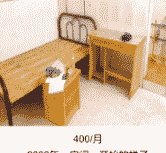
400/月
2022年，房间一开始的样子

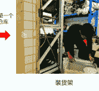
装货架

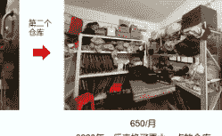
650/月
2023年，后来换了更大一点的仓库

结合之前的调研和我们还在校读书的情况，仓库的选址最终定在了大学城。

**为什么是大学城？**
一来，这里有好几片有知名度、受欢迎的大草坪，客流量稳定，我们也熟悉环境；
二来，当时该区域对明火烧烤的管理相对宽松，附近有2个厕所和2个停车场，还具备日出河流的观赏点，便于日常运营。
三来，大学城的租金比市中心便宜多了，也符合我们控制成本的需求。

定了范围后，我们是怎样快速找到具体的仓库点的？
我们总结了三条关键原则：

- **成本越低越好：** 优先选择租金低的房子，减轻创业初期的资金压力。
- **搬运必须省力：** 坚决找一楼空间，避免露营装备频繁上下楼搬运。
- **距离决定效率：** 尽量靠近主要草坪，缩短装备运输距离，提升服务响应速度。

**最终结果：**
我们成功租下了一个月租400元的一楼仓库，位置紧邻草坪。后来打扫仓库的时候，才发现这栋楼有好几个同行都租房间来做仓库，这也侧面验证了我们选址的合理性。

#### 二、仓库选址，如何不踩坑？
回头看这段经历，我们第一次选仓库运气不错，没踩大坑。但也有一些额外的问题是在接单运营后才慢慢看清的，会让我们更加意识到仓库选址的重要性。

最直接的体会来自服务不同区域的订单：

- **（1）仓库周边的订单**
这类单子做起来最顺手，几乎完全符合我们当初的设想。配送快、成本低、沟通方便，体验非常顺畅。

- **（2）跨区订单**
一旦接到跨区单，各种问题就暴露无遗：运费变高、响应变慢、协调成本增加。

- **（3）应对策略**
在实际运营中遇到仓库覆盖的服务范围有限的问题后，我们摸索出两条对策：

1. **小客户——找本地老板合作，不急着租仓库**
我们不可能在每个热门草地附近都租仓库，那样人力成本和租金都吃不消。所以，一旦遇到跨区的小批量订单，我们第一反应不是去租新仓库，而是直接联系当地的露营服务商（老板）合作。我们会先找到客户目的地那边信得过的老板，征得客户同意后，把订单转交过去执行。利润上我们一般拿三成，当作牵线搭桥的介绍费。

2. **大客户——清晰列出“人工费”和“运输费”**
刚开始我们也担心收远程费会吓跑客户，也确实因此丢过单子。后来我们调整了策略，主要面向企业客户或大型团建订单才提供远程服务。报价时，我们会清晰列出“人工费”和“运输费”，并说明这些是付给货拉拉司机和临时工人的成本，我们没从中赚钱。结果发现，大多数企业客户并不排斥，我们越透明，他们越放心。因为他们更看重服务方是否靠谱、是否有成功案例。如果订单足够大，我们还会主动提出减免这笔费用，以此展现合作诚意。

**总结一下：**
选址不能光图便宜，关键是在“租金”和“服务范围”之间找到平衡点。万一仓库的覆盖的服务范围有限，也有办法应对：小单子可以合作共享，大单子可以透明报价。灵活运用这两招，能突破地域限制，赚更多的钱。

### 第二章：装备采购

#### 一、采购如何不花冤枉钱，还能让客户体验拉满？

- **（1）采购踩坑：曾为“品牌光环”买单，交了笔学费**
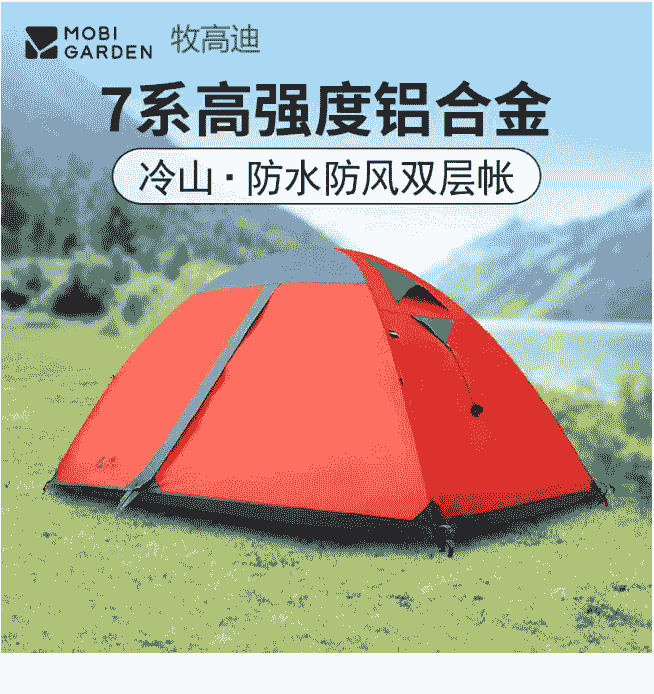
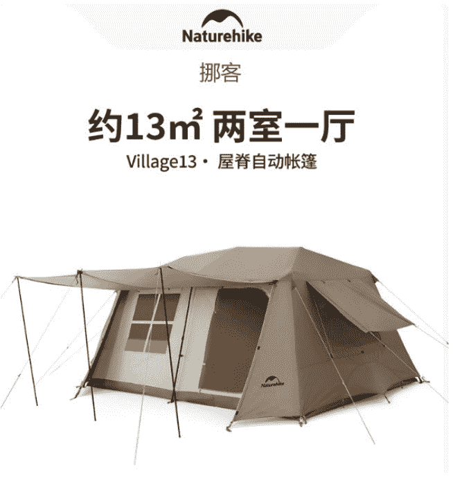
SZXL（三只小驴）
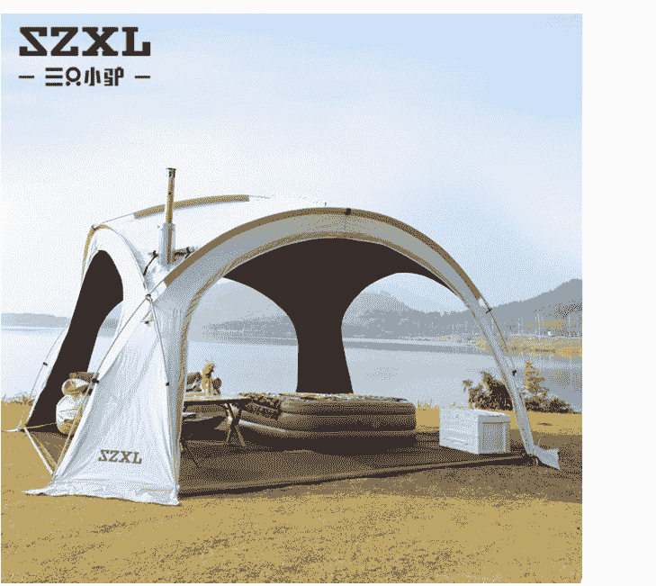
山之客 Mountainhiker
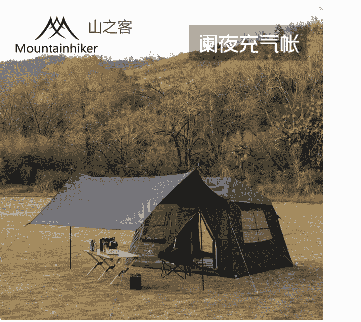
阑夜充气帐

创业初期，我们想当然地觉得，只要用的都是知名品牌，客户肯定就满意。
当时，我们了解的采购渠道仅限于淘宝和京东，目光锁定在牧高笛、挪客、山之客等知名品牌。恰逢露营热潮，当时装备价格也不便宜，一把质量还不错的纯色克米特椅，动辄就要一百几十块。

我们当时的逻辑是：采买品牌装备，一来能保证用户体验，二来能靠品牌名气建立信任感，甚至都计划好了，要把“全系都是品牌装备”当成宣传亮点，吸引客户下单。

但现实很快给了我们一课。实际运营中发现，绝大多数客户并不关心装备是哪个品牌。他们的核心关切非常务实：帐篷拍照是否上镜、夏季是否凉爽防晒、内部空间是否宽敞、以及套餐整体价格是否实惠。

品牌价值并未直接转化为客户付费意愿，我们当初为品牌多花的那些钱，客户几乎感觉不到其价值。

- **（2）优化上岸：借前辈资源，构建成本优势**
幸运的是，入行没多久，我们就遇到了几位前辈帮衬一二。这些前辈大多本来是做旅游的，看到露营的趋势，就顺带做了露营业务，还与工厂建立了供货关系。我们后来就转为通过前辈采购——他们以比出厂成本稍高一点的价格给我们供货，自己只赚取合理的差价。

没想到这批“非品牌”产品在实用性、质量上与品牌装备差异微乎其微，但我们的采购成本一下降了近30%。省下来的钱，要么能让利给客户，让我们的定价更有竞争力；要么能投到服务升级上，把客户体验做得更好。

而且，在和前辈的交流中，我们了解到：不少品牌产品，其实也是找代工厂贴牌做的。这让我们对"品牌溢价"有了更直观的认识。

### 第三章：定价

#### 一、如何让套餐“看起来”更值钱？
定价初期我们也没少纠结，既没经验，又怕定高了吓跑客户，定低了又白忙活。于是在定价之前，也做了一系列的市场分析。

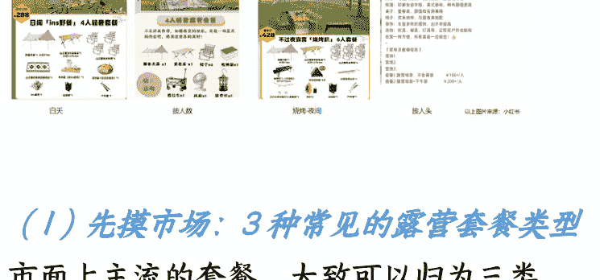

- **（1）先摸市场：3种常见的露营套餐类型**
市面上主流的套餐，大致可以归为三类，对应着不同人群的需求：
- 按人数划分：如2人、4人、10人等规格套餐，满足不同规模的团体需求。
- 按时长划分：如上午场、下午场、夜场或几小时短时套餐，适配多元的时间安排。
- 按主题划分：如亲子露营、情侣套餐、特定风格主题（如黑色系）或烧烤专场等，提供差异化体验。

- **（2）再拆套餐：套餐的“真实价值”，不在表面的装备数量**
- **帐篷分析**
关注对方的帐篷的尺寸，大小，防晒性能，实际可容纳多少张桌子和椅子。
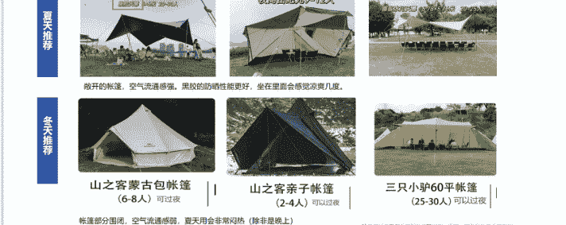
- **凳子分析**
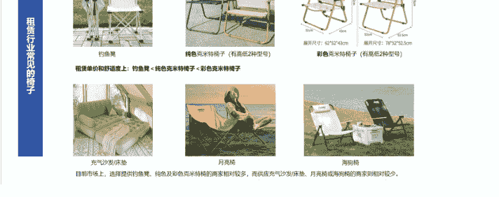
- **桌子分析**
分析桌子，注意的是——桌子的类型以及长度
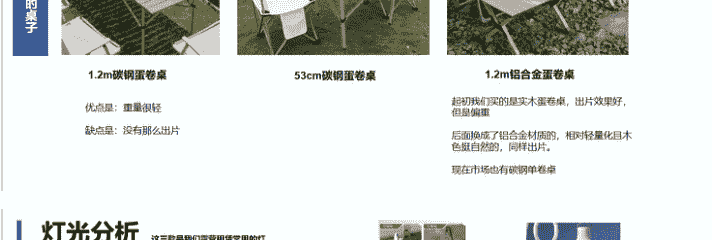
- **灯光分析**
这三款是我们露营租赁常用的灯


我们发现，看一个套餐值不值，光比价格和数量没用，关键得把它的装备和服务仔细拆解。有些套餐看似便宜，但装备或服务可能存在“缩水”，反而影响体验。

#### 2-1 装备价值拆解：
全天露营舒不舒服，关键看帐篷、椅子、桌子、灯光这“核心 4 件套”的具体规格：
- **帐篷容纳能力：** 不能仅看人数标注，要关注帐篷大小是多少，比如有些商家标“10人套餐”，但实际帐篷比较小，只能遮住装备，10 个人坐进去还得在太阳底下晒着。
- **椅子舒适程度：** 有的套餐配的是钓鱼凳，确实轻便，但座面小，高度低，长时间坐容易累。而克米特椅，后背有支撑，坐垫面积大，坐起来舒服得多。
- **桌子规格考量：** 套餐说提供桌子，仔细看，是 53 厘米宽的铝合金小桌，仅能摆放少量物品；一般标配都是 1.2 米的蛋卷桌，一张蛋卷桌可容纳 4-6 个人。
- **灯具适配情况：** 有的套餐只提供星星灯和马灯，星星灯主要用于氛围营造，如果缺少大饼灯这种主照明，晚上帐篷里几乎看不清，客户可能还得额外租灯，体验感下降。

#### 2-2 服务价值拆解:
有些商家把套餐价定得低，加微信咨询才发现，很多服务要另算钱。所以我们拆套餐时，会重点关注这些“没写在明面”的服务：
- **搭卸是否另收费：** 有些套餐不含搭建服务，只是提供装备而已，搭建需要额外收费。
- **超时费用说明：** 有的商家服务时间只到晚上的21点-22点，可是客户想玩到凌晨，得提前告知清楚有超时费或者营业时间范围，不然客户玩得正开心，突然被告知要加钱，就不太好。
- **能不能补租装备：** 客户想加个烧烤架，但有的商家的运输团队是外包的，补租东西有时候是不送的。

- **（3）实战落地：我们是如何打造的套餐？**
套餐定价
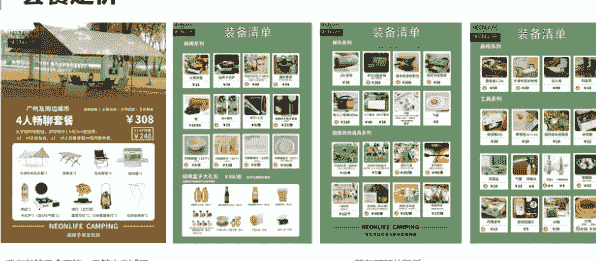
我们做的是全天的，虽然也尝试了时间段的，但是没有一个人点时间段的，后来就取消了

装备可额外租赁
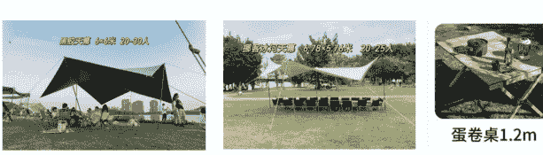
摸清了市场行情，也分析透了同行的套餐模式后，我们回头来敲定自己的产品方案和定价策略，核心目标就是让客户感觉“清楚、够用、不亏”。

我们的套餐设置主要围绕以下几点展开：
- 主推全天基础套餐：按人数计费，套餐内包含帐篷、桌椅、照明等核心装备，满足绝大多数用户的全天露营需求。很多客户有烧烤需求，我们默认配烤盘，也支持按需置换为烧烤架。
- 提供灵活的按需租赁选项：烧烤架、桌游、额外的氛围灯等都可以单独租，所有物品都是明码标价的。
- 大学生优惠：给大学生设置了专属9折优惠，降低他们的使用门槛，我们也赚个回头率。

## 第二篇：自媒体运营

### 一、如何靠两篇小爆款笔记获得120人团建订单与媒体邀约？
解决了仓库、货源、定价这些难题后，新挑战接踵而至：怎么让更多有露营需求的人找到我们？“团队里另一位伙伴负责客户接待与执行，于是，我便主动扛起了自媒体运营的担子。

最开始做账号的时候，流量不太理想，一篇笔记发出去，只有几百个阅读量，不过意外的是，虽然一开始的内容没有很好，但是也能接到一批客户的咨询与订单——

公众号懒人搜索，懒人专属群分享
估计是赶上了平台初期流量扶持，加上露营需求确实在增长。

后来，就耐着性子，边看课程边实践复盘，一点点调整内容，慢慢才找到感觉，没想到最后还做出了小爆款笔记，甚至接到了企业大单和媒体邀约。摸索中，我们慢慢抓住了几个关键点：

- **（1）素材**

最开始做自媒体的难题就是没素材，总不能光靠文字说“我们家装备全”吧？后来我们想了几个办法积攒素材：
先找身边同学帮忙，跟他们说“免费让你们去露营，帮我们拍点照片视频就好”，这样才拿到了第一批真实的露营素材。之后又厚着脸皮找到前辈，他们每次布置露营场地，我们就提前打招呼，征得同意后去拍些图片。再到后来自己的订单多了，就有意识地拍整套服务流程（送装备、帮客户搭帐篷、结束后收拾清洁的画面等），就这样素材越攒越多，后面发内容就再也不用愁没东西更了。

16/49

- **（2）封面**
- **套餐视觉优化**
从表格到图文四次更迭（有的同行，没做图文，就会直接做一个小程序，让客户选择和下单）
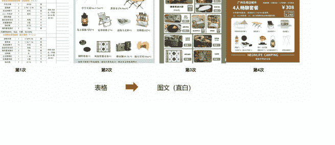
- **封面**
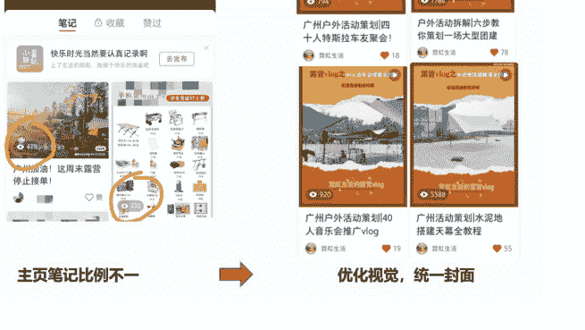
- **第三步：多平台发布**
素材和套餐定价准备好后，我们开始在小红书、抖音、视频号和朋友圈同步发布内容。

没想到刚发几条就踩了坑：当时把套餐信息做成表格直接发出去，结果平台一压缩，字小得像蚂蚁，加上图片尺寸不对版，客户根本看不清。

吃一堑长一智，后来我们特意去查了小红书、抖音这些平台的图片视频尺寸要求，重新设计套餐表的版式，并持续优化迭代；封面风格也越做越统一，别人点进我们账号主页，一眼就能认出 “这是做露营租赁的”，辨识度不知不觉就上来了。

- **（3）开通企业号**
刚开始发了没几篇笔记，小红书的客服就主动找到我们，建议开通企业号，说这样获客会更方便，还能直接在上面卖货。我们当时正好也想试试线上卖货，就顺着建议开了。

结果开了之后才知道，这个类目，想在小红书卖货得交 2 万押金，客服之前压根没提这事儿。对我们刚起步的小团队来说，2 万不是小数目，最后卖货的计划就没启动。

不过企业号在当时还是有用的。那会儿平台管理没现在这么严格，我们尝试在笔记里直接留微信号，居然是可以的。客户看到内容想咨询，不用绕来绕去问半天，直接加微信就能聊。

现在不行了，平台管得严，再这么留联系方式基本会被限流甚至下架笔记。后来我们没续费专业号，之前那些带联系方式的笔记都被自动清理了。

另外，更新的内容的时候，也会遇到难题：经常这期发完，下期就不知道拍什么了。后来，我们开始借助聚光平台以及新红、灰豚、千瓜等第三方数据工具来解决这个问题。通过这些平台，我们可以系统地查看露营相关的关键词热度、分析近期的爆款内容和涨粉最快的达人，从而快速获取内容灵感和选题方向。

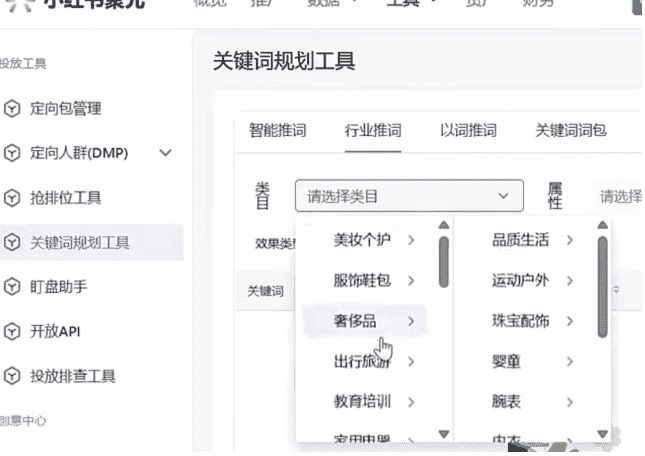
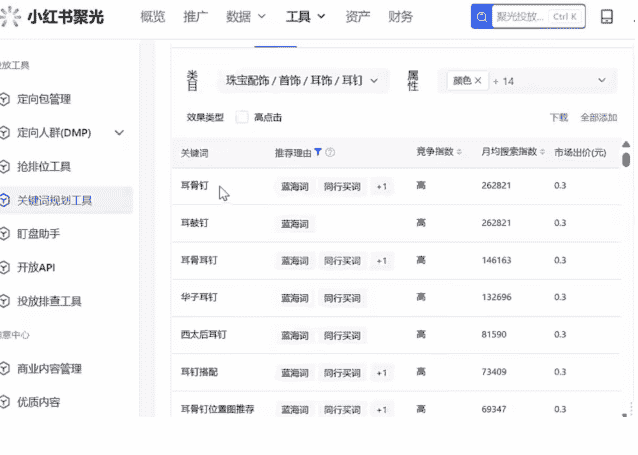

- **（4）标题关键词**
标题里埋关键词也很重要，因为我们做的是“本地草地露营”这个细分方向，所以发笔记的时候，会特意在标题和内容里加“城市名 + 草地露营 + 装备租赁”这种词。比如标题会写 “XX 市草地露营装备租赁”，这样客户在小红书搜 “XX 市露营租赁” 的时候，我们的笔记更容易被刷到，来咨询的基本都是真有本地露营需求的精准用户。

- **（5）利他选题**
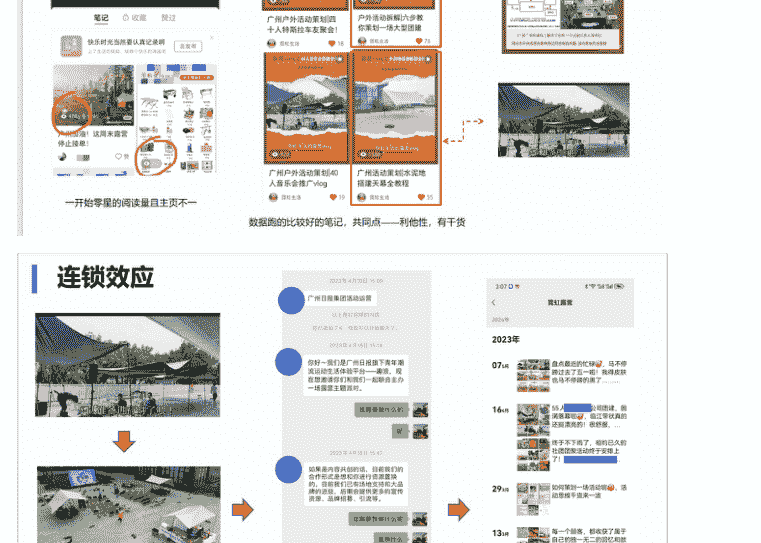
不过做内容最关键的一个转变，是我们从“说自己好” 转向了 “给客户真正有用的干货”。

最开始发笔记，只会说 “我们接了什么单” “我们有什么装备”，全是自我宣传，没多少人愿意看。后来才意识到，客户刷小红书是想获取对自己有用的信息，比如“如何挑选合适尺寸的帐篷”“露营新手怎样选装备不踩坑”。

想通这一点后，我试着往干货方向调整内容，没想到，点赞和收藏数比平时直接翻了几倍。两篇小爆款笔记就给我们带来了120人团建订单与媒体邀约。

#### （1）一条水泥地搭帐篷视频，带来120人公司团建订单
之前有个朋友介绍我们接了个活儿——给一场音乐会搭帐篷。跟平时不一样，那次的场地是水泥地，不是常见的草地，搭帐篷的办法得重新琢磨。

我尝试把整个搭建过程拍了下来，剪了条叫《水泥地搭建天幕全教程》的视频，里面重点讲了“没法打地钉的时候，怎么固定帐篷才稳”——比如如何用沙袋当地钉、怎么调整防风绳这些实用技巧。

虽说这是我第一次拍剪视频，画面清晰度和节奏也没把控好，制作不算精良，可没想到它居然成了我们第一个小爆款，阅读量比以往笔记都多，跑到了5000。

更意外的是，有家公司的活动负责人刷到这条视频后主动找过来，说他们要在公司门口办120人的户外团建，场地也是硬地，看到我们有经验，就想跟我们谈谈。最后沟通得很顺利，顺利签了服务合同，这也是我们第一次接这么大规模的企业单。

#### （2）一篇团建场地布置分析，获《广州日报》活动邀约

之后，我又针对那场 120 人团建的场地规划，写了篇标题为《户外活动拆解 | 六步教你策划一场大型团建》的笔记。我本身是美术生，学的是环境设计，所以写的时候特意结合了自己的专业视角，在内容里说清楚场地是怎么划分功能区、整个筹备流程该怎么安排。

没想到《广州日报》负责露营活动的人刷到了这篇笔记，主动加了我们微信，说想邀请我们帮他们主办的露营活动做场地规划。当时真的特别兴奋，觉得自己的内容被认可了，可遗憾的是，那时候正好赶上毕业季，论文、答辩还有团队的事堆在一起，实在抽不开身，最后只能特别可惜地婉拒了。

#### （3）案例背书，让订单来源更稳定

更长远的好处在于，有了“120 人团建”这一成功案例作为背书，很多企业在寻找露营团建服务时，看到我们的相关笔记后都会主动咨询。渐渐地，订单量稳步增长，客户咨询量也比以前多了。

## 第三篇：私域与客户洞察

### 一，如何从用户咨询中反推出产品优化与跨界机会？

做私域运营最意外的收获，是发现客户的每一次咨询、每一个疑问，其实都是优化业务的线索。

我没把 “客户咨询” 当成单纯的 “回答问题”，反而花了很多心思从里面挖信息、找机会，慢慢不仅把服务理顺了，还拓展了新的业务方向。

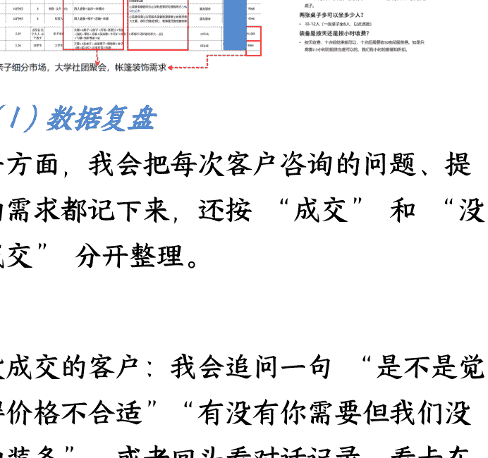

#### (1) 数据复盘

一方面，我会把每次客户咨询的问题、提的需求都记下来，还按 “成交” 和 “没成交” 分开整理。

- 没成交的客户：我会追问一句 “是不是觉得价格不合适” “有没有你需要但我们没的装备”，或者回头看对话记录，看卡在哪个环节，慢慢就摸清楚哪些地方是短板。
- 已成交的客户：会主动问 “这次体验里最满意的是哪部分”，有人说 “你们送装备特别准时”，我们就把这个优势保持住，还在宣传里重点提。这些细碎的反馈，帮我们补上了不少服务盲区，也巩固了自己的长板。

另一方面，只要有空，我就会去露营现场帮忙搭装备、跟场。线上聊再多，也要去一线现场看一眼 —— 比如会发现到了晚上光线暗，露营地的绳子黑黢黢的看不清，很容易绊到客户或行人，我们就换成彩色的反光绳，把这个隐患解决了。这些潜在需求和体验痛点，光看咨询数据是发现不了的。

就这么复盘了一段时间，我们梳理出 3 个可以优化的方向，后来也实实在在落地了：

- 一是，把客户问得最多的问题，整理为 PDF：客户再问类似问题，直接发手册过去，省了不少重复沟通的时间；而且这些高频问题，后来也成了我们自媒体内容的选题。
- 二是，我们发现亲子细分市场潜力显著：很多家庭办生日会、亲子聚会时，特别舍得花钱，还会注重帐篷装饰。我们只会做简单的装饰，于是，干脆对接了专业露营装饰团队，他们负责装饰，我们负责装备，一起给亲子客户做 “装备 + 布置”的套餐，客户满意度蹭的一下，就上去了。
- 三是，大学生社团活动规模大、频次高：社团迎新、节日聚会经常要租几十人的装备，人数多了，消费总额就上去了。因为我们本身就在校园里，就趁社团招新的时候去发传单、跟社团负责人聊，给优惠，拉订单。

慢慢的，随着内容更新和迭代、口碑也攒起来了，订单量也稳定了不少：

周末和节假日平均能接 5 到 17 单，忙的时候连零散租赁加起来能有 40 到 50 单；就算是工作日，也能稳定在 4 到 5 单。月收入从最开始的几千块，慢慢涨到了 1 万到 2 万......。

客户来源数据显示，小红书、抖音与老客转介绍成为三大核心渠道，为我们提供了持续稳定的客源。

#### (2) 餐饮服务

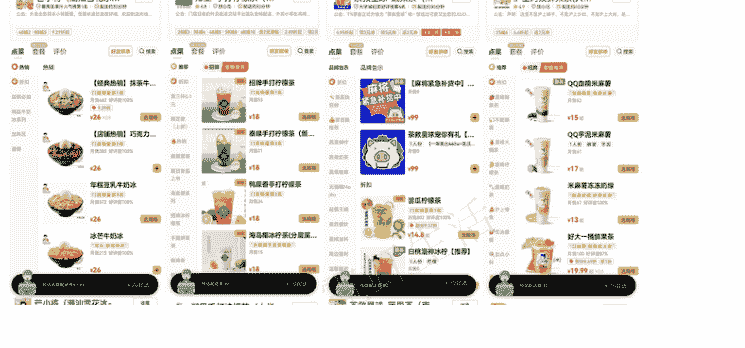

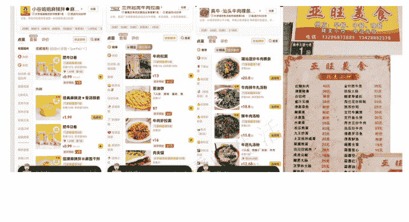

##### 烤串系列

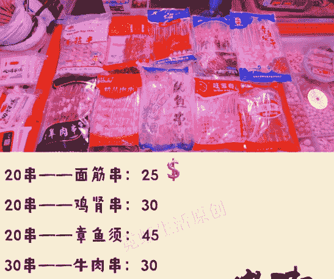

- 20串——面筋串：25
- 20串——鸡肾串：30
- 20串——章鱼须：45
- 30串——牛肉串：30
- 20串——鸡中翅：50
- 20串——骨肉相连：25
- 20串——鱿鱼串：45
- 30串——掌中宝：45
- 30串——羊肉串：30
- 20串——五花肉串：30
- 20串——鸡柳：25

##### 烤肉


##### 秋来贴膘

##### 牛肉丸系列


- 250g牛肉丸 13元
- 幸乐 500g 牛肉丸 30元
- 老潮汕 500g 牛肉丸 25元
- 潮汕精品 500g 牛肉丸 35元
- 牛百年 500g 牛肉丸 40元
- 潮汕风味 500g 牛肉丸 60元
- 潮乡人墨鱼丸 500g 35元
- 潮乡人黄金鱼蛋 500g 25元

##### 肠仔系列

- 久千代鲜肉肠 500g 18元
- 食中王道地场 560g 25元

##### 蔬菜+肉系列

- (未腌制) 鸡翅25元/斤
- (未腌制) 鸡腿10元/斤
- 韭菜 6/斤
- 玉米 6/斤
- 豆角 7.5/斤
- 蒜苔 9/斤
- 茄子 4/斤
- 白菜 4/斤
- ......
- 一次性碗20个 10元
- 大的盘子10个 15元
- 调味料......
- 蔬菜价格会有变动，根据当天蔬菜的价格来定
- （如若想要的蔬菜没有，可以咨询一下老板，看市场是否有）

##### 丸子系列

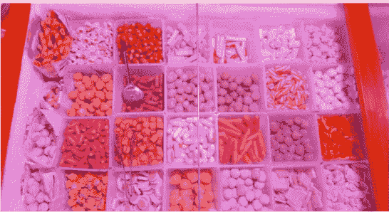

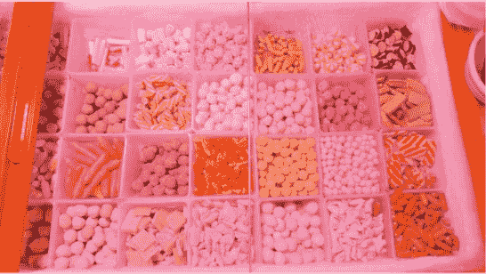

- 丸子10元/斤

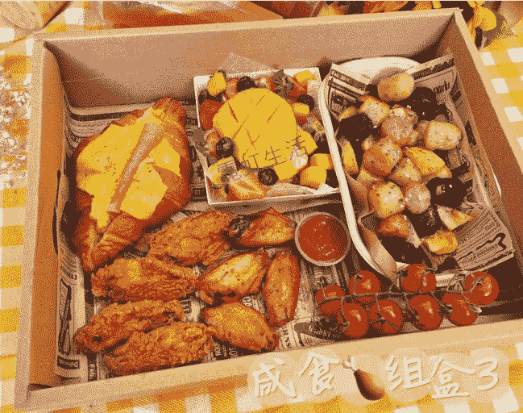

##### 咸食组盒3

##### Barbecue（六人套餐）598元

- 肉类
  - 1.上脑牛排x3份
  - 2.上脑肉片x2份
  - 3.牛舌x2份
  - 4.猪五花x3份
  - 5.猪颈肉x3份
  - 6.猪梅花x3份
  - 7.黑椒肠x6根
  - 8.鸡扒x6块
  - 9.黑虎虾x6只
  - 10.牛五花x2份
- 蔬菜
  - 1.土豆x6份
  - 2.金针菇x6份
  - 3.贝贝南瓜x6份
  - 4.生菜x6份
  - 5.杏鲍菇x6份
  - 6.香菇x6份
  - 7.芦笋x6份
- 赠
  - 灵魂小料：大蒜、辣椒圈、迷迭香、小番茄、秘制蘸料
  - 烤肉工具：烤炉、剪刀、食物夹、食用油、海盐、黑胡椒

香·嫩·脆·爽口

鲜·嫩·美·味

是这样的顾客，这个烤肉和野餐盒子是另外商家在做，可能需要您自行加他微信沟通一下，联系方式我放后面了。就相当于是我这边给您有这么一个订购的渠道，方便您的食材选购，我也是没有什么收取任何人头介绍费的，我下单也是原价给我，商家也是我在小红书找到的。如若您对这边的食材有兴趣，您可以深入加微信或者小红书了解看看符不符合您的需求

##### 1-1 初期阶段：尝试通过赚取差价盈利

在客户从自媒体转入私域咨询的过程中，我们发现许多客户除了租赁装备外，还有烧烤食材采买的需求，但他们往往不清楚该去哪里购买。为此，我们尝试与本地烧烤食材供应商合作，扮演中间人角色：

合作方式：客户提出食材需求，我们将清单转交合作商家。商家报出底价（例如 5 元/份），我们在此基础上小幅加价（如 6-7 元）提供给客户，每份赚取 1-2 元差价。平均每笔订单可额外增收十几至二十元。

服务流程：客户提交需求→我们转发至商家→商家确认库存与价格→我们反馈客户并敲定订单→商家按约定时间配送到指定地点（如下午 5 点送达营地）。整个过程中我们负责协调与沟通。

##### 1-2 调整策略：从赚差价转向提供信息

后来客户越来越多，需求也变得多样：除了基础烧烤食材，还需要“包装精致的烤肉盒子”和下午茶甜品。但我们作为中间方，难以对供应商的品控进行实时监督——食材是否新鲜、甜品是否卫生，我们都无法直接把控。一旦客户收到不新鲜食材或出现食用问题，还会找我们追责，砸的也是我们自己攒的口碑，想想觉得太不划算。

最后我们干脆停了赚差价的模式，改成整理“餐饮商家指南”。把周边能送露营地的餐饮商家都列出来，比如哪家有烤肉盒子、哪家能做下午茶、大概有什么产品，整理成 PDF 发给客户，让他们自己选、自己联系。虽然少赚了点钱，但不用担心品控风险，也能给客户提供他们需要的信息。

#### (3) 分销裂变

##### 小程序分销

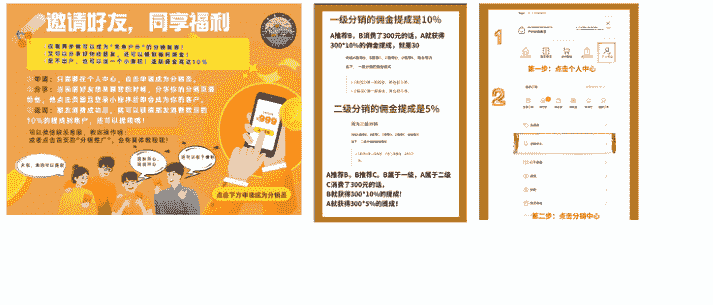

##### 小程序会员

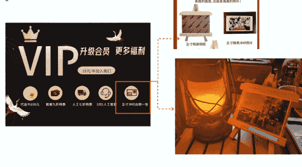

干了一段时间我发现，露营装备租赁这行有个明显特点：大部分客户都是一次性体验，10 个里大概只有一两个会再来租第二次，复购率确实不高。但也有个好现象 —— 很多体验过的客户，挺愿意把我们推荐给朋友，经常有人说“我朋友想露营，我把你微信推给他了”。

既然老客户自己不太会反复租，却乐意帮我们宣传，我们就琢磨：怎么能让他们更主动地转介绍呢？了解了一圈运营方法后，决定做个小程序，靠老客户裂变拉新。这个小程序除了能直接下单租装备，还重点加了两个核心功能：一个是分销激励，老客户推荐朋友下单，能拿到一点佣金；另一个是会员体系，充值能打折，还能领专属优惠券。想靠这两个点提高老客户的积极性的同时，可以吸引新客户成为会员。

过去，我对“会员储值”和“发放优惠券”这类运营方法始终抱有疑问——它们究竟能产生什么实际价值？直到后来深入研究了一些商业案例和商业模式，才明白：比如餐厅给客户发满减券，客户为了用掉券会再来消费，来了之后可能还会点以前没吃过的菜，慢慢就养成常来的习惯了。

我们觉得这个逻辑也能运用到露营业务上：给会员发张“下次租赁减20元”的券，就算客户自己近期不用，也可能会转给有露营需求的朋友；要是老客户自己用了，也能加深对我们的印象，提高粘性。

此外，我们还发现，客户露营完都爱拍照发朋友圈，我们就定制了带自己品牌Logo的小相框，现场帮客户打印照片装进去——花不了多少钱，但客户觉得贴心，发朋友圈的时候自然会带上相框，等于帮我们免费宣传了。

当时还计划在小程序里加个“接龙卖货”功能：先建个客户社群，要是客户露营时觉得我们的野餐垫好用、迷你炉方便，或者觉得营地周边农户的水果新鲜，我们就记下来，去对接货源，然后在小程序里接龙售卖。本来想着这既能满足客户需求，又能多开辟个营收渠道。可惜的是，等我们小程序开发好，露营的热度已经下去了，我们做私域的意识觉醒得也有点晚。

疫情放开后，大家能去旅游、去打卡的地方多了，露营不再是首选，之前设想的分销、卖货这些功能，因为拉新和裂变困难，没有推起来。虽然有点遗憾，但也还是有收获，至少搞懂了私域裂变可以怎么做，也算积累了经验。

## 第四篇：服务升级与跨界拓展

### 一，我们是怎么一步步接到企业大单的？

#### 成果沉淀

后来，我们终于有了属于自己的工作室，结识了更多志同道合的伙伴，还添置了一辆实用的三轮车，搬运装备再也不愁了。
一路走来，我们也积累了更多的案例和服务经验。

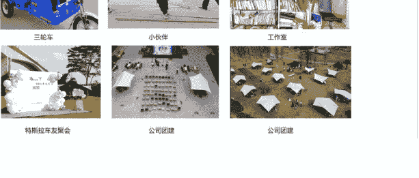

三轮车  小伙伴  工作室
特斯拉车友展会  公司团建  公司团建

##### (1) 运输：从露营车到三轮车

最开始没什么钱，运装备全靠一辆露营车，在草地和仓库之间来回跑。那时候订单少还能应付，后来单量一涨，尤其是遇到好几个客户同时要送装备，露营车根本不够装，来回跑五六趟都送不完，效率太低了。于是我们就入手了一辆三轮车，运输问题才得以缓解。

##### (2) 资质：从“个人接单”到“公司接单”

最开始做草地装备租赁，其实门槛不高，有装备、能凑出套餐就能做，服务的也大多是个人客户。但后来我们想往上再够一够，接更大的单子，才发现 “个人” 和 “企业服务” 完全是两回事：

- 一方面是资质得够。企业客户特别看重合规性，比如要签合同、开发票，还会问 “有没有营业执照”，我们之前没注册公司，连发票都开不了。后来赶紧注册了公司，把营业执照、开票资质都办齐了。
- 另一方面是需求得接住。企业团建不只是要帐篷桌椅这些基础装备，经常会提额外要求：比如要音响、投影仪搞活动，要乐队乐器烘托氛围，甚至还需要我们帮忙策划互动游戏、找能控场的领麦人。为了满足这些需求，我们不仅自己花钱添了音响、投影仪这些设备，还联系了乐队的朋友，慢慢搭起资源网。

##### (3) 资源：跟前辈搭伙，搞定百人级团建

沉淀一定的案例后，我们逐渐接到一些大型订单，但我们自己的装备根本不够，一般缺的是桌椅。要是自己买，不仅成本高，平时没大订单还占仓库。这时候前辈给了个办法：他们手里有装备，我们可以提前跟几家前辈协调好时间，把他们的装备凑过来一起用；活动结束后，按提前贴好的品牌标记分拣装备归还，利润也按装备数量比例分。

而且前辈们接“两百人以上活动”“粤港澳大湾区户外三日赛”这种高规格的项目，有时候人手不够，会喊我们过去帮忙搭帐篷、管现场，也让我们积累了更多现场服务经验。

##### (4) 流程：从“凭经验”到“标准化”

大型活动最怕出岔子：之前有次搭天幕，杆子卡进地里拔不出来；还有次企业要用乐队，结果乐器和现场电源难以调整同频，折腾了半天差点耽误活动。吃了几次亏后，我们总结出一套标准化流程，尽量把风险降到最低：

- 提前一天归集装备：活动前一天，把所有要用到的装备（包括从别人那借的）都收回仓库，统一清点、检查，坏的提前修，缺的提前补；
- 当天装车二次核对：装车的时候，再对着订单清单核对一遍，确保没漏装备，也没把坏的混进去；
- 基础装备多备 1-2 套：天幕、桌椅这些基础装备，多备 1-2 套，万一现场有装备坏了、丢了，能马上补上去；
- 现场全程盯：搭完装备后，会把灯光、音响、电源都试一遍，确保能用；团队里留两个人全程在现场待着，客户有临时需求，比如要加个灯、换个桌子，能马上响应；
- 客户离场后及时收尾：客户一般晚上9-10点离场，他们一走，我们就赶紧拆装备、装车，把场地清洁干净。当天把装备送回仓库，不拖到第二天，免得夜长梦多丢东西。

就这么一步步升级，从运输到资质，从接小单到扛大单，再到把流程捋顺，我们才真正具备了接企业级订单的能力，业务也比以前稳多了。

### 二，如何拓展资源，开辟新盈利可能？

在把服务能力提上来的同时，我们也没盯着露营租赁这一件事，而是试着跟不同领域的人合作，想看看能不能拓展点新渠道。这期间也试了几种合作模式，有做成的，也有没做成但长了经验的：

#### (1) 露营小酒馆

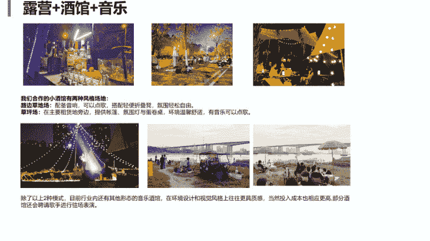

我们手里有现成的露营装备，平时会有想做露营周边生意，却没装备的人找过来谈合作。其中跟小酒馆的合作，算是合作相对比较久的。

小酒馆那边有调酒的技术和现成的人手，他们负责在现场调饮品、给客人做服务，搭装备、收装备，不用我们额外派人盯场；我们这边就出全套露营装备和一辆供他们运货的三轮车，蓝牙音箱没人租的时候，就拎过去。

提成按月结算，金额为酒馆总营业额的两成，每月大约1000到1500元。虽然不算多，但无需额外投入精力，相当于为装备找到了一条“创收的副业”

##### 烤肉盒子

他做的烤肉盒子是，有烤炉，炭火，蔬菜和调料，而且全都是独立包装的


我们平时常跟行业里的前辈聊天，他们会跟我们分享最近市场流行什么、自己琢磨了什么新产品，或者有没有靠谱的工厂资源。有时候他们找厂家生产了新的产品，还会让大家一起试试、提提意见，其中一次关于“烤肉盒子”的合作，给我们启发特别大。

有个前辈跟供应链合作，做了当时挺火的烤肉盒子。跟市面上那种“牛皮纸盒 + 肉菜混装”的不一样，这款烤肉盒子采用“肉品独立包装 + 附赠炭火”的设计，又卫生又好用，用完了叠起来就一个盒子大小，客户带出去露营很方便。定价也不算高，性价比很突出。前辈找我们帮忙拍视频宣传，还问我们觉得这产品怎么样。

那时候我不光觉得产品做得好，更打心底佩服前辈“捕捉市场需求 + 快速资源对接”的能力。一个人的赚钱黄金期，往往离不开对商机的敏感和迅速的行动力。

#### (3) 大学生兼职

此外，我们还为一些有需要的大学生提供了兼职机会，他们可以通过参与我们的运营活动获得额外收入或积累实践学分。这也让我真切体会到以往常说的“创业带动就业”的现实意义——尽管规模尚小，但确实在尝试为身边人创造更多机会。

## 第五篇：赛道转型机会

### 一，2025 年露营赛道还有什么机会吗？

2025 年纯露营赛道机会有限，装备租赁已陷入价格战，建议转向以下两种模式：

#### 亲子旅游和研学

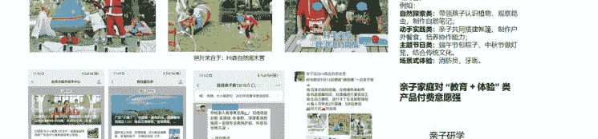

将露营+游戏+场景式体验，结合围绕“教育性+趣味性+安全性”设计活动内容。
例如
- 自然探索类：带领孩子认识植物、观察昆虫，制作自然笔记；
- 动手实践类：亲子共同搭建帐篷，制作户外餐食，培养协作能力；
- 主题节日类：端午节包粽子、中秋节做灯笼，结合传统文化。
- 场景式体验：消防员、牙医。

亲子家庭对“教育+体验”类产品付费意愿强
亲子研学
亲子旅游
1-2日游


#### 数据分析

| 序号 | 日期 | 人数 | 群体/年龄 | 买了什么东西 | 沟通的感想（需求点） | 通过什么平台加我们 | 微信号 | 金额 |
|---|---|---|---|---|---|---|---|---|
| 1 | 10月1日 | 10 | 学生 | 1人套餐 | ①趣味游戏的制作？②需要大大的垃圾桶③附近的垃圾筒在何处放置 | 朋友推荐 | | ¥475 |
| 2 | 10月2日 | 32 | 家庭亲子 | 25人套餐，星星灯植物灯8组，椅子 | ①和食品？②需要帐篷多久固定？③如果需要25人露营有什么建议？... | 朋友推荐 | | ¥1,366 |
| 3 | 10月2日 | 6 | 中年30-40 | 天幕+10把椅子+2张亲子桌 | ①需要好位置（大树下的阴凉的位置） | 朋友分享 | | ¥303 |
| 4 | 10月2日 | 4代六人 | 学生 | 4人套餐 | | 朋友分享 | | ¥448 |
| 5 | 10月2日 | 4 | 家庭亲子 | 椅子桌子天幕炉子 | ①需要桌子椅子②帐篷在哪里 | 小红书 | | ¥183 |
| 6 | 10月3日 | 17人 | 中年30-40 | 17把2桌+烧烤炉+炭+保温箱（17个椅子，两个烧烤炉，两张桌子，一个保温箱，冰袋，木头，照明灯，蓝牙音箱，天幕，） | 外借阿姨医生庄园 | 抖音 | | ¥640 |
| 7 | 10月3日 | 6 | 年轻人 | 小乌龟桌+一张桌子+4个椅子 | ①本周好休息，因为不做露营②想要一个江边的位置 | 小红书 | | ¥263 |
| 8 | 10月4日 | 3 | 家庭（2大一小） | 四人套餐+炭25+冰桶20 | ①需要安静的地方②没有提到垃圾的地方③吸热的地方 | 朋友推荐 | | ¥368 |
| 9 | 10月4日 | 5 | 年轻人 | 四人套餐+椅子+四箱+冰桶 | ①需要收集②在页面本面需要做感谢惠顾③免费升级大天幕，紫灯笼成成灯，收纳箱升级原包装 | 朋友推荐 | | ¥346 |
| 7 | 2.25 | 18岁12个人大人+6个孩子 | 亲子家庭 | 天幕+6把椅子+2桌子+灯组+星星灯+电源+围栏+桌布+台布+保温桶+长灯带+烤炉+气罐+防护底布+炭 | 1.离露营车式炉的功率大一点。 | 小红书 | | ¥1,055 |
| 8 | 2.26 | 18学生 | 大学生 | 天幕+4张桌子+18把椅子+烧烤炉+桌子+炉+炭10斤+12支灯组+电源 | | 回头客 | | ¥864 |

亲子细分市场，大学社团聚会

#### （1）亲子市场

##### 1-1 数据分析

之前在做市场数据分析时，我们就发现亲子领域的消费潜力特别突出 —— 家庭客户愿意为孩子的体验花钱。

传统露营模式（装备租赁+基础活动）相对单一、创新空间有限，因此，当我们开始关注“露营+亲子”这个方向，并着手调研时，就发现已经有一些团队在垂直深耕这个赛道了。

他们不只是提供帐篷桌椅，还会专门策划亲子活动，比如手工DIY、主题小游戏、亲子互动任务，甚至会帮家庭拍露营照片、做纪念相册，打造“沉浸式的亲子露营体验”。这种模式和我们纯租装备的“基础娱乐”完全不一样，刚好戳中了家庭客户“想和孩子留下互动回忆”的需求，差异化特别明显。

###### 1-2 切入难点

深入调研后，我们发现该赛道门槛高于预期。这如同“茶叶”与“茶饮”之别，看似相近，所需能力体系却不同。

我们虽然有装备和服务企业的经验，但亲子赛道需要的能力是全新的：得会设计适合不同年龄段孩子的活动流程，能不断想出新主题保持吸引力，还得懂怎么在现场管好多孩子的秩序，避免安全问题。连获客内容都要调整，比如如何通过内容吸引宝妈关注、如何与幼儿园合作等，这些都是全新的挑战。

###### 1-3 亲子研学旅游方向

随着疫情开放，旅游市场持续复苏，纯亲子户外露营的热度也有所下降，家庭客户的“短线亲子游”需求越来越旺。可以转向“亲子研学旅游”——比如把露营和周边的自然景区、农场结合。设计“两天一夜的亲子研学套餐”，白天带孩子做自然观察、农场体验，晚上搞露营活动，或者不考虑露营因素，直接做体验式研学和旅游。

##### （2）引流获客变现

若具备自媒体引流能力，或有旅游业背景、手握一定客源，可以不用自己花钱买装备。可以直接找有露营装备的商家合作，你负责把客户引流进来、对接需求，商家负责提供装备和现场服务，成交后按约定的比例分成。这种模式不用承担装备折旧、库存积压的风险，属于“轻资产运营”。

### 二、入行门槛分析

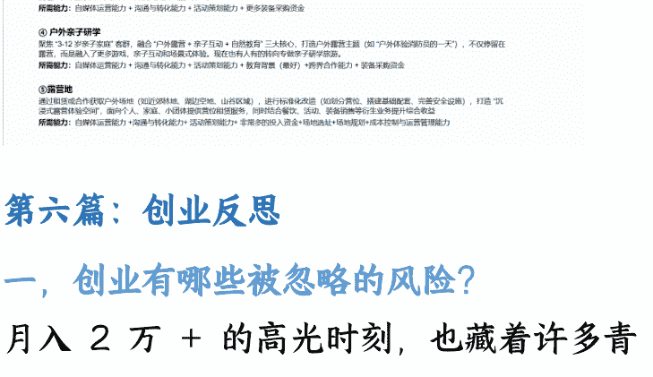

## 第六篇：创业反思

### 一、创业有哪些被忽略的风险？

月入 2 万 + 的高光时刻，也藏着许多青涩与落魄，回头看这一路，有 4 个被我们忽略的风险：

#### 1. 账算不清：盈利，只是一种模糊的感觉

我们从一开始就没建立起清晰的财务意识，手里刚有回款，第一反应不是留着备用或核算成本，而是想着“再添点新装备能接更多单”。

可旧装备用久了会磨损、出故障，比如帐篷布料老化、椅子坏了，买了装备没有人租，这些折损的成本我们从来没算过。没养成记账习惯，到最后连总共投了多少钱、真正到手的净利润有多少，说不出个准数。

后来稍微有了点财务意识，开始记账，2023 年才统计出月入 2 万 + 的高峰数据；而 2022 年其实收入更好，因为完全没记账，连具体赚了多少都没留下记录，现在想复盘都没数据可查。

仔细核算下来，这 2-3 万的收入还未扣除人力成本和物品损耗。虽然最终我们回本了，但平心而论，这份收入并非多么可观。然而，对那时的我们而言，迈出这一步本身的意义远大于收益——哪怕是赚到 1 块钱，都是一个好的开始。

#### 2. 私域流量沉睡：手里有资源，却没盘活

早期我们就只把客户拉到个人微信里，客户付完钱、用完装备，就没再跟人家互动过。本来露营租赁大多是一次性消费，我们既没建个社群跟客户保持联系，也没意识到可通过社群卖货。等后来明白私域运营有多重要时，露营行业的流量红利已经快没了，错失了将客户资源持续转化的最佳时机。

#### 3. 缺乏合同意识：合作全靠口头协议

在与他人合作的过程中，就只口头约定了分成比例和责任，没签任何书面合同。结果不仅没按说好的比例分钱，还总拖着不结算，而且意料之外的三轮车被交管拖走，车内装备也一并被扣，耗费了我们大量的时间、精力和沟通成本。

#### 4. 错把“风口”当“机会”

如何判断一个风口是否属于你？

总有人觉得“跟着风口走，肯定能赚钱”，但其实风口不是谁都能蹭的，机会也不是对所有人都敞开。关键得看这个风口跟你的能力、手里的资源搭不搭，还得能判断行业走到了哪个阶段，不然很容易陷进恶性竞争里。

##### 4-1 优势匹配，才叫机会

比如露营火起来的时候，好多人一看“租装备门槛低”，就扎堆进来做，结果很快就开始打价格战，大家都没赚头。真正能长久的，其实是结合自己的优势找方向。

你有亲子社群经验，教育经验，可以做“亲子露营研学”的细分方向，把露营和教育结合起来。

你有企业客户资源，可以做“企业定制露营”的细分方向，提供一站式的企业团建解决方案。

哪怕一开始资源少，也能从自己擅长的事入手——比如，若你擅长内容与流量，可从输出“亲子露营”或“企业露营”主题内容入手，逐步构建影响力，以流量能力置换资源与合作，总比盲目跟风强。

##### 4-2 入场时机，决定盈利空间

露营风口演变非常典型：早期大家只是想“试试露营”，有装备就能拉到客户；后来行业饱和了，还只做标准化的装备租赁，利润只会越来越薄。要是能在行业还没那么卷的时候，做出跟别人不一样的服务，才能守住自己的市场。

### 二、什么能力和资源是可迁移的？

我一直认为，做事要有逻辑，创业更是如此。它就像一棵树的生长——先立主干，再长枝叶。只有建立起清晰的框架，面对纷繁复杂的信息与机会时，才不至于迷失方向。你清楚自己需要补足哪一片叶子，也懂得在什么阶段伸展哪一根树枝。

商业杂志上有一句话让我印象深刻：“创过业的人，更清楚自己的短板在哪里。”直到亲身经历，我才真正明白这句话的含义。

真正的短板，不是在舒适区里自我反思出的不足，而是在市场的实战检验中，被清晰照见的能力边界。

例如，当我们从露营装备租赁转向亲子活动方向时，原本隐形的短板瞬间显现：课程设计、活动执行、亲子沟通、自媒体引流……每一项都是新的挑战。这时候光自己学肯定来不及，更重要的是知道“找谁能帮我”，怎么跟有这些能力的人合作，补自己的短板。

#### （1）可迁移的软实力：走到哪都能用的“底层能力”

这些能力不依赖特定行业或岗位，是支撑你持续成长的“底层系统”：

##### 1-1 清楚自己“能做啥、不能做啥”

知道哪些事必须自己抓在手里（比如核心客户对接、财务把控），哪些事可以交给别人做（比如装备清洗、简单的搭建），不用什么都自己扛，这样才能高效协作。

##### 1-2 知道“先补哪个短板”

时间和精力都有限，别想着一下子把所有能力都补上，先抓最影响业务的核心短板——比如想做企业单，就先补“资质办理、开票流程”，别先去琢磨“怎么搞氛围布置”，分清优先级才不浪费资源。

##### 1-3 知道“怎么找到对的人合作”

学会借力，比如缺课程设计能力，就去对接做亲子教育的机构；缺活动执行，就找有团建经验的团队。学会借力，比一个人硬撑强太多。

#### （2）可迁移的资源：换赛道也能用上的资源

选创业方向的时候，别只看市场大不大，更要想想自己手里的资源能不能复用，不然换个赛道就等于从零开始：

##### 2-1 要是做“亲子露营研学”：

除了当下能赚钱，还能攒下课程设计、活动研发的能力，手里的母婴客户和运营的账号，以后哪怕不做露营，也能转做亲子短途游、亲子营地教育，甚至卖母婴用品，资源能一直用。

##### 2-2 要是做“装备租赁”

长期可能仅沉淀库存管理能力，行业红利消退后，转型空间将非常有限。

### 三、感触

回望2022年1月至2024年5月的露营创业，以及毕业后两年的职场历练，我逐渐认识到，创业之路大致可分为两种形态：

一种是在未看清全局时，凭一腔热血入场，边做边学、跌撞成长；另一种，则是在真实商战中摸爬滚打之后，逐渐沉淀出可迁移的能力、拓宽认知边界，真正明白自己为何而战、如何再战。

或许未来某天，我还会再度走上创业之路。但到那时，驱动我的将不再是年轻时的冲动与盲目，而是清醒的认知、系统的准备，以及对“创造真实价值”的深度理解。

这里也想特别谢谢行业里的那些前辈。虽然我们在一个赛道里，难免有竞争，但他们从来没藏着掖着，有好的经验会跟我们分享，遇到问题也会给我们指点。这种格局和胸襟，不仅让我在创业路上觉得温暖，也让我看到了更远的可能性。

## 为什么加入「生财有术」？

之前从事知识付费时，就常听到不少人讨论和咨询这个社群，让我产生了强烈的好奇。初步了解后，印象中它是一个专注于“赚钱”的社区，打破信息差，这个定位让我觉得非常新颖，也默默记在了心里。

今年，我终于成为「生财有术」的一员。真正走进来之后，最打动我的是这里浓郁的分享氛围：大家毫不保留地交流自己的创业经历、成败思考，那种真诚与开放，令我深受触动。我也萌生了分享自己这段经历的念头。

回头看，虽然有些具体玩法放在今天可能已经不再适用，但当时在资源整合、赛道选择中踩过的坑、总结的方法，或许仍具有一定的参考价值。我也非常期待能够借助这个平台，与更多同行、创业者一起交流，彼此启发。也感谢内容运营团队的认真审稿，打磨框架。

最后，安利小懒的付费群：

## 懒人专属群（介绍）


📚 懒人专属群持续更新中，已持续运营 6 年，整理超 3000 份各类精选付费文章 & 年费社群干货，全部开放下载。

本资料为付费群内部分享，仅供真实有需要的朋友查阅 🙇

## 懒人专属群更新记录：

```
https://lazy2025.top/blog/record2
```

## 懒人专属群更新记录（需梯子，备用）：

```
https://lazybook.fun/blog/record2
```