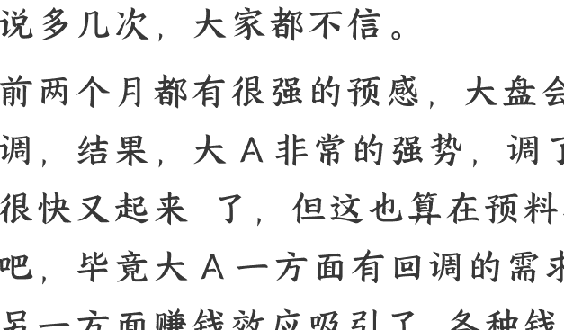

# 11 月必看：风格切换了
## 251103 局外人的视界
整理：公众号懒人搜索，懒人专属群独享
懒人微信：lazyhelper


## 前言
千呼万唤的 11 月付费它来了... 狼来了。说多几次，大家都不信。

前两个月都有很强的预感，大盘会回调，结果，大 A 非常的强势，调了，很快又起来了，但这也算在预料之中吧，毕竟大 A 一方面有回调的需求，另一方面赚钱效应吸引了各种钱源源不断的流入到股市里，多少有点砸不动。

复盘一下这一轮牛市跟过去几轮有何不同？有没有发现，前几轮牛市里，楼市是跟股市一起火起来的，2015 年杠杆牛熄火之后，马上就是一轮轰轰烈烈的房地产大牛市。

是的，从股市里出来的钱，从前可以去楼市，那么你现在告诉我，这一波如果钱再从股市出来，还能去哪里？

再往大了说吧，以前资金从东大出来，还能润到海外去，特别是 2015 年那一次，刚好赶上汇改，现在呢？

美联储不管愿意不愿意，接下来只有一条路，继续降息，然后找个理由公开放水，否则羸弱的美国金融体系搞不好就要崩掉。

我在前几天的文章提到过现在美国金融两个指标已经跌出了危险信号，一个是隔夜逆回购，这是机构存在美联储的活钱，从最高 2.5 万亿美元跌到了不足 35 亿美元，另一个是联邦银行储备金余额，跌到了 2.8 万亿美元破了 3 万亿美元的警戒线，是的，现在美国金融机构都没钱了。

市场资金紧张，还得扛住螺旋飞升的美债流动性，呵呵，市场上要钱的可不止美债，MBS 也要钱，巴菲特疯狂卖卖卖，手上拿了超过 3800 亿美元的现金，咱们不能说巴菲特永远是对的，但以他的段位，能看到的真实市场信息肯定是比我们要多的。

巴菲特是老派人物，美联储传统做法应该是一怒之下烧账本，戳破 AI 泡沫，带着全世界一起死一次，顺便在中期选举之前把懂王给彻底阴死。

但现在，世界已经变了，懂王谈完之后，先美滋滋的喊了半天的 G2，结果没过多久就开始反悔了，表示美帝决不能当老二。

想想看，上一次次贷危机，美帝率先自爆，固然让金融资本占够了便宜，当年也彻底养肥了中国制造。

再往上翻，美帝刺破互联网泡沫，于是就不得不放中国进 WTO。

可以说，摧毁美帝制造业的祸源就是金融人的灵机一动，自以为玩潮汐收割了全世界，结果率先噶的是自己的制造业。

如果按照传统玩法，美帝再刺破 AI 泡沫来一波，那么美帝最后一点优势产业什么芯片、AI 都要彻底完犊子。

OPEN AI 成为美帝 AI 产业泡沫的动力源，哥们手上只有 30 亿美元的现金储备，跟各大科技企业欠了过万亿美元的订单，请问这靠谱吗？

从理论上讲，只要股市 AI 泡沫不破，这个玩法还能扛，但只要 AI 泡沫破裂，OpenAI 就会带着美国的硬件软件企业一起挂壁。

想想看，泡沫破裂英伟达 AMD 一定会丧失掉大部分订单，盈利变成亏损，也就没有足够的实力维持对 AI 硬件研发的投入，但你停顿了，东大却会不会受到影响，那最后科技大战里，还能有老美的影子吗？

所以你们也别喊美股 AI 泡沫要破，我承认它是泡沫，有泡沫，但现在美帝根本承受不了一场泡沫经济的打击，懂王哪怕是全球化缘，各种逼着小弟们上供，再把美联储最后一点信用榨干，都要维持住 AI 泡沫不破，这不是懂王一个人的战场，差不多也是美帝精英阶层的共识。

美联储能帮上忙的也就只有开动核动力印钞机了。

全球资本未必会都跟懂王一起赌美国国运，资金最爱做的还是两头下注，西方不亮东方亮呗，没有谁会傻乎乎的吊死在美元霸权上。

鲍威尔说的是从 12 月 1 日开始终止缩表，当然了，所以整个 11 月份就是个时间窗口了。这个时间里，美帝的 AI 歇歇火，股市调整一下也都很正常。

欧公子出来混的，差不多也到了买单的时候了，最近这几天美元指数大涨，割的就是欧公子的肉，再看我们对面的霓虹国，股市连创新高，日经指数冲破 5 万点大关，高市首相铁了心的要帮美帝扛住流动性。

流动性是可以外溢的，在大国竞争里已经占了上风的东大是不用担心流动性的。还是那个话，股市不是经济的晴雨表，但绝对是流动性的晴雨表。

无论是现状还是预期，市场流动性都没有问题，所以股市也不会有什么问题的，但现在已经快到了年底，鸡狗们抱团都赚够了，本身大票持仓差不多也打到了极限，那么接下来机构的钱是不太可能再进抱团大票里。

之前我们也分析过，管理层对这种抱团狂拉指数的疯狂行为是有意见的，要慢牛不要疯牛。

几样一综合，不难得出本月抱团科技大票要狠狠吃一波回调了。鸡狗们休息，但资金未必会休息，无非是换个方向呗。

有很多朋友手上拿了一把小票，概念股，前段时间大盘蹭蹭涨，小票跟跌不跟涨，4000 点的市值还不如 3500 点。

这很正常，资金又不傻，能舒舒服服地躺在大票里抱团，谁会去苦哈哈的干小票？但到了现在，大票上涨乏力，流动性又格外充裕，就可以搞搞小票了。

大家可以去看看北证 50 指数，这个指数代表了市场里投机性最强的资金的动向，九月份北证 50 是绿的，但十月份这个指数转红了，没错，炒小票，炒概念的那一批资金来了。

从 10 月底开始，市场的风向开始变了。以下是付费部分：

这个月是科技小票的天下，但各位要记住，做到月底，一定要记得从科技股里减仓位，不能恋战，否则就是个华丽的过山车。

上面这一句是这篇付费文里最核心的内容，一定要反复去看！

其实道理很简单，每年 12 月份大盘都不会好到哪里去，即便市场流动性再好，给你放了大杠杆，资金都会提前放假，等着找机会回头扎进来做春季行情。

有人问，既然 12 月份才会不好，为什么要在 11 月底先跑？

呵呵，大家都知道 12 月份会回调，肯定大部分人会提前抢跑，你不跑快一点，遇到狠人，早早就能送你上过山车，到时候回调多了，你的心态还能淡定吗？

当然了，个股还得具体分析，如果你的票一直强下去，你的运气够好，买上了跨年牛股，那当我啥都没说。但没那么好运气的话就要牢记跑路得快了。

科技依旧是 11 月的主线，大家可以去看看 10 月份公布的十五五规划纲要，我国未来经济发展的主要方向都写在里面了。

高质量发展，科技强国，都给我们指明方向了，想要拿到超平均的收益，你就得盯住大方向。

这里敲重点，资金量大的，可以分散风险，资金量没那么大的，就不需要学别人去开什么超市，一买一大堆，根本选不准主题。

十五五计划都是明牌了，明牌意味着什么，意味着市场已经形成了一致认知，资金都会朝着这个方向去布局，政策已经打了窝了，你不来这里钓鱼，非要跑到鱼少的地方去蹲守，这不是跟钱过不去吗？

科技小票我竞选了四个方向：

### 1、AI 应用、国产软件
这个是重点中的重点。

之前炒 AI 都围绕着芯片、光模块这些 AI 硬件基建方向走，这些大票都是鸡狗们跑团在做的，说白了，我 A 这也是跟着美帝的方向去走的。

美国 AI 故事里吹得最多的就是英伟达，当然了，我也不否认英伟达的确是吃到了 AI 红利，但 AI 整个行业要发展起来，并不是大家抱成团互相交叉投资吹出来的，最终是要落实到客户买 AI 应用的单。

现在老美那边科技企业都疯狂的烧硬件，各种怼大模型，但最后有谁能在市场上赚到钱？OpenAI 也就沾了没上市的光。

所以 AI 之争到底争的是什么？难道只是争谁的算力芯片更多吗？堆算力最终目的还是让 AI 创造实实在在的经济效益。

争谁做出最好，最全面的人工智能大模型毫无意义，东大这边政策面是直接知道 AI 直接应用到各行各业，整体提高社会生产效率，没必要在美帝划定的赛道里瞎 PK，各打各的。

前段时间里，资金一直都在集中做 AI 硬件，应用根本没有人碰，基本都处在低位。大家可以在软件 AI 应用方向里找找低位的票，刚好三季度报告出了，大家可以尽可能的去找一下业绩走好，股东数量变少，股价还处在低位的票，这种还是不错的。

有人问大票小票怎么选？呵呵，要么龙头，要么小票，中间地带的不要看。

### 2、航空航天
之前有两波炒过这个板块，一波是低空经济，一波是俄乌冲突后启动的军工板块。航空航天我一直在逐步加仓，这次十五五规划纲要里也提到了这个方向。

个人看好航空航天还有个缘故，10 月份开始就一直有声音在喊收岛，我们计划 2035 年要开通到小岛的高铁，不管怎么看，回归之路是越来越近了，航空航天跟军工是互动的，一有风吹草动，这个板块必动。

### 3、通讯板块
通讯小票现在可以干，别问，问就是 6G 概念，你就主打一个炒吧。

大家可以去看看通讯板块的小票，很多都跌破了 3200 点的位置，这时候拉拉，算是补涨了，选它只凭它远远跑输大盘。

选票的时候一定要选盘子小的，龙头被人炒过，业绩也要过得去的，业绩太差的，就别看了。

### 4、AI 制药
今年 AI 制药的炒作从港股开始，倒不是真的有什么了不得的突破，真正到了大规模吹利好的时候，差不多炒到头了。

AI 制药炒起来的根本原因是 HK 那边的资金抓住了一个漏洞，生物制药企业没有盈利也可以在港股上市，并且这类企业往往流通盘比较小，主力资金可以用很少钱就能把市值给拉起来，一旦市值超过 70 亿，就能纳入到指数里，基金就必须被动配置。

靠着这个漏洞，投机资金抱团炒 AI 制药瞄准了两条，一个是 AI 概念，一个是 CRO 概念，反正就是瞎炒呗。

为什么这时候提起它，很简单，硬件炒完了，还要炒 AI，那就要回头来炒熟悉的板块，年底炒炒医药也是惯例，再加上前期套里面的资金不少，这板块在散户里的认可度也比较高，所以本月更容易吸引到资金抱团来炒作。

## ***** 又到了可以炒游戏和文化传媒的时候了
差不多这个时候游戏又可以了，选游戏是因为本身游戏板块都处在低位，每次 AI 炒到应用基本都会拉一下游戏，至于 AI 应用跟游戏有什么关系并不重要，市场有惯性在这里，顺势而为就行了。

顺带说一下，喜欢做文化传媒的，从 11 月开始，这个版块会走的不错，如果运气好，还能衔接一波跨年的票房行情，不过今年春节档不太可能会有像《哪吒 2》那样的黑马吧。

不管怎么说，每年 11 月份游戏跟文化传媒都走的不错，喜欢这两个方向的，可以做做。

## 老赛道新能源可以做
我已经连续几个月推这个板块了，为什么现在还说它呢？因为新能源整体还在坑里趴着呢，并没有像 AI 硬件那样，被炒得丧失了理智。

上个月建议大家方向上重点做做能源金属。

个人认为能源金属这个板块依旧还是在相对低位，不过板块波动较大，但这也是短线选手的福音，在大跌的时候买入，大涨的时候卖出，赚就完了。

固态电池概念已经涨了很久，这是个长线标的，是新能源产业未来发展的方向，如果手上有持仓的话，可以继续拿，没有仓位的话，现在进短线未必有很大的机会，除非遇到大跌，做做超短线，想做中长线的，可能要等到春季行情挖大坑的时候再找机会。

## 通胀预期还是可以做做的
当大家一致认为美帝未来必须放水，那么现在大宗商品的价格就没办法被压住，这是一个长周期的行情。

这波中美暂时休战，看到有做航运的说已经开始往国内运美国的大豆了，这就不存在所谓大豆便宜全球大甩卖了，又差不多到年底了，猪肉应该有点小行情。

有色跟能源金属可以做。有色里特别是铜，被 AI 卷疯了，东大这边再提新基建，对铜的需求目前还没有什么有效替代，继续看好铜价上涨，能源金属前面说过。

煤炭居然没有跟石油走，走了自己的节奏，十月份看走眼了，后来我复盘了一下，煤炭能走好一方面是季节性因素，今年冬季提前了，另一方面板块有补涨的需要，十一月大概率还能再延续一下，只能说感谢冷空气。

## 千万不要碰白酒
五粮液业绩崩盘了，整个白酒板块都不行了，有很多人因为在 2020 年那一波里赚到了，所以有滤镜。

2020 年地产还好着呢，你现在还想炒房吗？

白酒跟旧经济挂钩，大家可以自行理解，现在喊的是新质生产力，所以不管白酒怎么走，别理就行了，大把好票好机会，何必非要吊死在这个歪脖树上？

## 继续不玩金融
券商在这个位置不会发力，银行、保险走得不会比科技小票好，论潜力不如军工。何必浪费资源呢？

当然了，有人喜欢做金融，非要做金融，那你就做保险吧。

## 划重点！千万远离前期的科技抱团股
别的属于实在要做也能做，但这个真的不能碰。

当然了，因为这个方向上资金密集，有些个股可能弹性很好，技术好的做一下超短能薅到羊毛，但问题是涨跌同源，前面持续涨，现在就有可能持续跌，非技术派高手大概率就会抄底抄到半山腰。

这就不像能源金属，整体趋势是向上的，无论如何都能盈利出走，无非就是赚多赚少了，这里一个不小心就要被套麻袋了。

## 其他板块展望
中特估，继续展望长线，手上有的，可以继续拿着，手上没有的，现在并不是介入的好时候，我超长线标的一直在手并没有怎么动，也就是偶尔做做 T，降低下成本。

军工，不需要多说了吧，这个是长线逻辑彻底变了，看好未来中国军工崛起之路，我在前面有提到过航空航天这个方向，当然了，军工可以选的还不少，现在美国一年对外军售几千亿美元，我们才多少？

十一月份如果论指数的话大概率科创 50 会走得最难看，北证 50 会走得比较好看。喜欢买指数 ETF 的，可以优选北证 50，还是那话，记得及时撤。

继续看好 HK 上市的科技票，咱得找那种真硬核科技的，港股玩得太花了，坑多。

毕竟连霓虹沾点 AI 边的科技股都被外资抱团炒翻天了，怎么真正有科技含量的 HK 科技票就不值得买了？

外资来中国优选一定是港股，今年管理层一直在鼓励科技企业搞 A+H，目的很明确，就是让中国科技企业去抢国际资金。

摆明了现在东西大博弈，东大胜率更高，美帝要维持住自己 AI 泡沫不破，那就必须给我们这边的科技企业加估值，否则你能说得通吗？

别让我所有的行业板块都说一遍，没意义，专注才能赚到大钱，啥都买只会害了你。祝大家本月有个好的收益！

## 懒人专属群（介绍）


微信:lazyhelper
📖懒人专属群持续更新中，已持续运营 6 年，整理超 3000 份各类精选付费文章&年费社群干货，全部开放下载。

本资料为付费群内部分享，仅供真实有需要的朋友查阅🤫

## 懒人专属群更新记录：
```
https://lazy2025.top/blog/record2
```

## 懒人专属群更新记录（需梯子，备用）：
```
https://lazybook.fun/blog/record2
```