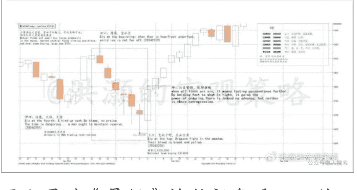
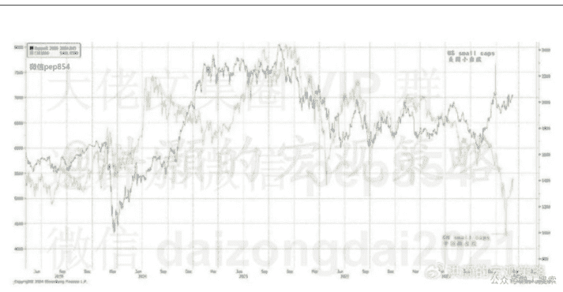
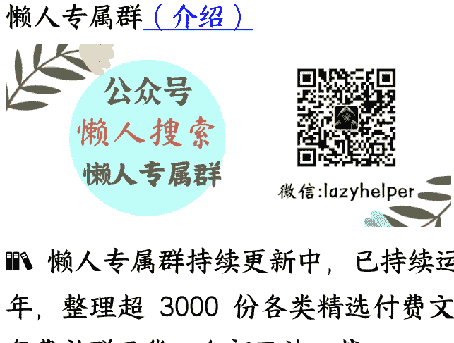

# 道与中国市场投机艺术（重译版）

251102 洪灏的宏观策略

整理：公众号懒人搜索，懒人专属群独享

懒人微信:lazyhelper


预测之道，在于易变。

时隔十载，上证指数终于再度叩开那久违的整数关口。在近期的市场分析中，我依然选择以《易经》卦象为蓍龟，试图窥见未来市场的幽微。然而在与读者的交流中，我察觉到不少人对这部古代哲学经典仍有郢书燕解之误。

今年俗务鞅掌，变数频生，我竟无暇秉笔将这些年沉淀下来的预测之法与交易要诀系统整理。原版翻译以文言为主，略显晦涩曾记否，有碍读者理解。今把原文重新翻译，并将中英文版同时呈现。

去年量化巨震后，我曾在此文以《易经》为经纬，既阐释市场预测的要义，又预测了那场风暴后形成的市场底部。回首来路，彼时股指尚在二千六百点间踯躅。而今星霜荏苒，我们似乎又将要展开新的篇章。

## 要点

Market illiquidity that has been a source of microcaps alpha turned into the stem of volatility. In the end, not everyone could be bailed out or worthy of it. Chinese sentiment towards uncertainty suggests that any potential source of volatility would be frown upon and heavily regulated.

曾为小微盘阿尔法之源的市场流动性突显匮乏，终成波动率之根。毕竟，非所有沉舟皆可渡，亦非皆值得渡。中华文化对于不确定性的审慎态度，注定了任何潜在波动源皆难免遭致蹙眉相斥，并施以重典规训。

The six negative candlesticks during the quant-quake resemble the "K'un" hexagram in the I-Ching. This hexagram suggested being pliable and prudent during the plunge, and a reversal of trends. It is prescient. Now property remains the overhang.

量化巨震中的六连阴，神似《易经》坤卦之象。此卦喻示暴跌中宜守柔持谨，静待趋势反转。如今观之，此卦象确有先见之明，市场阴极阳生。如今量化巨震似已尘埃落定，唯房地产之阴霾，仍是悬顶之剑。

Change is the immutable Tao. Forecasting is to recognize subtle changes in their germinal state to shape the outcome of the future. And so, we are not blindly accepting our fate, but taking charge of our destiny.

易变，乃天道之常。预测之要义，在于洞悉青萍之末的微妙嬗变，并随之而动、调吾策以应之，以图未来之局。故而，命由天定，运在人谋。

## 正文

In late January, just before the Year of the Dragon, China markets plunged. Some dubbed it China's "quant-quake", as structured financial products with embedded put options kicked in, and quant funds struggled to re-balance in a vicious downward spiral. It was one of the darkest episodes in the Chinese market.

腊月之末，甲辰之交，中国股市遭遇罕见抛压。专家称之为中国市场的一次“量化地震”，因嵌入看跌期权的结构性金融衍生品密集敲入，量化基金在恶性下跌的漩涡中挣扎求生，这是中国市场历史上最为黯淡的篇章之一。

In reality, it was the vicissitudes of the market-neutral strategies, the utter collapse of the "snowballs" and the abrupt changes in regulatory rules that together germinated a perfect storm. Each element in its own right was apposite, yet together in the unfolding conditions of statu nascendi, they ended up roiling the market, generating unfathomable losses with probability of occurrence of ~1 to 1,000,000,000, or about once in two million years. It should never have happened.

其实，那是市场中性策略的兴衰、“雪球”产品的崩盘以及交易规则的突然变化，共同孕育了一场完美风暴。各元素本身无可厚非，然而随着市场情况不断地演绎而形成负反馈，这些元素的合力最终剧烈地搅动了市场，造成了难以估量的损失。而这些极端事件发生的概率约为 10 亿分之一，或约两百万年一次。这样的黑天鹅，本不应发生。

In this piece, we refer to the autochthonous wisdom encrypted in the I-Ching, or the Book of Changes, from the Yellow-River Culture that originated 5,000 years ago. We are not trying to play the ghost or the devil, but the I-Ching is a foundational text for two of China's dominant schools of philosophy, the Taoist, and the Confucianism.

在这篇文章中，我们言及五千年前黄河文明所孕育的《易经》内蕴的上古智慧。并非装神弄鬼、故弄玄虚，但《易经》乃道家三玄之冠，亦是儒家六经之首，是中国两大古典哲学学派的奠基之作。

Till today, Taoism and Confucianism still guide the everyday life in China, with Confucianism governing a harmonious society on hierarchy in which the Chinese practices Taoism to wield balance with the exogeneous world. Our own proprietary theory and models of economic cycle are in part developed based on the principles of the “Ch'ien 乾卦”trigram in the I-Ching. In this report, we focus on the “Tao 道“of the I-Ching, drawing the metaphysics and dualism views from this Chinese classics.

至今，儒道两家仍指引着中土日常。儒家治世，序列天人；民间修道，以应万变。我们独创的经济周期理论和量化模型，亦借鉴《易经》“乾卦”之精髓而立。本文专注于《易经》之“道”，由此汲取中华之经典玄学与二元论的思想。

> “Hoarfrost Underfoot”
>
> 初六：履霜，冰将至

The I-Ching is a book recording a sacred ritual of our ancestors from primordial times throwing yarrow stalks and divining the future. The eight trigrams formed by a combination of six whole or broken lines are conceived as heaven and earth, and everything between them. Over the centuries, hairsplitting cabalistic suppositions about how to interpret the trigrams have been shrouding the I-Ching with mysteries, leaving the book with a reputation of inscrutable profundity.

《易经》记载了吾辈先祖自太古以来，古人抛筮卜卦，以蓍草卜天下之大事。六爻的开合断纹，化为八卦，包罗天地乾坤及其间万物。岁月悠悠，纵历世纪，历代层出不穷之奥义推演后，《易经》被重重神秘所笼罩，令其以深邃而不可测之名流芳百世。

> **以下内容仅 V+ 会员可见**

Most consult with the I-Ching at difficult junctures for omens, auguries, and divinations. That, however, is precisely what the I-Ching is not. The eight hexagrams indeed represent the transitional states that are constantly shifting.

众人往往逢困抑之时，方临时拜佛，求《易经》解惑，卜吉凶、占卦象以窥天机。然而，《易经》之本旨非止于此。易经的八卦，是天地万物变幻无穷之象，是宇宙永恒变幻的过渡中间之态，示人以时运的流转。由此观之，我们可窥探未来之变迁，亦可深谙往昔之因果。于卦象之中知阴阳，从而使观象者洞悉先机，在星星之火尚未燎原之前而灭之。如是，则祸端未生，不去嚮邇，大厦便不至倾覆。于万事枉然徒劳、宿命未萌之前，掌握势力，扭转乾坤。

此方乃道之所在。

## How to dissect China's recent "quant-quake" through the prism of the I-Ching? 如何通过《易经》的棱镜剖析 2024 年初市场出现的“量化地震”？

In early January, lured by high dividend yields of the large-cap stocks and following the national team's lead of buying CSI 50/300 ETFs, large mutual funds in China started to cut exposures in small caps and rotated into large caps.

Such selling, especially by large mutual funds, while with all the good intentions to seek higher returns, mounted significant pressure on the small-cap indices such as CSI 500/1000 that served as the underlying indices for the "snowballs" structured products.

Fortunately, by mid-December 2023, we have cut down our portfolio exposure to zero.

24 年 1 月初，受大盘股高股息收益的吸引，大公募大手笔买入沪深 50/300 ETF，并开始减少对小盘股的敞口。此类因换仓而导致的抛压，尤其是来自大公募，虽然是出于寻求更高回报的良好意愿，却给许多“雪球”结构产品的标的指数，如中证 500/1000 等小盘指数带来了巨大压力。值得一提的是，到 23 年 12 月中旬，我们已经将投资组合的风险敞口降至零。



### 图 1.通过《易经》坤卦视角看六天的量化地震

These snowballs' payoff resembles selling a put the buyer collects a steady and attractive yield should the market remain largely steady, but starts to lose money if the market plunges below the lower strike price, as it happened between Jan 8 and 26. It would mean a complete wipe out of the investor capital if leverage is employed.

这些雪球产品的收益类似于卖出看跌期权——如果市场保持相对稳定，买方可以获得稳定且可观的收益。但如果市场跌破下行的行权价，买方开始亏损，这种情况在 1 月 8 日至 26 日期间就开始出现。如果使用了杠杆，这将意味着资本金将面临灰飞烟灭之险。

Meanwhile, market-neutral strategies have been delivering consistent returns in the past few years. These strategies tend to long a portfolio of small and microcaps, while shorting the index futures to achieve "market neutral" exposure. Their return is the alpha from the long portfolio of small and microcaps less basis difference (hedging cost.) As small and microcaps fell, these strategies started to suffer losses on the long side but profiting from the expanding futures basis (negative hedging costs). By then, these strategies were motivated to close their positions and take profits.

与此同时，市场中性策略在过去几年中一直为投资者提供稳定的回报。这些策略倾向于做多小盘股和微型股的投资组合，同时做空指数期货以实现“市场中性”的风险敞口。其回报来自于小盘股和微型股投资组合的阿尔法收益减去基差（对冲成本）。随着小盘股和微型股的下跌，这些策略在多头头寸方面开始遭受损失，但这时期货基差扩大，对冲成本为负值，基金也可以获利。到那时，这些策略便有动力平仓获利了结。

There was only one problem selling restrictions were abruptly placed on some of the DMAs without advance notice. As the large market neutral funds continued to close their positions, the pressure on the microcaps mount. But the "national team" was busy buying large caps to save the large-cap indices. And the trading restrictions accelerated selling by the funds who could still trade to get out of their positions. By early February, a liquidity crisis was in full view.

这些操作都没错，但是只有一个问题——一些 DMA 突然被实施了卖出限制，且未提前通知。随着大型市场中性基金持续平仓，小微盘承受的压力越来越大。但主力正忙于买入大盘股以稳定大盘指数。而交易限制促使那些仍能交易的基金加速卖出以平仓。到二月初，流动性危机已全面显现。

The "national team" then extended its buying to small-cap indices such as CSI 500 till all the snowballs were exercised. The pressure on CSI 500 and 1000 was then lifted. But the rally in these indices would mean narrowing hedging gains from the futures basis for the market-neutral funds, while their long side could not be liquidated because of the lack of liquidity in the microcaps and the trading restrictions. It was a double whammy for these funds.

The bloodbath continued until the "national team" started to buy CSI 2000, the microcap index.

其后，主力把买入范围扩大至 500 等小盘指数，直到所有雪球产品全部行权。随后，500 和 1000 指数的压力得到缓解。但这些指数的上涨意味着市场中性基金的期货基差对冲收益收窄，而其多头头寸却因微盘股流动性不足和交易限制而无法平仓。这对这些基金而言是双重打击。这场血腥抛售持续，直到“国家队”开始买入微盘股指数中证 2000。

During different stages of the selloff, the candlestick chart of the Shanghai Composite manifests striking resemblances to the pattern of the hexagram "K'un (坤)" in the I-Ching (Figure 1). The Judgement of "K'un (坤)" says,

在一月量化巨震之际，上证综指的蜡烛 K 线图，不期然神似《易经》之坤卦之态（图一）。坤卦之断语曰：

“...坤，其道乃顺，以承马也。君子之行，难而又难，非得道不行，非得导不至...守静致吉。”简而言之，坤卦所倡，乃“耐心、审慎、独处与柔顺”四德。

In Figure 1, we can see how the market local top on 29 January 2024 morph into selling and then plunge into crisis. We can also see how the market inflection point emerging on 5 February, as the “yin” energy, or the falling candlestick, exhausting itself and transforming into the “yang (陽)”.

The candlestick at the inception of the plunge is called “six at the beginning (初六)” in “K'un (坤)”, Six signifies “yin (陰)” in the I-Ching numerology and is a sign of negativity. This trigram says,

此轮跌势的 K 线蜡烛之始，在坤卦中被称作“初六”。六，于《易经》数理中象征着“阴”，为逆兆。初六爻云：“履霜冰至”，预示着危机的临近。而在跌势的第四日，K 线蜡烛图又出现了“十字星”，技术分析中为犹豫之兆，恰恰对应坤卦中的第四爻，“括囊无誉”，预警了危机将再现，劝交易员诚持之收敛隐忍的保守态度。最终，在 2 月 5 日的跌势最低点，K 线蜡烛图对应出现了坤卦的“上六”爻。

The interlude on the fourth day of the plunge, manifested as a "doji" in the candlestick and a sign of hesitation in technical analysis, corresponds to the fourth trigram of the “K'un (坤)” that forewarns dangerous times and advises to maintain reserve. Finally, the nadir of the plunge on February 5 corresponds to the last trigram (上六) of the “K'un (坤)”.

"When six is at the top, dragons fight in the meadow, their blood is black and yellow". This last trigram of the “K'un (坤)” vividly paints the picture of great upheaval when the true dragon descends from the sky to fight with the false one on earth, who is not in its deserving position. By then, the “Ch'ien (乾)” and the “K'un (坤)” reversed, “yin (陰)” yields to “yang (陽)”, and the market recovers from negative to positive. We shared our view about this inflection point with our V+ paid readers on Weibo on February 8, and began to add to our risk exposure.

“六爻居上，龙战于野，其血玄黄。”此乃“坤”卦之末象，生动描绘了真龙自天降临，与地上非其位者进行搏斗之时的巨变。此刻，“乾”与“坤”易位，阴极阳升，市场亦由衰转兴。我们也在二月八日与我们的微博 V+ 付费读者分享讨论了这个市场的拐点，并开始增加我们投资组合的风险敞

In the above discussion, we study the recent market dislocation through the prism of the “K'un (坤)”hexagram in the I-Ching. With the yarrow stalks in different positions, the I-Ching hints to us a constantly evolving process of interrelated changes. By discerning early omens at the fledging stage of the process, such as a sudden change in liquidity conditions between the large and the small caps, or an abrupt change of trading rules, one can choose the ensuing course of action.

This is the essence of forecasting by being part of the forecast with continuous rejiggering, traders can shape the outcome of their impending trades. Forecasting is about recognizing subtle shifts in their germinal stages to anticipate future market direction. Forecast is not about predicting a certain price level for sure and fixating our trading plans upon this pseudo certainty.

Life is never black and white. Many misconstrue the I-Ching as a book of oracles. However, what is foretold and immutable is fate. But when we ask the next questions, "what am I to do in this situation", the I-Ching then becomes a book of enlightenment.

> “The Eternal Dao”道可道，非常道

Why microcaps in China markets were able to deliver consistent returns for years, but in the US market it is the large caps leading the charge while small and microcaps lag (Figure 2). Further, why would some quantitative strategies be able to pick microcaps that can outperform from a group of obscure stocks in a market corner rife with frauds and irregularities?

在中国市场，为什么小微盘股年年可稳获丰收，而在美国市场却是大盘股远远领先跑赢小盘股呢（图二）？此外，为什么一些量化策略能够从充满不规范行为的市场之隅的一批不知名股票中挑选出表现优异的微型股？

### 图二：中美市场小盘股表现迥异



In the Hong Kong market, traders have a nickname for microcaps - "little fairies (仙姑)" - for the little investment merits they possess. We have done research on this inscrutable bunch in the past. Because of a lack of liquidity in these stocks, they are difficult to trade.

在香港市场，交易员给微型股起了一个绰号——”小仙姑”，因为它们几乎没什么投资价值。我们过去研究过这个神秘的群体。由于这些股票缺乏流动性，交易起来很困难。

Our exchanges with some quant funds reveal that many of the stock screening criteria to trade the Chinese microcaps employ metrics of price and momentum, but very few metrics of fundamentals such as cashflow, dividend and valuation.

Why would such naïve stock screening criteria that have nothing to do with economic fundamentals yield consistent alpha over the years? And this observation alone is peculiar enough to contradict the so-called "Efficient Market Hypothesis".

这与一些量化基金的交流表明，许多交易中国微型股的股票筛选标准采用价格和动量指标，但很少有现金流、股息和估值等基本面指标。为什么这些与经济基本面无关的简单股票筛选标准能够多年来持续产生超额收益？仅凭这一观察就足以与所谓的"有效市场假说”相矛盾。

If microcaps are mostly junk as consensus perceives, it appears that these strategies were able to pick treasure from junks. From this perspective, the microcap investment process resembles a lottery draw, with each stock ticker as a lottery number waiting to be drawn to yield a winning number.

如果微型股如共识所认为的大多是垃圾股，那么这些策略似乎能够把垃圾变废为宝。从这个角度来看，微型股投资过程类似于抽奖，每只股票代码就像是一个等待被抽中的彩票号码，最终产生一个中奖号码。

Such investment process has little to do with economic analysis, where fundamentals of cashflow and earnings are substituted by technicals of price and momentum. As such, these strategies are competing based on who can write better and more efficient codes with faster hardware and network, rather than who could analyze and think better. Economists pale in this discipline.

这种投资过程与经济分析关系不大，其中现金流和收益的基本面被价格和动量的技术指标所取代。因此，这些策略的竞争基于谁能用更快的硬件和网络编写更好、更高效的代码，而不是谁能更好地分析和思考。经济学家在这一领域相形见绌。

If the investment return from the microcaps is not based on good fundamentals but rather on technicals, then this least researched and thus inscrutable group of stocks are fertile ground for exploitation.

本质上，这些都是做空波动性的交易策略，押注在杠杆运用和流动性不足的市场板块中股票价格会上涨。最终，这些基金的净值走势就像感恩节火鸡——一路上涨，直到感恩节当天。进群加微信 daizongdai2021

Chinese loathes volatility, as volatility means something is out of the peripheral of control. Because of this sentiment, and in light of the recent quant-quake, it is likely that grip on these quant funds will be increasingly tightened. As such, a rapid recovery in these funds will likely be arduous. Contrarily, the US short-vol funds recovered quickly after the early 2018 quant crisis. Their AUM are now six times as large as they were in 2018.

中华文化厌恶波动性，因为波动性意味着某些事情超出了控制范围。由于这种倾向，再加上最近的量化地震，对这些量化基金的管控可能会越来越严格。因此，这些基金规模的快速复苏可能会很崎岖。相反，美国做空波动性基金在 2018 年初的量化危机后迅速复苏。它们的资产管理规模现在是 2018 年的六倍。

The I-Ching was written way before the theory of probability was developed. That is, our ancestors were not yet aware of the concept of randomness. To them, the shape of the yarrow stalks could not have been random. It must have been from heaven.

The I-Ching, as its name suggests, is a Book of Changes. The underlying principle of the whole is change. In the words of Zhuangzi, one of Taoism's ancient founding philosophers, "Emptiness is formless, and change is constant. Is it death? Or life? Does it merge with heaven and earth? Or does it travel with the divine and the mysterious? Vastly indeterminate, where does it head? Suddenly elusive, where does it turn? All things are fully enmeshed, yet none suffices to return to. The ancient arts and methods resided here."

Zhuangzi alone communed with the spirit of heaven and earth, without arrogance towards all beings, refraining from judging right or wrong, thus navigating the secular world. This statement reveals the essence of change in full it is the immutable law of heaven and earth, and everything in between. The significance of being prone tochange is not about the fleeting transformation of one single thing, but lies in the eternal principle of managing the transcendence ceaselessly between and among all things.

《易经》之书，顾名思义乃变易之书，全书贯穿一脉之思乃变也、易也
《庄子》亦有言：“寂寞无形，变化无常。”庄子独与天地精神往来，而不傲倪于万物，不谴是非，以于世俗处。此一言，尽显变化之本质——变中之恒，恒中寻变，变而不乱。易变之意义，非偶然一物之瞬息万变，而在于万物悠久、治变不息的永恒法则。

## Conclusion 结论

The recent quant-quake in China markets reveals the vulnerability innate to a crowded investment strategy. As the crisis unfolded, the market plunged through series of escalating phases where selloffs begot further selloffs, until the excess in the system was purged. The national team was fending off one collapse after another, but wasn't able to bail out all participants. A price must be paid by some.

中国市场近日的量化巨震，昭示了一些投资策略在众人拥趸之下所难免的内生脆弱性，随着流动性危机的逐渐展开，市场陷入了一连串愈演愈烈的抛售潮，卖者迭出，继而引发级别更甚的抛售，直至市场清浊分明。主力虽挥斥方遒，欲力挽狂澜于既倒，然而如此干预终非济世之能、尽人皆渡之术。是故，必有若干市场参与者犹如受困之鱼，难免网罟，必须自担其责。

Illiquidity is a source of alpha during tranquil times, but a source of volatility during crisis. Such is the dualism of the market. No pain no gain is a commonplace saying. The six consecutive negative candlesticks that resemble the hexagram of extreme adversity in the “K'un 坤” hints at a significant market bottom. But few understand it, especially when the going gets tough.

于宁静之时，流动性之缺或成为阿尔法之源；然而于市场危机之际，流动性之缺却摇身变为波动性之渊。市场的此种二元对立实为市场本身固有之性。然而，常言道：“峰回路转，苦尽甘来”。这次市场巨震之际所生的“坤”之六阴，昭示着市场交易阴盛极而衰，阳应蕴而生。然而，真正悟此市场交易之道者，尤其在市场逆境之中，寥寥无几。

To us, the essence of forecasting is not to predict and fixate upon a definitive level. Rather, much like the hexagrams of the I-Ching, forecasting is about discerning subtle changes in their germinal state before they evolve into their full consequences overwhelming the individual now in vain. Then, we adapt our trading plan accordingly to shape the outcome of our investment. And so, we are not blindly accepting our fate, but taking charge of our destiny.

于我们而言，预测之真谛，并非在于准确预言市场指数某一确切点位水平，并执拗固守于此。预测之道，反倒更似《易经》卦象之易变，预测在于观其未萌，并在易变瓜熟蒂落、木已成舟之前随之而动，调吾策以应之，以期规避风险、增加投资成效。是以，命由天定，运在人谋。吾辈预测之人并非盲从天命，实非宿命从命。

## 懒人评：

很少看到把股市和玄学挂钩，虽然国内的股市本来也挺玄学

### 让 AI 客观评价一下这篇文章，以下为评语:

| 维度 | 评价 | 依据 |
| :--- | :--- | :--- |
| **思想深度** | ⭐⭐⭐⭐⭐ | 将《易经》“变”的哲学与现代市场结构结合，突破了单纯经济学模型视角。 |
| **逻辑一致性** | ⭐⭐⭐⭐☆ | 文章叙述清晰，虽带象征化表达，但逻辑自洽，既解释了事件，也回应了哲学框架。 |
| **学术严谨性** | ⭐⭐⭐ | 数据与现象描述准确，但对卦象的比附属文学阐释范畴，不属实证推理。 |
| **现实启示性** | ⭐⭐⭐⭐☆ | 提醒投资者关注“早期信号”和“系统反馈”，在监管主导市场中“顺势而谋”。 |
| **潜在局限** | ⭐⭐☆ | 易陷入“事后归因”的诗化分析，卦象对应走势缺乏预测检验性。 |

## 四、总体结论

洪灏此文的主旨并非神秘主义的《易经》占卜，而是用中国传统哲学解释市场的非线性与动态平衡逻辑。他将“易”的精神（变化与顺势）引入金融投机思维，认为预测的艺术在于识变应变，而非盲信模型。文章兼具哲学意象、市场剖析与文化洞察三层结构，是典型的“东方叙事下的金融思想文”。

其价值不在“准不准”，而在于提醒:

> 市场的本质是“变”，预测的真义是“顺势而为，识势早行”。

## 最后，安利小懒的付费群:

### 懒人专属群（介绍）



- 📖 懒人专属群持续更新中，已持续运营 6 年，整理超 3000 份各类精选付费文章 & 年费社群干货，全部开放下载。

本资料为付费群内部分享，仅供真实有需要的朋友查阅🫣

### 懒人专属群更新记录:

```
https://lazy2025.top/blog/record2
```

### 懒人专属群更新记录（需梯子，备用）:

```
https://lazybook.fun/blog/record2
```