# 当我收集了上万个 Shopify App 和数十万条评论数据之后，我发现 Shopify Apps 市场大有可为

## 251029 生财精华

整理：公众号懒人搜索，懒人专属群独享

懒人微信：lazyhelper


大家好，我是吴大白。

很久没有更新了，前段时间生财找到我，想了解一下 shopify apps 这个方向的一些赚钱机会。因为我自己工作背景的原因，对于技术和电商都有所涉及，几年前也基于自己公司的需求让技术团队开发了两个内部使用的 shopify app，所以对于这块也算有所了解。

但为了更加深入的去了解这块市场，所以撸了个采集程序收集了目前 shopify app store 几乎所有的 apps 数据，从而有了今天这篇文章。

废话不多说，我们接下来从以下几个方面来聊一聊 shopify app 这个方向的一些赚钱机会。

- 一、Shopify App 数据总览
- 二、在 shopify 中主要的收费模式是什么？
- 三、基于评分与评论背后的“市场信号”
- 四、在 shopify app 生态中，个人开发者有机会吗？
- 五、数据告诉我们什么样的 App 最有赚钱潜力？
- 六、写在最后：关于 AI 时代技术与电商结合的机会

### 一、Shopify App 数据总览

据非官方各种渠道统计，到目前为止 shopify 总共商家数量超过了 500 万家，但在此次数据收集中，我只收集了将近 12000 个 apps（排除掉所有未上线和已下架的），目前来说应该是最全的了。

因为我分不同地区不同语种做了收集，“漏网之鱼”应该不多，悬殊的商家和 app 数量比例证明了这块的市场仍未被饱和。

此次收集的 app 共分布在 32 个一级分类，110 多个二级分类之中。其中发货解决方案分类最多，达到了 2000 多个 app；关于礼品分类的最少，只有 100 多个。

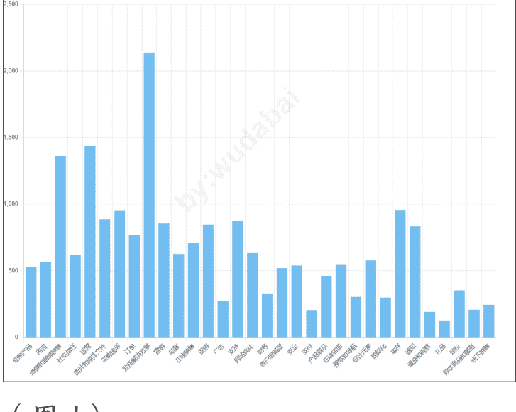

(图 1)

在所有 app 中总计评论预计有五十多万条，其中评论为 0 的占比 56.2%，大于 500 条以上的 app 总计只有不到 2%。

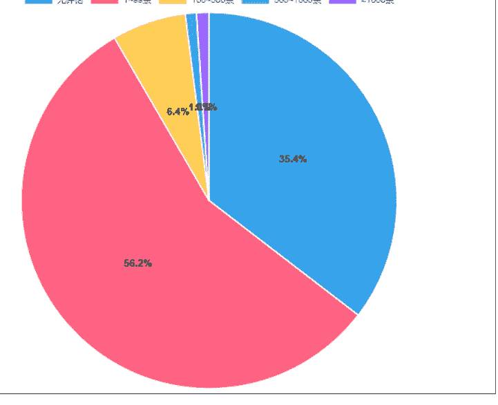

(图 2)

我们继续来看一下关于所有 app 的评分数据，我们发现一个细节，发货订单类 APP 占比超过 30%，但用户评分最高的反而是“定价”和“礼品”类赛道。这意味着：竞争激烈 ≠ 市场饱和，有时候越“冷门”的方向，反而越有机会。

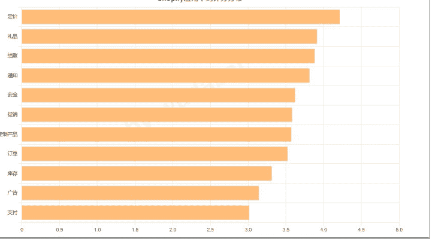

(图 3)

在 app 上架时间这块，2009 年才上线了几个，一直到了 2019 年才开始有爆发增加，截止到今年为止，每年新增 app 数都比往年要变多，今年 2025 年是新增最多的，达到了将近 2500 个。说明越来越多的开发者，开始盯上这块还没饱和的蓝海。

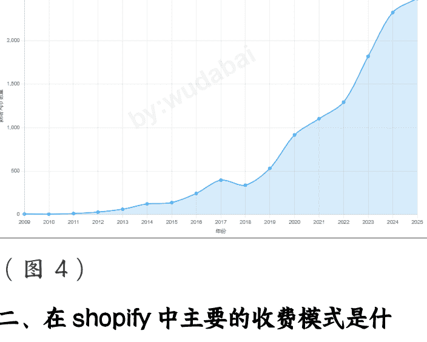

(图 4)

### 二、在 shopify 中主要的收费模式是什么？

我们看完了上述的 app 基本大盘数据之后，我们继续来分析一个大家都比较关注的问题，就是目前这么多 app 他们的收费模式是什么，做的最好的预估收益是什么样的。

我们先来看一下具体的一个数据图表，其中纯免费的 app 占了 3.1%，先免费再收费的占了 96.9%，数据表明绝大多数 app 都是通过先免费再收费的方式来进行，这说明免费 App 更容易吸引新用户。

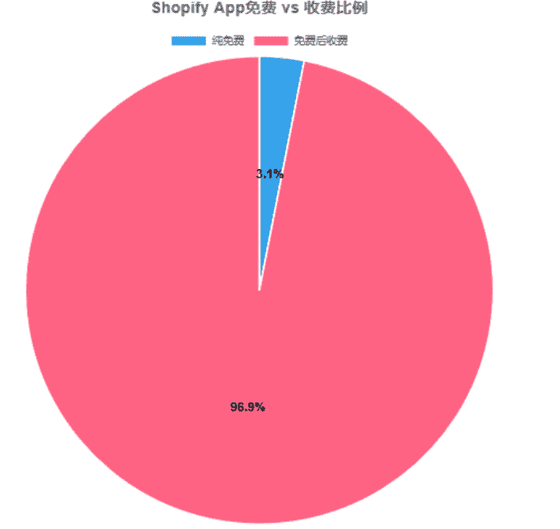

(图 5)

在所有 app 中，几乎都是订阅制收费，这也是 shopify 官方支持的一种收费模式，我们继续来统计一下所有 app 的收费区间情况。

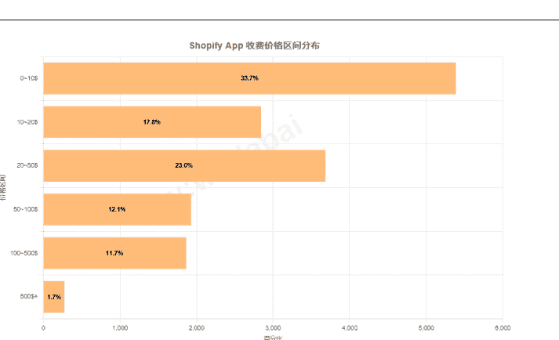

(图 6)

从图表中我们可以看出将近 75% 的 app 收费还是在 50 美金以下的 (月费居多)，达到 100 以上的占比只有 13% 不到，并且收费居高的大部分都是以年费为主。

我们接下来举一个实际的例子，就以 Essential Announcement Bar (https://apps.shopify.com/essential-announcement-bar?locale=zh-CN) 这个 app 为例。

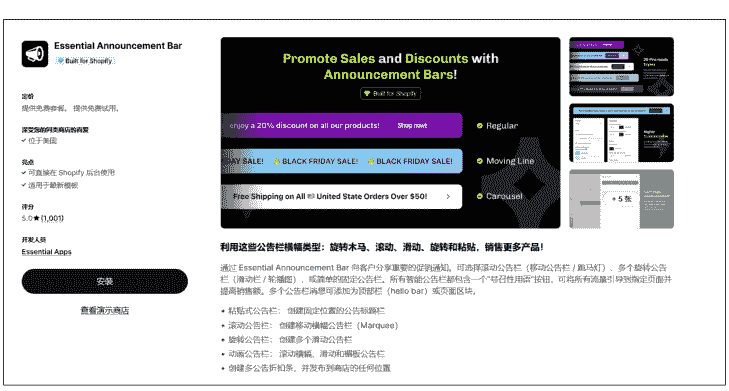

(图 7)

这个 app 的作者来自立陶宛这个国家，app 是 2023 年 8 月 9 日上线的 shopify 的，主要是公告栏相关的功能。

截止到目前共有 1001 个评论，总体评分为 5 分，收费模式也是经典的免费转付费，月费 19 美元，年费 199 美元。

我们来预估一下他的收入 (基于个人行业经验估算)。

因为评论是 1000 个，我们预估一下他的用户总数为：

评论转化率=5% → 1000/0.05=20000 用户。

按照 5% 左右的 (这块完全可以做到，shopify 用户质量付费意识高) 的用户转化率来算的话就是：

20000*10%=2000 个付费用户 (其实也就是评论的两倍，这数据是完全低估的)。

其中月费占 70%，年费占 30%（因为好评率高），那么就是 20000*0.7*196（只算续费了 6 个月）+20000*0.3*199=159600+119400=279000 美元，预估年收入为 198 万人民币。

总体收入来算是非常客观的，在 shopify 中，“高评分付费工具型 App"是更容易被长期使用、获得稳定收入的方向。

### 三、基于评分与评论背后的“市场需求”

我们基于 shopify 的收费模式已经分析了当前大致的市场，接下来我们从评分和评论两个数据来看下市场切入点。

以下数据表明大部分 App 的评分集中在 4.5~5.0 之间。

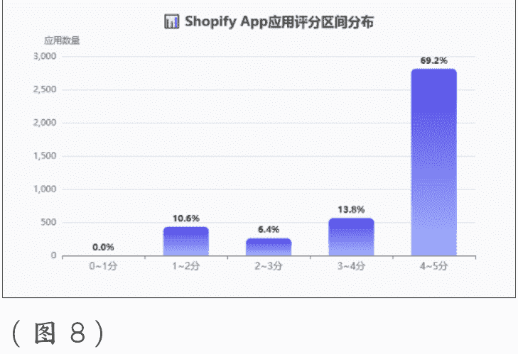

(图 8)

但评论数量差异巨大（图 2），新 App 想“突围”，口碑积累是关键；对于独立开发者来说，前期可以考虑通过免费策略换取早期评价，同时也需要寻找新的功能开发切入点。这块从未被满足的市场切入可能会更有机会，如“定价”和“礼品”类赛道。

当然现有成熟的 app 也可以通过用户的一些评论发现需求点。

我们接下来从用户评论来分析一下当下 shopify app 的一些市场开发方向。我们还是以 Essential Announcement Bar 这个 app 为例，他总共评论数据有 1000 多条。

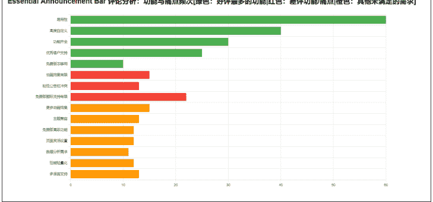

(图 9)

其中关于 app 最差评的功能：动画效果有限（仅滚动或静态），粘性公告栏与主题头部冲突，免费版图标支持有限。

还有其他未被满足但在评论中一直出现的需求：更多动画效果、与各种主题兼容、支持更多页面/区域灵活设置、多语言 / 国际化支持等。

以上都是一些常规化的公告栏需求，但现有 app 是没有被满足的，我们如果寻找新的机会，完全可以对标成熟 app，然后再满足用户这些未被满足的需求，这也是一个市场方向。

### 四、在 shopify app 生态中，个人开发者有机会吗？

从 shopify app 开发的技术难度层面来说，个人认为是没有什么太大难度的 (这个因篇幅有限，不做过多介绍)，尤其在 AI 这么牛叉的时代。

我们接下来继续分析一下整个 shopify 有多少开发者，个人开发者占比多少，平均每个开发者在 shopify app store 市场中上架了多少个 app。


(图 10)

上图显示在 shopify 应用市场共有 7562 位开发者，其中开发应用最多的有 69 个应用。这个开发者来自日本，shopify 主页为：

```
https://apps.shopify.com/partners/unreact5?locale=zh-CN
```

大家可以去看一下。

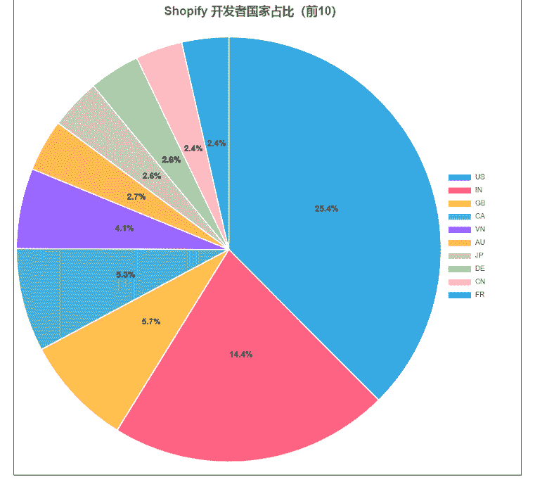

(图 11)

从开发者分布国家（只显示了前 10）来看，美国是最多的，其次是印度，我们中国在 shopify 应用市场开发者占比还不到 3%。

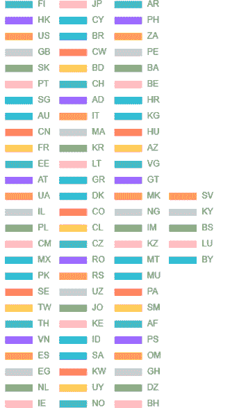

(图 10)

当然完整的开发者所在国家还是有很多的，覆盖了全球大几十个国家，证明 shopify 的开发者在全球很多国家都存在。


(图 11)

在整个 shopify 中个人开发者占了 38.3%，团队开发者占了 46.6%。

但是我从上架时间和评论数据分析来看，发现很多团队开发者都是从独立开发者向团队开发者转变的，当 app 有了一定的收入之后才开始组建团队，开发自己的官网来承接客户的一些答疑。

个人开发者依然有机会，只是门槛从‘会写代码’，变成‘能理解需求’。

### 五、数据告诉我们什么样的 App 最有赚钱潜力？

当我看完这一整套数据之后，我的最大感受是，shopify app 市场真的大有可为。

因为 shopify 本身有数百万电商卖家，他们每天都在寻找更聪明、更自动化、性价比跟高的工具来帮他们卖得更好。

我们之前展示了各种 app 的分析数据，结合评分、评论、更新时间、付费方式等数据，我初步筛选出了几类“高潜力方向”可以给大家参考一下（下面表格是我把数据喂给 AI，AI 给我总结出来的）：

| APP 类型 | 特征 | 主要功能 | 潜力分析 |
|---|---|---|---|
| AI 助手类 | 新上线多、高评分少评论 | 产品描述生成、AI 客服 | 需求增长快，竞争仍小 |
| 自动化工具类 | 高频操作自动化 | 批量导入、库存同步 | 付费用户稳定 |
| 设计优化类 | 用户关注 UI/转化率 | 主题优化、图片压缩 | 高价值但门槛低 |
| 营销推广类 | 评论多、老开发者集中 | 折扣活动、邮件营销 | 市场成熟但竞争激烈 |
| 数据分析类 | 多为团队开发、有网站 | 店铺数据洞察、转化分析 | 增长稳定，偏中高端市场 |
| 物流与履约类 | 国家差异大、功能细分 | 运费计算、订单追踪 | 增长缓慢但长期需求稳定 |
| 社交媒体集成类 | 大厂集中、跨境商家常用 | Instagram/TikTok 集成 | 渗透率高但新创机会少 |
| 客户关系类 (CRM) | 有一定技术门槛 | 客户分群、忠诚度计划 | 复购与留存价值高，长期发展佳 |

上述所列举出来的都是基于目前数据得来的，具体的可以进入 shopify app store 官网去对应的竞品，可以通过之前的分析方式去挖掘具体需求。

我记得几年前我在生财开了一次关键词挖掘大航海，有兴趣的也可以去看看，里面有比较完整的一些需求挖掘方法论。

### 六、写在最后：关于 AI 时代技术与电商结合的机会

到此为止，基于 shopify app 应用的一些数据已经分析完毕。

最后我们来聊聊关于 AI 时代技术与电商结合的一些机会思考。

上述所聊的都是基于 shopify app 的一些应用数据，但是我想表达的一个点是上述的每一个 app 都代表了电商的某一个需求，它目前只是只是展示在 shopify 中，换一个场景它的市场还是存在。

比如基于 WordPress 的插件？如 ecommerce。

比如基于浏览器的电商插件？如 *AliPrice。

比如针对物流的实时追踪？如 *I7TRACK。

等等还有很多类似的，都是非常牛叉的产品，盈利能力也非常强，当然这些都是公司形式在运作，但是也有很多独立开发者的产品做得非常不错。

在我看来，电商人是互联网上最舍得花钱的一群人，只要能帮他们多卖 1 单，他们就愿意掏钱，并且粘性特别高，因为电商是跟用户和数据打交道的，一旦习惯了某一个解决方案，基本不会换。

在如今 AI 时代，写代码已经不是难事了，找到一个解决部分人痛点的需求，一个月收入破万个人认为是非常轻松的，当然如果实在没有什么头绪，那就从 shopify app 这种基于应用市场的需求开始，成本最低，反馈最快。

无需复杂的前端设计，不必有庞大的团队，只要能解决一个痛点，就可能变成“月入几千刀的小生意”。

好吧，感谢你能看到这里，如果上述内容对你有所帮助，那是我的荣幸。

（此内容发于生财，谢绝任何形式的转载）

### 最后，安利小懒的付费群：

懒人专属群（介绍）


💡懒人专属群持续更新中，已持续运营 6 年，整理超 3000 份各类精选付费文章 & 年费社群干货，全部开放下载。

本资料为付费群内部分享，仅供真实有需要的朋友查阅🙇

懒人专属群更新记录：

https://lazy2025.top/blog/record2

懒人专属群更新记录（需梯子，备用）:

https://lazybook.fun/blog/record2