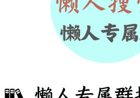

# 154 | 中国稀土产业链，为何难追赶

251104

整理：公众号懒人搜索，懒人专属群独享

懒人微信：lazyhelper

欢迎打开《蔡钰·商业参考 4》，我是蔡钰。

中国在国庆节后提出稀土长臂管辖之后，西方明显坐不住了。

2025 年 10 月底，中美两国元首在韩国釜山会晤，深聊了接近 2 个小时。会谈结束后，双方公布的主要结果是这样的:

- 第一，美方将取消针对中国商品加征的 10% 所谓“芬太尼关税”，对中国商品加征的 24% 对等关税将继续暂停一年。中方将相应调整针对美方上述关税的反制措施。双方同意继续延长部分关税排除措施。

- 第二，美方将暂停实施 9 月 29 日公布的出口管制 50% 穿透性规则一年，也就是驱动荷兰争夺安世半导体的管制政策。中方将暂停实施 10 月 9 日公布的相关出口管制等措施一年，并将研究细化具体方案。这指的主要是中国升级的稀土长臂管辖。

这之外，美方将暂停实施它对华海事、物流和造船业 301 调查措施一年。美方暂停实施相关措施后，中方也将相应暂停实施针对美方的反制措施一年。

这还不算。会谈前后，特朗普的态度明显温和，一边对这场会晤打出了 12 分的评价，一边重新用 G2 来定义中美关系。这种邀请中国共治天下的友善姿态，跟过去七八年截然不同。

这让市场产生了两个议题：

- 一个是，看上去，中国的稀土长臂管辖，确实打到了要害。

- 另一个是，稀土的反制能用多久？这次延期一年，会不会让美国得以修复稀土产业链，挣脱中国的卡脖子反制？

美国财长贝森特放话说，美国将在两年内解决对中国的稀土依赖。但与此同时，我看到不少研究者给出的结论是，美国重建一条稀土产业链，至少要 10 年。

而在这个期间，其它关键变量早就推动了两国关系走向，中国的稀土产业技术与成本优势也足以形成新的代差。

稀土作为“工业维生素”的关键作用，《商业参考》在第一季就跟你讨论过，链接放在文末供你复习。这一讲，我们主要来解释，为什么中国稀土产业链的优势难以追赶和替代。

## 伴生产业链

先说说中国稀土产业链的特点。

第一个特点，它是一条“伴生产业链”，它的诞生与进化，是被其它主产业带动前行的。

比如，内蒙的白云鄂博矿，是世界上最大的稀土矿床，它在 1927 年是被科学家当作铁矿发现的。直到 1958 年包钢在这里建厂，才开始“顺手”冶炼铁矿废石里的稀土。

再比如，稀土里的金属镓，主要是提取铝和锌时的副产品，想得到镓，首先要有强大的铝和锌的制造能力。

而中国恰恰是全球最大的金属铝生产国。中国铝业 2024 年铝产品的产量高达 761 万吨，对应生产的金属镓是 280 吨。换句话说，中国每造 16 万个易拉罐，就能顺手捞 1 克镓，够造 300 部 iPhone 的。

这 280 吨镓，占全球原生镓供应量 20% 以上。中国铝业生产这 280 吨金属镓几乎没有财务成本，但前提是要有 2.7 万倍的主产品铝的产量。

这之外，中国做电解铝的时候，废渣里能顺带提取镧、铈、钕；做磷肥的时候，磷矿石里能顺带分离钇、铒、镝，都是伴生产品。

这也是为什么，中国的稀土储量只占全球 37%，产量却占全球 69%，远远高于储量的全球占比。因为中国提取和炼制很多稀土时，不需要单独投资、单独开矿、单造生产线。

这就意味着，如果美国要简单复制中国稀土产业链的诞生之路，相当于要完成一整个工业集群的重建。

## 非标技术沉淀

中国稀土产业链第二个特点：长达 40 年的持续、非标技术沉淀。

中国意识到稀土的价值后，化学家徐光宪在 1975 年提出了“串级萃取理论”，这个理论可以把 17 种稀土元素逐步从稀土矿中分离出来，而且纯度最高能达到 99.999%。

这个方法提出之后，1980 年代，包头就依照它建成了第一条稀土生产线。这种方法一落地，成本直接降到了西方同期的 1/4。

这成本光是降在理论创新吗？还真不是。从理论到工业化，中间还隔着一道巨大的鸿沟：产业工人的经验和体感。

你要知道，当时可没有什么自动化、数据化，成百上千级的串联萃取，对流量、温度、pH、萃取剂老化、设备振动等各个维度的协同控制，很长时间都要依赖一线技术工人的“肌肉记忆”，直到近十来年，才逐步通过传感器与建模走向数字化/算法化。

而同一时期，西方在环保与成本压力下，陆续退出了关键分离环节。美国的最后一家大型稀土矿是帕斯山稀土矿，冶炼厂 2000 年前后就关门了。它在 2017 年想要重启，却发现连会看萃取曲线的技术工人都招不到。

为什么？美国已经有两代人没干过这行了，想再捡起家学非常困难。

而中国这边，还拿包头来说，目前稀土高新区集聚的稀土相关研发人才超过 5000 人，内蒙古科技大学的稀土产业学院，30 多年来输出的本科生也有 5000 多名，人才梯队是稳定的。

## 美国重启稀土产业链的困境

美国，当然是目前最有动力追赶中国稀土产业链的国家。它其实在 2010 年就立志要重启稀土产业链，但直到 2017 年才恢复了唯一一座稀土矿的运营，就是前面提过那座帕斯山稀土矿。这个稀土矿恢复开采后，也还是要把矿石运往中国进行精炼加工。

听起来，美国恢复稀土产能，似乎比让台积电搬家还要费劲。为什么会这样呢？如果对比前面提到的中国产业链特点，你会发现，美国恢复稀土产业有三重困境。

第一个，时间困境。《纽约时报》最近采访到一个名叫 NioCorp 的开矿公司，这家公司的董事长说，在美国开一座稀土矿需要 29 年的时间。

美国能源部比这家公司乐观很多，但也认为，美国重建完整稀土供应链需要 10 年时间，和 3000 亿美元的投入。即便启动深海采矿，从勘探到量产也需要至少 5 年，这还没考虑国际法与环保的争议。

第二个是成本困境。就算相同技术的稀土生产线建成，按照 2024 年的标准，美国工人的平均工资是中国的 3 倍，电价是中国的 1.5 倍，还要跟 AI 产业争夺电能。

更要命的是环保成本。前面提到的帕斯山稀土矿 1998 年关门，主要原因就是钍的放射性废渣没办法处理。它在恢复开采后，还得把矿石运到中国处理，就是因为中国有“脱放射”的技术支持。

那么，中国的稀土产业链是不用考虑环保因素吗？

当然不是，中国在前些年的供给侧改革里，给产业链搭建环保处理体系，也已经把稀土产业链给带进去了。

第三个困境，技术困境。目前来看，中国在稀土冶炼分离技术上领先全球，而美国仍在用 1990 年代的“酸浸法”，两边有非常明显的技术代差。

那美国能不能直接扔掉旧技术、直接模仿中国的新技术呢？这样一来，就要撞上中国的专利技术墙了。

截至 2025 年，中国在稀土元素制备产业专利中占比 83.3%,位居全球第一，技术含金量有三四层楼那么高。

你可能记得，我们在 139 讲 (《稀土长臂管辖：中美攻守逆势？》) 提到，中国在国庆假期后升级稀土长臂管辖政策时，把稀土产业的工艺参数、加工程序、人员雇佣都管上了。

在更早以前，关键的离心萃取机、无铵开采、晶界扩散技术，也都列入了《禁止出口目录》。

所以，美国要拥抱新的稀土提取技术，要么得跟中国做交易，要么得去做它自己的“原始创新”。

## 总结

所以你看，伴生产业链 + 非标技术沉淀 + 深厚专利墙，是今天中国稀土产业真正的三叉戟。它在美国的赶超之路上，建构了一个“成本 - 时间 - 技术”的飞轮障碍。

到了这里，故事还没有完。“伴生产业链”对应的两个重要概念，是超大产业集群和统一大市场，它们构成了一个完备的生态培养皿，让稀土产业链能够从中受益。

而中国的新能源汽车产业，今天能够在技术和成本上跑赢全球，也享受到了跟稀土产业类似的生态红利。

下一讲，我们来换个视角，看看新能源汽车跟稀土相似的机缘。

再见。

> 延伸学习《稀土行业：「工业维生素」如何影响供应链安全》

最后，安利小懒的付费群：

懒人专属群（介绍）

📚 懒人专属群持续更新中，已持续运营 6 年，整理超 3000 份各类精选付费文章 & 年费社群干货，全部开放下载。

本资料为付费群内部分享，仅供真实有需要的朋友查阅🙈

懒人专属群更新记录：

https://lazy2025.top/blog/record2

懒人专属群更新记录（需梯子，备用）：

https://lazybook.fun/blog/record2