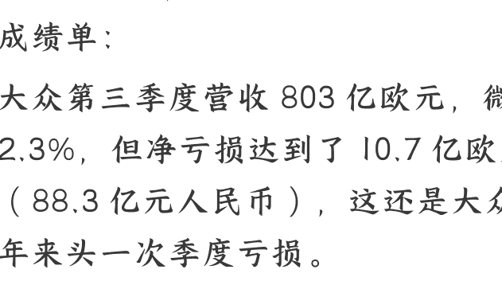

# 大众汽车五年来首次亏损，燃油车加速下滑？

251104 文/卢克文工作室嘉宾 壹壹壹

公众号懒人搜索，懒人专属群独享

懒人微信：lazyhelper

10 月 30 日，大众汽车交出了一份惨淡成绩单：

大众第三季度营收 803 亿欧元，微增 2.3%，但净亏损达到了 10.7 亿欧元（88.3 亿元人民币），这还是大众五年来头一次季度亏损。

从今年前九个月整体来看，大众汽车净利润下降超过了 60%，从去年的 88 亿欧元暴跌至 34 亿欧元。

仅短短一年间，这个全球第二会赚钱的车企，盈利直接上演高台跳水。营收在涨，利润却崩盘——问题出在哪了？

答案很简单：成本失控。这背后反映出，整个德国汽车工业正经历一场深刻的结构性危机。

# 01

大众旗下的保时捷，已从曾经的“利润奶牛”变成了拖后腿的主力。

今年前三季度，它的营业利润从去年的 40 亿欧元缩水到仅剩 4000 万欧元，暴跌 99%。

利润崩盘背后，美国关税是一记重拳。

今年 4 到 7 月，美国对德国汽车征收 27.5% 的临时高额关税，虽然在 8 月下调至 15%，但保时捷顶峰时期的利润率也才 18%，这 15% 的关税简直像一刀砍在大动脉上，你不在美国投资，就得缴额外关税。

保时捷的生产线主要在德国，在美国没几家工厂，只能硬扛关税。为了保利润，7 月份它在美国带头涨价，可这一涨，销量立马跌了 6%。

关税战冲击的不仅是保时捷，整个欧洲车企都遭了殃。6 月份欧盟对美汽车出口额暴跌 36%，大量新车积压在比利时港口运不出去。

大众集团透露，光上半年关税就让保时捷多花了 4 亿欧元，而它今年上半年总利润才 10.4 亿欧元，只有去年同期的三分之一。

关税固然是压在骆驼身上的稻草，但真正让保时捷帝国雪崩的，是它那套引以为傲的“价值坐标”，在中国彻底不灵了。

中国是保时捷的重要阵地，它靠两样法宝站稳脚跟：德系工程学的巅峰性能，象征财富品位的品牌光环。

如今，两大支柱正在同时崩塌。

保时捷引以为傲的 911 的水平对置发动机、PDK 变速箱的闪电换挡，这些内燃机时代的顶尖技术，在电动车时代遭遇了降维打击。

它花几十年建立的性能护城河，被 20 多万的国产电动车轻松超越。

而真正为保时捷赚钱的不是 911，是卡宴和 Macan 这两款 SUV。它们本来的定位是“比 BBA 更有档次的家用车”，结果被新势力车企精准盯着打。

当问界 M9 的车主在车里开会、理想 L9 的后排变成移动影院时，保时捷那套老旧的车机系统，活像诺基亚遇上了 iPhone。

老钱风卷不赢代码神话，保时捷的“保值神话”也就此破灭了。前年 150 万的帕拉梅拉，现在二手车只剩 60 多万。

当这家“豪车印钞机”褪去财富图腾的外衣后，人们惊觉：它不再是能增值的“硬通货”，只是件普通的消费品时，对那些精打细算的中国富人来说，吸引力自然大打折扣。

保时捷在中国市场的份额已从巅峰时期的 30% 腰斩至 15%。面对节节败退的局面，保时捷试图通过电动化路线重整旗鼓。

电动化转型让保时捷付出了 27 亿欧元（约合 210 亿元人民币）的代价，明年还要再花 31 亿欧元。

问题是钱花了，车还是卖不动——前三季度在中国销量暴跌 26%，德国也跌了 16%。

主要是保时捷“重硬件轻软件”的策略完全失灵。智能座舱落后，车机难用，消费者根本不买账。

现在保时捷不得不踩刹车：放缓电动化，回头继续推燃油车。

这场仓促的电动化转型，不仅没救场，反而成了它的沉重负担。

# 02

保时捷的困境并非个例，整个德系豪华品牌都在经历寒冬。

奔驰净利润暴跌 55.8%，直接遭腰斩；奥迪下滑 37.5%；宝马也跌去 29%。曾经风光无限的 BBA，如今一个比一个惨淡。

这不禁让人想问：作为汽车界的顶流，这些德系巨头的市场嗅觉为何如此迟钝？难道他们不知道电动车才是未来吗？

事实上，老牌车企的反应并不迟钝，甚至相当迅速，大众早在 2015 年就已开始布局电动化。

而 2018 年上任的 CEO 迪斯，堪称传统车企里的“激进派”，他清醒地认识到汽车产业正面临“诺基亚时刻”，曾多次公开称赞特斯拉，甚至邀请马斯克亲临大众总部交流。

为推动转型，迪斯力排众议，主导未来五年投入 600 亿欧元用于电动化和数字化。（2019 年大众第 68 轮规划）

他站在总部大楼上宣告：“除了电动车，大众别无选择。”

既然布局如此之早，为何仍难挽颓势？

问题的核心在于：大象转身虽早，却输在了体量太重，被自身拖累了步伐。

1937 年，大众汽车由德国工人集资创立，初衷是造“老百姓都买得起的车”。传奇车型甲壳虫因此诞生，累计销售超 1500 万辆，成为全球最畅销的单一车型。

二战后，大众曾被英国短暂接管，1949 年又归还给德国政府。也就是说，大众从根子上就是一家国企。

1961 年大众上市，既然是上市公司，那肯定是第一大股东最有发言权。

但德国政府通过《大众汽车法》锁定了控制权——关键决议需获 80% 以上股权同意，而下萨克森州政府持有 20.2% 股份。

也就是说，政府对企业重大决策拥有一票否决权。

所以，保时捷控股手握大众 52.2% 的投票权，是名义上的第一大股东，然而在关键决策上，也得乖乖听工会和州政府的话。

大众的治理结构非常特殊——它没有传统意义上的董事会，而是由“管理委员会”负责运营 (CEO、CFO、COO、CTO 都在这个会里),上面还有一个“监事会”来监督和任命高管。

这个监事会里，20 个席位有一半是员工代表，两名来自下萨克森州政府，剩下 8 个才是股东席位，其中保时捷占 6 名，卡塔尔占 2 名。

也就是说，大众的实际控制权被三大势力分割：代表工人的工会、代表政府的地方州，还有代表资本的保时捷家族。

这三方利益常常不一致，导致内部长期内耗，决策效率低下。

比如，2023 年大众股息收益率高达 6.6%，股东是满意了，但工会非常不满，觉得有钱分红却还要裁员，损害工人利益。

2024 年，大众废除就业保障协议，准备关厂裁员，结果引发大规模罢工。从投资角度看，关掉不赚钱的工厂很合理，但从工人和政府的角度，当然不可能接受裁员的决定。

三方博弈的结构下，想推动改革难如登天。

迪斯就是例子。他原本被请来是负责降本增效，一上任就裁掉三万多个岗位，帮大众省了 40 亿美元。可当他真要推动电动化、关闭德国工厂时，却直接动了工会和政府的“奶酪”——原来燃油车生产线的工人要面临失业，政府税收也朝不保夕。

先得罪了工会，后来跟保时捷家族闹出不和，迪斯最后被赶下了台。

大众就像一头被内部利益拖住的大象，当电动车浪潮来袭时，它空有决心，却迈不开步。

其实，除了内部结构问题，让迪斯下台的原因还有一个，就是软件。

当时，迪斯深知“船大难掉头”，不如直接造艘新船。既然电动化是未来，就必须攻克电车的“大脑和灵魂”——软件。

2019 年，在迪斯推动下，大众成立“Digital Car&Service”部门，一年后升级为独立软件公司 CARIAD，目标很明确：为整个大众集团打造一个统一的“安卓系统”。

但这步棋问题很大。

大众旗下有 12 个品牌，从大众、斯柯达这样的平民车，到宾利、兰博基尼这样的顶级超跑，需求天差地别，想用一套系统通吃，怎么可能？

执行上更是困难重重：CARIAD 虽名为“统一”,但内部超过 6000 名员工来自不同品牌，文化、流程各异，难以形成合力。

更深层的问题，是思维方式的冲突。传统车企习惯了硬件主导的开发模式，层级多、流程长。比如大众一个项目审批要走 14 个节点，但在“软件定义汽车”的时代，这种旧思维跟不上节奏。

看看中国车企，理想汽车 2023 年 OTA 升级了 20 次，平均每 18 天一次，大众的节奏完全没法比。加上 CARIAD 自身定位模糊——既要开发软件，又要做系统集成，还要负责测试维护，资源分散，导致项目推进极其缓慢。

大众在 CARIAD 身上投入巨大。从 2020 年成立起，预算从 70 亿欧元一路飙升至近 280 亿欧元。对比来看，宝马同期软件投入约 150 亿欧，丰田约 120 亿欧，就连特斯拉的累计软件投入也仅在 180 亿美元左右。

更要命的是，钱没换来成果。

CARIAD 交付一再延期，直接导致保时捷 Macan 电动版、奥迪 Q6 E-Tron 等关键车型推迟发布，甚至拖累了宾利的电动化进程。

此外，已上市的大众 ID 系列也因软件死机、故障频发而饱受质疑，让大众遭受各方质疑，不得不疲于应付。

到了 2023 年 5 月，大众只好动手换血，CEO、CTO 全部离职，欧洲区裁员一半。

造成这种局面的很大一个原因是，欧洲本土很缺 IT 人才，毕竟错过了互联网浪潮，没招的大众只好跑去美国高薪挖人。

但空降来的精英水土不服，团队难以融合。从特斯拉和 Rivian 挖来的首席软件工程师桑杰·拉尔，最后带着近 200 人团队集体离职，几乎掏空了 CARIAD 的技术核心。

而如今的大众，早已不像从前财大气粗：在中国被自主品牌围剿，深陷价格战；欧洲市场疲软；美国政策多变。实在没能力再给 CARIAD 持续输血了。

对软件部门的过度输血，也是大众内部对迪斯很不满的一点。

最终，大众近日正式宣布放弃软件自研战略，把 CARIAD 降级为“合作伙伴协调者”。拉上小鹏和 Rivian 两家电动车企一起开发。

这个决定背后是惨淡的财务现实：CARIAD 在 2021-2022 年累计亏损近 34 亿欧元，2024 年一年就亏了 24 亿欧元，严重拖累集团业绩，导致大众 2024 年税后利润同比下降 30.6%。从 2022 到 2024 年，大众软件业务累计亏损已超过 58 亿欧元，折合约 475 亿元人民币。

不止大众，几乎所有传统车企都在面临同样的困境。

奥迪、奔驰、丰田等巨头一边宣布电动化目标，一边在现实压力下放缓脚步，推出“油改电”车型，延长燃油车寿命，加大混动投入。

他们心在新能源，身在燃油车，虽然都知道未来的方向，但“船大难掉头”的困境让每一次转型都步履维艰。

时代的车轮滚滚向前，会将这些老牌巨头的霸主神话，一同碾为历史的尘埃吗？

最后，安利小懒的付费群：

懒人专属群（介绍）

公众号懒人搜索、懒人专属群分享

💀懒人专属群持续更新中，已持续运营 6 年，整理超 3000 份各类精选付费文章&年费社群干货，全部开放下载。

本资料为付费群内部分享，仅供真实有需要朋友查阅🤫

懒人专属群更新记录：

https://lazy2025.top/blog/record2

懒人专属群更新记录 (需梯子，备用):

https://lazybook.fun/blog/record2