# 在小红书卖老师 AI 工具需求很多，虚拟产品的第二春

251104  生财精华

公众号懒人搜索，[懒人专属群](链接)独享

懒人微信：lazyhelper


你好，我是哆元。现在很多朋友都在做虚拟产品变现，但是大多数人总觉得虚拟产品就是各种学科的资料，卖课、卖 PPT 模板、卖电子书等，但现在是 AI 时代，AI 做的产品带来的影响可能超出你的想象。

这篇文章讲一个比较有趣的虚拟产品玩法，也是一个小商机，需求比较多。接下来哆元会说一下我是怎么发现这个玩法的。

## 一、发现一个需求

平时我都会花很多时间刷小红书，就刷到了这样一个笔记，致歉：可能有些老师朋友拿不到了，这种封面当时一眼就要敏感起来，这是一个比较真诚的口吻，然后这种标题换一下改成自己行业的也可以，很多人就会好奇，是什么拿不到就想进去看一下，所以这个标题模板大家可以拿去借鉴。

86【早读神器无法分享说明 - 周天兵 | 小红书 - 你的生活兴趣社区】😉
zeLTgatwGv0VrG7 😆

https://www.xiaohongshu.com/discovery/item/68ff179c000000000303613a?source=webshare&xhsshare=pc_web&xsec_token=ABlAp2FRsTkbMfI3MHxw_UaUGFY2LpErgTBnHdWCTxgxw=&xsec_source=pc_share

### 致歉：可能有些老师朋友拿不到了

早读神器无法分享说明
致歉：可能有些老师朋友拿不到了

现在还有很多朋友在私信我想要早读神器
期间我一直没有回复，因为收到了官方的处罚
那就继续探索，这是一个什么笔记，大概就是他做了一个老师课堂上用的早读神器，评论区有很多人需要求分享

| 评论内容 | 时间/地区 | 状态 |
| :--- | :--- | :--- |
| 求分享 | 33 分钟前 广东 | 回复 |
| 期待能够分享，真的非常需要，已关注 | 59 分钟前 贵州 | 回复 |
| 不咋看私信结果忘记回复您了！感想分享！！👍👍 | 2 小时前 浙江 | 回复 |
| 求分享 | 37 分钟前 湖南 | 回复 |
| 蹲蹲蹲 | 38 分钟前 江西 | 回复 |
| 请问怎么可以获得您的分享呀 | 55 分钟前 湖南 | 回复 |
| 已关注，求分享啊！🥺 | 2 小时前 广东 | 回复 |
| 求分享 | | |

到这里我们就要下意识看一下他主页其他笔记，就能够判断这个博主是做什么的了，然后就看到了一篇下面这样的爆款笔记，就是用 AI 做了一个工具，可以让学生在早读大声朗读课文，能够看到声音的分贝大小，就像玩游戏一样，不那么枯燥，需求很多，很多都在求分享，底下的人基本都是老师才会有这个需求。


这个号也是靠这一两篇笔记加了两个群聊


如果你刷到这样的需求，你会怎么想，有需求就是有市场，有没有人为这样的需求买单？这样的产品是我们自己做能不能完成？能不能做出各种更丰富的产品出来，接下来哆元接着说。

那我们就要去验证在小红书是不是还有类似的内容甚至有产品在卖了。搜索关键词早读监控工具后，就发现了下面这个笔记，他也是监控早读声音，但是就明显比上面好看多了，变得更加个性化了，一棵树会随着声音的大小变大变小，就有了趣味性，并且同样需求很多。

74【朗读养小树，早读再也不困噜～ - 喵喵喵喵老师 | 小红书 - 你的生活兴趣社区】😊 AF5gTWEuj5AUUnZ 😊

https://www.xiaohongshu.com/discovery/item/67d82b4e000000001201d53d?source=webshare&xhsshare=pc_web&xsec_token=AB5wIWSOPc2bSPFchvfc0MUR_OIFAeOLe-_kmO777b3MLE=&xsec_source=pc_share

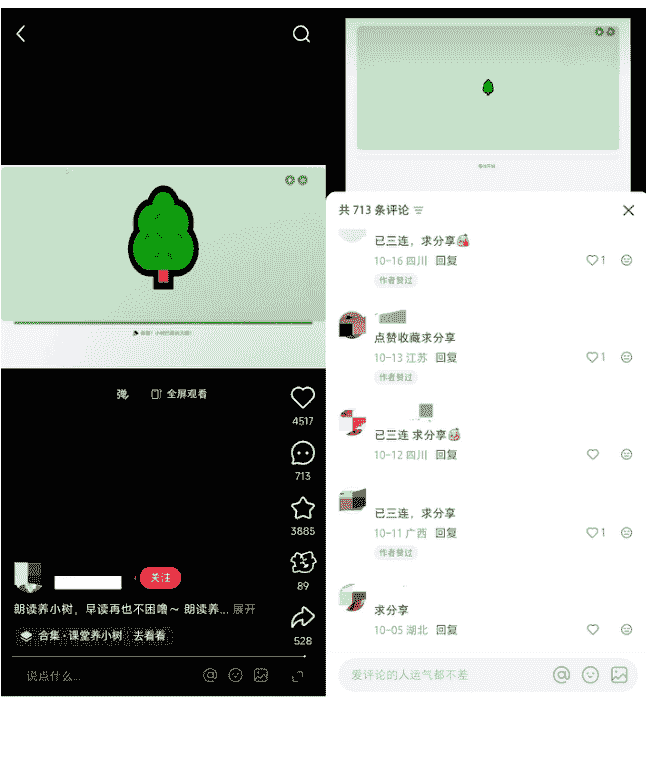

但是这个账号就不一样了，他挂了商品在底下的评论区


我们点进去看看，卖的也是不错，价格很低，各种产品加在一起也是买了几千单了，他做了很多各式各样的工具去满足不同场景的需求，拼多多砍一刀的梗都用过来了。

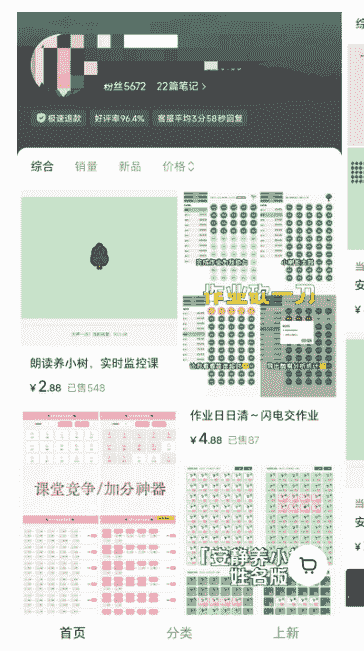

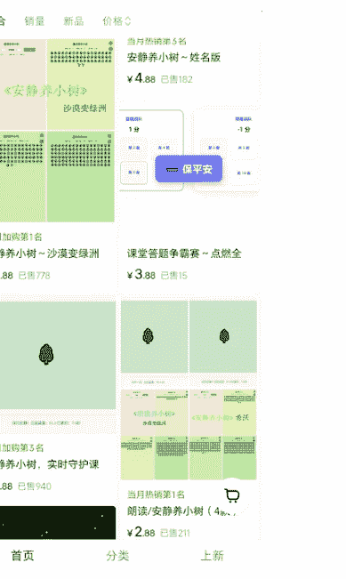

这个账号就是分享各种工具的，比如下面这个怎么让自习课的学生安静下来，这个场景大家熟悉吧，以前上课的时候就会有这种场景，自习课老师坐前面经常说谁谁谁不要讲话了。

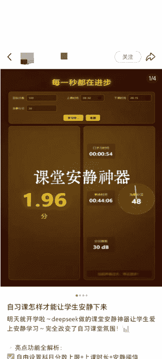


这个账号各种小工具都比较火，很有创意。

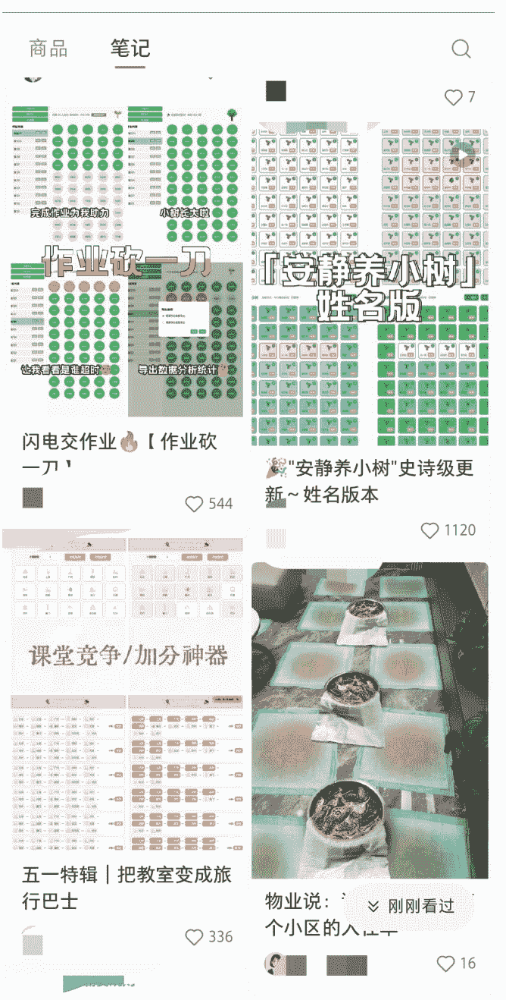

关于这样的老师工具有很多，比如下面这个笔记也是，解决什么痛点，学生怕考试不想考试的痛点。

70【我们班学生最近疯了，居然求着我多考试！ - 小满 AI 英语 | 小红书 - 你的生活兴趣社区】😊 O00PW2l2iTfsi6A 😊
https://www.xiaohongshu.com/discovery/item/690068540000000030121f0?source=webshare&xhsshare=pc_web&xsec_token=AB07YFTMIu0dvViYgyaDh-S7fsN5w270ee2HITIMsI29w=&xsec_source=pc_share

我们班学生最近疯了，居然求着我多考试！
当班主任第五年，第一次遇到这种怪事😂
上周五发完单元测试卷，我们班那几个调皮鬼居然围过来："老师，下周还有小测吗？""能不能明天再考一次？我保证认真复习！"
我当时都懵了，这还是我认识的那群见考试就躲的学生吗？
后来才发现，秘密就在新搞的这个"成绩喂养宠物"系统里✨
事情是这样的：上个月我突发奇想，把小时候养电子宠物的点子用到了教学中。每次考试的成绩可以换成积分喂宠物，宠物会从小雏鸟慢慢长大，还能在班级排行榜上 PK。
结果效果出奇的好：
最讨厌数学的小王，为了养他的"战斗鸡"，主动多做练习题
全班都在暗暗较劲，看谁的宠物先进化成"雄鹰"
连家长都说，孩子回家第一件事就是问"考试成绩出来没"
现在班里学习氛围完全不一样了，学生们把考试当成

| 评论内容 | 时间/地区 | 状态 |
| :--- | :--- | :--- |
| 已三连，求分享，真的需要🥺 | 4 分钟前 湖南 | 回复 |
| 求分享 | 4 分钟前 山东 | 回复 |
| 求分享🙏 | 5 分钟前 重庆 | 回复 |
| | 2 小时前 湖北 | 回复 |
| 已经三连了，还私信了🥰🥰申请群了，都没有消息 | 8 分钟前 安徽 | 回复 |
| 稍等啊宝宝 太多人啦。我得一个一个添加😭因为有好多人没关注要加群 | 6 分钟前 陕西 | 回复 |
| 已三连，求分享 | 3 小时前 湖南 | 回复 |

而且这个号就靠这一个笔记基本就破千粉，需求太大了。

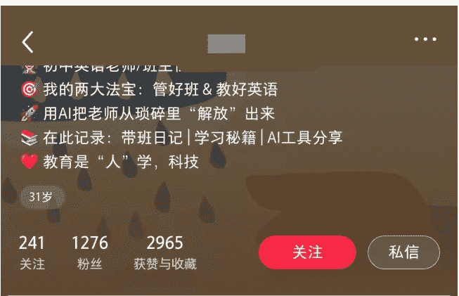

### 笔记

- AI 英语教学
- AI 辅助班主任


用 AI 把英语课本里的故事变成了小动画


我们班学生最近疯了，居然求着我多考试！

1524


晚自习干什么！女巫的游戏不规则动词版

27

所以这种教育类的小工具是有市场的，变现方式呢有很多种，可以看下面这个。

- **单品模式（9.9 元）**：最直接的变现，一个工具卖 9.9 或 19.9 元。成交门槛低，走量。
- **工具箱模式（49.9 元）**：将点名器、作业管理器、纪律管理器等 5-10 个小工具打包，形成一个"教师效率工具箱"，打包销售，提升客单价。
- **社群会员模式（199 元/年）**：这才是真正的大招。建立一个教师社群，入群费 199 元/年。会员权益包括：免费使用所有现有工具、每月定向开发 1-2 款新工具、分享优质课件模板、组织教学经验交流等。从"卖工具"升级到"卖服务、卖圈子"。
- **定制服务模式（B 端）**：当你的影响力做起来后，可以接学校或教育机构的定制需求，比如在工具里加入学校的 Logo 和特定功能，这就能直接切入 B 端市场，客单价更高。

### 这类产品除了在小红书卖，我们还可以看闲鱼，也有需求

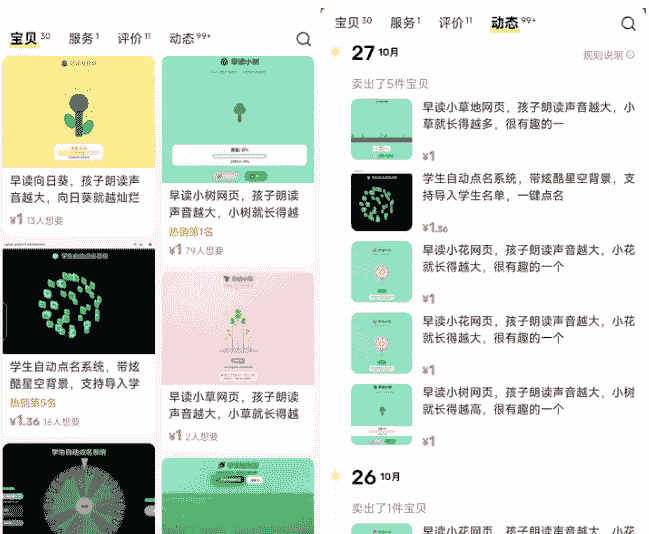

然后想办法做高客单，比如卖 AI 工具社群，定制产品，或者卖给老师其他的产品，比如 AI 课，比如自媒体课等等。

那知道有需求，这种产品我们能自己做吗，其实很简单，这里哆元来说一下

## 二、用 AI 简单做产品

这里不管是什么 AI 都可以，因为这个需求还是比较简单，比如哆元这里用的是 claude，直接把原作者笔记封面和文案截图，然后他是什么，能不能做一个纯前端的工具，他就给你分析了。


> 这是一个什么软件，我想了解我能不能做一个纯 html 出来复刻这个工具的功能
>
> 这是一个中文早读/自习辅助工具，专门为教师设计。从截图可以看到，它提供两种模式：
>
> **主要功能：**
> - 早读模式 - 让学生在早读时大声朗读课文
> - 自习模式 - 帮助学生在自习时保持安静
> - 支持调整音量判断
> - 支持 Windows 电脑和网页使用
> - 实时检测音量，可自定义音量判断标准
>
> **你能用纯 HTML 复刻吗？**
>
> 完全可以！这个工具的核心功能主要依赖浏览器的 Web API，用纯 HTML + JavaScript 就能实现。关键技术包括：
>
> **需要用到的技术：**
> - Web Audio API / getUserMedia API - 获取麦克风权限，检测音量
> - HTML5 + CSS3 - 界面设计
> - JavaScript - 逻辑控制
>
> **核心实现思路：**
> - 请求麦克风权限
> - 实时分析音频流的音量大小
> - 根据设定的阈值判断是否达到要求
>
> 然后开始制作，就生成出来了

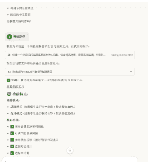


但是我觉得界面不太好看，就让他优化界面，并且可以把原作者的笔记内页的界面截图给他看，就生成出来了。

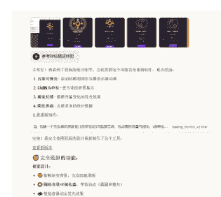

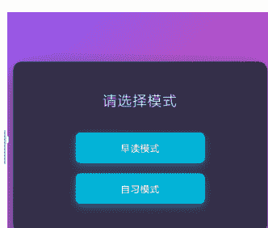

这里我们还可以继续优化，比如上面提到一个账号是树叶随着声音的大小来变大的，然后就给他说增加一个高级模式可以产出这样的效果

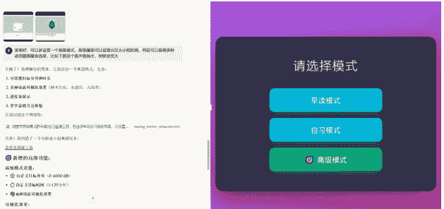

我们看一下效果，每次打开需要允许访问


然后也加入了很多不同的图标

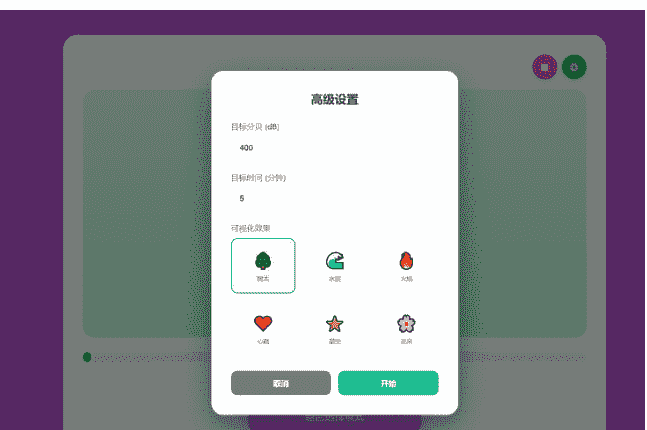

这个 html 代码有的 AI 是可以直接下载，有的不行，不行的怎么办，就在桌面建立一个 txt 文件，然后把代码复制粘贴进去保存，然后对这个 txt 文件命名更改一下后缀的 txt 为 html 确定就好，如果看不到后缀名，就小红书搜电脑文件看不到后缀名怎么打开，去设置一下就好了。

最后就做成了，这个产品就是一个 html 文件，双击就能使用，但是别人怎么使用呢，就需要发文件给对方，那他麻烦了吧，我们还可以把这个文件封装成一个网站，这样的话用户使用就简单方便多了。

封装成网站这里需要用到 GitHub（是一个面向全球开发者的代码托管平台和开源社区）

网址：https://github.com

如果进不去是因为网络问题

点击右上角的 Sign up，进行注册

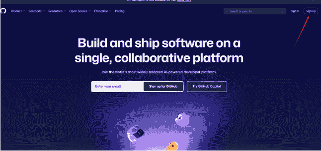

英文界面看不懂，就打开翻译，也可以直接按哆元的步骤进行操作

我是直接用谷歌邮箱注册的，后面需要接一个验证码

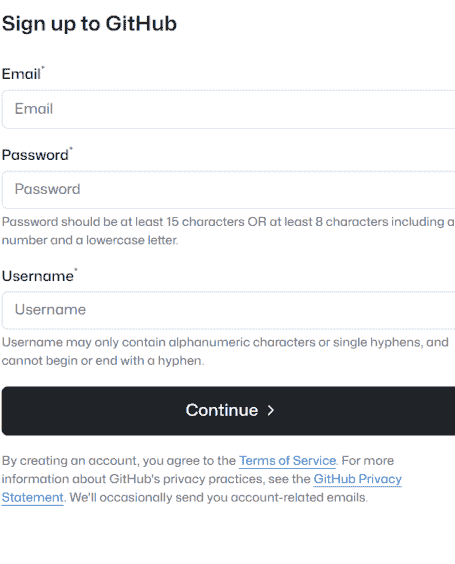

注册成功后，登录就是这样的界面，然后点击右上角的加号，点击 New repository，这个地方是创建新的存储库。

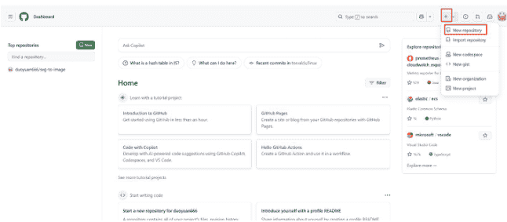

### 进去后取个名字（需求的拼音缩写或者英文最好），勾选公开，然后直接点击右下角的创建按钮


### 然后直接点击这里上传我们的文件


进去后直接拖拽文件上来，这里拖拽上面你生成的或者自己建立的 html 文件就行（这里注意如果你的 html 文件是其他命名拖拽上去可能会报错，下面哆元会提到怎么解决），然后点击 Commit changes

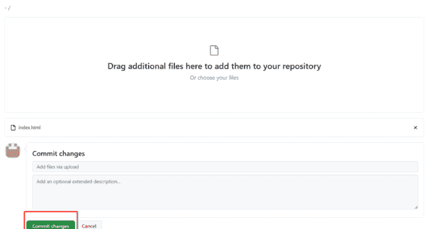

然后接下来点击上面的 settings 按钮，点击左侧的 Pages

在"Source"部分，选择"Deploy from a branch"

在"Branch"下拉菜单中选择"main"，点击"Save"

等待几分钟，GitHub 会提供一个网址

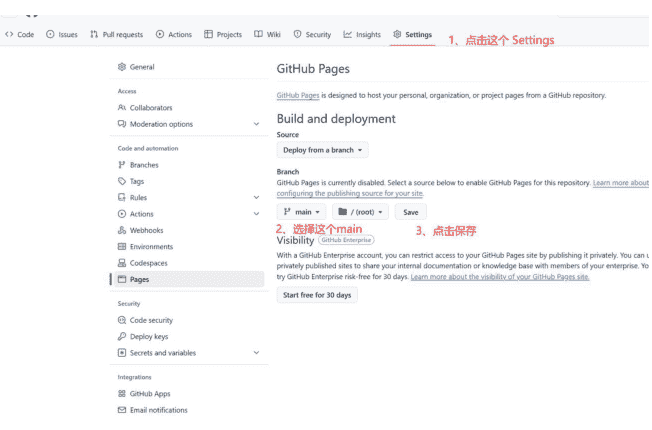

然后我们刷新一下，这个网址就是最终的网站了，直接双击就能跳转了

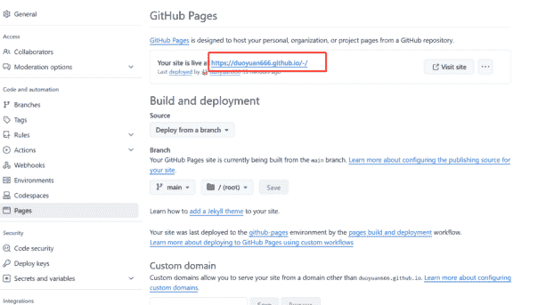

### 那么我们后期代码想更改了怎么操作呢

回到 GitHub 的主页，点击这个猫子图标就能回到主页，然后左边有我们之前操作的方案，点进去

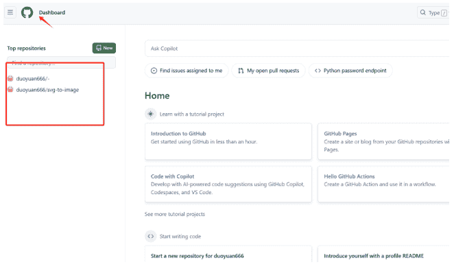

点进去后，点击这个 html

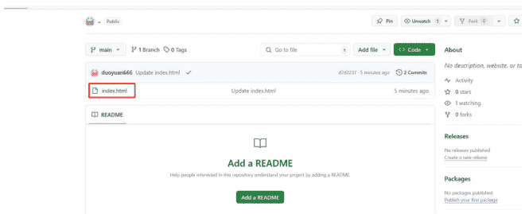

然后进去后就是代码界面了，然后点击右上角这个笔，他是编辑代码的功能

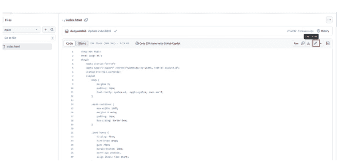

进去后，直接全选复制粘贴替换之前的代码，然后点击右上角绿色这个保存就 OK 了


然后直接点击上面的 settings，点击左侧 pages，然后点击网站，就是可以看到更改了，这里需要等待一两分钟，他有个时间


所以最后的文本对比工具就变成了这样一个网站：

https://duoyuan666.github.io/Allaoshi/

注意事项，如果打开网页是这个界面，就是我们的 html 的名称需要去修改成 index.html

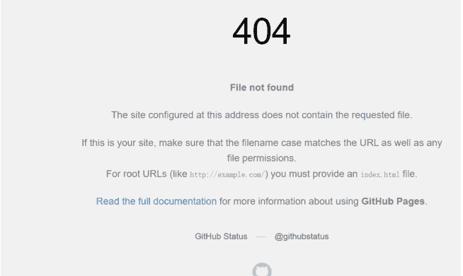

还是跟修改代码一样，有个命名的地方，改了直接点击右上角保存等待成功就可以正常进入网页了

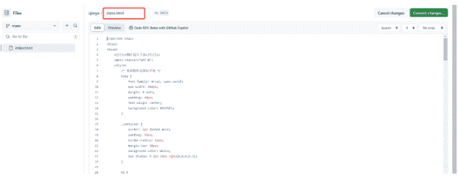

OK，上面哆元就讲了怎么做简单的工具并封装成网址的步骤。

那还有哪些优化呢，产品做出来不是就行了，要讲究美观，要讲究多样化，能不能做出更多场景的工具呢，这里我们可以截图对标的笔记发给 AI 并让他生成多个不同的创意。


### Model

Thoughts (experimental)

Expand to view model thoughts

Auto

太棒了！您观察到的这些小红书上的工具，都精准地抓住了“游戏化教学”和“可视化管理”的核心，它们之所以受欢迎，是因为它们：

- 提供了即时、正向的反馈：学生的努力能立刻在屏幕上看到结果。
- 将个人行为与集体荣誉挂钩：比如“安静养小树”，让纪律不再是老师和学生之间的事，而是全班共同的目标。
- 降低了管理成本：老师用一个有趣的界面，就完成了点名、收作业、维持纪律等工作。

完全没问题，基于这些思路，我们可以构思出更多富有创意的 AI 工具。以下是几个全新的想法，并为每个想法都提供了一段可以直接复制给 AI（如 ChatGPT-Claude 等）的纯 HTML 生成指令。

### 创意一：知识摩天楼 (Knowledge Skyscraper)

- 创意构想：这一层一个全班合作的“建造游戏”。每当有学生回答对一个问题、背会一首古诗或者掌握一个单词，就可以为班级的“知识摩天楼”添上一块砖。大楼会随着大家的努力而越来越高，从地基到竣工，甚至可以解锁不同的楼层样式（如图书馆层、科学实验层）。这能极大地激励学生参与课堂问答，将枯燥的知识点转化为看得见的成就。
- 给 AI 的纯 HTML 生成指令：

```
< > Code
请你作为一名前端开发专家，帮我创建一个单体、离线的 HTML 文件，名为"knowledge_skyscraper.html"。这个页面不需要任何外部库（如 jQuery），只使用原生的 HTML、CSS、和 JavaScript。

页面需求如下：
1. **整体布局**：左侧是学生列表，右侧是摩天楼的可可视化区域。顶部是标题"知识摩天楼"和总楼层数显示。
2. **学生列表（左侧）**：
   * 一个可编辑的区域，允许我通过复制粘贴的方式，一次性输入全班学生名单（每一行一个名字）。
   * 名单生成后，每个学生名字旁边有一个"+1"按钮和一个"撤销"按钮。
3. **摩天楼（右侧）**：
   * 用 CSS 绘制一个简单的摩天楼地基。
   * 每当任何一个学生被点击"+1"按钮，总楼层数增加 1，并且在摩天楼上动态地、从下往上"长"出一层新的楼层（一个简单的矩形即可）。新楼层出现时要有平滑的动画效果。
   * "撤销"按钮会移除最新添加的一层楼。
4. **功能与样式**：
   * 页面整体采用明亮、卡通的风格。
   * 当楼层达到 10 层、25 层、50 层时，摩天楼的颜色或样式可以发生一点小变化，以示庆祝。
   * 需要一个"重置"按钮，可以清空所有楼层和数据。
   * 所有数据都只在当前页面会话中有效，关闭即消失，不需要本地存储。
```

### 创意二：班级神秘档案 (The Class Mystery Files)

- 创意构想：将一周的常规班级管理变成一场“破案游戏”。学生们化身为小侦探，通过完成日常任务（如准时交作业、帮助同学、打扫卫生）来收集“线索卡片”。每张卡片上可能有“嫌疑人的特征”、“案发地”的描述等。周末时，老师揭晓一个有趣的谜题（例如：“是谁拿走了教室里的彩色粉笔？”），学生们需要利用一周集的线索来共同推理，找出“真相”。
- 给 AI 的纯 HTML 生成指令：

```
< > Code
请你作为一名前端开发专家，创建一个单体、离线的 HTML 文件，名为"class_mystery_files.html"。只使用原生的 HTML、CSS、和 JavaScript。

页面需求如下：
1. **主题与布局**：页面采用复古、侦探风格（牛皮纸背景、打字机字体）。左边是“本周谜题”区域，右边是“线索墙”。
2. **本周谜题（左侧）**：
   * 一个大的文本框，老师可以输入本周的谜题。
   * 下方有一个“揭晓真相”的按钮，平时是灰色不可点击状态。
3. **线索墙（右侧）**：
   * 一个 3x3 或 4x4 的网格，代表 9 或 16 张被覆盖的“线索卡片”。卡片背面是问号图案。
   * 老师可以点击任何一张被覆盖的卡片，卡片会翻转过来，显示一个预设的线索文本（例如：“线索 1：TA 喜欢蓝色”）。
   * 预设 10 条不同的、简短的线索文本在 JavaScript 代码中，每次点击随机显示一条未显示过的。
   * 当所有线索卡片都被翻开后，“揭晓真相”按钮变为可点击。
4. **功能与样式**：
   * 卡片翻转需要有 CSS 3D 翻转动画效果。
   * 需要一个“新案件”按钮，点击后所有卡片都会恢复被覆盖状态，并清空谜题。
   * 这个工具的核心是氛围和展示，不需要复杂的学生管理功能。
```

### 创意三：魔法倒计时沙漏 (Magical Countdown Hourglass)

- 创意构想：替代枯燥枯燥的数字倒计时。当老师需要进行限时任务时（如 5 分钟小测、课间休息倒计时），可以启动这个“魔法沙漏”。屏幕上会出现一个华丽的魔法或沙漏，随着时间的流逝，瓶中的“魔法药水”会发光、消散并逐渐减少，或者沙漏中的“星辰沙”会缓缓落下。倒计时结束时，会有一个酷炫的魔法特效。能让学生对时间流逝有更直观、更有趣的感知。
- 给 AI 的纯 HTML 生成指令：

```
< > Code
请你作为一名前端开发专家，创建一个单体、离线的 HTML 文件，名为"magical_countdown.html"。只使用原生的 HTML、CSS、和 JavaScript。

页面需求如下：
1. **视觉中心**：页面中央是一个用 CSS 绘制的、漂亮的玻璃瓶（或沙漏）图案。瓶中充满了有渐变色“液体”。
2. **控制区域**：
   * 在页面下方，有几个预设的时间按钮，例如"1 分钟”、"5 分钟”、"10 分钟”、"15 分钟”。
   * 还有一个输入框，可以手动输入任意分钟数。
   * 一个“开始”按钮，一个“暂停”按钮和一个“重置”按钮。
3. **功能实现**：
   * 点击“开始”后，瓶中的“液体”会从上到下平滑地减少，减少的速度与设定的总时间精确匹配。
   * 同时，瓶子上方会显示剩余时间的数字（格式 MM:SS）。
   * 液体在减少过程中，可以有一些 subtle 的 CSS 动画效果，比如轻微的冒泡或发光。
   * 时间结束后，瓶子清空，并播放一个庆祝性的 CSS 动画（比如闪烁几下或屏幕中央出现一个“时间到！”的文字）。
   * “暂停”会停止液体减少和计时，“重置”则让瓶子重新装满液体。
```

就得到了几个，比如第三个，我们直接拿去 AI 生成就行，不得不说这个沙漏还不错。

### 再举一个例子生成，是一个点名的，这里哆元也让他随机生成多个姓名来做测试

> 请你作为一名前端开发专家，帮我创建一个单体、离线的 HTML 文件，名为“star_summoner.html"。这个页面不需要任何外部库，只使用原生的 HTML, CSS 和 JavaScript。
> 页面需求如下:
> 1. **背景**: 深蓝色的宇宙星空背景。
> 2. **姓名输入区**: 页面角落有一个不显眼的文本框，允许我通过复制粘贴的方式，一次性输入全班学生名单（每行一个名字）。输入后，这些名字将作为数据源。
> 3. **主按钮**: 页面中央有一个醒目的、带有科幻感的按钮，文字是“随机召唤”。
> 4. **动画与结果**:
>     - 点击“随机召唤”按钮后，按钮消失，屏幕上快速闪过所有学生的名字，并伴有流星划过的 CSS 动画效果。
>     - 动画持续 2-3 秒后，所有效果停止，屏幕中央以醒目的大号字体，清晰地显示出最终随机选中的一个学生姓名。
>     - 结果显示后，旁边出现一个“再来一次”的小按钮，点击后可以重新开始召唤。
> 5. **高级功能 (可选)**: 可以增加一个复选框，选项为“不重复抽取”，勾选后，被抽中的学生名字会从本次的名单中暂时移除。

好的，我来帮你创建这个充满科幻感的"星辰召唤器"HTML 文件!

创建一个单体 HTML 文件，包含深蓝色星空背景、学生名单输入、随机召唤动画和流星... star_summoner.html

现在让我把文件移动到输出目录供你下载:

将 HTML 文件复制到输出目录

完成了!🎉 查看你的星辰召唤器

功能说明:

#### 🤖 主要特性:
- 深蓝色宇宙星空背景，200 颗闪烁的星星
- 右上角输入区域，支持批量粘贴学生名单 (每行一个)
- 中央大型科幻感召唤按钮
- 点击后触发 2.5 秒动画：名字快速闪现 + 流星划过
- 动画结束后以大字体显示被选中的学生
- "再来一次"按钮可重新抽取

#### ⚙️ 高级功能:
- ✅ "不重复抽取"复选框：勾选后，被抽中的学生会从本轮名单中移除
- 当所有学生都被抽过后，会自动重置名单

使用方法:
1. 在右上角文本框粘贴学生名单
2. 点击中央"随机召唤"按钮
3. 观赏流星动画，等待结果揭晓!

这个页面完全离线可用，无需任何外部依赖，非常适合课堂使用!👩‍🏫

```
Star summoner
Code HTML
Download
```

> 帮我随机生成 50 个学生名称，符合当代学生名称的风格，可以检索网络了解

2024 2025 中国学生名字流行趋势

根据我检索到的 2024-2025 年最新取名趋势，我为你生成了 50 个符合当代学生名字风格的名单。这些名字融合了以下流行元素:

- 热门用字如"沐"

以下是 50 个学生名单:

- 李沐辰
- 王梓妍
- 张瑞泽
- 陈汐玥
- 刘铭轩
- 杨沐瑶
- 黄俊宇
- 赵一诺
- 吴梓睿
- 周昕玥
- 孙珺泽
- 林沐妍
- 郑欣怡
- 何宇轩
- 许钰涵
- 马亦可
- 朱睿哲
- 胡若萱
- 唐梦依
- 曹星辰
- 邓沐汐
- 冯铭泽
- 丁卓然
- 姜梓轩
- 田雨桐
- 谢诗韵
- 韩宸宇
- 徐槿汐
- 袁思妍
- 钱宇澄
- 施瑞霖
- 魏智轩
- 蔡沐宸
- 吕晨曦
- 贺悦涵
- 龚梓豪
- 莫依蓓
- 廖祥宇
- 夏若溪
- 潘俊辉
- 殷艺可
- 尹子墨
- 顾星遥
- 严泽宇
- 江沐晴
- 童欣妍
- 邹锦程
- 方宇航
- 胡梓涵

这里我们使用确实也不错。

这里我们如果刷到好的对标工具，也可以把工具截图发给 AI 让他还原提示词

然后就生成了

### 给 AI 的纯 HTML 生成指令

下面是一段可以直接复制给 AI(如 ChatGPT-4, Claude 3 Opus 等) 的详细指令，用于生成这个“萌宠成绩养成记”工具。

```
请你作为一名前端开发专家，帮我创建一个单体、离线的 HTML 文件，名为 `score_pet_game.html`。这个页面完全包含，不使用任何外部库 (如 jQuery)，只使用原生的 HTML，CSS，和 JavaScript。

这个工具的名字叫做“萌宠成绩养成记”。

页面需求如下：

**1. 整体布局与样式**
* 采用双栏布局，左侧为“成绩录入区”，右侧为“萌宠展示区”，下方是“历史与排行榜区”。
* 整体风格要可爱、清新，使用柔和的粉色、蓝色渐变作为背景主色调，UI 元素要有圆角。

**2. 成绩录入区 (左侧)**
* 标题：“成绩录入”。
* 一个文本输入框，用于输入“学生姓名”。
* 一个下拉选择框，用于选择“科目”(预设选项：语文、数学、英语)。
* 一个数字输入框，用于输入“成绩 (0-100)”。
* 一个漂亮的按钮，文字是"❤️ 喂养萌宠"。
* 下方有一个“批量导入数据”的区域，包含一个文本域 (textarea) 和一个“批量喂养”按钮。文本域的提示文字为：“请要导入的数据，格式：姓名，科目，成绩 (每行一条记录)"。

**3. 萌宠展示区 (右侧)**
* 标题：“我的萌宠”。
* 中间区域显示宠物的图片。
* 图片下方显示宠物的名称 (如“小雏鸟”)。
* 再下方显示宠物的“等级”和“经验值”(用进度条展示，如 80/100)。

**4. 历史与排行榜区 (下方)**
* 一个“喂养历史”列表，显示最近的喂养记录，每条记录包含：科目、分数、获得的积分、时间。
* 一个“学生排行榜”表格，表头包括：排名、学生姓名、宠物等级、总积分。排行榜需要根据“总积分”从高到低自动排序。

**5. 核心 JavaScript 逻辑 (这是最重要的部分)**
**# 数据持久化**: 所有学生的数据 (姓名、宠物等级、经验值、总积分、喂养历史等) 必须使用浏览器的 `localStorage` 进行存储，每次页面加载时，要从 `localStorage` 读取数据；每次数据更新后，要立即保存回 `localStorage`。这样关闭浏览器再打开，数据不会丢失。
**# 数据结构**: 在 JS 中创建一个对象来存储所有学生的数据，键为学生姓名。例如：`{ '小明': {level: 1, xp: 80, totalScore: 80, history: [...]}}`。
**# 游戏化引擎**:
**# 经验值换算**: 输入的成绩直接等于增加的经验值 (例如，100 分 = 100 经验值)。
**# 升级规则**: 设定一个升级所需的经验值公式，例如 `升级所需经验值 = 当前等级 * 100`，当经验值满后，自动升级，并将多余的经验值计入下一级。
**# 宠物进化路径**: 在 JS 代码中预设一个宠物进化路径，这是一个核心功能，例如：
* 等级 1-4：显示“小雏鸟”图片，名字叫“小雏鸟”。
* 等级 5-9：显示“成长鸡”图片，名字叫“成长鸡”。
* 等级 10-14：显示“战斗鸡”图片，名字叫“战斗鸡”。
(请你用网络上的免费图片链接或用 SVG 代码直接绘制这几个形象)
**# 功能实现**:
* 点击“喂养萌宠”或“批量喂养”按钮后，程序会根据学生姓名查找或创建该学生的数据，增加经验值和总积分，判断是否升级和进化，更新喂养历史，然后刷新整个页面的显示 (包括宠物状态、历史记录和排行榜)。
```

接着拿去生成 html

这个确实不错，哆元也测试了

除了这样，我们可以直接让 AI 分析上面笔记，并让他产出更多的，这里有个小技巧，我们的工具要是痛点，那么就可以跟 AI 说上面那个需求解决的是什么痛点，然后希望能够生成各种其他痛点的。

这样就生成了很多其他的痛点，然后继续让他生成对应的指令

### 非常好，把上面四个工具都输出为对应指令供我生成 html

好的，没问题!这四个工具都是非常棒的“小切口、大作用”的创意。将它们变成 AI 可以理解的指令，核心在于清晰地描述界面布局、用户交互流程和背后的游戏化思维。

以下是为您准备的、可以直接复制给 AI(如 ChatGPT-4、Claude 3 等) 的四个工具的生成指令。

#### 1. 工具一：作业冒险岛 (Homework Adventure Island)

- **痛点**: 学生不爱写作业、拖延。
- **创意**: 将写作业的过程变成一个在冒险岛上前进的棋盘游戏。

给 AI 的纯 HTML 生成指令:

```html
请你作为一名前端开发专家，帮我创建一个单体、离线的 HTML 文件，名为"homework_adventure.html"。这个页面完全自包含，不使用任何外部库，只使用原生的 HTML, CSS，和 JavaScript。

这个工具的名字叫做“作业冒险岛”。

页面需求如下:

**1. 整体布局与样式**
  * **主区域**: 一个大的棋盘式地图，用 CSS Grid 或 Flexbox 创建一个由 60 个方格 (5x10) 组成的 S 形路径。方格要有边框，并交替使用两种深的颜色 (如浅绿和浅黄)。
  * **侧边栏**: 右侧有一个控制面板，用于管理学生和记录作业。
  * **主题**: 整体采用卡通、冒险风格。

**2. 侧边栏控制区**
  * 一个文本框 (textarea)，用于批量粘贴学生名单 (每行一个)，旁边有一个“载入学生”按钮。
  * 载入后，下方会生成一个学生列表。每个学生名字旁边有一个"✅已交作业”按钮和一个显示当前步数的标签 (如“第 5 格”)。

**3. 主区域地图**
  * 载入学生后，每个学生的名字会以一个圆形棋子 (avatar) 的形式出现在起点 (第 1 格)。棋子上要显示学生的名字。
  * 棋子可以使用不同的颜色来区分。

**4. 核心 JavaScript 逻辑**
  * **数据持久化**: 所有学生的数据 (姓名、当前位置) 必须使用浏览器的 `localStorage` 进行存储和读取，确保关闭页面后进度不丢失。
  * **交互逻辑**:
    * 当点击某个学生旁边的"✅已交作业”按钮时，该学生的步数加 1。
    * 地图上对应的学生棋子，需要一个平滑的动画效果，移动到下一个方格。
    * 同时，侧边栏该学生的步数标签会更新。
  * **特殊方格**: 地图的第 10、25、40 格可以设计为“宝箱格”，用特殊图标标记。当学生棋子停在这些格子上时，可以有一个简单的庆祝动画 (如棋子闪烁几下)。
  * **重置功能**: 在侧边栏底部提供一个“新学期 (重置所有进度)”的按钮，并需要二次弹窗确认。
```

#### 2. 工具二：知识能量球 (Knowledge Energy Orb)

- **痛点**: 课堂沉闷，学生不爱回答问题。
- **创意**: 全班共同为一个“能量球”积攒能量，每次回答问题都能增加能量，能量满了可以解锁集体奖励。

给 AI 的纯 HTML 生成指令:

```html
请你作为一名前端开发专家，帮我创建一个单体、离线的 HTML 文件，名为"knowledge_orb.html"。这个页面完全自包含，不使用任何外部库，只使用原生的 HTML, CSS，和 JavaScript。

这个工具的名字叫做“知识能量球”。

页面需求如下:

**1. 整体布局与样式**
  * 页面中央是一个巨大的、漂亮的圆形“能量球”。
  * 背景可以是深邃的星空或科技感的风格。
  * 能量球下方是控制面板和能量显示。

**2. 核心视觉元素**
  * **能量球**: 用 CSS 绘制，它由一个外层容器和一个内层代表“能量液体”的 div 组成。能量液体的填充高度将由 JavaScript 控制。
  * **能量显示**: 一个醒目的文本，显示当前的能量值，格式为“当前能量/ 目标能量”，例如"75 / 100"。

**3. 控制区域**
  * 一个"+1 能量”按钮，用于学生回答问题后增加能量。
  * 一个"-1 能量”按钮，用于误操作时撤销。
  * 一个数字输入框，用于老师设定本次的“目标能量”。
  * 一个“设定新目标”按钮。

**4. 核心 JavaScript 逻辑**
  * **数据持久化**: 当前的能量值和目标能量值需要使用 `localStorage` 存储，防止刷新页面后数据丢失。
  * **交互逻辑**:
    * 点击"+1 能量”按钮，当前能量值增加，能量球内部的“液体”高度平滑地上升。
    * 当“当前能量”达到或超过“目标能量”时，触发一个庆祝动画：能量球发出强烈的光芒，屏幕上出现 CSS 制作的“目标达成!"或"🎉"的视觉效果。
    * 庆祝活动结束后，能量值可以自动清零，准备下一次挑战。
  * **重置功能**: 提供一个“重置”按钮，可以将能量清零。
```

#### 3. 工具三：AI 彩虹屁周报 (AI Compliment Weekly Report)

- **痛点**: 家校沟通费时费力，容易变成“告状状”。
- **创意**: 老师只需勾选学生优点，AI 自动生成文采飞扬的表扬式周报。

给 AI 的纯 HTML 生成指令:

```html
请你作为一名前端开发专家，帮我创建一个单体、离线的 HTML 文件，名为"ai_report_generator.html"。这个页面完全自包含，不使用任何外部库，只使用原生的 HTML, CSS，和 JavaScript。

这个工具的名字叫做"AI 彩虹屁周报生成器”。

页面需求如下:

**1. 整体布局与样式**
  * 采用简洁的表单布局，左侧为信息输入和优点选择，右侧为生成的周报展示区。
  * 风格专业、温馨。

**2. 左侧输入区**
  * 一个文本框，用于输入“学生姓名”。
  * 一个“优点标签池”，里面包含 20 个以上的 checkbox 复选框，每个代表一个优点。例如，“书写工整”、“乐于助人”、“发言积极”、“思维敏捷”、“劳动认真”、“有礼貌”等。
  * 一个“生成周报”按钮。

**3. 右侧展示区**
  * 一个大的文本框 (textarea)，用于显示最终生成的周报内容。
  * 文本框下方有一个“一键复制”按钮。

**4. 核心 JavaScript 逻辑 (这是关键)**
  * **无需数据存储**: 这是一个即时生成工具，不需要 `localStorage`。
  * **模板引擎**: 在 JavaScript 代码中，预先写好大量的、多样化的句子模板，分为三类:
    * **开头模板**(数组): 如`[ "{学生名}家长您好，本周 [{学生名] 同学在校表现非常出色，我想特别向您分享 TA 的进步。", " {这周的 {学生名} 同学，像一颗闪亮的小星星，在许多方面都带给了我们惊喜：", 等。
    * **中间模板**(对象): 将每个优点标签和一个或多个描述句式关联起来。例如，“乐于助人”: ["TA 总是热心地帮助身边同学，是老师的好帮手。", "TA 的善良和友爱，让班级变得更加温暖。”]
    * **结尾模板**(数组): 如 [“期待 TA 下周更精彩的表现!"、“感谢您的家庭教育，让我们共同为孩子的成长喝彩!"等。
  * **生成逻辑**:
    * 点击“生成周报”按钮后，脚本会获取学生姓名和所有被勾选的优点标签。
    * 随机从“开头模板”中选一句。
    * 遍历所有被选中的优点标签，从“中间模板”中为每个标签随机选择一个对应的句子，拼接起来。
    * 随机从“结尾模板”中选一句。
    * 将三部分组合成一段完整、通顺、充满正能量的周报，并显示在右侧文本框中。
```

#### 4. 工具四：班级任务魔法转盘 (Class Task Magic Wheel)

- **痛点**: 分配值日、任务等杂事帖牌后容易引争议。
- **创意**: 用一个随机、有趣的“魔法转盘”来决决定任务分配。

给 AI 的纯 HTML 生成指令:

```html
请你作为一名前端开发专家，帮我创建一个单体、离线的 HTML 文件，名为"task_wheel.html"。这个页面完全自包含，不使用任何外部库，只使用原生的 HTML, CSS，和 JavaScript。

这个工具的名字叫做“班级任务魔法转盘”。
```

然后去生成工具，比如第一个完成作业打卡进度的

那这样就可以生成各种小创意工具，这些工具你也可以把他打包成一个老师课程小工具，这样就更有价值。

## 三、内容输出

知道有需求了，也简单的做出产品了，流量怎么来

我们从上面账号的内容就可以了解，这种内容的流量还是很好起的，工具界面作为封面或者使用工具的实拍课堂作为封面都是可以的。

文案就是通俗易懂的描述工具的功能，这里要说明不需要网络，离线就可以，开头提到老师的痛点。

标题怎么写，我们可以搜具体场景就行，
下拉词已经告诉了你一切，针对这些选题
写那种你有病我有药系列的标题就行。

这样的标题也可以 AI 去生成，AI 直接生
成也可以，AI 参考样本生成也可以，这里
哆元建议参考样本生成，这样会更好，举
一个例子，我们看到这样一个账号，虽然
是心理学的赛道，这个账号就靠这种标题
来卖心理学测试题也卖了几万单了。

### 那我们能不能把这种标题拿来为自己所用呢，采集一批标题后。

- 焦虑抑郁国际通用版 SCL90 心理量表
- 如果你怀疑自己正焦虑或抑郁，可以来测一测
- 以为自己很善良，结果恶毒倾向拉满
- 讲真的大多数人都恶不自知
- 原来抑郁的人可以通过装“正常”，慢慢变好
- 有时甚至会因为声音吵开始发作 - 抑郁情绪
- 不要焦虑害怕没想全面，也不用害怕会出错
- 以为是正常，原来这种身体反应就叫做躯体化
- 在校犯病，在家没事感觉自己是不是装抑郁
- 抑郁情绪上来了怎么调节，抑郁症状自救指南
- 讲真的你根本不了解你自己
- 这要是放在古代妥妥一个清官呀
- 说句实话你根本不了解自己
- 有没有同款宝子，这个周末准备怎么过？
- 明明什么都没做，为什么会抑郁
- 这些“定时焦虑”可能就是成长的迷茫吧
- 一位因抑郁困扰休学在家的粉丝宝宝来信
- 看一个人的房间就知道是不是抑郁了
- 焦虑抑郁睡不着，早醒怎么自我调节
- 一直觉得自己有抑郁症，但没有证据
- 原来这些都是焦虑症状表现
- 原来抑郁早就开始了，以为只是不开心
- 内耗到这种程度，还是去看看心理老师吧
- 焦虑其实是长期恐惧引发的神经疲劳
- 对象 vs 我的测试结果，要不怎么能玩到一起呢
- 不了解自己，也没人懂你
- 灵珠附体？我滴妈呀！这居然是魔丸附体
- 焦虑总是让你怕这怕那，我用这 4 步解决
- 以为是肠胃不好，原来是抑郁躯体化
- 明明没什么事，但老是想哭是抑郁吗？
- 再说一遍，抑郁症躯体化根本装不出来
- 成长型魔丸附体了嘛💩💩
- 这是一个测试结果很详细的焦虑/抑郁测试题
- 人际关系敏感到这种程度，你该去看看了
- 我滴妈呀！这不是灵珠附体了么😅
- 原来这就是躯体化，我还以为是熬夜太多了
- 原来这就是躯体化，还以为是自己太累了
- 以为是偶尔心情不好，没想到是抑郁了
- 啊啊啊，💩这是魔丸附体了嘛
- 啊啊啊！！！这是魔丸附体了嘛💩💩
- 真的是全员魔丸吗？灵珠呢！！！全网寻找🔍
- 灵珠出世！想看看魔丸有多强
- 灵珠在哪里？魔丸在哪里？全网寻找
- 没想到黑暗值那么高，我居然还挺开心😐
- 全网在线寻找灵珠，魔丸已找到
- 全网寻找顶级魔丸，有无？快来测测

直接甩给 AI，跟他说自己想在小红书发笔记宣传自己的早读工具，这里最好把上面的下拉词截图也一并发给 AI，这样 AI 了解的信息多一点，然后让 AI 根据这批心理学赛道标题输出很多适合我们用的标题。

他就会先分析后生成，可以看一下标题，有些还是不错的。

当然！你提供的这些标题素材库太棒了，它们完美地揭示了小红书爆款标题的底层逻辑。这个心理测试赛道的标题，我们要做“教师工具”赛道，虽然人群不同，但引爆用户情绪、戳中痛点的“钩子”是完全相通的。

我们先来做一件事：把这些爆款标题“公式化”，然后直接套用到我们的“教师工具”上。

### 第一步：爆款标题公式拆解

我从你给的案例中，为你总结出了 6 个可以直接复制的“爆款标题公式”:

#### 公式一：认知反差式

- 逻辑：打破用户的固有认知，制造“原来是这样！”的惊奇感。
- 案例：“以为自己很善良，结果恶毒倾向拉满”、“以为是正常，原来这种身体反应就叫躯体化”。
- 套用：这个公式用来颠覆老师们对传统管理的看法。

#### 公式二：痛点共鸣式 (灵魂拷问)

- 逻辑：直接说出用户心中最隐秘、最强烈的痛点或疑问。
- 案例：“如果你怀疑自己正焦虑或抑郁，可以来测一测”、“明明什么都没做，为什么会抑郁”。
- 套用：直接把搜索框里的那些“怎么办”变成直击灵魂的标题。

#### 公式三：解决方案式 (神器/指南)

- 逻辑：明确告诉我，我这里有你解决你问题的具体方法或工具。
- 案例：“抑郁情绪上来了怎么调节，抑郁症状自救指南”、“这是一个测试结果很详细的焦虑/抑郁测试题”。
- 套用：给老师们一个“懒人包”，承诺立竿见影的效果。

#### 公式四：身份标签式 (你是哪一种)

- 逻辑：用有趣的标签或测试结果，激发用户的好奇心和对号入座的欲望。
- 案例：“灵珠附体？我滴妈呀！这居然是魔丸附体”、“全网在线寻找灵珠，魔丸已找到”。
- 套用：把班级管理风格或班级状态拟人化、标签化，增加趣味性。

#### 公式五：场景故事式

- 逻辑：描述一个极具画面感的具体场景，让用户瞬间带入。
- 案例：“看一个人的房间就知道是不是抑郁了”、“在校犯病，在家没事感觉自己是不是装抑郁”。
- 套用：描绘老师在教室里最崩溃或最无奈的那个瞬间。

#### 公式六：负面情绪放大式

- 逻辑：适度放大问题的严重性，让用户产生“再不解决就晚了”的紧迫感。
- 案例：“人际关系敏感到这种程度，你该去看了”、“内耗到这种程度，还是去看看心理老师吧”。
- 套用：强调低效管理对老师精力、学生成绩的负面影响。

### 第二步：实战演练——为你的“教师神器”批量生成标题

现在，我们结合你给的“学生早读”、“学生自习”这两个搜索下拉框里的真实需求，用上面的 6 个公式来批量生成标题。

#### 一、认知反差式标题

- 以为是学生懒，原来是班级“声场”没打开
- 以为靠吼就行，结果一个网页让全班自己管自己
- 我带的班早读死气沉沉，原来是缺了这个“氛围组”
- 一直以为自习吵是纪律问题，没想到是“无聊”在作祟
- 当了 5 年班主任才知道，管纪律最好的方法是“不管”
- 以为是班风不好，其实是管理工具没用对
- 早读管不好不是你能力问题，是你没找到这个“开关”

#### 二、痛点共鸣式 (灵魂拷问)

- 早读全班“梦游”，是不是感觉带不动了？
- 你是不是也一样，一进教室就想喊“大声点！”
- 自习课一说话就停不下来，到底该怎么办？
- 每天都在安静和朗读之间极限拉扯，心累吗？
- 有没有同款车型，早读靠巡，自习靠瞪？
- 学生早读不出声，是不是感觉自己讲了白讲？
- 自习课说悄悄话管不住，感觉自己像个“监控”

#### 三、解决方案式 (神器/指南)

- 学生早读大声朗读神器，亲测有效！
- 自习课纪律差？这个“安静养小树”工具分享给你
- 【教师神器】一键解决早读没声音、自习太吵闹
- 让学生早读声音提高八度的秘密武器
- 超好用的班级纪律自测量表，你的班级及格了吗？
- 早读/自习管理指南，解放班主任的嗓子
- 别再用嘴管纪律了！这个 AI 工具老师都在用

#### 四、身份标签式 (你是哪一种)

- 我滴妈呀！我带的居然是“静音班”，全靠它拯救
- 全网寻找“最有活力”的早读班级，敢不敢来测测？
- 测一测你的班级是“灵珠班”(自律) 还是“魔丸班”(吵闹)
- 啊啊啊！原来我的班级是“开会型”自习课
- 全员“小蜜蜂”嗡嗡嗡？这个工具专治各种吵闹
- 你的班级管理风格是什么类型？快来测测
- 看看你带的班，觉醒的是“学霸之魂”还是“瞌睡之魂”

#### 五、场景故事式

- 当你在办公室，就能知道教室里是安静还是吵闹
- 那个早读课上，全班鸦雀无声的瞬间，我差点哭了
- 你一转身，他们就开始说话？这个工具让你“背后长眼”
- 公开课自习，校长在后面听，全靠这个神器撑场面
- 巡视了八百遍，嘴皮子磨破了，不如屏幕上一个提醒
- 早读时那个趴着睡觉的学生，因为这个工具抬起了头

#### 六、负面情绪放大式

- 早读状态差到这种程度，你该反思一下管理方式了
- 自习课纪律乱成这样，别等成绩下滑了才后悔
- 老师的精力内耗到这种程度，建议用工具解放自己
- 别让无效的课堂管理，毁掉你和学生一学期的努力
- 再不管班级纪律，小心被其他班级“弯道超车”
- 你的“心平气和”，正在被混乱的自习课慢慢消耗

到这里我们就明白了，AI 现在对我们教育所带来的影响，上次多元也看到过一个案例，把题目改成我的世界这款游戏里的元素，学生做题更起劲了，这就是 AI 给教育带来的改变。

这样一个 AI 工具需求不仅是老师，各种职业都会有，可以挖掘一下。

以上就是我们怎么发现需求，通过 AI 产出更多的需求，通过 AI 产出小工具，通过 AI 产出内容的思路。

最后，安利小懒的付费群：

懒人专属群（介绍）


💾 懒人专属群持续更新中，已持续运营 6 年，整理超 3000 份各类精选付费文章 & 年费社群干货，全部开放下载。

本资料为付费群内部分享，仅供真实有需要的朋友查阅💁

懒人专属群更新记录：

https://lazy2025.top/blog/record2

懒人专属群更新记录（需梯子，备用）：

https://lazybook.fun/blog/record2