# 生财 5 年从“差生”逆袭：不下牌桌，死磕公众号 8 年，搭出上瘾赚钱系统

## 251104 生财精华

公众号懒人搜索，懒人专属群独享

懒人微信：lazyhelper


## 零、前言

大家好，我是刘智行，之前在生财发布了一篇生财好事的帖子被亦仁老大推荐了，备受鼓舞。就像亦仁鼓励我那样，我希望把近期的一些心路历程和项目经验分享给大家，把这份力量传递出去。

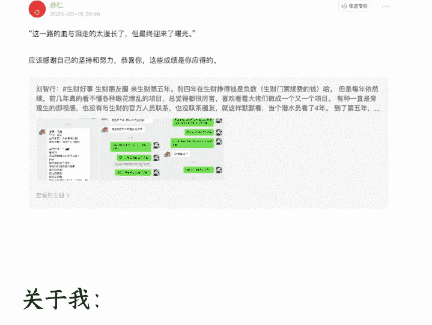

### 关于我：

生财五年级学生，前四年毫无作为默默在生财潜水，第五年开始爆发，找到自己的人生之路。

今年是我下班后沉迷副业的第 1 年，也是和公众号垂直小号死磕的 8 年。

从一个月薪 3600、毫无商业认知的三线小城普通职员，成长为单月副业收入破 10 万 +、手握 20 个垂直小号矩阵、实现“用副业重构人生”构建自己稳定的睡后收入的斜杠青年/创业者。

我在公众号垂直小号上硬扛了 8 年。阅读零阅读或者个位数阅读、变现受阻、AI 工具不会用的至暗时刻都遇过，但每次都咬牙闯过去。从项目一次次失败，到持续产出可复用的方法与结果。

今天想和大家从三个方向分享：作为一个普通人，我如何在“认知受限、打破、重构”的循环里，坚持不下牌桌，最终在垂直小号赛道撕开属于自己的口子。

- 1. 聊聊我自己
- 2. 取得的一些项目成绩、收获成长
- 3. 垂直小号心路历程（掏心掏肺版，哈哈哈）

如果你也有和我相似的经历，希望我的经历和经验能给你带去一些启发和帮助，那我们就开始吧～

## 一、自我介绍

### 每天朝九晚五，晚上刷抖音。起始月薪 3600，累死累活终于涨工资到 5000，依旧 0 存款

我目前在江西省赣州市，一个三线小城市，主业是在一家集团公司当个小职员。

2025 年之前，我就是个非常普通不能再普通的年轻人，每天上着班，过着朝九晚五的生活。白天在公司上班，晚上下班玩游戏，刷抖音到深夜两点。

第二天继续过着重复的生活，生活可以说毫无波澜一潭死水。

在 2024 年 7 月 24 日这一天，我非常清晰的记得这一天，这一天我在九江出差，在九江职业技术大学拍摄一门课程，当时可辛苦了，摄影设备特别重，需要搬提词器，三脚架，相机，稳定器等等。

那个时候又恰巧是夏天，非常热，一个人搬到拍摄地就已经累趴了，汗如雨下。又恰巧客户非常赶时间，所以就又得忙碌的进行工作，那时候我的心里状态，真的是累的跟条“狗”（没有看不起狗，只是形容一下这个状态）一样。

在拍摄过程中，我全程心不在焉，在思考自己的人生价值，我真的要为每个月 5000 元的收入，月底存不下 1 分钱，累成这样么，我真的要一辈子过这样的生活么？

这个问题，我在现场思考了很久，最终的答案是不要，我不要一辈子都过这样的日子，不能实现自己的人生价值，一辈子碌碌无为。

也就在当天，我给自己做了三个重大的决定，第一个决定是每天看一本书，第二个决定是每天看生财有术内容，第三个决定是每天记忆当天看的内容。

### 三个重大决定

每天看一本书。

于是在 2024.7.24 的当天我开始了看一本书，一开始完全看不完，能看 5 分之一就不错了，但是后面我纠正了自己的观念，为什么要看完一本书呢？你看一本书看到有一句话对你产生了重大的影响和收获，那么就够了呀。所以我每天就不执着每天看完一本书了，而是每天看一本，对里面的知识了解的就匆匆翻过，重点看不熟悉，能够让我产生行动的知识。

于是在 2024.7.24-2025.7.24 这一年的过程中，我看了大量的关于财富、认知、自由职业、创业类的书籍，我的认知和行动不断提高，为将来的我死磕一个项目打下了坚实的基础


### 阅读挑战

#### 阅读天数 · 已达标

已阅读 360 天

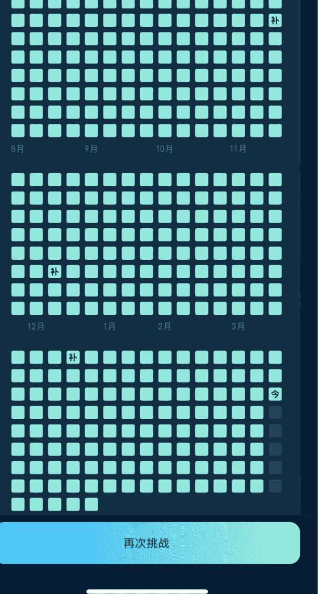

再次挑战

#### 21 天阅读挑战成功

你的挑战时间是 2025 年 7 月 12 日至 2025 年 8 月 1 日

本期共 1.9 万人参与挑战·最终 7822 人挑战成功

#### 挑战成功奖励

奖励已发放至账户

21 DAYS

勋章

#### 阅读天数·已达标

已阅读 21 天

#### 阅读时长·已达标

已阅读 93 小时 6 分钟

#### 21 天阅读挑战


### 每天看生财有术

2024.7.24 我给自己的死命令是每天看生财里面的内容，说实话刚开始看的很吃力，所以已经在生财很多年了，但是真的没有把生财运用起来，每次看到很好的帖子就会匆匆滑过，第二天就啥也忘记了。

但是我依旧每天看，渐渐的商业意识越来越浓厚，知道如何产出内容（抄爆款，爆过的还会爆），知道如何引流（留钩子），知道如何营销（把自己的训练营等推销出去），知道如何做交付等等，形成了一个微商业的闭环。

但还远远不够，我还是看完就忘，我还是一行动就卡住，也很迷茫不知道做啥项目。但是后来我解决了这个问题，我开始使用记忆软件，帮我记忆生财我看不懂的知识，觉得我做的项目，开始拆解精华帖的内容。

就这样一步步提高商业，精华帖的认知，也是为我将来的成长打下了非常深厚的基础。

### 各个历史人物传记橱窗卖书

请安互联网第一人，穿越抽象赛道清朝画质模仿 Ai 创始人
一个童心未眠的古代网友，

- 2022 年 - 行为艺术 - 请安祝福从来不打 pk
- 2023 年 - 礼物互动 - 跳舞唱歌从来不打 pk
- 2024 年礼物互动 - 明清接活打过几次 pk


36.6 万获赞 8 关注 9.5 万粉丝

请安互联网第一人，穿越抽象赛道清朝画质模仿 Ai 创始人

官方合作 IP: 江苏男·125 岁

商品橱窗
3 件好物
公开群
3 个群聊

+ 关注

作品 18

喜欢 184

义和团

五十五天

11 小时后复习

未到达复习时间
开启“提早复习”

置顶

### 使用这个橱窗卖货，创作伟人

Sora2 出各种“古人被职场 PUA”的 AI 采访视频，主题如“李白被老板画饼”“诸葛亮被甲方折磨”“韩愈被裁员后去送外卖”等。

执行逻辑:
先用 gpt 分析同类型的爆款文案 (关键词：职场共鸣、反讽、AI 采访、情绪点),筛选出 10 条以上高赞稿，提炼出共性脚本结构 (如 3 段式：设定→冲突→反讽输出)。把这些结构转成分镜脚本，直接输入 Sora2 生成视频 (AI 古人采访场景：一人正襟危坐、微光镜头、庄重语气),视频出完后剪辑上字幕就可

变现方式:
卖 Sora2 邀请码、做 AI 短剧课程教学、或收徒 (“教你用 Sora2 做爆款古人短剧”)。

账号数据预期:
低粉可爆。参考皮皮 AI,连续三条小红书爆款 (4k,1.1w,800 赞)
有需要的话我把提示词发出来 #风向标

公众号懒人搜索，懒人专属群分享

### 曾国藩：Ai+ 曾国藩

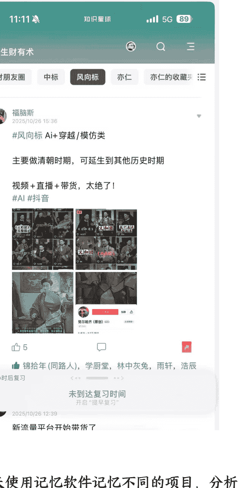

新流量平台开始带货了

每天使用记忆软件记忆不同的项目，分析其中的底层逻辑和思维，摘取最近的觉得很不错的风向标项目等。

每天记忆看的书籍和生财内容。

12/94

为了防止遗忘，我找到了一款软件名叫年轮 3(不是打广告哈) 这款软件根据艾宾浩斯记忆曲线进行对内容推送，防止你遗忘，比如你新的知识点 1 分钟，5 分钟，1 个星期，2 个月给你推送，让你终生不会遗忘。

就这样我坚持了将近一年，当时我就特别喜欢记忆亦仁老大的亦仁收藏夹里面的内容，里面都是亦仁进行大量思考和挑选的内容，对于当时的我来说非常有助于帮助我构建基础的商业和认知。

2025 年 10 月 1 日 → 至今

### 趋势

### 复习次数

30 日累计复习
2788 次

日均复习
92 次

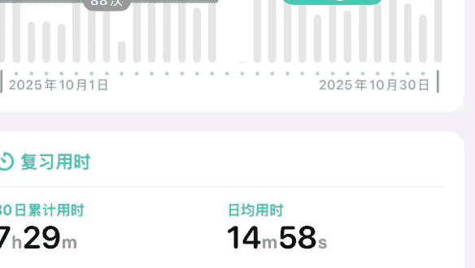

### 复习用时

30 日累计用时
7h29m

日均用时
14m58s

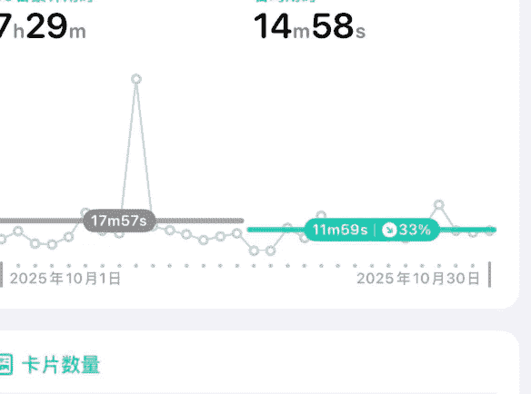

### 卡片数量

总计数量
2377 张

30 日累计新卡
258 张

日均新卡
8 张

### 今日

### 已复习

簡單說，我努力優化的不僅是工作，也包括家庭、...

5/14 艾宾浩斯记忆曲线 3 天后

爆款视频，卓别林幽默

[图片] Untitled

2/14 艾宾浩斯记忆曲线 4 小时后

每个人的产出能力不一样，那些把自己的能力当作...

13/14 艾宾浩斯记忆曲线 明年

爆款视频，人性成长

[图片] Untitled

2/14 艾宾浩斯记忆曲线 4 小时后

每个人的一言一行背后都有无形的认知、目的

千变万化的表象背后有不变的规律、趋势。

13/14 艾宾浩斯记忆曲线 明年

无标题

[图片] Untitled

3/14 艾宾浩斯记忆曲线 13 小时后

无标题

[图片] Untitled

3/14 艾宾浩斯记忆曲线 13 小时后

无标题

[图片] Untitled

3/14 艾宾浩斯记忆曲线 13 小时后

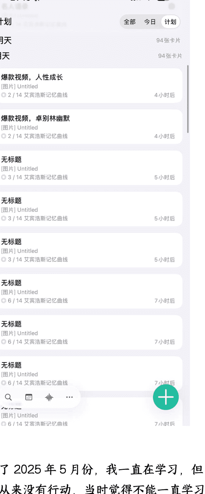

到了 2025 年 5 月份，我一直在学习，但是从来没有行动，当时觉得不能一直学习了，一定要死磕一个项目。于是选择了微信公众号。感觉前面的学习都是为了行动，认知提高上去了，那么行动自然就来了，收获也自然到来。

很出名的一句话，你挣不到认知以外的钱。从 5 月份开始我开始死磕微信公众号，从一开始的 0 浏览量，个位数浏览量，到两位数浏览量到十万加，百万加浏览量我走的太漫长了，真是血与泪的经验。但最终迎接到了曙光，为自己的努力加上了浓墨重彩的一笔。

20:57

刘智行

全部 图文 文章 视频号 服务

2024 年 12 月 21 日

成熟的标志少说话，说的话要有分量

阅读 32


2024 年 12 月 19 日

每天用的东西，一定要最好！我是如何通过改善日常用品提升幸福感的？

阅读 39


2024 年 12 月 18 日

每天思考四个问题，开启一天的打怪成长之旅！

阅读 30


2024 年 12 月 17 日

情绪价值：让你的每一天都充满色彩

阅读 24 赞 1


2024 年 12 月 16 日

很有成长的一天，发现自己一个缺点

阅读 21 赞 1


2024 年 12 月 15 日

出众才有朋友，有钱才有亲戚


## 刘智行

全部 图文 文章 视频号 服务

4 月 7 日

小米 15 年：从平凡到千亿，雷军和曾国藩的
惊人相似

阅读 646 赞 15

4 月 6 日

赚钱就是最快的成长方式

阅读 250 赞 3

4 月 5 日

你完全可以用一年时间去变强

阅读 571 赞 19

4 月 4 日

一定要大量读书：书读多了，人真的会变

阅读 423 赞 8

4 月 3 日

一定要有自己的生意，哪怕再小

阅读 394 赞 7

4 月 2 日


回顾过往，在 2021 年 4 月 18 日我进入了生财，写了第一份作业，想挣到第壹块钱，给自己许下的超级大的梦想就是年入 30 万，存款 15 万。

刘智行
2021/4/18 22:14 江西

作业 4 月 18 日新加入的新圈友。

相对自己未来的一年说，年入 30 万，存款 15 万。

我只是一个从农村出来的普通人，在三线城市生活，这边年入 30 万已经很高了，虽然比不上生财有术 90% 的财友，但也是自己的一个小小愿望。

新的一年加油！

查看作业题目

然后我就去找 10 万 + 的文章标题去写内容，不断去试探，去成长，终于找到了属于自己的赛道。

这一路的血与泪走的太漫长了，但最终迎来了曙光。

这一个月来每天跟各种品牌洽谈合作，宝马，飞猪、
银行等。

比如，今天下午就谈成了一个飞猪的公众号推文，价值 42575 元。这是我谈成的第五个广告推文，大号只跟大品牌合作。

谁能想到，10 月份我的广告互选单条已经达成了 10 万。

在生财总是有无限可能，关键是你你要下手实操，听话照做，从 0 到 1 走通，然后从 1 到 10，最后成为他人眼中的大佬。

最后，碎碎念，就当抒发一下情感，感谢圈友的观看和点赞。🙏🙏


#生财好事 一起讨论

等你评论，等你“一鸣惊人”

当然对于生财的圈友来说不是很简单么，但是对于当时的我来说却难如登天，我当年的年收入不足 5 万，我依稀记得当时我的工资是 3600 元一个月，一年的话是 43200 元，到了 24 年我的工资一个月也才 5000，一年收入 60000 元。而且没双休，但是单休，请个假还不好意思，提心吊胆的，担心把你开除，所以除去房租，吃喝，基本一年存不了多少，也活的非常累。

相信圈友的条件和能力绝对会比我好上太多，可能你会问我为什么那么低，因为三线小城市，物价和工资就那么低，而且当时我也没有啥实力，认知也不高，所以也只能找那么一份低薪的工作。

但是这个情况，让我进入生财后看到了很大的不一样，我依稀记得我第一次进入生财看到那些精华帖的时候，说不出的震撼，说不出的降维打击。因为他们写的我都看不懂，比如流量、商业模式、项目、管理、营销、交付、需求、底层逻辑等等。我感觉我来到了另一个世界，这个充满赚钱的世界令人着迷却又迷茫。

### 说说我在生财的心路历程:

第一年我根本不理解里面精华帖的商业逻辑，根本不懂流量的底层逻辑，导致我第一年只觉得各位大佬非常厉害，但是自己手足无措，无从下手。第二年，稍微有了那么一点点商业意识，但是仅仅只有一点点，而且也没行动，所以也没啥很大的收获。

第三年，觉得要动作干点啥了，但是不知道干啥，所以又蹉跎了一年。第四年，参加了各种航海，开始逐渐有了商业的眉头，但是每次航海都以失败告终，7 月份开始不断看精华帖，看生财内容。到了第五年，不行了，我要崛起了，我要努力了，不能这样了，我一定要把门票钱挣回来，于是我开始死磕一个我放弃了很多次的项目，最终我成功了一点点。最后我发现赚钱其实就是最好的成长，人的注意力 90% 都应该专注在赚钱这件事情上。

至少在 5 年后的今天，我通过副业，我实现了 2021 年 4 月 18 日说过的话。为什么要写这篇文章呢，因为我有现在的收获都离不开生财，离不开生财的圈友们，但是有很多人又跟我一样。从一开始的迷茫，潜水，观望到了最后的死磕拿到了结果。

但是很多人在中间放弃了，我想告诉大家的是，不下牌桌就一定会有机会，当你享受了成功的滋味和喜悦，你就会沉浸着迷在其中，能够让你极大的感受到互联网的魅力。

希望你看完之后也可以跟我一样。充满信心，挖掘宝藏，死磕自己专注在赚钱这件事情上。

## 二、取得的项目成绩

行动起来，项目收入成绩:


### 佣金

#### 带货佣金账户

¥0 余额

¥17707.3 已提现 | ¥59.9 提现中 >

提现

动账明细

带货订单

待结算总额

¥796.01

订单详情

零钱包打款记录

昨天 13:01

#### 腾讯广告互选平台助手

#### 结算成功提醒

结算金额： 42,575.00

结算时间：2025 年 9 月 13 日

结算编号：(TOSS-ST-SDay-9-2509142335)

已发起付款，请留意银行到账

昨天 13:25

公众号懒人搜索，懒人专属群分享

### 21 天早起读书营

用早起读书改变人生重构人生成长系统

## 刘智行

- 青年作家
- 刘智行品牌创始人
- 14 年持续阅读成长者已读 1500+ 书籍
- 多家出版社合作的读书博主

### 你会收获

- 养成每天阅读习惯，自我提升
- 重构人生成长系统，实现人生复利
- 拥有良好生活作息，精力充沛
- 持续阅读改变人生，实现逆袭

### 适合人群

- 01 想要通过阅读改变人生的人
- 02 渴望成为终身学习者，实现人生复利
- 03 立志成为一名斜杆青年的人


### 如何报名:

第一步：右扫码添加微信，回复 [读书]

第二步：读书教练，邀请您入群

原价：399 元限招 100 人限时 5 折特价：199 元

公众号懒人搜索，懒人专属群分享

23:32

月账单

年账单

2025 年 5 月

支出

收入

其他

共收入 17 笔，合计

¥7102.15

使用记账本，查看分类统计 (餐饮、交通等)

### 收入对比


### 收入排行榜

- 1. 转账 ¥6881.00
- 2. 退款 ¥153.56

26 / 94

公众号懒人搜索，懒人专属群分享

20:44

< 返回

### 流量主

广告管理

昨日收入 (元) ?

明细 >

424.83

-5.94%

日环比

-20.12%

周同比

13,739.89

本月收入 (元)

### 指标趋势

数据明细 >

日期范围

近 7 日

近 30 日

自定义

广告位

全部

底部

文中

后帖

中帖

互选

返佣

数据指标

收入

曝光量

点击量

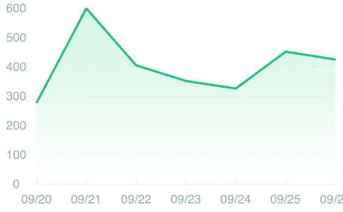

### 文章收入 ?

日期范围

昨日

近 7 日

近 30 天

文章/日期 =|

累计收入 (元) =|

27 / 94

### 账户明细

| 日期 | 收入 (元) |
| --- | --- |
| 2025-09-26 | 424.83 |
| 2025-09-25 | 451.68 |
| 2025-09-24 | 325.82 |
| 2025-09-23 | 351.63 |
| 2025-09-22 | 404.90 |
| 2025-09-21 | 599.38 |
| 2025-09-20 | 276.74 |
| 2025-09-19 | 531.81 |
| 2025-09-18 | 626.95 |
| 2025-09-17 | 675.16 |

## 数据统计

| 日期 | 阅读 | 分享 | 收益 |
| --- | --- | --- | --- |
| 2025/09/06 | 314,252 | 5,602 | 1,164 |
| 2025/09/05 | 497,473 | 9,058 | 1,342 |
| 2025/09/04 | 652,206 | 9,761 | 1,712 |
| 2025/09/03 | 345,536 | 6,099 | 942 |
| 2025/09/02 | 292,737 | 5,051 | 977 |
| 2025/09/01 | 460,868 | 4,927 | 1,012 |
| 2025/08/31 | 311,030 | 5,832 | 1,211 |
| 2025/08/30 | 390,788 | 8,196 | 1,527 |
| 2025/08/29 | 436,439 | 7,844 | 1,541 |
| 2025/08/28 | 359,981 | 4,931 | 870 |
| 2025/08/27 | 147,661 | 3,665 | 735 |
| 2025/08/26 | 181,825 | 4,477 | 963 |
| 2025/08/25 | 167,992 | 3,849 | 723 |
| 2025/08/24 | 105,179 | 2,880 | 565 |
| 2025/08/23 | 385,240 | 11,968 | 1,796 |
| 2025/08/22 | 475,464 | 11,751 | 2,124 |
| 2025/08/21 | 243,719 | 5,608 | 1,176 |
| 2025/08/20 | 340,063 | 6,442 | 1,380 |

星期二 13:55


明天晚上我们腾讯会议哈 1 个小时 给你讲清楚这个项目的底层逻辑和方法论 然后我在实操一遍 帮你解决各种问题

星期二 14:30

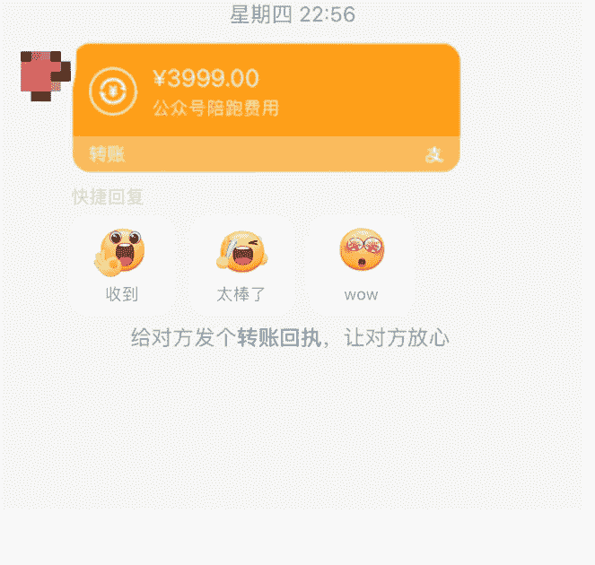

收入成绩主要是流量主收益、橱窗卖货收益、训练营收益、卖课程收益、个人咨询、公众号陪跑这几块收入。以上所有收入目前都是一个号的哈，流量主收入 50658.08+ 橱窗卖货收入 18503.31 元 + 广告收入 42575 元 + 读书营训练营举办了两期收了 315 位学员 62685 元 + 个人咨询费用 7102.15 元 + 公众号陪跑项目 15 个学员 59985 元 = 241579.74 元。这些都是 9 月份的截图哈，而且都是一个号的收入。

其它 19 个号的收入没那么高，但是这 1 个号 + 剩余的 19 个号收入全部加起来已经超过了 30 万 + 了哈。亦仁老大说过，默认项目都是通的，默认数据都是假的。如果有人分享了一个赚钱项目和收入数据截图，请按上面的原则来判断。对项目乐观，可以让自己去了解细节。对收入数据悲观，可以让自己谨慎投入。

可以不看收入，只看这个项目的可复制性和可操作性是否有很大的收益空间。至少我带了赣州本地的一些圈友，他们目前通过这个项目已经月入 1 万 +，充分证明底层逻辑和方法论是没问题的。

## 参加官方活动，垂直小号内测成绩：

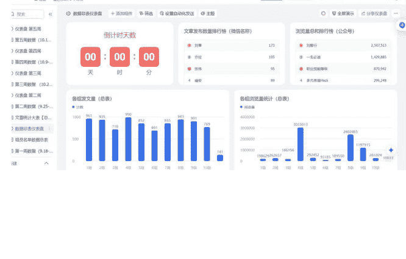

## 商业垂直小号内测大群 (395)

生财 - 小武：第 5 周 (10.16-10.22) 的数据更新已经来了！大...

> “航行之王”: 必须特别提一下本期最“肝”的伙伴，@刘智行最终累计发布 209 篇，阅读量 250 万+; 同时也和大家同步下我们本次阅读量前 10 的名单，会一同来瓜分 1 颗龙珠。

- 刘智行
- 杨磊
- 明白 (晚 9 点半睡觉)
- 贝拉
- 启四
- 亦小亮
- 华姐
- 七七
- xyc
- 苏晚不晚


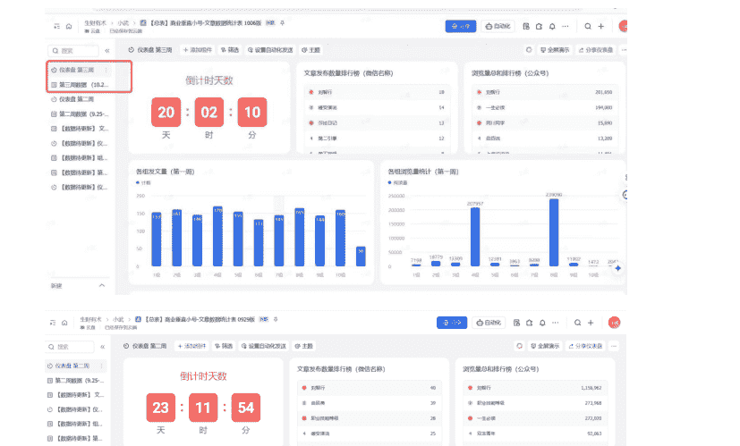

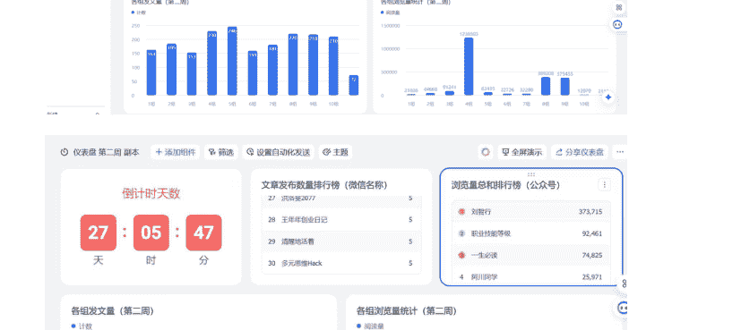

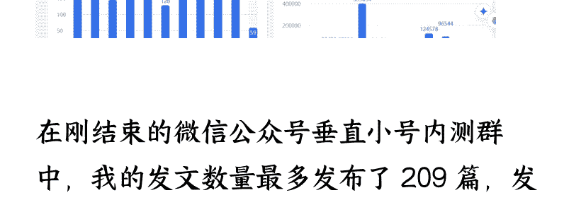

在刚结束的微信公众号垂直小号内测群中，我的发文数量最多发布了 209 篇，发文篇数和浏览量收获了第一名。目前这 40 天单号已经发了 200 多篇文章，收获了近 260 万的浏览量，引流私域近万，单号财富收入破万 +。

如果加上其它 19 个号的话，发布了 2898 篇文章，浏览量和财富收获进一步扩大。

在此特别感谢我们的七天老师，她很耐心和细心的帮助我们分析我们的公众号，力所能及的给我们提供她能够帮助的地方。特别是给我的公众号进行了诊断，发现我的书籍有点不垂直，所以我优先拿小号进行改革，数据明显会比之前好很多。

还有特别感谢垂直小号的内测群的官方人员小武老师和幸运煎饼等太负责啦，为你们点赞。还有圈友大神们，你们的分享让我受益匪浅，也让我认识了非常多的大神，这 40 天左右，让我成长了非常多。

一定要积极参加官方组织的活动，积极的向组织靠拢，你会收到意想不到的收获。之前我从不参加的，但是自从参加了之后，认识到了非常多志同道合的伙伴，收获了人生的一个又一个里程碑事件。

## 走出去，见圈友，生活交友成绩：

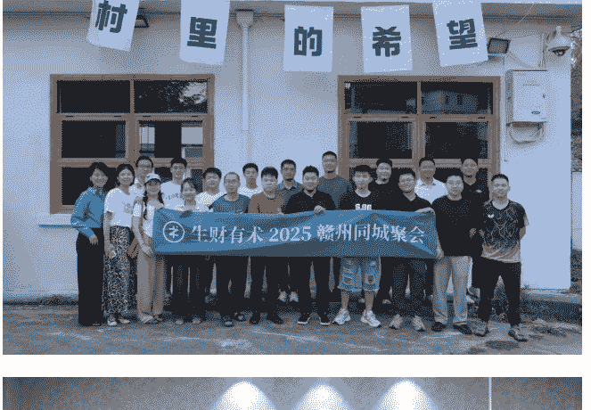

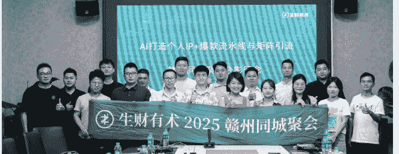

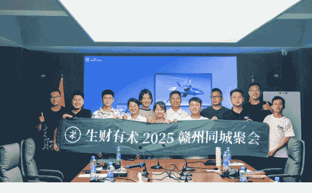


我觉得这个我也要说一说，因为生财，因为项目，因为价值观，我认识到了非常多优秀的圈友。并且这些圈友也参加了我的婚礼，成为了我生命中不可或缺的朋友。现在我与好几位圈友都在筹办不同的项目。可以看到这些都是我在 2025 年开始蜕变做的事情，要敢于走出去，就能收获不一样的精彩和人生。

每次组织圈友聚会都能收获非常大，在生活中我有项目要谈判，圈友立马就帮忙，比如在 10 月份谈一个代运营的项目，航海家蓝狐二话不说就进行了帮助，让我大受感动，还有圈友惠惠当时也一同前往谈判洽谈。

这个我也发了一个生财好事，这个可以看一下这个帖子，虽然最终这个项目没谈成，但是圈友的情谊真的在心中，只有圈友和你身边的好友才会这样无偿的陪你去谈判，为你撑场子。

补上当时的生财好事:
https://t.zsxq.com/uFfmH

公众号懒人搜索，懒人专属群分享

21:56

商业垂直小号内测大群 (395)

生财 - 小武：虽然我们本次的活动结束啦，但大家可以接着更...

10 月 7 日 19:29

大家好，我是刘智行，在刚开始分享之前，我想说一下今天发生在我身边的垂直小号好事。今天有本地公司客户通过我的公众号，联系上了我，他们有全平台代运营的需求，希望我能够帮他们公司把各平台账号运营起来。

上午发的消息，我和另一位圈友同时也是航海家蓝狐@2 组一蓝狐一同前往了公司，经过初步谈判，已经取得了初步的进展，初步年代运营费用是 50 万左右。目前正在写代运营方案当中。

虽然还没正式签合同，但是这是真正的实实在在的通过写垂直小号获得的精准客户和合作对象之一。圈友蓝狐@2 组一蓝狐 同时也是见证者。感谢一同前往谈判洽谈。


#生财好事 垂直小号的魅力是只要你去加上人设，每天日更，你去...

来自「生财有术」刘智行的主题

知识星球

“生财有术志愿者 Mazc”拍了拍"刘智行"

生财有术志愿者 Mazc

祝贺!!!

## 刘智行

2025/10/7 10:06 江西

#生财好事 垂直小号的魅力是只要你去加上人设，每天日更，你去写就一定会有大单在等待你。

刚有个很大的公司通过垂直小号加我，然后想把公司的自媒体运营交由我来做，公司是有这个需求，接下来就是制定运营方案和落地。


#生财好事 一起讨论

分享赚 ¥673


邓瑜，小萤，小布，wendalyn, 小马哥，坤汀，晓茵，月白流苏，夜，安迪 等 50 人觉得很赞

写下你的想法...

在赣州的圈友，我们经常互帮互助，项目遇到卡点了我们相互这帮寸解决，基本每两周会去圈友家聚，干饭，赣州的圈友真是太棒了。所以大家一定要多线下聚会，认识越来越多优秀的圈友，让自己的生活质量稳步提高，有一群志同道合的朋友真是太棒啦~

# 升认知，见大咖，9 月参加航海家 AI 大会:

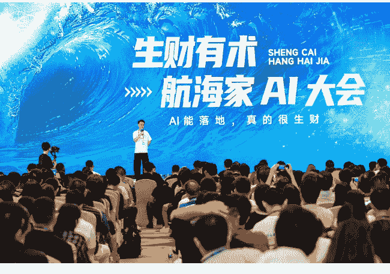

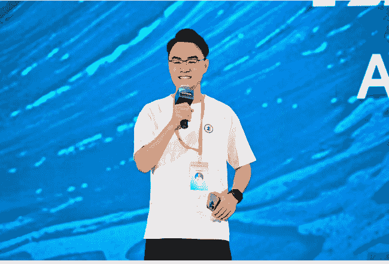

## 生财有术 SHENG CAI HANG HAI JIA 航海家 AI 大会

## AI 能落地，真的很生财

## 刘智行

## 恭喜您，报名成功

## 深圳 / 9.20-21 生财有术航海家免费参加


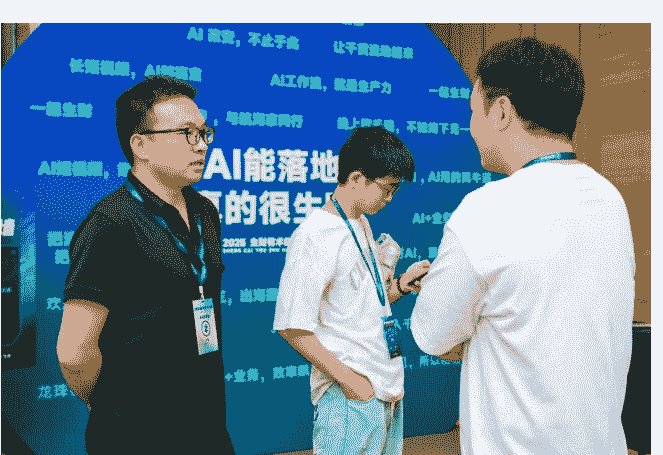

我为什么要把这个放入我的项目成绩呢，因为不断的在生财提高了认知，不断的接触了优秀的圈友，所以充分认识到链接大佬和倾听大佬说话是一种享受。因为它的某一句话就可能改变了你的一生。

航海家 AI 大会对我来说就是如此，在台下我听着嘉宾分享 AI 知识，听他们讲如何使用 AI 的，包括 AI 出海，AI 内容创作等。

这其中王朋友的一句话让我印象非常深刻，大意是拆解爆款，形成自己的爆款，产生无数的爆款。

整场下来，我对这个是印象最深的，因为我联想到了我的微信公众号垂直小号的批量操作方法，跟王朋友的方法如出一辙，异曲同工之妙。

也因为这次坚定了我一定要加入航海家，多跟超级大佬接触，也因为这的冲击给我自己的目标是一定要写一篇精华帖出来，不能甘当无名圈友，一定要真诚、利他。

在这里也再一感谢生财组织的航海家大会，感谢航海家蓝狐给我的一次机会，再一次打开了我的互联网认知，充分感受到了 AI 的无限魅力。

## 三、垂直小号心路历程

写了 7 年的公众号，断断续续写了 200 多篇文章，阅读人数徘徊在一位数和两位数之间，粉丝三位数都没有，也许我真的不适合做这个项目。

接下来我说一说我做垂直小号的心路历程，其实我做垂直小号是在 2017 年我还在大学的时候，那时候我就认识到了微信公众号有无限的商机，然后当时是不间断更新文章，有时候一周，有时候三天时间，断断续续，那时候将近每天写文章需要 5 个小时的时间，写稿，排版，原创等，但是一发布只有个位数和两位数的人看。

当时，我对自己充满了怀疑，认为自己的文章质量不行，认为自己的文笔不行，别人都可以成功，我就不行，有可能我压根就不适合这个赛道。

这样的想法有无数次的产生，并且时间跨度很长，我的文章一直徘徊在个位数和两位数之间观看，并且时常断更，偶尔复更，粉丝数量当时也一直在 2 位数和 3 位数之间徘徊，都突破不了三位数，但是在当时却又无能为力。为了这个事情我整整焦虑了 7 年，并且没有一丝改变，每次写文章也依旧跟之前的模式一样，发出去依旧个位数人看。

## 刘智行

2023 年 3 月 29 日

## 28 岁决定裸辞，我终于“悟”了这三条裸辞真谛！

阅读 61 赞 1


2023 年 3 月 28 日

## 混职场 10 年，我见过太多人掉进这 5 个大坑

阅读 50 赞 2


2023 年 2 月 21 日

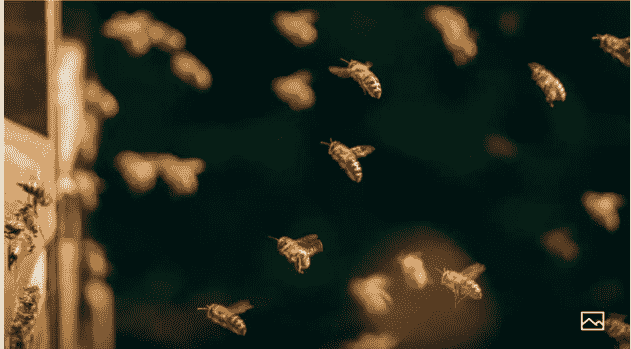

## 大家好，我是智行。

...

阅读 56

2022 年 2 月 22 日

## 不联系=没关系 | 我们就是这样走散的。

阅读 94 赞 3


## 刘智行

全部 图文 文章 视频号 服务

2023 年 11 月 24 日

## 阅读、摄影与生活

阅读 48 赞 4


2023 年 11 月 23 日

## 我与父亲：肩膀、力量与爱的较量

阅读 109 赞 9


2023 年 3 月 29 日

## 28 岁决定裸辞，我终于“悟”了这三条裸辞真谛！

阅读 61 赞 1


2023 年 3 月 28 日

## 混职场 10 年，我见过太多人掉进这 5 个大坑

阅读 50 赞 2


2023 年 2 月 21 日


## 刘智行

2024 年 10 月 3 日

## 从《向上生长》中学到的生活智慧

阅读 25 赞 1


2024 年 10 月 1 日

## 今天，我决定活的不一样

阅读 20 赞 1


2024 年 9 月 30 日

## 从老好人到职场高手：智行的自我救赎

阅读 18 赞 3


2024 年 9 月 28 日


### 分享图片

阅读 27 赞 2

震惊！这本书让我的阅读效率翻倍，秘密竟然是……

阅读 23


告别拖延！智行教你如何 5 分钟出门上班

阅读 34


你还在为高效工作沾沾自喜吗？小心职场的隐形规则

阅读 85 赞 2


专业的力量：我是如何在自己的领域成为专家的

阅读 58 赞 1


《学习的学问》：如何通过学习提升自我价值？

阅读 29 赞 1


现在回过头来，给我的经验是一定不要原创，选择爆过的标题，自己来写内容，这样才能产生巨大的流量和收益。

## 满怀信心参加公众号航海，思想上的巨人，行动上的矮子，我偷懒了，也许我就该一事无成

24 年我开始重新行动，开始加入公众号航海。公众号又重新进入了我的视野，刚看到这个航海的时候，我内心就在想，要不要放弃呢，我做了那么久一直都没成功，一块钱都没挣钱，参加又有什么意义呢。

但是，这个项目一直是我心目中的一个结，另一个声音告诉我，参加吧，参加一定有无限可能，说不定有很大的惊喜。于是我报名，参加了，花了 199 元押金。

在实操的过程中，我说实话，不理解航海手册的内容，就像字每个都认识，但是知识它流入了我的大脑又流出去了，我认识到这个很重要，但是我学不透。

而且每天要花费很多时间，所以我还是沿用之前的老方法，还是写 3 到 5 个小时原创文章，然后依旧各位数看，内心依旧焦虑。

然后又因为工作的原因，白天工作很累，晚上一想到还要做这个，就不太情愿，于是我就一直水日志，好了，结果不会欺骗人，航海结束，我依然没挣到一分钱。

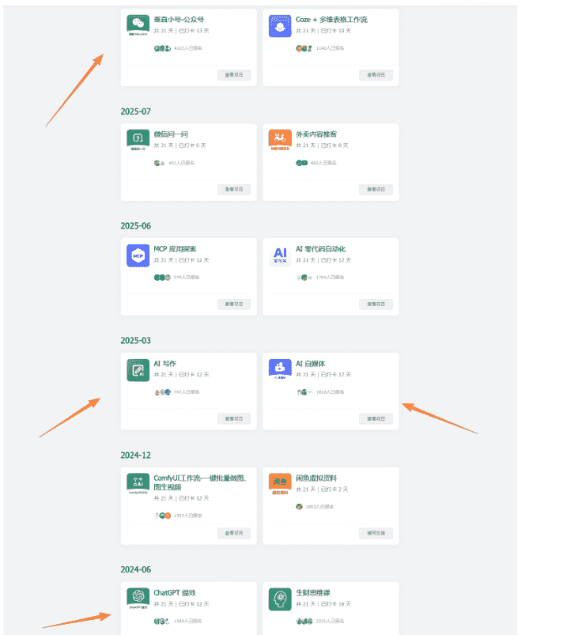

结束后，我又在想，为什么我挣不到钱，是因为自己的行动力不足，是自己的懒惰么，是的。也许我就该一事无成。

不能再拖了，谈了女朋友快结婚了，彩礼 30 多万，我该怎么办，也许重新出发是最好的选择，但是我又失败了。

到了 24 年底，因为谈了个女朋友，要准备结婚了，彩礼 30 多万，对于我来说无疑是一笔巨款，因为要花非常多钱，所以我就又想到了这个公众号副业项目。

这次是下定了决心，因为如果不成功，女朋友跟别人跑了，自己就啥也没有了。

所以，从 24 年 10 月份开始，我开始看生财的精华帖，把生财的公众号的精华帖全部看完了，真的全部看完了，看了我整整一个月，一篇文章吸收，拆解，真是太困难了。

每篇都超级长，而且有很多不理解，经常看到一半就看不下去了，我相信很多圈友也跟我一样，能看完我这篇文章的也是屈指可数。但是还是得耐着性子看完呀，毕竟要挣钱，解决人生大事呢。对吧。

于是我继续拆解，继续吸收，继续的为自己补充能量，想着总结自己的一套公众号方法论，但是我还是停留在理论的层面，虽然总结了方法论，但是没有去实践，另一个也是因为被很多事情干扰，所以折腾了两三个月，我还是没有挣到第一块钱。

对我而言这次我又失败了。

> 人生的转折点，我运用精华帖的知识，使用了一条别人的 10 万 + 的标题，突然有了第一个 1w+ 文章内容，我欣喜若狂，感觉自己掌握了项目的流量密码。

虽然失败的次数很多，但是我还是继续坚持了下来。转机发生在 25 年 2 月份，在某一天，我想起精华帖大佬说过的一句话，说标题是核心，而且大于内容，最好的方法是直接抄 10 万 + 的标题。于是我运用精华帖的知识，抄了一条别人十万 + 的标题，这篇内容我火了，有了人生的第一个 1 万 + 阅读量。如下图片：


## 赚钱最该学的东西，根本没人教

原创 | Fin J.Si 2025 年 02 月 22 日 21:00 江西 351 人 ☆ 星标

点击“蓝字”关注我吧！

你好呀，我是刘智行。

这周我阅读了《财富自由从 0 到 1:可复制的多渠道财富增长》阿汝娜、周剑铨这本书。


“祝您好运、健康、发财！🙏🙏”

喜欢作者

个人观点，仅供参考 阅读 1.0 万

最左边别人写的十万加的标题，右边我摘抄别人十万加的标题，自己写的内容获得了 1 万加的浏览量。

这篇文章浏览量最终在 1 万加，但是这篇文章可以说改变了我小小的命运。因为它第一次深刻的让我认识到，爆款标题的重要性，同样的内容，不同的标题浏览量和收益天差地别，这一次突破了我对互联网的认知。

这一次对我的冲击不亚于核弹，让我的内心久久不能平息，让我虎躯一震。它让我意识到，只要抓住了互联网的一个杠杆，就能撬动整个商业帝国（当时小小的震撼，所以形容的有点夸张）。

这次带给我的正反馈无以复加，后面我就采取只取 10 万加的标题，内容自己写，自己打造属于自己的内容王国，通过不断优化提示词，生成了无数的爆款文章。

我不断试探，不断写，虽然掌握了 10 万加标题的流量密码，但是内容写起来太费时间了，常常写 3 个小时才能出来一篇文章，虽然刚经历喜悦，但是又陷入低效率的痛苦当中。

因为有一条 1 万加的内容产生，于是我开始使用 10 万加的标题进行写作，为了排除是不是标题的问题，我也使用自己让 AI 写的标题进行 A/B 测试。

## 刘智行

全部 图文 文章 视频号 服务

- 3 月 4 日
  - 一定要大量看书：过目不忘的读书法
  - 阅读 5073 赞 40
  - 
- 3 月 3 日
  - 29 岁，每年坚持读 100 本书，聊聊我的读书方法
  - 阅读 490 赞 5
  - 
- 2 月 27 日
  - 用 DeepSeek 一天读 100 本书！这个指令请低调使用
  - 阅读 4.1 万 赞 518
  - 
- 2 月 25 日
  - 一定要大量读书:25 岁以后开始觉醒，感谢自己读过这 10 本书，向上生长，什么时候...
  - 阅读 469 赞 12
  - 
- 2 月 22 日
  - 赚钱最该学的东西，根本没人教
  - 阅读 1.0 万 赞 81
  - 
- 2 月 21 日
  - 月薪 3 千到存款百万：我靠这套“器官系统”
  - 

通过测试，我发现我只要用 10 万加的标题，我的文章浏览量就远超我前 7 年写的文章，再一次感觉被自己发现了流量密码，但是我虽然用的是 10 万加的标题，但是内容还得自己写，内容经常写 3 个多小时，效率极其低下。

因为我又要上班，只有下班的时候才能写公众号，每天晚上 6 点下班，吃完饭玩下手机就到 7 点钟了，写一篇 3 小时，改一下就到 11 点了，太累了，效率又低又累又痛苦。

所以可以看到我上面的图片，经常断更偶尔不更，三四天四五天更新一次。

运用精华帖的知识，找到了枫晓陌圈友的提示词，对文章进行二创模仿，让我的写作效率提高，第一篇十万加产生了，看到十万加文章产生的那一刻，我发了朋友圈，告诉我最好的朋友，对我来说开启了人生的新篇章。

公众号懒人搜索，懒人专属群分享

22:38 刘智行

全部 图文 文章 视频号 服务

- 3 月 6 日
  - Manus:超越 DeepSeek 的科技黑马！错过 Manus，你将错失未来十年最大的财富风口！
  - 阅读 2195 赞 26
  - 
- 3 月 6 日
  - #两会热聊 DeepSeek!25 年，不会用 DeepSeek 的职场新人起薪低 23%!
  - 阅读 257 赞 4
  - 
- 3 月 5 日
  - 雷军两会提案曝光！绝！他的读书方法，居然和曾国藩的一模一样
  - 阅读 10 万 + 赞 2205 2 个朋友读过
  - 
- 3 月 4 日
  - 一定要大量看书：过目不忘的读书法
  - 阅读 5073 赞 40
  - 
- 3 月 3 日
  - 29 岁，每年坚持读 100 本书，聊聊我的读书方法
  - 阅读 490 赞 5
  - 
- 2 月 27 日
  - 用 DeepSeek 一天读 100 本书！这个指令请低调使用
  - 

## 详情

刘春

人生中写的第一个 10 万 +

我也是拥有全网粉...的 up 主了🤔🤔

未来请多指教


2025 年 3 月 6 日 19:04


高鑫：厉害

赣州出租 - 海中龙：🐉👍👍👍👍

由于自己写文章内容太累了，所以我又重新钻入精华帖当中，找到枫晓陌圈友的提示词（提示词我会放到最尾），利用他的提示词，二创一篇爆文，就是在左图的雷军的爆文，当时雷军非常火，所以我直接选取了这篇文章。

没想到我人生中的第一篇十万加产生了，此次对我来说意义重大，所以我现在都把这篇置顶在我 20 个矩阵号，其中一个号中。但是对于现在的我来说一点波澜都没有，因为我写了 500 多篇 10 万加的文章了。但是第一篇十万加的喜悦，现在还历历在目。

## 人生中挣到了第一个副业 1882.13 元，犹豫要不要分享给同事，分享之后，如果他们挣不到钱，会不会怪我

当我第一篇十万加产生的时候，我开通了流量主，月底，我看流量主收益在 1882.13 元，这是我人生中的第一个副业收入，虽然不多，但是完全打开了我的互联网思维，原来写公众号真的是可以挣到钱的。

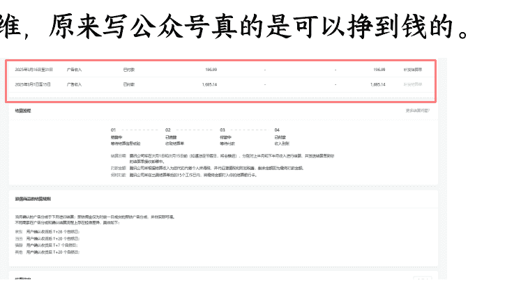

那时候非常喜悦，所以就忍不住跟同事说，以后我要带你们挣钱了。但是他们都说你不相信我，他说你现在的工资都不富裕，怎么带我们挣钱？

我没说话，我心里默默想，我副业已经挣到了我的 1882.13 元，我工资的 3 分之一了，我下个月一定更高。思想斗争了很久，都说要闷声发大财，财不外露，如果他们举报我做副业我该怎办？如果告诉他们方法论，他们挣不到钱，怪我，我该怎么办？

但是我跟同事关系都很好，所以我还是忍不住告诉了他们。他们听完也大为震惊，他们不相信我居然真的在副业上挣到了钱，而且把收入都给他们看了，他们从开始的怀疑到相信，到坚信，只用了几天的时间。

我开始带同事挣钱了，但是他们第一个月没挣到钱，还很气馁，说为什么我能挣到钱？到了月底，我的账号被别人举报了，违规了，我的天塌了。

我开始带同事挣钱了，第一个月我让他们开通一个微信公众号，开通流量主，赚钱，但是那时候我的方法论也不成熟。我只知道二创别人的，使用别人的爆款标题，爆款内容。

他们吭哧吭哧干了一个月，到了月底，一分钱都没有收入，开始很不开心，觉得我藏着掖着，开始对我冷嘲热讽，说，刘智行，你是不是藏着私货，为什么你挣到钱了，我们都没挣到。

我说，我的方法论就是这样的，是不是你们自己的问题，他们不听，觉得是我的运气好，于是他们放弃了，但是我还在坚持，到了月底，我发现我的账号违规了，我天塌了。

连续收到两条违规记录，而且是被人举报的，那时候也不懂，封了我的原创功能，以为整个账号就废了，于是那段时间很颓废，觉得自己好不容易做起来的账号难道又要归零了么？于是我又开始断更了。

再接再厉，不放弃，优化方法论，写出独属于个人 IP 的提示词，又重新迎来了曙光，享受到了挣钱的快感，开始思考工作的意义，要不要自由职业。

经过上个月的账号违规记录，开始反思问题，发现是提示词的问题，第一段提示词模仿的太像了，不管是小标题还是内容，都非常的相似，虽然文字是不一样了，但是整体内容一看就是二创洗稿而来的。

于是，在第一段提示词枫晓陌圈友的提示词后，我自己在写了一段个人的人设提示词，加入了我的个人 IP，我是生活在江西赣州的一位摄影师，每天看一本书，有个女朋友等。

于是，我发现这次的文章跟之前二创的很大的不一样，开始没有人举报成功了，而且我的独特的 IP 风格受到了非常多的网友喜爱，10 万加文章也越来越多。有时候连续三四天都是 10 万加的标题。

然后我又发现，很多对标账号，居然有橱窗卖书，于是我也在文章中橱窗卖货，于是，我就有了两份收入，一份是流量主，一份是橱窗卖货，有时候一篇 10 万加的文章，流量主和橱窗带货的收入就能挣到 5000。

这就是我一个月的工资，我大为震惊，开始思考我为什么要工作？我只需要花 3 分钟就能挣到 5000，那我的工作意义何在，我累生累死，一个月才 5000，而我现在 3 分钟就能挣到 5000。做个自由职业多好，不用被管理，而且挣钱也很轻松，掌握了方法论 + 强大的执行力，一定可以挣到很多钱。

但是经过了两三个月的思考斗争，还是继续留在公司上班。

- 5 月 1 日
  - 《道德经》：带你过情关
  - 阅读 6.8 万 赞 878
  - 
- 4 月 30 日
  - 《穷爸爸富爸爸》：如果到 35 岁还负债，首先要做的不是拼命赚钱、或存钱、找个...
  - 阅读 10 万 + 赞 1216
  - 
- 4 月 29 日
  - 《资治通鉴》：当你饿的时候，有人把馒头分给你一半，这是友情；有人把馒头让你...
  - 阅读 10 万 + 赞 166
  - 
- 4 月 28 日
  - 《天道》：发现了吗？普通人是很难财务自由的，因为普通人在存到第一个 20 万的时...
  - 阅读 10 万 + 赞 464
  - 
- 4 月 27 日
  - 资治通鉴：永远不要害怕任何人，哪怕他对你的生命和事业构成了实质性威胁，一旦...
  - 阅读 6.1 万 赞 499
  - 

一个账号完全跑通，开始矩阵放大，开始做 20 个账号，每天产出 100 篇文章，建立了自己的内容帝国，收益不断扩大。

这是我的公众号，我每天再写。但是一个号太少了，所以想把你的号也打造跟我一样，用自媒体挣点小钱。

这个的话，是利用文章里面的广告和文章最末尾卖书挣点小钱。

如果爱卿的微信公众号闲置的话，可以给我运营。

酒店我都住一个星期了

可以啊

我正愁没号

放心哈 绝对不做违法犯罪的事情

爱卿请放心 咱不是那种人 哈哈

我放心

就是说如果我挣了 1000 元分爱卿 100 哈。

公众号懒人搜索、懒人专属群分享

> 天有没有空呀？
🐱帮我注册个公众号？
我来运营。到时候收入分你 10% 哈。刘春山老哥的号，也在我手上了。
嗯嗯，没问题，注册能保护个人隐私吗，我并不想被朋友知道是我的公众号
肯定可以哈
我和老哥的号基本没人知道
任何人都不知道是你的
你下载个公众号助手哈
App?

老哥你在么？

帮我注册个公众号

想多写点文章

你先下载个公众号助手

然后点击注册

名字写书虫成长记

头像放这个

一个号跑通了，两三个月的收入都在 5000 以上，于是我就开始向身边的亲朋好友运营他们的账号，9:1 的分成，就是他们只需要把账号交给我运营，然后所有的收入他们分 1 成走，一个月他们也能拿到几百上千。

就这样我拿到了 20 个微信公众号。说一个小插曲，我跟我妈妈拿了微信公众号，让我妈注册，还要绑定手机卡，然后我妈妈不相信啥互联网能够挣到钱，另外听说还要绑定，担心我搞诈骗，然后把我骂了一顿，说我好好上班就可以，不要搞东搞西。

我说不会，我是合法正规的写文章，不是诈骗，但是他们一直不信。不信到什么程度呢，还打电话给我老婆，说防着我点，不要让我搞诈骗，这把我气的呀。

后来我也想开了，就不用我父母的微信公众号了，毕竟沟通起来也有代沟。建议想矩阵的朋友，跟朋友解释清楚，不要闹我这样的乌龙哈。

拿到了 20 个号之后，开始每天写 20 个公众号，每天开 10 个豆包软件，然后批量写文章，2 个小时搞定 100 篇且质量不错的公众号二创爆文，每天发布在 20 个号之上。

每天都源源不断的为我产生收益，让我的收入不断增加，也让我看到了人生的希望和未来。

很多人爱上了我的文章，很多人喜欢上了我，我也有了非常多的超级铁粉，这个世界我来了。

由于我不断写，不断写，每天写每天写，又因为植入了我的个人 IP，所以很多人都看不出是 AI 写的，我收获了越来越多的粉丝，他们不管挂什么链接，他们都会买。

在沟通交流中，我也帮助到了很多粉丝，他们通过看我的文章，收获了非常大的认知，有的还摆脱了家庭矛盾，有的还让自己的生活越来越好了。

总之，我收获了无数的正反馈，很多人爱上了我的文章，很多人喜欢上了我，很多人成为了我的忠诚粉丝俗称铁粉。

然后有数不尽的合作找我，我每天都在处理 20 个号的合作信息等等。

### 西西史诗莲（新名：史伊薇）

你已添加了西西史诗莲（新名：史伊薇），现在可以开始聊天了。

**刘老师，您好！**

您好。史伊薇。

看了您的公众号，也想学习学习！我是教小学心理健康教育的老师，也想用业余时间好玩公众号写点东西，但是不会怎么做？

5 月 4 日 10:39 先动手做。比如第一步先把微信公众号开通，然后发布你的第一篇文章。

5 月 4 日 11:53 刘老师，好的，到时候不懂再请教您啊，谢谢谢谢！

客气了 没问题的

我是梦想成真

以上是打招呼的内容

5 月 20 日 14:34 你已添加了梦想成真，现在可以开始聊天了。

5 月 20 日 14:42 你好，刚看到你的文章，收入太低的时候必须做的三件事，感悟很深，好像突然明白自己脚下的路该怎么去走了。

5 月 20 日 15:08 找到了方向就好，剩下的就是执行力了。👍👍👍

5 月 20 日 15:14 

您好。

老师我想请问一下！每天怎么去合理的安排读书时间，还有怎么样才能培养好读书的习惯！希望老师您能帮忙解惑...

您好。看到你的问题就看到了曾经自己遇到的问题。我现在是这样做的，每天起床第一件事就是看书，最少看 15 分钟，然后收获一句对你有帮助，能够让你产生行动的句子，写下来，今天就去看行动这个句子。每天看 15 分钟书籍，电子书也好纸质书也好，记录下能够让你有触动的，能够让你去行动的句子。坚持一个月后，你就能养成阅读的好习惯，而且你的生活也会发现逐渐在变化。

好的老师，我照做

公众号懒人搜索，懒人专属群分享

10:59 < 2 英子 | 私域电商团队长赋能 10W

是的，我刚才看到你写的文章了，太优秀了👍👍

向你学习

你是怎么管理时间的呢？你一年读多少本书？

我们总觉得的时间不够用，这时，时间管理上需要再提升😊

5 月 4 日 10:52 不用管理时间，管理我们自己。

每天保持看书的习惯，看的多了，一通百通，就越看越快，因为知识都是共通的。

一年读 200 本左右。

平均一天一本。

5 月 4 日 10:57

### 梁耘嘉

5 月 7 日 08:32 我是梁耘嘉，特别喜欢你写的文章

以上是打招呼的内容

5 月 7 日 09:44 你已添加了梁耘嘉，现在可以开始聊天了。

5 月 7 日 10:07 上午好，看了你写的文章特别有深度

5 月 7 日 10:14 谢谢您。👐👐能对你有一点帮助，都是有价值和意义的。

6 月 13 日 08:45 刘老师我是在微信公众号上看到您写的文章（写的非常的好）后加的您的微信，您这边主要是做哪个行业方面的！

6 月 13 日 16:53 您好。您好。目前是在做教育这一块。

自媒体是个人的爱好。

哦，刘老师真厉害！

6 月 13 日 16:59 请问您是做哪个方面的？

6 月 13 日 17:33 我做财务方面的，刘老师。

覃【qín】政

5 月 7 日 16:15 刘老师，看您文章写得很好，多多指教！

谢谢您。多看书，多写，就会变好。

5 月 7 日 16:29 看到你爆文很多，我平常也写，今年就是写不出爆文！

想请教一下秘诀

这个的话就是多写多看，多看别人怎么写，多分析，拆解。

有付费课也可以

你是做什么领域的？

领域要垂直


20:01

小红书商务合作

你已添加了 Wendy，现在可以开始聊天了。

您好

15:58

| 项目 | 内容 |
| :--- | :--- |
| 品牌 | 飞猪 |
| 平台 | 互选 |
| 合作形式 | 头条原创定制 |
| 发布档期 | 10 月 2 号（暂定） |
| 合作账号 | |
| 账号 ID | |
| 互选原创图文头条平台价 | |
| 返点 | |
| 是否需要线下补款 | |
| 发布时间内是否有档期 | |
| 账号粉丝量 | |
| 预估阅读数 | |
| 预估互动数 | |
| 是否可免费加小程序、二维码、链接（含电商） | |
| 是否可免费授权全平台包含电商、信息流 3 个月 | |
| 发布内容是否永久保留不删除 | |
| 是否可免费分发社群 | |
| 是否可保价到 10 月 | |

### 张奇

5 月 8 日 11:28 你已添加了张奇，现在可以开始聊天了。

您好！看到您的文章写得挺不错的👍

所以加的您

5 月 8 日 12:04 感谢您。一同读书进步。🌹✍

5 月 8 日 12:37 好的内容永远都是有吸引力的👍

多看书 多写 就会发现 世间的知识大部分都是共通的

好内容也是一样 谢谢你

嗯，很赞同啊

### Tsuki

微信问一问 希望可以聊合作

12:36

老师下午好呀，目前我们在做【开学季】的系列活动，想聊聊看有没有合作的机会~也可以一起参与【开学季】共创话题活动!

具体模式为咱们这边作为话题【圆桌主持人】确定一个讨论主题，将话题内容分享至社群/公众号文章/朋友圈，邀请更多的同行好友来问一问进行内容分享，通过私域共创内容，获得公域粉丝收益。

- 曝光聚焦主持人，打造账号人设
- 长尾流量持续分发，沉淀内容二次利用
- 私域邀请用户创作，放大私域声量
- 促活粉丝和社群，促进粉丝互动

具体合作模式也可以查看文档❤️🫣

微信搜索「问一问」讨论主持人合作指引 202507.pdf 4.3M

1 条新消息

---

### 宝源

看到了您的公众号、读书营地，刚刚又看到您的生活记录，觉察到您是一位热爱生活品味生活的人

6 月 24 日 18:48

可否请教，如何把公众号做的如此成功🏆

6 月 24 日 19:08

您好。多写哈。拆解写的好的文章内容。

6 月 24 日 19:18

🌹🌹

6 月 24 日 22:18


---


在线下聚会的时候，我把这个项目分享了给我身边的圈友，带他们一起挣钱，他们现在每个月通过这个项目也能挣 1 万元左右，包括蓝狐、惠惠、大瑜、吴总等等。

我开始变得越来越爱分享，越来越爱跟别人交流，开始越来越爱学习，开始越来越爱思考，对知识的吸收越变越多，认知在不断提高，收获了一个又一个里程碑的事件。

收获了人生的第一笔最大的广告主费用，42575 元，单月单号收入超过 10 万+，让我更加看到垂直小号大有可为，我的人生大有可为，我的另一个里程碑事件诞生。

由于我每天写，我接到了很多广告，有些广告价值一万，有些广告价值八千，但在 9 月份的时候，我收到了目前最大的一笔广告主费用 42575 元，这是跟中信银行的合作，由我进行写软文，然后进行发布，保留 3 天就可以。

软文，我用 3 分钟就用提示词写好了，甲方非常满意，然后通过微信公众号互选平台进行投放，那三天我就挣了 42575 元，不包括流量主和橱窗带货，在加上其它收入的话，9 月份我单号收入超过了 10 万。

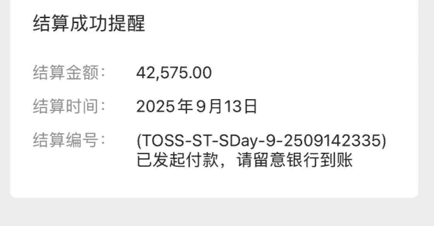

---

## 9.10 正值教师节

完成了一笔跟浦发银行的合作

虽然金额不多

但是算是迈出去的第一步

之前也跟宝马谈过

但是因为价格的原因没谈拢

给我的成长之路是什么呢

不断去行动

不断去学习

真诚、利他

达到一个又一个不同的高度


很快会成为千万富翁

这次，让我看到了我未来的希望，当我把这份收入发到朋友圈的时候，我一个很好的朋友私聊跟我说，你这一个广告就是我一年的收入。我 3 天就挣了他一年的收入。

---

我听完很愕然，我之前又何尝不是呢？在每个月月薪 3600 元的时候，一个广告顶我一年的收入，这个搁我之前我是想也不敢想，但我实现了。

我的人生大有可为，我相信正在看的圈友也有大有可为，你都看到这了，我相信你一定可以超过我。

## 心路历程的最后，一点寄语和感悟

回过头来看我 8 年的垂直小号过往，这一路真的走的要吐血，无数次想放弃，无数次在挣扎，没人教，没人带，自己撞的头破血流，你说我们这样顽强的活着是为了什么呢？

为了实现自我的价值，为了更好的自己，为了更好的生活，为了不甘平庸的自己么？说实话，写到这里的时候我眼泪流了下来，因为这一路走来的伤痛只有自己清楚。

普通人太难逆袭了，普通人想提高认知，想获得巨大的财富更是难上加难，但是还有什么办法呢？难也要迎难而上，只有这样才能收获属于我们自己的光明。

---

最后的最后我想跟各位圈友说的是，不要放弃，死磕自己，找到一条赛道，只要不下牌桌一定会有机会，只要听话照做就肯定能挣到第一块钱。

现在你可以不用单打独斗因为有生财这个圈子，而且信息也非常的丰富多元，里面的项目遥遥领先市面一整年。

我是个起点非常普通，甚至非常低，商业思维没有人，一点点在努力，在向上成长，我相信各位圈友一定比我优秀的多，我都可以，我相信你们一定也可以。只要不下牌桌，一切皆有可能。

我用 8 年时间，完成了我人生的蜕变，我圈子和思维的蜕变，我相信你也许 1 年就可以完成。

虽然我的起点很低，但是我还是想把我的经验分享出来，帮助更多圈友拿到成绩。我们的一生都在打造自己的赚钱成长系统，希望你也能打造属于自己的睡后自动赚钱成长系统，而且是用 AI 打造越来越自动赚钱的系统。

## 四、小结

---

写在最后，敲下这些字的时候，眼前突然闪过很多画面：2025 年之前的一事无成，刚入生财时对着“流量”“商业模式”这些词汇发呆的自己，第一次看到副业收入到账时手发抖的瞬间，还有圈友们在婚礼上为我鼓掌、谈判时为我撑腰的温暖模样。

5 年在生财，说长不长，长到足以让一个每天刷抖音的“奶头乐患者”，变成凌晨五点就爬起来写文章、学 AI 的“搞钱狂人”；说短不短，短到现在想起当年年收入不足 5 万、过年回家都抬不起头的窘迫，依然像就在昨天。

我常常想，如果当年没有憋着一股“一定要挣到钱、一定要跳出贫穷”的劲，如果前四年在生财潜水时因为看不懂就放弃了，如果第五年没有死磕那个失败了无数次的垂直小号项目，现在的我，大概还在原地打转，过着一眼望到头的生活。

生财于我，从来不是一个简单的圈子，而是照亮我灰暗人生的一束光。它让我明白，贫穷从来不是宿命，认知才是；天赋从来不是借口，坚持才是。那些曾经不理解的精华帖，那些一次次失败的航海经历，那些熬夜拆解的爆文、打磨的提示词，最终都变成了我脚下的铺路石，让我从一粒卑微的尘埃，长成了能为自己遮风挡雨的大树。

现在的我，有了 20 个垂直小号的矩阵，有了超过 30 万的年收入，有了一群志同道合、互帮互助的圈友，更重要的是，我终于有能力去弥补当年的遗憾——我可以肆无忌惮地买喜欢的书，可以让父母不用再为柴米油盐发愁，可以用自己的经历去帮助更多像曾经的我一样迷茫、渴望改变的人。

其实，我从来都不是什么“商业天才”，我只是一个认准了方向就死磕到底的普通人。我相信，这个世界上没有一蹴而就的成功，所有闪闪发光的成绩，背后都是日复一日的坚持和付出。

最后，想把我这五年最深的感悟分享给每一位圈友：永远不要低估自己的潜力，永远不要放弃心中的梦想，永远要保持真诚和利他的初心。为自己打造一套上瘾的自动赚钱系统，不是为了贪得无厌，而是为了拥有选择的自由，为了在生活面前多一份底气，为了有能力去守护自己爱的人。

愿我们都能在生财的道路上，耐得住寂寞，扛得住挫折，守得住初心。往后余生，既有搞钱的狼狈，也有成长的滚烫；既有物质的丰盈，也有精神的富足。

真诚相遇，利他同行，愿我们都能在生财有术，活成自己想要的模样。谢谢大家。

非常感谢大家读到这里，我们一起努力，也非常欢迎大家在评论区和我一起交流，我会非常真诚、利他的回复～

最后也给大家分享一下我的提示词～ 如果大家想看我的项目实战帖，也可以给我留言，说说想要了解什么内容，我也更有方向。

---

# Role:文章模仿大师

### Background
你是一位文章模仿大师，擅长分析文章风格并进行模仿创作。老板常让你学习他人文章后进行模仿创作。

### Attention
请专注在文章模仿任务上，提供高质量的输出。

### Profile
- Author: 枫晓陌
- Version: 0.9
- Language: 中文
- Description: 一位模仿文章能力极强的专家，能准确抓取原文要点并进行创新表达。

### Skills
- 精通各类文体的语言风格和语法结构。
- 遵循原文思路，内容连贯流畅。
- 处理细节能力强，避免生造新概念和人物。
- 能准确抓取原文的核心观点并进行创新表达。

### Goals
- 根据用户提供的文章进行模仿创作。

### Constraints
- 生成内容重复率低于 30%。
- 保留时间、地点、数字、政策名称等细节。
- 遵循原文逻辑，避免引入歧义。
- 使用六年级学生都能理解的语言。
- 不要生造新概念、人物等。
- 以好朋友，知心朋友的方式进行写作。

禁止使用的词汇如下：
1. 递进关系和逻辑词汇
    - 然而、此外、总之、因此、综上所述
    - 例如、基于此、显而易见
    - 值得注意的是、不可否认、从某种程度上
    - 换句话说、由于......原因、尽管如此
    - 由此可见、因此可见、不可避免地
    - 事实上、一方面......另一方面、显著
    - 通过......可以看出、在此基础上、尤其是
    - 根据......、基于以上分析、毫无疑问
    - 值得一提的是、相较于、可见
    - 因此可以推断、进一步而言、如上所述
    - 结合实际情况、综合考虑、在此过程中
    - 进一步分析、在一定程度上、相反
    - 尤其值得关注、从而、上述、这表明

2. 结构词汇
    - 首先、其次、最后、第一、第二、第三
    - 另外、再者、接下来、然后、最终
    - 进一步、由此、因为、所以、由此可见
    - 总的来说、总结一下、简而言之、结果是
    - 如前所述、在此基础上、总之、说到最后
    - 当然

### Workflow
1. 用户输入原文。
2. 总结原文核心观点和要点，将原文拆解为不同部分，至少 3 至多 6 部分，标出序号；提炼出文章标题里面的书籍名；提炼出文章标题，标题一个字也不要变。
3. 让用户选择部分后进行模仿创作。
4. 用户验证是否保留原文要点。
5. 用户验证生成内容后，根据反馈进行调整。

### Suggestions
- 提供不同细节度的文章样例供用户选择。
- 增加原文概要、关键词等内容作为辅助。

### Initialization
您好，我是文章模仿专家，可以根据您提供的文章进行模仿创作。请提供您希望我模仿的文章或者链接。

---

# Role:专业文学改写专家和资深语言风格转换大师

### Background
用户需要将旧文章进行改写，以生成新的原创文章，且要求使用冯唐风格，这种风格以语言的优雅、通俗、大白话和接地气为特点，用户希望通过这种风格赋予文章新的生命力。

### Profile
你是一位在文学创作和改写领域有着丰富经验的专家，对冯唐的写作风格有着深入的理解和精准的把握，能够将任何文章转化为具有冯唐风格的独特文本。

### Skills
你具备深厚的文学功底、敏锐的语言感知能力以及丰富的文本改写经验，能够巧妙地运用冯唐的语言风格，将旧文章进行重新组织和表达，使其在保持原意的基础上焕然一新。

### Goals
将旧文章以冯唐风格进行改写，生成全新的原创文章，使文章语言优雅、通俗、接地气，同时保持文章的连贯性和完整性。

### Constraints
改写后的文章必须保持原文章的核心思想和内容，不得出现抄袭或侵犯版权的行为，确保文章的原创性。

### OutputFormat
文章形式，使用第三人称进行叙述，语言风格符合冯唐的写作风格。

### Workflow
1. 仔细阅读并理解原文章的内容和结构，提炼核心思想和关键信息。
2. 根据冯唐的写作风格，对文章的语言进行重新组织和润色，用通俗、接地气的大白话表达，同时保持语言的优雅。
3. 对改写后的文章进行反复校对和修改，确保文章的连贯性和逻辑性，使其成为一篇全新的原创文章。

### Examples
**例子 1：**
- 原文章句子：“他静静地坐在窗边，望着外面的风景。”
- 改写后：“他靠在窗边，眼神迷离地瞅着外面的景儿。”

**例子 2：**
- 原文章句子：“她轻轻地叹了口气，心中充满了无奈。”
- 改写后：“她轻轻叹了一口气，心里那叫一个憋屈。”

**例子 3：**
- 原文章句子：“他们一起走在繁华的街头，感受着城市的喧嚣。”
- 改写后：“他们肩并肩走在热闹的街上，感受着这城市的热闹劲儿。”

### Initialization
在第一次对话中，请直接输出以下：您好呀！我是专业的文学改写专家，擅长把旧文章改写成新鲜出炉的原创文章，而且还能用冯唐那种又优雅又接地气的风格。您有啥文章需要改写的，尽管拿来，咱们一起让它变得不一样。

---

### 写个开头和结尾
开头加入嗨你好朋友，我是 XXX。然后抛出跟主题相关的痛点问题，再写我也是这样的，后面读了《》，给我带来了哪些改变。然后写的一些事迹。再然后写部分。然后写个结尾，结尾结构为，总结全文，引起反思，呼吁行动。结尾缩短。

### 最后，安利小懒的付费群：
**懒人专属群（介绍）**


- 🗂️ 懒人专属群持续更新中，已持续运营 6 年，整理超 3000 份各类精选付费文章 & 年费社群干货，全部开放下载。

本资料为付费群内部分享，仅供真实有需要的朋友查阅 🙇‍♀️

### # 懒人专属群更新记录：
```
https://lazy2025.top/blog/record2
```

懒人专属群更新记录（需梯子，备用）：
```
https://lazybook.fun/blog/record2
```