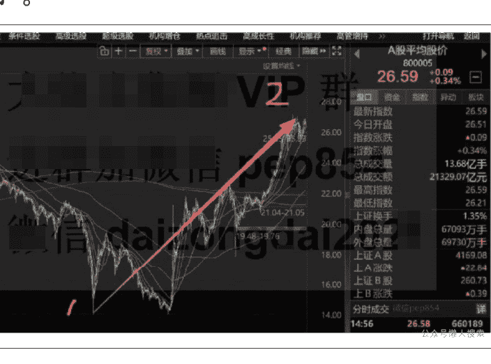
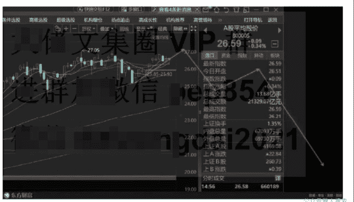
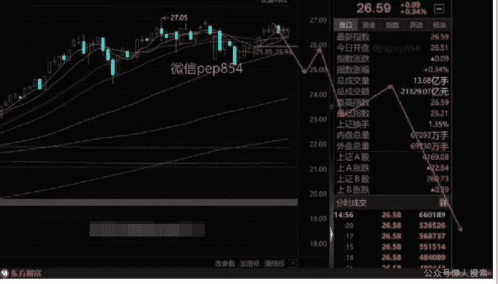

# 11 月趋势预测

251103 花花的股

整理：公众号懒人搜索，懒人专属群独享

懒人微信：lazyhelper


现在这个位置很关键，公开的文章很多话，欲言又止，所以还是在付费文章中一次性说清吧，后面的走势到底会怎么样，把最新的研究成果一并道出。

首先对后面的走势，我先说结果，后面我看跌，大家肯定奇怪，我不是说这里是牛市吗？那么为啥又看跌了，因为一套完美的体系，它是需要经历市场，然后一步步完善，也就是再好的体系也需要经验，需要经历市场足够长的周期。

那么之前我为啥认为可以一直上涨，这里我们要明白一个点，就是牛市与牛市之间是需要调整的。我这里用美股来表示吧，美股过去十几年，期间是很多个波段小牛组成的，每一次波段小牛结束后，都会有一波调整，那么把波段小牛总结出来，找到规律，就能看懂他实际走势了，这里怎么划分的我就不展开了，你们只要理解这个概念就行，那么美股最近的一个波段小牛怎么划分呢？

我最初是认为 4 月这波美股下跌就是调整结束了，那么 4 月后的上涨，就是新一轮的波段小牛，如果这么看，那么现在我们可以毫无顾虑的满仓持股，但是近期我反复总结复盘，我得出的结论是 4 月那波并不是调整结束，美股这波从 2022 年 10 月开始的波段小牛还未结束，也就是 1-2 这个过程依然是一个波段小牛里面的，而且已经进入的行情尾部，随时面临崩溃，见顶后美股就会有一次 20% 左右的跌幅。


这里我为啥要说美股，因为你要知道，全世界的股市基本都是同步的，因为现在的经济是全球化合作的，美股作为世界龙头，其他市场的股市基本跟随美股的，所以研究 A 股就绕不开美股。

那为什么过去美股都是慢牛，我们 A 股却很垃圾，那是因为单纯就是 A 股垃圾，因为我们过去的经济主体是房地产，股市是次要地位，你想想你炒板块的时候，杂毛的走势是不是要弱一点，房地产主线把资金吸走，没钱去股市了，能理解？现在楼市不行了，你会发现，A 股就能跟上美股的走势了，因为现在 A 股是经济支柱了，资金充足了。

扯远了，我们自己回头看看我们所谓的人工智能，是不是也就是 2022 年 12 月开始的炒作的。所以从全球股市内在规律去看，我们现在也是在赶顶，科技股的这波炒作也在接近尾声，看明白这点后，你就知道我为啥要看空了。



那么这里下跌后，后面还有牛市吗？放心这里下跌后，还有一个波段牛市，也就是这里跌下来后，还能大涨，那么现在的问题回到，这里要跌多久，跌幅是多少？

这里要具体来说说，首先是强势的情况，跟弱势的情况。

强势的话，就是接下来平均股价还能继续新高，这样的话后面下跌，平均股价最终跌幅大概 20% 左右，时间暂定需要 3 个月左右。



另一个情况，弱势的话，也就是后期平均股价不再新高了，那么这种情况平均股价跌幅要到 30% 左右，时间也是 3 个月左右。



所以我说最好还能再新高，这样跌幅也可以少一点。

说的这么悲观，那么接下来说点好听的，一个波段牛市结束，然后调整到底后，后面开启的就是新的波段牛市，最终上证指数依然是看到能突破 6124 点，所以后面还是有牛市的。

还是在这种收费文章写的舒服，想说什么就能说什么，我已经把目前自己的真实想法全盘道出，接下来我会继续跟进，一点点跟踪观察，看看到底是不是按我这个想法走。

## 最后，安利小懒的付费群：

### 懒人专属群（介绍）


💾 懒人专属群持续更新中，已持续运营 6 年，整理超 3000 份各类精选付费文章 & 年费社群干货，全部开放下载。

本资料为付费群内部分享，仅供真实有需要的朋友查阅 👨‍👩‍👧‍👦

### 懒人专属群更新记录：

```
https://lazy2025.top/blog/record2
```

### 懒人专属群更新记录（需梯子，备用）：

```
https://lazybook.fun/blog/record2
```