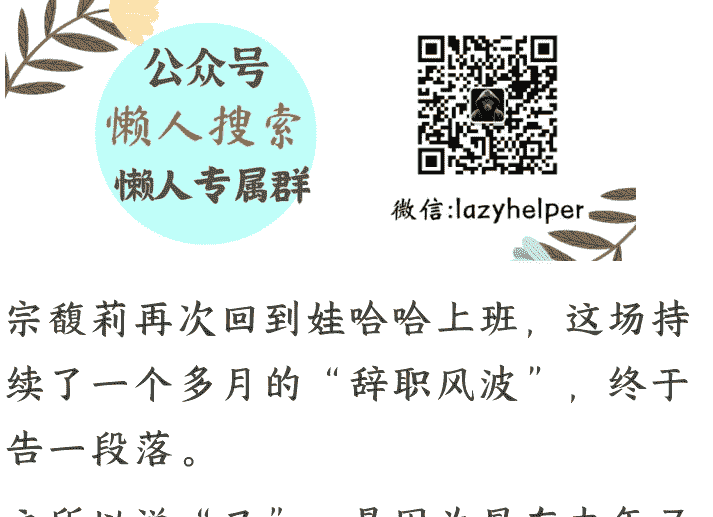

# 第二次重返娃哈哈，宗馥莉的无奈选择？

251106 文/卢克文工作室嘉宾 风雨如歌

整理：公众号懒人搜索，懒人专属群独享

懒人微信：lazyhelper

宗馥莉再次回到娃哈哈上班，这场持续了一个多月的“辞职风波”，终于告一段落。

之所以说“又”，是因为早在去年 7 月，宗馥莉便辞职过一次了，理由是“娃哈哈集团部分股东就其自宗庆后董事长离世后对娃哈哈集团经营管理的合理性提出质疑，致使其无法继续履行对娃哈哈集团及其持股公司的管理职责”。

说白了，就是不想让她掌权。

那时候老宗才去世不久，宗馥莉一个请辞，“部分股东”立刻在舆论上陷入不利。

最终，“部分股东”被迫让步，宗馥莉大获全胜，重新回到了娃哈哈，并掌握了大权。

一年多后的 2025 年 9 月，她和股东的矛盾再次爆发，再次辞职，准备另起炉灶，打造新品牌“娃小宗”，放弃父亲经营了几十年的娃哈哈。

但这一次，她没能迫使股东让步，再次重回娃哈哈，颇有些无奈妥协的意思。

那么，这是怎么回事？

## 01

由于特殊的发展历史，“娃哈哈集团”有国资成分，不完全是个人企业，即便宗馥莉接了父亲的班，也不等于“娃哈哈集团”是她个人的。

众所周知，宗馥莉掌管着“宏胜系”，“宏胜系”完全是她个人的，业务以给“娃哈哈集团”代工为主，常年享受“娃哈哈集团”的优待。

比如，订单少的时候，娃哈哈集团会优先把订单交给宏胜集团的工厂，确保其开工率。

在母公司的常年关照下，“宏胜系”的营收，在 2021 年突破了百亿人民币，最重要的是，宏胜集团的控制权，属于宗馥莉个人。

这种情况下，不断把“娃哈哈集团”的资源，往“宏胜系”搬，就是常规操作，所以，宗馥莉接班以来，干的大部分事情都围绕着一个核心：

> “去娃哈哈化，大力发展宏胜系。”

主要有三个方面，首先是人。

- **人**。2024 年 8 月，来自“宏胜系”的洪婵婵和叶雅琼，被选入“娃哈哈集团”董事会，成为董事，加上宗馥莉自己也占据一个董事席位。这样一来，集团董事会五个席位中，宗馥莉及其人马就占了仨，完成了对董事会的掌控。

在高管层面，“娃哈哈集团”的常务副总、行政总监等一千高层人员，也统统被“宏胜系”的人马取代。

很快，娃哈哈集团的大部分员工，被要求转签合同到宏胜集团，变成宏胜集团的员工。

不签会怎样？

《上观新闻》报道，如果不签，来自“宏胜系”的上司，会大幅降低你的奖金，少发你的工资甚至停发。

无奈之下，许多员工只能转签。

- **生产线**。根据《21 世纪经济报道》的调查，从 2025 年 1 月起，“娃哈哈集团”陆续关停了旗下的 18 家工厂。其中，有些工厂（比如衢州工厂）的效益，还是不错的。

显然，这不符合降本增效原则。

这些工厂，多数与杜建英有关联，关于杜建英和宗馥莉的恩怨，网上已有很多分析，这里不再展开。关停“集团”旗下工厂，无形中起到了打击杜建英的作用。

一边是关停“娃哈哈集团”旗下工厂，另一边，“宏胜系”旗下的宏胜饮料不断扩张，陆续在天津、怀化等多地新建了 18 条生产线。

- **商标**。2025 年初，“娃哈哈集团”提出申请，将“娃哈哈”系列商标共计 387 件，从娃哈哈集团手中，转移到“杭州娃哈哈食品有限公司”（这是一个宗馥莉控股的公司）。

要知道，由于极高的国民度，“娃哈哈”商标估值超过 900 亿人民币。

转移“娃哈哈”商标，是一件很大的事。

但这么大的事，“娃哈哈集团”却没有召开董事会商讨，也没有事先和最大股东（杭州上城文旅）沟通，而是悄悄向国家知识产权局商标局提交申请。

如果“娃哈哈集团”没人、没工厂、没商标，岂不成了一个空壳？

到那时，国资手中 46% 的股份，还有什么意义？

想要阻止人和生产线的转移，不太容易，虽然“娃哈哈”的高层和关键岗位，已被“宏胜系”人马占据，但阻止商标转移，还是能做到的。

《公司法》规定，商标等公司核心资产的处置，需召开股东大会，并得到全体股东一致同意。

换句话说，上城文旅能够一票否决转移。

很快，转移商标一事被打回，没有商标，很多经营活动就没法开展，犹如被卡了脖子。

宗馥莉的应对之策，是在 2025 年 5 月选择另起炉灶，创办新品牌“娃小宗”。如果新品牌能够成功，确实用不着“娃哈哈”的商标了。

10 月初，宗馥莉第二次从“娃哈哈集团”辞职，似乎要大干一场了。

然而，事情反转之快，令人大跌眼镜。短短一个月，宗馥莉便回到了“娃哈哈集团”。

## 02

“娃小宗”遇到的最大问题，是经销商的不信任。

饮料行业，至今仍依赖经销商，没有众多经销商日复一日的“地推”，仅靠线上营销，新品很难打开市场。

经销商要进货，就得提前打款。

一名在娃哈哈工作多年的员工，在接受媒体采访，谈到“娃小宗”时坦言，“经销商不愿打款。”

对经销商来说，“娃哈哈”是个有多年积淀的品牌，知名度不用愁。换成“娃小宗”，消费者大概率一脸懵逼，不知道哪冒出来的。

说句不好听的，“娃小宗”这个名字，给人的第一印象是哪个三无工厂在山寨“娃哈哈”。

如果“娃小宗”的货卖不出去，经销商不得亏惨？明明手头的“娃哈哈”卖得不错，有多少人愿意转向一个不确定性巨大的新品牌？

而“娃小宗”的产品结构，让经销商的疑虑更大。

“娃哈哈”的主力产品 AD 钙奶、营养快线和矿泉水，属于含乳饮料赛道和瓶装水赛道。

而“娃小宗”的产品，主打无糖茶和瓶装水两个赛道，放弃含乳饮料赛道这张“娃哈哈”的王牌。

问题在于，这两个赛道都非常卷。

无糖茶赛道，农夫山泉、怡宝、三得利等“前浪”品牌推出的无糖茶产品，已占据大部分市场份额，“娃小宗”挤进来能吃到多少蛋糕，实在不好说。

从经销商的角度，就算要转型无糖茶，也得稳住含乳饮料这个赛道，提供稳定的现金流，才有底气转型，而不是一下子将其抛弃。

至于瓶装水赛道，“娃哈哈”本就常年占据 10% 左右的市场份额，名列全国第四，再弄个“娃小宗”瓶装水，岂不多此一举？

万一投入巨大的人力物力，最后份额还不到 10%，那找谁说理去？

并且，宗馥莉的经销商体制改革，还得罪了一大批经销商。

以前“娃哈哈”的经销商体制，被称为“联销体”，集团对经销商的掌权，只到省一级。省以下，集团会充分放权，尽量让经销商做主。

说得直白点，就是“皇权不下县”。省一级经销商，由此握有很大话语权，等同于诸侯，他们并不从属于“娃哈哈集团”，双方是合作关系。

这套模式，在 90 年代是符合现实的。那时，娃哈哈刚诞生不久，规模不大，如果不放权，凡事亲力亲为，根本不现实。但时间来到 2025 年，“联销体”的弊端已充分暴露，主要有两点。

- “联销体”对于基层缺乏掌控力，而经销商的利益未必和集团公司一致。比如，集团想推个新品，但经销商未必乐意；

- “联销体”模式下，总公司较少触达基层，对于一线的信息，往往两眼一抹黑，容易做出错误决策。

所以，宗馥莉掌权后，开始“加强中央集权”。

她清退了年销量低于 300 万的小经销商，只保留年销量高于这个数字的中大型经销商，要求绝大部分经销商接入统一的数字化系统，对于经销商的管理更严格。

很多事项，不能再像过去那样，由经销商独自决定。

虽然有少部分经销商表示支持，但大部分经销商，显然是感到不满的。

毕竟，不希望被削权，是人之常情。经销商们对于“娃小宗”的抵触，可想而知。没有经销商的配合，“娃小宗”在短期内很难打开销路。

而“娃小宗”这个新炉灶起不来，宗馥莉便没有底气，真正离开“娃哈哈集团”。

重回娃哈哈的宗馥莉，看似暂时平息了风波，实则站在了更复杂的十字路口。

与国资的矛盾，与经销商的利益冲突，仍是悬在她面前的难题，而“去娃哈哈化”与发展宏胜系的核心诉求，又始终与集团其他股东的利益存在碰撞。

每一步决策，都可能牵动全局。

宗馥莉能否找到破局之道，没人能给出确切答案，“娃哈哈集团”及“宏胜系”的未来走向，依然充满不确定性。

## 最后，安利小懒的付费群：

### 懒人专属群（介绍）

📚懒人专属群持续更新中，已持续运营 6 年，整理超 3000 份各类精选付费文章&年费社群干货，全部开放下载。

本资料为付费群内分享，仅供真实有需要的朋友查阅🤫

### 懒人专属群更新记录：

[https://lazy2025.top/blog/record2](https://lazy2025.top/blog/record2)

懒人专属群更新记录（需梯子，备用）:

[https://lazybook.fun/blog/record2](https://lazybook.fun/blog/record2)