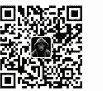

## 我是如何用 AI 的？

# 251106 生财精华 亦仁

整理：公众号懒人搜索，懒人专属群独享

懒人微信：lazyhelper

有一种红利，叫视野红利。

就是说，有些信息，一旦你看见了，你整个人就回不去了，选择权立刻多了很多。

比如，你没进生财之前，可能觉得副业是：送外卖、开滴滴、接外包、加盟奶茶店、开咖啡店、开餐馆、摆地摊、开淘宝店。

但当你进了生财之后，你会发现世界完全不一样了：

你可以做 YouTube、做 B 站好物、做小红书电商、做知识付费、做 SaaS 网站、做抖音自然流量 CPS、做视频号带货、做跨境电商、做苹果 App、做视频套壳站、做 AI 自媒体、做公众号爆文、做 TikTok、做小红书商单、做得物、做 X 自媒体...

我可以一路讲到星球发帖字数限制。

知道了，就是不一样，加入生财的 3365 块钱，买的其实是一份“视野红利”。

而在 AI 怎么用里，也存在同样的“视野红利”。

AI 不在于对于道的理解，而在于 AI 之术，如何用 AI 的方法，讲出来，别人就可以复制。

所以，当团队说要征集“万事用 AI”的案例时，我决定先写一篇——《亦仁是怎么用 AI 的》。

我想告诉你，我是怎么用 AI 思考、工作、决策、学习、赚钱的。

你看完之后，大概率能立刻学过去，然后这些能力就变成你的了，好，下面我们就开始：

- 1/ 从最简单的开始，用豆包来替代百度搜索，豆包的语音功能是最好用的，用语音随时随地问，还可以和它打电话聊。

还可以打开豆包视频功能，让它给我女儿读绘本讲故事，陪我女儿聊天。偶尔还会让豆包帮我提取图片上面的文字，当作 OCR 工具来用。

- 2/ 需要深度讨论的问题，我会和 ChatGPT 聊，特别是一些复杂的架构和顶层设计问题，比如公司的财税架构，我会聊完后，让它出一个知识图谱，当它第一次产出知识图谱的时候，我感觉到很震惊，把我脑容量不够思考深度不够的问题基本解决了。

你可以试试，我上次弄完一个知识图谱给一个朋友看，她说单这个知识图谱的方案就值几十万，这个时候它是我的 AI 大脑。

关键是很多信息还没法和其他人讲，和 AI 讲是最方便的。

- 3/ 有一些需要深度调研的问题，**我会使用 ChatGPT 的 Agent 功能**，它会实时的去搜索当前互联网的信息，然后汇总成一份报告给我，比如，我希望调研下互联网上对于生财有术有哪些好评和差评，背后有哪些机会和风险，它就会几分钟或者十几分钟给我产出一份非常详实的报告，这个时候它是我的最得力的调研助手。

调研有时候我也会用 Gemini，Gemini 有谷歌最全的信息，产出的报告质量也非常不错。

- 4/ 让 ChatGPT 充当我的技术顾问角色，我遇到任何技术问题，比如电脑发热很厉害，怎么去调整，我的网络访问很卡，怎么去调整，我的跑步姿势感觉不对，应该怎么去调整，我的 PPT 需要优化，帮我优化，**帮我做 PPT**，等等，这些功能都能实现，万事问 ChatGPT。

- 5/ 每天 ChatGPT 会给我推送动态 (Pulse)，基于我日常和它聊的内容，它会给我生成一些对我很有价值、未必注意到、风险点、机会点等内容，这个功能我非常喜欢，**这个时候它是最懂我的人，比我还懂我的人。**

- 6/ Claude Code，编程神器，我做产品会用这个，右边是 ChatGPT 聊架构聊技术方案，左边是 Claude Code，我的超级聪明的程序员小弟。

除了做产品，有的时候我会让 Claude Code 迅速实现一些小功能，比如当我不想去搜索网页找 YouTube 下载器有效时，我就会让 Claude Code 现场给我做一个，很多用的不多的小功能，我又不想去付费购买时，就指挥 Claude Code 现场给我做一个出来，用完即弃。

比如，我用 Claude Code 做了个我的微信聊天记录分析与总结工具。

- 7/ 推荐一个我非常喜欢的学习神器：NotebookLM，我把想看的 YouTube 视频，找到的电子书，都丢给它，然后看生成的思维导图，基于思维导图的某个知识点去深入问问题，并且用 NotebookLM 的闪卡功能测试我掌握的情况，不懂再学习一遍，比以前看书和看视频效率高多了。

我还有个习惯，在闲鱼上花几块钱让别人把某个公众号的内容全导出为 PDF，我把 PDF 灌给 NotebookLM，这样就能深度的去学习一个号，以及理解一个人的思维变迁。

- 8/ Get 笔记配合我想学习的 B 站视频，把 B 站链接丢给 Get 笔记，就可以生成详细的框架要点，以及可以点进去看原文。

- 9/ 百度网盘，你可能想不到，它有一个 AI 笔记功能很好用，很多视频在百度网盘里面，点击播放有 AI 笔记功能，它会截取视频图 + 文字笔记，图文并茂，学习效率提升不少。

- 10/ 偶尔我会用 Grok 来调研 X 上面的一些信息和观点。

- 11/ 熊掌记，这个工具也不可替代，ChatGPT 生成的内容，不管是复制到备忘录，还是复制到微信上，基本都是 Markdown 格式，不规整，通过熊掌记过一手，就可以导出清晰好看的笔记，支持 PDF、图片等非常多的格式。

- 12/ 哦，对了，差点忘了沉浸式翻译，可以说是看英文信息必备，有了这个插件，我可以在手机和电脑上随时随地看全世界各种语言的信息，没有任何障碍，甚至你不会感觉到你在看国外的信息。

- 13/ 还有一些用的不多，但值得一提：Plaud 录音硬件，通义录音转文字，微信读书的 AI 目录，大众点评的 AI 搜功能，闲鱼和 Z-Library 找一些小众服务和书籍。

就差不多这么多吧，后面想到可以再补充。

我的角色核心是一个思考者和决策者，以及产品经理，所以大多数情况下，以信息输入、处理以及辅助决策为主，可能和大家很多不一样，所以我也很期待分享你是怎么用 AI 的？

## 最后，安利小懒的付费群：

### 懒人专属群（介绍）

💾 懒人专属群持续更新中，已持续运营 6 年，整理超 3000 份各类精选付费文章&年费社群干货，全部开放下载。

本资料为付费群内部分享，仅供真实有需要的朋友查阅🙇

### 懒人专属群更新记录：

- https://lazy2025.top/blog/record2

懒人专属群更新记录（需梯子，备用）：

- https://lazybook.fun/blog/record2