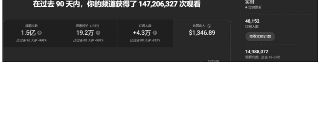
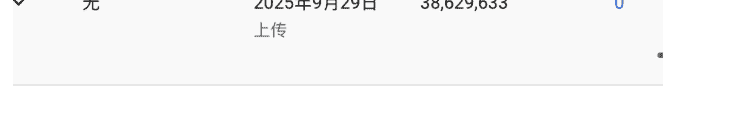
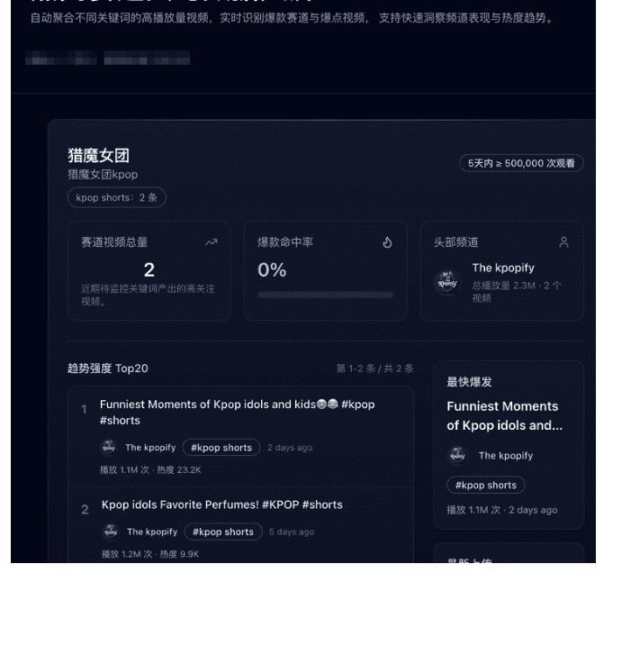
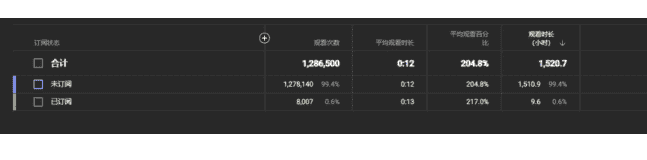
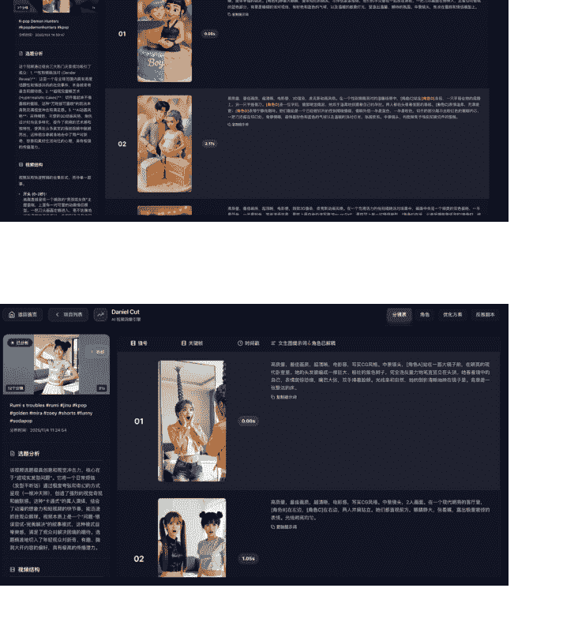
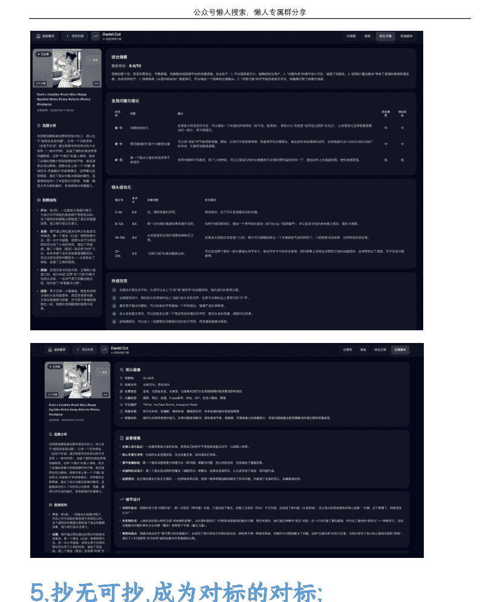

# Youtube 如何快速玩废 17 个 YPP

## 251108 生财精华

公众号懒人搜索，懒人专属群独享

懒人微信:lazyhelper

微信:lazyhelper

## 1.一路走来，一口气废掉 17 个 YPP:

不知不觉 Youtube 也研究了有一段日子了，总账号应该有 300 个了吧，有收益的只有十分之一，YPP 账号也开通了不少，期间卖了几十个 YPP 左右，其余大部分账号还都是在陪跑，以测量为准，我一直坚信量大出奇迹，数量呢是降低幸存者偏差的最好方法，风控或者封号这个事我并不是很在意，我跟我的小伙伴说，给你 20 个 YPP 号做测试，要求全部封光，但是每个账号产值要大于 200 刀，超过 200 刀以后你随意，想怎么玩就怎么玩，各种眼花缭乱的封禁原因我都见过，擦边的，儿童的，动物的，引导未成年订阅的，成功封掉了 17 个，还有三个意外，看样子是尽力了，姑且留下继续运营吧，至此我仍然有超过 30 个 YPP 足以支撑收益，我也测出来了一些数据，今天来个分享。

### 频道分析

2025/10/1 - 2025/10/28 过去 28 天

在过去 28 天内，你的频道获得了 107,721,856 次观看

| 指标 | 数值 | 比较 |
| :--- | :--- | :--- |
| 观看次数 | 1.1 亿 | 比平时多 1.1 亿 |
| 观看时长 (小时) | 13.8 万 | 比平时多 13.7 万 |
| 订阅人数 | +3.2 万 | 比过去 28 天多 17% |
| 预估收入 | $1,049.63 | 比过去 28 天多 17% |
| 实时 | 49,951 订阅人数 | 过去 28 天 |
| | 7,494,891 观看次数 | 过去 48 小时 |

### 社区准则警示

已收到 1 次社区准则警示 (3 次为限)
- 你的内容违反了我们的社区准则，因而已被移除。
- 此警示将在 90 天后过期，而且删除相应视频并不会解除此警示。

#### 如果再出现这种情况

- 你的频道将收到第二次社区准则警示。
- 你将在 2 周内无法执行上传、发帖或直播等操作。

#### 移除的内容

如果你认为我们的处理有误，可以对此提出申诉

| 日期 | 内容 | 政策 | 操作 |
| :--- | :--- | :--- | :--- |
| 收到警示的日期：2025 年 10 月 28 日 失效日期：1 月 26 日 | [图片] | 儿童安全 | 已提交申诉 - 2025 年 10 月 28 日 |
| 收到警告的日期：2025 年 9 月 29 日 | [图片] | 儿童安全 | 已完成培训 - 2025 年 9 月 29 日 申诉遭拒 - 2025 年 9 月 29 日 |

### 你的内容违反了我们的《社区准则》，因而已被移除

由于是首次出现这种情况，因此这次只给予警告，你仍可以上传内容、发帖和直播。如果再次出现这种情况，你的频道将收到一条警示，届时你将在 1 周内无法执行这些操作。如果你的频道再收到 1 条警示，你将在 2 周内无法发布内容。如果你在任意 90 天内收到 3 条警示，你的频道将被永久移除。

我们希望帮助你留在 YouTube 上，因此:
- 1. 确保你了解 YouTube 的《社区准则》和《警示基础知识》。
- 2. 请检查你的内容，确保其符合我们的政策。如果你在检查自己的内容后认为我们的处理有误，请告知我们 - 你可以对此决定提出申诉。

以后再提醒我

检查内容

### 政策培训

#### 关于此培训

7 道题 • 15 分钟
我们希望你...在本次培训中:
- 你将看到与你违反的政策相关的场景
- 你可以尝试选择正确的答案，次数不限

#### 儿童安全

涉及未成年人的有害和危险行为
有关儿童安全的问题多种多样，但这项培训将重点关注涉及未成年人的有害和危险行为。

YouTube 不允许发布会危害未成年人身心健康的内容，未成年人是指未满 18 周岁的人。我们对 YouTube 上的掠夺性行为实行零容忍政策。如果我们按照用户举报的内容判定某个儿童处于危险当中，我们将协助执法机构对该内容进行调查。

#### 你的 YouTube 频道...

请你在 YouTube 上发布符合以下任何描述的内容：性化未成年人，涉及未成年人的有害和危险行为，对未成年人进行情感虐待或身体虐待，或者内容标注让人误认为适合全家共享，但这则不适合特定年龄段。

我们的目标是对上传者和观看者都给予充分的保护。请慎重考虑后再发布有关你自己、家人或朋友的内容，避免让其中任何人遭遇危险或受到负面的关注。

本培训包含涉及儿童安全问题的场景，可能会让某些人感到不安或具有诱导性。

## 2.分析复盘，来逆向:

### 筛号:

这是不得不走的一步，熟悉我的小伙伴知道我当时一口气开通了 50 个 YPP，应该没有人能全部拿 YPP 账号去测量，可是我最不缺的就是 YPP 号，那我们就用 YPP 来测，权限高，数据也看的更全，同样的视频我发不同的号上去，量有高有低，3 万是常态，也有爆几千万的，也有过亿的，也有几千播放的，那证明什么，有些号他就只能吃这一类，或者说它的用户群体已经定死，你很难去改变他，以我的经验来说，3 个月之内你想改变他的用户群很难，不如起新号划算，我最快记录是一条开通 YPP。即使是 YPP 号也是要筛号的，有些号只能做 shorts，有些只能做长的，所以得选符合自己的，对着马云的路一模一样的走，成为马云的概率也不会有 1%。

### 极限:

要去测极限环境的情况，我会只改变一个变量，我根本不会管他会不会封，会不会判重，我会拿自己的爆款素材做印证，版权中是否会触发，有一个奇怪的现象，极少数触发的版权的视频，会在三天后在版权处消除，特别相似的反面没有出现版权，但是同一个提示词使用不同形象 (垫图)，会有一定的概率触发。

你有没有想过拿自己的爆款，原封不动的再发一遍，我的确缺少了年轻人的胆量，就这干了好几个千万的播放:

## 3.SOP:

### 拿的快，选对方向

你要有能力及时发现爆款的方法，它能够最快速，最及的发现优质的的视频，这是我写的一个监控大屏，Youtube 的官方 api 并无法直接实现爆款数据的采集，你只能去监控指定账号，如果你想直接分析整个赛道的一些数据变化及时发现爆款，就得配合爬虫自己写一些算法，还需要一些调整，合适的时问会开源给大家:

### 2.推的快，冷启动

youtube 的推流是去中心化的，视频在基础流量以下，你的粉丝影响权重高，也就是你们经常说的冷启动，长视频和短视频不一样，短的 1-4 小时，长的你要按天算，一旦过了基础流量，达到百万千万，你的粉丝影响就微乎其微了，如果你有一个千万的爆款，你当天的整体推流会在 100 万左右，有 1 个亿的爆款，你当天的整体推流会在 1000 万左右，不一定是最新发的，老的视频也会逐步起量，没用的视频就删了，不要浪费连带流量，当然你有 100 万粉丝另外。

### 3.拆的快，没有人比我拆的细

有人告诉我，他要花 8 个小时做一个 AI 视频，30 个镜头，还有一定几率卡三万，AI 的优势不是快么？如果花 8 个小时做一个 1 分钟的视频为什么不直接用 Blender 做呢？全流程可控，你想让他怎么动他就怎么动，不会有幻觉，你也不是天天都需要建模，一个角色模型你吃三个月问题不大，而且在 YouTube 2D 的量比 3D 的大，2D 上 an 不是更简单？an 做 flash 能花八小时？你要学会利用 AI 的优势，成本低，时间快，我的记录一天应该是 2000-3000 条视频，只要利润可观，搭建集群也不是难事，拆解一条可以无限复用，但是角色不能一模一样，你换换顺序就是一个新的视频，我在不垫图的情况下，就可以 100% 还原原视频的画面，角色解耦以后配合之前的爆款数据采集，分析的时间不会超过 5 分钟，我很懒，我也不喜欢重复性的工作，所以我自己写了一套系统 (Daniel Wu 是吴彦祖的英文名，因为写的时候抖音正好刷到了吴彦祖在卖英语课.....)，我以大量千万爆款视频提示词做训练，不断地去印证，加了些自己写的算法，基本反推出来的提示词跟原始关键帧的原始提示词相似度极高，出的图也几乎一模一样，用了 TransFlow, YOLO 等来拆分关键帧，纯用 AI 分析幻觉会比较严重，融合二者的优势做结合，本想着做 Web 的，我连落地页都写完了，真的没时间，YouTube 每天要消耗我一半的时间去沟通协调，

### 下图为我随便选的视频作为分析:

> 高质量，最佳画质，超清晰，电影感，写实 CG 风格。中景镜头，角色 A 站在一面大镜子前，在明亮的现代卧室里。她的头发被编成一根巨大、粗壮的紫色辫子，完全违反重力...

当然，这是一个高质量的、电影般的图像，描绘你所要求的场景:

只复制用提示词，未使用角色垫图，文字，表情动作相似度如何，如果角色解耦，可以秒级复刻所有 AI 赛道!

## 4.改的快，减少主观判断

你可以按照这几个维度，作参考，你的创意应该是脱敏的，也就是说他应该是客观的，你的完美主义可能用户根本感知不到，你可以参考我分析的点:

## 5.抄无可抄，成为对标的对标

在这套高效的分析下，我可以在发现一个爆款时，即使对标有原始提示词都没有我发第二条发得快，所以很快，我吃到了一整条赛道的量，然后再在爆款的基础上，去替換换不同的东西去印证是否还有量，我很快就能摸出来哪些能改，哪些不能改，有些绝对不能变，变就没量，有些能变，所以你要找到那个度，现在对标抄的都是我的视频!

## 4.关于自动化

我应该是最早做自动化的，也给大家发过不少自动化的工具，但是我依然不建议你一上来就做自动化，自动化只是提效，AI 只是提效，所有工具都是，人才是核心，所谓的网感一定是你爆款够多以后，你才知道的，算发的边界亦如此，固定在边缘，前进后退都会有损失，那就更进一步，找到临界点、

我现在所做的工具是都在卡速度，我希望他慢下来，但是流程可控，无论谁来做，质量都可控，复制粘贴都能干错，那换个人做就是，这样我才能抽出精力，这样才是一个能扩大的生意，不然只能陷入到无尽的卡三万焦虑中，快速寻找适合你的赛道，有量，做起来不累。

建立在你成型的业务上，自动化就是王炸，建立在废墟上，他还是废墟，变不了高楼大厦。

## 5.关于封号

如果你的账号比较少，你还是需要谨慎些，边界打法不一定适合你，但是不摸你永远不知道，当然也取决于你对 YouTube 的预期和希望，TK 也同理，各位可以问问身边做 TK 的小伙伴，不是在风控就是在风控的路上，筛号也就成了必经之路，据我所知 TK 加上三倍收益的筛号玩法，是可以日入千刀的，远大于 YouTube 的收益，不过它的稳定性不如 YouTube，所以选择很重要，他的玩法也更让你匪夷所思，挣自己认知内的钱，真正挣钱的生意做起来是不累的，不产生价值的号留着干嘛，不行就换，活水远比死水的价值大的多得多。

最后，安利小懒的付费群：

懒人专属群（介绍）

微信:lazyhelper

🔖 懒人专属群持续更新中，已持续运营 6 年，整理超 3000 份各类精选付费文章 & 年费社群干货，全部开放下载。

本资料为付费群内部分享，仅供真实有需要的朋友查阅 🤫

## 懒人专属群更新记录:

https://lazy2025.top/blog/record2

## 懒人专属群更新记录 (需梯子，备用):

https://lazybook.fun/blog/record2