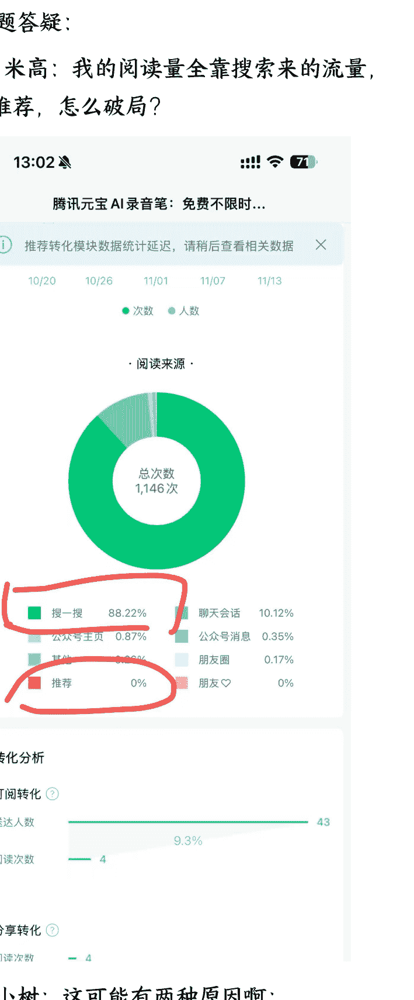

# 为什么你写公众号抄爆款，没有流量？

# 251108 生财精华

公众号懒人搜索，懒人专属群独享
懒人微信:lazyhelper

大家好，我是杨小树。

新手想要写出爆款，最快的方式就是找对标账号模仿爆款。确实有一部分人通过这种方式快速做出了结果，但更多的人会发现：同样的选题，别人写可以爆，自己写就是不行。

出现这样的问题，核心在于：你只学了爆款的“招式”，没学会它的“内功”。

那么，究竟是哪个环节出了问题呢？今天，我就为你拆解写不出爆款的 4 个原因，并给出对应的解决办法。

## 01 选题错位，能力圈外硬模仿

第一个原因：你对标的选题不在你能力范围内，你不擅长去写这种选题。

你模仿的选题是个好选题，推荐系统也给了你推荐量，但是在第一波灰度流量测试的时候，数据不太好，推荐系统就停止了推荐。

为什么数据不好？有两个原因：

## 1 你选错了写作类型

写作分为两种：讲故事和讲道理。

讲故事就是情感类、故事类文章，讲道理就是观点类、方法技巧类文章。

如果你是一个擅长讲道理的人去讲故事，自然就讲不好。

我刚开始写公众号的时候模仿了很多别人写的爆款情感文，结果写出来就是不行。为什么呢？因为我不是那种善于营造情感氛围、捕捉细腻情绪的人，写出来的东西总是少了点“味道”。后来，我开始走讲道理路线，分享技巧、方法、心得，然后流量就起来了。

所以，你必须找到自己“最舒适”的写作类型。

## 2 对于这个选题，你没有积累

你写的选题，你没案例，没经验，所以写出来干巴巴的，数据就不好。

我早期模仿爆款选题写的一篇文章《成年人最高级的自律：给大脑戒糖》，写的是成年人如何戒断手机。而我自己的是没有手机上瘾困扰的，也没有戒断手机的经验，所以我写起来相当别扭，写出来我自己都读不下去。发出来之后，数据也非常惨淡。而我现在写教程，所有的问题和方法都是我自己实践过的，所以，发出来之后，读者都觉得很实用，也经常能出爆款。

如果你要模仿选题，一定要找到过去你有一些思考和经验，有一些案例积累的选题。这样你写起来才能游刃有余，才更有机会出爆款。

进一步，为了让这些选题更抓人，你可以在标题里加入自己的标签，让你的标题更有吸引力。

比如我写文章，经常加上前腾讯员工、前腾讯员工这样的标签。这样，同样的观点，我写得会比别人更有吸引力。

有些人可能没有大厂经历，没关系，你可以提取其他标签，比如在这个事情上做了很多年，或者是说在变现这个事情上做的不错。

比如有人写了个标题叫《写作 5 年我赚了 6 位数，我发现公众号赚钱真不是靠文笔》。还有一个爆款标题叫《35 岁领导的忠告，工作十年，悟出十条职场道理》。都是类似的套路。

尽量提取一些独特标签，在这件事上证明你有积累的标签，这也是更有利于你长期发展下去做 IP。

所以，你必须花点时间找到自己写的最舒服、最顺手的内容形式。如果你发现自己写干货更顺手，那就别硬拗情感文；如果你的故事特别能打动人，那就多去记录和分享自己的经历。

与其模仿别人的风格，不如把自己的优势发挥到极致。

## 02 写作基础太差，留不住人

再说第二个原因：写作基础不过关。过去没写过太多文章，不知道怎么写一篇文章。一个选题到你这里，别人写得好，你写得不好，读者看完开头就走了，不点赞，不转发，那肯定没有推荐量。

写作基础就像是你的“内功”。你抄了一个爆款标题，把读者吸引进来了，但文章的结构松散、逻辑混乱、观点模糊，读者立马就跑了，那这个流量就等于白费。

针对这个原因的解法，没有捷径，就是老老实实补课，系统的学习自媒体写作。对于公众号写作，你需要系统性地学习这三点：

- 1 学会“钩子”：怎么写一个有吸引力的开头？你需要学会用一个犀利的问题、一个扎心的痛点，或者一个反常识的观点，瞬间激起大家的共鸣和好奇心。
- 2 学会“结构”：怎么完整地搭建文章的骨架？爆款文章的逻辑往往都是清晰的，比如“现象 - 原因 - 解法”，或者“是什么 - 为什么 - 怎么做”。你需要练习让你的观点一层一层递进，不让读者感到混乱。
- 3 学会“收尾”：怎么写出让人转发、有收获、有共鸣的结尾？结尾不是简单地重复观点，而是要给读者一个行动指引、一个情绪上的升华，或者一个有力量的总结。

这些技巧都是通用的，而且是底层能力。如果你想一个公众号走得久，你一定要具备写作能力。这是所有技巧的“根”，根基不稳，再好的选题也是白搭。

## 03 只抄了形式，没有抄到内核

第三个原因是：不知道爆款为什么会爆，只抄了一个标题形式，没有理解它爆的原因。

标题只是“钩子”，但“鱼饵”是读者痛点和需求。你抄了钩子，但没放对鱼饵，当然钓不到鱼。

针对这个解法有两种：

- 1 拆解标题到底击中了读者的什么痛点和需求

比如有一个爆款标题：《我为什么建议你写公众号，哪怕不赚钱，哪怕没人看》，我分析这个选题击中的就是别人想做自媒体，想写公众号，但是有点纠结公众号是不是还值得写的痛点。

于是我就写了一篇叫做《为什么我建议你写公众号？李笑来：这是未来 5 年的 10 年里互联网流量瓜分的最后一波机会》。这里的关键是：我不是简单模仿句式，而是抓住了读者的犹豫和纠结，并用李笑来的话有力的给出了答案。

再比如另外一个爆款标题：《一定要大量阅读，你可以学会任何东西》。

我分析这个选题命中了很多人的学习焦虑：知道要学习，但感觉又很难看到结果。这个标题给了这些人一个确定性的答案：一件简单的事，大量的做，就可以看到结果。它从一定程度上缓解了读者的焦虑，并提供了希望。于是我就写了一篇《一定要大量写作，你可以学会任何东西》也同样提供了一种希望。

- 2 找到读者的“高频痛点”，从源头创造选题

当你能模仿一些爆款标题后，就要开始自己创造爆款标题，因为不能一直模仿，你总要走自己的路线。解决办法就是找到读者最关心的痛点，然后去写选题。

你可以建一个自己的社群，然后，你去观察平时大家都在讨论什么问题，或者你也可以收集大家的一些问题。

找到那些读者讨论的高频问题，你提出个犀利的观点或可执行的方法，写成一篇文章，就有可能成为下一篇爆文。

我有好几篇“爆款”文章就是这么来的，比如：
- 《腾讯员工分享：写公众号不要用 AI》
- 《腾讯员工分享：做公众号不要搞互粉》
- 《腾讯员工分享：做公众号不要靠流量主》

如果你没有自己的社群，还有一种办法就是去网上找，看别人问的一些热门问题是什么。比如在知乎和问一问里面搜一搜那些高频问题。

成功的爆款不是偶然，它是对读者痛点的精准投射。

不要停留在抄标题的表面功夫，多去思考“读者在想什么？”和“他们真正想要解决什么问题？”，只有你提供的价值刚好击中他们最渴望解决的问题时，流量才会爆发。

## 04 写在最后

好了，今天的分享就到这里。说了这么多，其实想在公众号上持续出爆款，方法就三个：
- 第一，别硬抄你没积累的选题，只写你擅长和经历过的。
- 第二，老老实实把写作的基本功练好，这是留住读者的硬实力。
- 第三，多花心思去拆解和挖掘读者最真实的“痛点”。

把这三点做到位，你就能从一个模仿者，变成能持续产出爆款的引领者。

## 问题答疑：

- 1、米高：我的阅读量全靠搜索来的流量，0 推荐，怎么破局？

杨小树：这可能有两种原因啊：
一种是给了你曝光但是没人点进来，第二种就是没有推荐。

你怎么判断呢？你把那个文章打开，然后看数据详情，然后下载数据详情，你看那个曝光量有没有？

如果有曝光没有点击，那其实就是这个标题不太行。

如果没有任何曝光，那也还有几种原因。

一种是你过去有违规记录，可能被短暂的关小黑屋了。

另外一种就是 AI 水文，算法一检测，发现这篇文章里面都是一些套路化、模式化写作。一看这个文章就不值得推荐，就没有推荐。

还有一种就是，文章质量不佳，有的人他可能就写几百字，里面就写一些空洞的观点，这种算法也能扫的出来。

你这篇搜索量大，可能完全是因为别人搜索了腾讯元宝这几个关键字。你可以去公众号后台看看别人用了哪个搜索词找到你。因为腾讯元宝很可能很多人去找怎么下载，腾讯元宝怎么用，以及怎么添加腾讯元宝。

- 2、二月六宣碎碎念：我看老师的公众号，封面很多都是重复使用，这个用得多，会影响流量吗？

杨小树：封面重复使用是因为我验证了它能激起大家点击率，大家看到我在腾讯的工卡，更相信我，这篇文章更有说服力。

反复用不会影响，因为我的文章是写给新粉丝看，推荐流量的。他们在点我这篇文章之前，并没有看过我其他文章。

对我老粉丝来说，他认可我的价值，也不会在乎我，就是一直用一个封面。

- 3、冯巧杰：以前的老号换了完全不同领域，粉丝打开率都很低，是否影响推荐呢

杨小树：看你老号的粉丝量，如果老号是大号，你突然换领域，那肯定会影响。不过，你老号本来粉丝量也不高，就几百个，那其实影响也不大。

- 4、马倩倩倩：老师 曝光量是下面的转化分析的送达人数吗？转化率百分之多少算正常的

杨小树：对，转化分析模块以前可以直接展示，后来下架了。现在要通过下载数据详情看那个 excel 才看得到。一般我的经验点击率要达到 9% 以上，才有可能到达几千，几万阅读。

- 5、来来说 AI：除了讲故事和讲道理，能不能讲专业？

杨小树：讲专业也是讲道理的一种类型，但前提讲专业一定要讲的很浅。

我有个律师的读者，他就写了很多律师的术语，但其实大部分人对法律关系呢，都是关心一些婚姻官司。

你如果越专业，就很难想到那些小白关心的词，他们可能关心的是你完全想不到的一些事情。

如果你是专业人士，一定要有自己的小白社群，去看看他们关心什么话题，或者去搜索一下看看大家都在搜哪些小白问题。

来来说 AI：所以要讲专业，也是讲小白能听懂，关心的，可以理解的

杨小树：是的，你可以把他吸引过来，再去讲一些专业的内容，但一定要用最浅的、最小白的内容去吸引粉丝。

来来说 AI：那可以这么理解，先整理人群的痛点库，自然就有选题库了，标题也是水到渠成的事情

杨小树：是这个意思，你可以用脑图去脑暴这个人群的痛点，一个一个列。你列了很多，你那个选题库就越来越丰富。你再把那些痛点关键词搜一搜，搜以前别人写出来的热点标题套路，去套这个标题套路。

- 6、长庚：我最近越写，推荐比例下降的越多，绝大部分都是粉丝自己从推送中打开的。最近 7 天的数据好奇怪，会不会是系统看见我的粉丝都在看了，不给推流量了。

杨小树：不会，推荐系统的目标是感兴趣的人匹配合适的人，让大家更多的停留在公众号平台。

跟你粉丝看不看没有关系，如果你的内容能把用户注意力留下来，推荐系统就愿意更多的推荐。因为推荐系统是为商业目标服务。公众号的商业模式就是卖广告。

所以还是要去分析选题和标题。为什么没能留下读者的注意力。

## 最后，安利小懒的付费群：

## 懒人专属群（介绍）

💬 懒人专属群持续更新中，已持续运营 6 年，整理超 3000 份各类精选付费文章&年费社群干货，全部开放下载。

本资料为付费群内分享，仅供真实有需要的朋友查阅🤫

## 懒人专属群更新记录：

https://lazy2025.top/blog/record2

懒人专属群更新记录（需梯子，备用）：
https://lazybook.fun/blog/record2