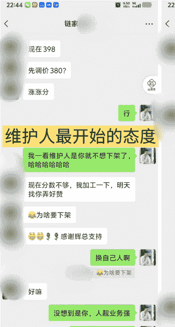
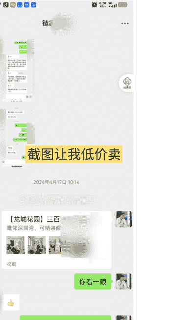
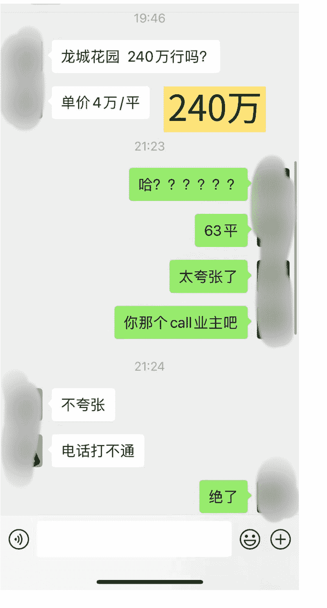
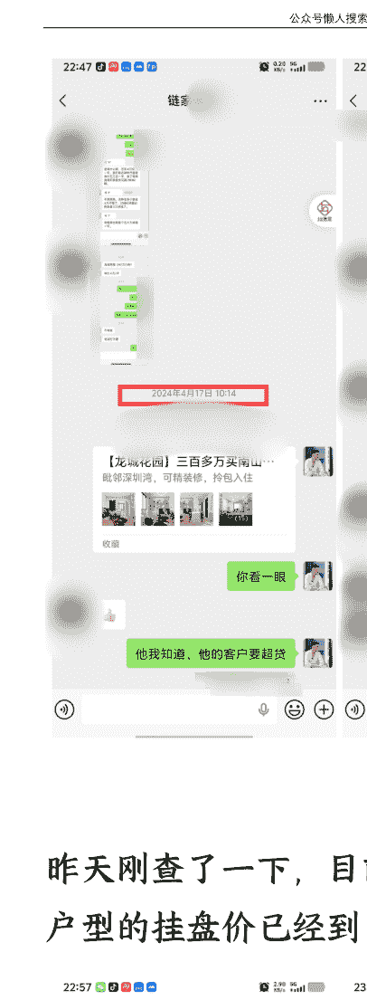
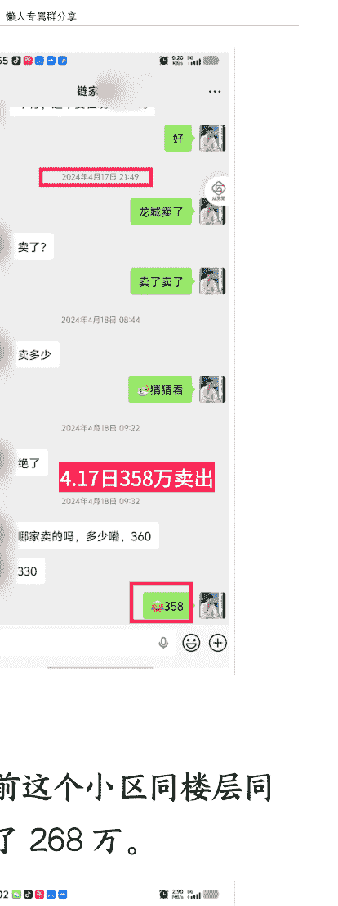
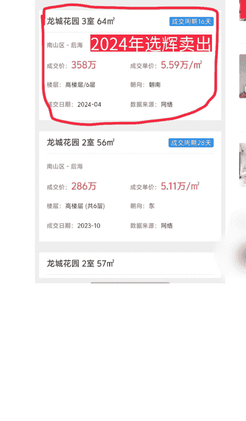
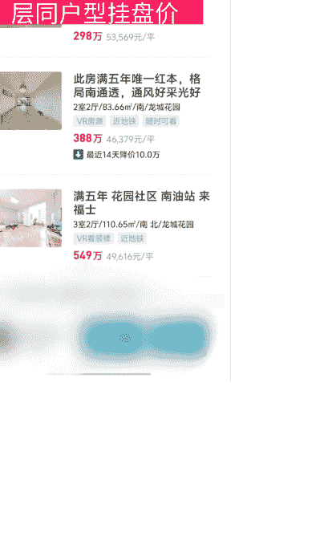

# 深度揭露「蓝海赛道」实况：卖房单边代理/二手房翻新再售
## 251108 生财精华

公众号懒人搜索，懒人专属群分享
公众号懒人搜索，懒人专属群独享
懒人微信：lazyhelper

大家好，我是连打游戏都要当“房产达人”的选辉。

今天想和大家聊聊：最近国内热度很高的“卖房单边代理”，实际情况到底是怎样的？

我是 94 年的，2016 年进入房产圈。这些年里，我赚过千万，也欠过几百万的债，最后还清负债重新起步——既体验过行业的疯狂，也熬过跌落谷底的绝望。

9 年时间，我已经成了卖房单边代理领域的教练，亲自操盘代售过 266 套房子：最高纪录是一晚上卖出 9 套，单套最多赚过 100 万。

我还在业内辅导了 1000 多位伙伴成功卖出房子，他们的“出坑周期”平均只要 30 天，也因此收获了不少好评。

1 / 30

去年卖房单边代理从上海火到了全国，但很少有多年业内人士出来聊聊“背后的真实情况”，所以我将分享：

- 卖房单边代理是什么？
- 以业内人的角度，什么人适合/不适合做这个行业？
- 这个行业有哪些常踩的坑？
- 我在这个行业遇到过什么样的卖房特殊案例？
- 怎么才能够找到很多中介帮忙卖房？
- 新人能成为成熟卖房操盘手的概率是多少？
- 如果你想转型到这个行业，你要做好哪些准备？

## 卖房单边代理是什么？

首先卖房是有买卖双方的，传统中介的作用是撮合双方完成交易，而卖房单边代理是指仅维护业主一方利益的人。

经济上行阶段的时候，房子是很容易出售的，业主只需要把房子挂在房产中介就可以，中介会自动去拉客户然后撮合交易。大家都会觉得，只要买了房子，就会上涨。

现在经济下行，有很多业主，房子是很难卖的。买家会觉得我现在买了，房价是不是还会继续跌。所以现在只有刚需的人在买房，并且成交难度是比较高的。

如果我们站在中介角度上来想，我的工作是没有底薪又没有社保，那我为了赚钱，肯定是看买方和卖方哪个更容易被说服，那我就对更容易说服的人做工作。这样我的成功率才会比较高，我就更容易获得这个钱。所以现在这种行情业主就容易被打压。

在这种情况下，我们卖房单边代理就非常被需要了，我们会代表业主的利益，全心全意帮业主卖房。其实卖房单边代理是一直都有的，只是最近才开始被大众看到。最开始的时候公域流量其实是珍妮老师在上海打出来了，被我这边找到了，我也开始对标来做了。

## 卖房单边代理&传统中介卖房有什么区别？

| 角度对比 | 卖房单边代理 (又叫做卖房管家) | 传统中介 (双边代理模式) |
| :--- | :--- | :--- |
| **卖房问题咨询** | 会从房东本人利益角度，全心全意帮房东解决卖房路上的卡点，并把房子卖出去。 | 会从中介本人利益角度，思考怎样撮合双方，才能快速把房子卖出去。 |
| **调研报告** | 有初始定价报告和每月市场调研报告 (因为市场是不断在变动的，所以每月都要调研并更新)。 | 没有时间为单一房东做调研报告，尤其是一眼看出来房东房子不好卖的时候。 |
| **定制房源营销方案 (一房一议)** | 为单个的房源做定制营销方案，并且给到房源带看反馈、汇总不同品牌中介对房子的反馈。 | 极少数传统中介会去思考给单个房源做定制营销方案，绝大多数中介每天在带人看房子，没有多余精力去专门为一套房子做定制营销方案。 |
| **带看反馈** | 极少数中介里的天花板会给到房东关于房子的带看反馈，大部分中介没有精力给到带看反馈，因为每天都要带太多客户看不同的房子了。 | (同上，传统中介大多无精力) |
| **屋况优化** | 专业人士帮忙做屋况优化，包括什么时候只要清理收纳，什么时候要换软装，仅仅在非常有必要的情况下，才会给房东安利“重新装修”。 | 极少数传统中介会帮房东做屋内打扫，但不会帮忙收纳，也没有时间给房东换软装。 |
| **装修建议** | (见屋况优化) | 部分中介和装修公司有合作，会极力推荐房东必须重新装修、房子才好卖出去。 |
| **宣传资料** | 会请专业摄影师给房子做拍摄，并且选择采光好的时间段，多拍一些照片。 | 没有专业摄影师，中介拍出来什么样就是什么样，没有时间专门选择特定时间段给房子拍照。 |
| **中介维护** | 会分析周边中介店情况，知道哪个中介手里有客户，哪个中介能力强，并且会花时间筛选出：需要重点维护的中介店，每 1-2 周拜访维护重点中介。 | 中介和中介之间存在竞争，中介不会为了单个房东的房子，而去重点维护另一个中介或者跨品牌、跨区域去维护某个中介。 |
| **线上管家** | 有线上管家 24 小时随时接听电话，并且把中介店挂牌情况记录清楚。含远程带看服务，包括：开门和回访。并且会邀请不同品牌的中介来实勘房源、邀约视频号、小红书、抖音等平台博主来拍摄。 | 由于中介之间存在竞争，所以掌管钥匙的 A 中介不一定愿意把钥匙给到 B 中介，影响 B 中介带看房源。有的中介因为管的房源太多了，所以没有时间去实勘房源，对房东房子没有印象，所以会把某些房东房子遗漏。 |
| **实勘与博主邀约** | (见线上管家) | 中介行业存在借薪制，甚至有的中介品牌不给中介发底薪，所以中介全靠开单赚钱，他们不一定会有时间、精力、金钱，拿来去重点留意某位房东的房子，并且去实勘房源。邀约不同平台的博主过来拍摄需要精力，有的博主不一定愿意拍摄，还有的博主开价成本高，而且如果邀约了不同平台博主帮忙拍摄，就把房源曝光量马上扩大了，如果房源足够优质，会加到中介之间的竞争激烈程度，导致中介之间相互抢单。中介也不想给自己增加竞争对手。 |
| **交易支持** | 包含谈判支持和房屋成交售后支持。 | 包含“撮合成交”支持。 |
| **谈判策略** | 比如：在谈判前摸清中介和买家的底牌，知道买家看过了多少套房子，对哪些房子比较满意，买家买房看重什么因素。继而反向做调查，摸清楚我们代理的房东的房子，和竞争对手的房源之间，有哪些优劣势。在谈判时，单边代理能站在房东利益，帮房东卖出更合适的价值。 | 也就代表：如果我不是「专业墙头草」，那就算我输。传统中介不维护买卖双方任何一方的利益，只要能成交就好。买家弱势，就重点瞄准买家。卖家弱势，就重点瞄准卖家。 |
| **售后支持** | 房屋成交售后有保障，有专业律师保驾护航。 | 关于房屋成交售后支持，之前有发生过：房东通过大品牌中介卖出去 1 套房，收了买家 100 万后，尾款收不回来了，所以找律师维权。就算找律师维权，大品牌中介最多是退中介费，但是「房东的房子要怎样拿回来？房东的尾款怎么收回来？」这得房东自己想办法。 |
| **项目管理** | 定期复盘：卖房营销过程中的思考，给到房东：卖房指南；中介合作说明书；卖房咨询百问百答等。卖房过程中的项目全部记录均有存档，包含：推广、空看、带看、约谈等环节。 | 心有余而力不足，真的没有精力做这些复盘。 |
| **参与服务人员** | + 核心人员：项目经理 + 其他人员：文案创意、摄影师、空间设计、线上管家、渠道维护、成交专家 | + 核心人员：中介本人 |

## 卖房单边代理常见的模式有哪些？

常见的模式一共有 3 种：

### 服务单模式

**简介：**

业主先交预付款（预付款一般为服务费的 50%）给代理人，代理人拿到预付款后开始做营销工作，触达客户。房子卖出后付尾款（剩余 50%）。代理人的收入 = 服务费。

假如以 500W 出售，服务费为 2%，则代理人收入 = 500 * 2%。

**收费标准：**

- 500 万以下~500 万房子：一般收取房屋成交价两个点服务费
- 500 万以上~1,000 万以下房子：收取房屋成交价 1.5 个服务费
- 1,000 万以上的房子：收取房屋成交价一个点服务费

**适合范围：**

- 业主要有高的认知，但比较忙，认为卖房这件事情需要委托给其他人，帮自己节约时间去完成交易。
- 同时也想要找到专业的代理人。

**流程：**

1.  **模式确认与调研启动**
    若业主接受卖房单边代理服务模式，需先支付约 2000 元的调研费；确认付费后，我们将开展房屋调研并出具专业调研报告给到房东并讲解。
2.  **价格匹配与签约**
    调研报告完成后，若我们核算的价格在业主可接受范围内，且我们具备成功售出的把握，则与业主安排签约。
3.  **服务费收取与服务启动**
    签约阶段，我们会收取房价 1%-2 个点 的服务费；业主确认费用标准后，我们正式承接该房屋的代售工作并推进后续流程。

**费用：**

预付款是服务费（房价的 2%）的 50%。

例如：房子价格预计是 500 万，刚开始收 2000 块钱调研费，服务费是 10 万（500 万*2%），那就需要收取预付款 5 万（服务费的 50%）来干活，但已收取 2000 调研费，只需要再收 4.8 万 (50000-2000)。

**优势：**

- 作为卖房单边代理操盘手，本质上是卖服务、无需操盘手承担金钱成本和风险。
- 作为业主，他只需要付出金钱，就可以委托别人把这个房子这个事情全部搞定，买到卖房服务。

**劣势：**

- 如果作为卖方操盘手，服务费利润其实是所有模式中最少的。虽然没有付出金钱成本，但因此会付出时间和精力操盘。
- 另外跟业主一定要时刻保持沟通。因为有时市场行情会变动，有时候客户来了后价格达不到业主预期，业主不愿意成交。这个过程中，我们需要和业主进行沟通，传达多方真实市场反馈，辅助业主做好决策。

### 差价单模式

**简介：**

代理人预付定金给业主，业主以设定价格（例如 500W）将房子委托给代理人出售，若高于 500W 价格出售后，业主获得 500W，剩余价值归代理人。代理人收入 = 房子出售价格 - 业主委托价。

假如 550W 出售，代理人收入 = 550 - 500。

**适用范围：**

- 房子有一定溢价空间，比如美化反差、产权瑕疵、以及改造空间，例如：房子是两居，但可以改成三居，或者是说能够扩出个阳台。
- 卖房单边代理人对片区熟悉，了解市场情况和客户接受度，才会接受客户的委托。

**流程：**

对于符合要求的房屋，我们会先向业主支付款项，再开展房屋改造：
举例说明：我们与业主协商支付 5-10 万元定金，业主将房屋委托给我们 3 个月;3 个月内我们完成房屋销售后，会按照约定的委托价 (例如 500 万元) 向业主结算全款。业主无需承担中介费、营销费等任何费用，只需实收约定的 500 万元即可。

**费用：**

- 定金：由双方协商确定
- 委托价：通常略低于市场价 (例如市场价 550 万元时，委托价会相应调低)

**优势：**

- 对单边代理操盘手：可获得可观的利润
- 对业主：无需承担任何风险，只需按约定实收款项

**劣势：**

- 对单边代理操盘手：需精准把控房屋情况——因需先行垫付资金，若房屋未能顺利售出，已支付的定金及改造装修成本将全部由自身承担。

### 服务 + 溢价模式

**简介：**

业主需先行支付预付款，金额通常为服务费总额的 50%;随后双方共同协商确定房产出售最低价 (即基准价，例如 500 万元)。若房产最终成交价格超出该基准价，超出部分将由代理人与业主按协商比例 (如 5:5) 进行分成。代理人在收到预付款后，立即启动营销工作，积极触达潜在客户。待房产成功售出后，业主需向代理人支付剩余的服务费尾款。

代理人的收入由两部分构成，计算公式为：代理人收入=基准价×服务费比例+(实际出售价 - 协商的出售最低价)×分成比例 (如 0.5)。以具体案例说明：若房产协商的出售最低价为 500 万元，服务费比例为 1.5%，最终以 550 万元成交，则代理人收入=500×1.5%+(550-500)×0.5。

**适用范围：**

- 业主挂牌时间长，有一定的溢价操作空间，或是新手进阶。

**流程：**

首先，我们会基于房子的基本情况，调研房子的价格 (例如房子价值 500 万元);随后，双方协商以该价格 (如 500 万元) 作为基准价，确定超出基准价部分的分成比例 (比例由双方协商)，且此模式下的服务费会略低于普通服务费。

**费用：**

- 定金：由业主向代理人支付预付款;
- 基准价：由双方协商达成;
- 超出基准价分成比例：由双方协商达成。

**优势：**

- 对卖房单边代理操盘手而言：无需自行垫付资金，且谈判水平越高，可获得的利润空间可能越多;
- 对业主而言：大幅提高操盘手积极性，并且能够获得一个超出预期售价。

**劣势：**

- 对卖方操盘手而言：固定利润相对较少，且需具备房产改造能力与专业谈判能力。

## 什么人适合来做这个行业？

有些圈友可能想转行来这个行业，那么什么人适合来做这个行业呢？

### 要对房子感兴趣

**核心特质：** 对周边的房子比较熟悉，或者喜欢买卖房子，对房子天然有兴趣。

**适配逻辑：** 因为有兴趣会花更多的时间和精力来研究房产 —— 比如主动了解同小区成交数据、周边配套规划、户型优缺点，进而精准判断房产价值，为业主制定合理的基准价和出售方案，这是做好行业的基础。

### 有犯懒思维

**核心特质：** 没有这么规矩，人比较灵活，最好是有“犯懒”的想法。

**适配逻辑：** “犯懒”不是偷懒不做事，而是拒绝按部就班的无效努力，思维会更活跃——能观察到常规流程中的差异，进而找到更高效的解决方案。

**补充说明：** 不排除有些人既不犯懒又头脑灵活，但这类人很少见，“犯懒思维”反而更符合行业对“灵活解决问题”的需求。

### 喜欢分析别人生活居住习惯

**核心特质：** 喜欢分析“别人为什么会住在这里”，研究这类人群有什么特性，以及该区域相比其他地方有什么优势。

**适配逻辑：** 能精准匹配客群需求——比如发现“互联网从业者”关注小区配套和安静度、“三代同堂家庭”在意房间数量，进而把房产卖点和客户需求对应，提升成交概率，还能为业主争取更高溢价。

如果你比较喜欢房子，同时你的思维比较活跃，你想要挑战帮别人卖房或者是自己家有房子来卖，其实都蛮适合来尝试这个。

## 什么人不适合做这个行业？

以下这些人不适合做这个行业，包括：

### 行动力差的人

**核心原因：** 房产单边代理操盘需要主动推进多环节工作——从调研房产价值、协商基准价，到启动营销、对接客户、谈判成交，每一步都要“主动出击”。

**弊端：** 行动力差会导致调研拖延、客户跟进不及时、营销滞后，错过卖房最佳时机，还会降低业主和客户的信任，最终影响自身收入。

### 希望赚短平快钱的人

**核心原因：** 行业收益不是“快速兑现”——从营销到成交，要经历客户筛选、多轮谈判、手续办理，周期较长；且溢价分成依赖“房产卖高价”，不是快速成交就能赚大钱。

**弊端：** 会因急于成交放弃挖掘溢价空间，甚至劝说业主降基准价，违背“为业主争取高收益”的核心目标，长期难以持续盈利。

### 贪心的人

**核心原因：** 行业收益需“与业主共赢”——代理人收入是“基准价服务费 + 溢价分成”，要平衡自身收益和业主利益。

**弊端：** 过于贪心可能会刻意压低基准价赚更多分成，或隐藏额外费用，导致业主不信任、合作破裂，甚至影响行业口碑，断送长期发展。

### 部分传统中介

这一点可能有的圈友不太能理解，原因在于：

**核心目标相悖：** 传统中介习惯打压业主价格，把房子卖出去 (核心是快速成交赚佣金)，本质上对房子没有太大兴趣；而本行业要为业主争取高收益，需主动挖掘房产溢价，两者目标相反。

**从业动机缺乏热爱：** 大部分中介步入行业是因为佣金高，或没有更好的工作机会，很少有特别热爱房子的；而本行业需要主动研究房产，缺乏兴趣会导致不愿深耕，无法精准判断价值和溢价空间。

**思维固化：** 中介有一套固化的培训体系，会把带看、沟通、成交等环节默认为固定模式（例如常对业主说“姐，你要把价格往下面再调一下，你看上一套成交价是多少”），觉得“价格到位房子就能卖掉”；而本行业需要灵活创新，思维固化会限制发展。

## 这个行业有哪些常踩的坑？

新手刚接触房产单边代理操盘行业，难免会担心遇到各种“坑”。但实际上，这个行业最常见、也最让新手头疼的坑，就是拿了房却卖不掉。

不管是接“服务单”（业主支付预付款，按服务流程推进），还是接“溢价单”（按基准价 + 溢价分成盈利），新手在前期不熟悉市场、对房产价值判断不精准的时候，很容易出现“接了房却卖不出去”的情况。

举个实际例子：前段时间有个刚入行的伙伴，接了一套房的代理操盘，但最后始终没能卖掉。追根究底，问题出在他对这套房子的信息判断不准——前期调研数据时不够深入，很多关键信息都没摸透，导致后续制定的出售方案和定价策略偏离市场需求，自然难以吸引买家。

对我们普通操盘手来说，调研房产数据有个关键原则：每一套竞品房子都要实地去看，不能只靠网络上的简单数据下判断。要知道，网络上的数据往往存在滞后性，甚至可能有误差，比如部分挂牌价并非真实成交意向价，仅靠这些数据根本无法准确掌握市场行情。

正确的调研方法是：主动充当买家，去获取真实的成交价和竞品情况。只有站在买家的角度，我们才能知道中介会优先推荐哪几套竞品房子，进而对比分析“我们代理的房子和这些竞品到底差在哪里”——是户型不如人、装修跟不上，还是价格没有优势。更重要的是，当我们以买家身份沟通时，中介才会愿意讲实话，把真实的市场情况、成交难点、买家偏好等关键信息透露给我们；可如果我们以卖家身份咨询，中介大多只会说“现在房子行情不好，你得把价格往下调一调，看看别人家的房子都卖什么价”，根本得不到有价值的参考信息。

所以，给新手的起步建议是：先从服务单做起。服务单的核心是业主先支付预付款，我们按流程推进营销、对接客户等工作。即便最后房子没能卖掉，我们只需要把预付款退回给业主就行——虽然前期投入了时间和精力，但这个过程能让我们熟悉卖房全流程，积累与业主、中介、买家沟通的经验，还能在调研、推广中加深对市场的理解，为后续接更复杂的单子打下基础，远比一开始就接高难度的溢价单、因卖不掉房打击信心更稳妥。

## 我在这个行业遇到过什么样的卖房特殊案例以及真实卖房故事？

卖房行业常会遇到各类特殊案例，每一个都需要针对性的解决方案来挖掘房子潜力、提升成交率。

### 产权续期案例

深圳龙城花园部分房源原本仅 10 年产权，我接手后通过合规流程完成产权升级，将其变更为 70 年产权。这一调整让房子在同小区中形成核心竞争力，实际使用率也相应提升，大大降低了购房者的顾虑，让房源更易被市场接受。（房屋可贷款年限和产权剩余期限）

### 复杂产权协调 + 改造案例

另一类高难度案例中，房源是回迁房且无房产证，业主还因欠债牵扯官司。我先联合律师介入调解，厘清法律关系并成功协助办理产权证明。随后根据户型结构进行优化改造，将原本的一房格局升级为 1 房 1 厅 1 卫，充分释放房子的居住优势。最终在未举办开放日的情况下，一次性促成业主手上 5 套房源的成交。

### 分享一个真实的卖房故事（吃瓜番外篇）

深圳龙城花园有套顶楼步梯房子，之前的业主一直被是周边的中介打压价格，价格被打压到 300 万，业主一直不愿意。

后来我找上业主，和业主签订 313 万委托价，业主本人实收 313 万，房屋的营销费，美化费，中介费由我这边来出。

业主已经把房子挂在贝壳了，我接手后，直接用原有房屋维护人，因为换人需要时间我也来不及。

这个维护人也积极主动，说干啥就干啥。

直到我把所有的卖房准备工作做完之后，这个维护人的店长让维护人开始来找我做工作，说有买家出价 240 万，让我这个价格卖掉。

截图部分内容（中介维护人给我发的她和其他同事聊天）：

我不接受这个出价，因为我深知这个房子的价格远不止这一些，这个价格不合理，好像把我当普通业主了。

第 2 天，我就把这个房子以 358 万的价格卖掉。

如果这个业主听了所谓的链家 M9 的建议，直接损失 73 万（313 万 -240 万）。

昨天刚查了一下，目前这个小区同楼层同户型的挂盘价已经到了 268 万。

## 怎么才能够找到这么多中介帮忙卖房？

想让房子快速成交，核心要扩大房源曝光度，而“联动更多中介帮忙推广”是关键手段。

这一点我曾和珍妮老师在深圳有过线下面聊。她当时特意问我：“业内常见的情况是，在房屋开放日（可以理解为‘中介卖房派对’）邀请到几十名中介来看房，为什么你们能做到邀请上百名甚至几百名中介来看房？”

接着珍妮老师提到，业内同行都会做不少动作拉近和中介的关系，比如“给中介送水果、送奶茶，请中介吃饭，设中介卖房奖金，专门和中介店长搞好关系”等等。我当时给出的回答，是她此前从未想到过的思路。

### 核心操作：找准中介中的“关键节点”

要撬动数百名中介参与，关键不是盲目撒网，而是找到中介群体里的核心力量——不一定是中介店长，而是“人缘最好、号召力最强”的从业人员。

找这类人的方法很简单：比如我们带水果去中介门店陌拜时，观察谁会主动把水果分发给同事。主动服务他人、乐于分享的人，往往在中介圈子里更受认可，号召力也更强，能帮我们快速扩散看房信息。

### 降低合作门槛：让中介轻松参与

除了找对人，还要让中介觉得“和我们合作无压力、够愉悦”。

市面上很多房屋开放日，会要求中介看房前穿鞋套、签字登记，步骤繁琐容易让人反感。我们直接省去穿鞋套环节，等“中介卖房派对”结束后，另雇保洁阿姨来打扫卫生，让中介兄弟们能吃得开心、沟通得尽兴，反而更利于后续推进卖房事宜。

### 合作核心：把中介当真正的合作伙伴

这些技巧的本质，是把中介当成平等的合作伙伴，而非单纯的“推广工具”。

中介行业常难获得足够的肯定与尊重，但我们清楚，大部分客户都需要中介带看、介绍房源。所以我们始终保持大气：中介费给到位，额外设置奖励，房子一成交就立刻结算费用、兑现奖励，从不拖延。

当然，行业里难免有中介存在骗代看费等情况下，这是需要接纳的行业现状。我们的应对方式是：遇到两三次类似情况后，直接将这类中介拉黑，避免后续不必要的损失。

## 新人能成为成熟卖房操盘手的概率是多少？

卖房操盘手的从业者中，不少是想转型的创业老板，或是希望增加收入的自由职业人。

### 入门门槛低，成长速度快

只要执行力够强、对房产本身感兴趣，且愿意投入时间，大部分人从行业小白成长为老手，基本一年就够了。

我们过往有很多学员，仅通过卖掉自己的一套房子，就摸清了卖房的全流程——从市场调研、房屋美化、房屋营销到谈判签约，每个环节都能熟练掌握。

### 专业培训 + 实操，提升成交概率

我们会提供内部专项培训，拆解卖房全流程的核心要点。如果能实际操作 3-4 套房源，成交概率会远高于同行。

毕竟市面上大部分卖房者，既没有相关培训加持，也缺乏实操经验，甚至不知道卖房前需要做市场调研和房屋美化。

### 常见行业现状：业主普遍忽视基础准备

现在很多业主卖房，都是房子保持原样直接挂牌，完全没意识到“基础准备”的重要性。他们甚至不知道，卖房前需要先清空多余杂物、把房子彻底打扫干净，才能更吸引购房者。

## 如果你想转型到这个行业，你要做好哪些准备？

如果想要转型到这个行业，需要做好心理准备和金钱准备。

### 心理准备：耐住性子，全力投入

预留 1 年磨练期：至少需要 1 年的行业经验积累，才能相对“出师”。以一线城市深圳为例，房源普遍 500 万左右，一单佣金约 10 万，若按最长 3 个月卖出一套的节奏，一年最低操作 4 套，收入约 40 万；小县城房源总价较低，一年收入大概在 20-40 万。不过收入对应的是时间高度集中——接下业主委托后，大部分精力都会投入到这套房源上。

体力要跟上：日常需要高频跑中介门店，一天跑十几家是常事，非常消耗体力。

保持空杯心态：要全心投入行业，有强烈的学习决心，多看多学各类房源，积累实战感知。

足够细心：卖房过程中涉及诸多细节，只有精准把握每个环节，才能提高成交概率。

### 金钱准备：按需储备，稳步进阶

- 服务单：基本不需要启动资金，适合新手入门。
- 差价单：需预留 5-10 万资金，用于支付给业主的相关款项。

建议所有新手先从服务单做起，把卖房全流程跑通、积累足够经验后，再尝试差价单。如果一上来就操作差价单，缺乏经验支撑，很容易出现亏损。

同时，也推荐大家可以去看的两档内容，方便更好了解卖房单边代理这个行业。

电影：《银行家》

观看地址：哔哩哔哩，搜索#银行家#

## 综艺节目：《百万美元豪宅》

观看地址：哔哩哔哩，搜索#百万美元豪宅#

## 附录：美国卖房单边代理 (二手房翻新再售) 从业者类别、收入水平及中国发展现状

在美国，从事卖房单边代理的人群较为广泛，主要包括以下几类：

- 华人装修从业者：许多早期华人移民，如福建籍移民，起初从事餐饮业，后来转向装修行业。他们积累经验后，凭借对装修流程的熟悉和华人社区的客源优势，参与到二手房翻新再售业务中。

- 小型投资者：包括一些“公司难民”，他们离开朝九晚五的工作，将二手房翻新再售作为主业；还有热衷于房地产投资的 Z 世代投资者，他们富有创新思维，善于利用互联网等渠道获取信息和资源；此外，还有婴儿潮一代，通常是夫妻搭档，他们希望通过翻新房屋改善社区环境，同时获取投资收益。

- 专业房地产投资者：如 Paragon Principal Capital 等投资机构，会推出相关项目，通过与投资者股权合伙，利用其运作系统、融资渠道等进行规模化住宅收购与翻新，这些翻新后的住宅可快速出售获利，或作为租赁物业长期持有。

- 有相关技能的个人或家庭：例如一些动手能力强、对装修感兴趣的人，像底特律的一对夫妻，他们本身经营家具修复公司，擅长变废为宝，便买下破旧房屋，亲自进行翻新再售。他们通常会尽量利用回收材料以降低成本，同时也享受翻新过程中的成就感。

- 房地产相关专业人士：如房产经纪人，他们熟悉市场行情和交易流程，能精准把握房屋价值和市场需求。此外，一些建筑师、设计师和施工承包商等，凭借专业知识，能更好地规划翻新方案，控制施工质量和成本，也会参与到二手房翻新再售业务中。

在美国，新手若每年成功翻新转售 1 至 2 套房产，年收入可能在 3 万至 5 万美元左右，约合人民币 20 万至 35 万元。而经验丰富的从业者，若每年能完成多个项目，尤其是在洛杉矶、纽约等房产价值高、需求旺盛的地区，每套房子利润可达 10 万美元以上。若一年翻新 5 套房子，每套获利 15 万美元，年收入则可达 75 万美元，约合人民币 525 万元。

中国房地产市场正从增量放缓转向存量主导，即便市场处于调整期，中国卖房单边代理赛道依然有着广阔发展空间。这既是时代赋予的机遇，也需正视任重道远的挑战，将“好房子”的品质追求融入服务全流程，共同决战存量时代的新蓝海。

## 致谢

感谢生财有术，提供了一个这么好平台，我的合伙人在生财平台潜水多年了，她每次遇到相关信息就会转发给我，我们也因此在这个圈子，遇到了很多对的人，并且有了合作机会。

感谢珍妮老师，在卖房单边代理公域搞流量给了很多的建议，让我们把卖房单边代理这件事情走向了大众，也让更多人知道这个行业。

## 最后，安利小懒的付费群:

### 懒人专属群 (介绍)

💅懒人专属群持续更新中，已持续运营 6 年，整理超 3000 份各类精选付费文章&年费社群干货，全部开放下载。

本资料为付费群内部分享，仅供真实有需要的朋友查阅🙇

### 懒人专属群更新记录:

https://lazy2025.top/blog/record2

### 懒人专属群更新记录 (需梯子，备用):

https://lazybook.fun/blog/record2