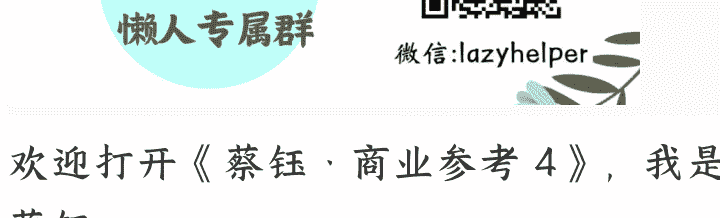

# 156 | 贵茶集团：用茅台的逻辑做抹茶

整理：公众号懒人搜索，懒人专属群独享

懒人微信：lazyhelper

欢迎打开《蔡钰 · 商业参考 4》，我是蔡钰。

一个让人意外的商业变化正在发生：全球最大的抹茶生产国，已经不是把抹茶当成国礼的日本，而是中国。

2025 年，中国抹茶总产量预计超过 5000 吨，占到了全球抹茶产量的一半以上。全球每消费 6 杯抹茶饮品中，就有 1 杯来自中国。而就在 10 年前，中国抹茶产业还几乎不存在。

这背后发生了什么？

答案指向一个你没听说过的企业：贵州的民营企业，贵茶集团。

2024 年，这家企业生产抹茶 1200 吨，出口量达到了中国第一、全球第二。你在星巴克喝的抹茶拿铁，在盒马买的抹茶布丁，在西域美农吃的抹茶面包，原料很可能都出自贵茶。

贵茶怎么把抹茶产业做起来的？恰好，《商业参考》的老朋友黄碧云老师近期去贵茶集团做了次调研，我们结合她的见闻，给你讲讲这个有意思的故事。

## 困境：七万茶企打不过一个立顿

贵茶投身抹茶产业的机缘，源自于中国茶产业的一个著名的困境：“七万茶企打不过一个立顿。”意思是，中国作为产茶大国，但所有茶叶企业的产值加起来，还不如英国茶叶品牌立顿，而英国偏偏还是一两茶叶都不产的国家。

这个困境，贵茶集团早期也有感受。它在创立之初，主营业务是基于贵州的茶叶种植能力做原叶茶。贵茶当时年收入也做到了 3 个亿，但几乎没有利润。

为什么没利润？因为原叶茶没法标准化、上规模。每一批茶叶的口感、香气都不一样，贵茶得养着庞大的销售团队，年复一年地跑茶馆、跑零售终端，一家一家地推销铺货，效率非常低。

怎么才能把茶叶给标准化？这个行业困境，也是萦绕贵茶和董事长蒙祖德多年的超级问题。

## 转机：一张抹茶订单

2013 年，转机来了。贵茶集团的一个老客户询单时问起来：“你能不能生产抹茶，给我往欧洲市场供货？”

这个老客户，是一家规模巨大的全球连锁饮料品牌。我们就不点名了。

带着真金白银的订单提这种问题，那必须能做。于是，贵茶开始研究抹茶产业。

一研究，发现了几个关键信息点：

- 第一，抹茶市场空间巨大。

目前全球咖啡市场年消耗量是 1000 万吨，而抹茶年消耗量还不足 1 万吨。如果咖啡市场中的 1% 的消费力转移给抹茶，市场规模就能达到 10 万吨。相比当下，就是 10 倍的增长空间。

凭什么认为抹茶能挤占咖啡市场呢？贵茶集团发现，过去几十年，日本通过旅游业，已经把欧美和中东消费者给教育好了。每年去往日本旅游的全球游客高达 3000 万，人们在日本旅游时，一定会接触到抹茶文化，也会把抹茶产品当作礼物，往本国带。

在如今的共识里，抹茶跟咖啡一样能提神，同时还不怎么影响夜间睡眠，对孩子来说，也没有食用禁忌。

加上抹茶粉冷热泡都可以，人群限制和场景限制都比咖啡要少。所以最近十年，欧美、中东关注血糖的人群、重视健康的人群，都开始把抹茶跟瑜伽、运动结合在一起，当作时尚消费组合来看待。

- 第二，在中国做抹茶有现成的文化优势。

抹茶本身来源于中国，发展抹茶产业，可以算是产业回归，甚至文化回归，容易得到地方政府的支持。

第三，也是最关键的一点，贵茶集团在贵州一摸排，发现全省 700 万亩茶园中，近 80% 的茶树品种，都适合用来制作抹茶。

这下，贵州绿茶的第二发展曲线找到了。

2017 年起，贵茶集团投资 6 亿元在江口县建成占地 340.79 亩的贵茶产业园，正式进入了抹茶行业。

## 突围：用茅台的逻辑做抹茶

好，进到关键环节了：抹茶怎么做标准化？茶叶的口感和品质各不相同，磨成茶粉难道就马上统一了吗？

这个问题，贵茶集团在贵州省内找到了一个现成的参照对象：茅台集团。你肯定记得，茅台也是把粮食发酵这种非标工艺，给转化成一瓶瓶口感统一的酱香白酒的。

贵茶集团的抹茶标准化之路，分两个关键步骤。

第一步，解决种植端的标准化问题。贵州山地地形，农户居山而种，每个人的茶园都是分散的，老李家山头跟老刘家山头的日照时长不同，老张家茶园跟老王家茶园的种植习惯也不同，怎么统一？

贵茶想到了联盟的方式。2015 年，贵茶集团成立了“贵茶联盟”，跟贵州全省的 61 家茶企签约包销，以此为条件，把 14 万亩茶园都改造成了欧盟标准茶园，深入介入到茶叶种植链条里，把用什么有机肥、能不能打农药，都管理起来。

更好玩的是，这些茶园里用的有机肥，都是用茅台镇的酿酒酒渣发酵而成的，这在贵州本地又建构了一个生态循环。

第二步，解决加工端的标准化问题。联盟企业把茶叶初加工成碾茶，也就是专做抹茶的原料茶叶，然后要进行两次质检，符合出口欧盟的标准，才能卖给贵茶集团，进入抹茶加工流程。

到这一步，贵茶就完全借鉴了茅台的拼配逻辑。

你肯定记得，一瓶茅台酒，是要用若干种不同年份的基酒勾兑而成的。贵茶也沿用了这个逻辑。它把所有合格碾茶收回工厂后，先在冷库里存放至少半年，让它充分醇化。

这之后，贵茶的生产线再把不同产区、不同等级、不同风味特征的碾茶原料，当成抹茶的“基酒”，按照一定比例拼配起来，整体研磨，制造一批批风味和口感统一的抹茶产品。

你发现没有，贵茶这套打法对应的信念是：规模等于稳定，稳定等于市场。它不追求小众稀缺，就追求稳定品质；不做小而美，就做大而强。

这套抹茶打法，算是在多年以后，给“七万茶企的立顿难题”摸到了一个答案。从 2019 年开始，贵茶集团的欧标抹茶开始出口欧美市场，往立顿的大本营去了。

## 比对：贵州的产业化与日本的小而美

贵茶趟出来的这条路，让贵州省政府相当开心：这不但解决了近 10 万茶农的增收问题，还帮贵州扶起了一个“隐形冠军”产业呢。所以过去这几年，贵州政府也在把抹茶行业当作省级零售工程来推动、宣传。

这两年，贵州省在重点打造一个叫“梵净抹茶”的品牌，要做“区域公共品牌 + 加工生产 + 深加工延伸”的产业布局。2025 年，贵州一些县市，甚至给本地商户们发一家 15 万元的补贴，鼓励他们加盟“梵净抹茶”品牌的门店。

贵茶所在的铜仁市，也专门出台了一份《铜仁市做大做强抹茶产业三年行动实施方案（2024—2026 年）》。铜仁市提出了抹茶产业“一十百千万”发展目标：培育 1 家世界级龙头企业，10 家规模以上关联企业，100 条碾茶生产线，1000 个种植家庭农场，10000 个应用场景，建设 10 万亩原料基地。

你看，贵州对抹茶产业的期待，接近于“下一个茅台”。

那么，贵州把抹茶产业搞得热火朝天的同时，抹茶行业最大的玩家日本在干什么呢？

好巧不巧，日本在抹茶产业上，走的也是小而美的路线。抹茶企业们各自为战，喜欢讲小茶园、小产地的独特故事。这虽然能拉升自家品牌和产品的溢价，却导致整个日本抹茶行业的品质和价格都没法稳定下来。再加上这两年通胀和日元贬值，劝退了不少长期采购商。

所以这两年，不少日本抹茶采购商也到中国来找寻原材料供应商，也成了贵茶的客户。更好玩的是，贵茶还在日本收购了一个本地抹茶品牌，专门跟有“日本执念”的欧美客商合作。

到了 2024 年，贵茶的 1200 吨抹茶产品，已经卖到日本、美国、加拿大、新加坡、中国香港等 50 多个国家和地区了。按照贵茶当下的基地扩张计划，2027 年抹茶产能就能达到 6000 吨，直接超过日本全国的抹茶产量。

## 总结

贵茶集团的故事让我萌生的最大感慨是，中国产业链确实挺惊人的。一个省只要发起力来，几年内就能对一个国家的旗舰产业实现产能替代。

当然，贵茶集团现在也有自己的挑战。90% 的业务还是原料出口和原料供应，在 C 端品牌认知上还不够强。很多消费者，甚至不知道抹茶可以是中国制造的。

但这可能也不是坏事。做好 B 端的原料供应商，让更多品牌用上高品质、低成本、供应稳定的抹茶原料，这本身就是很大的价值创造。

从这个角度看，贵茶集团的故事，其实也是中国制造业转型升级的一个缩影。用系统性的效率提升，实现产业突围。

你的身边、你的家乡，近几年有没有发生类似的变化？在某个传统领域，用产业升级实现产业替代？也期待你的发现和分享。

再见。

最后，安利小懒的付费群：懒人专属群 (介绍)

🔖懒人专属群持续更新中，已持续运营 6 年，整理超 3000 份各类精选付费文章&年费社群干货，全部开放下载。

本资料为付费群内分享，仅供真实有需要朋友查阅🤫

懒人专属群更新记录:

懒人专属群更新记录 (需梯子，备用): https://lazybook.fun/blog/record2