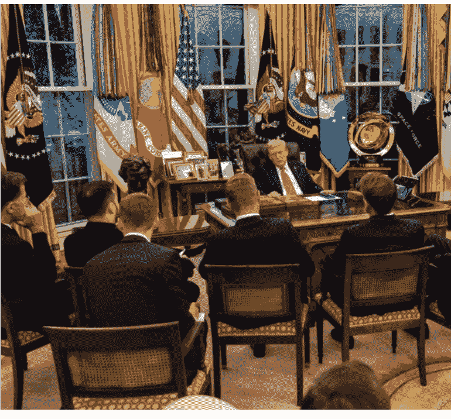
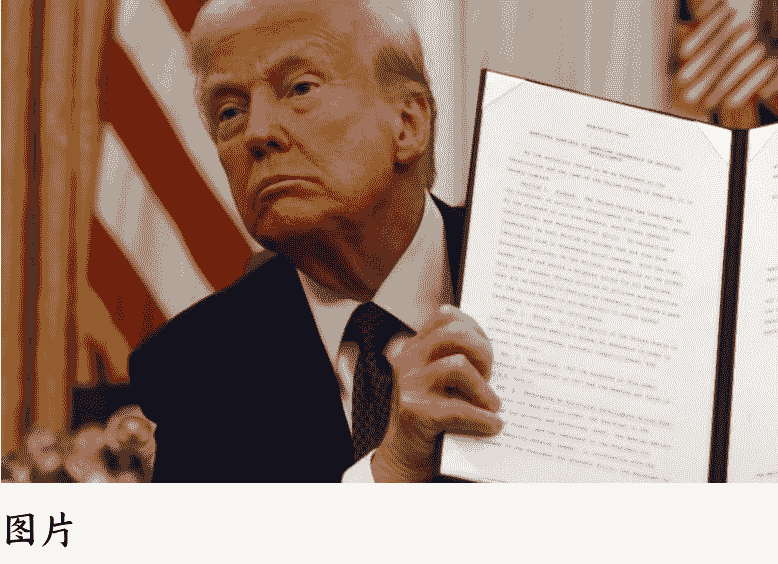
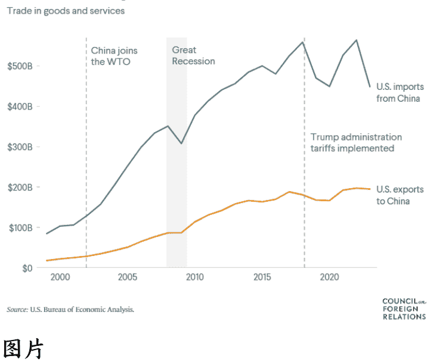
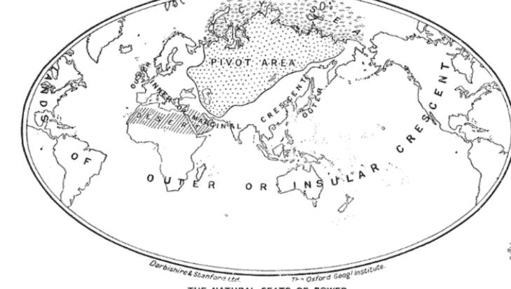
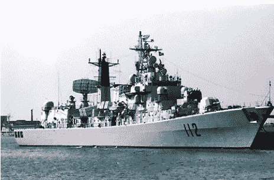

# 当中美都拥有底线思维

251022 江宁知府付费

整理：公众号懒人搜索，懒人专属群独享

懒人微信：lazyhelper

## 小引

在中国人眼中，美国是全球霸权，欧洲、日韩等是被美国“收割”的对象，因此许多朋友不理解为什么欧洲和日韩如此依恋美国。

其实换到欧洲人和日本人眼中，他们会认为自己也是“西方霸权”的一部分，是以美国为首的西方霸权团队里的重要一员——他们会恨特朗普，但不会恨美国。

在对未来世界秩序的预期中，发展中国家和发达国家分歧巨大。中国长期以来都将“多极化”作为未来世界的美好愿景向外宣传，这一叙事得到了大多数发展中国家（包括印度）的支持，大家认为多极化意味着权力分散和平等。

发达国家却不这样认为，它们觉得“多极化”将带来混乱，甚至觉得这一概念根本就是中国拉拢其他地区强的外交许诺。

日本、法国、德国、英国等国体量（领土和人口）较小，真到了“多极化”时代，它们很可能竞争不过印度、俄罗斯等国。

既然无法成为“多极化”里的一“极”，那对于事实上拥有特权的欧洲、日本、加拿大、澳洲等发达国家来说，最大的心愿就是尽可能维持现行秩序，把希望寄托在美国老大哥身上。

换言之，西方对于未来国际秩序的优先级排序是“美国（西方）单极霸权 > 两极格局 > 多极化”，它们的底线思维就是紧紧团结在美国麾下打一场新冷战，除此之外别无选择。

## 正文

2020 年的疫情、2022 年的俄乌战争和 2025 年特朗普关税，三件事情表面上看似乎没有太多共同点，但实际上都导致了同一个结果——底线思维成为各国决策者的主流，政治力量开始强力介入经济活动。

国家和家庭类似，往往是一代人积累财富，第二代人享受财富，第三代人将财富挥霍殆尽。

冷战结束后，美国国内萌生了一种“制造东西不再重要”的错误理念，经济学家和企业家们认为工业离岸外包将为美国消费者带来更便宜的商品，并在高价值服务领域中获得更好的就业机会。

## 向谁做离岸外包呢？

随着苏联解体，传统势力范围的想法被自由国际主义理念所替代，民主共和两党都认为阵营划分已经是过时的产物，后冷战时代需要一个向绝大多数国家开放的新世界秩序，否则赢得冷战还有什么意义呢？

于是在此后的全球贸易体系规划中，美国作为“最终消费者”运作，其他国家则可以从它那里吸收盈余。这套体系从一开始就是这样设计的，它以让美国人充分享受冷战获胜红利为首要出发点，希望用大量廉价进口商品提高普通美国民众的生活水平，产业、大国竞争等维度的考量很少。

### 为什么 90 年代是最好的 10 年

库尔特·安德森
2015 年 2 月 12 日

《纽约时报》的一篇文章，美国人在怀念 1990 年代。

每当有经济互动时，就会出现赢家和输家，全球化的好处不是平等分享的。二十年经济全球化对美国最大的影响有两个：其一是掏空了相当一部分传统制造业，其二是塑造了一大批“失意人群”。

现在特朗普的修正方案很简单——抬高各国产品进入美国市场的门槛，进而刺激制造业回归。特朗普团队认为，短期内一些消费品确实会变得更加昂贵，企业将遭受供应商或客户流失的损失，再工业化也将耗费大量的新投资（所以才不断从欧盟、日本、韩国那里要钱），这意味着消费有所减少。

但这些结果是美国“输掉全球化竞争的代价”，现如今必须从已经掉进去的坑里奋力爬出来。反之，拒绝承认现实并坚持全球化运行的时间越长，需承受的代价就越高。

在美国人眼中，全球化尝试失败的一个标志性征兆为中国综合实力的迅速增长——只要中国 GDP、产业实力和军事实力不断接近美国，美国就会一直处于暴躁状态，试图求变。

简而言之，美国对当前国际秩序的不满很大程度上归结为对中国全球经济地位和地缘政治地位的震惊，华盛顿认为这已经威胁到该体系的核心支柱，即后冷战时代美国一家独大的格局。

从这个意义上讲，中国其实已经重塑了国际体系，只不过是借美国之手完成的。

后冷战时代推行经济全球化的一个根本性假设是“美国一家独大”，不再有同体量的竞争对手。

特朗普长期秉持一种观点——美国全球领导地位的成本大于收益，这让美国背负了全球治安的负担，并使盟友能够扮演“搭便车”的傻瓜式角色。正如鲁比奥所说：

> “战后全球秩序不仅已经过时，而且现在已成为对付我们的武器。许多国家已经习惯了一种外交政策，在这种政策中，你为你国家的国家利益行事，而我们（美国）则为全球秩序的利益行事……现在，在特朗普总统的领导下，我们将做你们所做的事情。”

批评海外驻军及提供安全保障的观点经常以北约作为反面教材。40 多个驻欧美军基地和八万名驻欧美军没有采取任何措施来阻止 2008 年俄格战争、2014 年克里米亚危机和 2022 年俄乌战争，这些大规模海外部署唯一明显的效果是阻止美国的欧洲盟友投资于自己的国防。

韩国韩华集团以一亿美元收购了美国费城造船厂，负责承接美国海事局建造五艘多任务船的订单。

2024 年大选前，拜登政府关于国际经济最重要的演讲不是由财政部长、贸易代表或商务部长做的，而是由国家安全顾问沙利文发表的。华盛顿已经到了一个让国家安全顾问去发表经济演讲的时代，它标志着经济和安全的最终融合。

> 政策干预一旦启动往往很难停止，它会迅速从“1”增长到“10000”。

一旦你认同“政府将开始在这个重要领域的经济活动中发挥作用”，比如影响国家安全的半导体，那接下来就会有无数的领域，像钢铁、汽车、电池、矿产、药品、医疗设备等等。如果说拜登的“小院高墙”“友岸外包”只针对核心产业，是前面提到的“1”，那特朗普就是“10000”，从高端到低端我全都要。

特朗普团队某种意义上仍是一个“竞选团队”，而不是“执政团队”，白宫通过不断制造新闻来吸引公众注意力，始终保持自己处于舆论的风暴眼。为了在《权力与时间的赛跑》里获胜，特朗普团队希望看到立竿见影的效果，他们等不了太久，只争朝夕。

放眼这场为期四年的“竞选活动”，特朗普最希望获得的政绩就是关税和产业回归，因此他对经济活动的干预程度超过了罗斯福之后的任何一届美国政府。

迄今为止特朗普政府的经济政策就是一份“大而美法案” + 无数份行政令，特朗普本人并没有太多的市场经济思维。文章后半段，让我们谈谈中美彼此去风险的影响。

2024 年美国对华出口为 1570 亿美元，按金额排序如下：

| 类别 | 金额 |
| :--- | :--- |
| 农业（大豆、玉米、小麦、高粱） | 286 亿美元 |
| 航空航天（零件、发动机） | 230 亿美元 |
| 半导体和电子 | 209 亿美元 |
| 汽车 | 127 亿美元 |
| 服务（咨询、金融、法律、IT） | 191 亿美元 |
| 能源（液化天然气、石油、煤炭） | 178 亿美元 |

2024 年美国从中国进口 4320 亿美元，按金额排序如下：

| 类别 | 金额 |
| :--- | :--- |
| 电子和组件（智能手机、芯片、电池） | 1210 亿美元 |
| 轻工业（服装、鞋类、纺织品） | 580 亿美元 |
| 消费品（玩具、电器） | 440 亿美元 |
| 汽车零部件 | 370 亿美元 |
| 工业机械 | 330 亿美元 |
| 金属、化学品、电池 | 250 亿美元 |

美国对华贸易逆差达到惊人的 2750 亿美元——这是特朗普论点中皇冠上的明珠，即美国正在吃亏。

一旦高额关税落地，美国受伤最大的是以下四个领域：

- **农民**：2024 年中国收购了美国大豆和高粱出口总额的 37%，而这些农民所在州恰恰是共和党的基本盘。
- **航空（波音）**：多年来中国一直是波音公司的黄金客户，目前已全面转向空客和自产大飞机，波音公司这几年内忧外患，处于一瘸一拐的状态。
- **科技巨头**：苹果、高通、英伟达等企业无论是在销售还是供应链方面，都与中国有着密切联系，2024 年苹果在中国的销售额达到了 690 亿美元。
- **特斯拉**：2024 年特斯拉总销量的近 20% 来自中国，上海超级工厂是该公司在美国以外最大的工厂，脱钩会让马斯克非常头疼。

中国主要承压的则是以下几个方面：

- **消费电子产品**：美国市场是许多国内厂家的生命线。
- **供应链和技术依赖性**：中国工业仍然依赖美国及其盟国（往往受美国长臂管辖影响）的技术，比如：半导体设备、关键组件和软件许可证等，目前中国企业正抓紧替代化工作。
- **资本市场**：长期以来，中国初创企业和蓝筹企业一直依赖美国资本支持，现在这个水龙头正在关闭，中概股摘牌被认为是特朗普手里压箱底的王牌之一。
- **债务关系**：截至 2025 年 2 月中国仍持有约 7750 亿美元的美国国债，自 2022 年以来这一数字不断下滑，显示北京对双边关系的信心正在减弱。

中美贸易历年数据，蓝色为中国对美出口，黄色为美国对华出口。

2025 年 4 月 8 日特朗普公布“对等关税”是一个转折点。在此之前，尽管中国偶尔也会报复、制裁美国，但措施大都比较克制，对美方造成的影响其实很小。而在特朗普大幅提高关税后，中国彻底放弃了不对称克制的旧策略，转为针锋相对——美国的每一个举动都会得到相应打击。

短期来看，中美经贸关系很可能处于升级而不崩溃的状态，打打谈谈，谈谈打打。中期来看，双方势必各自深化与“新集团”的经济联系——美国牵头与 G7、加拿大、墨西哥建立更紧密的经贸关系，中国牵头与东盟、海湾国家、金砖国家及前苏联国家建立更紧密的经贸关系。长期则是全球经济格局重塑，地缘经济与地缘政治格局“合二为一”。

正如 1904 年“地缘政治之父”麦金德预测的场景：地球由两部分构成，一个是大陆核心地带和边缘地带，一个是外围“新月形地带”，后者包括北美（美国力量的基本盘）、西欧（像是亚欧大陆深入大西洋的一个巨型半岛）以及亚欧大陆周边的诸多岛屿型国家（英国、日本、澳大利亚、新西兰等）。

简单总结一下。中美经济关系分为三个维度：

第一，相对经济规模。这是与国际政治最相关的方面，主要由两国整体经济规模及增长轨迹决定。经济规模是国际政治中决定国家权力的关键因素，哪怕仅是明面上充满各种不确定性的统计数字，美国人也极度在乎。最近几年西方媒体铺天盖地宣传“中国不太可能在经济总量上超越美国”，很大程度上其实是为了减轻美国自身的焦虑。

第二，两国经济间的相互依存程度，主要通过贸易和投资体现。中美两国实际上都有兴趣维持大部分经济关系——中国需要美国及其盟友的市场来保持经济增长，美国需要“中国制造”来遏制通胀压力。考虑到任何一项政策都存在边际效应递减的现象，随着特朗普的一系列限制措施达到极限，中美摩擦可能会趋于稳定，也就是前文提到的达到发展与安全的平衡。

第三，技术关系。近年来由于军民两用技术愈发普遍，该领域正变得日益具有挑战性，但总的来说，中美对于对方的高科技已不抱希望，甚至到了“给你也不敢用”的地步。

美国自冷战时期开始就一直实施严格的出口限制政策，对亲密盟友也不例外，更不要说竞争对手。

八十年代末 112 舰建造时采用了大量西方装备，包括美国的燃气轮机、德国的柴油机、法国的武器、意大利和英国的电子系统等。怎料风云突变，第二艘 113 舰还没完工，许多设备就被美西方禁运了。

与经济关系类似，中美军事关系也分为三个维度：

第一，全球军事力量平衡。即使美国学者也不得不承认，中国的全球军事战略是比较温和的，迄今为止并未在东亚以外的区域主动挑战美国——美国最不能接受的是域外大国到拉美地区部署军事力量，特别是靠近美国的古巴、委内瑞拉等国家。

放眼未来，在不爆发世界大战的情况下，中国几乎不可能建立起一支像美国那样可以全球作战的军事系统。因为全球军事系统建设需要长期持续的努力、非常有利的政治条件以及很大程度上的运气。历史上，英国的全球影响力是在一个多世纪时间里逐步建立起来的，而美国则利用了一个特殊的历史机遇，即二战胜利后的大瓜分。

第二，东亚军事力量平衡。冷战期间中美其实已经打过一次“东亚战争”了，通过朝鲜和越南两场战争，中国基本把美国的势力清除出了大陆边缘地带，后者只保留了韩国作为桥头堡。前文解释过，韩国的底线思维跟日本截然不同，假如陆权大国下定决心予以征服，美国大概率保不住韩国，因此首尔在处理对华、对俄关系问题上通常比东京更加谨慎。

第三，核战略平衡。中美达成核平衡是早晚的事情，而且很可能在近 5 至 10 年内实现，届时中方将拥有 1000 枚以上部署状态的核弹头（美国目前有 1770 枚部署状态核弹头，其他处于封存或退役状态）。中国的核武库建设很可能给两国关系带来积极的一面，在拥有更强大的核力量后，中国将对自身二次打击能力更具信心，中美相互脆弱性也将成为现实，战略军备谈判会成为双方共同的利益。

该领域美国最大的麻烦或将是来自俄罗斯的核武库，一个常规力量偏弱的核大国是相当不稳定的。

美国对华军事战略的核心是“第一岛链”（日本九州 - 冲绳 - 中国台湾岛 - 菲律宾），这也是其整个亚太战略的重心。在以上六个维度的关系里，东亚军事力量平衡是最难迈过去的坎。

冷战期间美苏进行军事对抗时，最初也经历了长达十几年的“摸索对抗期”，直到古巴导弹危机等一系列事件后，逐渐达成了一种“稳定的对抗关系”。但美苏关系与中美关系最大的不同在于，前者在最关键的欧洲势力范围划分问题上很早就达成了一致，双方均认可二战末期罗斯福和斯大林主导的《雅尔塔协议》（欧洲部分）。苏联对匈牙利、捷克斯洛伐克行“废立之事”，美国均予以默认。

至于东亚、中东等方向，那里并非苏联的核心利益，跟今天中国看待中东危机的心态类似。不同于冷战期间美苏对欧洲势力划分的默契，今天中美在“第一岛链”——特别是台湾——存在根本性分歧，这构成了双方地缘政治层面实现稳定共存的重大障碍。

所以台湾问题不只是一个岛屿的归属问题，而是中美要走对抗还是非对抗路线的问题，它将影响整个世界的命运。

最后，安利小懒的付费群：

懒人专属群 (介绍)

📌 懒人专属群持续更新中，已持续运营 6 年，整理超 3000 份各类精选付费文章 & 年费社群干货，全部开放下载。

本资料为付费群内部分享，仅供真实有需要的朋友查阅🧘

懒人专属群更新记录：

https://lazy2025.top/blog/record2

懒人专属群更新记录 (需梯子，备用)：

https://lazybook.fun/blog/record2