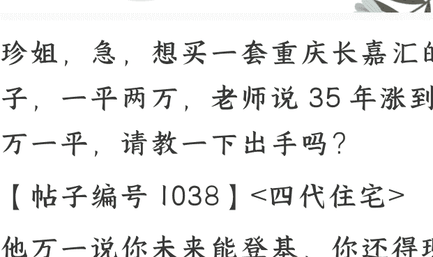

# “四代住宅”购买建议

## 251111 珍大户

整理：公众号懒人搜索，懒人专属群独享

懒人微信:lazyhelper

珍姐，急，想买一套重庆长嘉汇的房子，一平两万，老师说 35 年涨到 10 万一平，请教一下出手吗？

【帖子编号 1038】<四代住宅>

他万一说你未来能登基，你还得现在赶快花大价钱买个玺呗。

现在买房要买便宜的，超值的，能抄底的，不要花大价格做不能捡漏的事。

印象里重庆房价没那么贵，然后我一搜，发现说是新盘 4 代住宅。

目前房市不好，为了让新盘能卖出去，所以现在都靠 4 代住宅搞噱头了，公摊小，赠送面积大，物业配套各种会所游泳池管家 K 歌房之类的，公区装修奢华，让人一看一上头。

但代价就是，价格比普通房子贵一大截，性价比是没有的。

这种 4 代房子未来值不值呢？

如果真能保证好宣传的品质，那么未来是保值的。原因很简单，因为未来的趋势，是分化。所以人会越来越挑剔。结果就是好房子和破房子分化。

等于跟上个时代完全相反——上个时代，快，保值最好，大面积的反而单价上不去，买了大房子想卖出时很吃亏。

但未来，一方面是下一代年轻人从小居住环境不差，根本不愿意再大价钱忍受破房子。另一方面，各种大央企供应长租房，有一个保底的居住条件了，如果不是为了大幅改善生活，他们为什么要买房？

所以小破房子受嫌弃，没那么保值，反而是各种改善类的更受欢迎。包括面积要更大，体验要更好，物业服务也得上去等等。

所以四代住宅，内核上，是符合这种趋势。但风险点就是，现在四代住宅才刚建，开发商真的给你考虑长远了。

对开发商来说，他们只有能卖出房子才能活下去。如果现在宣传小区里可发射火箭能卖出房子，他们恐怕也会宣传。

因为活不下去就死了，死了谁还管什么虚假不虚假宣传。最后有问题，那也得先活下去再说吧，活不下去，还能说什么。

所以，目前的四代住宅一定是鱼龙混杂的。里面包含着真的物业服务能持续下去的，也包含着物业服务铁定持续不下去，但是开发商为了活下去而忽悠你，敢宣传能发射火箭的那种。

如果四代住宅跟其他普通房子一个价，且溢价不多，那当然果断买买买了，因为就算牛皮破了，大不了它是普通大户型房子，你也不会损失什么。

但你别忘了现在四代住宅价格普遍偏高。就像这个提问里，2 万一平的，虽然我没调查，但周边指不定只要一万出头。你买进去博概率。如果这个盘的服务活下来了，未来能保值；如果服务活不下来，未来先贬到跟周边差不多再说。

这种赌一把的概率值得吗？我也不确定的。所以如果不是自诩有钱阶层的，先不用花钱砸 4 代住宅。

如果不差钱，就考虑 4 代住宅，专挑物业费贵的小区。普通人想要捡漏，想要性价比，那么去找二手房捡漏去。

## 最后，安利小懒的付费群:

### 懒人专属群 (介绍)

微信:lazyhelper

💾 懒人专属群持续更新中，已持续运营 6 年，整理超 3000 份各类精选付费文章 & 年费社群干货，全部开放下载。

本资料为付费群内分享，仅供真实有需要的朋友查阅 🙇

### 懒人专属群更新记录:

https://lazy2025.top/blog/record2

懒人专属群更新记录 (需梯子，备用):

https://lazybook.fun/blog/record2