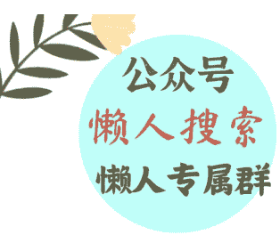
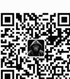

# 160 | 金达威：辅酶 Q10 背后的世界隐形冠军

251112

整理：公众号懒人搜索，懒人专属群独享

懒人微信:lazyhelper

欢迎打开《蔡钰·商业参考 4》,我是蔡钰。

上次讲抹茶行业的隐形冠军贵茶集团时，用户"Dragon"留言说，代工类产品有个天生的弊端，就是没有自我品牌化，这也是突围前的限制。真要成规模的话，一定要有自己的故事和品牌，另外就是要扩大宣传，为未来的自我独立去造势。中国此类的产品其实不少。

巧了，这一讲，我们就顺着"Dragon"同学的感慨，再来讲一个隐形冠军公司。它来自你肯定感兴趣的行业，营养保健食品。

中国保健品市场规模在 2013 年到 2023 年的十年间翻了 3.5 倍，超过了 3500 亿元，市场当前还在以超过 10% 的增幅逐年扩张。

而过了 2023 年的新冠疫情节点后，不知道你有没有发现，中国市场的年轻消费者对保健品的认识和接受度，快速赶超了中老年人群。

这两年来，人们吃起了功能性食品、喝上了中式养生饮料，还参考韩国的营养保健思路，磕起了一种外号叫“防猝死套餐”综合营养套装。很多年轻人以前把保健品当作收割长辈的“智商税”，如今却对辅酶 Q10、维生素 D3、K2 等概念如数家珍。

我猜，过去两年，你也为自己和家人，采购过不少保健品，来修复心血管、免疫力、呼吸系统和睡眠。

这个趋势里，我们有必要了解一家名叫“金达威”的厦门公司的存在。

这家公司是个老牌保健品原料生产公司。你可能没怎么听过它的名字，但大概率吃过它旗下的产品品牌——Doctor's Best、Viactiv、Zipfizz、RxSugar。你在国内的天猫、小红书平台，在国外的亚马逊、Costco、山姆超市里都可能见过。

——等会儿，这些保健品品牌不都是国际品牌吗？为什么背后是一家中国公司？

这就是金达威这家公司有趣的地方。

金达威，目前是全球最大的辅酶 Q10 生产商，全球每 3 粒辅酶 Q10 胶囊，就有 1 粒用的是它生产的原料。它还是维生素 A 的全球六大生产商之一，维生素 D3 的产销量也能排在全球第五。这之外，它还生产 DHA、ARA 等一系列保健品原料。

金达威虽然是一家中国公司，主要市场却在海外。它 2024 年的销售收入里，境外跟境内的贡献比例是 4:1。

咋回事呢？我们来讲讲它的故事。

## 原料商出身

金达威的身世，挺传奇。

这家公司 1997 年成立，创始人江斌是个退伍军人，退伍后在国内最大的氨基酸进出口企业工作，很快意识到国内大部分维生素原料都靠进口，值得做一家本土自己的维生素原料生产企业。

于是，金达威专注研发辅酶 Q10、维生素 A、维生素 D3、微藻 DHA 等五大原料的生产，迅速做成了全球龙头。

请你注意——在十几年前，金达威做的是保健品原料，而不是保健品本身，是一个上游供应商；它当时最大的客户群体也不是保健品食品品牌商，而是世界各地的动物饲料生产商。国内的正大、新希望、山东六和这类农牧业公司，国外的罗曼、泰高等动物营养公司，以及拜耳药业，都是金达威的客户。

这也是为什么在 1997 年，中国的农业央企——中牧实业——也参与了金达威的创立，成了它的第二大股东。中牧实业的主业之一，就是饲料与饲料添加剂，跟金达威有紧密的业务协同。

说回金达威。

中国在加入 WTO 之后，辅酶 Q10 的产业化进程也在加速，很快取代日本，成了全球辅酶 Q10 的生产中枢。金达威是其中的翘楚。2019 年，它旗下的辅酶 Q10，凭借高纯度、高含量、高质量的优势，已经拿到了工信部的“单项冠军产品”名号，在全球市场开疆拓土。

2011 年金达威不是上市了吗？当时的金达威，刚刚感受了一轮 2008 金融危机引发的经营动荡。它意识到，自己在全球市场上单纯卖营养品原料，议价权太低、处境也太被动了。

当时，全球很多知名保健品品牌用的都是金达威的原料，但消费者根本不知道金达威这个名字。危机一来，下游的品牌商能够有毛利冗余当缓冲，但金达威却只能咬牙硬扛原料价格波动。

## 品牌商转型

于是，2011 年上市后，金达威就决定，要把业务向下游延伸，去往毛利更高的品牌消费市场。但这个转型并不容易。

原料企业的基因是 B2B，注重技术和成本控制；品牌企业的基因是 B2C，得注重营销和用户体验。两者的能力要求完全不同。

怎么适应这种转型？

金达威的解决方案是：在成熟市场，收购现成的 C 端品牌。

于是，从 2014、2015 年开始，金达威出手，花 8800 万美元收购了自己的一个客户、美国的保健品牌 Doctor's Best，先是拿 51% 的股权，后来又增持到了 96%。

这次并购，让金达威第一次拥有了终端保健品品牌，还是一个“国际知名品牌”。

那么，这是一个简单的“出口转内销”的故事吗？被并购后的 Doctor's Best，什么时候正式进入中国市场呢？不急，这时候的金达威，注意力还放在海外市场的拓展上。

通过收购 Doctor's Best，金达威获得了两种关键资源：

- 第一个是 Doctor's Best 现成的品牌、渠道和团队，以及市场。金达威借助自己的原料优势和成本优势，并购第一年就把 Doctor's Best 的销售额干到了 3600 万美元，2021 年又干到了 1.4 亿美元，7 年翻了 4 倍，也让 Doctor's Best 进入了全美膳食营养补充剂品牌销售榜的前 10 名。
- 第二种关键资源，是并购和运营国际保健品品牌的经验。

收购 Doctor's Best 成功之后，金达威在全球市场继续开疆拓土，它 2015 年收购了美国的软胶囊代工厂 Vitatech，2016 年在日本合资设立了口服美容品牌舞昆，还在新加坡参股了直销与药店渠道。

2018 年，它又在美国收购了能量饮料品牌 Zipfizz，还斥资 1 亿美元参股了全球最大的保健品电商 iHerb。2024 年，金达威又让 Doctor's Best 出面，收购了美国药房渠道里的钙片品牌 Viactiv、和代糖品牌 RxSugar。

这些布局看上去分散，但背后的逻辑是：先迎合不同市场的细分需求，再拼成一个完整产品阵列。

美国市场注重功能性和科学性，Doctor's Best 就主打“医生推荐”的专业形象；日本市场注重精致和美容，舞昆就主打女性抗衰老；能量饮料市场注重便携和即时效果，Zipfizz 就主打运动营养。

借助这些成熟品牌，金达威在 Costco、沃尔玛、亚马逊、iHerb 等国际主流渠道也都打通了营销动脉，还在美国、新加坡、中国香港控股了一批电商平台、工业品贸易经销商和消费品经销商公司。

10 年下来，这种“一个原料，多个品牌，不同市场”的策略，就让昔日的动物饲料补剂供应商金达威，成功转型成了覆盖全球的保健品跨国公司。

跟其他跨国同行相比，金达威的竞争力还挺独特：它既不是纯粹的原料供应商，也不是纯粹的品牌商，而是一个“全产业链的营养健康企业”。它不但有完整的产品阵列，有成熟的经销网络，还有背后那条贯通的、自主的产业链。

这也是为什么，金达威直到 2024 年，境外销售收入仍然高达境内销售收入的 4 倍，约合 25.7 亿元。但这同时，它业务里的营养补剂原料的贡献占比已经降到了 40% 以下；60% 的地位留给了 2011 年发布的招股书里完全不存在的“营养保健食品”，也就是前面提到的那些国际保健品品牌。

## 返回中国市场

好，我们回到金达威刚刚启动国际并购的 2015 年，问一个问题：它去并购美国的保健品品牌，只是为了方便出海吗？

是，但又不全是。

你可能记得，2015 年这个时间点还有另外一个意义：当时，整个中国消费市场刚刚进入消费升级阶段，中国游客们热衷于海淘护肤品、去欧美日买保健品，对国际品牌的热情和信任远远高于本土品牌。

所以，在当时做出海并购，对金达威来说，还有另一层用意。金达威的董事长江斌后来解释说：“当时，国内已经有汤臣倍健等保健品龙头企业，金达威在这些企业面前品牌优势不明显。因此，我想了个差异化发展路径——从收购美国企业、进入海外市场入手，再想办法把国际品牌本土化。

也就是说，这是一鱼两吃——先并购出海，借助 Doctor's Best 进入美国市场；再“曲线救国”，以国际品牌的身份回应当时中国消费者对“国际品牌”的仰视。

所以啊，从 2020 年开始，有了新身份和新版图的 金达威，开始谋求回国。它先是让旗下各大国际品牌，在天猫开了海外旗舰店；又跟奶茶品牌香飘飘成立了合资公司，进入功能性饮料市场；还在内蒙布局玻尿酸生产线，开始推出口服液、软糖、面膜等等产品。

切换到消费者的视角。

这几年，我们也就越来越多地看到 Doctor's Best、舞昆、Zipfizz 等品牌，出现在了天猫国际、京东中国的主流电商渠道里。2025 年上半年，金达威的境内销售收入达到了 4.27 亿元，同比增速 45.14%，非常迅猛。

## 总结

这一讲，我们去了解了一家挺有趣的公司：出身中国的保健品跨国巨头——金达威。它这些年的经营策略是，通过并购国际品牌进入海外市场，积攒了影响力后再返回中国。同时，背后用中国制造的成本优势来提升竞争力。

再简单点说，就是以“供应链 + 全球品牌聚合器”的双重身份，攻略海外和本土市场。这让金达威成了今天中国上市公司里少有的，同时拥有全球原料龙头、海外终端品牌矩阵和欧美主流分销渠道的保健品国际巨头。

2023 年以来的中国品牌出海大潮里，很多企业都在摸索如何做跨境电商、如何打造国际品牌，金达威是个值得参考的前辈。

它的这套打法还出现在了哪些出海企业身上？期待你的分享补充。

再见。

最后，安利小懒的付费群：

**懒人专属群（介绍）**

微信:lazyhelper

📕 懒人专属群持续更新中，已持续运营 6 年，整理超 3000 份各类精选付费文章&年费社群干货，全部开放下载。

本资料为付费群内部分享，仅供真实有需要的朋友查阅🙅

懒人专属群更新记录：

- https://lazy2025.top/blog/record2

懒人专属群更新记录 (需梯子，备用):

- https://lazybook.fun/blog/record2