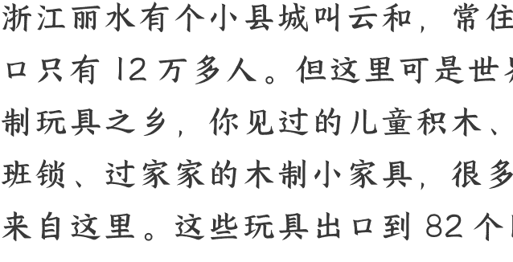

# 出生率跌破千万，“玩具之乡”却逆势增长

251112

整理：公众号懒人搜索，懒人专属群独享

懒人微信:lazyhelper

微信:lazyhelper

今天我们说一个挺有意思的商业观察。

浙江丽水有个小县城叫云和，常住人口只有 12 万多人。但这里可是世界木制玩具之乡，你见过的儿童积木、鲁班锁、过家家的木制小家具，很多都来自这里。这些玩具出口到 82 个国家和地区，年产值 75 亿多元。

可是前两年，云和的玩具厂老板们都挺焦虑的。原因很简单，出生率持续下降。儿童玩具的销量，普遍下滑 10% 到 30% 不等。你想啊，做儿童玩具的，最怕的就是孩子越来越少。很多老板都在想，要不要转行？要不要关厂？

可到了 2024 年底，官方数据出来了，云和木制玩具产业产值 75.27 亿元。其中，规模以上企业产值 26.5 亿元，同比增长 5.7%。

你可能会觉得奇怪，儿童玩具明明少卖了，整体业绩怎么反而增长了？这中间的差额是谁填上的？

## 答案是：老年人

你看，虽然出生人口在减少，但是另一个群体，银发族在增加啊。这笔账其实非常好算，根据相关的数据统计，2024 年，老年人花的钱加起来有 8.3 万亿元。什么概念？整个汽车产业一年的产值是 9 万亿元，老年人的消费能力已经快赶上整个汽车产业。而且这个数字还在快速增长，预计到 2030 年会翻一倍多，超过 20 万亿元。

今年前 4 个月，市场上专门给老年人设计的新产品，就有将近 3 万种。什么速度？去年同期只有 8000 多种，今年直接涨了 3 倍多。

淘宝还专门新增了一个类目，叫“适老化玩具”，据说覆盖超过 2 万种商品。数据显示，仅 2024 年，“适老玩具”的搜索量同比增长 124%，成交量同比增长 70%。

所以你看，当所有人都在焦虑“孩子越来越少”的时候，有人看到了这个趋势的另一面，“老人越来越多”。

因此，2023 年，云和县专门出了一份文件，叫“木制玩具 + 银发康养”，鼓励玩具厂开发适老化玩具。几家年产值超 1 亿元的企业带头转型，前后开发了几百款适老玩具。

听到这，有人可能又会好奇了。这个趋势不难理解，但具体到行动，你怎么让老年人接受玩具这个东西呢？毕竟，在我们的印象里，玩具都是给小孩子的。

关于这个问题，前段时间，零售咨询专家黄碧云老师专程去了一趟云和县，带回了很多一手的观察。

咱们先说最核心的结论。对老年人来说，玩具的“玩耍”属性，只是最基础的。玩具只是个载体，它要满足的，是“玩耍”背后的更深层次的需求。

具体是什么需求呢？

- **社交需求**。老年人退休后，社交圈急剧缩小。原来的同事不常见了，朋友也各忙各的。一个人在家，孤独感会越来越强。换句话说，老年人不是不想社交，而是缺少社交的场景。而这些多人游戏，恰恰创造了一个社交空间。比如，华容道比赛、弹珠游戏，都需要几个人一起玩。玩的过程中，老人们有了交流，有了互动，有了陪伴。

- **自尊需求**。老年人最怕的，是觉得自己“不行了”。身体不如从前，记忆力也在衰退，很容易产生挫败感。但这些益智游戏，让他们感受到自己还“行”，还能和别人比一比。赢了固然高兴，但更重要的是，这个过程能让他们“自我感觉良好”。

比如，有一家养老院就引进了不少老龄玩具，并且经常组织比赛。在组织华容道比赛时，会按年龄和能力分组，让水平相当的老人在一起比。输赢不是最重要的，重要的是鼓励。只要你这次的速度超过自己的上一次，工作人员就会按照“胜利”来计分。

- **意义感需求**。一个人退休后，最怕的是什么？是觉得生活没意思，每天不知道干什么。黄碧云老师在调研中发现，一些社区每个月会举办两到三次比赛，老人们会提前练习，会期待比赛那天。换句话说，这些活动给了老人一个“盼头”，让他们的生活有了节奏，有了意义。

换句话说，适老化玩具满足的，不只是“玩”的需求，而是社交、自尊、意义感这些更深层的心理需求。

听到这，有人可能会说，我听明白了，这个事原来这么简单啊，就是把原来给小孩子的玩具，推销给老年人。把原来海报里的照片，从儿童换成长者，把原来广告语里的“快乐童年”换个词，变成“快乐老年”，这么直接一切换，不就行了？

但是，事实上，事情没有这么简单。做适老化玩具，远远不是把原来的东西换个客户而已。

为什么？你看，假如只是把原来给小孩的东西原封不动地卖给老人，那么长此以往会发生什么？很可能出现一个场景，就是，曾经在儿童玩具领域里发生过的内卷，在老龄玩具里重演一遍。

要知道，原来的儿童玩具市场可是很卷的。你看这几个数据就知道了。

比如，在电商平台上，一些去年还能卖 29.9 元的玩具，今年必须降到 9.9 元才能维持销量。价格直接砍掉了三分之二。据说在这种价格战下，厂家给到一级经销商的出厂价，可能只赚几毛到一块钱。原材料成本稍微波动一下，企业就得亏本。

更麻烦的是，产品同质化严重，抄袭成风。随便到玩具批发市场转转，就会发现很多玩具的样式一模一样，甚至连标志、使用说明都如出一辙。当一家公司的新产品出来，市场上的仿造品立马就跟着出来。企业在设计上投入的费用，很容易就“打水漂”。

在这种环境下，很多企业只能靠不断推新品来维持竞争力。但即使这样，专注传统玩具的企业，经营压力依然很大。

所以你看，假如只是简单地把儿童玩具换个客户，这种内卷可能很快就会在老龄玩具市场重演。

因此，从这个角度看，对于玩具厂商来说，老龄化玩具不只是个新的市场增量，更是个重新定义产品、重新梳理商业模式的机会。

怎么重新定义产品？黄碧云老师在调研中发现，云和的一些玩具企业，卖的不再只是玩具本身，而是一整套适老化方案。

什么意思？咱们举个例子。

比如，云和一家玩具厂做的适老化玩具套装，包括一张桌子、一套椅子，以及相应的玩具。

看起来很简单对吧？但是，假如仔细看，你会发现其中有几个专门为长者定制的设计。比如，桌子，四边都有手握区域。因为老人坐久了，手撑着起身比较吃力。这个设计方便老人借力站起来和坐下去。所以桌子的重量和平稳性都要反复打磨。桌子中间还有流水凹槽。这是防止水洒在地上，万一没及时处理，老人滑倒就麻烦了。

再看椅子。椅身扁平长，让整个椅子更平稳。但你拉一下就会发现，椅子其实很轻，方便老人推进拉出。椅子的扶手高度也有讲究，要方便老人轻靠着，而且扶手要防滑，老人撑着起身才更安全。

注意，这些设计看起来很简单，但它体现的，是对老年人身体状况的理解。也就是互联网行业经常说的“用户洞察”。换句话说，看起来是卖玩具，但是你要想做好，需要考虑到老人活动的每一个细节。

据说，与一般的单个玩具相比，这种整体化的适老玩具，可以获得更高的溢价。而对于企业来说，因为这个市场正在爆发初期，这也正是个建立品牌认知，获得先发优势的机会。

再比如，在做玩具开发时，也得考虑到老年人的真实需求。根据云和县的摸索，有这么几类玩具在银发族里比较吃香。

- **功能性玩具**。可以锻炼长者的手指灵活度，或者锻炼记忆力。比如有个弹珠游戏，特别考验手指的灵活度，力道大了弹远了，力道轻了又弹不进。这个游戏特别适合轻度中风后想恢复手部灵活度的老人，或者手有些轻微颤抖的老人。

- **竞技类玩具**。比如华容道，可以多人一起挑战，时间短的赢。为什么要设计多人版的游戏？这是为了给老年人创造社交空间。

换句话说，老龄玩具的设计，不是简单地“把儿童玩具改大一点”。

老人不是幼童。幼童是从懵懂无知开始的，玩什么都是全新的学习。但老人不一样，需要重新理解老年人需要什么，重新设计产品，重新定义“玩具”这件事。

好，关于老龄玩具，咱们先说到这。

出生率降低了，但是老龄化正在到来。一个趋势的反面，也许是另外一个趋势。这个观察逻辑，也许不只适用于玩具行业。

你看结婚率。这些年结婚登记人数从 1346.9 万对降到了 610 万对，降了一半多。很多行业都在焦虑，婚庆、家具、家电，都受影响。

但与此同时，宠物市场突破了 3000 亿元，年增长率超过 10%。结婚的人少了，但养宠物的人多了。宠物成了很多人的情感寄托和生活伴侣。

再看生育率。出生人口跌破千万，母婴行业是不是完了？不是。母婴市场正在从“数量竞争”转向“质量竞争”，高端产品和服务的增长明显快于整体市场。简单说，孩子少了，但花在每个孩子身上的钱多了。

你看，这就是趋势的另一面。一个群体在减少，往往意味着另一个群体在增加。一个需求在萎缩，往往意味着另一个需求在爆发。

关键也许在于，我们看到了哪一面。

## 最后，安利小懒的付费群:

### 懒人专属群（介绍）

微信:lazyhelper

📑懒人专属群持续更新中，已持续运营 6 年，整理超 3000 份各类精选付费文章&年费社群干货，全部开放下载。

本资料为付费群内分享，仅供真实有需要的朋友查阅🙇

### 懒人专属群更新记录:

https://lazy2025.top/blog/record2

懒人专属群更新记录（需梯子，备用）:

https://lazybook.fun/blog/record2