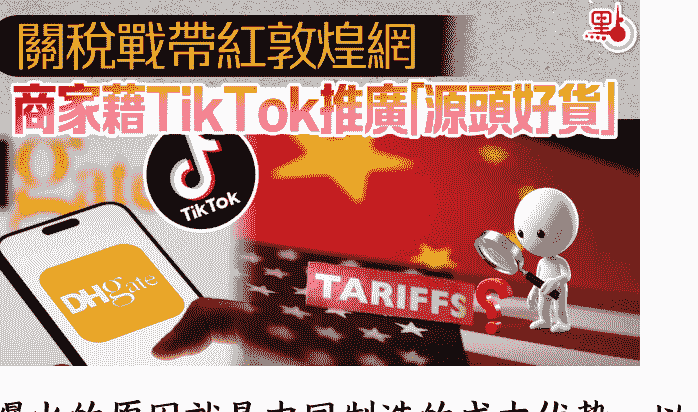
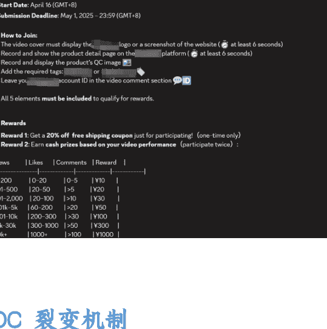
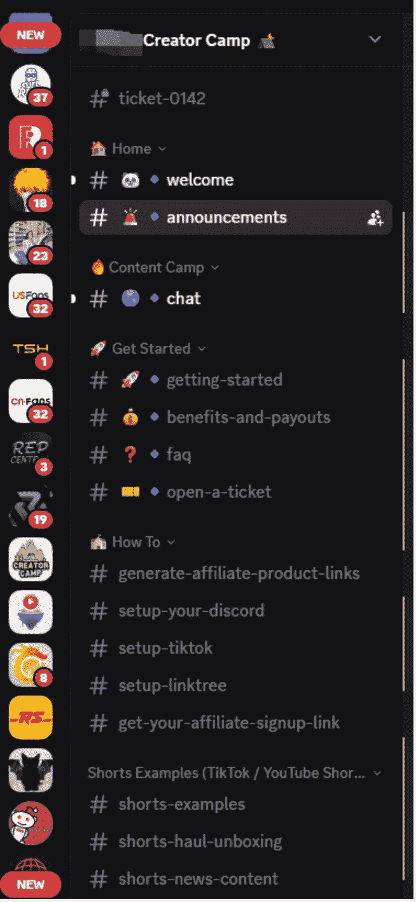

# 拆解反向海淘平台的用户增长策略，如何用海外 KOL/KOC 撬动增长

## 反向海淘平台的特点

这些平台不直接卖货，只做代采和物流发货，所以用户群体也是 C 端消费者。

这类平台复购率很高，用户粘性很强，当然社群的用户运营和多渠道宣传有关系，用户对平台信任，就会持续使用这个平台。

注重社群运营，Discord 社群，Reddit 社区，Telegram 都是海外用户的聚集地。

圈子很垂直，欧美是主要市场。

大家还记得几个月前关税战闹得正凶的时候，敦煌网突然在美国爆火的新闻吧。

爆火的原因就是中国制造的成本优势，以及 TikTok 作为流量推手让敦煌网获得更多的关注。

## 二、为什么在 2024-2025 年突然火起来？

这些平台最早出现在 2018-2020 年，而在 2023-2025 年爆发的关键节点是：

- TikTok 与 YouTube 上的“淘宝 Haul”视频走红；

公众号懒人搜索，懒人专属群分享

- Discord、Reddit 社区形成兴趣消费文化；

- 跨境物流降本 + 支付链路打通；

- Z 世代海外用户认知中国商品性价比与设计力。

不过也和业内朋友交流过，最火爆的某买去年出了事，也给新的平台市场空间和机会。

放几张这些平台的流量数据图，会更直观一些，

2024 年

2025 年

从这张图里可以看到，Kakobuy 平台在短短几个月快速冲到了头部，超过了其他同行，下面是他的网站流量变化：

- 2024 年 8 月到 9 月：1000 增长到 7 万
- 2024 年 10 月到 11 月：7 万增长到 40 万
- 2024 年 11 月到 12 月：增长到 120 万
- 2025 年 5 月：800 万
- 2025 年 7 月：600 万

它的社区玩法与 KOL/KOC 裂变很值得拆解，这不光是传统的用户投放拉新，更多是让素人以晒单内容自我繁殖，形成低成本、高粘性的增长飞轮。

同时这个平台在海外短视频领域做的也相当不错，视频内容也不错，有助于教育用户和服务体验。

## 三、反向海淘有哪几种模式

### To C 代采集运模式

海外买家 → 平台代购 → 国内下单 → 质检 → 国际转运。

这类平台卖服务，在平台上帮用户从淘宝、1688 等代采，平台有一整套的代采系统，可以处理大量的订单。再凭借成熟的国际物流系统把个人包裹集中运输到海外个人手中，平台赚的是海运费用。

用户要在平台两次付款，代采和运输是分开下单和付款的。

这类型是主流。对于海外用户来说在淘宝买产品不难，但是集运和转运服务的个性化服务要求比较高。

### To C 直邮模式

很多海外 KOC 自己做代买代卖 + 直邮：

- 在 Discord 分享商品
- 在 Telegram 做小店
- 在 Instagram Story 做代买链接
- 在 WhatsApp 直接收钱出货

KOC 自己从国内档口、拼多多、1688 拿货，直接卖给境外粉丝。

### To B 代采/外贸采购

在 TikTok 上有很多中国达人，作为 China Sourcing Agent 角色，拍摄探厂的视频，帮国外客户建联国内的供应链，做外贸业务。

很多做小 B、小批发、个人采购的海外用户会直接用这种模式。不同于传统外贸，更多的是帮助海外的小 B 采购商定制化采购服务。这种模式对比传统外贸更灵活，MOQ 的要求会更低，海外需求也越来越火爆。

## 四、联盟营销：海外 KOL/KOC 如何裂变

海外达人生态真的不像中国，国外的达人很难把控回收率。在我们建联反向海淘圈的达人，也遇到这些问题：

### KOL 忠诚度低与高额费用

质量好的 KOL 都要 1 到 2 万美金的月薪。这还不算固定购物金额赠送、全额包邮、高额销售佣金，以及社群拉新的人头费。他们忠诚度低，极容易被财大气粗的同行以更高价挖走，投资风险巨大。

### 达人粘性差与多账号套利

主动寻求合作的达人虽多，但他们与新平台粘性极低。部分达人甚至在签约后，会另起多个小号去接不同平台的业务，导致无法按要求完成高质量的拍摄和内容输出，执行质量难以保障。

### 骗样泛滥，运营损耗巨大

骗样的太多了，这也是海外达人生态圈普遍存在的问题。大量达人素质参差不齐，说得天花乱坠，拿到样品后就人间蒸发，要么视频粗制滥造，要么视频数据造假，需要仔细甄别。

### 深度合作要求与教育市场问题

建联的达人只发一两条视频基本没什么水花，因为这个平台与其他品牌商家不同，不是普通的卖产品，达人需要自己先了解代购平台的玩法和服务，以及海淘文化，和平台一起教育市场，才能获得用户信任，引导用户下单。这要求批量和达人合作，进行长期、持续的内容输出。

### 从购买流量转向共创声量

在运营这个项目的时候，我们也去观察了这些达人圈，那些垂类 KOL 虽然建联难度高，但他们的影响力极强，自有活跃社群，能够快速为平台带来爆发性的流量和订单。然而，这些头部达人更看重平台的名气和服务能力，不光是价格。

并且在用户群里去裂变更多的创造者，培养更多的素人 KOC，也非常有利于社群裂变和拉新。KOC = 小体量内容创作者（UGC 创作 + 晒单 + 视频带货）。他们是社群内最活跃、最具分享欲的真实用户。

### KOC 裂变机制

#### 病毒式传播链条

内容创作者 → 晒单内容 → 用户模仿购买 → 代购平台自动识别订单来源 → 奖励回流给创作者 → 更多人参与

#### 与传统电商区别

- 不靠广告投放，而靠内容生态自增长
- 不控制创作者，而是社区自治
- 从 GMV 思维转向 UGC 复购思维

#### 建联达人不只是购买流量，而是共创声量

参考某买在智利的达人推广打法。当时我们在建联智利达人的时候，Kakobuy 的达人会更积极，黏性也很高，问他们为什么和 Kakobuy 合作，他们的回答不是钱，而是觉得 Kakobuy 的病毒式传播让他们更愿意深度合作，更容易帮他们账号涨粉和获得信任背书。这种合作更像是一种双赢的“社群”或“运动”，而不是简单的商业买卖。达人感受到的是被赋能，而不是仅仅被利用来带货。

同时，建议避开红海市场，将火力集中投入到单点国家，并以最大密度去铺设达人。目标不在于单个达人的短期 ROI，而是快速形成市场声浪，建立品牌名气，以“势”来降低后续合作成本和提高粘性。

## 五、社区生态：Discord 如何驱动 KOC 成长

在内容驱动的反向海淘生态里，Discord 正在成为平台、品牌、甚至中小卖家最重要的海外私域阵地。很多人一开始不理解：为什么不是 WhatsApp、不是 Telegram、不是 Facebook Group，而偏偏是 Discord？毕竟它在中文互联网的存在感并不强，但在海外年轻用户、KOC 群体、游戏圈与兴趣圈，却几乎是标配的数字部落。

Discord 本质上不是传统意义的社交软件，而是一个可编排、可运营、可分层管理的社区操作系统。品牌可以在里面搭结构、设权限、分频道、跑任务、做自动化，甚至像搭积木一样把自己的“海外私域组织”建立起来。国外的大量品牌、NFT 项目、游戏公司、创作者经济平台，几乎都把 Discord 当作核心阵地，用它来做客服、做内容中心、做创作者运营、做用户社群，甚至做产品研发的早期反馈。

### 为什么选择 Discord 来驱动 KOC 增长？

对于做反向海淘的平台和品牌来说，选择 Discord 的原因其实很现实：

#### 聚集了天然的目标人群

海外 18-35 岁年轻用户、KOC、UGC 创作者、留学生群体，本来就大量活跃在 Discord 上，他们愿意边聊天边分享链接、晒单、晒穿搭，也愿意跟随某个品牌的 vibe 加入服务器，这让反向海淘的内容传播链条变得简单多了。

#### 自治性强、结构灵活，非常适合做达人阵地

Discord 不是一个群，而是一个可无限拆分的多频道空间。可以把达人分层：新手、活跃、中级、头部、合作作者，再赋予不同频道与权限：任务区、素材区、晒单区、数据反馈区、工单区、活动区。

#### 自动化和 Bot 生态强得夸张

建联、任务发放、投稿审核、订单识别、积分体系、等级体系、激励系统、抽奖系统都可以用 Bot 自动化跑，让社群规模从 50 人到 5 万人不需要额外的人工投入。对于反向海淘平台来说，这种自动化能直接提高达人运营效率。

#### 内容扩散速度极快，天然适合裂变

Discord 的功能更像公共聊天室 + 工具集成，一条晒单、一条代购体验、一次开箱视频，都能在短时间内层层扩散到不同频道，形成社区可见度，这种传播方式对反向海淘特别有效。

达人也会建立自己的社群，共同助推平台。

#### 能够沉淀品牌自己的核心圈层

反向海淘平台不是卖产品，而是卖信任与玩法，而信任只能在人群聚集的地方建立。

Discord 灵活度更高，比起其他社群也不容易被封控，你可以自由定规则、做活动、做竞赛、做用户调研、做达人成长体系，这也是国际品牌为什么把海外私域放在 Discord 的原因。

大家都以为找达人、发视频就是增长，但当我们真正复盘整个行业后才发现：如果想让反向海淘跑出类似某买那样的病毒式裂变，仅靠流量根本撑不起这套增长飞轮。这个行业的本质不是卖货，而是卖服务与信任，所以平台必须把用户导入一个能沉淀关系、能持续教育、能发生互动与模仿的场域，而 Discord 正是那个场域。

只有把用户拉到 Discord，把达人也纳入社区，再用 AARRR（获客 - 激活 - 留存 - 收入 - 推荐）模型去设计整个用户路径，才能让“内容 → 社群 → 服务 → 下单 → 晒单 → 再传播”这条链路真正闭合，进而让裂变从偶发现象变成可复制的增长机制。

反向海淘的增长不是靠一个达人、几个视频，而是靠整个生态一起推动。

所以在明确了这一点之后，我们协助甲方一起制定新的营销策略，不再停留在跑账号这种浅层次的执行，而是开始从行业底层去理解：

- 为什么某买能裂变？
- 为什么 Discord 是核心？
- 为什么 KOC 能构成飞轮？
- 为什么晒单内容比投广告有效？
- 用户为什么愿意反复分享？
- 达到爆发点之前需要铺多少节点？

只有理解了这些，才能真正把增长跑出来。换句话说，想复制某买的速度，不能只模仿表层动作，而要接上这条行业真正的底层逻辑。

这是我用一个 discord 小号加入的有些名气的 Discord 社群，也有一些 KOL 的社群，以便更好地了解海淘圈文化。

### Best DHGate Spreadsheet

Boost Goal 0/28 Boosts >

Browse Channels

- SERVER STATS ↓
- # all-members-23604
- # members-23587
- # bots-17
- SERVER SUPPORT ↓
- 📄 rules
- # 👋-welcome
- # 📱socials
- # 📢announcements
- # 🛠️open-a-ticket
- SPREADSHEETS ↓
- # 📄dhgate-spreadsheet
- # 📄kakobuy-spreadsheet
- # 🔗signup-link
- # 🚀popular-items
- # 📈dhgate-needs-form
- # 🏷️coupon-codes
- # 🈸10k-monthly
- # 🎫vouchers

#### Spreadsheet 在海淘代购圈的重要性

在海淘圈里，Spreadsheet 是一个高频词，等同于达人版的推荐清单。但它并不是随便列几个商品链接那么简单，而更像是一家被浓缩成一页表格的电子店铺。达人会把自己精选的好物、常买的链接、淘宝/拼多多/微店/1688 的通用爆品，全都集中整理在一张表里，粉丝只需要打开 Spreadsheet，就能看到他们“私人货架”上的全部商品——简单直接、随手即买。

之所以海淘圈这么依赖 Spreadsheet，是因为反向海淘平台本身并不卖货，它只负责代购、集货和转运，那么好物从哪展示？商品从哪聚合？用户从哪开始种草？最好的方式就是：把所有产品清单集中放在电子表格里，让达人在各个社交平台随手就能传播。

有的平台为了增强转化，会另外搭建一个独立的卖货网站，把商品做成更像电商列表的形式，但这类商城通常都与代购平台分开运营，一方面是为了降低政策和风控风险，另一方面也是为了保持品牌定位的清晰度：商城负责种草展示，代购平台负责履约服务。

不管达人是推荐淘宝的、微店的、闲鱼的，还是 1688 的，只要用户最终要拿到东西，最后一步都必须回到代购平台——通过平台生成的短链完成下单，这样平台才能识别订单来源，达人才能拿到联盟分佣，整条链路才能闭环。

换句话说，Spreadsheet 是展示端，短链接归因端，代购平台是履约端。这三样东西连在一起，反向海淘的达人联盟生态才真正跑得起来。

### 商业化路径：从裂变到变现

反向海淘的平台增长，表面上看是靠 KOC 晒单、达人带单、视频种草，但这些流量想真正沉淀成商业价值，并不是靠一次爆发，而是靠一条完整的商业化路径——从用户裂变，到达人演进，再到订单转化和平台收入体系的成型。

大多数平台在早期都靠 KOC 撑起第一波扩散。

KOC 拍的都是真实购物经验：哪里买更便宜、如何代购淘宝同款、运费怎么省、平台可靠吗？

这一类内容具有天然的模仿性，一人晒单，十人想试，形成了海淘圈独有的裂变链路。

当 KOC 量级到达一定规模之后，就会自然筛选出一批更专业、更稳定产出的创作者，这些人会逐渐升级成 KOL：

- 有固定粉丝盘
- 对平台的服务体验有更深理解
- 能讲文化、讲对比、讲玩法
- 内容更成体系，信任感更强

在这个阶段，平台才有能力引入正式的 Affiliate 联盟体系——包括短链归因、佣金比例、任务机制、激励规则、排行榜等。

#### 达人的终极进阶

做达人裂变很重要的一环是让 KOL/KOC 不光有金钱回报，也要让他有荣誉感。

邀请 KOL/KOC 来国内。目前对海外 KOL/KOC 来说也是个很大的诱惑。有些做的不错的平台已经在分批邀请 KOL/KOC 来国外，吃玩 + 视频宣传一条龙。

## 六、启发与可复制模型

### 反向海淘，是内容驱动的新全球化

反向海淘，也类似于 S2B2C 的模式：平台提供基础设施，小 B（KOC、工厂）做内容和供给，共同服务海外消费者。

这才是这些代购/集运平台能在 TikTok、YouTube、Discord 上爆炸式增长的真正原因。

过去，中国卖家把货卖出去。

现在，中国文化被用户主动带回来。

本质是由外向内的文化反向输入。

Kakobuy、Pandabuy 的崛起，是 Z 世代用户通过内容与中国制造建立连接的开始。

### 对中国卖家的启发：

反向海淘不是卖货，是建立认同感社群。

TikTok Shop 之外，还有内容 + 社群增长通路。

工厂或品牌出海可借鉴的裂变逻辑：

### 对国内品牌的建议

先打造内容文化和认同感，再做供应链转化。流量思维已死，社群和内容才是新全球化的路径。

### 品牌案例:Goli 保健品通过 Discord 社群做达人裂变

越来越多的品牌如 Goli 保健品，并非只靠投放，他们通过 Discord 社群建立了一个专门的达人管理和激励体系，让 KOC 感觉自己是品牌的一部分，从而实现了高粘性的达人裂变和持续的口碑输出。

Goli 的这个社群有 2 万多 KOL/KOC，大家在社群里也相当活跃。在社群里，可以做达人筛选，晋级。做的好的网红当然可以邀约来国内。

有些东西不方便公开写出来，我也因为这个项目，认识了一些圈内人，也和在深圳开反向海淘生态大会的大哥交流过，这个市场的机遇很大。

最后，安利小懒的付费群：

懒人专属群（介绍）

🗂 懒人专属群持续更新中，已持续运营 6 年，整理超 3000 份各类精选付费文章 & 年费社群干货，全部开放下载。

本资料为付费群内分享，仅供真实有需要的朋友查阅🙇

懒人专属群更新记录：

https://lazy2025.top/blog/record2

懒人专属群更新记录 (需梯子，备用)：

https://lazybook.fun/blog/record2