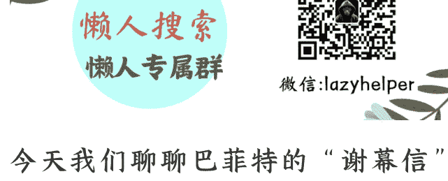

# 巴菲特“谢幕信”:你不会一直完美，但永远可以变得更好

2025 年 11 月 13 日

整理：公众号懒人搜索，懒人专属群独享

懒人微信：lazyhelper

今天我们聊聊巴菲特的“谢幕信”。11 月 10 日，在伯克希尔·哈撒韦的官网上，95 岁的巴菲特发布了《2025 年感恩节致股东信》。信里说，自己以后要“保持安静”了，不再撰写年度报告，也不会在股东大会上长篇发言。

换句话说，这可能是巴菲特最后一封正式的股东信。

当然，这不等于他以后就不说话了。巴菲特在信里也说了，以后每年感恩节，他还会写信跟股东和孩子们聊聊伯克希尔。但年底，伯克希尔将正式移交给他的接班人，格雷格·阿贝尔。这也意味着，那种每年 2 月发布、洋洋洒洒几万字、一众投资者翘首以盼的年度股东信，可能不会再有了。

所以很多人把这封信叫做“谢幕信”。

跟以往的股东信相比，这封信有点特别。要知道，巴菲特以往的股东信，70% 到 80% 的篇幅都在讲投资。讲伯克希尔买了什么公司，卖了什么股票，业绩怎么样。至于那些个人化的内容，比如家人、朋友、生活细节，通常不多。

但这封信，巴菲特用了一半的篇幅，在写自己生活的地方，奥马哈。

比如他写道：“查理·芒格住在离他现在的家仅一条街的地方。”还写道：“查理从哈佛法学院毕业后定居加州，但他一直说奥马哈塑造了他的人生。”

而斯坦·利普西，就是后来帮巴菲特打下传媒江山的那位，他的家离巴菲特家只有五个街区。

而沃尔特·斯科特，也就是后来把中美能源卖给伯克希尔的人，是斯坦的邻居。

唐·基欧，后来的可口可乐总裁，1959 年就住在巴菲特家对面 100 码的地方。

还有作为伯克希尔接班人的格雷格·阿贝尔和阿吉特·贾因，他们都曾经住在奥马哈的几个街区内。

这些名字咱们不用去记，总归，整个伯克希尔有 1 万亿美元的生意、39 万的员工，但它最核心的圈子，还是在奥马哈。这个 329 平方公里，不到 50 万人的小镇。

巴菲特说，奥马哈塑造了伯克希尔，也塑造了他的运气。

其实，这里的奥马哈，与其说是一个地理位置，不如说是一个“让你足以托付信任”的圈子。

你看，你跟一个陌生人谈合作，得先吃几顿饭，试探试探人品。这些时间和精力，都是成本。但在一个低信任成本的圈子里，你和你的伙伴，从小就知根知底。你们可以省下那些“相互磨合”的精力，把心思全放在创造价值上。

这样的例子，不只是奥马哈。

你看硅谷。PayPal 被称为“史上最强创业团队”，从这个团队走出来的人，创立了领英、油管、特斯拉。这些人后来被称为"PayPal 黑帮”。为什么一个公司能走出这么多成功的创业者？因为他们在 PayPal 时期，就建立了高度互信的网络。彼此了解对方的能力、性格、做事方式。后来创业时，需要找合伙人，需要找投资人，这个圈子里的人互相背书，大大降低了信任成本。

而巴菲特用一半篇幅写奥马哈，也许是在说，你的身边有一群信得过的人，这本身就是最珍贵的资产。

说完了人，再说说钱。毕竟对很多人来说，巴菲特怎么花钱，可能比他在哪儿住更值得关注。

巴菲特没有在信里详细分析投资动作，但如果你把这封信和他 2025 年的投资动作放在一起看，会发现三个关键词：撤退、转向、等待。

## 第一，撤退。

伯克希尔已经连续 12 个季度净卖出股票。最引人注目的是对苹果的减持。

苹果曾经是巴菲特的心头好。从 2016 年开始买入，到 2023 年底持有 9.05 亿股。但从 2024 年开始，巴菲特开始大手减持。到 2025 年二季度，已经减持了 67%，只剩下约 3 亿股。

为什么减持苹果？表面理由是税务考虑，赶在美国政府可能把企业所得税从 21% 提高到 28% 之前套现。但更深层的原因，也许是巴菲特在 2024 年股东大会上说的：“科技股的估值已经脱离了基本面，我们宁愿错过机会，也不愿承担估值风险。”苹果当时的市盈率超过 30 倍，这对一向坚持“安全边际”的巴菲特来说，确实太高了。

不只是苹果，巴菲特还在减持银行股。2025 年一季度，减持美国银行 4866 万股，二季度又减持 2631 万股。

## 第二，转向。

尽管一直在减持美股，伯克希尔在日本的投资却在大幅增加。从 2019 年开始，巴菲特陆续买入日本五大商社：三井物产、三菱商事、住友商事、伊藤忠商事、丸红。巴菲特还说，“未来 50 年不会出售”。

据说，他看中的是日本五大商社的全球化产业链控制力。这五家公司的海外资产总规模达到 3800 亿美元。在美国跟全世界打关税战的背景下，通过日本商社在全球做投资布局，更容易绕开美国政策的束缚。

换句话说，巴菲特也许是在用日本商社作为“全球投资代理人”。

## 第三，等待。

截至 2025 年第三季度，伯克希尔的现金储备达到了 3816 亿美元。这些现金的 86.5% 都配置在短期美国国债上。巴菲特在 2025 年股东大会上说，“好的机会不会每天出现”。他预计“未来 5 年到 15 年有重大投资机会”。

这也许意味着，3816 亿美元的现金，是在等待机会，也是留给伯克希尔的“弹药库”。

撤退、转向、等待——这三个关键词，或许也说明了巴菲特当前的投资态度，长期乐观，短期谨慎。

你看，连续 12 个季度净卖出美股，说明他对当下的市场非常谨慎。但在之前的股东信里，他又说，“伯克希尔的股东可以放心，我们将永远把大部分资金投资于股票”。这也许说明他对于长期的投资前景还是看好的。

这种长期乐观、短期谨慎的态度，也许不只是对市场的判断，也体现在对交接班的态度。从 2021 年到现在，巴菲特用了 4 年时间，一步步完成这场“漫长的谢幕”。

2021 年 5 月，巴菲特首次公开确认接班人，格雷格·阿贝尔。

之后巴菲特每次发言，都大概率会提到阿贝尔。直到 2025 年 5 月，巴菲特在股东大会上宣布，格雷格·阿贝尔将在年底接任 CEO。

最后是 2025 年 11 月 10 日，就是这封信。巴菲特写道，“时间之父始终是赢家。它是无常的——实际上是不公平的，甚至残酷的。”

在股东信最后，巴菲特提到一个很耐人寻味的故事，来自阿尔弗雷德·诺贝尔。没错，就是那个诺贝尔奖的发起人。

1888 年，阿尔弗雷德·诺贝尔的哥哥，路德维格·诺贝尔去世，法国一家报纸搞错了，把他哥哥当成了他，登出了阿尔弗雷德·诺贝尔的乌龙讣告。标题很刺眼《死亡商人已死》。

报纸把阿尔弗雷德·诺贝尔描述成什么样呢？说他是“富得冒油的军火商”“炮火灾难的始作俑者”“一个背负着可耻血债的污糟灵魂”。

你想想，诺贝尔当时是什么感受。他发明炸药，本来是为了帮助采矿和修路，让人类的工程建设更高效。但在报道中，他就是个“死亡商人”。这份意外的讣告，让他看到了自己在历史上可能留下的形象。后人会记住他的科学贡献，还是只记住他制造了杀人武器？

这个冲击改变了他的人生轨迹。8 年后的 1896 年，诺贝尔去世前，他在遗嘱中做了一个决定：将自己 94% 的财产，用于设立一个基金，每年将利息作为奖金，奖励那些“在前一年对全人类作出最大贡献的人”。

这就是诺贝尔奖的由来。巧合的是，巴菲特自己也将 94% 的财富捐赠给慈善事业。这个比例，和诺贝尔当年一模一样。

今天，当我们提到诺贝尔，想到的不再是“死亡商人”，而是“诺贝尔奖”。你看，一个误登的讣告，改写了一个人在历史上的位置。

那么，诺贝尔的故事说明什么？

第一，也许有些事情，人只有站在生命的终点才能想清楚。就像巴菲特说的，“记住阿尔弗雷德·诺贝尔的故事：他误读了自己的讣告，吓得改变了人生。你不用等那种意外——现在就决定希望别人如何记住你”。

第二，一个信息的价值，有时并不在于它说了什么，而在于它让你想到了什么。你看，那份讣告的内容是错的，但它引发的冲击是真的。

其实，巴菲特的股东信也很有这个意味。

巴菲特股东信的实际作用，也许早就 不在于字面意思本身。这封信从 1957 年开始发布，前后 67 年，卷入了太多的读者、太多的媒体、太多的投资人。解读股东信已经成了很多人的惯例操作。对于很多人来说，巴菲特的信就像是一道一年一度的阅读理解题。很多人看到它就会自然而然地琢磨，这句话表达了作者的什么观点，那句话里又蕴含着什么样的人生建议。

但巴菲特真是这个意思吗？一封信真的有那么大的信息量吗？未必。

但这也恰恰是这封信有趣的地方，它不仅仅是在传递自己的信息，或许也是在提醒你思考，对待机会，对待伙伴，对待周围世界的方式。

因此今天的内容，你可以把它当成是，我对这道阅读理解题的个人作答。也欢迎你把你的理解写在留言区，我们彼此分享。

最后，借用巴菲特“谢幕信”里的一句话，作为今天的结尾吧。他说，

> “伟大不源于万贯家财、显赫声名或显耀权位，而在于善行。善良无价。你永远不会完美，但可以一直变得更好”。

最后，安利小懒的付费群:

## 懒人专属群（介绍）

📖 懒人专属群持续更新中，已持续运营 6 年，整理超 3000 份各类精选付费文章 & 年费社群干货，全部开放下载。

本资料为付费群内部分享，仅供真实有需要的朋友查阅🤫

## 懒人专属群更新记录:

https://lazy2025.top/blog/record2

懒人专属群更新记录（需梯子，备用）:

https://lazybook.fun/blog/record2