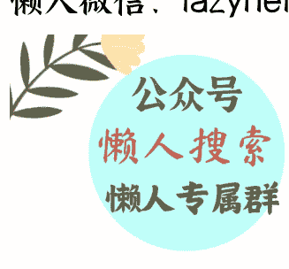

# 日产汽车出售总部大楼

251113

整理：公众号懒人搜索，懒人专属群独享
懒人微信:lazyhelper

微信:lazyhelper

2025 年 11 月 6 日，日产汽车发布公告称，将以 970 亿日元（约合 45 亿元人民币）的价格，出售位于神奈川县横滨市的日产汽车全球总部大楼。

背后的原因，是日产的全球销量，还在下滑。

2025 财年第二季度，日产汽车全球销量约 77.3 万辆，同比下降 4.5%。为了筹措资金，日产汽车已经到了不得不出售总部的落魄境地。

其实，早在 2024 年，日产的危机就很严重了。

2024 年二季度，日产的营业利润仅为 10 亿日元，同比暴跌 99%，净利润 286 亿日元，跌幅虽然没那么惨，但依然同比暴跌 73%。

问题的关键，是日产原来的香饽饽美国市场，从 2023 年二季度的 62 亿元人民币净利润，变成了 2024 年二季度的 9.8 亿元人民币亏损。

因为美国汽车市场也在打价格战，哪怕日系内部，丰田也在拼命降价，迫使日产以价换量，而日产的美国业务，以轿车为主。

在美国，中低端轿车是不怎么赚钱的，利润大头，被 SUV、皮卡占据，还有就是近年来崛起的 HEV（混动），偏偏日产这三样都不行。

所以，美国业务一下子就从赚钱，变成了亏损，再加上在中国市场也被冲击得厉害，整体利润暴跌。

遭遇危机后，日产先进行了内部自救，任命了新的 CEO 伊万·埃斯皮诺萨。伊万是墨西哥人，2003 年加入日产，一干就是 20 多年，期间兢兢业业。

伊万被认为是一名稳健、熟悉日产内部状况的老将，也许能够拯救日产。

不得不说，伊万还真是个务实的人，他上任后明显加大了中国品牌的合作力度。

2025 年 10 月 17 日，“日产中国 40 周年品牌之夜庆典”在杭州举办，伊万现身庆典现场，带来了日产汽车全球首款插电式混合动力轿车 N6，以及新天籁。

新天籁的特别之处，在于采用了鸿蒙座舱，虽然伊万看清了大势，但这些措施，一时半会还看不到成效，毕竟改革需要时间。

在日产自救的同时，日本政府，也在采取措施，试图对日产汽车进行救助，推动日产和本田合并，强强联手。

如果能成，自然是好事，问题在于，双方从一开始，就争执不下，本田的经营状况比日产要好（相对），所以，本田的态度强硬，要求在合并后，自己占主导权。

如果本田占主导，那么合并后，日产的原有产品线，恐怕会被砍得所剩无几，因为本田和日产的产品定位，本来就有很大的重叠。

日产当然不能接受，谈判进行不下去。最后，双方都不想合并了。

合并失败，自身的改革措施短期内又难见成效，所以日产还在继续下滑。日产的财年半年报显示，今年 4—9 月，日产亏损约 103 亿人民币（2219 亿日元）。

而去年这个时段，日产还是盈利的，这也是日产不得不出售总部大楼的原因。

日产的状况，是日本汽车产业的缩影，我们来看看其他六大日本车企的半年报。

- 马自达：上半年净亏损 452 亿日元
- 三菱：上半年净亏损 92 亿日元
- 铃木：上半年净利润 1927 亿日元，同比下滑 11.3%
- 斯巴鲁：上半年净利润 904 亿日元，同比下滑 44.5%
- 本田：上半年净利润 3118 亿日元，同比下滑 37%
- 丰田：上半年净利润 1.77 万亿日元，同比下滑 7%

可以看到，目前的日本七大车企，除了丰田能撑住，其他品牌的利润下滑，都比较严重。

而下滑的原因，除了中国品牌冲击，还有一个重要因素，往往被人们说忽视，那就是美国关税。

今年 8 月 7 日，日本共同社报道，受美国汽车关税影响，日本七大汽车制造商预计在 2025 财年（2025 年 4 月至 2026 年 3 月）合计减少营业利润约 2.67 万亿日元（约合人民币 1302 亿元）。

这个数字，相当于 2024 财年七大车企营业利润总额的三成左右。

具体到各个车企，损失各不相同。

- 铃木：损失预计为 400 亿日元（人民币约 20 亿元）
- 丰田：损失预计为 1.4 万亿日元（人民币约 680 亿元）
- 本田：损失预计为 4500 亿日元（人民币约 220 亿元）
- 日产：损失预计为 3000 亿日元（人民币约 146 亿元）
- 马自达：损失预计为 2333 亿日元（人民币约 114 亿元）
- 斯巴鲁：损失预计为 2100 亿日元（人民币约 102 亿元）
- 三菱汽车：损失预计也是 400 亿日元左右

有人说，美国加关税，日本车企到美国设立工厂，不就解决问题了？还真不能。

因为日本车企的一大利润来源，是在本土生产汽车，再出口到美国，以丰田为例，光这一项，每年就能贡献两到三成的净利润。

在美国设厂的成本很高，毕竟，美国制造业的环境，咱们都是知道的。

所以，美国工厂通常不赚钱。

只是为了避免美国不满，才去设厂，本土生产越多，往美国出口越多，则净利润越多，反之，去美国设厂越多，则净利润越低。

到美国设厂虽然销量能保住，但不赚钱。

因此，特朗普的汽车关税，对日本车企影响很大，难怪日本在这个问题上，咬死最高税率不能超过 15%，再多，就没法接受了。

目前，日本车企的状况，还远不是谷底。

日本车企长期有三大“现金奶牛”，分别是：中国市场、美国市场和东南亚市场。

当中国市场和美国市场的份额，逐渐守不住，东南亚市场受到冲击是早晚的。

而东南亚市场，才是日本车企的命门，日本车企常年占据东南亚市场八成以上的份额，把东南亚市场，变成了自己的后花园。

只要后花园还在，日本车企就还能保底，但随着中国车企纷纷进军东南亚，日本车企的垄断地位，开始受到挑战。

《日经中文网》的报道，在印尼市场，中国车企的份额已经达到了 6%，比 2019 年增加了三倍。

在泰国，中国车企的份额为 12%，比 2019 年增加了 12 倍。

在马来西亚，中国车企的份额为 23%，比 2019 年的 17% 也有较大幅度提高。

另外，在新加坡和菲律宾的市占率，也有一定的提高。

如果守不住东南亚这块最后的堡垒，那么，日本就可以和发达国家身份，说再见了。

## 最后，安利小懒的付费群:

懒人专属群 (介绍)

🧿 懒人专属群持续更新中，已持续运营 6 年，整理超 3000 份各类精选付费文章 & 年费社群干货，全部开放下载。

本资料为付费群内部分享，仅供真实有需要的朋友查阅🙇

懒人专属群更新记录:

https://lazy2025.top/blog/record2

懒人专属群更新记录 (需梯子，备用):

https://lazybook.fun/blog/record2