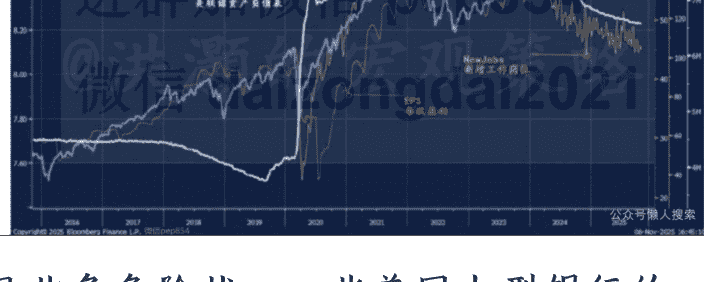
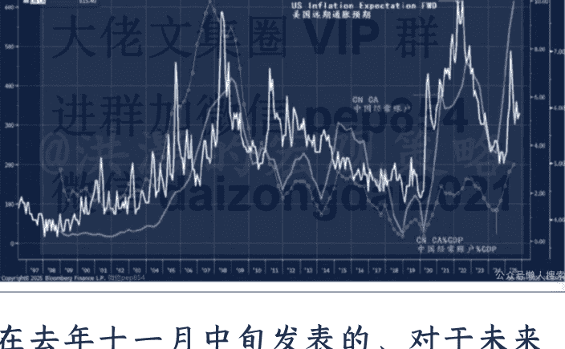
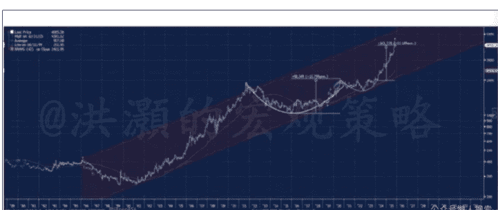
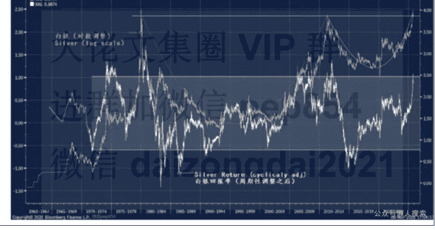
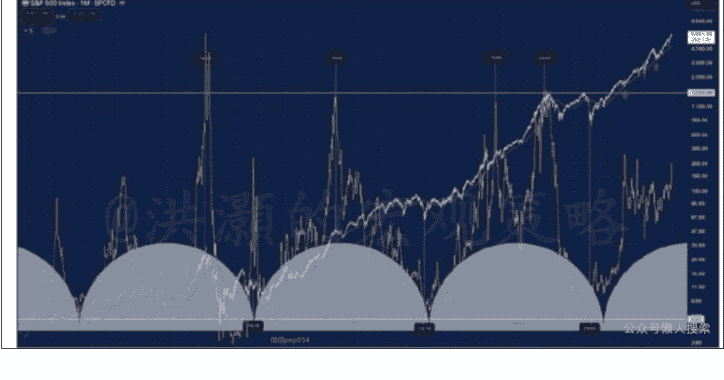
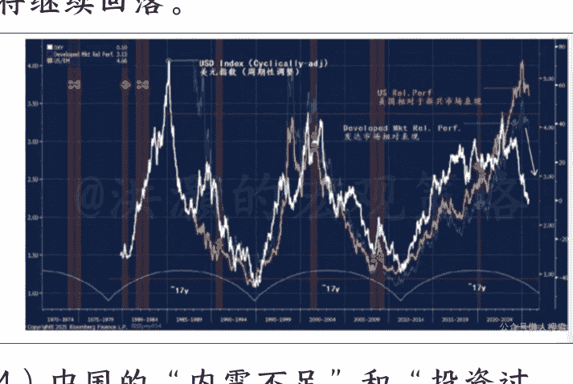
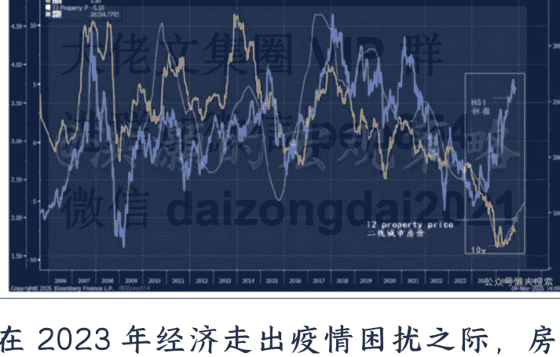

# 展望 2026:持而盈之 (上篇)

## 251111 洪灏的宏观策略

整理：公众号懒人搜索，懒人专属群独享

懒人微信:lazyhelper

2026 年度展望上篇。下篇明天发表。

## 当下市场的主要矛盾

时光荏苒，在我提笔之际，已悄然地掠过甲辰冬至。全球经济和市场的图景正从最近的一场价格势能崩塌中恍若突然梦醒，并面临着一场深层的裂变。2008 年美国次贷危机以来，全球央行用积极宽松的货币政策来平抑市场的巨幅波动。到如今，西方正在以无节制的财政扩张来抵御经济内在增速的下滑和疫情带来的额外开销。

由于美国政府赤字高悬、债台高筑，美联储的货币政策逐渐地失去了其独立性，慢慢地变为了从属于美国财政政策的工具。尽管市场对于特朗普任命的美联储货币政策执行委员颇有微词，但其实美联储的政策执行从来就不是完全客观独立的。简言之，市场高估了西方央行的政策独立性。比如，2008 年次贷危机中对于准美国政府金融机构的救助，以及耶伦以来通过买入短期国债来让美国财政悄悄地货币化。这种货币和财政的放纵和对于西方央行的盲信，对于下一个阶段全球经济和市场的发展意味深长。

价格势能崩塌的尘埃尚未完全散尽，但市场的焦点已无可逆转地转向了更为幽深复杂的深层次矛盾——在那里，财政的可持续性、地缘政治的裂痕，以及货币与财政政策那前所未有地交织与碰撞。市场桎梏于一系列历史性的矛盾，驶入了一片史上未曾航行探索的水域。

- 美联储的资产负债表的扩张与资本市场走势背离。美联储的政策资产负债表规模和标普指数的走势相背离，但与以美国新增就业岗位来衡量的美国实体经济的表現更相关（图一）。然而，我们的数据分析显示美股的上涨的确是有每股盈利增长而支持的。这个相关性显示在图一里，过去十年美国的每股盈利与标普指数齐头并进的上升趋势。如是，美股的上涨究竟有没有基本面的支持？

美联储的资产负债表已经从疫情时期的最高点九万亿美元左右的规模，缩减到如今的六万亿美元左右，而美联储表上的回购工具已经归零。最近，美联储表内流动性紧缺的情况导致回购利率大幅飙升。同时，美国私人信贷市场出现的坏账也导致了美国资本市场流动性突然绷紧，许多美国银行和金融机构不得不伸手向美联储借出短期流动性，以舒缓流动性紧张的局面。

图一：美联储的资产负债表规模与美股背离，但与就业更相关。

见此危言状，一些美国大型银行的管理层立即纷纷发声表态，认为这种流动性紧张的情况其实只是一些“局部性的个案”，不足以影响美国经济和市场的全局。然而，也恰恰在这个紧要的关口，美国股市出现了今年四月“解放日”以来最大的一次单天暴跌，美国主要交易所指数连续出现了四次在技术分析上令人蹙眉的“兴登堡凶兆”。这一切，还是发生在美联储继续降息的背景之下，其势如黄河出闸，沛然莫之能御。

2026 年度展望上篇约 13,000 字，下篇约 14,600 多字，全文共约 28,000 字。

- 在美联储依然在与居高不下的通胀预期困兽犹斗之际，特朗普悍然发动全球贸易战（图二）。四月的“解放日”前后美国乃至全球市场史诗级别的波动，相信各位读者依然历历在目。当时，美国市场的隐含波动率单天的飙升，是我们有数据历史以来最快的一天。中国市场的主要指数也单天暴跌了逾 7%，也是在中国市场历史上最大幅的单天下跌之一。

图二：美国远期通胀预期居高不下，并与中国经常账户盈余息息相关

在去年十一月中旬发表的、对于未来十二个月的展望报告《洪灏：展望 2025 年—周期与对抗》里，我写道：

> “如果特朗普对于股市的表现特别关注，把股市的涨跌作为自己政绩的一个重要评判标准，那么他上述的这些极端政策主张的最后版本很可能与竞选时的版本不尽相同，程度上应该大有缓和。现在，美股市场里的“特朗普交易”进行得如火如荼。

如果特朗普的上述政策主张使美国经济陷入滞胀、或甚至衰退的概率大幅上升，但美股市场现在的上涨显示市场对于特朗普管理经济的能力同时又是深信不疑，那么逻辑上现在美股的强势是很难持续的——直到美股开始合理的反映一个更温和版本的特朗普政策。

这些政策的影响，尤其是关税，对于美国和其贸易伙伴国家和地区，肯定是两面性的。比如，2018 年第一次贸易战的时候，虽然关税的增加导致人民币汇率大幅贬值，中国市场下跌，但美股在 2018 年的波动也非常显著。在 2018 年 2 月贸易战前夕，美股市场经历了一波量化巨震，许多做空市场隐含波动率的指数基金一夜归零。在 2018 年的四季度，纳指从九月到圣诞前夕足足跌了 25%。

因此，如果市场认可特朗普的执行力，那么 2018 年美股市场在贸易战中的表现可以作为参考。当年美股的巨幅波动，和现在美股不断新高的市况大相径庭。换言之，如果相信特朗普的关税大棒，那么美股现在应该下跌而非上升。”随后，在十二月中旬的那场、在深圳举行的特别加场读者见面会上，我为现场的读者清晰地预测了美股即将见顶并在未来三个月内将出现史诗级暴跌的场景和逻辑。美股是在今年二月十九日左右开始阶段性见顶并开启史诗级的暴跌的。

美国市场“解放日”后连续几天的史诗级暴跌，最终迫使特朗普出面延缓对于各国的拟征关税，并与中国达成了暂时的关税“停火”协议。这一系列的操作，构成了今年“特朗普交易”的逻辑——特朗普总是在关键时刻临阵退缩 (TACO=Trump Always Chicken Out)。从那时起，TACO 交易开始风靡一时，其实就是新版的"BTFD"(Buy the Freaking Dip，中文翻译就是“满仓梭哈”)。最近，美股再次出现巨幅波动，特朗普还是在标普连续两天出现 1% 以上的跌幅之际出面澄清，宣称这是“买入美股的良机，美股还要创出新高”

这次对于全球发起的贸易战，与 2018 年的那一场专门针对中国的贸易大战大相径庭。这一次，是特朗普企图从根本上改善美国贸易赤字、而不仅仅是改变对华贸易赤字的战略。表面上，美国的确是全球最大的消费市场，美国人的人均消费，是中国人的五倍。特朗普认为如果其它贸易伙伴希望继续向美国市场出口商品，那么他们必须要以付出高昂的关税为代价。

然而，美国赤字的产生有其深层次的原因。美国的经济结构是建立在一个全球化的贸易分工体系的前提下的。根据自由市场的原则和李嘉图的理论，在这样的一个全球化的贸易分工体系里，只要各个国家做好自己有相对优势的工作、并通过贸易互换来满足自己其它方面的需求，那么这样的一个全球体系必然是一个更高效的经 济体系。这种分工合作、贸易互换的结构甚至不需要这个贸易体系内的国家在某些领域里具有绝对优势。只要彼此之间有相对优势，那么这样的一个李嘉图国际贸易分工体系就是一个在经济上绝对高效的体系。

就是在这样的一个全球化体系里，美国经济开始专注于自己擅长的开发研究的软工业，比如高科技、软件、人工智能等，把制造业外包到人工、商品、制造成本更低的发展中国家。在 2001 年中国加入世贸组织之后，中国十几亿人口很快地从低劳动生产率、低生产附加值的行业里解放出来，并快速地在学习曲线上攀升，经过不懈的努力，最终成为了全球首屈一指的制造业大国。

然而，深谙李嘉图理论的经典经济学家始料不及的是，经典的理论从来没有考虑过中国绝对的人口优势和文化优势。曾经的全球化贸易分工交换体系里，从来就没有一个能与中国的经济和人口体量同日而语、相提并论的经济体加入。而中国文化里似乎从来就没有过西方经济学那种边际收益和边际成本的思考。中国文化，总是用最大的努力把所有的一切都做到极致。由此，任何制造业，只要有中国公司的介入，原来的西方行业巨头领先的市场占有率最后基本都将拱手让贤，让渡给中国公司。如太阳能、新能源汽车、机器人，等等。这些行业先例不胜枚举。

为了减轻对于美国市场的过度依赖，自 2018 年的第一场贸易战以来，中国致力于开发新的出口市场，通过“一带一路”和资本、技术输出等途径开发了一个又一个的、美国市场以外的市场。如今，美国已经不在是中国最大的贸易伙伴。东盟、欧盟与中国的贸易总额都已经超过了美国，而许多“一带一路”上的国家，也在中国低成本资金和制造业商品的帮助下开始迅速发展。中国已经不再是以前的那个任人摆布的贸易伙伴。

同时，中国还加强了对稀土供应和出口的控制。之前的贸易战中，中国曾经尝试过通过对于稀土供应的控制作为一项贸易的反制措施。然而，当时的这项反制的作用十分有限，因为当时稀土的采矿和处理行业都是极其分散的，而稀土的市场价格其实并不高，是一种低价的矿产资源。这样的市场结构像极了经济学里面的一种市场状态——一个完全竞争的市场 (perfect competition)。在这样的市场里，由于参与者众多，价格完全由市场的供需决定。同时，由于参与者人数众多，导致市场信号失灵、价格谈判无效，因为违反契约能够获得的成本远小于遵守契约的收益。这样的市场，必然是以价格无序竞争、利润无限归零、成本最低者胜出为结局。简言之，这就是内卷的一个案例。

在这样的一个完全竞争市场里，中国之前希望统筹各方面的力量来形成稀土出口管制的努力就很难奏效了。一些小的稀土生产商绕过管制出口稀土，以获得更多的利润。然而，在过去几年里，中国整合了稀土行业，形成了以三个国有巨头控制的、新的稀土行业格局。因此，在这次贸易谈判中，通过稀土管制来达到对于谈判对手反制的效果，就与上一次贸易战不可同日而语了。

显然，在这次谈判中，美国过高地估计了自己手上的筹码，低估了中国的反制力量和中国在全球制造业占有的绝对优势。美国对于全球贸易伙伴蛮横的关税、以及其它的一系列与北约、欧盟“断舍离”的动作，让美国在这次贸易战中几乎成为了逆天下之大势的独流，更进一步削弱了美国在谈判桌上的地位和其全球霸权。因此，美国的贸易赤字总量并没有改变，反而有进一步扩大之势。改变的，只是贸易赤字的结构。

理论上，只要制造业生产率的缺口持续存在，那么美国的贸易赤字就无法收敛。但也正是因为这样的生产效率缺口，让美国资本市场得以成为全球资本流向的中心。其实，美国大规模的资本开支，都是由全球各国的贸易盈余融资得来的。如果真的要解决贸易失衡的问题，美国不应该对于进口商品征税，因为生产效率的悬殊并不能通过关税来平衡。反而，美国应该对于进口的资本投资、外国资本利得征税。如是，各国对于美国的资本输出将开始减少，通过提高资本账户的准入门槛而达到资本账户和经常账户的平衡。当然，如果这样的话，美国的经济格局将出现根本性的变化，而美国的资本市场很可能也由此而遭遇巨幅波动。美国作为全球的资本市场核心、美元作为全球最主要的储备货币的地位都会被大幅削弱。这或许是美国想要重获平衡的不得不承受之痛。

- 美国的财政赤字占 GDP 的比例进一步扩大，黄金、白银历史性飙升，美国 AI 科技泡沫吹弹得破。曾几何时，美国政府因为疫情而扩大赤字以应对当时经济下行和通缩的压力。然而，在疫情早已结束了几年的今天继续大规模赤字财政，恐怕是因为美国政府的财政预算有难言之隐，预算缺口由于高昂的利息、医保和国防开支无法弥合，只能继续发债苟延残喘。在此背景之下，“美元信用贬值”的交易甚嚣尘上，黄金、白银、贵金属和全球风险资产开始历史性的飙升（图三、四）。这个市况，与我在六月对于下半年的市场预测一致。

图三：黄金历史性飙升，大幅突破历史高点。这一直是我的重点推荐。

黄金和白银是今年表现得最好的大类资产类别，甚至大幅跑赢了被市场“小登们”誉为“数字黄金”的比特币。黄金、白银也是过去几年以来我持续最看好的大类资产类别。在今年下半年的读者展望会议上，我重点向读者推荐了下半年黄金白银的机会，并认为黄金白银的涨幅将“远超市场共识的想象”。

图四：白银历史性飙升，突破历史高点。这一直是我的重点推荐。

而十月二十日夜盘，黄金、白银和贵金属再度遭遇断崖式下挫。金价重挫约 6%，直逼 4000 点心理关口；白银同步暴跌 6%，失守 48 美元阵地；钯金与白金则延续颓势，跌幅逾 7%。此番黄金单日跌幅为 2013 年以来所仅见。

早在这次历史性暴跌的前一周，我已在专属读者群预警了金银贵金属即将到来的调整，并预测了黄金、白银、贵金属历史性暴跌将开始的时间和价格水平。当时，我提前预判了白银将在 53 美元上方即将开启历史性回调，钯金即将在 1650 美元左右开始的历史性暴跌。十月十七日早间，我还在第一财经《首席对策》节目里，再度公开预测了这场即将来临的贵金属风暴的时间、价格水平和逻辑。

多年来，我倡导的“金囤不炒”理念仍令我的读者们念兹在兹，亦深深记得我在行情启动前预判“金银涨幅将远超市场共识”的洞见。我近期对于黄金、白银、贵金属崩盘时间和价格水平的系列预警，标志着我对于黄 金、短期交易逻辑的转变，但长期配置逻辑不变。因此，自十月十七日开启的这轮黄金、白银、贵金属的暴跌令我的预测备受市场瞩目，并在各大社交平台引发广泛共鸣（有兴趣的读者可自行查证)。

十月二十日夜盘黄金的暴跌，堪称统计学教科书中的泡沫破灭的典范。单日 5.7% 跌幅在黄金五千年的漫长岁月中所谓凤毛麟角，属近五个标准差波动。在统计学正态分布中，此情形本应二十四万交易日一现，堪称“千年等一回”的奇观。然而回溯 1971 年以来的 13,088 个交易日，类似跌幅实则呈现 34 次。换言之，十月二十日的历史性暴跌概率实为 0.26%，约每 385 个交易日（即一年半）便会如霹雳雷霆倏忽而至、震动山河，而更大幅度的单日下挫历史上其实已发生 21 次。

这些冷峻数据揭示：黄金从来都不是内敛的低波动资产。在既往研究中，我曾多次匡正市场对黄金“避险属性”的误读——黄金真正对冲的，是战争等终极尾部风险。然而，在日常交易中，黄金的本质仍是货币资产。自 1970 年代与美元脱钩后，黄金始终是对冲美元购买力侵蚀的利器。

除了对于黄金、白银、贵金属的预测、推荐和预警之外，我在六月的下半年展望会议上还对于全球市场将继 续创新高做了预测和推荐。今年下半年，除了美股不断创新高之外，全球非美市场也都突破到了历史新高（图五），中国市场的上证综指也回到了十几年来久违了的 4,000 点的整数关口。全球非美市场指数也突破了 2007 年十一月以来的高点。那时，由于美国房地产泡沫而导致的次贷危机如箭在弦、一触即发。十五年后，全球非美市场终于突破了这个历史高点。

“高点是拿来突破的，新高是拿来买的”，在六月举行的读者见面会上，我如是预测。

图五：全球市场突破历史高点。

那么，我们应该如何理解今年下半年风险资产价格的飙升？

如果黄金、白银和贵金属是避险资产，那么股票，尤其是美国的高科技成长板块和新兴市场股票显然不是。同时，最近的其它有色金属和大宗商品的价格上涨，也很难用避险和纸币信用购买力这个角度来解释。

如果说黄金、白银和贵金属是为了对冲美元信用的缺失，那么这种理论的确是有一定的道理。但是，在过去几 年，美元占国际储备的比重却并没有下降，反而依然稳固在 50% 以上。人民币的国际化进程的确取得了很大的成就，但是人民币在国际储备里地位和占比的上升是从蚕食部分欧元的储备地位和占比所得来的，而不是代替了美元。虽然人民币在中国的跨境贸易里作为结算货币的占比在大幅的飙升，但美元在国际贸易的结算里依然占据绝对的主导地位。而在全球的汇率市场里，美元汇率的交易还是占了 90% 以上。

因此，黄金白银作为美元信用缺失的对冲的确可以部分解释它们今年来价格的飙升，但是无法解释价格飙升的幅度和速度。当然，中国正在以每年逾 1,000 吨的速度囤积黄金。在实物金的市场里，中国占据了绝对的控制权。中国似乎在用黄金来为人民币国际化增加信用。同时，由于今年以来金价飙升，黄金在全球储备的占比已经开始超越了美债。

我们认为黄金、白银、贵金属作为避险资产的一路狂飙，与全球股票市场作为风险资产一起衔枚疾进，都有一个共同的分母——那就是全球的流动性条件在不断地上升。这个逻辑，也是我在六月的下半年展望会议花了大篇幅用我自己搭建的、专有的量化模型来解释和预测的（图六）。

图六：

### 全球流动性条件不断上升，推动资产价格上涨。

一般来说，在经济周期的下半场，我们会观察到黄金、白银、贵金属的价格上涨。因为这时是经济里流动性最好、经济基本面最扎实但即将转弱的时刻。简言之，黄金白银的价格历史性的飙升预示着市场巨幅波动即将来临 (图七)。随后，我们应该将观察到贵金属的价格势能将开始蔓延到有色金属，如铜、铝等。

最近，我们的确观察到了有色金属的技术图形开始向上突破它们长期的交易区间，行情似乎开始蠢蠢欲动了。

最后，在经济周期运行的末期，我们应该将观察到原油价格开始启动。一般来说，在所有的大宗商品中，原油是最后对于经济周期的运行开始反应的。

图七：黄金的飙升似乎是“山雨欲来风满楼”。

最近，新能源相关的大宗商品强势特别引人瞩目。这些新能源相关的大宗商品，如锂矿的价格，往往领先原油价格的运行三到六个月。换言之，在未来三到六个月，我们应该会看到原油的价格作为对于经济周期的反应而走强。而当我们观察到原油价格这样的走势的时候，我们就离经济周期的结束可能不远了。

美国经济周期进入晚期的另一个表征，是美国 AI 科技股的估值全面泡沫化。美国纳指 100 指数的估值，许多指标已经超越了 2000 年互联网泡沫顶峰时期的高度，而巴菲特喜欢用的市值比 GDP 的比率则一路狂飙，不断新高。虽然我们在图一中展示了标普指数的上涨和每股盈利的增长之间密切的相关性，同时美国科技指数年初至今的估值倍数因为盈利强劲地增长而有所收敛的，但是这并不代表着美国科技股依然非常高昂的估值就合理了。

最近美国许多科技公司的盈利继续超出市场预期，然而强劲的盈利增长叠尽管管理层对于未来增长升级的预期指引并没有阻止美国科技板块的回调。最明显的就是 Palantir 这个美国科技板块的天之骄子。就连浓眉大眼的微软在强劲的盈利报告之后也大幅下跌，股价走势酷似一个“双顶”的技术形态。

如果我们把标普指数一百多年的价格走势进行周期性量化调整，我们可以看到一个明显的 35 年周期的波动规律（图八）。同时，可以看到历史上标普指数历次历史性顶部和底部对应的这个 35 年大周期的峰谷和峰值。如今，美股正处于 2009 年以来的一个 35 年周期的顶部附近。2026 年正好是 2009 年复苏以来的第十七个年头，也正好是这个 35 年周期的顶部。从周期运行的时间上看，2026 年都是值得警惕的一年，也是一个观察美股泡沫破灭的关键时间窗口。

图八：标普指数的 35 年大周期，2026 年是 2009 年以来的 35 年周期的顶部。

不仅仅是相对于自身的周期运行，美股市场相对于其它发达国家市场和新

兴市场的相对收益也运行到了历史的顶部（图九）。在去年的展望里，我们已经为读者呈现了这个宏大的美股相对收益周期和美元周期进入下行阶段的预测。当时，我们认为，伴随着美元周期进入下行贬值阶段，美股的相对收益将开始缩小，新兴市场和其它发达国家市场很可能更有机会。

今年以来，我们看到美元在最近这波技术反弹之前，是全球表现最差的主要货币，没有之一。美元今年的这个显著的贬值趋势与年初市场共识一致认为美元将大幅走强的观点完全相悖。同时，我们看到许多非美市场，包括欧洲、日本这样的已经沉寂多年了的市场，今年的表现都远远领先美国市场。而中国 A 股和港股都是今年以来全球表现得最好的主要市场，为投资者带来了丰厚的投资回报。

图九：美股的相对收益已经见顶，并将继续回落。

- 4) 中国的“内需不足”和“投资过剩”之间的失衡。这是一个西方观察家长期诟病的一个问题。其实，所谓的“内需不足”和“投资过剩”其实

是一个硬币的两面。简言之，由于投资在整体的 GDP 里占比过重，那么内需自然就会占比下降，显得“不足”。更勿论，中国的产能投资有很大一部分是为了满足海外的需求。我们一直认为，中国的内需不足还有更深层次的结构性原因，很可能是分配结构所导致的。

在去年十一月中旬发表的、对于未来十二个月的展望报告《洪灏：展望 2025 年—周期与对抗》里，我曾对于这个问题做了详细的论述：

> 一般来说，在一个供给远远大于需求的经济体内，价格的运行往往表现出下行趋势。在这样的经济体里，通胀基本难以察觉。由于价格具有市场的信号作用，在一个价格不断下行的通缩环境里，生产者将缩减产能投资来节省成本，同时消费者由于预期的改变推迟开支计划，通过调整消费篮子里的消费品构成、甚至缩小消费篮子来应对。经济发展的负反馈效应也由此产生。

如是，为什么在中国这样的一个价格出现明显下行趋势的环境里，产能投资反而不断扩大，供给反而远远而持续地大于需求？难道市场的信号失灵了吗？

早在五年前，在我的畅销书《预测：经济、周期和市场泡沫》里，我讨论了全球价格压力消失的现象。我认

为，如果经济里贫富悬殊、分配失衡，劳动者的收入占比在经济产出内过少，那么这样的经济一定是一个过剩的经济。从中国的公开税收数据看，经济里 10% 的人获得了 90% 的收入，交了 90% 的税。如是，那么剩下的 90% 的人凭着 10% 的收入很可能只能消化 10% 的产出。即便是高收入人群消费能力强，人均是低收入人群的几倍，这 10% 的高收入人群也无法完全消化剩下的 90% 的产出。因此，这样的经济一定是生产过剩的。这时，这个经济里的剩余产能一定需要通过出口由外需来消化。

如此，这个观察解释了为什么中国市场的价格通缩压力大（分配失衡而使得内需不足），但价格的下行信号也没有阻止生产者不断地扩大生产来出口满足外部的需求。这是内需不足的结构性原因——并非完全是因为如西方观察家批评的“收入不足”，而更多的是因为收入分配的结构。这也是“共同富裕”的目标的重要性。

近年来，虽然中国的贸易盈余不断上升，今年或将达到一万亿美元左右到历史高点，但是出口商品的价格其实是在下降的。换言之，中国出口产能相对于外需来说，也开始出现了过剩的迹象。这时，中国不断扩大的贸易盈余宏观上可以视为中国生产者盈余补贴了外需消费者盈余，并很可能通

过收入效应反过来进一步压抑内需的消费者盈余。因此，中国出口越旺盛，内需反而越低。而统计计算上，经济的三驾马车里投资和出口的增速越快，那么消费的增速也就越显得被压抑。以上的理论和经验观察，也可以通过经济数据来印证。

如果把经常账户的盈余看作是通过出口获得的海外储蓄，而中国乃是全球出口和生产的第一强国，那么中国的储蓄相当于国内和国外储蓄之和。在宏观里，投资等于储蓄，经常账户与资本账户之和等于零。然而，通过对于跨境资本流动的控制，中国在很长的一段时期里实现了经常账户和资本账户双盈余的格局。

因此，中国的投资不仅仅来自于中国人民天生的储蓄习惯，还有海外的储蓄和资本。如此庞大的资本积累，使得中国经济结构里，投资自然就占据了很大的比重。在很长的一段时期内，投资占中国经济的近 50%。如此高比例的投资持续时间之长、在经济里的占比之高，都是全球经济历史上绝无仅有的。因此，在统计数据中，中国经济里的投资、出口显得权重很大，消费自然占比较少。在西方观察者的眼里，这却变成了所谓的“内需不足”。”去年展望报告里的这些对于消费和投资失衡的论述，是对于中国

现阶段经济结构最好的解局。这些结构性问题并不能在短时间内一蹴而就的解决，但我们已经看到了近期的重要会议开始对于收入和分配做出了一些调整。我们认为，在新一个五年里，消费、收入分配等问题的重要性已经在会议通稿里大幅靠前，显示了决策者对于这些问题的重视。因此，它们的最终解决也应该值得期待。

- 5) 中国的牛市“没有基本面支持”。在西方媒体采访报道的时候，如果这个西方媒体想要“唱空”中国经济，它往往会选择问一些房地产相关的问题。自 2021 年房地产见顶以来，房价一路下行。虽然今年一季度房价曾经出现了惊鸿一瞥的反弹之势，但二季度之后房价和销售情况又再次掉头向下。的确，房地产市场还是乏善可陈，并引发一系列的相关问题。

在去年十一月中旬发表的、对于未来十二个月的展望报告《洪灏：展望 2025 年—周期与对抗》里，我是如此讨论这个问题的：

> “现阶段，中国经济里两种货币投放渠道的效果也很可能是不一样的。通过商业银行贷款的传统渠道，尤其是房贷，货币直接进入居民家庭的支出消费环节。不仅是贷款创造出了更多的存款，而且由于房地产上下游产业链的绵长，房贷的乘数效应比其它种类的贷款更明显。而通过外汇占款投放的货币则进入出口商的账户中，年景好的时候可能会让出口商继续投资出口产能，加重了产能过剩的问题；年景不好的时候，虽然出口商可能会把一部分货币以工资、货款等形式转入实体经济，但如此产生的投资以及因此减少的投资乘数效应，直觉上也会大幅减少。

房价跨越了长期上涨的拐点之后，房价的下行对于地方财政的紧缩作用也是重若千钧的。如前所述，分税制改革后，地方的财政收入主要来源是卖地收入。由于房价上涨预期发生逆转，商品房销量下降，开发商拿地意愿同时下降，导致卖地收入锐减。今年，地方卖地收入在去年已经很低的的基础上又下降了 20%。地方财政的困难可想而知。

然而，与居民家庭的资产端缩水导致的资产负债表紧缩的效应不一样，地方的紧缩主要还是现金流量表的问题。现金流不足，部分是因为卖地收入的锐减，部分也是因为历史债务过重导致还本付息的现金流需求提高。当然，由于现金的积累在被逐步消耗，地方资产负债表的资产端肯定也有所收缩。

行文至此，中国经济当前的局面便跃然纸上了：由于房价下跌，居民家庭资产负债表收缩，买房意愿下降，使

得传统的央行通过商业银行信贷投放货币的渠道不再如历史上那么有效，不得不借助强势出口获得美元，再通过外汇占款把美元流动性转化为人民币流动性而投放；同时也是因为房价下跌，地方政府卖地收入锐减，财政收入不能应对支出和历史债务还款付息的现金流需求，产生了地方财政紧缩效应。这也解释了为什么今年地方非税务收入大幅增加，以及所谓的“远洋捕捞”现象。同时，货币投放渠道的转变也大大地减弱了央行货币政策的效应，消费不足和民间投资的下降。这些都是现阶段的经验观察。”

然而瑕不掩瑜，中国在制造业上的绝对优势和在科技上取得的一系列的突破，是全球有目共睹的。疫情期间，为了对冲房地产市场下行对于经济增长的拖累，中国毅然增加了对于高端制造业的投资，并用这个部门的投资增长对冲了房地产下行的压力。表面上，这是非房地产行业突飞猛进、日行千里的原因。

最近中国市场走牛，重新回到了久违了的四千点。很多市场观察家认为中国市场的上涨“缺乏基本面”的支持。这就是一种典型的惯性思维，认为房地产不好的话，整体市场都不会好。然而，如果中国继续前仆后继地把资金和辛辛苦苦积累下来的资本继续投向房地产行业，那么对于经济长期的拖累和对于市场运行的影响是可想而知的。

我们要特别指出的是，这个和房地产背离的市场走势，恰恰是中国经济出现成功的结构性转型的初步结果（图十）。图十中，我们展示了中国的房价下行压力仍存，而这个房价下行趋势产生的通缩预期引导长端利率下行，并从 2024 年左右开始和中国股票市场的走势背离。

### 图十：中国市场走势与房价和长端利率（基本面）背离。

在 2023 年经济走出疫情困扰之际，房价和房地产销量也曾出现过几个月的反弹，然后又无疾而终。这种情况显示了，在 2021 年房地产见顶之后，人们买房投资的惯性心理仍然挥之不去，依然认为流动性释放出来、经济周期开始反弹之后，房价也将回暖。

然而人们始料不及的是，2021 年前后，房地产的大周期已经见顶。这个时候，主导房价走势的一些长期结构性因素对于房价预期的影响，开始显得洞若观火了。比如，人口老化导致

的人口结构性的改变，中国的城镇化趋势开始放缓，等等。这些都使得在房价长期下行趋势中的任何反弹都将是昙花一现、无以为继。

这时，如果中国继续选择把资金投向房地产以维持经济增速，而非通过发展新兴行业弥补、对冲中国房地产造成的缺口，那么中国经济将失去这个结构化转型的时间窗口。可以说，中国股票市场走势与以长端利率为代表的基本面的背离，恰恰是过去几年里中国做出了极其艰难的选择、开启结构性转型取得初步成果的最好的证明之一（图十）。可以预见，在经济结构性转型不断深化之后，人们的收入和预期很可能不再完全受到房地产市场的牵制。那时，房地产价格的走势不再左右长端利率，中国的“基本面”和中国市场的走势将再次趋同。

以下，我们来总结一下今年以来全球经济和市场的几个主要矛盾。

由于多年来无节制地“撒钱”，美国政府的财政状况每况日下，债台高筑，不得不持续发短债来补充美国政府的预算缺口。也就是在这个关口，美联储经过了艰苦的缩表，资产负债表规模缩减了三分之一到六万亿美元，而且美联储表上的回购工具已经归零。整体来看，美联储的资产负债表对于资产价格的走势应该是偏中性的。

然而，由于美联储不得不继续为美国政府发债融资，购买大量的短期债券让美国政府的财政支出得以苟延残喘，美联储的货币政策开始从属于美国政府的财政政策，并继续进行财政货币化。这时，美国股市的运行开始与美联储的资产负债表背离，美联储一边缩表，但美股却不断新高。美联储的资产负债表的规模与美国的新增就业岗位更相关。这两个指标都在不断地下行，而美国股市的上升趋势和不断扩大的美国赤字水平则更相关。

这种情况显示了，过去两年美国政府的财政赤字才是推动美股不断新高的真正动力。而美联储为了控制通胀而采取的量化紧缩让美国的实体经济备受压抑。这是美国实体和金融之间的对立。可想而知的是，尽管美股在财政刺激中不断上涨，但总有一天是要还回去的。大约在什么条件下什么时候美股将会吐过去几年的涨幅，这是市场分析师们没有讨论清楚的问题。

在六月展望下半年的时候，我用我的量化模型预测了今年下半年全球流动性条件将继续改善。这很可能是因为西方政府不得不使尽浑身解数保持流动性宽松，为财政赤字的融资提供便利。流动性条件的改善有利于下半年风险资产的表现，而黄金、白银、贵金属以及非美市场曾是我们六月份展望时的重点推荐。

中国长期投资和消费失衡的结构性问题正在得到决策者的重视，在重要会议的通稿里所占据的重要性大幅抬升，而一些改善这些结构性问题的政策已经出台并开始实施。我们一直认为，中国的“消费不足”的问题其实是分配的结构问题。这个观点，在我五年前的畅销书《预测：经济、周期和市场泡沫》中早已经详细论述。在一个财富分配失衡的经济体里，有效需求被购买力所抑制，相对于产能肯定是显得严重不足的。

在房地产市场达峰之后，中国开始了经济结构转型，用新兴产业的产能投资来弥补、对冲房地产行业下行带来的拖累。而中国经济的“二元结构”由此而生（我早在六月十一日彭博社香港峰会上详细论述。这个讨论彭博社已经录制成播客在其

“Trumponomics”节目中播出。有兴趣的读者请自行搜索）。可以看到，新兴的、非房地产行业的高速高质量的发展，与房地产行业日薄西山之势形成了鲜明的

对比。虽然房价下行的压力引导了价格通缩的预期，但是中国市场还是义无反顾地上涨。现阶段的这种股市与基本面的背离，恰恰是中国经济结构性转型初获成果的印证。

换言之，中国股市由于盈利增长而上涨，而上市公司盈利的增长很多是来自于那些新兴行业和高端制造业，但中国的基本面却还是用一些旧经济指标来衡量。如是，这两者的背离并不能说明市场的上涨“没有基本面的支持”。它们只是在计量经济里不同的方方面面罢了。

由于中国现在是全球制造业的绝对王者，中国在制造业中的绝对优势凸显了美国在这轮贸易谈判中高估了自己的谈判筹码。自第一次贸易战以来，中国还统筹整合了中国的王牌——稀土的开采和处理，让中国在这次贸易谈判中不卑不亢，立于不败之地。特朗普关税和中国出口强势很可能将让美国下一阶段的货币和财政政策的决策进一步复杂化。美国 AI 科技股的估值已经泡沫化。以一百多年的历史佐证，标普指数已经运行到了 35 年周期的顶部，距离 2009 年的复苏正好 17 年。美股出现巨震和暴跌的概率不可小觑。

明天，我们将讨论中国和全球市场未来十二个月的机会。

## 最后，安利小懒的付费群：

### 懒人专属群 (介绍)

💪懒人专属群持续更新中，已持续运营 6 年，整理超 3000 份各类精选付费文章&年费社群干货，全部开放下载。

本资料为付费群内部分享，仅供真实有需要的朋友查阅🤫

### 懒人专属群更新记录：

https://lazy2025.top/blog/record2

懒人专属群更新记录 (需梯子，备用):

https://lazybook.fun/blog/record2