# 展望 2026:持而盈之 (下篇)

## 251114 洪灏的宏观策略

整理:公众号懒人搜索，懒人专属群独享

懒人微信:lazyhelper

展望中国和全球市场未来 12 个月的风险与机遇。

最近几个月，中国宏观经济数据开始出现了一些可喜的变化：工业企业利润开始了连续两个月超过 20% 的大幅增长，并且远远超出了市场预期；上游的通缩压力开始有所缓和，而十月份显示消费端的通胀环比开始好于市场预期。这些都是宏观经济开始边际转好的初兆。

当然，也有人会指出房地产的价格和销量依然拾级而下，房地产投资依然在以双位百分比的速度继续下行，这些人也会从而看到中国经济当前所存在的问题。然而，如前所述，我们认为当下中国经济的“二元结构”决定了房地产行业和非房地产行业之间表现的背离（我早在六月十一日彭博社香港峰会上详细论述。这个讨论彭博社已经录制成播客在其“Trumponomics”节目中播出。有兴趣的读者请自行搜索）。正是因为中国停止把资金投向房地产，转而把资金投向朝气蓬勃、潜力富蕴的非房地产行业，中国经济才得以在房地产长周期下行的阴霾中杀出一条血路，保证中国经济以 5% 左右的增速前进。

根据十五五规划，可以想象，房地产在整体国民经济中的占比将继续下降，而其它新兴行业的占比，尤其是高科技、高端制造业在整体经济中的占比，将持续上升。这些行业的长足的进步，也将对冲中和房地产下行的压力。当然，房地产并非绝无机会，在长周期下行趋势中也将出现间歇的反弹。但是这些短期的反弹在人口结构和经济增长模式发生长期趋势性变化的时候，是很难逆转房地产下行趋势的。

今年七月，雅江工程面世，我们率先发表了一系列看多做多中国市场的报告。我们认为，雅江工程不仅仅是一项宏大的基础建设工程，它更是中国的一个“政策的拐点”，是“反内卷”政策的具象化。如果内卷导致价格无序竞争并加重了经济内部通缩的预期，那么“反内卷”政策的意义则显出泰山之重了，而这个政策的具象化更凸显了决策层逆转经济里负面预期的信心。在这个重要的拐点，我的专属研究报告的题目就非常直白地题为《雅鲁藏布牛》和《大拐弯处见牛》。我当时认为，投资者的资产配置应该尽快地从“抗通缩”的逻辑（债券）转为“再通胀”的思路（股票、大宗商品）。

那么，经历了近半年，中国的经济和市场周期现在运行到了哪一个阶段？有什么是市场价格还没有计入因素，将推动中国市场进一步上行？

以下内容仅 V+ 会员可见

### 美国、全球经济和市场展望

在上半部分，我讨论了当下全球经济和市场面临的几个主要矛盾。这些矛盾关乎于中美经济周期的矛盾和相互影响，以及美联储在下一个阶段决策的制约条件。而今年以来黄金、白银、贵金属历史性的飙升恰恰是这些矛盾的表征，并预警了下一个阶段市场运行的风险。

近期，由于美国政府停摆，美国官方经济数据停止发布。一系列重要的数据，尤其是关键的美国就业数据，让市场无从索引。政府的停摆、数据的停发，让美联储盲人瞎马、如履薄冰。

所幸的是，在做了研究近三十年之后，我独立开发了一整套量化模型，通过收集各种的经济和市场数据并进行周期性的量化处理、交叉验证之后，凝聚融汇成为一系列具有前瞻性的指标。这些量化模型和指标帮助我在近三十年的研究和现在的对冲基金管理里，在市场大级别的拐点暮色苍茫之际乱云飞渡。比如，在去年十二月预测未来三个月左右美股将出现大级别的回调，以及在今年三月底预测美股四月历史性的崩盘并随后见底反弹，等等。

如今，我的量化经济周期模型显示美国经济还在正常运行（图十一），虽然很多新闻头条显示美国经济似乎岌岌可危。同时，我的模型还预示着在未来数月美国经济很可能将放缓。这很可能是因为特朗普政府各种倒行逆施、胡作非为的政策所致。

我的量化半导体周期指标是一个测量美国半导体行业实际运行的量化指标，通过实时追踪美国半导体订单量、出货量、出货价格、库存变化等变量来测量美国半导体周期运行所处的阶段。这个指标显示，美国半导体周期运行得如火如荼，正在向历史上开始预警市场回调的高位水平涌动（图十一）。换言之，美国科技股还有新高。

美国半导体周期指标当前的这个位置，和我们现在经验观察的美国半导体科技周期的体感一致。同时值得指出的是，美国经济周期和半导体周期的的走势已经出现背离。盘面上，这两个指标的背离体现在美股现在绝大部分的涨幅来自于几个科技巨头和 AI 相关的、屈指可数的几个公司。美国市场的宽度，也就是参与市场上涨的股票个数比例，则越来越小了。

每天，美国的大型科技公司都在宣布历史性的资本支出，用以建设数据中心。当年，李飞飞提出的“AI 发展的瓶颈是数据的稀缺性”的观点已经深入人心。现在的问题是，美国大型科技公司的股价是否已经过分计入了这些高昂的开支所隐含的、对于未来或是不切实际的预期。

#### 图十一：美国经济周期在未来数月内将开始放缓，半导体周期还在冲高。

与此同时，我的量化全球流动性指标也开始渐入高点（图十二）。这个指标汇聚了全球主要经济体的主要货币流动性数据，并把它们汇聚成为一个代表着全球流动性条件变化的综合性指标。在今年六月展望下半年的时候，我成功地预测了下半年的黄金、白银、贵金属以及全球风险资产历史性的上涨。六月的这个预测能够成功，我的这个独有的量化全球流动性指标可谓是功不可没。

如今，这个指标显示全球流动性开始冲高、并在未来数月将开始回落的阶段。同时，我们观察到美国的收益率曲线也开始从高位回落，而远期通胀预期这个滞后的指标在未来数月却依然将居高不下。通胀的这种滞后的惯性，在时间上和全球流动性条件即将进入拐点相矛盾。

如是，这些指标的走势与我的量化周期指标所显示的、美国经济周期所处的阶段基本上是一致的：高位回落的美债收益率曲线显示美国经济将在未来数月放缓，然而美国的远期通胀预期却将因为特朗普关税的阴霾而居高不下，并将会让美联储的货币政策决议复杂化。

#### 图十二：全球流动性条件开始从高位回落，预示着全球经济周期将放缓。

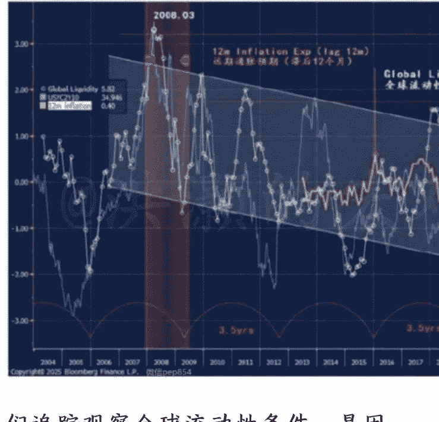

我们追踪观察全球流动性条件，是因为流动性是一个终极的领先指标（图十二）。流动性条件指标往往领先市场运行三到六个月。比如，图十三显示，我的全球流动性条件领先全球经济的领先指标。这也是为什么我的预测往往先人一步，尤其是在市场拐点的时刻。我近三十年研究生涯所取得的历史业绩，尤其是近二十年来从华尔街回归到中国市场后在中国市场取得的预测成功的记录可以佐证。比如，我成功预测的 2013 年的“钱荒”和反转、2015 年泡沫始终、2018 年的美股四季度暴烈的熊市和反转、2020 年疫情的暴跌和反转、2021 年的科网股泡沫、2022 年的暴跌和当年十月底的“买！买！买！”，以及最近两年中国市场的筑底回升和今年的 4000 点行情，等等。

#### 图十三：全球流动性条件指标领先全球经济领先指标。

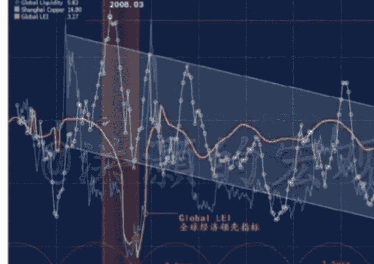

我一直认为，只有拐点才能改变人生，只有与众不同的观点才能真正地给投资者增加价值。投资是一场马拉松，研究也是。因此，观察一个分析师是否可靠，应该看他长期的历史业绩、尤其是在拐点处的判断。没有谁的胜率是百分之百，但是一个好的、可靠的分析师，他长期预测的胜率应该是远远地高于市场平均的。至于那些上下几十个点的小波动，预测对错其实都毫无意义，不足挂齿。因为这些短期的小波动其实更类似于随机游走，也不能改变谁的人生。

在前述的讨论中，我们论证了流动性条件变化对于全球经济和市场的前瞻性指引。然而，由于股票市场本身就是流动性的一个重要组成部分，那么我们必须要问的，是什么领先流动性条件这个领先指标？毕竟，关于货币的领先指引作用，凯恩斯是这样论述的。他说，“金钱是连接历史和未来的桥梁”。在凯恩斯的分析框架里，他对于流动性条件的变化以及其对于市场的影响有大篇幅的论述。

为了解决“是什么领先了流动性的领先性”的这个问题，我进一步开发了一个独有的流动性条件领先指标。这个指标领先流动性条件的变化大约三到六个月，而近年来这个指标的领先性表现得非常稳定，尤其是在 2015 年泡沫破灭后的十年。这个指标显示，全球流动性将开始冲顶，并将在未来的三到六个月里回落——如果以史为鉴的话（图十四）。

#### 图十四：流动性领先指标显示，全球流动性将在未来数月冲顶回落。

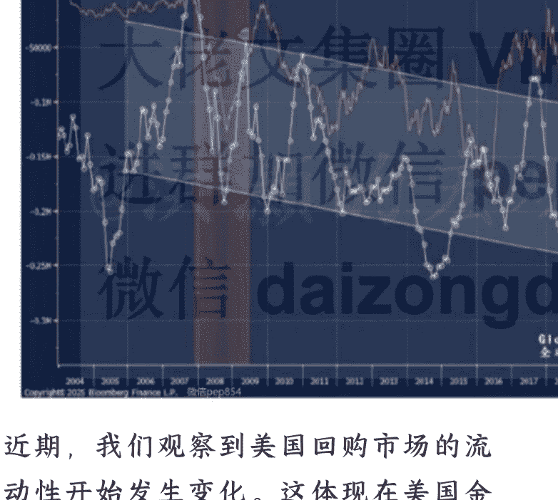

近期，我们观察到美国回购市场的流动性开始发生变化。这体现在美国金融机构开始向美联储借钱，同时美联储的 SOFR 和回购利率之间的差距显示了回购市场的流动性异常紧张，类似于 2024 年 9 月和 12 月的情景。与此同时，美元指数开始从 2008 年以来的上升趋势的下沿反弹。而十年美债收益率开始无限接近它的长期均线。这些都是短期内美元流动性趋紧的表现（图十五）。

### 图十五：美元指数开始从 2008 年以来的上升趋势的下沿反弹

美联储的公开数据显示，美联储资产负债表上的隔夜逆回购工具（ONRRP）已经从 2022 年的 2.6 万亿美元几乎归零。同时，回购市场上利率的飙升显示市场的流动性开始短缺。在最近的一次议息会议上，美联储认为十二月降息依然不确定，但宣布美联储将从十二月一日起停止它的量化紧缩（QT）。其实，根据回购市场上的流动性情况，十二月是不可能不降息的。而且，美联储很可能将立即从量化紧缩转为重新大幅扩表，也就是重新量化宽松。这是一个关键的时刻。

在过去两年多的量化宽松里，美联储通过撤回 ONRRP 缩表，企图通过缩表来控制美国经济里由于疫情救助计划而产生的过量的流动性。在正常情况下，这种逆回购工具的撤回将会把过剩的储备归还给美国银行系统。在美国银行的资产负债表获得充足的储备的时候，它们就会开始放出贷款、创造出新的流动性，继续支持美国经济的运行。

然而，事与愿违。在美联储把过剩的储备归还给银行之后，银行的储备并没有大幅增加。这是因为美国家庭部门开始取出银行存款去购买美国国债，反而中和对冲了美联储储备归还应该产生的、银行由于储备的增加而开始发放新增贷款的效应。同时，美国的回购市场行为也发生了巨大的变化。历史上，美国的非银机构，如美国的货币市场基金，曾是回购市场的主要参与者。这些基金曾为国债回购市场提供了充足的流动性，平抑了回购利率的波动。然而，现在货币市场基金对于回购市场的兴趣发生转变，而是企图买入美国国债以获得更高的利息回报。这种转变导致了美国回购市场的流动性逐渐干涸，尤其是在美联储的 ONRRP 逐步归零之际。于是，就发生了去年四季度和最近几周美国回购市场利率大幅飙升的情况。

近年来，越来越多的对冲基金参与了美国国债市场的基差交易。这些对冲基金试图卖远期国债期货买短期国债现货，并通过加上几十倍甚至上百倍的杠杆来获取收益。数据显示，这种美债市场的基差规模甚至超过了一万亿美元。可想而知，如果短端利率大幅上升，那么这些带着巨额杠杆的基差交易将大面积爆仓，并引发市场大幅震荡。显然，这也是有违美联储的短期政策、维稳金融市场的目标的。

有美联储官员声称，由于美联储资产负债表上所持有的国债和 MBS 债券的久期非常长，同时市场短端利率相对较低，那么美联储将会更多地买入短端的债券。这种做法，也与平抑短端利率安抚市场波动性的政策目标一致。数据显示，美联储资产负债表的久期在八年左右。如果美联储下一步通过短端扩表，那么美联储资产负债表的久期并不会因为美联储扩表而延长。如是，美联储资产负债表对于资产价格的影响就变得相对有限了，而不会像以前的扩表那样，对于资产价格的上涨起了推波助澜的作用。进群加

无论如何，美联储现在的政策选择处于“三难”的境地：一方面就业数据已经开始走弱，但是远期通胀预期居高不下甚至还会进一步走高。这个增长和通胀的矛盾使得美联储扭扭捏捏，不能大幅降息；另一方面，美国政府债台高筑，但美债买家的结构组成也发生了根本的变化，比如外国央行开始减持美债，等等，使美联储不得不帮助美国财政部债务货币化。这是美联储货币政策独立性遭遇的矛盾；再一方面，如果美联储重新扩表，对于资产价格的影响短期很可能是向上推进的，具体效果取决于美联储买入美国国债的久期。然而，美国的资产价格早已虚高，政策进一步上推资产价格反而将导致金融市场的不稳定，违背了美联储短期的政策目标。

当然，美联储也可以在收益率曲线均匀地购买债券以减轻对于资产价格的影响。直觉上，无论美联储通过买短期或是买长期的美国国债来重新扩表，短期内对于资产价格的上涨都是正面的。买长期国债将导致长期国债利率走低，利好资产价格上涨，但是对于回购市场利率的控制可能就岌岌可危了。而我们认为的更可能的情况，就是先买入短期债券进行财政货币化，平抑短期回购市场波动的风险。这时，美联储的资产负债表的久期其实是不变甚至缩短的。如是，短期内美联储通过买短重新扩表会被市场大众认为是一项利好消息，导致资产价格最初膝跳反应式地上涨。然而，当市场全面消化了这个消息之后，美国市场将开启下跌模式。其实，美国十年国债收益率所处的这个长期均线的关键位置但悬而未决，就已经显示了美联储现在决策的“三难”（图十六)。

图十六：美国十年国债运行到了 850 天均线的位置，悬而未决。

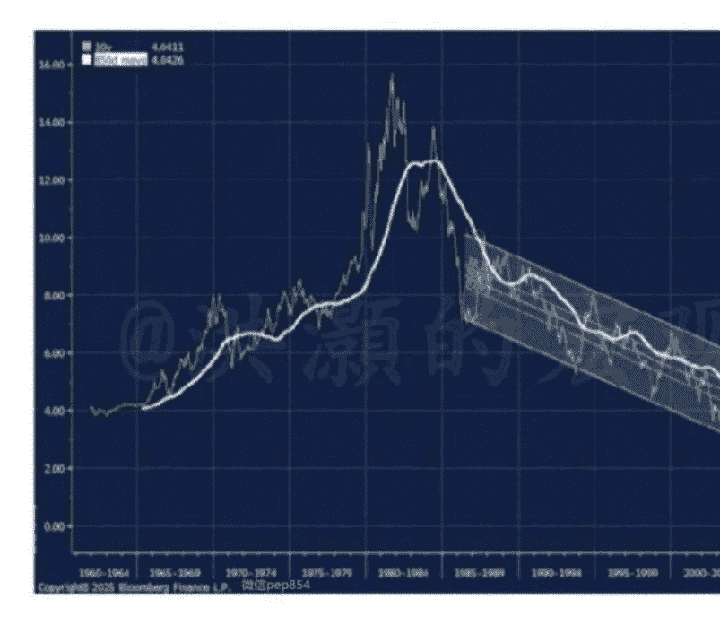

无论如何，上述分析显示，美联储的货币政策已经开始从属与美国的财政政策了。恃戟者危，货币政策逐渐失去其独立性，就意味着美联储决策时的制约比以前更多，因此决策过程也将更复杂、更困难，出错概率上升。

上述的情景分析和我一系列的量化流动性模型所获得的预测基本相符：美联储将继续降息，并不得不很快地重启扩表。如是，市场大众最初会简单粗暴地把这一系列复杂的货币政策决定解读为利好资本市场，直到发现美联储的资产负债表表的久期并没有大幅的延长，因此对于资本市场的影响也就有限了。美股将冲高回落，大众也将不得不为之前错误的解读而买单。笙歌会停，烟花易冷。但是烟花最璀璨的一刻，是它射入夜色、凌空爆破的刹那。最终，也是在美联储的努力扩表下，市场波动将再次重归平静。

### 中国经济和市场展望

最近几个月，中国宏观经济数据开始出现了一些可喜的变化：工业企业利润开始了连续两个月超过 20% 的大幅增长，并且远远超出了市场预期；上游的通缩压力开始有所缓和，而十月份显示消费端的通胀环比开始好于市场预期。这些都是宏观经济开始边际转好的初兆。

当然，也有人会指出房地产的价格和销量依然拾级而下，房地产投资依然在以双位百分比的速度继续下行，这些人也会从而看到中国经济当前所存在的问题。然而，如前所述，我们认为当下中国经济的“二元结构”决定了房地产行业和非房地产行业之间表现的背离（我早在六月十一日彭博社香港峰会上详细论述。这个讨论彭博社已经录制成播客在其“Trumponomics”节目中播出。有兴趣的读者请自行搜索）。正是因为中国停止把资金投向房地产，转而把资金投向朝气蓬勃、潜力富蕴的非房地产行业，中国经济才得以在房地产长周期下行的阴霾中杀出一条血路，保证中国经济以 5% 左右的增速前进。

根据十五五规划，可以想象，房地产在整体国民经济中的占比将继续下降，而其它新兴行业的占比，尤其是高科技、高端制造业在整体经济中的占比，将持续上升。这些行业的长足的进步，也将对冲中和房地产下行的压力。当然，房地产并非绝无机会，在长周期下行趋势中也将出现间歇的反弹。但是这些短期的反弹在人口结构和经济增长模式发生长期趋势性变化的时候，是很难逆转房地产下行趋势的。

今年七月，雅江工程面世，我们率先发表了一系列看多做多中国市场的报告。我们认为，雅江工程不仅仅是一项宏大的基础建设工程，它更是中国的一个“政策的拐点”，是“反内卷”政策的具象化。如果内卷导致价格无序竞争并加重了经济内部通缩的预期，那么“反内卷”政策的意义则显出泰山之重了，而这个政策的具象化更凸显了决策层逆转经济里负面预期的信心。在这个重要的拐点，我的专属研究报告的题目就非常直白地题为《雅鲁藏布牛》和《大拐弯处见牛》。我当时认为，投资者的资产配置应该尽快地从“抗通缩”的逻辑（债券）转为“再通胀”的思路（股票、大宗商品）。

那么，经历了近半年的运行，中国的经济和市场周期现在运行到了哪一个阶段？有什么是市场价格还没有计入因素，将推动中国市场进一步上行？

长年追踪我的研究的读者知道，我有一套计量中国经济周期运行的量化模型。这些模型通过追踪中国跨部门、跨市场和跨资产类别宏观和微观数据，来衡量中国经济周期的运行和经济周期所处的阶段。这是中国市场上第一套、也很有可能是迄今唯一的一套量化宏观周期模型。这么多年来，这些量化经济周期模型一直持续有效的指引我们甄别经济周期运行的规律和对于市场的预测。

我最新的模型更新显示，中国经济周期开始进入“飞龙在天”的阶段（图十六和十七）。在这个阶段里，中国上市公司的盈利增速持续修复，宏观数字不断边际改善，资产价格同时反映经济里的这些可喜的变化。请注意，我的量化模型计量的是宏观周期的边际变化，而不是绝对水平。就连房地产市场，边际上也出现了修复。比如，房价跌幅的速度放缓，等等。

### 图十六：中国经济周期进入了“飞龙在天”的阶段

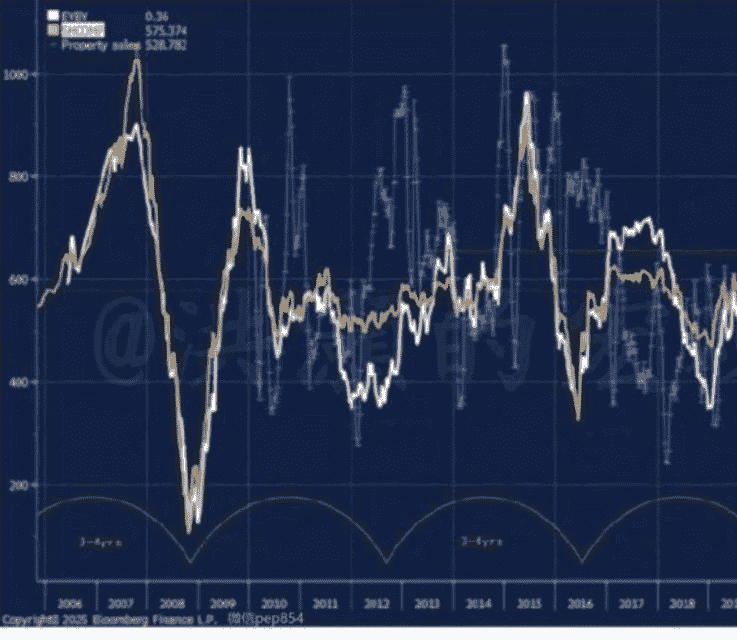

#### 图十七：中国香港的经济也同步进入了“飞龙在天”的阶段。

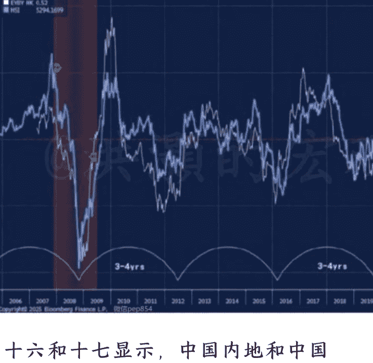

图十六和十七显示，中国内地和中国香港经济都进入了“飞龙在天”的阶段。诚然，以六经之首的《易经》为奠基的中国古典哲学总是认为“月盈则亏”，甚至“持而盈之，不如其已”。换言之，过度地追求圆满极致，倒不如适时停止。当事物发展到临界点的时候，主动收敛才能避免损耗。如果中国的经济周期已经运行到了高点，那么投资上是否应该“止盈”？

我的方法论一直强调，在做预测和交易的时候，不能以单一指标作为发射子弹的扳机。同时，经济周期的运行不是闹钟，并非到了某一个时间点，某种变化就一定会发生，而是这时这种变化催生的条件已经成熟。我一直强调，我的量化经济周期运行的时间维度大约是三到四年。然而，这个或长达一年的时间窗口对于交易员来说，也就很可能是踏空和套牢的区别。市场瞬息万变，从来不等候谁。

今年一个鲜为讨论的宏观变量，就是人民币实际汇率的变化。虽然今年美元逆市场共识地出现大幅贬值，但美国进口价格其实还是在下降的。人民币名义汇率今年表现出了相对的韧性，但是人民币实际汇率其实是大幅走弱的（图十八）。这很可能是中国出口贸易维持大规模的贸易盈余的原因之一。

#### 图十八：人民币实际汇率大幅走弱，贸易盈余继续走高。

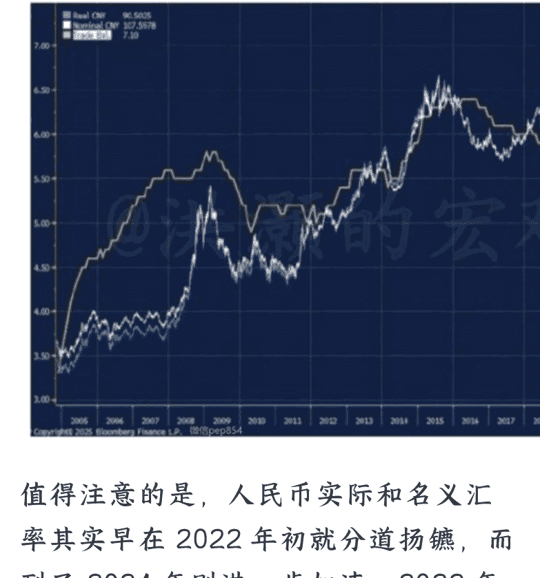

值得注意的是，人民币实际和名义汇率其实早在 2022 年初就分道扬镳，而到了 2024 年则进一步加速。2022 年是中国资产开启了一大波熊市的年份。中国的贸易盈余尽管经历了贸易战的风波，但还是在持续地积累。

这种名义和实际利率的分歧，可能一部分反映的是中外经济体的通胀之差。毕竟，中国经济里的通胀已经消失了有一段时间，但是海外的通胀却是居高不下。同时，公开数据显示，过去几年跨境资本出现外流的情况。这很可能是西方国家的合规立法原因以及投资者对于中国市场的误解而导致的。许多投资中国的基金都出现了比较大规模的赎回。如是，人民币实际汇率所承受的压力就可想而知了。

然而，如此极致的趋势也很可能将出现“否极泰来”的反转。当我们比较人民币名义和实际汇率的走势，我们可以看到，现在实际汇率的低估程度，类似于 2008 年 11 月时的水平（图十九，人民币实际汇率估值偏离其长期趋势线的程度类似于 2008 年末）。换言之，人民币实际汇率被严重低估了。图十九：人民币实际汇率被严重低估，预示着股市行情的延续。

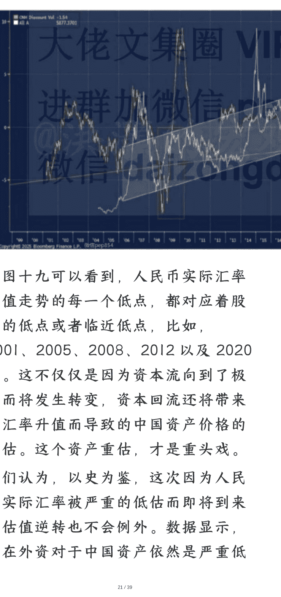

从图十九可以看到，人民币实际汇率估值走势的每一个低点，都对应着股市的低点或者临近低点，比如，2001、2005、2008、2012 以及 2020 年。这不仅仅是因为资本流向到了极致而将发生转变，资本回流还将带来了汇率升值而导致的中国资产价格的重估。这个资产重估，才是重头戏。

我们认为，以史为鉴，这次因为人民币实际汇率被严重的低估而即将到来的估值逆转也不会例外。数据显示，现在外资对于中国资产依然是严重低配的。一旦外资重新以客观的眼光重新审视中国资产的投资价值，那么新的一轮外资“逼空”行情是很可能发生的。

如前所述，如果美联储很快将不得不降息并且扩表来为美国经济注入新的流动性，那么这种外围市场的货币政策量化宽松，叠加人民币实际汇率的严重低估，也正好为中国央行打开了货币宽松的窗口。或许有人会指出，难道中国的流动性还不够充沛吗？广义货币供应已经达到了 400 万亿人民币左右，而居民家庭的存款也达到了 180 万亿，并依然在快速增长。

这是一种典型的、不以双边记账的角度来看待流动性的观点。须知，广义货币的供应其实是央行的负债，居民家庭的存款其实是商业银行的负债。贷款才是银行的资产。因此，在观察货币供应流动性的时候，我们还应观察这些新增的负债是否产生了新的、具有实际生产力的资产。

在对于流动性的负债属性做了资产属性的调整之后，可以看到，在经过资产属性调整的流动性现在还处于这个指标历史运行区间的低点。简言之，透过资产的属性来观察流动性条件可以看到，其实流动性并没有市场共识认为的那么充沛，虽然绝对水平达到了几百万亿人民币的规模。

这个情况说明了，负债的增长其实远快于资产的增长，或者说有生产力的资产的积累还没有完全恢复。如是，现阶段很多流动性很可能是用来维护经济的正常运行的。这些是常量，而非增量。然而，历史上这个调整后的流动性指标每一次触及历史区间的底部，我们都会看到中国市场不同程度地修复、回暖、上涨。以史为鉴，这一次也将不会例外（图二十）。

### 图二十：经过资产属性调整的流动性处于历史区间的底部。

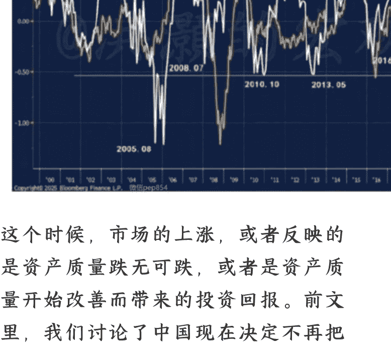

这个时候，市场的上涨，或者反映的是资产质量跌无可跌，或者是资产质量开始改善而带来的投资回报。前文里，我们讨论了中国现在决定不再把资金投入房地产，而是改投新兴行业的策略。这时，中国资产质量应该改善，投资回报率上升，并应该反映在中国资本市场的价格上涨里。

在这种投资导向初现成果之际，也就是说，负债的质量在改善、投资回报率在提高的时刻，中国应该进一步扩表来巩固壮大这个决策性拐点的成果。

果然，在经过我的量化周期性调整后的央行资产负债表的走势，与市场共识的认知完全不同。经过我的量化周期性调整之后，我们可以观察到，央行的资产负债表的变化在 2018 年第一次贸易战期间到 2022 年，一直都是在“潜龙勿用”的状态。这个时候，央行资产负债表休养生息，而当这个整固状态到了后期，也就是 2021、2022 年，对应的是中国资本市场开始步入决定性拐点，而我的那篇市场公认的经典报告《买！买！买！》发表的时间点也是在 2022 年十月底（图二十）。值得注意的是，尽管央行的资产负债表从 2022 年开始进入重新扩张的路径，但是从图二十一可见，央行的这次扩表也是蜿蜒曲折。反映在市场的走势上，即是中国市场在过去几年出现的间歇式的大幅波动。回首来路，一切都那么清晰。

## 图二十一：中国央行的资产负债继发力。

当我们把经过周期性调整的央行流动性和全 A 指数做比较之后，我们可以看到，每一个流动性周期的低点对应的都是全 A 指数的历史性低点，无一例外 (图二十二)。如今，我的周期性模型再次指向全 A 指数的一个历史性低点。请注意:这个是一个更长的周期波幅的低点，对于投资者的资产配置有更重要的意义。

图二十二：周期调整后的央行流动性低点对应全 A 指数的低点。

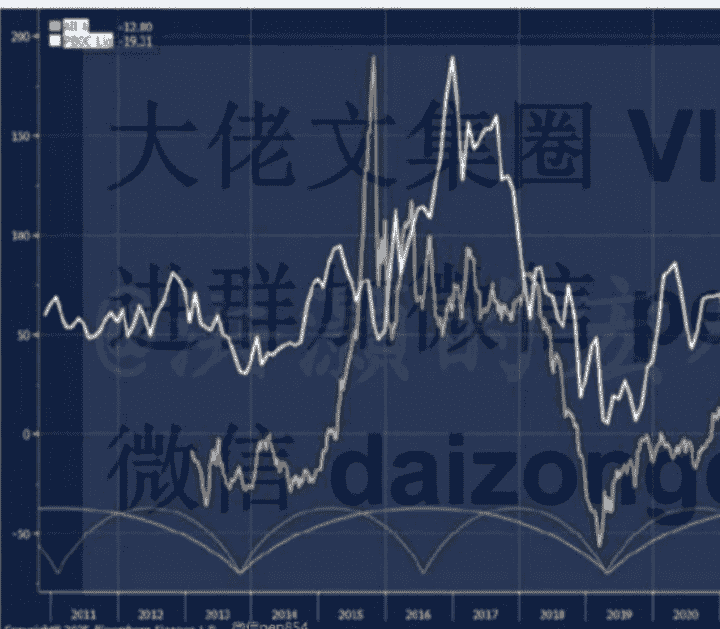

七月雅江工程把“反内卷”政策具象化以来，我们看到中国的长端收益率曲线开始陡峭化（图二十三）。以前，很多人认为中国的收益率曲线没有太多的参考价值，因为中国的债券市场参与者大都是中国的大型商业银行，而它们的投资风格往往都是持有到期的。与前文所述的美国债券市场融资的方式不同，中国的融资方式还是以银行贷款直接融资为主，中国的债券市场远未成熟，因此有巨大的发展空间。然而，即便如此，我们还是可以用数据证明中国债券市场的前瞻性。

图二十三：中国国债长端收益率曲线陡峭化，与上证齐头并进。

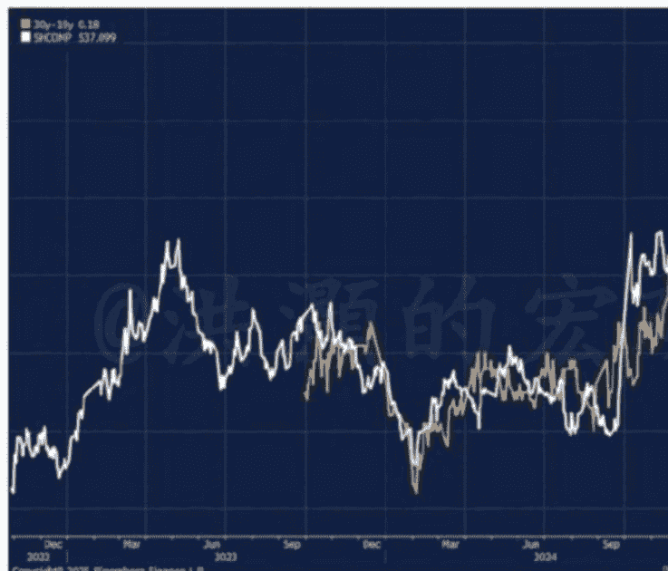

肉眼可见，中国国债长端收益率曲线开始陡峭化，这个走势预示着经济中信心的回归和通胀预期的回暖。这些迹象，在最近几个月大宗商品的价格回暖也可以印证。可以预计，大宗商品的价格将在未来数月将继续回暖，并结合“反内卷”工作的展开，将令上游的价格继续回暖，并将逐步影响到下游的通胀价格和预期。如是，一个在过去几年牢牢地架在中国资本市场脖子上的枷锁——通缩预期——将被打破，推动中国市场进一步上升。

或许还有人会问，如果美股出现大级别的回调，那么中国市场会不受影响吗？这是一个简单的相关性。的确，美国市场的表现对于全球市场来说举足轻重。如果我们看一下，中国市场每一个五年规划的第一年的表现，我们可以看到，有 4/7 的概率中国市场的表现是正收益的（图二十四）。尤其是 1996 年和 2006 年。

如果我们进一步把 2016 年这个泡沫破灭后的特殊的年份去掉，那么正收益的情景就上升到了 4/6。即便是 2016 年这个后泡沫第一年的特殊年份，我们看到 2016 年中，上证触及了后泡沫的最低点然后开始了那波轰轰烈烈的“大白马”行情，直到 2018 年的贸易战。

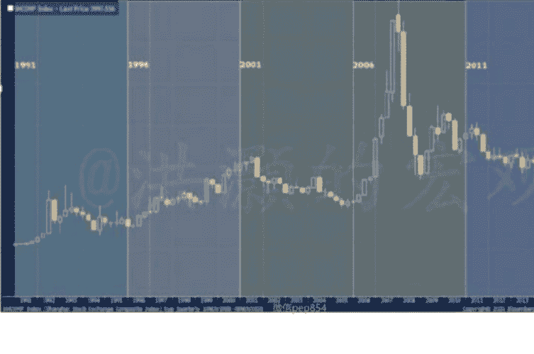

图二十四：中国市场在每个五年规划的第一年大概率上升。

总结一下：在这个章节里，我们讨论了中国经济和市场展望。虽然中国经济周期已经有如“飞龙在天”，但是中国央行的资产负债表进入了扩张周期。这个阶段往往有利于中国资产价格的上涨。过去几年里，人民币的实际汇率被严重低估，并与中国日益高筑的贸易盈余相背离。这种极端的背离，除了中外不同的通胀水平之外，跨境资本流动出现的外流现象也在很大的程度上可以解释人民币实际汇率被低估的原因。

如果国际资本因为合规立法的原因或对于中国资本市场误解的原因而继续严重低配中国市场，那么出于这种原因的低配不是因为非基本面原因就是因为非正确原因。如是，在中国资本市场频频出现转机，中国经济发展和科技进步开始显示成果的今天，外资将不得不增配中国资产，简称“逼空”。由此而带来的资本回流中国市场，将推升中国资产价格，并带引人民币汇率升值。而汇率升值将带来的，很可能是人民币资产价格的全面重估。

七月的雅江工程是“反内卷”政策的具象化。这个伟大工程的横空出世，唤醒了沉睡已久的动物精神。可以看到，上游大宗商品价格已经开始回暖，并带动上游通缩预期的修复，同时很快将传导到下游。中国长端国债收益率曲线开始陡峭化，反映市场对于经济前景的信心。以史为鉴，中国股市也将随着长端收益率曲线的陡峭化、预期的修复化而上升。这些，是中国市场现在最大的基本面。

至于市场估值，虽然经历了一番修复，我们可以看到中国市场的估值相对于当前的流动性条件，其实还是处于历史的底部区间。上一次估值运行到如此低的位置的时候，还是 2014 年时主升浪即将展开的时期（图二十五）。

图二十五：中国市场估值相对于流动性条件依然在底部区间。

## 结论

当我们将目光投向 2026 丙午年景，美国财政和货币积年之弊正汇聚成新的风暴。美国财政赤字所引发的朝堂博弈，美联储缩表已濒临极限，势必将会引发市场剧烈震荡;美国政府每年超万亿美元的偿息支出已经吞噬了许多美国政府的财政空间，其它除了医保和国防的预算恐成无米之炊;美国政府赤字与特朗普关税并举，以及美国资本市场过去三年的高歌猛进，为美联储的货币政策选择设下“三难”,美联储也因此而陷入了跋前疐后的困境。最近美国回购市场利率的飙升和美国市场经历的今年四月以来最大的单天暴跌，犹如晨钟暮鼓，为投资者警示了市场无常之危。

我的量化模型显示，美联储资产负债表近年来的变化，其实与美股的走势不再密切相关，甚至分道扬镳。美联储近年来缩表而产生的紧缩效应，更体现在那些衡量美国经济基本面的指标，比如就业、消费和信心。换言之，美国的实体经济在这个经济周期里反而先于金融市场感知到了美联储缩表的压力，实体领先金融。这些相关性和先后顺序，是与以前的历史经验相悖的。

这种情景组合，大概是因为美国的金融资产现在掌握在美国社会里不到前 10% 的人群手里。对于这个人群，实体经济的冷热其实并不能影响他们的生活和消费习惯，他们的收入更多的是来自资本利得。同时，他们手上控制的金融资产也为市场上涨提供了源源不断的流动性。然而对于底层的大多数美国民众来说，他们对于实体经济走弱的感知更多的来自于每天柴米油盐的价格波动。因此，美国消费者信心下降到了历史性低位的水平。如此低迷的消费者信心，历史上往往预示着美国经济在未来数月将开始明显放缓。

的确，美股这些年的上涨有每股盈利增长的支持，但每股盈利的涨幅更多的是来自于公司回购减低了公司股本数目，同时流动性的充沛也让美股的估值倍数得以扩张。美国的货币基金的余额已经接近八万亿美元的水平，为历史最高。市场观察家喜闻乐见地把这些货币基金余额称为闲置而准备入市的资金。当下，美国科技板块的许多估值指标已经追平甚至超过了 2000 年互联网泡沫的水平。在这样的背景下，美联储继续降息，并重新开始扩表，也就是即将重启量化宽松。

特朗普执拗地认为美国经济的结构性问题是美国日益扩大的贸易赤字所造成的，并以此为由悍然地发动了第二次贸易战，企图对美国所有的贸易伙伴征税，而不仅仅只针对中国。最终，这种极端的甩锅主义精神让美股在今年四月的“解放日”经历了有历史数据以来最大之一的单天暴跌，单天隐含波动率的飙升也是历史最快。特朗普也不得不面对冷酷的事实，对于他类似于无稽之谈的贸易关税政策实施"TACO”。特朗普始料不及的是，在经历了 2018 年的第一次贸易战之后，中国就开始努力地开发美国以外的贸易伙伴。到如今，美国已经不再是中国最大的贸易伙伴。欧盟、东盟、拉美、一带一路国家的贸易体量，已经开始超过了美国。同时，中国还花了好几年时间统筹整合了原来分散的稀土开采和处理行业，让中国在这次贸易谈判中牢牢地把握住谈判的主动权。这一切，都让特朗普政府低估了中国的谈判筹码。

在 2021 年房地产市场见顶前后，中国开始把资本积累投向许多新兴的、高科技行业。一直到今年，我们看到了这么多累计的非房地产投资所带来的初步成果。AI、芯片、机器人、创新药、新能源等行业争奇斗艳、百花齐放。这些行业里的很多上市公司这两年的股价都在不经意中翻了好几倍。而新的十五五规划也为这些新兴行业指明了方向。

许多市场评论员，尤其是西方评论员，依然把眼光投向那其实长期下行趋势早已洞若观火的房地产市场。殊不知，中国经济里的“二元经济”结构已经形成，而房地产早已不是中国经济里占比的最大的一个部门。或许有人会指出，中国市场今年领先全球的涨幅没有基本面的支持，只是水牛一只。的确，房地产相关的数据还在不断下行，并左右着实体经济里的价格预期。而中国市场的走势，却早已与通缩的预期背离。

如果中国继续像以前那样把资本积累投入房地产，而不是做出一个艰难而正确的决定，把资本投入现在初现成果的这些新兴行业，那么讲了多年的经济结构转型就更不可能成功。许多衡量经济基本面的指标，都是旧经济指标，无法反映中国经济里当下这些新兴行业的成就。简言之，如果中国股市的上涨更多反映的是中国经济转型的希望，而不是旧指标反映的房地产的拖累，那么两者的背离就不足为奇了。反而，两者越背离，中国经济的转型反而就显得越成功。

中国的反内卷运动也进行的如火如荼。从七月的雅江工程，到自上而下的整治不合理的价格竞争，都让上游的价格压力有所放缓。许多大宗商品的价格纷纷跳升。甚至，反内卷之后一些上游的行业出现了量价齐升的情况，显示了其实有序的价格竞争对于公司的盈利反而更加友好。

中国的出口贸易盈余和美国的长期通胀预期一直以来都是正相关的。这个相关性不足为奇，毕竟中国出口的商品是美国家庭消费的重要组成部分。即便是今年来一些东南亚国家如越南等开始生产一些低附加值的商品，如衣物、轻工业制品等，但是中国在这些低附加值产业里的出口量，其实并没有下降。不仅仅如此，中国在高附加值的制造业里独占鳌头，获得了全球制造业里的绝对优势。中国的高端制造业，如汽车等，已经开始抢滩发达国家的市场。

如果贸易战持续，中国反内卷运动继续获得成功，那么出口成本可能就很难降下来了。另外，一个鲜为讨论的宏观变量，是人民币实际汇率已经被严重低估，大有翻身上涨之势。如是，美国的通胀预期很可能居高难下——除非美国经济出现意外的失速甚至衰退。

近月，美联储的回购工具已经接近归零，并引起了回购利率的大幅上升和美国市场的波动。美国私人公司十月的裁员人数是二十多年来最多的一个十月。由于美国实体经济放缓的压力，美联储将不得不很快地继续降息，并重新扩表。

如果美联储选择大规模购买短端而平抑回购市场的流动性，那么美联储的资产负债表久期将不会延长，甚至缩短。即便市场最初很可能把任何扩表的行为解读为利好，最终也将要认识到其实美联储资产负债表久期的变化才是决定资产价格的重要变量。如果美联储选择大规模买入长端，那么在美股估值已经极高的基础上将要进一步造成资产全面泡沫化。这个情景有违美联储维护金融市场稳定的政策目标。如果美联储选择在整条收益率曲线上均匀买入美债而扩表，那么美联储资产负债表的久期其实并不会出现太大的变化。虽然对于市场是边际利好。

简言之，美联储的货币政策开始从属于美国的财政政策。美国政府的财政缺口决定了，美国明年很可能需要增发约两万亿美元甚至更多的债券来平衡收支，让美国国债的总额上升到 40 万亿美元以上。这是一个匪夷所思的数字，但也将利好大宗商品和贵金属，甚至原油。在美国经济周期和全球流动性条件在未来数月即将开始冲顶回落的时刻，美股的运行也逐渐靠近其 35 年大周期的顶峰。当流动性条件发生改变的时候，即便是美联储最后不得不出手相救，美国市场在其历史性估值高位上也将出现大幅的震动。古训有云，“不明于计数而欲举大事，犹无舟楫而欲经于水险也”。

中国的经济周期开始渐入佳境。而中国 A 股和港股都是今年全球跑得最好的主要市场。前述讨论的全球流动性条件拐点将至，但也如中美之间的贸易分歧一般，中国的流动性条件依然将继续改善，与全球发达国家的流动性条件变化的方向不一致。

自 2022 年筑底以来，中国央行便开始扩表的路径。从那时起到现在，中国央行的资产负债表扩大的方向是非常明确，虽然近年来波动较大并已经反映在市场的价格波动里。

或许有人认为，中国经济里的流动性已经过于充足，这体现在中国家庭的储蓄依然在飞速地增长，并开始接近 200 万亿元人民币的体量。然而，这样的观点忘记了，储蓄其实是商业银行的负债，而负债只有在投入到有新增生产力的项目里，才产生价值。当我们用资本来调整中国今年来的负债，我们会看到有效资产的增速远远低于负债的增速。或者说，中国近年来的负债质量乏善可陈。然而，这个有效负债指标现在已经运行到了周期的谷底。换言之，负债的质量如果再进一步降低的话，那么对于经济将产生明显拖累。因此，把资本积累投入新兴行业而不再投房地产，是一个果敢伟大的转型决定。

央行资产负债表规模变化的底部，历史上往往对应着市场运行的重要底部。与此同时，在反内卷政策的具象化之后，中国长端国债的收益率曲线开始陡峭化，而中国股市也开始齐头并进。这些市场价格运行轨迹的变化显示了市场的长期预期在发生改变，不再是以前那个桎梏于房地产相关的通缩预期的弱势和在大国博弈中以守为攻的旧模式。新的希望之光开始照进市场价格的隐含预期。这些情况表明，反内卷运动开始初见成效。这，才是当下中国经济和市场最大的基本面。

如果美国市场调整，全球市场也难免波动。毕竟，那是一只八百磅重的大猩猩。但过去七个五年规划中的第一年，中国股市大概率是上涨的。如果剔除 2016 年这个后泡沫的特殊年份，那么中国市场六次规划中有四次是涨的。虽然不是胜券在握，但是也应该胸有成竹的。尽管今年市场大幅上涨，中国市场的估值还是处于历史的底部区域。

这逝去的十二个月，实为全球经济悄然换轨的见证。市场周期将如期运行，美国经济周期已是强弩之末，流动性条件在未来数月即将冲顶回落，预示着未来数月内的市场波动已经暗流涌动。四月“解放日”特朗普关税引发的全球市场巨震犹如暮鼓晨钟，而黄金白银的耀世光芒，则预警了市场对主权信用和美联储政策失误的忧虑。

当我们站在丙午年的门槛上，全球市场早已暗流涌动，东西方早已分道扬镳。所幸的是，我的量化模型显示中国市场依然独树一帜，其表现很可能将再度超出市场共识的预期。然而，美股估值的泡沫化，在未来数月里将令其高处不胜寒。“持而盈之，不如其已”。在今日这片全球经济的险滩之中，此言愈发显得振聋发聩。

## 最后，安利小懒的付费群：

### 懒人专属群 (介绍)

🛠️ 懒人专属群持续更新中，已持续运营 6 年，整理超 3000 份各类精选付费文章&年费社群干货，全部开放下载。

本资料为付费群内部分享，仅供真实有需要的朋友查阅🤫

### 懒人专属群更新记录：

https://lazy2025.top/blog/record2

**懒人专属群更新记录 (需梯子，备用)：**

https://lazybook.fun/blog/record2