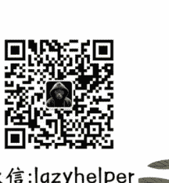

# 162 | 巴菲特《感恩信》新开一桌

251117

整理：公众号懒人搜索，懒人专属群独享

懒人微信：lazyhelper

微信：lazyhelper

欢迎打开《蔡钰·商业参考 4》，我是蔡钰。

美国时间 11 月 10 日，股神巴菲特在他的投资公司伯克希尔·哈撒韦的网站上，发布了一封《感恩节致辞》。这封信讲人生故事和抒情居多，本来我不打算跟你聊了。但这两天发现不少解读，把它当作巴菲特对公众市场的告别。

这是一个误读。让我觉得有必要澄清一下，跟你说说我的理解，顺带分享一个从中获得的人生方法论启发。

## 新开一桌：年度感恩信

这是一封告别信吗？从写信的背景和大致内容来看，很像。毕竟巴菲特已经 95 岁了，今年 5 月已经正式宣布过年底要退休交棒。

但从内容的潜台词来看，恰恰相反。巴菲特这封信，透露的是他对工作的迷恋、对人生导师身份的享受。

要知道，巴菲特早在 2021 年就已经选定了伯克希尔的继任 CEO，并让这位名叫格雷格·阿贝尔的接班人坐上了股东会的主席台。芒格离世后，在 2025 年 5 月份的股东会上，巴菲特也已经正式宣布，自己年底要卸任伯克希尔的 CEO 职位，交棒给格雷格·阿贝尔。

当时，不少参与者已经在庆幸，自己赶上了巴菲特的“退场大秀”。一个休退好几次，上一个这么玩的还是马云马老师。马老师真的飘然远去了吗？如你所知，他如今又回到阿里了。

巴菲特这封感恩信，也流露了不忍离去的意思。

他在这封感恩信的开头说，我今后将不再撰写伯克希尔的年度报告，也不会在年度股东大会上长篇大论。用英国人的话说，我将“安静下来”了。格雷格·阿贝尔将在年底接任 CEO 职位。他是一位出色的管理者、不知疲倦的工作者与诚实的沟通者。祝愿他任期长久。

但他话锋一转，继续写道：“我将继续通过每年的感恩节致辞与各位、以及我的孩子们，谈谈伯克希尔。”

你看，啥意思？说好了年底要交棒给阿贝尔，总不能再去争夺主会场。但巴菲特另找了个窗口，要继续输出。2025 年的感恩信不但不是告别，反而是新开了一桌，从原来的写年度股东信，改成了写年度感恩信。

更关键的是，今年这封信的主题虽然确实是感恩，但信的抬头却是，“致我的股东朋友们”。

哎呀，这哪里是要退的意思啊，这明明是“扶我起来，我还能聊”。他交出了 CEO 头衔，但立刻建立了一个新的个人输出渠道。

他说要每年在感恩信里谈伯克希尔。你能想象张一鸣退休后每年写封公开信评价字节，黄峥退休后每年写封公开信评价拼多多，会给现任 CEO 多大的压力吗？

但这显示出的话语权和影响力需求，才更像巴菲特。

## 五个内容

我们再来看看这封信的内容。它大致分成五部分，分别是感恩世界、家族财富规划、伯克希尔的新 CEO、伯克希尔的未来和巴菲特的人生感悟。

### 第一部分，感恩。

巴菲特讲了很多故事来感恩长寿、感恩挚友、感恩奥马哈、感恩医生和自己这辈子的运气。

### 第二部分，家族财富规划。

巴菲特说，自己在加速向孩子们的基金会转移财富，以便让慈善财富能在最好的时间窗口被分配出去。

但请你注意，这个地方他所认为的最好时间窗口，不是说“自己在世”，而是自己的三个孩子目前还“具备足够的成熟度、头脑、精力与本能去分配一笔巨额财富”。

他在信里甚至提到说，如果三个孩子遇到不测或丧失能力，他们各有三位候补受托人，可以接替工作。

什么意思？我的感受是，他知道“时光老人总是会赢”，但他对自己三个孩子衰老力竭的担心，远远小于对自己离世的担心。当然，他不是认为自己会比孩子们活得更长，而是在他看来，更大风险是：如果他继续长寿，他的孩子们就会错过经营慈善事业的活力周期。

你看，老爷子对自己的长寿信心仍然不小。这也呼应了前面他承诺的，以后要每年通过感恩节致辞与公众沟通。

### 第三部分，伯克希尔的新 CEO。

第三部分就更有趣了。巴菲特谈论伯克希尔的新 CEO。

这部分内容的开头，巴菲特一如既往地赞美了格雷格·阿贝尔，就像过去四五年他在公开场合做的那样。而这之后，他提到了两层告诫。

首先，阿贝尔有责任保持长期身体健康，伯克希尔董事会也需要警惕 CEO 的健康风险，不能眼睁睁看着伯克希尔和子公司的 CEO 们在任上得了痴呆、阿尔茨海默症或其他慢性病而不作为，这会是巨大的错误。

其次，要提防 CEO 对薪酬的贪婪，裹挟着董事会滚动涨薪。这可能是对最近马斯克的万亿美元薪酬有感而发，但更多是在敲打自己交棒之后的伯克希尔。

巴菲特还说，我的愿望是他（阿贝尔）未来几十年都能保持健康。若运气尚可，伯克希尔在下一个世纪里大体只需要五六位 CEO。我们尤其应当避开那些以 65 岁退休、炫富，或打造家族王朝为目标的人选。

这个期望翻译一下，我的理解是，巴菲特认为“老人的经验和阅历”是价值投资的关键要素；同时只有长期“不下桌”，才能积攒这种经验和阅历。确实，他本人就是这个要素的最大受益者。

### 第四部分，伯克希尔的未来。

巴菲特给出了两个预判：一个是，在未来一二十年里，将会有很多公司的表现优于伯克希尔·哈撒韦，这是伯克希尔的规模带来的代价；另一个是，伯克希尔的股价偶尔会下跌 50% 左右，但美国会复苏，伯克希尔的股票也会复苏。

什么情况下伯克希尔股价会下跌 50%？

巴菲特在信中还说了另一句话：“伯克希尔将始终以一种方式进行管理，使它的存在成为美国的一项资产。”再结合那句“美国会复苏”，我们可以认为，巴菲特对未来美国资本市场的最大回撤预期，是 50%。

### 第五部分，人生感悟。

在这部分，巴菲特主动当起了人生导师，鼓励股东们谦逊、好学、善良、宽容。

这其中，他给出的第一个建议就是，不要为过往的错误苛责自己，要至少从中学到一点，然后继续前行。改进永远不嫌晚。

你看，他这封信算是身体力行地验证了这一点：95 岁的退休仍然不是结束，完全可以用感恩信新开一桌。

## 人生方法论

以上，是我对巴菲特这封 2025 年《感恩节致辞》的理解和感受。这让我对这位 95 岁老爷子的心力有了新的敬畏。

另外，在读到这封信的前后脚，我正好还听了一个播客，是价值投资家段永平跟雪球投资社区的创始人方三文的访谈。段永平在对话中提到的一个观点非常有意思。

段永平说，他问过巴菲特，你认为自己未来还能不能跑赢标普 500 指数？

巴菲特回答说，非常难，可能有机会跑赢一点点。

段永平说，巴菲特很喜欢做投资这件事本身。否则，伯克希尔完全可以买入标普 500 指数基金，而后放手不管了。对巴菲特和伯克希尔来说，他们的投资机会成本就是标普 500，而这也给了他们一个行为原则：只有他们在判断一笔投资可以跑赢标普 500 的时候，才会出手。

你看这个行为原则，跟职场中说的“高于行业平均水平”，内核是一样的。

段永平还说，自己有个朋友，做财富传承就是这个思路。这个朋友的孩子不懂投资，于是他就把财富分成两半，一半买了标普 500 指数基金，另一半买了伯克希尔股票，让孩子不必操心投资，用标普 500 的稳定分红来过好小日子。

这个思路，就是我说的“人生方法论”启发。我觉得它给出了一种在“无限人生游戏”里定目标的方法。

这两年以来，在慢增长但高竞争社会里，一种挺主流的内耗状态叫“卷又卷不动，躺又躺不平”，人们一方面意识到应该放慢生活节奏享受生活，另一方面又担心因此被时代巨轮甩下。这是个体在技术突破和文化惯性的压力之下，产生的普遍性焦虑。

怎么解决这种心理困境？巴菲特把机会成本定在标普 500，是个值得借鉴的思路。

我的想法是，把人生看作无限游戏的话，目标是玩得久而不是冲得高，所以，不妨把目标定在“稳在社会中位线之上”。上去了就可以躺一躺，下来了就卷一卷，这样的人生既不会卷得太紧绷，也不会躺得太荒废。

巴菲特知道自己再无力主导伯克希尔股东会，但认为自己还能驾驭感恩节的输出，不也是这个思路吗？

你怎么想？不管你现在是 25 岁还是 55 岁，你觉得有没有必要问问自己：在事业前景和生活水准上，你的“标普 500”是什么？可以设立一套怎样的机制，来增加跑赢它的概率？

期待你的思考。

拜了个拜。

延伸学习巴菲特感恩信原文链接：
https://www.berkshirehathaway.com/news/nov1025.pdf

最后，安利小懒的付费群：
懒人专属群（介绍）

💬 懒人专属群持续更新中，已持续运营 6 年，整理超 3000 份各类精选付费文章 & 年费社群干货，全部开放下载。

本资料为付费群内部分享，仅供真实有需要的朋友查阅🤫

# 懒人专属群更新记录：
https://lazy2025.top/blog/record2

## 懒人专属群更新记录 (需梯子，备用):
https://lazybook.fun/blog/record2