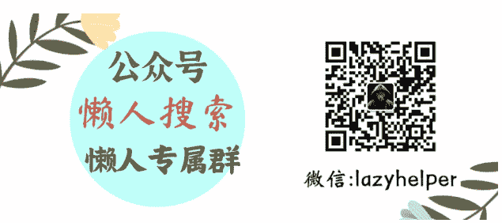

# 独派分子沈伯洋，为什么被通缉？

251117 猫哥
整理：公众号懒人搜索，懒人专属群独享

懒人微信:lazyhelper



近期，重庆市公安局宣布对沈伯洋立案，罪名是“分裂国家罪”。其实，早在 2024 年 10 月 14 日，沈伯洋已被列入台独顽固分子清单。

清单规定，沈伯洋被禁止入境大陆及港澳地区、限制关联企业与大陆合作。

沈伯洋是谁？在台独分子中，他有何独特之处？

1982 年，沈伯洋出生于台北，父亲是富商，常年从大陆进口货物，再转售到南美的厄瓜多尔。不错的家境，让沈从小就读于私立的“复兴系”学校。

“复兴系”学校，指的是台北复兴幼儿园、复兴小学、复兴中学，是台北著名的“贵族学校”系统。沈的成绩不错，长大后，顺利考入台大法律系，师从李茂生。

李茂生家里是蓝营，当过国民党员，赴日留学后，受到日本教授的影响，意识形态转向绿营（他经常批评民进党，但不妨碍他是绿营的人）。

回到岛内后，在台大法律系任教长达 30 多年，培养了无数的弟子，号称“桃李满天下”。

台大在岛内地位很高，法律系又是台大的王牌院系，从这出去的，往往能成为社会精英，加上台大从政的人很多（阿扁就是其中之一），使得李茂生的能量，非常大。

赴美国留学后，在李茂生的牵线下，沈伯洋加入了“北美台湾研究学会”，这是一个独派组织，实际上是民进党的外围机构，常年游说美国政客支持台湾。其创始人，为绿营大佬林佳龙。

2017 年，沈伯洋从美国回到岛内，彼时，菜菜子正在强势推动一件事——没收国民党的党产。

国民党拥有大约 156 亿人民币的党产，这笔钱是国民党的生命线。菜菜子为了重创国民党，于 2016 年 8 月组建了“不当党产委员会”。

委员会的职能，就是没收国民党的党产，委员会主席名叫顾立雄。

巧了，顾立雄和李茂生关系不错，在导师的推荐下，2018 年 10 月，沈伯洋进入“不当党产委员会”，担任委员。

最终，国民党的党产被全数没收。沈伯洋因出力多，得到了菜菜子的奖励，2023 年，沈伯洋列入“立法委员选举的不分区立委名单”。

一年后，沈伯洋顺利当选立法委员。

得到奖励的沈伯洋，开始变本加厉，日常说话，可谓三句不离大陆渗透，在他眼里，大陆歌曲是渗透，大陆电视剧是渗透，连大陆 APP 都是渗透。

他还发布了一个“ZG 渗透指数”，在指数中，台湾地区常年排在世界前十，属于“遭到严重渗透”。

当然，仅限于此的话，沈伯洋也就是个激进点的绿营政客罢了，不算稀奇。他真正的转折点，在“俄乌战争”。

2022 年，“俄乌战争”爆发，俄军没有在短时间内，拿下乌克兰，让绿营和西方大喜过望。

他们认为，乌克兰能扛住俄军，一方面是乌克兰拿到了足够多的西方援助，另一方面，是乌克兰社会的氛围，足够仇视俄罗斯，许多极右翼在战争爆发后积极参军。

武器足够 + 意识形态，让乌克兰成了一只刺猬，如果把乌克兰的经验复制，岂不是能给大陆找麻烦？

沈伯洋看到了“市场机遇”。

2021 年，沈伯洋曾与人合伙创办“黑熊学院”，起初，“黑熊学院”主业是研究“ZG 渗透”，人数仅有 5 个，“业务”的开展不怎么顺利。

“俄乌战争”爆发后，沈伯洋抓住机会，将“黑熊学院”的课程改为两个部分，一部分是继续洗脑，另一部分，是半军事培训。

其宗旨是，打造一个“全民皆兵”的岛，就是对众多台湾人进行洗脑，再培训他们，和我们拼命。

“黑熊学院”的“业务”，很快被两大金主看好。

第一个金主，是“美国在台协会”，具体金额不详，算是天使轮投资；真正重磅的，是第二个金主，台湾联电前董事长曹兴诚。

台湾的众多半导体制造企业中，台积电常年名列第一，毫无争议，第二名，就是联电。

曹兴诚曾是陈水扁的顾问，但世纪初的曹兴诚，却没有那么“绿”，2007 年，他还提出了要推进“两岸和平共处法”和“统一公投”。

一边担任陈水扁顾问，一边又要和大陆统一，怎么回事？

因为那时的联电，在台湾拼不过台积电，曹兴诚希望进军大陆市场，但遭到陈水扁反对，认为芯片制造企业，不应该到大陆设厂。

2008 年，陈水扁和曹兴诚闹翻，曹兴诚转而支持马英九。

马英九上台后，批准“到大陆设厂”，条件是，先进制程不能带到大陆，落后制程可以，联电随即在大陆设立分公司“和舰科技”。

2014 年，又和厦门方面合资，成立了“联芯科技”。

只不过，由于种种原因，联电在大陆的投资，并没有多少回报，反而亏损连连。仅 2018 年，联芯就亏损超过 20 亿人民币。

2019 年开始，曹兴诚对大陆的态度明显变了。

一年前的 2018 年，他还大谈“两岸和平统一”。

到 2019 年，已经不承认"92 共识”了。

态度转变的原因，不止是赚不到钱，还有美国的压力。

2018 年 3 月，中美贸易战爆发，半导体，成为了美国制裁中国的一张牌。11 月，美国对福建晋华进行制裁，禁止向晋华供应设备、技术。美国司法部，还对福建晋华、联电的多名高管进行了刑事起诉。

美国方面声称，联电盗取了美光的技术，再交给福建晋华。

曹兴诚怕了，对大陆的态度发生了 180 度大转变，出现了“皈依者的狂热”。

“俄乌战争”爆发后，曹兴诚很看好“黑熊学院”，先后宣布了两笔投资，合计 36 亿台币。

有了大金主加持，沈伯洋底气十足地叫嚣“3 年训练 300 万“台独”勇士”。这玩意，某种程度上，比台军更麻烦。

因为台军的战斗意志，未必有多强。而“黑熊学院”的半军事化培训，是自费的。愿意来参加的人，多半是比较死硬的分子。

等我们登岛，没准要面临他们的游击战。

不严厉打击沈伯洋，台湾会有更多的“黑熊学院”，试图将台湾“乌克兰化”的家伙，不出重拳不行。

在大陆制裁下，沈伯洋父亲沈土城的兆亿公司，没法在大陆做生意了。

13 日，岛内媒体报道，沈伯洋近期得到了新加坡一项活动的邀请，但“不敢去”。

因为新加坡和我们有引渡条约，新加坡总理黄循财对于海峡问题的立场，也令沈伯洋感到担忧。而像新加坡这样，和我们有引渡条约的国家，可不少。

沈伯洋敢离开台岛，说不定哪天就被逮了。

很多人说，通缉没用，他们不离开岛内，你的通缉令哪来的效果？这么理解就片面了。

因为不可能一直不去岛外活动，只要他们有外出的需求，那就好办了，一纸通缉令下去，能极大地震慑他们的嚣张气焰。

而让“沈伯洋们”的害怕，正是通缉的意图，他们害怕，一时半会不敢轻举妄动，我们的时间就增加了，可以准备得更充分一些。

更重要的是，岛内不是没有统派，也不是没有墙头草。

但在过去的氛围下，根本没人敢出头，有我们的力挺，他们才更敢于活动。

最后，安利小懒的付费群：

懒人专属群（介绍）


微信:lazyhelper

# 🎋 懒人专属群持续更新中

已持续运营 6 年，整理超 3000 份各类精选付费文章 & 年费社群干货，全部开放下载。

本资料为付费群内部分享，仅供真实有需要的朋友查阅🙇

## 懒人专属群更新记录

```
https://lazy2025.top/blog/record2
```

## 懒人专属群更新记录 (需梯子，备用)

```
https://lazybook.fun/blog/record2
```