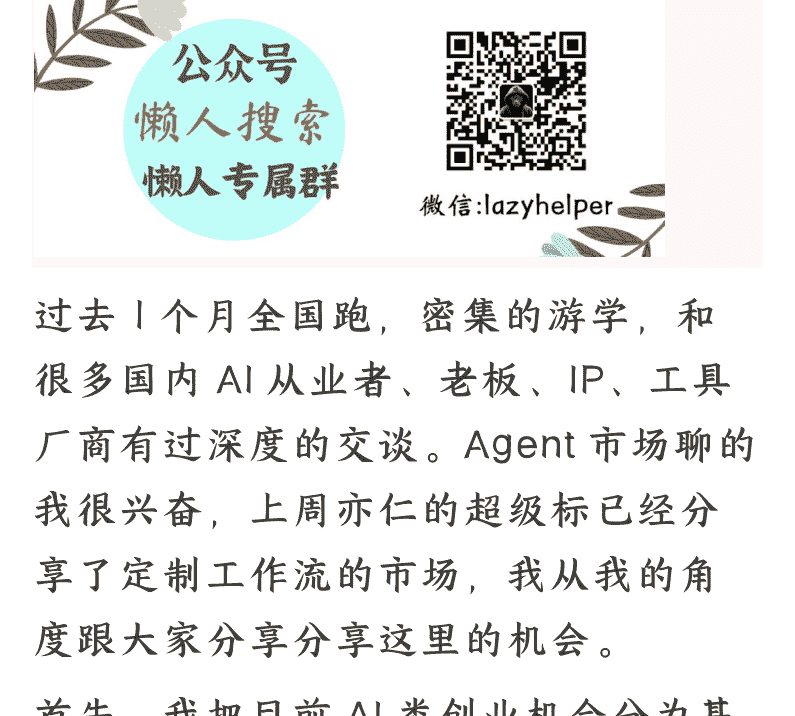

# 下一个金矿，国内 To B 的 Agent 智能体市场

## 251117 生财精华

整理：公众号懒人搜索，懒人专属群独享

懒人微信:lazyhelper



过去 1 个月全国跑，密集的游学，和很多国内 AI 从业者、老板、IP、工具厂商有过深度的交谈。Agent 市场聊的我很兴奋，上周亦仁的超级 IP 已经分享了定制工作流的市场，我从我的角度跟大家分享分享这里的机会。

首先，我把目前 AI 类创业机会分为基层，大模型层、应用层、业务层。这里讨论的是业务层的 AI 创业机会。

我们做业务类的 AI 创业，在 To C 领域，能够在海外赚到钱；而在国内做 To C 想赚钱是比较难的。而 To B 领域，则是在国内可以赚到钱。需求端，To B 更可感，To B 愿意付钱，而且已经有大量企业老板在尝试这件事情了，2025 年是个关键年。

这个市场也会衍生出很多职业，包括但不限于：RPA 工程师、提示词工程师、知识库工程师、工作流工程师、Agent 工程师、AI 系统架构师......基本上，围绕 To B 的 AI 解决方案，会成为企业以及超级个体采购的服务（产品，培训，陪跑，定制）。

## 需求端：哪些企业在买单？

围绕着降本增效，我看到的企业类型主要有几类：

- **电商类企业** 电商类企业的特点是流程特别长，SKU 特别多，条目复杂。这类企业需要工作流类产品为其赋能，搭建后台系统。
- **线下业务类企业** 比如线下有几百家、几千家店，需要进行管理，无论是库存还是前端的私域、品牌等。如果有一套工作流系统能为其赋能，落地会更快。
- **做线索获客类企业** 不限于线上线下。几个特点，整体工作流程比较固定可流程化，因为是线索投流逻辑，其实平台对于素材要求没那么高。
- **私域类业务** 类比，对于内容要求度没那么高的流量类业务，可自动化工具化替代人的工作流类业务。

其实现在落地比较成熟的业务，还是在降本端，比如偏 CRM 端。CRM 端其实有很多应用，比如企业内部的财务管理、人力资源管理、流程管理，用 Agent 都会更好用。而且 Agent 能够把企业内的聊天内容、工作流、知识库和 Agent 系统打通。

以飞书为例，飞书的聊天内容不像微信那样是封闭生态，微信不允许导出聊天内容，但飞书、钉钉这些 IM 系统，天然可以把聊天界面与工作流、知识库、Agent 做打通。打通后，你可以想想企业内运作效率相比过去能提高非常多。

企业微信未来是否会提供类似生态还不确定，但想象空间也会非常大，大家可以构想下基于 Agent 未来的企业私域生态会是什么样子，面向消费者端的场景使用会特别方便。做私域做销售，我们可以有一个强大的知识库和 Agent 系统，不断给私域员工最专业的建议去回复。我们还能为每个用户建立强大的档案系统，不再只是标签系统。国平老师的分享也提到过这个点。

## 供给端：壁垒在哪里？

在我看来，壁垒的核心反而不是对工具的使用，Agent 的搭建，未来 Agent 会越来越容易。这个事情的壁垒其实在于「你对业务流程的理解与深度还原能力。」

举个例子，我和一个业务老板有过深度交流，她是做 IP 的，今年花了 50-60w 的成本，为自己打造 IP 智能体，遇到最大的问题是 Agent 工程师不了解她的业务。当你不了解业务时，你不具备对方的话语体系，沟通成本很大。另外你很难把工作流程梳理清楚，最 Drama 的是，甚至这个老板自己其实也梳理不清楚 IP 工作流程。

当然，你们会说内容有结构、有脚本、有具体的一些爆款选题和公式可以套用。如果只理解到这一层，大概率 Agent 很难产出你真正需要的东西。一定要深入挖掘每个人的习惯，去挖掘这个人的隐性知识。

这个老板的 IP 业务做的已经很顺的情况下，做了可能上千次，有了“知识的诅咒”。大量的隐性知识需要被挖掘出来，显性化成智能体的知识库，提示词。工程师得理解业务关键节点是什么。如果找不到，其实很难帮助她把 Agent 梳理好。

所以这个老板后来换了好几个工程师，最终的解决方案是找了自己公司的技术人员去学习 AI，花了一定周期，才做出了满意效果的 Agent。为什么自己技术搞的定，因为跟了自己 5、6 年，是完全理解公司业务的。

### 「做业务型 Agent 的核心，是做知识结构显性化」

回过头来看，如果这个业务对产出内容质量要求低，比如做矩阵类内容、线索类、获客类内容，服务这类客群，对工程师业务能力没那么高的要求，这么做是没有问题的。但如果要生产对内容质量要求极高的行业，其实是很困难的，开发成本也比较高。

这也引发了另一个问题：「站在供给端，应该提供标准化产品，还是定制化产品」？我认为这是所有工程师在实际工作中遇到的选择和问题。

如果我能封装一个标准化 Agent，可以卖很多份。比如罗文，他最早在 Coze 上架的一个电商 Agent 工作流，排名第一，定价 1000 元，半年时间卖了 600 万。这种模式很爽，可以实现复利，不断卖出固定流程的产品。

但你会发现，价格很难定高，因为只能帮电商老板解决浅层问题，而且那半年时间里，他也在不断维护提示词、不断迭代产品。另外产品售卖靠同行推荐，他 CPS 一半的销售费用。

但也只是个例，是头部案例。更多情况下其实是个性化的。当是个性化需求时，供给产品就会很痛苦，因为很难在短时间内做出让客户满意的内容，需要和客户反复打磨。这个周期可能会比预期长很多，双方过程都很痛苦，甚至有些合作最后不了了之。有的是工程师发起的，有的是合作方老板发起的。

另外和定价也有关系，定价低，当然周期短开发量少，可能一周搞定。平均的话还是得一个月周期的，因为你要和对方不断地调整不断地打磨。

但这个市场目前定价也是比较混乱的，几千到几万，到几十万都不等。完全取决于你面对什么样的客户，可能开发量差不多的 Agent，面向客户价格会差十倍左右。

能够在你了解的垂直业务领域里，具备足够深的业务洞察，然后开发出这个行业能够用的 Agent，先把这个行业服务好。这样其实是在产品化和定制化之间能够取得一个解决方案。当你把一个垂类的 Agent 做得很好，有一些衍生需求自然而然地发生。

## 工具厂商，生态之争

10 月中旬，飞书邀请我参加了多维表格的发布会，我带了一些航海家去游学。也邀请了王大仙，飞书工作流产品负责人给大家开了一下午私房课。所以这里我还是比较有发言权的。

飞书的多维表格已经具备了 Agent 工作流以及应用的能力（在内测期，不过给游学圈友开了权限），他们的接口能接入 300 多个应用。举个例子可以通过多维表格直接搭建企业端的 CRM 应用。

这是一个趋势。这些工具类厂商会逐渐把工作流能力整合到自己的产品里，不管是 n8n、扣子、多维表格、影刀、Obsidian，他们都会逐步掌握这个层面的能力，因为这个层面更贴近业务和应用。这其实也符合国内用户的付费习惯，因为这些才是 To B 领域真正能产生效益、赚钱的地方。如果只是做一些娱乐化的东西，其实很难从用户口袋里收到钱，大家也就是玩一玩就结束了。

那最后这些工具厂商拼的是什么能力，怎么去竞争用户呢？我个人认为，这其实取决于以下几个方面：

- **「开放生态 or 封闭生态」** 比如 n8n 很聪明，它没有去站队任何的大模型，用户可以用任何 AI 产品去接入我的生态，我都是欢迎的。但有些工作流生态其实是封闭的。生态选择天然决定了你能接入多少优质应用，也决定了有多少用户会去使用它。
- **「数据库和知识库能力」** 你在哪个平台上的数据足够多，使用它去搭建相关的工作流 Agent 的可能性就更大。从这个层面来看，飞书还是具备优势，企业微信，钉钉这些 IM 都可以类比。我们公司用的就是飞书，大量的文档资产都在飞书里。你用飞书的多维表格、工作流去搭建一套 Agent，会更方便。
- **「合作伙伴 创作者联盟」** 哪个平台能聚集更多的创作者生态，让更多的创作者拿到结果，赚到钱，让平台使用的客户商家持续收益。形成网络效应，形成社区社群，就更有竞争力。

飞书的增长负责人后来在杭州和我有过一次比较深入的交谈。站在飞书、影刀工具厂商层面，他们手里其实有一大批 B 端资源，这些老板需要 Agent 类服务，但平台是不会给提供的，因为产品定位，也看不上这个业务体量。但飞书还是期待 To B 老板们能服务好的，原因很简单，他需要 B 购买更升阶的产品。

但提供这类 Agent 服务，对于我们这样的社群就会天然适合。所以这个点上和飞书未来也会有一些合作机会。厂商需要开放自己的生态，接入越多的合作方、供需侧关系，对于自己越有利。

### 「如何入局？」

其实上面我已经说过了，从擅长的业务场景入手，从自己的痛点和问题入手。从兴趣和某个业务入手。把符合我在文章里描述特征的业务流、工作流做成 Agent 产品，在你的行业里做第一人去服务相关客户。

### 「大多数人可以从“轻定制 + 轻售后”的中段市场入手」

最近我已经在介绍一些 Agent 工程师、和一些老板在做合作，大家确实有这个需求。平台方也在不断往这个方向推进。接下来看看工具厂商层面。

如果你是 Agent 从业者，或是老板、创业者，有 Agent 需求，欢迎来评论区交流。

### 懒人专属群 (介绍)


💬 懒人专属群持续更新中，已持续运营 6 年，整理超 3000 份各类精选付费文章 & 年费社群干货，全部开放下载。

本资料为付费群内分享，仅供真实有需要的朋友查阅👩‍💼

懒人专属群更新记录:

```
https://lazy2025.top/blog/record2
```

懒人专属群更新记录 (需梯子，备用):

```
https://lazybook.fun/blog/record2
```