# 我做影刀 RPA+AI 企业服务的这一年半

## 2025.11.17 生财精华

公众号懒人搜索，懒人专属群

懒人微信：lazyhelper

大家好，我是 C 小调，一直在杭州，2019 年加入的生财，是因为这两年创业确实比较忙（苦逼），每天都是在处理各种问题、做帐号做自媒体，但生财是一直在续费，也在默默关注，学习各种新思路，生财现在的年轻人都好厉害。

我之前微信 3000 人，有生财标签的就有 600 多人，超过 1/5，总体来说无论是心态开放程度还是商业思维，认识的圈友们都很优秀，这些年也看到了很多圈友的正向变化，挺好。

说回我自己，我曾经在企业/高校干了 10 多年的数字化管理，会写代码，也做过小程序等产品，一直在兼职创业，2024 年 6 月底正式从高校离职，放弃了事业编制中年创业，主要是觉得因为心态和时机都成熟了，目前专注在做影刀 RPA+AI 企业服务。

亦仁在 11 月 7 日发了 012 号超级标，我正好有一年多 RPA+AI 在 B 端的落地实践经验，所以也来写一篇:

# 我做影刀 RPA+AI 企业服务的这一年半

## 目录

- 一、方向篇
  - 为什么选择 RPA?
  - 为什么选择影刀？
  - 为什么不做产品？
  - 为什么先做服务？
- 二、客户篇
  - 客户在哪里，如何找到客户？
  - 为什么要挑选客户？
  - 什么样的算是好客户？
  - 做 B 端业务的优点
  - 做 B 端业务的缺点
  - 为什么销售非常重要？
- 三、业务路径篇
  - 3 个阶段
  - 关于人才
  - 关于业务整体架构
- 四、案例篇
  - 国内电商
  - 跨境电商
  - 财务场景
  - AI 落地场景
- 五、未来篇
  - 生态位
  - 愿景
- 六、个人学习篇
- 七、企业落地篇
- 八、写在最后

详细内容可以跳转至飞书查看：

全文：约 5100 字，阅读时间大约 12 分钟，希望对你有所启发~

## 公司主营业务

目前专注企业数字化落地，目前服务的客户主要有：国内电商、跨境电商、财税公司、代运营公司等；

是国内电商、跨境电商、财税等行业 RPA+AI 解决方案与技术服务商，也是【影刀官方认证服务商】；

另外，我们还有面向企业端的 RPA 实操培训、面向个人 C 端从 0 到 1 的课程。

## 目录

- 一、方向篇
- 二、客户篇
- 三、业务路径篇
- 四、案例篇
- 五、未来篇
- 六、个人学习篇
- 七、企业落地篇
- 八、写在最后

## 一、方向篇

大模型有很多，好工具也有很多，学不完根本学不完，既兴奋也焦虑，那怎么办？

先选定一个赛道，用 1-2 个工具来尽快跑通商业闭环。

### 为什么选择 RPA？

### RPA 是什么

RPA：Robotic Process Automation 机器人流程自动化

### RPA 可以做什么

PC 端、手机端一些有规律的、重复的操作，如数据处理、信息发布等；

网页端、客户端的数据抓取等；

### RPA 可以用在哪些平台

- 桌面软件的自动化
- 浏览器网页的自动化
- 手机 APP 的自动化
- Excel、Word 自动化
- 数据库、SQL 的自动化
- ......

### RPA 的优势

无论是电脑端还是手机端均适用，几乎是全平台运行；

相比于以前的网页数据爬虫，功能已经大大增强；

模拟真实的键鼠操作，不需要抓包破解数据，没有法律风险。

我做了很多年的数字化，RPA 是在我认知范围内，可以快速在企业落地，并能跟 AI 打通的“超级连接器”；

RPA 会是一个人人可用、Excel 级别的“超级工具”。

### 为什么选择影刀？

因为影刀总部在杭州，我也在杭州；

因为产品优秀、开发者多、社区活跃，生态更开放；

每一个超级工具，后期都会形成一个完整的生态，生态有很大的机会（影刀 2024 年、2025 年的增长都很快），那就先入局；

### 2022 年 4 月 30 日：注册影刀

我以前也学过 Uibot，最早知道影刀，很有可能是通过生财经常刷到，所以才关注:D

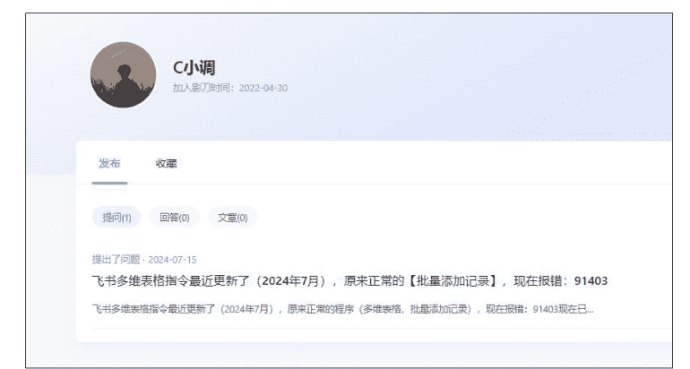

### 2023 年 12 月 22 日 参加影刀开发者活动

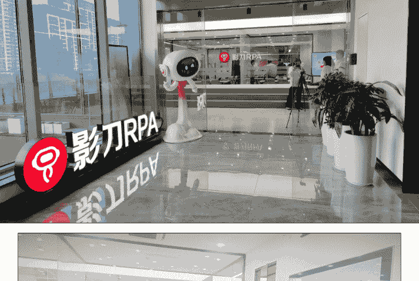

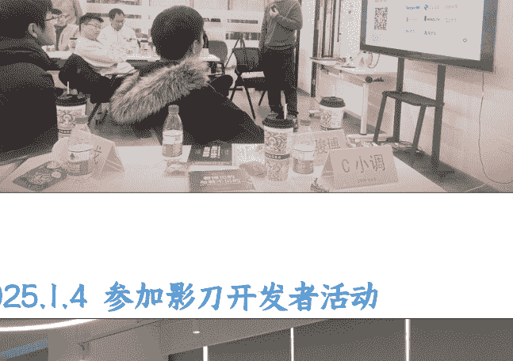

### 2025 年 1 月 4 日 参加影刀开发者活动

### 为什么不做产品？

不造产品不造轮子，小团队不要教育市场，不要教育市场，不要教育市场，重要的事说三遍；

如果既要研发产品，还要教育市场，太难了，国内太难没什么机会；

用成熟的工具/产品，来服务企业客户，干些脏活累活，先拿到 AI 门票，是我当下的认知；

没有简简单单靠工具就能，非常难，要结合行业，要做深度服务；

### 为什么先做服务？

客户愿不愿意持续给钱，是这件事有没有价值的核心，做服务是最快闭环的；

先有客户，有持续的落地服务 + 案例，让自己活下来，后期再想产品、可复制的事；

## 二、客户篇

### 客户在哪里，如何找到客户？

我们 2024 年 4 月 19 日开始做帐号的，抖音、小红书、视频号同步，主要是一些场景的机器人运行切片，刚开始前 3 个月还是挺难的 (线索少、咨询少)，主要是让帐号定位，要挺过去；

抖音的推荐还是非常精准的，随着帐号标签越来越精准，我会定时在抖音/视频号开直播，加强信任，直播还是需要的。

我们现在是不去陌拜和打电话的，客户通过搜索找到我们了才会跟进，所以我们的客户在全国/世界各地，包括深圳、南京、义乌、福州、厦门、杭州、悉尼、洛杉矶...等等，明年也会尽可能拓展杭州的客户，这是目标。

### 客咨来源

我们的客户咨询线索，抖音占了 73%，小红书占了 17%，超过了 90%;

抖音、小红书主要是打标签，持续发就可以。

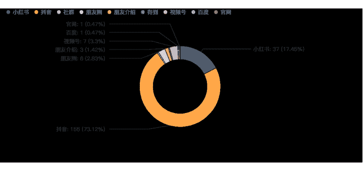

### 客户行业

客户的行业分布：

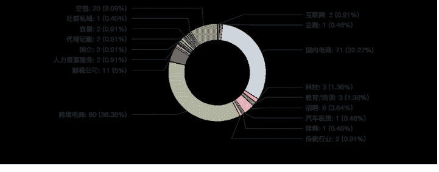

需求，是跟你发布的内容高度相关的，你发什么内容，就会吸引什么客户。

### 客户需求

客户需求的词云：

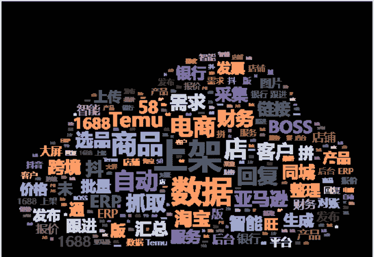

### 为什么要挑选客户？

客户不是越大越好、越有名越好，可以早点祛魅，大客户要求多，周期长，未必是好客户；

很多几千万、几个亿营收公司的数字化非常弱，提不出完整需求的也不是好客户；

### 什么样的算是好客户？

老板、决策层对 RPA+AI 非常认可；

甲方愿意花时间、投入钱、投入人，跟服务方一起探索行业实践；

### 做 B 端业务的优点

企业客户对价格没有那么敏感，对服务比较敏感；

完成一个客户的交付，可以拓展类似需求的客户；

一旦客户的机器人稳定运行了，按机器人按月收取的维护费是比较稳定的现金流;

### 做 B 端业务的缺点

- 起步、打开局面比较慢，需要时间，0 基础起步还是难的，后面就好起来了;
- 建议在一些圈子，最好有一定的资源;

### 为什么销售非常重要？

- 技术/产品出身的小伙伴，很多不太会销售，这个算是一个卡点，要早点突破;
- B 端业务，好的客户大概率不会送到你面前，需要你去跟进沟通，去发现挖掘;
- 我们是跟进通过线索找来的客户，相比于直接销售会容易一些;

## 三、业务路径篇

### 3 个阶段

- 1) 阶段一:1 人公司，3 个项目以内
一个人：开发 + 项目经理 + 销售，你必须是兜底的那个人;

- 2) 阶段二:2-5 人团队，10 个项目以内
如果有其他小伙伴，开发和项目经理配合，各自分工先完成闭环;

- 3) 阶段三：6-20 人团队（兼职为主），10-50 个项目
首先要有组团队、吸引人的能力；

要多项目同时管理的能力；

要有及时分钱、财务算账的能力；

### 主要难点：

项目价格评估，是需要经验的，前期需要懂技术的人参与，评估整个项目周期和成本，如果经验不足还是有很多坑的，后期随着项目多，越来越有经验，可以汇总很多案例 + 数据生成智能体，我们内部已经上线报价扣子智能体。

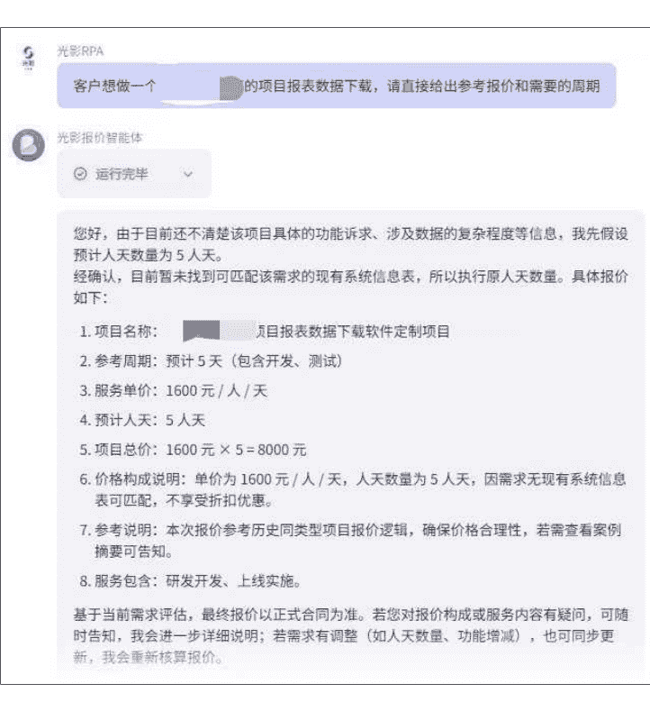

### 关于人才

假如团队比较小，可以这么配置:

项目经理 (1 人，含创始人), 主力开发 (2 人)。

假如是 10 人团队，大致分工:

项目经理 (3 人，含创始人), 主力开发 (6 人), 销售/售前 (1 人)。

前期是有经验的开发人员难找，因为有没有经验，交付质量和交付周期是完全不一样的;

等业务平稳了，客户线索越来越多，销售转化就变得很重要了，一定要安排销售跟进。

### 关于业务整体架构

我们团队目前所以的业务数据都在飞书多维表格，我大致列一下:

### 几个关键多维表

项目总表 (项目名、合同金额、验收时间、维保时间、项目已收入、项目已支出、项目实时毛利...)

收入明细流水表 (收入名称、关联项目、收入方式、收入金额、收入日期、开票 PDF...)

支出明细流水表 (支出名称、关联项目、支出方式、支出金额、支出日期...)

客户信息表 (公司名、联系人、所在城市、服务状态、开票信息、客户累计收入 LTV...)

### 多维表格设计要点

一个【多维表格】管所有，每个子表都有自己的仪表盘；

表格之间通过【项目名称】、【客户信息】等互相关联；

项目已收入、项目已支出实时计算，这样就可以算出实时毛利；

......

### 关于收费标准

### 开发部分费用

设计费:1500*n;

开发费:1600 元/人/天*n;

假如某个项目设计费 3000，开发 5 个人天 8000，总金额就是 11000;

### 维保部分费用

开发交付后，免费维保 2 个月;

超过维保期，每个机器人维保费 300-800/月，如果需要运维，每月单独计算费用;

### 关于源代码

原则:

- 影刀企业版客户提供源代码;
- 影刀创业版客户不提供源代码，通过分享程序链接 + 授权码提供服务;
- 不在个人社区版上开发;

大部分客户没有技术背景，其实也不太介意是不是源代码，我们要在生态中长期生存，一切动作要利于行业发展，利于影刀 RPA 商业化，保护开发团队的利益，设定好自己的业务框架。

### 关于收入组成

目前收入主要分四部分:

- 1) 影刀定制开发费用 (主要来源，毛利大约是 30%-40%)
- 2) 影刀企业版推荐佣金 (一个企业版 20%，比如：59800*20%=11960)
- 3) 企业培训/讲课 (讲课费)
- 4) C 端入门课程 (小红书 + 视频号 + 快团团)

## 四、案例篇

公众号懒人搜索，懒人专属群分享

### 列举一些简单的案例说明：

### RPA 国内电商应用场景

### 各类数据汇总

### 百度营销：多店铺数据汇总

多店铺后台目标数据抓取，数据按规范整理到 Excel 表格 + 报表；

自动完成账号下，多店铺自动提现操作；

### 某商城：商品上架 + 优惠券设置

批量上架商品：主图 + 详情图+SKU 信息；

优惠券设置：根据促销类型，批量生成设置促销优惠券。

### 1688：生意参谋数据汇总

企业多店铺，生意参谋数据汇总分析，自动生成报表；

#### 6:有展现的关键词 (近 7 天数据)

#### 7:询盘概况 (近 7 天数据)

#### 8:近 7 天零访问商品数

### 天猫：退货查询，物流拦截

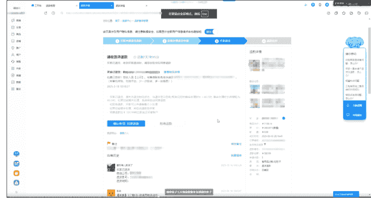

### 巨量千川：多店铺巨量广告数据汇总

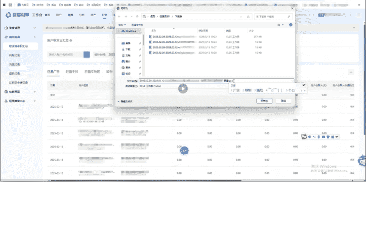

### RPA 跨境电商应用场景

### 亚马逊：广告自动投放 (领星 ERP)

- 设计并生成所有店铺的广告计划;
- 整理到广告计划 Excel 表格，不同的店铺对应不同的广告投放策略，并对应好基本投放信息;
- 访问领星 ERP 网站，自动提交广告投放计划，自动设置开启、关闭。

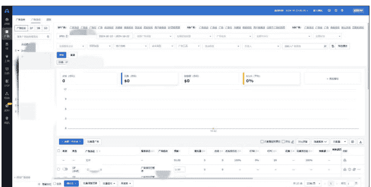

### TikTok Shop：批量上架 (店小秘)

根据采集数据，批量修改商品信息并提交。

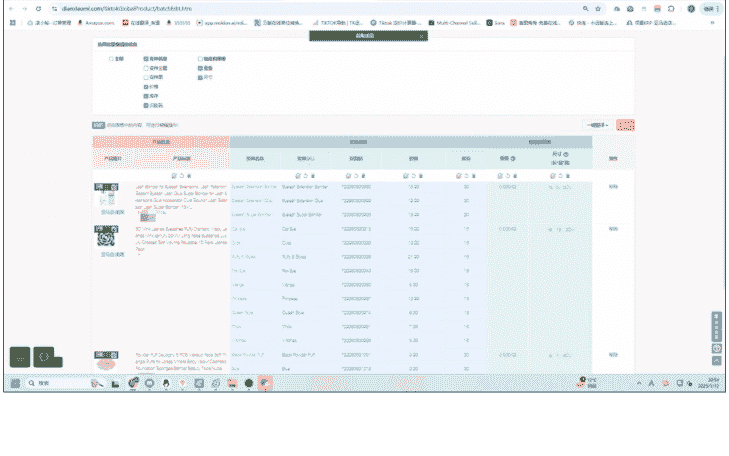

### Temu：商品自动上架 (店小秘)

通过店小秘，上架 Temu 商品;

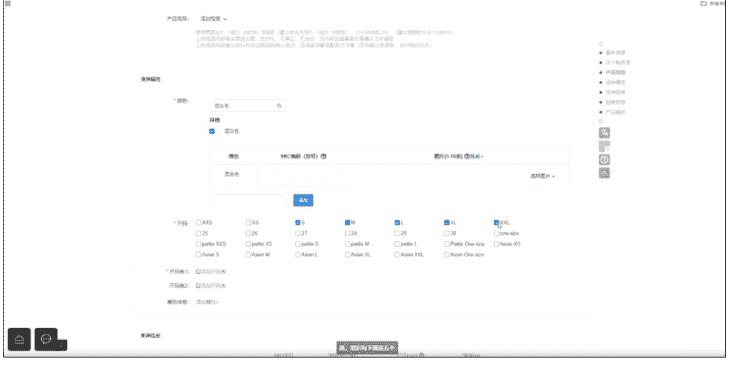

公众号懒人搜索，懒人专属群分享

### Ozon：商品自动上架（妙手）

通过妙手 ERP，采集后，批量编辑上架

### Shein：自动补充商品合规信息

通过 SKU 编码搜索对应商品，自动填写对应商品合规信息

### RPA 财务应用场景

公众号懒人搜索，懒人专属群分享

### 财务 RPA 常见自动化应用

### 流水数据自动下载

### 多平台数据比对、流转、汇总、提交

| 类型 | 自动化应用 | 操作工具 | 对应岗位 |
| :--- | :--- | :--- | :--- |
| 操作类 | 费用报销及凭证自动处理 | 财务软件、Excel 表 | 总账 |
| 操作类 | 财务对账自动化 | 网银、财务软件、Excel 表 | 往来 |
| 操作类 | 出纳日记账登记 | 财务软件、网银 | 出纳 |
| 数据获取 | 第三方平台自动对账 | 电商平台、支付平台 | 往来 |
| 操作类 | 薪酬核算自动化 | Excel 表 | 薪酬 |
| 数据获取 | 财务日报定时推送 | 微信、企业微信 | 资金 |
| 操作类 | 个性化报表制作 | Excel 表 | 资金 |
| 操作类 | 业务单据自动生成凭证 | 进销存、财务软件 | 业务 |
| 操作类 | 合同签约财务初审 | OA 软件 | 订单 |
| 操作类 | 报销审核及自动化付款 | OA 软件、网银 | 费用 |
| 操作类 | 订单审核及自动录入 | 进销存 | 订单 |
| 校验类 | 发票自动校验 | 税务系统 | 税务 |
| 操作类 | 开资质发票自动化 | 税务系统 | 税务 |
| 操作类 | 开电子发票并发送 | 票务系统 | 税务 |
| 操作类 | 应收款生产对账函 | 财务系统、Excel 表 | 往来 |
| 操作类 | 应付款生产对账函 | 财务系统、Excel 表 | 往来 |
| 操作类 | 对账函自动化发送 | Excel 表格、邮件 | 往来 |
| 数据获取 | 多公司业务往来对账 | 财务系统、Excel 表 | 总账 |
| 操作类 | 合同审批并自动下单 | OA 软件、Excel 表 | 订单 |
| 操作类 | OA 审批后自动付款 | OA 软件、网银 | 出纳 |

### AI 落地场景

我们用 AI 在企业端的落地，一部分是影刀 AI Power，一部分是飞书多维表格+Coze 智能体。

### 影刀 AI Power

影刀 AP，可以实现影刀应用直接调用智能体/工作流/大模型，并实现一些图片识别、内容分类、翻译等业务的基础判断，在影刀体系内完成闭环，不用其他智能体。

### 工作流/智能体页面图示：

### 飞书多维表格

主要实现内容分类、智能回复、选品、生图等复杂逻辑的内容/图片生成；

目前这一部分的需求越来越多了。

### Coze 智能体

主要通过关联飞书文档、飞书表格实现企业内部智能体的搭建，包括销售端、运营端等。

## 五、未来篇

AI 落地，一定要结合业务场景，相比于研究工具，目前应该花大量时间在挖掘细分行业的业务需求上，找到需求回头再找工具，会更快，更知道自己要什么。

### 生态位

保持前端获客能力，保持交付落地能力，在主流自媒体平台的 RPA 赛道占据一席之地；

保持在电商、跨境电商、财税等行业一线，有行业 Know-how。

### 愿景

一家领先的 RPA+AI 智能解决方案与技术服务提供商，有 RPA+AI 在企业应用落地的最佳实践。

整体业务范围包含：咨询 + 服务 + 服务，上限更高。

## 六、个人学习篇

### 总的建议

建议自己了解一下，会对你的工作有很多启发，了解一个高效的工具非常重要，RPA 值得；

复杂的应用还是建议交给有经验的工程师，因为需要一定的编程基础，自己学习的投入产出比不高，专业的事就交给专业的人，快速实现更重要。

### 学习路径

#### 看视频

看视频，看视频，看视频，不要着急上手，一定要多看几遍，一个视频 3 遍起步。

#### 跟着做

对视频熟悉了之后，再照着教程，慢慢跟着做，先完成几个实用的小功能，找到信心。

#### 融入工作

梳理自己工作中需要的业务，把学到的技能慢慢融入到实际工作中，会非常惊喜。

### 做记录

觉得重要的代码块，截图保存备用，并备注好分类 + 功能，以后会非常节省时间。

### 学习渠道

官网&B 站教程

### 学习剪刀差

给自己 3 个月的时间，先保持熟悉感，每天学一点点，一起见证自己的变化。

## 七、企业落地篇

### 主要落地场景

日常操作、数据监控、数据同步、数据采集、数据操作等。

### 需求模板

| 序号 | 需求部门 | 模块 | 功能 | 工作内容说明 | 单次人工耗时 | 每月耗时 (分钟) | 是否需要影刀 |
| :--- | :--- | :--- | :--- | :--- | :--- | :--- | :--- |
| 1 | BC 店 | CRM 模块 | 数据拉取 | 1. 每月会员评估模型搭建 2. 每月出具相关数据 | 30 分钟 | 30 | 是 |
| 2 | BC 店 | 直播模块 | 创建直播间 | 1. 创建直播 2. 添加宝贝 3. 添加利益点 | 30 分钟/次 | 1200 | 是 |
| 3 | BC 店 | 直播模块 | 直播数据统计 | 固定化数据拉取 | 30 分钟/天 | 900 | 是 |
| 4 | BC 店 | 群聊 | 内容分发 | 1. 定时内容分发 | 30 分钟/天 | 900 | 是 |
| 5 | BC 店 | 抖音直播 | 上架宝贝 | 1. 新品链接上架开链接 2. 其他临时产品需要开链接 (量不多) | 10 分钟 | 400 | 是 |
| 6 | BC 店 | 抖音直播 | 抖音表格制作 | 1. 表格信息整合 2. 表格复制到 ppt | 120 | | 是 |
| 7 | BC 店 | 抖音直播 | 老链接宝贝信息修改 | 1. 库存修改 2. 颜色修改 3. 发货时间修改等 | 30 | | 是 |
| 8 | BC 店 | 小红书 | 上架宝贝 | 1. 新品链接上架开链接 | 20 | 200 | 是 |
| 9 | 海外 | 产品版块 | 新品定价表格 | 1. 新品定价表制定，品类、市场价、初始定价 2. 常销价、活动价、上线时间等制作 | 60 分钟 | 60 | 是 |
| 10 | 海外 | 产品版块 | 库存管理 | 1. 每个工作日，加减库存 (特别是预订款，转化规格) 2. 新品加库存 | 30~40 分钟 | 1240 | 是 |
| 11 | 海外 | 产品版块 | 京东产品价格 | 1. 常销价设置 2. 优惠券设置 | 10~20 分钟 | 20 | 是 |
| 12 | 海外 | 活动模块 | 单品报名 | 1. 双 11 峰会活动报名、新平台活动产品整理等 | 10~20 分钟 | 20 | 是 |
| 13 | 海外 | 数据模块 | 店铺数据 | 1. 业绩、利润、销量整理 2. 单品周数据、新品销售数据等 | 40~50 分钟 | 200 | 是 |
| 14 | 海外 | 数据模块 | 单品销量 | 1. 各平台每月销售汇总 | 30 分钟 | 120 | 是 |
| 15 | 海外 | 交易管理 | 导单分单抢单 | 1. 每天导出成交订单，分发给不同供货商 2. 根据供货商反馈的物流单号提交发货 | 每天 60 分钟 | 1800 | 是 |

### 部署实施

#### 第一阶段：调研开发，1 个月

完成企业常见需求的调研、梳理 (根据场景、业务线等);

在企业员工中普及 RPA 相关的知识和内容，并进行答疑;

分阶段完成解决方案的交付，收集 bug 与其他反馈信息。

#### 第二阶段：测试优化，1 个月

根据客户的实际使用反馈，优化与迭代;

整理好新业务流程，设置提醒通知机制。

#### 第三阶段：稳定维护，按月度

由于平台 (网页、客户端、App) 会不定期进行改版和布局调整，机器人可能会出现一些小的运行问题，需要对一些机器人进行修复、程序调整。

## 写在最后

### 为什么要重视 RPA?

大部分朋友还不了解 RPA，你知道能做什么，就领先了 8、9 成的人;

我们当年怎么学习 Excel，现在就怎么学习 RPA;

好的工具能解放人工，让你从岗位、公司脱颖而出，也能帮公司快速扩大规模和营收。

### RPA 跟 Python 的差异？

- Python 是编程语言，学习成本高，对零基础的财务、HR、运营不够友好;
- Python 的特点是数据抓取、分析，但开发时间长，RPA 更快速，效率高;
- RPA 有点像 Excel，零基础入门，上手容易，快速反馈，使用场景多太多;
- 影刀 RPA 的底层是 Python，如果会 Python 可以深度开发，很加分。

### RPA 能解决什么样的问题，适合什么企业？

- 能解决什么问题：日常办公的各种运营操作，各种数据抓取整合;
- 适合体量多大的公司：小公司可以用创业版（5988/年），大公司可以买企业版（59800/5 帐号/年起）。

创业版购买地址：

https://www.yingdao.com/venpay/, 社区版运行别人的程序到时间上限也会触发购买。

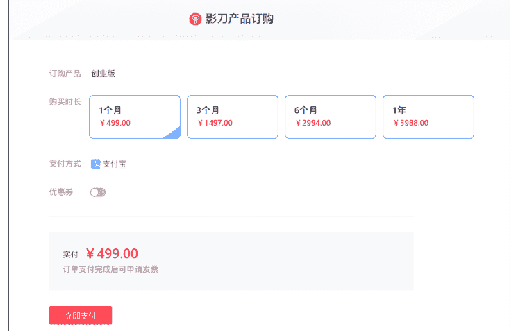

感谢阅读，大家多交流。

## C 小调

2025 年 11 月 11 日

最后，安利小懒的付费群：

### 懒人专属群（介绍）

🗞️ 懒人专属群持续更新中，已持续运营 6 年，整理超 3000 份各类精选付费文章&年费社群干货，全部开放下载。

本资料为付费群内部分享，仅供真实有需要的朋友查阅🙅

### 懒人专属群更新记录:

https://lazy2025.top/blog/record2

### 懒人专属群更新记录 (需梯子，备用):

https://lazybook.fun/blog/record2