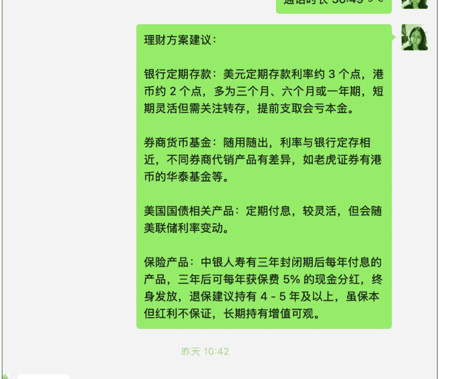

## 我如何筛掉90%不靠谱的合作方？5000 字总结

251117 生财精华

整理：公众号懒人搜索，懒人专属群独享
懒人微信：lazyhelper

大家好，我是小冯妮儿。

目前我保险从业 7 年，团队 10 个人，流量团队 3 个人，行政助理 2 人，后端转化国内保险 2 人，香港保险 2 人，再加上我。我们对接了 10 多个业务端供应商，包含了保险行业、医疗行业、移民行业、香港银行卡和券商、外部渠道合作等。

看到生财的资源对接板块，很多人都在找资源对接，大部分圈友都想找到靠谱的交付方，也有些圈友想扩大项目的收入，吸引更多流量方加入，吸引新的团队成员加入，但如何筛选、识别好的合作方，是大家的痛点中的痛点，如果想扩大项目，又不得不直面这个问题。

我们做香港保险，客单价高，用户决策周期长。最头疼的就是从公域流量过来的用户，信任基础几乎为零。最近，我拒绝了一个流量很大的合作方，因为我发现他的打法虽然能带来短期线索，但长期来看是在消耗我们的品牌。这让我开始深度思考，到底什么样的合作方才是我们真正的战友？

我的答案是：在小范围试错中，重点考察对方的‘可靠度、可信度、可及度’，并用‘一路吸引、一路筛选’的动态思维来构建你的合作生态。下面我将拆解我是如何将这个心法，应用在供应商、流量方和团队伙伴身上的。

## 一、找供应商，先做好市场调研

生财很多流量高手，估计很多人有想找靠谱后端合作的需求。我分享下我在最初做香港保险的时候，是如何做市场调研找供应商的。

我们卖香港保险，首先要找香港的保险经纪行合作，要借助他们的牌照资源才能出单。那么问题来了，大陆和香港天然有巨大的信息差，而且全香港经纪行有 800 多家，我怎么才能知道谁是靠谱的？

**第一步，我要先盘一下手上的资源，找到更多源头。**

我以香港为关键词搜我的微信好友和朋友圈内容，当时我就发现有几个不太熟的保险同行、理财规划师做香港保险业务。

于是，我微信一个个问他们是怎么做香港保险这个业务的，有哪些供应商，其中咱们圈友独立理财师封磊老师给我推荐他的供应商，这是我找到的第一个供应商的商务。

这才一个不够，于是我在公众号、知乎发了一些帖子，吸引香港的供应商找我合作，这样我就加上了三五个经纪行的商务。随着我发的内容越来越多，每天都会有新的商务来加我合作。时机成熟了，下一步，就开始咨询环节。

**第二步，问供应商行业问题以及个性化优势问题，并交叉验证。**

一般来说，每个商务都会说自己平台多好，多靠谱，那么他们水平到底怎么样？我会问他们一些行业问题，以此帮我快速厘清行业全貌，以及上下游产业链，只有我明白了行业的生态位是如何排布的，我才知道我自己的生态位。

- 1、问行业排名和业内生态，挖掘相关信息。

比如：香港经纪行有没有一些业内行业排名？前十名的经纪行你认为有哪些？如果你是我，找一家经纪行合作，你觉得我应该看重哪些方面？

每个商务会除了自己家以外还会报一些竞对的名字，虽然我知道这个问题不会有官方排名，但是我可以根据横向了解到不同的经纪行。最重要的是，我了解了选择经纪行的评判标准，于是我会顺着这些评判标准，继续问不同的商务。

- 2、问这家供应商独有的优势。

比如 A 商务提到了经纪行 ABC，我会顺着问下去，你觉得 BC 和你们最大的差距在哪？通常 A 会说很多他们的好处，通常我不会做评判，我只会记录 A 说他们有 12345 个优点。

我继续问，那你觉得 BC 经纪行有哪些不好或者不如你们的地方呢？这个问题问出来，你会了解很多内幕信息，也许真假掺半，不着急，先缓存到脑子里。

问完 A，我再去问 B\C\D\E……如法炮制，我前前后后在香港跑了四五家经纪行后，基本上香港保险业的经纪行的业态搞清楚了。

你可以把 A 的观点说给 B 和 C，把 C 的观点说给 A 和 B，以此来交叉验证。通过他们的竞争关系，你了解到了各自的优势劣势，股东背景，市场份额情况等，这样我就初步筛选出来了三个可以初步合作。

- 3、问供应商同业的业务打法和商业模式。（至关重要）

由于他们是上游经纪行，他们非常知道我的同行是如何做业务的。而且，经纪行的商务是非常希望能够拿到我的客户资源，利用这个心理，我会顺带做个竞对的调研，通常没有太大的利益关系的情况下，他们的信息真实度会很高。

我通常问，和我情况差不多的合作方，你们合作了有哪些？他们通常会找几个有名的，或者同城的同行和我交流，我顺带问句，我们杭州那个 XXX 做保险如何，他们一个月业绩多少啊，你知道他们是怎么做业务的吗？团队几个人？这个团队是怎么做出来的？

这些问题在闲聊的过程中穿插，这么一聊，对方发现我很愿意和他们聊天，也会告诉我同行的团队和业务规模，流量打法，转化做法，比我自己摸索来的更快，而且信息真实度更高。

我有很多同行的关键信息，都是从合作上游这里获得的。

很多人认为不和商务合作，就没有必要和他们多聊天了，但是却忽略了一个问题，商务每天都在找同行在合作，他们能够拿到一手的信息源，能够补充我们的认知版图。总结：“信息不对称是你的朋友，也是你的敌人。”可以利用供应商之间的竞争关系，巧妙地将信息不对称转化成了你的决策优势。这背后的原则是，永远不要只听一面之词，要通过建立“多信源验证系统”来逼近真相。

## 二、找流量合作，了解流量来源，做好分利方式

生财里有很多做流量的高手，他们缺好的项目，也有一些圈友有项目，缺流量。这里，我的经验其实有 2 个，1、了解他的流量来源和成功案例；2、做好分利方式。

- 1、了解他的流量来源和成功案例；

了解流量来源这件事至关重要。你可以不会做流量，但你不可以不懂。比如像我们做香港保险，这是一个高度需要信任度的行业，如果对方的流量是通过打粉、做一些纯营销内容来的泛流量，我们的高客单转化是异常艰难的。

如果前端流量无信任的嫁接，那么后端转化极容易走向价格战的方式。所以，前端流量和后端转化的调性必须完全一致，这个闭环才能形成。说一个我自己的失败案例，我也和生财的流量高手合作过，结果发现，对方推来的客户对于价格极其敏感，如果我们不打价格战就无法成交，最终我放弃了这项合作，专注于做有信任高转化的流量。

- 2、做好分利方式。

当你充分了解对方做流量的方式和你自己后端转化可以匹配时，那么可以通过分利方式来合作。通常有：

- 你 CPA 买断他的流量：可以按照有效客户数计费，好处是对方容易接受，缺点是价格贵，你不一定接受。
- CPA+CPS：双方共同承担一部分流量成本，再从利润里做二次分成。大家各让一步，容易促成合作。
- 纯 CPS：前端对方承担所有成本，你来专注做成交流和交付。这种对方风险高，转化方通常要分出更多利润。

一个愿意一起后端分润的人大概率会比想卖粉给我的人更值得信任，因为他也承担了业务风险，不会流量瞎搞。

如果你想尽快促成合作，那么最好的办法是先让他赢，然后大家一起赢。这里可以探讨多元化的合作方式，成本可控的情况下，尽量先让对方赚钱，一步步加深信任。后面随着业务的开展来不断调整。

总结：“合作的本质是风险和利益的重新分配。”愿意后端分润（CPS）的人更值得信任，因为他愿意和你共担风险。这背后的原则是，敢于和你绑定长期利益的，才是真正的“战友”；只做一锤子买卖的，永远是“交易对手”。让出一部分短期利润，换取客户或伙伴的长期价值，这是大账。

### 三、找团队伙伴，做好需求分析和激励政策。

最重要的一件事，是团队成员做 KYC。Know Your Customer，了解你的客户，这里特指了解你团队伙伴，了解他的需求。我们做大额保单销售，第一件事绝对不是给客户推产品，而是做需求分析，这一点对团队成员也一样。你招的人能和你走多远，其实是你在面试的时候就会知道。

比如我有个运营，她本身就看好我们团队做这个业务，愿意全身心投入进来，那她就适合做我们内容团队的主力，有一些有挑战性的内容我会让她去做。

还有个运营，虽然能力比第一个强，但是一些新的复杂的业务内容他不想去研究，那他就适合做他舒适圈范围的内容，我不会强迫他去做他不愿意的事。

曾经我面试个销售，我问他他就说以后想创业，这种人我一开始就不会用。我有段时间有个行政助理是个宝妈，她说她想带孩子间隙帮我处理点杂事，我当时就知道，如果工作一旦比较忙了，这人指望不上，并不合适我。

当你知道他的收入期待和对工作的想法时，取你的想法和他想法的最大公约数即可，而不是去说教他。如果最大公约数几乎没有，那就不要互相折磨了。

> 总结：“不试图改变人性，而是顺应和匹配人性。” 对不同类型运营的安排，对想创业者的判断，本质都是放弃了“改造”对方的幻想，而是做精准的“匹配”。这背后的原则是，成年人的世界里，筛选远比培养更重要，也更高效。

### 四、小范围合作试错，同任务赛马，看可靠度、可信度、可及度。

按照上面两步，我们可以一个项目组就正式成立了，但这还是个松散的组织，能一起走多久，需要靠一起打仗后才能知晓。

通常，没有经过实践检验，我不会贸然定下一个合作方，因为有可能有信息茧房，只有真正一起上过战场，才知道谁最合适。这里有三个标准：

- **可靠度**：这个人说的话是否能做到位，这代表了对方的能力是否可靠。
- **可信度**：这个人说的话是否能持续做到位，持续履约能力强就代表了可信度高，可以不断升级我和他的合作层级。
- **可及度**：我提的要求是否他能及时响应，尤其是非工作时间，可及度越强的人，越可以成为亲信和亲密战友。

举个例子：

运营 A 能力强，但经常不怎么理我，干完活就走人，但干的活的质量不错。

运营 B 喜欢学习，对你言听计从，但能力一般，你通常要花很大精力跟她沟通。

运营 C 工作能力强，也和你互动不错，但是他是个兼职，有时想干有时不想干。

A 可靠度高，可信度高，可及度低，适合给他他擅长的内容，但是不能逼他搞创新，可以给他个舒适区内项目独立运作。

B 可及度高，最适合培养成亲信去做新项目，但能力一般，如果学习能力强，其实是潜力股。

C 各方面能力都可以，但是因为给的钱吸引度不够，如果提高工资待遇，有可能发展成项目负责人。

这是团队内部画像，如果放到合作方，其实也是一样的。

比如合作两家香港银行卡办卡中介，我同时给他们放出一个任务，他们在可靠度、可信度、可及度的反馈，能够迅速帮你筛选出更适合的那一个。

最重要的，在小范围测试的过程中，对方的价值观是否与你匹配，你也能看得出来。

总结：真正靠谱的战友，不是聊出来的，而是打出来的。通过小范围的“同任务赛马”，用“可靠度、可信度、可及度”这三把尺子去度量，你才能在真刀真枪的战场上，选出你真正的将军。

### 五、一路吸引，一路筛选，同行和客户是最好的老师。

创业团队，无非就是没钱没资源业务要求还高，一开始不太会找到各方面都令人满意的团队成员和合作方，那怎么办呢？

其实是要不断提升自己，一路吸引，一路筛选。

我们创业，是要拿到所做业务发展非线性的指数级的回报，而一个人的能力发展往往是线性的，不能把一个项目寄托到任何一个人的能力上，包括过分依赖自己也是一样的错误。

所以，一路吸引，一路筛选才是硬道理。

哪怕我合作到靠谱的供应商，我也会不断与同行和客户聊天，掌握到最新的市场上的供应商情况变化和行业变化。

哪怕找到了暂时还不错的团队伙伴和合作伙伴，我也会不断地去寻找新的团队合作和合作伙伴。

前提是我自己要是—个不断成长不断进步的人，这样，哪怕开局很普通，我们的合作方和团队在不断自我进化，再踏上项目本身的时代红利，整个业务才能进入一个正向的增长飞轮，才能吸引到更优秀的合作方，让我们自己不断做大做强。

总结：合作的终极奥义，不是找到一个完美的“零部件”，而是将自己打造成一个强大的“引擎”，通过“一路吸引、一路筛选”，持续为你的业务飞轮注入能量，最终形成一个能自我进化的强大生态。

## 六、彩蛋：如何成为别人眼中靠谱的合作方

最后增加一个彩蛋，生财有术里有非常多的大佬，他们也在筛选靠谱的合作方，那么最后聊聊，如何成为一个让高手们愿意合作的人？

我自认为我自己做的还是不错，有些小成绩：我的合作商务成了我香港保险业务的转化团队合作伙伴，我做保险之前的合作商务成了我现在的客户，我的兼职运营现在成了我全职运营，我的香港客户多次请我吃饭，还送我香港本地的英语读物给孩子看……

> ( 香港客户知道我带儿子学英语，请我吃饭还送我她女儿读的书 )

持续输出，建立专业 IP：就像我今天写这篇文章一样，我不断在公众号、知乎、生财有术分享我的专业认知，让潜在的客户和合作方能“看见”我的专业度。让别人看见你，才有了合作的可能性。

交付超越预期：无论是对客户、团队还是合作方，都努力做到 120 分的交付。口碑是我最重要的资产，也是我吸引新合作机会的钩子。

我给合作伙伴算账时，所有账目都是公开的，他可以看到财务后台，财务透明就是信任基础。有时候给伙伴们发钱都是几万以上，收到钱当天结算，一天我都不会耽搁。分钱要快，财务要透明，这就是我的诚意。

我在和流量团队合作时候，对方最担心的肯定就是我们成交了说没成交。所以我让团队伙伴所有聊天记录实时公开，每日沟通客户进展，这样可以增加对方的安全感。

我给客户做合作方案时候，同时给到的客户信息都是利弊全部分析，多个解决方案，让他能感受到我是真的站在他的立场考虑。

以上三个案例，都是给足对方安全感的方式，唯有功不唐捐的坚持，才能用时间来替换空间，赢得别人的信任。

真诚利他，构建信任网络：我自己工作十多年一直都是乙方，我知道乙方的痛，容易被白嫖，容易被人看清。当我们同样面对乙方合作伙伴，比如商务、团队成员时候，我依然是把他们看成我的甲方，给他们充分的尊重，即便没达成合作，也要加深关系，给予对方一些有用的价值。

这个过程帮我建立了深度的信任，也让我获得了许多意想不到的机会。当我把自己打造成一个值得信赖的节点时，我发现，很多优质的合作机会会主动找上门来，”寻找“就变成了”吸引”。

总结：高手们寻找的，从来不是一个完美的合作资源，而是一个能持续创造价值、值得信赖的合作节点。通过持续输出让更多人看见你的专业，通过真诚、超预期交付和利他构建了自己的信任磁场。当你的专业能力和靠谱人品成为圈内共识时，合作机会自然会主动找上门来。最终，你不再是一个资源的“寻找者”，而是一个资源的“吸引者”，真正拥有了属于自己的商业引力场。

最后，安利小懒的付费群：

懒人专属群（介绍）

懒人专属群持续更新中，已持续运营 6 年，整理超 3000 份各类精选付费文章&年费社群干货，全部开放下载。

本资料为付费群内部分享，仅供真实有需要朋友查阅

https://lazy2025.top/blog/record2

懒人专属群更新记录（需梯子，备用）：

https://lazybook.fun/blog/record2