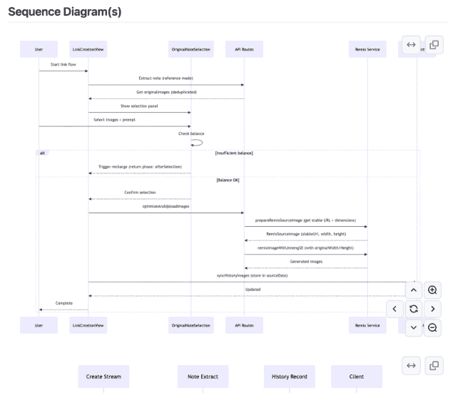
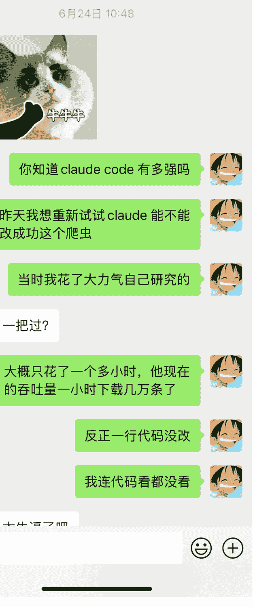
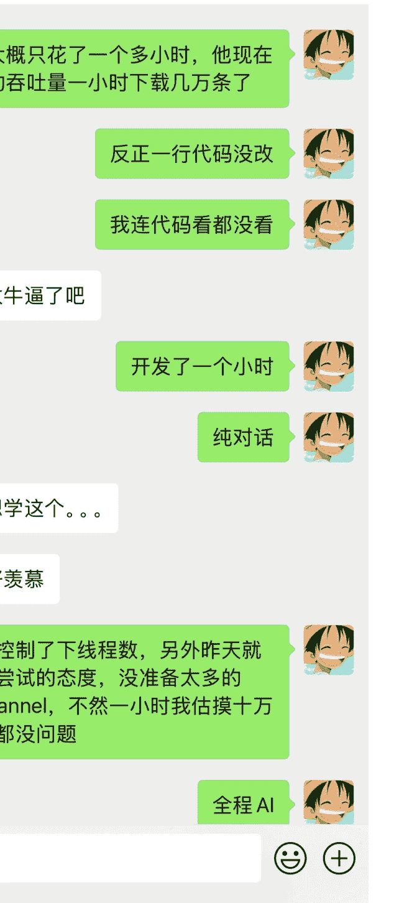
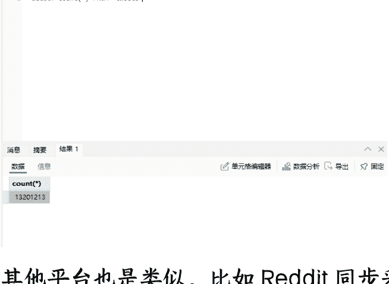
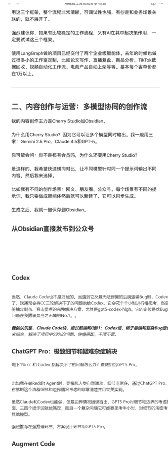
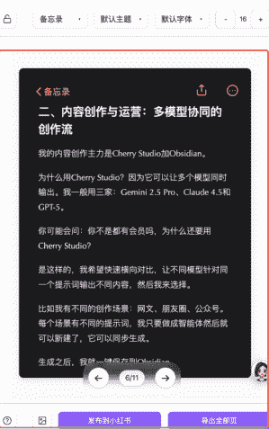
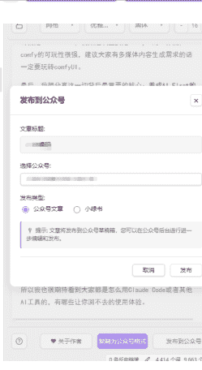

# 我是如何使用 AI 在不同场景 N 倍提效的

## 251117 生财精华

公众号懒人搜索，懒人专属群独享

懒人微信：lazyhelper


大家好，我是钱塘江鲤，感谢七天邀请，今天我想从技术实践的角度，聊聊我这半年来的真实工作状态，我是如何使用 AI 的以及我用 AI 赚到了哪些钱。

如果只觉得 AI 就是个聊天助手，问问题那就真的暴殄天物了，当你真把它当成生产力工具后，你会发现世界完全不一样，我觉得现在一天能干完过去一周的活，一个人能搞定过去一个团队的事，这可能有些夸张，但是是我最真实的感受。

下面是我主要使用 AI 的几个场景。

## 一 AI 编程场景

编程是我使用 AI 最核心的场景，我的主力工具只有三个：Claude Code、Codex、Augment Code。

### Claude Code：全栈程序员

我给 Claude Code 的定位是从 0-1 的开拓型员工，我只管提出需求，它负责从 0 到 1 填平所有技术细节。

大概是五六月份左右，在 cc 没有发布 subagent 而且还没有 Spec 概念的时候，我写了一个 autoCC 的自动化框架，实现了类似 subagent 和 Spec 工作流的核心流程，每天我的工作就是写需求文档和 Todo List，它会自动写代码、编译、测试、运行，当时的 cc 还是不限流不限速的，基本上替我饱和式地搞定绝大部分基础功能的开发。

另外还有一个点，不要把 Claude Code 只当成编程工具。它更是一个通用的 Agent 框架，通过 Claude Code 的 SDK 调用，你可以将它的超强执行力嵌入任何工作流，其易用和可控性远超 Coze、n8n 等平台。

cc 基本就是我的首席技术官，沟通成本为零，执行力 100%。

### Codex

当然，Claude Code 也不是万能的。当遇到它反复无法修复的后端逻辑 Bug 时，Codex 就登场了。我通常会将 cc 三轮解决不了的问题抛给 Codex。它会花个把小时进行慢思考，然后给出一份直击要点的完整解决方案，尤其是 GPT5-Codex-High。它的定位是找 Bug 和定位问题在我眼里是当之无愧的 No.1。

我的体感是，Claude Code 快，擅长前端和 0 到 1；Codex 慢，精于后端和复杂 Bug 定位。两者结合，解决了项目中 99% 的问题。快慢搭配，干活不累。

### ChatGPT Pro：极致细节和疑难杂症解决

剩下 1% cc 和 Codex 都解决不了的问题怎么办？直接交给 GPT5 Pro。

比如我在做 Reddit Agent 时，要模拟人类自然滑动，细节非常多。通过 ChatGPT Pro，半天左右就把这个流程细节和边界情况考虑得非常清楚并且完美实现。

虽然 Claude 和 Codex 也能做，但是边界情况错误百出，GPT5 Pro 对细节和边界的考虑更全面，三四个提示词就能搞定，而且一个复杂问题它可能要思考半小时，对细节的周密考虑远超其他模型。

强烈推荐在强推理环节、方案设计环节用 GPT5 Pro。

### Augment Code

除了 cc 和 Codex，我常用的编程工具还有 Augment Code。

对于基于大型开源项目的二次开发，Augment Code 是我的首选，它上下文处理和长任务和复杂项目的稳定性更高。

比如我要基于某个开源项目修改，直接 GitHub 地址扔给他，需求文档扔给他，交给他去验证和修改，它就会 clone 下来后按照文档运行测试然后新增功能，过一会回来验收就好了，在这方面横向比对过 cc 和 Codex，它是最稳定的。

### CodeRabbit

AI 编程时代，AI 一天能给你写一两万行代码，所以 Review 机制非常关键。

我用的是 CodeRabbit。它的 Review 机制基本上覆盖了所有场景。你的同事写完代码合并时，只要发 PR，你就能看到修改和建议。

他们也可以在本地 CodeRabbit 进行第一遍 Review。这个工具能极大提高合并时候 bug 的检出率。

使用形式类型如下，PR 的时候 CodeRabbit 会总结分析所有变动，并且给出建议，按需判断修改就 OK，用起来几乎无侵入性。



### Restrict owner-scoped updates and preserve accumulated images

Right now any caller can supply an arbitrary rewrittenNoteId/historyId and overwrite another user's data because the updates are not scoped to task.userId. On top of that, because triggerImageRemix launches one background task per selected image (see components/mobile/create-center/LinkCreationView.tsx), each task writes only its own allGenerated back here. The last job to finish wins, so earlier outputs disappear if the client disconnects before syncRewrittenNoteImages runs. Please scope the updates to the owning user and merge with existing content before writing.

```
- if (rewrittenNoteId && allGenerated.length > 0) {
-   try {
-     await prisma.rewrittenNote.update({
-       where: { id: rewrittenNoteId },
-       data: {
-         contentImages: allGenerated,
-         coverImage: allGenerated[0] || null
-       }
-     });
+ if (rewrittenNoteId && allGenerated.length > 0) {
+   try {
+     const note = await prisma.rewrittenNote.findFirst({
+       where: { id: rewrittenNoteId, userId: task.userId },
+       select: { contentImages: true }
+     });
+     if (note) {
+       const mergedImages = Array.from(
+         new Set([...(Array.isArray(note.contentImages) ? note.contentImages : []), ...allGenerated])
+       );
```

### AI 编程帮我做了哪些事

上面说了我常用的几个 AI 编程工具，那我用这些工具都做了什么呢，下面从数据采集、自动化运营、自有产品开发、客户交付几个方面展开。

#### 数据采集

用 Claude Code 做数据采集，真的是又快又好。

举个例子，去年十二月的时候写过一篇《三天采集了三四十万条 YouTube 的 AI 视频，总结了 1 万个对标频道。》。

但在今年 6 月，我用 Claude Code 从一个空文件夹开始，1 小时内就完成了一个全新的采集工具，当时效率是每小时十万条。经过几轮迭代优化，现在单机并发每小时能采集近 1000 万条视频，单机吞吐量峰值超过 3400 视频/秒。

过程是这样的，年中的时候因为 cc 用的越来越顺手，于是我就想试下，从 0 开始实现下 YouTube 的数据采集，因为在去年的时候使用 cursor 没有完成这件事，最终还是我手敲的脚本，半年后的 AI 的能力又怎么样呢。

结果就是如下，在 1 个小时的时间完全通过对话的方式，从 0 使用 Claude Code 写了一个 YouTube 采集器，当时是一小时十万条，记得很开心还和朋友分享了下。





随后接下来的又找了一些时间进行优化一小时一千万条了，真正的低成本高数据量采集，单机并发每小时实现一万多个关键词将近一千万条视频的采集，吞吐最高超过了 3400/秒，平均每个关键词超过了 825 个视频。总累计时间不超过两天的时间，我基本就做好了一个每天可以采集几亿条数据的爬虫，放在以前完全不敢想象。

同样的方式，我在 Twitter 上也监控了一万个 AI 和 AI 图片/视频博主，过去一年的时间共监控了他们 1300 万条推文然后进行创作，平均每天也会增长一万到三万条左右的新增推文，再加上 cc 每天定时总结和定时推送（还记得一开始提到的 cc SDK 吗，cc+skill 无敌工作流，不想标题党，但真的降维打击了传统的工作流），基本上已经解决了选题和最新的 AI 资讯问题。



其他平台也是类似。比如 Reddit 同步采集了十几 T 的数据，基本上把 Reddit 全站数据全部采集下来了，国内也实现了某书的数据采集。我记得在去年 8 月份分享过使用 RPA 加影刀采集商品的帖子，但是一年后使用 Claude Code 重写了一遍，写工具的效率提高了 N 倍，采集的效率也提高了 N 倍。

这可能就是生产力的跃迁吧，所以说我一直觉得这每月几千块的 AI 税是我交过的最值得的投资，他带给我的价值早已经是百倍了。

其实 Claude Code 的能力还绝不止于此，很多人还没意识到，它是有大规模生产能力的。

#### 账号矩阵运营：全自动化的 1000+ 账号

以上是使用 cc 实现数据采集的实践，实际上还是用 CC 做了很多类似的工具。

比如我用 Claude Code 写了一个 Agent，管理了上千个账号，从账号注册，到批量设置人设关联账号，自动评论等多种不同场景的深度的 AI 介入，从指纹浏览器调度，到批量账号注册，养号，内容生产，到自动发布，都可以随时人介入调整，也可以 AI Agent 进行自动化操作，帮我高效稳定地管理了一千加的跨平台账号矩阵。

目前正在加人设关联和图文/视频内容产出，我的目标是打造一个完全由 AI 驱动的 IP MCN，产出不同人设不同风格的多模态内容。

当然背后还有许多看不到的功能，但是这么一个相对来说复杂而且解决了我问大问题的一个 agent，基本上是完全依赖 cc + codex，在其他项目并行的情况下，不到两周的时间就做完了，所以 AI coding 现在的生产力水平深不见底。


#### 常用的 AI Agent 框架：企业级智能体的构建

上面说了一些数据获取和运营场景，企业交付场景下，在 AI Agent 场景，我主要用了两个框架 autogen、langgraph，最常用的是 langgraph。

当然去年也是用 Coze、Dify、n8n、RPA 交付客户。我在 24 年大概做了一年的 RPA 和 Coze 等工作流，也交付了大概 120 多个工作流，但是后面踩了很多坑，今年年初逐步变成了纯原生实现，不再使用 Coze 或者 RPA 等低代码平台交付工作流，客户更关注的是功能和稳定性。

比如使用 LangGraph，它基本提供了一套完整的状态机编排能力，能够清晰地定义智能体的决策流程。配合 LangSmith，整个 Agent 的运行轨迹状态变化和决策依据都有完整的可观测性，这对 B 端交付很重要，LangGraph 的天花板很高，从简单的线性流程到复杂的多 Agent 协作，都能很优雅地实现。

在交付过程中，还涉及到的一些为客户构建行业知识库，清洗行业内的数据、政策更新，生成报告。脏活用 cc+ 特定的 pipeline，交付用 LangGraph，整个流程非常清晰，可调试性也强，有些是和客户的业务场景关联的，就不展开了。

强烈建议如果有比较稳定的工作流程，又有 AI 在其中起决策作用，一定要试下这几个 agent 框架。

以上就是使用 cc 的一些场景，今年使用 cc 做的项目已经交付了多个企业级智能体，基本单价在 6-30 万之间。上半年的时候也使用 cc 做过很多小的工作室定制，比如论文写作、直播复盘、商品分析、TikTok 数据回收、视频自动化工作流、电商产品自动上架等等多到记不过来，大多数定制单都在 1 万以上，其中论文和 tt 数据回收几个项目极低成本标准化之后还额外收入了十几万。

在没有 Claude Code 之前，这样的效率和产出规模是完全不可想象的，过去一个人最多同时推进 2 个项目，现在可以并行处理 5-6 个项目。关键不在于写代码更快了，而是从需求理解架构设计到落地实现的整个链路都被压缩了。

## 二 内容创作与运营

上面是 AI 编程场景，另外在内容创作场景，我的主力 AI 工具是 Cherry Studio + Obsidian。

为什么用 Cherry Studio？因为它可以让多个模型同时输出。我一般用三家：Gemini 2.5 Pro、Claude 4.5 和 GPT-5，我希望快速横向对比，让不同模型针对同一个提示词输出不同内容，然后我来选择。


Cherry Studio 也支持自定义提示词，比如我有不同的创作场景：网文、朋友圈、公众号。每个场景有不同的提示词，我只要做成智能体然后就可以新建了，它可以同步生成。


生成的文章可以一键导出到 Obsidian 中。


生成之后，我就一键保存到 Obsidian。

从 Obsidian 直接发布到不同平台

你没看错，从 Obsidian 可以直接发布到公众号，而且可以自动采集、裁剪，发布到小红书。整个链路非常短。这个插件就是我基于开源项目加 Claude Code 不超过三个提示词完成的，可以直接将我的文章发布到公众号。

针对公众号批量创作场景，我还写了一个自动化创作 Agent。当然也是基于 Claude Code 做的。这个小 Agent 的设计我特别喜欢，很精巧，是基于 Claude Code SDK 加 Subagent 做的。







这些 Agent 可以让把海外 Reddit 等不同平台的优质内容二次创作，然后自动发布。

因为 Obsidian 是支持数据库的，所有内容都能结构化管理，看起来非常清晰。

### Smart Composer 加速内容创作

另外，Obsidian 还有个神器 Smart Composer。

它可以借助 MCP 工具，直接从零开始创作。我使用 cc 自己封装了一个 MCP，可以支持把任何社媒链接比如 Twitter 小红书等直接给它，它就会解析内容，然后按照预定的提示词模板重写，算是单篇文章轻量级地对 cc 的补充，改写完成了直接点击发布就好了，Obsidian 扩展性很好，有需求直接让 cc 做个插件就好了，基于自己的需求，我让 cc 写了大概十几个插件满足不同场景的发布和内容审核需求。

### 海外账号运营

推特运营方面，我用 XAI Creator (xaicreator.com) 基本上管理了我的海外账号的在线运营。最近还在尝试 Thread 和 Instagram 的起号，有好的结果了和大家同步。

## 三、微信自动化工作流

自动化这块我做得比较多了。之前也做过微信的影刀微信自动化，但是因为风控原因，还是废了几个微信号，后来实在没办法转到了飞书一阵，但是始终没有微信方便。

后来从生财官方号获取到了灵感，比如下图左边，生财有术服务号会根据情况给我推送提醒，那我自己申请个服务号，设置好规则，让他给我推送每日提醒和设置不就行了嘛，而且服务号是支持对话的，也就是说不管我给他发了什么，他都可以作为一个入口，后台对应分发不同的 Agent 就可以了。

比如我发了什么链接，后台的工作流都可以实现自动解析，然后入库处理，最后给我返回一个通知，直接让我审阅一下就行，也可以一键调起来小红书，或者把文章审阅后点击下发布到多平台，很方便。

另外后台也可以接一个 Agent，帮我处理任何不同的任务，包括前一日的热点，甚至是生财筛选内容的推送，平台发布规划，日程安排等等，这样基本上平替了大部分的微信机器人的功能。

效率提升 N 倍吧，基本上借助企业号我把所有基于微信生态的自动化常见需求都自己打通了。

- 17:05 生财有术服务号 时间：打卡截止倒计时不到 5 小时 状态：今天的航海日志也别忘了提交呀! 查看详情
- 星期六 19:00 考勤打卡提醒 姓名：钱塘江鲤 时间：打卡截止倒计时不到 5 小时 状态：今天的航海日志也别忘了提交呀! 查看详情
- 昨天 19:00 考勤打卡提醒 姓名：钱塘江鲤 时间：打卡截止倒计时不到 5 小时 状态：今天的航海日志也别忘了提交呀! 查看详情
- 免费体验 生财官网 会员专区


另外还要 cue 下 cc，这个项目是 cc + codex 一起做的。还是老样子，一行代码没写。

回顾到这，我认真想了想，我最近至少已经三个多月手写代码行数不超过 100 行。真正意义上的开局一个空文件夹，直接让 AI 实现整个项目。

## 四：PPT 生成

虽然都吐槽 PPT，但在分享场景和工作场景，PPT 还是必须的。

我主要用四个工具：Gamma PPT、Genspark、天工、Coze 空间。

为了 PPT，还单独开通了 Genspark 和 Gamma 的会员，很好用。

平时用法是同一个主题，同时发给所有这些网站。哪一个对我的思路启发更大？哪一个样式、布局、设计最符合我的要求？我就用哪一个。

## 五 AI 生图

即梦的生图能力基本上是最强的，尤其是即梦 4.0。另外还有就是 Nanobanana，视频这块主要是 ComfyUI 的工作流，Comfy 的可玩性很强，建议大家有多媒体内容生成需求的话一定要玩转 ComfyUI。

最后，我想分享这一切背后最重要的核心：养成 AI First 的习惯，所有的问题我都会找不同的 AI 同时确定一遍。

以编程为例，现在遇到问题，我的第一反应是：Claude Code 解决不了，就找 Codex；Codex 解决不了，就问 GPT-5 Pro。如果连 Pro 都解决不了，那大概率不是 AI 不行，而是我的提问方式或解决问题的方向错了。它成为了我判断技术路径可行性的锚点。

它都解决不了，说明我的方向错了，就不要浪费时间，赶紧换一种方式实现。

## 从工具到员工的认知转变

我的角色定位其实很简单。我只是个会提需求、会引导 AI 的人。但正因为这样，我才发现了 Claude Code 的真正价值：它不是工具，而是员工。你把它当工具，它就只能写写代码。你把它当员工，它就能帮你干一整套流程。

所以我也很期待看到大家都是怎么用 Claude Code 或者其他 AI 工具的，有哪些让你回不去的使用体验。

## 最后，安利小懒的付费群:

懒人专属群 (介绍)


💾 懒人专属群持续更新中，已持续运营 6 年，整理超 3000 份各类精选付费文章&年费社群干货，全部开放下载。

本资料为付费群内部分享，仅供真实有需要的朋友查阅🙇‍♂️

- 懒人专属群更新记录：https://lazy2025.top/blog/record2
- 懒人专属群更新记录 (需梯子，备用)：https://lazybook.fun/blog/record2