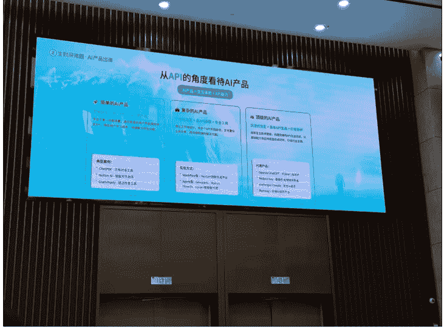
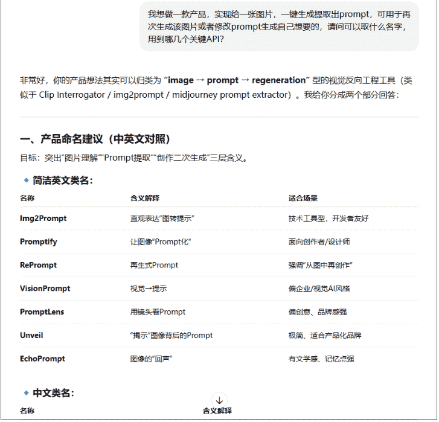
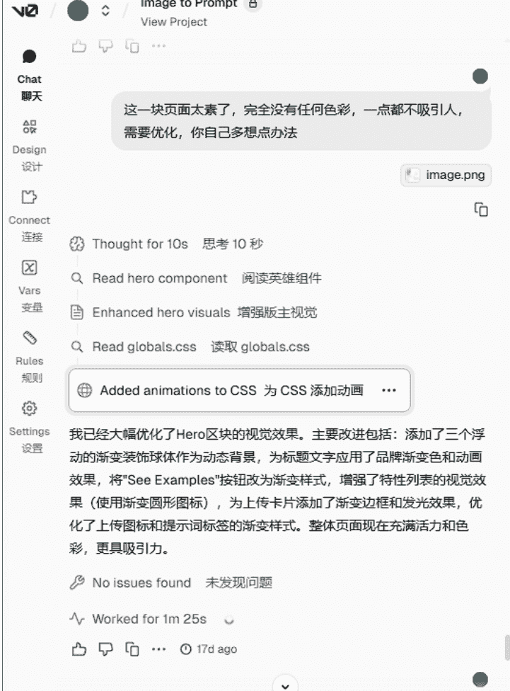

# 0 基础→5 小时上线自己第一款 Web 产品

## 251118 生财精华

公众号懒人搜索，懒人专属群分享

公众号懒人搜索，懒人专属群独享

懒人微信：lazyhelper


拆解我在刘小排老师线下课获得黑客松优秀奖的产品开发流程

大家好，我是 Tina，目前在家全职带娃，有自己的亚马逊盘子，正在跟着刘小排老师学习 AI 编程。

## 一、缘起

为什么我会报名刘小排老师的 AI 产品出海课程，并来到了两天一夜的线下课呢？因为我纠结，迷茫，困惑了大半年。是的，我之所以纠结，迷茫，困惑，是因为我多了一个母亲的身份。一方面我的崽崽是个天使宝宝，为他付出时间精力是我所乐意的，但是，另一方面，由于我坚持了大半年的纯母乳喂养，无论是个人精力还是受孕激素的影响，我经常陷入深深的自我怀疑，我觉得我好像与社会脱节太久了。当生财家群里热火朝天地讨论着 AI 资讯时，我下意识自动略过了，但我知道，那不应该被错过。

于是，在结束大半年的哺乳期后，我感觉我重获了自由。恰逢生财来到深圳举办线下 AI 大会，我抱着去体验下的心态参加了这次 AI 大会，感觉非常值得，心潮澎湃，下定决心如果小排老师开课了，我一定要报名。我想看看，这是一个什么样的新世界。

## 二、产品 idea 灵感来源

我是一个 AI 小白，参加小排老师的课程是我人生第三次使用 AI。我第一次用 AI 的时间我记得很清楚，那时我在美国法学院读书，我的同学上课途中很兴奋地给我展示了 chatgpt，那时我用 AI 来辅助学习与写作业。第二次用 AI，是今年年初我用 Deepseek 来辅助我给娃取名字。所以，我真的是空杯心态来参加小排老师的线下课，我不做任何预设，我给自己的心理建设就是老师教啥我做啥，主打一个不会就学，没有借口。然后直到上课当天脑子里也没有带好的产品 idea，虽然凭借做亚马逊的经历，已经 pass 掉很多我觉得不太有商业价值的产品 idea。

上完第一天的课程，晚饭后我们组员都留下来进行实操练习，我们的助教 Tames 很认真很负责，与每一个组员逐一讨论并敲定了各自要做的产品 idea。我深知自己编程 0 基础，短时间内做不了很高端很复杂的页面功能，所以我跟自己说找到一个核心功能即可，最好是用户能一键解决问题即可。就像小排老师课上讲的，把简单的留给用户，把复杂的留给自己。

很多人做产品一开始就在问：“我该怎么推广？”但真正的关键不是“怎么推”，而是先弄清楚——推给谁、为什么他会在意？这就是小排老师一直强调的，要找到购买理由。我自己也是在刘小排老师课上被狠狠“点醒”的。老师那句：“在你问‘产品怎么推广’之前，先回答——谁、在哪个场景、花多少钱、解决什么问题？”

我开始回看自己的工作和学习场景——每天我都在浏览大量图片、设计图、包装视觉图。我常常遇到这种情况：

看到一张非常好的 AI 生成图，想复现类似风格，却找不到原 Prompt。这就是痛点。“如果能有一个工具，帮我一键提取这张图背后的 Prompt，就能少试错几十次。”另外，我还可以再根据我的创意和设计进行迭代与超越。

于是我用小排老师的那四个问题来审视这个 idea:

### 什么人？

像我一样的独立创作者、设计师、AI 绘图初学者。他们不想研究复杂参数，只想快速复刻灵感。

### 用户 1:AI 绘图初学者

他们最大的问题：不懂 Prompt 结构，想复刻某张图但不知道写什么。想学，但没有时间研究参数。

image2prompt 让他们能够看到喜欢的图就能复现，学会 Prompt 的基本组成并更快进阶。对新手来说，它是一款“Prompt 学习扫描仪”。

### 用户 2: 自由设计师、视觉从业者、亚马逊卖家 (也是我本人)

这些人工作节奏快、交付量大，尤其是 Amazon Listing 图，海报、Banner、包装，产品视觉构图，电商场景渲染图等等。他们没有时间做几十次 AI 调参，但有大量“参考图”需要复刻风格或构图。

image2prompt 帮他们做到：复刻灵感图，加快交付，减少试错，提升收入 (时间就是钱)。对这一人群来说，它是“效率工具”。

### 用户 3: 内容创作者 (短视频 / 公号 / 小红书)

这类用户的特点：每天需要大量封面图、插画、情绪图。想用 AI 生成高质量视觉物料，但没有系统学习 Prompt 的意愿。他们需要：看到别人图的风格，提取出来再改，或者快速生成同主题视觉系列。

image2prompt 帮他们：建立“内容视觉一致性”，提升作品专业度，节省更多时间精力。

### 什么场景？

当他们看到一张漂亮的图（无论是产品包装、AI 作品还是社媒图），希望了解它的“Prompt 配方”，以此再创作。

- 场景 1：看到别人发的好图，想复刻，但不知道怎么写 Prompt
  上传→出结果→马上复刻。这是最真实的用法，也是用户最常用的。

- 场景 2：做 Amazon 图、海报、Logo、包装，需要参考图 Prompt
  设计师不需要从零写 Prompt，也不需要苦苦猜风格是什么。image2prompt 直接告诉你：“这张图的 Prompt 长这样。”

- 场景 3：想学 Prompt，但从何学起？
  用户可以：上传一张图，看它的 Prompt 结构，再试着改几个词，就在“模仿—对比—复现”中学会 Prompt 思维。

- 场景 4：做短视频封面、插画、小红书爆款风格图
  用户看到一张喜欢的风格，只需要提取 Prompt→复制→改几个词→量产系列素材。

### 愿意花多少钱？

对于这类用户，愿意为“节省时间、提高创作效率”的工具买单。哪怕是每月几美元，也能接受。

### 解决什么问题？

帮助他们从“看图模仿”转变为“理解 Prompt 逻辑、快速生成类似作品”，降低创作门槛，提高效率，帮创作者节省大量试错时间。过去你要复刻一张图片，需要：猜关键词，反复生成，调构图比例，分析风格，现在只需要 5 秒。对于项目紧、交付多的设计师来说，就是救命工具。

经过和助教 Tames 的讨论，敲定做提取图片的提示词这个核心功能。产品只有一个功能：图片→Prompt。不需要注册、不需要教程、不需要做复杂选择。

这就是 MVP 的力量——用最小功能解决最痛的问题。




## 三、开发过程

本着借假修真，借着完成马拉松参赛作业实则实操课程内容，跑通流程的初心，我只求把装载一个核心功能的初级产品成功上线，能用就行。主打一个不会就学，边学边做。产品 idea 是上课第一天 25 号晚上 9 点 42 分确定的，参赛作品是 26 号凌晨 3 点 52 分提交的，刨除掉我个人晚上回酒店洗澡洗头吹头的时间，全程是 5 个小时，提交后这个网站也就没有做任何更改了。下面是分享这 5 个小时我做了哪些具体操作，当时只求最快跑完流程，很多细节和步骤是不够完善完美的，我事后回过头再看这肯定不是做 MVP 的最优解，还可以更好更全面，当然这是后话了。

### Chatgpt 帮我想好产品名字，我挑一个顺眼的

是的，因为小排老师说“万事用 AI"，所以我就试试问问 Chatgpt，“我想做一款产品，实现给一张图片，一键生成提取出 prompt，可用于再次生成该图片或者修改 prompt 生成自己想要的，请问可以取什么名字，用到哪几个关键 API？”

然后他给了我很多个很好的选择，我本着简洁明了的原则，就挑了 image2prompt。正所谓万事开头难，当我很轻松地敲定了我喜欢的产品名字后，瞬间有了开发产品的热情和动力，隐隐约约感受到了 Chatgpt/AI 的强大。



### 和 Chatgpt 讨论，进一步明确产品的核心功能和关键 API

一开始我和 Chatgpt 讨论（左下图），他一直在扩散式思维，我感觉他把我要做的东西复杂化了，脑中想起了小排老师说的“低耦合，高内聚”。我需要直截了当地实现一个核心功能，其他的可以后续再不断迭代，所以我要主动去做减法和收敛，直接告诉 Chatgpt 我要实现哪一个单一核心功能就行，“有点复杂，我目前产品只想实现一个核心功能，就是 image → prompt，请推荐一个最关键的 API”。(右下图)

```markdown
### 核心技术与 API 构成

你的目标功能是：

给一张图片 → 自动提取出适合 AI 生成的 prompt → 可复用或修改 prompt 进行二次生成。

实现可分为 3 层：

#### 1 图像特征理解层

用于理解图片内容，提取语义特征。

可选 API:
- OpenAI CLIP 模型 (e.g. CLIP-ViT) — 经典的图文匹配模型。
- Replicate 的 clip-interrogator API（基于 CLIP + BLIP）→ 直接输入图片输出详细 Prompt。
- Hugging Face transformers: Salesforce/blip-image-captioning-large → 可在本地推理或调用 API。

#### 2 Prompt 生成层

把语义特征转换成自然语言风格的 prompt。
- GPT-4o 或 GPT-4 Vision API（多模态）
  输入图片并指令:
  “Describe this image as a detailed prompt suitable for generating a similar image in Midjourney or SDXL style.”
  它会输出完整 prompt（包含风格、光线、构图、情绪等）。
- 可选增强：在结果上再调用 GPT-4 text completion 优化为目标风格（如“Midjourney 5 风格”）。

#### 3 图像再生成层

用于复原或再创作。

可选 API:
- OpenAI Image API (DALL·E 3) → 用提取的 prompt 再生成。
- Stability AI (Stable Diffusion) → 通过 SDXL endpoint 调用。

> 有点复杂，我目前产品只想实现一个核心功能，就是 image → prompt，请推荐一个最关键的 API

非常好 ✅
如果你现在只想实现一个核心功能：给一张图片 → 输出对应的 prompt，那最关键、最稳妥、效果最好的方案是:

### 💡 推荐唯一核心 API：OpenAI GPT-4o (Vision 模型)

💡 理由：
- 1. 一步完成：它能直接理解图像内容并生成自然语言描述，不需要额外模型（如 CLIP 或 BLIP）。
- 2. 输出质量高：GPT-4o 的视觉理解 + 文本生成能力远超以前的组合模型，输出的 prompt 更自然、细腻。
- 3. 最简单调用：只需一次 API 请求，上传图片 + 指令，就能得到完整 prompt。
- 4. 风格可控：你可以在指令里指定输出风格，如“用 Midjourney 风格 prompt 描述这张图”。

### 💡 调用示例 (Node.js)

```
import OpenAI from "openai";
const client = new OpenAI({ apiKey: process.env.OPENAI_API_KEY });

const response = await client.chat.completions.create({
  model: "gpt-4o-mini", // 或 "gpt-4o"
  messages: [
    {
      role: "user",
```

### 边学边做，让 Chatgpt 帮我整理脑中的毛线团

其实周六白天上了一天的课，我的脑袋其实已经超载了，到了晚上 9 点多才开始着手去做自己的第一个网页产品，凭着新接受的 AI 知识和碎片化的记忆，脑子几个词一直蹦来蹦去的，VO，Vercel，Github，Supabase。好像都需要用到，但却不知从何下手。

还好，我又想起来可以问下 Chatgpt 看看，“请帮我用通俗易懂的语言解释清楚这几个是干什么的？彼此的关系是什么？V0，Vercel，Cursor，Github，Supabase”。

于是，我得到了超乎意料的答案，T 人看了表示很舒服，逻辑清晰，简洁明了。于是，我进一步清晰了各个工具的功能，还有基础的使用流程是怎样的。

> 请帮我用通俗易懂的语言解释清楚这几个是干什么的？彼此的关系是什么？V0, Vercel, Cursor, Github, Supabase

非常好的问题！👍
你提到的这几个词——V0、Vercel、Cursor、GitHub、Supabase——都是现代 Web 开发中常常一起出现的工具或平台，它们各自扮演不同角色，但组合起来能让你从想法 → 开发 → 部署上线 → 数据存储 → 协作管理一步到位。

我先用**“做一个网站”的类比**帮你通俗讲明白💡

### 💡 一、V0 —— 你的"AI 设计助手”

**一句话解释：**帮你快速生成网站原型或前端界面。
- 就像是**一个 AI 设计师 + 前端开发助手**。
- 你告诉它“我要做一个图片生成网站”，它就自动帮你搭出一个可运行的网页原型（包括按钮、输入框、页面结构）。
- 常常和 Vercel、Cursor 一起使用。

💡 **关系：** **V0 生成的项目通常可以一键部署到 Vercel，或在 Cursor 中打开继续改代码。

### 🎈 二、Vercel —— 你的网站“发布平台”

**一句话解释：**帮你把写好的网站放到互联网上。
- 类似“网站的云服务器”，但比传统服务器简单太多。
- 你把写好的前端项目（比如 Next.js 项目）上传到 Vercel，它几秒钟就能生成一个公开网址。
- 免费、速度快，是前端开发者最喜欢的部署平台。👇

### 🔶 六、总结整体关系图 (用“盖网站”类比)

| 工具 | 角色 | 类比 |
| :--- | :--- | :--- |
| **V0** | AI 生成网页雏形 | 设计师 |
| **Cursor** | 写和改代码 | 程序员工作室 |
| **GitHub** | 存放与协作 | 云端 U 盘 |
| **Vercel** | 上线网站 | 云服务器 |
| **Supabase** | 提供数据库和登录功能 | 后台仓库 |

💡 典型工作流程:
V0 生成 → 在 Cursor 打开 → 连接 GitHub → 部署到 Vercel → 数据用 Supabase

是否希望我帮你做一个**语音讲解版本**（我可以帮你生成一段中文语音讲解 mp3，让你更容易理解）？

👍 👎 💬 📤 ...

不用了，你讲得很清楚我，我都看懂了

### 用懒人办法让 V0 设计前端页面

因为时间有限，我在小排老师的讲义手册里看了几个老师推荐的好的 landing page，迅速锁定一个我自己脑中预设的要做的这款产品最接近的网页，直接截图粘贴给 V0，告诉他，“我想做一款产品，实现“图片 → 提取 Prompt”功能，名称是 Image2Prompt，域名是 img2prompt.com，界面参考这张图片”（参考图如右下）。


然后 V0 就自己跑出来一个雏形，效果不错，但是比较素 (如左下)。我就直接和 V0 沟通，“这一块页面太素了，完全没有任何色彩，一点都不吸引人，需要优化，你自己多想点办法”。

后续我就不断让 V0 自己多想点办法，然后继续调整一些小功能按钮的位置和颜色，大体的框架就是我想要的参考图那样的。




### 时间有限，用 Chatgpt 的基础代码和钞能力实现核心功能

基于前面和 Chatgpt 讨论后确定的关键 API，我用小排老师课上教的内容调用了 API，并用 postman 进行了简单调试，没问题后就把 API 调用丢给 Chatgpt。

Chatgpt 结合我和他聊天记录给我推荐了一段代码，我直接复制这段代码给 V0，V0 就开始吭哧吭哧干活了，一开始报错，我直接点 fix 让 V0 自己修，修了 2 次后，V0 直接告诉我今日额度用完了。心急之下直接冲会员，用钞能力让 V0 继续干活，修多 2 次我想要的页面终于出来了。其实如果后续真的要做自己的商业化产品，是需要另行在 Cursor 或者 ChatGPT 重新打磨代码的。


于是我试着上传了几张照片进行测试，再把生成后的 prompt 发回给 Chatgpt，检测生成效果是否如我一开始上传的图片。结论是简单的图片基本能百分百还原，复杂一点的图片还原度会降低。但是我知道我时间有限，没办法精益求精，所以就继续推进下一个练习操作，添加组件和模块。

### 直接问 V0，我的 landing page 还可以怎么样变得更好

于是 V0 真的很给力，给我推荐了几个方案，我只需要做好决策，选择我想要的功能让他去干活就行。如果我有更进一步的想法，直接告诉他。如果没有，只要我觉得好像好差点什么，就继续和他聊，告诉他我需要再好看一点，还不够好看，虽然我表述很广泛，不够明确（那是因为我我自己也不知道我最终的结果想要什么），但是因为我充钱了，我有资本让他多试试。果然，多试几版就出现我要的了。其实最后提交的版本还有很大的改动空间，只因为后面熬不动夜了，所以就点到为止，保证麻雀虽小五脏俱全就行了。

前端页面设计得差不多了，这时按照小排老师课上教的在 V0 连接下 Supabase，一步步实现登录注册，并用 Vercel 部署上线。

### Image to Prompt

这个 landingpage 还可以使用哪些组件功能让页面更好看更有上手使用的吸引力吗

根据您的 Image2Prompt 产品，我建议添加以下几个功能来提升页面吸引力和用户体验:

### 推荐增强方案:

- 1. 示例画廊 (Carousel)
  使用轮播组件展示真实的图片→提示词转换案例，让用户直观看到产品效果

- 2. 常见问题 (Accordion FAQ)
  回答用户常见疑问，如“支持哪些图片格式？”、“提取速度多快？”等

- 3. 使用场景切换 (Tabs)
  展示不同使用场景:AI 绘画、设计灵感、内容创作等

- 4. 社会证明区块

### Image to Prompt

好的，先实现 123 功能，帮我做好看点

> Added new sections v15

我已经添加了三个新的精美组件来提升页面吸引力：示例画廊展示真实的图片转提示词案例，支持左右切换浏览；使用场景标签页通过交互式标签展示 AI 艺术、设计灵感、内容创作和学习教育四大应用场景；FAQ 手风琴回答 8 个常见问题，帮助用户快速了解产品。所有组件都采用品牌渐变色、圆角卡片和柔和阴影，保持视觉一致性。

No issues found

示例画廊能有动态间隔时间播放的效果吗

可视化效果好，谢谢。

不客气！很高兴您喜欢新的视觉效果。

现在您的 Image2Prompt 产品已经有了：

- 自动播放的示例画廊
- 带精美图片的使用场景切换
- FAQ 常见问题解答
- 完整的用户注册登录系统
- 图片上传和提示词提取功能

还有其他需要优化或添加的功能吗？

> 右上角 pricing 实现点击按钮进去是定价组件，组件风格与产品风格保持一致，你帮我完成定价页面的设计

### 到此，就是我提交参赛作品的页面了。

```
https://v0-image-to-prompt-alpha.vercel.app/
```

### See It In Action

Real examples of images transformed into detailed AI prompts

**3D Character**

**Generated Prompt**

Adorable 3D rendered character with large expressive eyes, soft pastel colors, and smooth rounded features. Pixar-style animation quality, studio lighting with soft shadows, playful pose, high-resolution render with subsurface scattering on skin.

### Built For Your Workflow

Whether you're an artist, designer, or creator, Image2Prompt fits seamlessly into your process

- AI Art Generation
- Design Inspiration
- Content Creation
- Learning & Education

### AI Art Generation

Perfect for AI artists who want to recreate or remix existing images

- Reverse engineer any image into a detailed prompt
- Learn prompt engineering from real examples
- Create variations of images you love
- Build your prompt library faster

## 四、做出 MVP 后的复盘与实操 SOP 梳理

### 用 ChatGPT 确定产品核心功能

#### 步骤 1：让 AI 帮你命名和聚焦

打开 ChatGPT，直接输入以下 Prompt：

> “我想做一个 AI 小工具，可以把上传的图片转换成对应的提示词 (Prompt)，用于 Stable Diffusion 等图像生成。请帮我：
> 1. 想 10 个简洁的英文产品名；
> 2. 给出每个名字的含义与风格；
> 3. 告诉我最推荐哪个，并说明理由。”

ChatGPT 会生成很多备选名。你只需选一个简洁、易懂、能表达功能的即可。

例如：image2prompt（简单、直白、记忆点强）

#### 步骤 2：让 AI 帮你提炼产品结构

接着输入以下 Prompt：

> “我想做一个网页产品，核心功能是“用户上传一张图片 → 输出对应的 Prompt 文字”。
> 请帮我：
> 1. 画出基本的功能流程图；
> 2. 告诉我需要哪些技术模块；
> 3. 哪些部分我可以让 AI 自动生成？”

AI 会告诉你流程大致是：输入图片 → 调用图像识别 API → 输出 Prompt 文本 → 显示在网页上。

同时，它会告诉你涉及的工具：

- V0.dev：生成前端页面
- Supabase：登录注册、数据库
- Postman：测试 API
- Vercel：部署上线

### 用 V0 快速生成前端雏形

#### 步骤 1：让 V0 帮你生成界面

进入 https://v0.dev，在 Prompt 栏中输入：

> “我想做一个网页，功能是“上传图片→提取 Prompt”，请帮我：
> 1. 设计一个简洁的 Landing Page；
> 2. 页面包含上传框、生成按钮、显示结果的区域；
> 3. 风格参考 Notion/Minimal 设计。”

几秒后，V0 会自动生成一个初始页面。

#### 步骤 2：持续调试

如果你不满意效果，可以继续对话：

> “请把主色调改成浅紫色，并让按钮更圆润。”
> “请增加一个‘复制 Prompt’按钮。”

或者，把你认为好的网站直接截图给 V0，让他照着改。

每一次修改，V0 都会重新渲染页面并生成新版本。

### 实用技巧

- 点击右上角「Fix」可以自动修错；
- 用「Add Component」添加按钮、模块、文本；
- 所有代码可导出或直接部署到 Vercel。

### 用 Postman 测试 API

#### 步骤 1：选择合适的 API

你需要找到能识别图片内容、输出描述的 API。

可直接问 ChatGPT：

> "我想提取图片的描述 Prompt，有哪些开源或免费 API 可以使用？请推荐一个示例接口并生成调用代码。"

常见 API 平台推荐：

- Replicate（支持图像识别与 Prompt 生成）
- Openrouter
- Fal
- Together

#### 步骤 2：用 Postman 测试接口

打开 https://www.postman.com/，创建新请求 (New Request)。

填入 API URL，例如：

```
POST
https://api.openai.com/v1/images/describe
```

在 Headers 添加：

```
Authorization: Bearer YOUR_API_KEY
Content-Type: application/json
```

在 Body 里输入示例图片 URL，点击「Send」。

如果返回了类似：

```
{
  "prompt": "a golden retriever sitting on a couch"
}
```

说明接口调用成功。

#### 步骤 3：让 ChatGPT 帮你整合代码

当 API 测试没问题后，输入以下 Prompt：

> “请帮我把这个 API 整合进我 V0 生成的网页里。
> 实现逻辑是：
> 1. 上传图片；
> 2. 调用 API；
> 3. 显示返回的 Prompt 结果；
> 4. 出错时给出提示。”

ChatGPT 会生成一段带注释的代码，直接复制 → 粘贴到 V0 的代码编辑区 → 点击「Run」。

如果报错？直接问它：“这是错误信息，请帮我修复。”让 AI 自己修。ChatGPT 在调 Bug 时特别强，只要你把错误信息粘上，它几乎都能定位。

### 用 Supabase 实现登录注册

- 登录 → 创建新项目（New Project），选择免费计划（Free Tier）
- 打开「Authentication」模块 → 启用 Email 登录（为求简单跑通 MVP，可以把需要邮件认证的功能先关闭）

获取 API Key 和项目 URL，复制这两项，在 V0 中配置环境变量：

```
NEXT_PUBLIC_SUPABASE_URL=xxxxxx
NEXT_PUBLIC_SUPABASE_ANON_KEY=xxxxxx
```

回到 V0，对 ChatGPT 说：“请帮我把 Supabase 登录功能接入我网页里。”它会自动生成登录/注册组件。

### 用 Vercel 部署上线

前往 https://vercel.com，使用 GitHub 账号登录。

点击「Import Project」→选择 V0 生成的代码仓库。

点击「Deploy」，1 分钟后，Vercel 会给你一个在线链接，比如：https://v0-image-to-prompt-alpha.vercel.app/

你的第一个 AI 产品就上线了！

## 五、分享一些踩过的坑

### 养成保存需求文档和重要聊天记录的好习惯

这次线下课程结束后，生财的工作人员瓜斯就鼓励我写分享贴发星球，但因为回家后要带宝宝做儿保、打疫苗、排敏等，一拖就是十天。等我再打开 ChatGPT 想复盘时，发现当时很多对话已经找不到了，开发过程的截图、需求推演、命名思路都缺了好几段。

这次经历让我意识到一个非常实际的坑：ChatGPT 的历史聊天并不会永久保存，特别是跨设备、清缓存、系统更新后，很多有价值的内容可能会丢。

改进建议：以后每次和 AI 讨论产品需求、UI 结构、API 设计、Prompt 模型时，同步整理一份需求文档（Notion/飞书文档 / V0 / Google Docs 都行）。可以建立固定文档结构，例如：

### V0 需求文档结构

- 简单描述产品需求（目标用户、核心功能、关键指标）
- 技术栈说明
- API 四要素（API KEY + 示例 Curl + 示例输入 + 示例输出）
- 原型图 / UI 设计（可附图或链接）

聊天中有重要指令、灵感或调试代码时，立刻复制到需求文档下方「讨论记录」部分。

每次课程结束或阶段性项目收尾时，打包保存：截图 + 文档 + 版本号。

一句话总结：ChatGPT 是灵感和执行的加速器，但不是长期存档库。把“即时智慧”转化为“可复用资产”，才是从 AI 学习中真正提效的关键。

### 工欲善其事，必先利其器

硬件设备和基础工具的配置非常重要。我在第一天上午的课上就因为梯子不顺畅卡了大坑，虽然这个梯子我在家里用没什么问题。那会儿别人已经在热火朝天地部署项目、运行代码，而我这边一直在刷新——退出、重进、再刷新，直到练习时间结束，ChatGPT 页面还没打开。最后还是助教 Tames 帮我换了一个更稳定的梯子节点，才顺利通关。这让我意识到：工具的稳定性直接决定了学习节奏和心态。

改进建议：可以课前提前准备：

- 检查梯子节点（至少准备 2~3 个备用线路）
- 预装必要依赖：Node、pnpm、Git、VSCode/Cursor
- 测试 ChatGPT、Vercel、GitHub 是否能顺利登录

课程当天尽量使用有线网络或高质量 Wi-Fi，避免断连。遇到网络或环境卡顿时，不急着“硬顶”，及时求助助教。好的工具环境，是让学习和开发“顺滑”的第一步。

## 六、收获与建议

### 来都来了，重在参与

其实我在参加小排老师的线下课之前，给自己做了很多心理建设。我是编程 0 基础，我是 AI 小白，我在家带娃来之前也没有很充足的时间可以把讲义手册看完学完，但是，但是，我对自己的要求就是认真跟完两天的课程，认真动手参与每一次练习和作业，不管做的结果如何，起码我做了，起码我要做完。

失败的体验也是体验，失败也是一种反馈，没做完没提交怎么会有反馈呢？所以，一定要多动手多实操，不会就学，不会就问。

### 珍惜对的场域和能量

一开始开放报名的时候得知有线下课，我毫不犹豫就报名了，事实证明小排老师的线下课是非常值得的。

首先，两天的线下课是线上课程的浓缩版，小排老师会带着我们提前过一遍，串讲整个课程的核心板块。即使我在当下听得不是完全理解，但是对于课后我再去自己深入学习线上课程是有帮助的。

其次是线下课 100 多号人在一起高密度地学习，高强度地脑暴，会形成一股积极学习地氛围和能量，深深地感染着我，让我在很累很乏的时候还能坚持住。也是线下难能可贵的能量场，让我一个技术小白能在脑子已经成浆糊了之后还能再花 5 个小时去搞一个 MVP 出来。

那天晚上在现场，当你沉浸其中的时候，时间过得很快，但是你的产品就像搭积木一样，逐渐在成型。

### 接受不完美，再逼自己一把

核心思路：先跑通，再优化！

一开始我是只想静静跟完线下课就行，然后尽量地动手实操。说实话，参加晚上的黑客松比赛，我是想都不敢想的，因为我来上课当天都没有一个明确的产品 idea，不懂任何编程知识，连前端后端是啥都不知道，我是无法相信我能做出一个 web 产品，甚至还去参赛，甚至还去拿奖，简直是痴心妄想~

但是，这里要很感谢我们组的助教 Tames，一直鼓励我们，也在临门一脚推着我去敲定产品 idea。于是我本着交练习作业的初心，按照小排老师白天教的一步一步去操作，去练习，相信 AI，把自己交给 AI，然后看着网页在和 AI 一点点的互动来回里，慢慢有了雏形，逐渐变得顺眼。

然后，最重要的一步，打开黑客松参赛链接，填完参赛报名表，点提交，已经是凌晨 3 点 52 分了。到此，我觉得我最难的任务已经完成了，开心之余，马上关电脑睡觉。我已经没有精力再去让这个 MVP 变得更完美了，几个小时之后我还有一天的课程要上呢。本来就是奔着当分母去的，能入围，那是意外之喜，没入围，起码我跑通流程啦，那这趟线下课就没有白来！

## 七、感谢良师益友

第一位是我的亚马逊启蒙者和贵人，seven 老师。是他带我入门了亚马逊，教会我怎么样去选品和开品，怎么样去思考用户体验，seven 老师在生财里发了很多关于亚马逊的精华帖，其实很多思路都是可以迁移到 AI 产品出海里的。非常感谢 Seven 老师的真诚分享与耐心指导，让普通人能真正看见通过亚马逊成功出海的路径，正确的产品思维让我受用终身，也给了我出海的勇气和底气。

第二位自然是刘小排老师了。无论是线上课还是线下课，刘小排老师的课程内容都非常详实、逻辑清晰，每个知识点都有完整的框架和实操路径。更难得的是——他真的很严格。小排老师会明确学习标准，督促大家打好基础，经常强调“慢就是快”，“要看懂 AI 写的每一行代码”。对我这样一个 AI 编程小白来说，以前觉得“编程”是天书，是我绝对不会不自量力去触碰的东西，然而通过小排老师的课程，我第一次真切感受到——原来 AI 编程可以被普通人系统地学懂、学会、学以致用。非常感谢刘小排老师，让我从“看不懂代码”到“能用 AI 创造产品”。我非常期待学会了 AI 编程后打开的新世界！

第三位是我们组的助教 Tames，非常负责，热心且严格。线下课的两天课程，每逢小排老师留练习操作时间给我们时，耳边就不断响起他的声音，“操作上有没有问题？”“有问题及时提出来，当场解决”“你的参赛选题想好了吗”......我可以说，没有助教的鼓励，没有助教临门一脚推一把，当天晚上我听完现场答疑可能就撤了，也就不会留下来做黑客松参赛的作品了。这样的助教，既严格又温暖，让人既安心又被激励。感谢 Tames，让线下课的学习真正变成一次被点燃的旅程。

第四位是老友 Albert。虽然在深圳线下大会我们只聊了 5 分钟不到，但就是那五分钟，让我彻底想清楚了方向。几句点拨，几句鼓励，让我从“想学 AI”变成“敢去实践 AI”。希望我能早日实现你对我的祝福！

未来已来，我已经做好成为 AI 时代原住民的准备。我知道，AI 产品出海的前途是光明的，道路是曲折的。加油！与诸君共勉。

## 最后，安利小懒的付费群

### 懒人专属群（介绍）


📣 懒人专属群持续更新中，已持续运营 6 年，整理超 3000 份各类精选付费文章＆年费社群干货，全部开放下载。

本资料为付费群内部分享，仅供真实有需要的朋友查阅🙏

更新记录：

https://hk57gvlx7u.feishu.cn/docx/H0kRdZbSbolBR0xkaXtcuVE0nTg

懒人专属群更新记录 (需梯子，备用)：

https://lazybook.fun/blog/record2