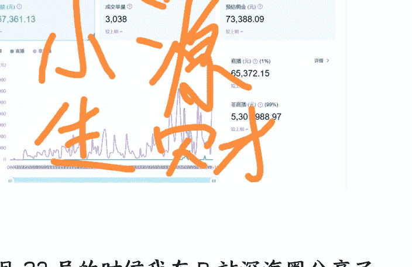
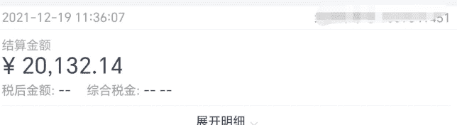
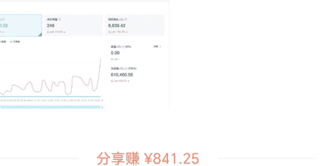
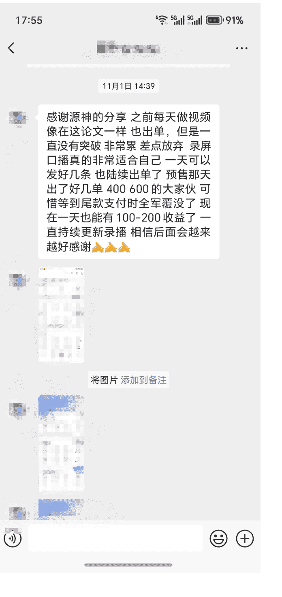

# 80 天进入百万 UP 榜单：执行力拉满能破你的所有焦虑，干就完了！

2025 年 11 月 18 日 生财精华

公众号懒人搜索，懒人专属群独享

懒人微信：lazyhelper

## 前言

大家好，我是小源。

一名 32 岁大龄单身男青年

每天都面临家里“什么时候结婚？”无休止的催婚压力

新型事业单位全员无编制，三年收入不增不减，看不到成长空间

同时也是

刚加入生财不到半年的一年级新生：6 月 6 号进入生财有术，6.12 看到亦仁的 B 站悬赏带货超级标，6.15 号开始行动，截止 11 月 11 号正好 5 个月 150 天，GMV 超 500 万，单佣金预估收入超 7 万。

目前正在 all in B 站悬赏带货项目，上榜 B 站带货百万 UP 榜单，取得了一些还算不错的成绩，也帮助一些圈友赚到了一点小钱。

10 月 23 号的时候我在 B 站深海圈分享了自己的玩法，基本上从理论到实际操作完整演示了一遍，甚至连我正在做的账号和带货比较好的品类也公布了出来，帮助到一些圈友赚到了一点钱。

对于很多刚进入生财的新手来说，赚到第一笔钱是最踏实、最能解决我们焦虑的方式。我在 B 站悬赏带货上摸索出了一个很好的模式，在深海圈分享后取得了很好的反馈，后面我也会写完整的复盘帖。

你们可以先参考我之前的帖子，一共两篇，全是精华帖：

后来我在我们小组群内是这么说的：

我太明白来时的路了，不知道做什么好，不知道怎么做才能赚钱，我之所以那么分享就是想帮到那些曾经的我。

进入生财 5 个多月以来收获了太多太多，思维上的，认知上的，项目上的等等，也结识到了很多优秀的圈友。借助这次机会，我将从以下方面把我的心路历程完整的给大家分享出来，希望能够对你有所帮助。

- 1. 赚不到钱，看不到未来的工作日常
- 2. 懵懂懂的副业经历
- 3. 结缘生财有术
- 4. 抓住 B 站好物超级标
- 5. 一些感悟

## 一、赚不到钱，看不到未来的工作日常

我在山东济南的一家新型事业单位，全员无编制，但胜在稳定：税前 8.5k，7 小时工作制，节假日严格执行，加班有加班费。

猛地一看，除了没有编制以外，在山东就是家长眼中完美的工作，但是我不太满意。

17 年在青岛毕业后先后在东营、青岛、北京、济南奔波，赚多花多，赚少花少。因为每次工作时间不长，所以毕业 8 年依然是普通职员，可以说是很失败了。

转眼就 32 岁了。这个年纪，连个能牵手的人都没有。一直单身，一直没房。最近参加了几次朋友的乔迁新禧之后真的想要一个自己的家。我曾经一天一个人跑了四个楼盘，中介的嘴皮子都快磨破了，我只是机械地跟着走。当我又一次站在一个采光极好的阳台上时，我太想要一个这样的地方了，但一想到那个首付，又冷静下来。

再加上我那老破的车，单纯作为通勤工具的它也是鞠躬尽瘁了，每次经过汽车店，想象着我尊界 S800 出去兜风的场景，就开心得不行。但转头又开着旧车回家了。

房子、伴侣、车子……每一样都在推着我，不，是压着我。我想赚钱，但在这个单位，我赚不到钱。三年收入不增不减，学不到新东西，因为是研究型单位，以我普通本科学历没有任何发展前景。现在就躺平养老？父母都还没敢停下来，我怎么敢？如果再努力一点，他们也才能轻松些啊。

我没有山东固有的考公考编执念，我只想赚钱，我需要赚钱，我一定要赚钱。

## 二、懵懵懂懂的副业经历

**知乎好物带货**

2020 年 5 月份的某一天上班摸鱼时刷到了副业赚钱的信息，突然之间来了兴趣，因为工作比较轻松想找点事干，然后就不断的刷这方面文章和问答，最后把我感兴趣的写在纸上，详细分析不断做减法，最终确定了知乎带货。

同年 6 月准备账号，用了两个月达到了带货要求开通了带货功能。同年 8 月 3 号发布了我的第一篇带货回答，后面有空了就更新一下，等到 9 月份的时候一看结算收入，2000！当时都有点不敢相信，我就写点回答和文章就能赚到这么多钱了？要知道当时我的工资是 4500，到手才 3900。

我立马喊我朋友出去撸串喝酒了，那一顿饭吃的无比开心。

后面也是上班有空了写写回答和文章，下班就打游戏，9 月份因为平台有活动所以在 10 月份结算的时候近 6000，我直接买了一台华为 Mate40 Pro，嘎嘎高兴。

后面就一直这个节奏，上班摸鱼的时候就写写回答和文章，每个月两三千的收入，今天吃羊肉，明天吃牛肉，简直不要太爽。

21 年下半年写的一篇文章在双 11 的时候火了，一下子收入跃迁，连带着佣金和奖金一共有 4W，那时候一下子给我干懵了，第一次感受到流量的魅力。

后来这篇文章在 22 年双 11 又爆了，前段时间我计算了一下，这一篇文章带来的 GMV 有 990W+，离千万一步之遥。但也就仅此一篇，应该是运气好被平台推流了。

通过这个副业我一共获得了 10W+ 的收入，纯粹是抓住了平台的红利。20 年 -22 年做知乎好物带货的基本都赚到了钱。

**抖音中医书单**

21 年 9 月份的时候，我加入了张集慧的抖音书单社群，主要做抖音中医书单方向，通过混剪视频带中医书籍，遭受到了巨大挫折，起号是成功了，但是带货视频不行，赚不到钱。

和我同期进进去的好多都取得了成功，看到他们晒出的成绩让我焦虑的不行，后来实在没办法了就在群里找到一个聊得挺好的朋友合作，她来操作运营，五五分成，通过这个模式我挣了大概 2W。

就是这么神奇，我做视频发不行，她做视频发就可以？这说明了我根本没有找到这个项目的操作点，但怎么提升，也确实不知道怎么办。

**小红书虚拟店铺**

今年 5 月了解了一下市面上的副业项目，最终选择了小红书虚拟店铺，采用的是简单的搬运模式，头 3 天出了 4 单，感觉还行，后面想继续研究的时候出现了 B 站好物悬赏带货，小红书虚拟店铺就放弃了。

以上是我进入生财之前的副业经历，虽然断断续续也赚到了几万，但现在让我复盘，我只能得出一个结论：全都是懵懵懂懂，没有系统的思维认知，我其实并没有真的掌握赚钱的能力，我只是撞上了平台红利。

知乎带货，是赶上内容带货的窗口期；

抖音中医书单，是用合作弥补了我不懂底层逻辑的短板；

小红书虚拟店铺，是三天出单、三天放弃。

很多人会在这里得出一个结论：

> “那到底怎么办啊！下一个方向在哪里？算了，我可能不适合搞副业。”

我不想停在这里，同时这也是我进入生财之前的全部底色：没有系统、没有方法、没有稳定输出。焦虑：下一个机会在哪里？

## 三、结缘生财有术

从知道，到加入，我用了 5 年时间

我必须要说，加入生财有术是我近几年做的最对的一次决定，这 3000 块钱花的超值！！！

20 年我做知乎的时候就听说了生财有术，当时的信息获知是生财是教人赚钱的付费社群，在知乎上搜索了一下关键词后看到评价是褒贬不一，再加上当时做副业纯粹是太无聊了并没有想挣大钱的想法，所以一直没有加入。

今年开始有了想赚钱的想法，酝酿了一段时间后在 5 月份开始有了正式行动，选择了小红书虚拟店铺开始尝试，没事的时候也会点开生财有术的公众号看一下，正好赶上了一次直播，就是 5 月 30 号主题为 AI Agent 的实战与思考，对话的是 Flowith CMO 拐子，虽然我不懂 AI，更不知道什么是 Agent，但我从这次直播课中感觉到了生财有术的不一般。

于是我在直播间花了 6 块钱买了生财有术的 3 天体验营 (第 108 期),6 月 3 号开营，为期三天，两节大直播课，再配合作业和答疑。

正是这次训练营，这两节直播课彻底改变了我，重塑了我的赚钱认知和思维模式，真的是醍醐灌顶般的感觉，再一次感谢纪钟老师。我也拿到了那期训练营的小组 MVP，并且在 6.6 号正式加入了生财有术。

### 生财有术，普通人赚钱的百科全书

由于我在训练营就使用了 3 天体验卡，并且纪钟老师也给讲明了生财有术应该怎么使用，所以我在进入生财以后就遵循了在直播时学到的方式：照方抓药和随机熏眼。

我当时正在摸索小红书虚拟商铺，所以重点看这方面的信息，这是照方抓药。另外对近几个月的风向标、精华帖、官方专栏、航海实战等“没有目的”的看，这是随机熏眼。

这样一方面对正在摸索的项目有了很大帮助，另一方面对个人的商业认知和思维也有巨大提升。原来这样可以赚钱，那样也可以赚钱；原来我在抖音刷到的这些东西别人是用来赚钱的；原来这样做才是好的方法逻辑... ...

我沉浸在了巨大的赚钱知识海洋里，感觉每天都有新收获，那种感觉十分玄妙。在逛了两三天之后，我盯上了亦仁的超级标，因为这是超级机会，我反复看了好几遍这 6 条超级标，感觉我都无从下手，全都和 AI 相关，对于对 AI 一无所知的我来说无异于天堑，最终我决定还是先从小红书虚拟店铺开始，慢慢学习 AI，之后再转向超级标。

但有时候就是这么神奇，让我觉得幸运的事情发生了。6 月 12 号，亦仁发布了第 7 条超级标：B 站好物。我在认真看完之后又反复看了好几遍，因为之前知乎好物带货的经历，我知道，属于我的超级标来了。

现在只需要一个字：干！

## 四、抓住 B 站好物超级标

### 何以生财？唯有实战！机会来了，那就干！

在看完 6.12 那条 B 站好物的超级标后，我是感到无比的激动，我意识到这应该就是属于我的超级标，这可能是我目前最好的机会。

> 小源：20 年还没有进生财，在知乎自然流刷到的知乎好物可以赚钱，立马进入第一个月就挣 2000，如果 B 站带货能复现这真是一个大机会。

人一生中能有几次机会，知乎那个现象级的超级机会被我浪费了，抖音中医书单我也没有抓住，现在我丰富了赚钱思维和逻辑认知，如果再不能把握，这辈子我可能将一事无成。

无数个夜晚，我都在为浪费了这些机遇懊悔。我时常在想，如果我能够重来，我一定要赢下所有。如今机会就在眼前，我必须考虑这会不会是我人生仅有的机会。

所以我放下了小红书虚拟店铺项目，全力研究 B 站好物项目。与此同时，13 号看见了一篇 B 站好物带货基础讲解，这篇帖子来的恰到好处，也给了我很大帮助。13 号和 14 号那两天我在工作之余就是看 B 站好物超级标和 B 站好物带货基础讲解这两篇帖子。

通过亦仁的信息提供和判断，我知道这是个好机会，而且很适合我。通过生财内的 B 站带货基础讲解帖我快速理清了带货步骤和信息重点。剩下的就只有行动了。

6 月 15 号，我做好了一切准备，开始执行 B 站好物带货项目，当天晚上就发布了第一个视频，因为当时还无法开通挂链功能，还是在第二天补上的链接，这并不重要，重要的是我已经起航了。

那时候，B 站好物超级标评论区消息最多的就是等航海，很多人都知道这是个好项目，但没有立马行动的决心和勇气。我知道在充分调研和理解后，早一天行动便早一天接近成功。

机会来了，那就干！

### 心有鸿鹄之志，却遇当头一棒

6 月 15 日正式开干的时候，我给自己定了一个不算夸张的目标：6 月底前赚到 5000。

理由也很简单：我做过知乎好物，也做过抖音书单，换个平台、换形式，本质还是带货内容，我以为这一次不过只是形式由文字变成了视频，再加上思维认知和赚钱欲望也不可同日而语。

说白了，我当时是真觉得自己不算新手了，自信认为：

> “赚个 5000 应该不难吧。”

但现实没有给我留任何面子。

整个 6 月，GMV 只有 9W，佣金 700 多；更扎心的是 15 号—24 号中间，我整整十天只有 2 单成交。可以说上来就给我一棒子打懵了。

仔细分析了一下之后，发现做项目并没有我想的那么简单：

- 虽然有过知乎好物经验，也有过抖音书单混剪视频经验，但是刚上手剪一条符合 B 站的带货视频没那么容易
- 亲自干了才知道从所想到所剪出来的视频再到能不能有点击量、成交量是个很复杂的问题
- 太专注于高佣商品，想一口气吃个大的，忽略了高流量品类的优势
- 618 刚结束，带货正处于低谷期

现在回想一下，当初是带着一腔热血，在只有一条超级标线索、百万 UP 榜单和一篇 B 站带货基础的情况下开始行动，又恰逢 618 刚结束，却定下了一个很高的目标，有点“初生牛犊不怕虎”的意思了。

### 及时调整，不断摸索

6 月份刚起步的那半个月因为没有太好的反馈导致产生了巨大的焦虑和自我怀疑。我是不是高估了自己？我到底能不能干成？是不是又要半途而废？

那段时间我饭吃不香、觉也睡不踏实，手机一响我心里一紧，幻想是订单，又怕根本不是，像是被绑在一条看不清终点的赛道上，但我还想跑一跑。

这样可不行，别项目没搞成人再抑郁了。于是约了朋友出去吃烧烤喝点啤酒，再去 KTV 唱唱歌，把情绪释放出来，那阵子我的状态让我朋友都怀疑我是不是进入传销组织了。

自我调整完毕，开始分析接下来应该怎么办。我重新打开了当月的百万 UP 榜，这一次不是随便看，而是带着问题看：

- 为什么他们能跑，我不能？
- 他们的视频结构、开头钩子、商品逻辑有什么共性？
- 我到底是在“剪视频”，还是在“赌流量”？

我开始更加细致的分析百万 UP 榜单，把目标重点对准了低粉高 GMV 账号，我把他们全部记录到表格里，详细拆分，最终总结出来了 8 大视频类型，这个在我第一篇精华帖里有详细说明。

分析后，于是我决定做两件事：

#### ① 转变视频重点

刚好那段时间，小米 Redmi K80 至尊版预热、联想斗战者战 7000 放货、充电宝新规发布，我判断：

这些热点既有搜索量，也有讨论度，更适合做“需求明确的带货内容”。

#### ② 内容形态迭代

我注意到多个高榜成绩的 UP 主都开始用真人配音，相比纯文字转语音，情感更真实、停不住的那种说服力更强。

于是我也开始从 AI 配音，改成真人配音的表达方式。

在作出改变之后，正反馈来的特别快，6.25-6.30 这 6 天出了 146 单，虽然有很多是 1 分钱的无效单，但无论是播放量、点击量、出单量都有了大幅提升。

苦尽甘来，我终于取得了一点小结果。我原本以为自己是带着经验来的，结果发现我带着的是幻觉。焦虑太正常了，但是我们总要解决不是？那就是执行力。干！

所以下面要做的就是继续打磨继续优化，把成绩放大。

### 找准方法，坚持执行

数据出现跃升后，我做了一个决定：不再到处找风口，而是把跑通的模式做到极致。

我开始总结经验，同时继续参考百万 UP 榜单账号。终于，我发现了一条切实可行，靠努力就能稳定赚钱的模式，我将它称之为“录屏口播流”，深海圈的圈友称之为“源神流”，这个称呼让我诚惶诚恐，但也说明了这个模式的可行之处。

整个流程很简单，用手机自带的录屏功能，将商品在京东、淘宝上的详情、官博等信息再结合价格用口播的方式展示出来。不光解决了为什么买这个，又说明了为什么现在买这个。

多研究，多对标，多思考真的有用。这中间有一件事对我造成了巨大的冲击，我正在在忙碌的抢时间赶制视频，整个人手忙脚乱，还担心视频质量不行，但当我发完视频看到对标账号的视频后，差点没气吐血。

他的视频极其粗糙，坐在路边吃烧烤，翘着二郎腿，桌面各种食物残渣，路边还有行人车辆通过，吆喝声，汽车鸣笛声等不绝于耳。当时我就震惊了，这也行？？？

这直接打开了我的任督二脉，就像当年马云说出那句我不喜欢钱撒贝宁放飞自我一样，我不再纠结于视频质量的好坏，视频数量和热点的时效性同样是质量的一部分，还有一个重要的，这反而增加了活人感，信任度大幅增加。

这个方式我已经在 B 站深海圈作了完整的分享，帮助一些圈友赚到了一点钱，也打造出了包括我在内的 3 位百万 UP 榜上榜成员，后面我也会完整的复盘出来写一篇复盘贴。这个方式让我从 0-80 天进入 B 站百万 UP 榜，让另一位圈友从 0-60 天杀入榜单，我相信可以帮你赚到一点钱。

保持视频数量比提升视频质量还要难，谁能保证自己每日风雨无阻？但是，我做到了。

焦虑？那就干！日更？不，我直接一天 N 更。执行力拉满去破除所有焦虑。从 6 月 15 日开始，到 11 月 11 日结束，一共 150 天的时间我发了 415 个视频。

中间因为感冒咳到不能连贯说话，录一条 2 分钟的视频，我中间停了十几次，断断续续录了半小时；有天工作突发加班到 23:00，我在吃饭时掐着间隙录、在回家路上剪，不想让日更断掉。

日更一条是我给自己立的 Flag，在项目蛮荒时代，大力能挣钱那就选择将大力进行到底。

### 喜人成绩，再接再厉

从 8 月份开始，每月 1 号的生财庆功日我都会分享上个月取得的结果，既是鼓励自己，希望自己再接再厉继续攀登新高，也是想告诉那些还在观望的圈友，想 100 遍不如自己下场剪一条视频，行动起来吧。

7 月份收益 6k+，8 月份收益 1.8W，9 月份收益 1.2W，10 月份收益 4W。双 11 周期用 33 天的时间获得 5W 的收益。

小源

2025/8/1 11:55 山东

7 月 B 站好物悬赏带货总收益约 6k，希望 8 月份能同时完成月入过万和 GMV 破百万的成就。

新一期带货百万 UP 榜出炉，惨烈的一个月，总人数只有 80 人，破千万的只有 5 个。

又可以开启新一轮对标总结，逐步专业化应该是能穿越周期和取得更高收益的有效路径。

8 月加油，备战双十一！#生财好事#

分享赚¥841.25

## 详情

B 站好物悬赏带货，8 月份佣金 1.8W（税前），用自己的方式跑通了这条超级标。

已经有不少圈友发现了我的账号，也有不少开始对标我，浅度或者深度模仿。我 B 站账号不会拉黑任何人，直接模仿即可，只要能出结果就是好的。

接下来继续总结，开始实行下一步发展计划。也在这里制定下一个目标，双十一活动佣金搞到 10W，接到第一个商单。#生财好事#

小源
2025/10/1 13:02 山东

## B 站好物悬赏带货大有可为

9 月份带货预估佣金为 1.2w，相比 8 月份 GMV 和佣金都有所降低，刚上的 B 站百万 UP 榜也掉下来了，总体差强人意。

但我实现了从 0 起步不到 80 天杀入 B 站带货百万 UP 榜，618 和双十一之间的 8 月和 9 月佣金也都过万，成绩总体比较满意。

方法论在我的两个精华帖里面都详细的说了，拼的就是执行力。我在进入生财之前在纪钟老师那里学到的是：信息差 + 执行差 + 认知差=可能成功。

生财帮我解决了信息差和执行差，我自己能做的就是尽可能的拉满执行力。

6.12 号亦仁发布 B 站悬赏带货超级标，6.15 号我就做好一切准备开始行动，到今天为止我平均每天发布将近 2.5 个视频，从未有一天落下过、哪怕中间感冒咳嗽的厉害、哪怕 B 站悬赏带货，太多可能性，这个超级标太强了。

刚过去的 10 月份，我的全部数据创造新高，关键的 GMV、佣金、平台奖励全都有突破，核心收益佣金 + 平台奖励加一块突破 4w（图一和图二），纯自然流，收益即利润。

更让我开心的事，我摸索出来了一条极为有效的赚钱模式，我联合两位圈友共同测试，结果就是造就了 3 位 B 站百万 UP 榜单成员。我自己测试了两个小号，两种路线，都初步取得了成果（图三和图四）。

我在 B 站深海圈分享了这个模式之后，圈友们执行力也是拉满，不少圈友都获得了很好的效果。

接下来，我会写一个详细的复盘贴，希望能帮助到更多的圈友（实际上这个帖子已经欠七天一个月了），我也会把我的心路历程写出来 希望能帮助到大家 同时完成三七的

评论千万条，文明第一条

## 《双 11 收关，奋战 33 天，自然流，收益 5 万》

今年双十一从 10.9 号开始，11.11 号结束，经过 33 天的努力，获得了还算可以的结果，总收入超 5W，抛开到尝试投流的 1700，净利润接近 5W，如果后面淘宝联盟结算率符合条件还会有一千多的奖金，这样纯收益也超过了 5W。

10.1 号我定下的目标是双 11 周期 GMV 达到千万，收益超过 10 万，很明显没有达成目标。但这个会是我年货节、明年 618、双 11 继续的目标。

最大的收获，还是验证了我摸索出来的录屏口播流方法，纯自然流，收入即利润 (除掉每个月几十块钱的剪映 SVIP 会员)。也帮助很多圈友赚到了一点钱，甚至加上我一块打造出来了 3 位...

> 与此同时更让我感到高兴的是我的模式帮助很多圈友赚到了一点钱，看到他们给我的报喜，高兴之情无法用言语来形容，那是一种高阶的心理满足感。

源神，我来应验了

小源：9 号会创纪录的

我剪了两天视频都没时间录屏叭叭

还是创纪录

11 月 9 日 23:21

恭喜恭喜

谢谢源神

在我心力不足的时候鼓励我猛猛冲

通过 B 站就是 10%

我也没有定向

11 月 7 日 17:02

好嘞，那真是太好了

昨天 10:40

源神源神，来感谢一下你。我从 23 号你分享之后，开始做录屏视频，目前一共发了 47 个视频。算上淘宝和京东，总收入大概有 1500+。没有群里一些其他大佬厉害，不过也挺好了。录屏流，对于普通人来说，真的很合适。

恭喜恭喜

继续加油，大的收益还在后面

一路走来，不容易啊。从结果上来看是很好的，既让自己赚到了钱，又帮助到了别人。接下来要再接再厉，作出更大的突破。

我在 10 月 6 号拉了两个有潜力的圈友奋战双 11，共享信息流把蛋糕做大，双 11 周期我们三个 GMV 达到了 1000W，他们两个也成功登上 B 站带货百万 UP 榜。在这中间又补充了 4 位圈友，7 人双 11 周期 GMV 一共是 2800W，这个成绩不可谓不好。

## 五、一些感悟：日拱一卒，干就完了！

副业，5 年来我干了四五个项目，或多或少都有成绩，但从来没有这一次来的那么大，那么稳，归根结底我的赚钱思维和认知有了根本的转变，这也是我加入生财有术取得的最大进步。

生财有术将我们普通人赚钱起步的差距分为 4 个方面：信息差、认知差、执行差、资源差。

信息差和认知差生财有术已经帮我们解决了，中标的风向标是机会，超级标是超级机会，精华帖是项目各种方法论和实操展示，我们也到不了拼资源差的时候，所以圈友之间拉开差距最大的就是执行差。

生财有两句话，一句是：何以生财？唯有实战！一句是把手弄脏。这都是一个意思，那就是要下场干，选中一个适合自己的项目，在做好调研和准备之后，坚决去执行它。日拱一卒，碰到问题想办法去解决它，在执行中学习，在学习中执行。

你可能不会像我一样在选中的第一项目中就干出成绩，但当你完整跑通后你会获得很大的收获，这都是你走向成功的积累。等到适合你的项目到来时，那将会是山呼海啸般的力量。

我在超级标发布后第三天就开始执行了，同期有很多圈友还在等待航海。我在开始初期遭到当头一棒的时候并没有放弃，包括后面摸索出来的“录屏口播流”模式，都是在实际操作中摸索出来了，真正的干中学。

我能成功，你也可以。何以生财？唯有实战！把手弄脏，干就完了！

最后，安利小懒的付费群：

懒人专属群（介绍）

📚 懒人专属群持续更新中，已持续运营 6 年，整理超 3000 份各类精选付费文章 & 年费社群干货，全部开放下载。

本资料为付费群内部分享，仅供真实有需要的朋友查阅 🤫

## 懒人专属群更新记录:

https://hk57gvix7u.feishu.cn/docx/H0kRdZbSboIBR0xkaXtcuVE0nTg

## 备用更新记录:

https://lazybook.fun/blog/record2