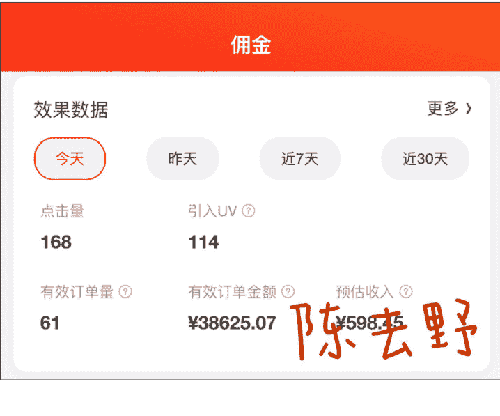
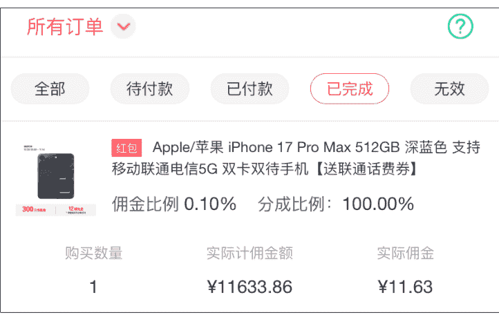
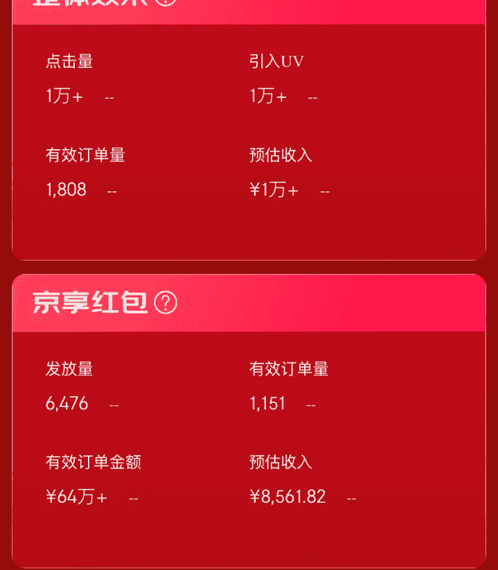
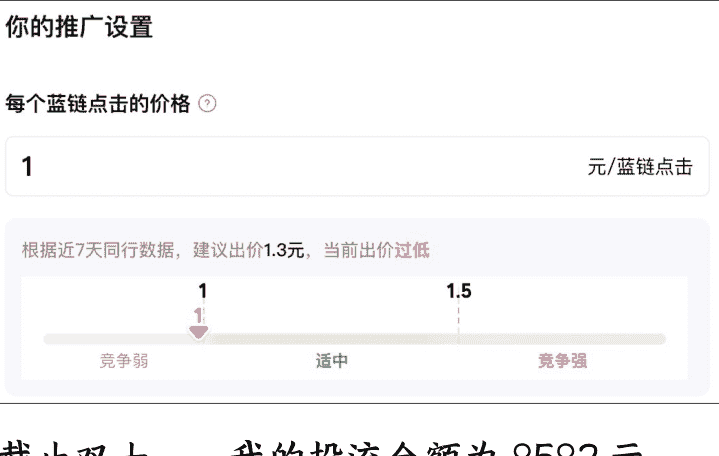
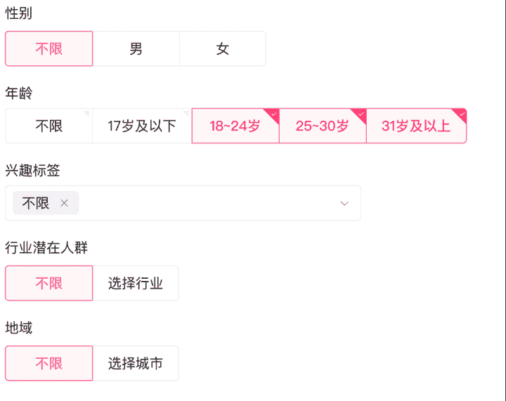
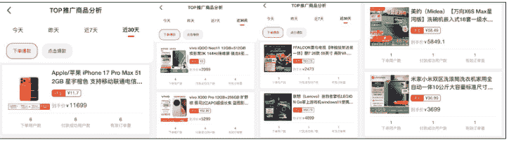
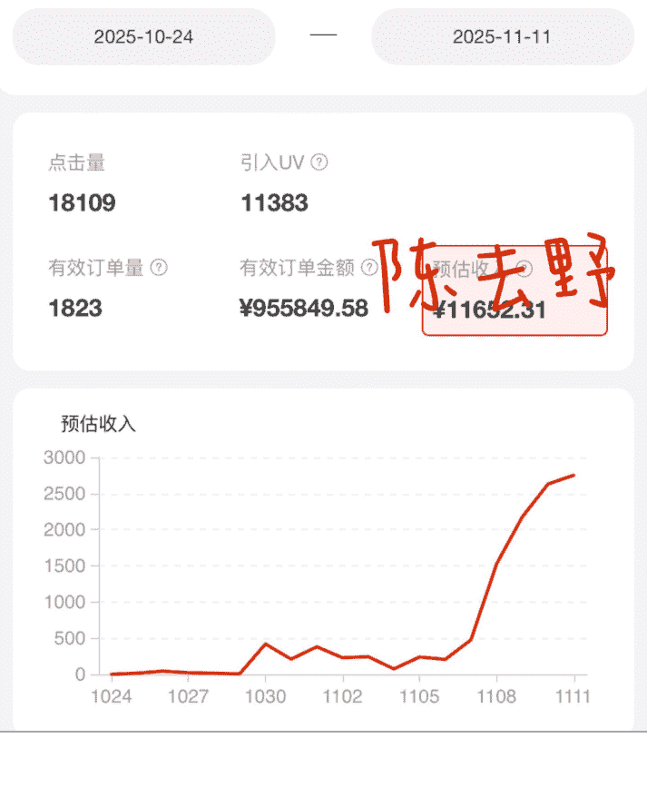

## B 站投流:只用 1 元撬动蓝链点击，日入突破四位数

20251118 生财精华

公众号懒人搜索，懒人专属群独享

懒人微信:lazyhelper

之前看了 B 站好物的文章，迟迟没有行动。一方面看到复杂的横评视频就觉得要花费大量时间，还不一定能有流量。一方面自己做乙方太久，不太想做对接甲方的项目，所以接广告也不在我的考虑之内。所以就把这个项目搁置了。直到群内源神分享了他的口播流方法，我第二天就刷粉开通 B 站带货权限正式开始做 B 站。

源神在直播里讲，做完 50 个视频就可以加他微信，我也以这个为目标给自己制定计划，本来想在双十一结束能达到就很好了，没想到正反馈来的太快，导致我视频越做越顺，提前很多天就达成 50 条视频这个数量。

当时也在生财发过生财好事，在这个阶段，我单日最高收入，是 598.45 元。

这也让我看到了很多希望，想在这个双十一再多赚点。

11 月 2 号，群内紧急加课，星空老师分享了他投流的方法。我认认真真从头听到尾，直播结束后就开始行动。

## 一、计算成本

投流是让人点击蓝链，打开红包，锁住人头，当他们在这个周期内在平台消费后，他们购买的金额就会转化为我们的佣金。（京粉、淘宝联盟的双十一红包玩法规则）

我做的内容是手机数码类，这个类目的佣金很低，销量多的 iPhone 手机的佣金，才不到 12 块钱。

所以我在计算的时候，最低值，就取了最低佣金比例 0.1%。最高值，就选在我单日收入最高的时候，那天也是京东的一个消费节点，购买东西的人很多。

计算方法为：预估收入÷引入 UV。

最理想的状态是 一个人能带来 5 元的佣金。

再算一个平均值：近 30 天内的预估收入÷引入 UV。

平均 一个人能带来 2.5 元佣金。

(以上是我开始投流前的计算方式，这个计算方式还是不太准确，更准确一些的应该是实时数据大屏里面的红包发放量)

也就是 预估收入 ÷ 红包发放量 计算起来会更精确一些。

但我开始投流前，只掌握了这些信息。所以我把点击蓝链的成本定为 1 元，而且我也没想冒险，所以把投流总金额定为 1 万元。

截至双十一，我的投流金额为 8582 元。

(图为结束投流当天截取的，因为没停止计划，B 站又偷偷跑了好几百)

在 11 月 9 号双十一平台活动的第一天，收回成本。

## 二、B 站投流机制

更详细的可以看 B 站官方介绍，以下仅简单讲述。

B 站的投流类型有 2 种，一种是【必火推广】，一种是【放心投】。

我第一次投流是【必火推广】300 元，蓝链点击成本高达 23.4 元，没消耗完就因为成本太高而终止。

投【必火推广】，是开通【放心投】的必经之路，在填写完申请表后，第二天开通【放心投】。

【放心投】可以自己设定价格进行投放。机制是只要你设定了价格，跑出的成本过高它会进行赔付。一听就让人很放心。

所以我为了保本，在投流时只做【放心投】。我在计算好我自己的成本后，将 1 次蓝链点击的价格定在了 1 元。

## 三、投流过程

在刚开始的几天里，它几乎没有消耗，但在 7 号的中午，突然一下子，投流的钱全部消耗完。

然后我开始追加金额，同时按照视频的结构紧急加更，在不到 1 天内，就消耗掉 7000+。

投流烧钱的速度太可怕了，而且在这个时候，平台的大促活动还没开始，很难看出效果，这个时候是我最慌的时候，而且我投入的钱此时已经超过我给自己定的预估投流额度，所以我立即停止，没有再追加金额。

> 圈友：我不会失败，因为我要么成功，要么学到东西。

### 1、单素材/多素材

| 推广状态 | 消耗金额 | 播放量 | 净增粉丝 | 点赞 | 蓝链点击量 | 备注 |
| :--- | :--- | :--- | :--- | :--- | :--- | :--- |
| | 500.00 | 2,259 | 3 | 16 | 484 | 出价 |
| 推广完成 | 500.00 | 1,767 | 0 | 9 | 489 | 出价 |
| 推广完成 | 500.00 | 1,676 | 1 | 8 | 536 | 出价 |

在我投流的时候，同一条素材内容，单素材/多素材我都试过。最好的是多条素材一起投，这样可以更快消耗掉投流金额，而且能看出哪个素材跑的更好。为什么要先组合跑，因为单个视频 500 的金额到了一定阶段就消耗不动了，多素材组合起来可以平衡出价，只要总价在那个已经设定好的数值就行。出价贵的视频弥补了跑到一定金额就跑不到的问题，所以 500 元投放金额可以很快完成，可以看到每条视频的投流数据。

| 基础数据 | 消耗金额 | 播放量 | 净增粉丝 |
| :--- | :--- | :--- | :--- |
| | 130.51 | 256 | 0 |
| | 41.34 | 77 | 0 |
| | 456.70 | 1,395 | 1 |
| | 309.54 | 846 | 0 |

例如：我的蓝链点击定价在 1 元。系统根据算法给我的视频出价为 4 元，也有些出价为 0.8 元，总的平均值还是在 1 元的出价之内。

### 2、单素材

在组合视频出现投流数据之后，把表现好的单素材进行投流。

自定义人群一定要选 18 岁以上的。（有消费能力）

其他设置可以再根据素材进行调整。性别、年龄、兴趣标签、行业、地域、UP 主都可以进行限制。

如果想要视频跑的快，限制就少一些，限制越多越跑不出来。尤其是 UP 主定向投放，基本没效果。

### 3、素材复投

在单素材跑出数据后，或者某一项数据特别突出，马上进行复投。这时所有条件不变，可以多建几条计划，同时跑，系统会自己进行优化。

> 你要推广的稿件
单笔订单若多稿件同时投放，预算将基于投放中表现由系统优先分配到数据反馈较好的稿件上～

而且在这个时候，此条视频流量会很大，正向影响消耗更多更快。

此时也有一个重要条件，那就是同等质量的素材，出价越高跑的越快，出价低的几乎不动。

### 4、粉丝人群

理想的状态是，粉丝领完红包全部消费。但现实情况是就算点击蓝链领了红包，很多人也不会去消费。

如果想要更精准的消费粉丝，就要找一些刚需，例如【手机】【家电】这种大促降价厉害，很多人都会选择在这个时间段购买的品，制作视频进行投放。

我是根据这些人群制作视频进行投流，三天的结果反馈回来我当时的选择也很准确，订单里基本都是手机电脑电视冰箱洗衣机等等。

几乎没有吃的、衣服这种订单。

我的劣势在于我当时在平台上的视频太少也不优质，如果是书野那样的高质量 UP 主，再根据粉丝群体来定制投流视频，结果会更好。

星空老师的内容也是，他已经发布了很多期视频，在内容上更精良，粉丝的信任度也高。

### 5、视频长度/质量

投流消耗与视频长度无关，与视频里呈现的信息密度有关。

例如：别人搞不明白的大促活动信息，你的视频能介绍清楚。(如何购物)

例如：别人的手机买的是正常价，在你的视频里根据操作便宜好几百。(好价)

让人一看就心动，想去试试，想去购物。这样能够投放出去，人群也更精准。

### 6、差异化内容

不是所有的内容，投流都会顺利的。

已知在短时期内，B 站多了大量同类投流内容，同时这些内容的出价也不低，根据系统算法，价高者得，数据佳者得。所以在这个时间，普通素材是没有优势的。

想要跑的动，要不断优化，增加素材竞争力。

平台想要的，永远都是更优质，能推动它发展的内容。

### 7、最关键的

投流，利润是第一目标。

要根据自己的投流情况不断进行投产比的测算，毕竟花出去的都是真的。想要保本就不能有侥幸心理。投流是放大流量的利器。

GMV=流量*客单*转化

客单不变，转化较低的情况下，肯定是流量越大成交概率越大。

我也很努力，高产的时候每天发 9 条视频，但只靠数量是突破不了的。

在知道投流这个方式之后，我立刻对内容做出调整，不断优化，才有了指数级增长。

我的投入少，所以数据还是偏保守，星空老师的数据更让人震撼。

最后，还是圈友那句话。

我不会失败，因为我要么成功，要么学到东西。

先去实践，然后才会有真正属于自己的经验，后面自然就好做了。

这次的实践中，我也是小白，但我下一次，就是一个拥有更多经验的小白。

这次，我做的很粗糙，但是没关系，我拿到了结果。

最后，安利小懒的付费群：

懒人专属群（介绍）

- 📎懒人专属群持续更新中，已持续运营 6 年，整理超 3000 份各类精选付费文章 & 年费社群干货，全部开放下载。

本资料为付费群内分享，仅供真实有需要的朋友查阅🙇