# 借助 AI 编程，全流程打造抖音私信 AI 客服

## 251118 生财精华

公众号懒人搜索，懒人专属群独享

懒人微信:lazyhelper


大家好，我是坤哥

今天我想和大家分享一下我这一周做的一件很有意义的事:借助 AI 全流程打造一个抖音私信自动回复 AI 客服系统。

重点是全程 (脚本实现，时序图绘制等) 我自己没写一行代码! 完全用自然语言提问的方式来让 AI 成功地帮我打造了这样的一套客服系统，并且仅花了不到两天时间。

这套系统其实技术方案蛮复杂的 (文中有相关的架构图), 如果没有 AI 的助力，最保守的估计，需要至少五年以上的 Python 工程师花至少一周以上才能完成。

接下来我会和大家一步步分享一下我的相关经验，大家看完之后，如果遇到需要网页自动化的系统都将游刃有余。

## 一、背景

我们是做微信场景内的 AI 客服，近期团队决定进军小红书，抖音等平台的 AI 客服。

那要进军这些平台的 AI 客服，最重要的是什么，不是 AI，而是平台的私信相关接口（主要是监听新消息和回复的能力）。

要拿到这些接口的权限，必须要有平台的服务商资质，而要拿到服务商资质，要有注册资金，软著等很严苛的要求。

更要命的是，即便你申请下了服务商资质，这些敏感的接口权限像抖音等其实也在收紧，基本不对外开放了。

还有一种办法是找市面上已有的第三方服务商，由于有这些接口的权限，我们可以直接通过他们来间接实现私信的接口。

但问题是


我们找了一家服务商，费用如下:

980/年可以接入三个账号

3000/年 API 接入费用

简单算一笔账：假设我一年要服务 99 个客户，那么一年就要给这家服务商缴纳 980 * 33 + 3000 = 35340 元。

这笔费用对我们来说是完全不能接受的。

正规的手段看起来是走不通了，于是我们不得不另寻他法。

## 二、方案初探

抖音网页版是可以查看新私信，进行私信回复的，稍微懂点技术的朋友应该会想到用 RPA，浏览器自动化方案等。

那如果不懂技术的咋办呢，问 AI 呀，说到这不得不提一下 AI 的选型。

## 一、AI 选型

请务必选国外的 Gemini, Claude, GPT, 不要用国内的豆包，DeepSeek 等大模型。

国外的大模型相对来说确实会贵一些，像 Claude, GPT, Gemini 这些都是 20 刀/月，但它们效果比国内好不少。

你付出的只是几百，但省下的是成吨的精力和时间，不要用战术上的勤奋掩盖战略上的懒惰。

我全程都用的 Gemini 2.5，一是因为效果其实还不错，二是虽然 Claude 目前公认为编程最佳，但官方是有次数限制的，而用 Gemini 可以无限次提问。

## 二、使用 AI 探讨技术方案

现在假设我们不懂技术，需要让 AI 给出一套方案，怎么做呢，很简单，直接把你的困惑发给 AI。


## AI 会给出相应的技术方案:

#### 2.1 网页自动化 (Web Automation)

技术手段：使用 Selenium、Playwright 或 Puppeteer 等浏览器自动化工具，编写脚本来：

- 1. 模拟真人在浏览器中登录您的抖音账号（如您截图所示的网页版）。
- 2. 让脚本定时轮询（例如每 5 秒刷新一次）私信列表的网页元素（DOM）。
- 3. 通过比较前后变化，判断是否有新消息出现。

##### 可以继续追问 Selenium, Playwright 等有啥区别，AI 会给出合理的建议：

| 特性 | Playwright | Selenium |
| :--- | :--- | :--- |
| **推出时间** | 较新 (2020 年，由 Microsoft 推出) | 经典 (2004 年，久经考验) |
| **核心架构** | 事件驱动 (Event-driven)<br>通过 WebSocket 与浏览器通信，速度快，更稳定。 | HTTP JSON Wire 协议<br>通过发送 HTTP 请求给 WebDriver，再由 WebDriver 控制浏览器。 |
| **执行速度** | 非常快。架构本身延迟低，加上强大的并行测试能力。 | 较慢。HTTP 请求/响应的开销相对较大。 |
| **自动等待** | 内置自动等待。<br>Playwright 会自动等待元素变为可操作状态，极大减少了“元素未找到”的 flaky test。 | 需要手动设置。<br>必须显式使用 WebDriverWait(显式等待) 或隐式等待，否则脚本很不稳定。 |
| **功能集成** | “全家桶”。<br>开箱即用：截图、录制视频、API 拦截与 Mock、多标签/多上下文、移动端模拟。 | 核心库 + 生态。<br>只提供核心的浏览器控制。截图等功能需要自己实现，API 拦截等需要借助 Selenium-DevTools 或第三方工具。 |
| **API 拦截** | 非常强大。<br>可以轻松拦截、修改、甚至 Mock(模拟) 任何网络请求 (Request/Response)。这对测试非常有用。 | 有限。<br>在 Selenium 4.0+ 中通过“DevTools Protocol”实现了部分支持，但使用起来比 Playwright 复杂。 |

##### 总结：如何选择？

##### 1. 为什么选择 Playwright? (推荐新项目)

- 追求速度和稳定性：Playwright 的事件驱动架构和自动等待机制，使得测试脚本运行更快、更可靠（减少因时序问题导致的失败）。
- 现代 Web 应用：你的应用是 React, Vue, Angular 等构建的 SPA（单页应用），并且大量使用异步请求。
- 需要高级功能：你需要开箱即用的网络拦截、录屏、多标签页并行测试等功能。
- JS/TS 技术栈：如果你的团队主要使用 JavaScript 或 TypeScript, Playwright Test Runner 会让你感觉非常顺手。

##### 2. 为什么选择 Selenium?

- 需要极端的浏览器兼容性：你的应用必须支持老旧浏览器，比如 Internet Explorer，或者一些特定的、非主流的浏览器。
- 团队语言栈限制：你的团队主要使用 Selenium 支持但 Playwright 不支持的语言（如 Ruby, PHP, Go）。
- 维护现有项目：你有大量基于 Selenium 编写的、运行多年的成熟测试用例，迁移成本过高。
- 生态和社区：Selenium 拥有长达近 20 年的社区积累，你几乎可以找到任何稀奇古怪问题的解决方案。

对于您在上一个问题中提到的场景（自动化抖音），如果仅从技术角度分析：

- Playwright 会是更好的选择。因为它能非常轻松地拦截网络请求（用于监听 WebSocket 消息）和自动等待动态加载的 DOM 元素（如私信列表），这比 Selenium 优雅得多。

可以看到 Gemini 给出了建议，就用 Playwright 来实现，于是接下来我们的技术方案就确定了用 Playwright。

Playwright 支持多种编程语言，如 Python，TS 等，一般用 Python 的居多，所以最终决定使用 Python + Playwright 来实现。

## 三、方案落地

技术方案定好了，接下来怎么让 AI 来实现我们的要求呢。

首先我们需要明白何为浏览器自动化，所谓自动化，肯定是有一套既定的流程，然后我们让脚本来让浏览器按这套既定的流程来执行。

### 一、核心流程剖析

先来想一下我们的目的：抖音私信回复 AI 自动化。

#### 1、需求分解与流程设计

我们先来看一下如果是正常人应该怎么会查看私信，以下是我录的一个查看及回复私信的一个 gif


可以看到流程还比较简洁明了，主要步骤如下:

- 1. 点击顶部的私信图标，打开私信列表。
- 2. 点击小红点，或者当前窗口是否有新的消息进来。
- 3. 如果有则在输入框输入信息，然后点击发送按钮将你要回复的消息发送出去。

我们要做的就是用 Python + Playwright 来将上述流程自动化。

怎么实现?

我们在以上步骤中，提到了「私信图标」，「小红点」，「输入发送框」，「发送」，那就需要定位这些元素来告诉浏览器我要对这些元素进行某些操作。

怎么定位这些元素呢

#### 2、元素定位简介

我们可以双击网页点击 Inspect 来打开 Chrome 的开发者工具（Developer Tools）。


点击下图中的箭头，然后点击我们想要定位的元素，就可以知道页面上的元素对应的具体 CSS Selector 了。

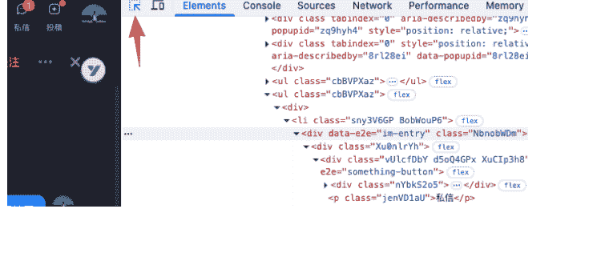

### 这里简单介绍一下什么是 CSS Selector:

想象你在一个大图书馆里:

- 📚 书架 = 网页
- 📖 书 = 网页上的各种元素 (标题、段落、按钮等)
- CSS Selector 就是你告诉管理员"我要找什么书"的方式:

### 例子:

"给我所有红色封面的书" → 选择所有红色的元素 (class 等属性表示)

"给我找本馆最受瞩目的书" → 选择唯一身份的元素 (id 表示)

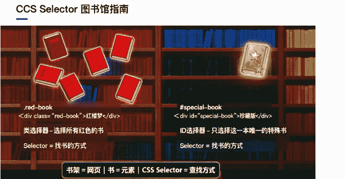

比如我想看私信对应右边哪个具体的 CSS Selector，直接点击私信

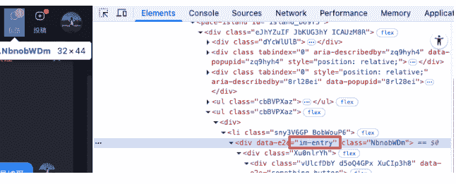

可以看到它对应 im-entry 这个 div，对应具体的选择器我们可以双击这个元素。

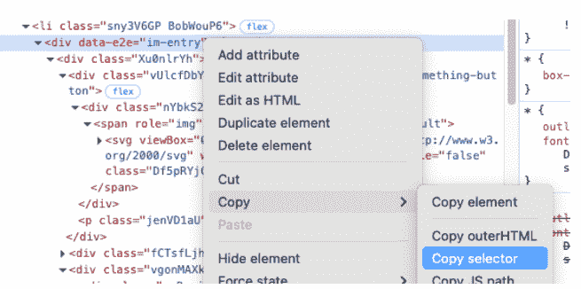

选择 Copy selector，可以看到 selector 如下：#island_b69f5 > div > ul:nth-child(5) > div > li > div

Playwright 就是通过这种形式来定位网页上的具体元素。

你可以通过如上截图或文字的形式来告诉 AI，页面的元素对应的 CSS 选择器特征是啥（比如“私信”在 data-e2e="im-entry" 的 div 中），AI 就会自动地帮你写出通过 CSS 选择器来定位到此元素的相关代码。

同理你可以找到消息来时的红点（class 为 semi-badge 的 span），消息列表的每一个元素 (class 为 conversation-item 的 div)。

#### 3、实现基础监听

找到之后干啥呢，就可以让 AI 基于 Playwright 框架来写出以上步骤了呀。

比如你可以给 AI 下如下指令:


以上 AI 指令中细心的你可能注意到了，我在图中的最顶部上传了两张截图。

我用如下截图的形式来告诉 Gemini 每个元素对应的 div 位置，方便 Gemini 来定位。

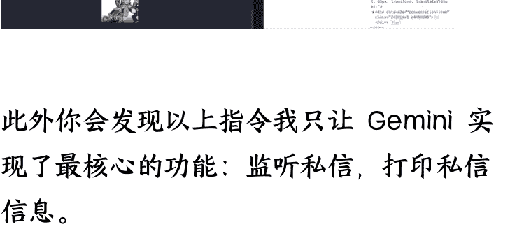

此外你会发现以上指令我只让 Gemini 实现了最核心的功能：监听私信，打印私信信息。

其实，理论上首页需要登录并将鼠标移动到顶部的私信区域才能看到私信，但这部分不属于核心功能，先略过。

做产品我们常说要实现最小 MVP，同样，做项目，我们也要用「核心优先原则」来验证，等实现了最核心的功能，再慢慢补充登录，回复等细节。

此外先实现最核心的功能也能让 AI 发挥得更好，因为上下文更少，AI 能发挥出更大的作用，如果一下全部实现所有的功能，很容易


Gemini 的回复中不光给了你脚本，还告诉了你如何运行此脚本的建议。

如何运行此脚本

- 1. 安装 Playwright (如果你还没有安装):

```
pip install playwright
```

- 2. 安装浏览器驱动 (Playwright 需要):

```
playwright install
```

- 3. 保存代码：将上面的代码保存为一个 Python 文件 (例如 douyin_bot.py)。

- 4. 运行脚本:

```
python douyin_bot.py
```

- 5. 手动登录：脚本运行后，会弹出一个浏览器窗口。请在该窗口中扫码登录你的抖音账号，然后在命令行终端按 Enter 键。

可以按照 Gemini 的建议来按以上步骤试运行一下，当然了，在此期间，你可能会遇到一些环境问题，可以继续与 AI 对话，比如告诉你的系统 (Windows 10,

Mac )，用的 Python3 等让 AI 继续帮把环境搭好。

以上步骤执行成功后，你就可以继续下一步了：区分消息是「我」发的还是对方发的，毕竟只有对方发的消息你才需要回复。

怎么区分，同样的找到「我」发的消息的对应的元素特征:


然后据此来让 AI 帮忙区分是我发的还是对方发的。


##### 执行之后效果如下:

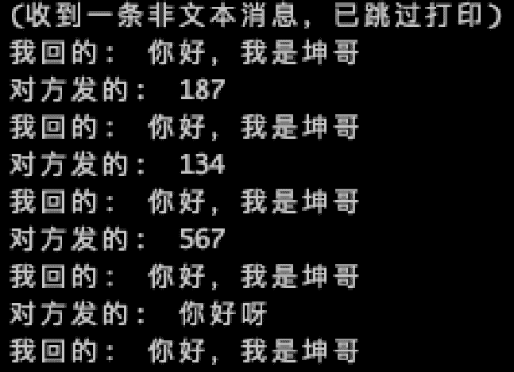

这里其实还有一些细节我略过了，比如要让 AI 知道对话框中，最下面的是最新消息等 (AI 可能会误认为最上面的消息是最新的), 这些都需要你不断地测试再让 AI 去调整的，在此不再赘述。

现在我们已经可以区分是对方还是自己的消息了，也能监听新消息了。

接下来我们就需要给收到的这些新消息发送消息了，这里我们没有必要一下就对接 AI 客服的接口，可以先尝试回一个固定的消息，重要的是先把核心流程跑通，比如我统一回的是「你好，我是坤哥」。

同样的我把网页的输入框，发送按钮对应的结构发给 AI。

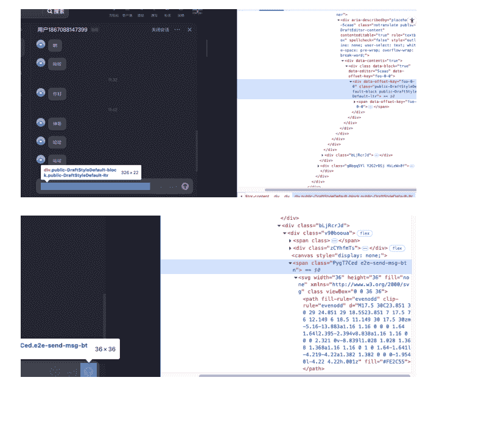

##### 然后再下一个指令告诉 AI:

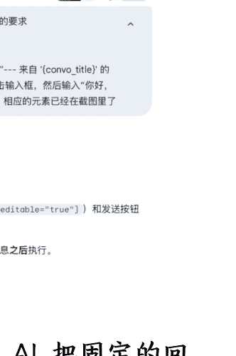

这一步完成之后，可以让 AI 把固定的回复 (「你好，我是坤哥」) 改成对接你的 AI 回复接口，获取接口的回复后再将信息发送出去。

在此我们完成了从监听私信到发送 AI 回复的完整闭环。

接下来我们可以继续补齐之前剩下的步骤，比如登录后我们需要把鼠标移动到

(hover) 到私信上私信列表才会展示出来。

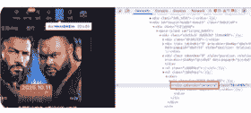

> 导航到精选页面后，下一步可以 hover 到私信 (图示中的 im-entry) 来弹出私信来，再改一下代码

好的，根据你的新截图，使用 data-e2e="im-entry" 属性来定位“私信”入口是一个更稳定、更准确的方法。

到此我们已经完成了登录之后的所有自动化流程，接下来就是我们另一个比较重要的登录环节。

### 二、登录及部署实现

#### 1、登录流程分析

##### 1) 是否登录状态识别

登录是非常重要的操作，毕竟你要登录了才能实现监听，回复私信等后续的一系列操作。

我们首先要识别当前客户是否处于登录状态，怎么识别，打开抖音主页

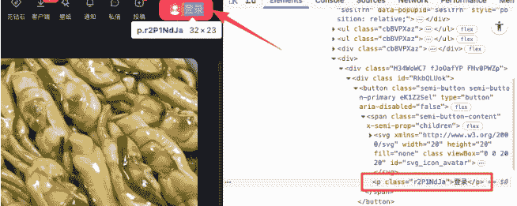

找到顶部的登录按钮，按前文所述的方法可以定位到其对应的 CSS Selector。

我们只需截图告知一下 Gemini，它就能推测出「登录」对应的 CSS Selector 是啥（也可以直接把 CSS Selector 告诉 AI），进而准确定位「登录」按钮。

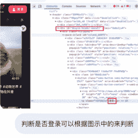

如果用户未登录，就应该点击「登录」，弹出二维码，让客户扫码登录，点击登录显示的弹框如下:


#### 2）二维码弹框提取

通过以上步骤我们顺利地弹出了二维码图片，但要注意的是以上的这些点击登录，弹出二维码 UI 是在 Playwright 启动的浏览器实例中才能看到。

而客户是访问不到 Playwright 的浏览器实例的，那怎么办？怎么让客户来扫码其中的登录二维码进而拿到他们的 Cookie 等信息来做进一步的监听/回复私信呢？

我们可以把 Playwright 启动的浏览器 Chromium 实例弹出的二维码传到我们展示给客户的前端页面。

同样，我们把二维码的相关 CSS Selector 告诉 Gemini，它就能定位到二维码的位置了。

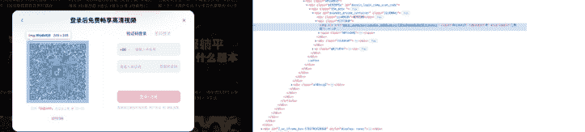

然后就可以对二维码做个快照转成图片，传到前端页面，前端就能拿到二维码图片了，效果如下:

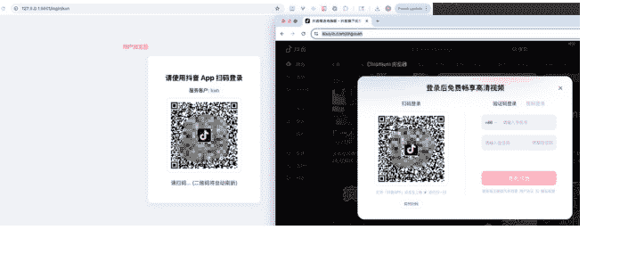

PS: 左边是我们展示给客户的前端页面，右边是 Playwright 启动的 Chromium 实例中显示的登录二维码，右边的二维码会传到左边的页面来让客户登录。

客户在前端页面扫码成功后，Chromium 实例的所在页由于一直会监听扫码状态，如果成功会自动跳到登录状态 (无登录按钮)，再发一下登录成功的消息给我们展示给客户的前端页面，此时由于拿到了客户的登录相关的信息，就可以开始做监听/回复私信的后续操作了。

### 登录的主要流程如下

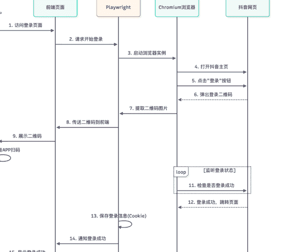

#### 2、商业化部署流程

一旦 AI 帮你写好了脚本，我们还需要考虑另一个问题，怎么部署，因为我们可能服务很多客户，怎么更合理地部署脚本以服务更多更多的客户，以下是我们的连续追问。

> 做得很好！不过还有一个问题，未考虑登录情况 我现在要部署一下，然后你这提供官方的访问入口，让用户登录一下，登录之后你就可以按以上脚本来监听私信的情况了，该怎么写这个部署脚本

> 我的意思是我要把上面自动回复私信的脚本部署到 Linux 上，打开官网后怎么让用户看到页面来扫码呢，是否要提供一个入口来让客户扫码或者输入手机号，验证码

> 但我现在需要服务几十个抖音的客户来帮助他们管理私信，还有其他更好的方式吗

最后 AI 会给你一个非常合理的方案，它拆分成了两个脚本，登录（login_server.py）和私信监控回复（douyin_monitor.py）脚本。

部署这个登录服务：

- 1. 在您的 Linux 服务器上运行 pip install flask playwright && playwright install。
- 2. 创建 sessions 文件夹。
- 3. 运行 python login_server.py。
- 4. 让您的客户 A 访问 http://[您的服务器 IP]:5000/login/customer_A。
- 5. 让您的客户 B 访问 http://[您的服务器 IP]:5000/login/customer_B。
- 6. sessions 文件夹里就会出现 customer_A.json, customer_B.json ...

## 第 2 部分：可扩展的“监控服务”(使用 asyncio)

现在您有了 50 个 customer_X.json 文件。您不需要启动 50 个浏览器实例。

您只需要启动一个浏览器，然后为每个客户创建一个“浏览器上下文”(Browser Context)。使用 asyncio，您可以让这 50 个上下文并发运行，效率极高。

这个新脚本将替换我们之前所有的 douyin_monitor.py。它会加载 sessions 文件夹中的所有 .json 文件，并为每个文件启动一个并发的监控任务。

登录脚本专门用于客户登录，让用户浏览器和 Chromium 浏览器通过 Socket.IO 进行通信，这样可以把 Chromium 的二维码等信息传到用户浏览器让用户来扫码登录，效果如下：(左边是用户请求的地址，右边是后台 Playwright 跑的 Chromium 实例，右边的二维码会通过 socket 通信把二维码传到用户浏览器中来让用户进行扫码登录)。


整体的技术设计图我也让 AI 画了一下，如下图，我们稍微看看就好，这些不重要，重要的是你通过口喷实现了一个自动化解决方案。

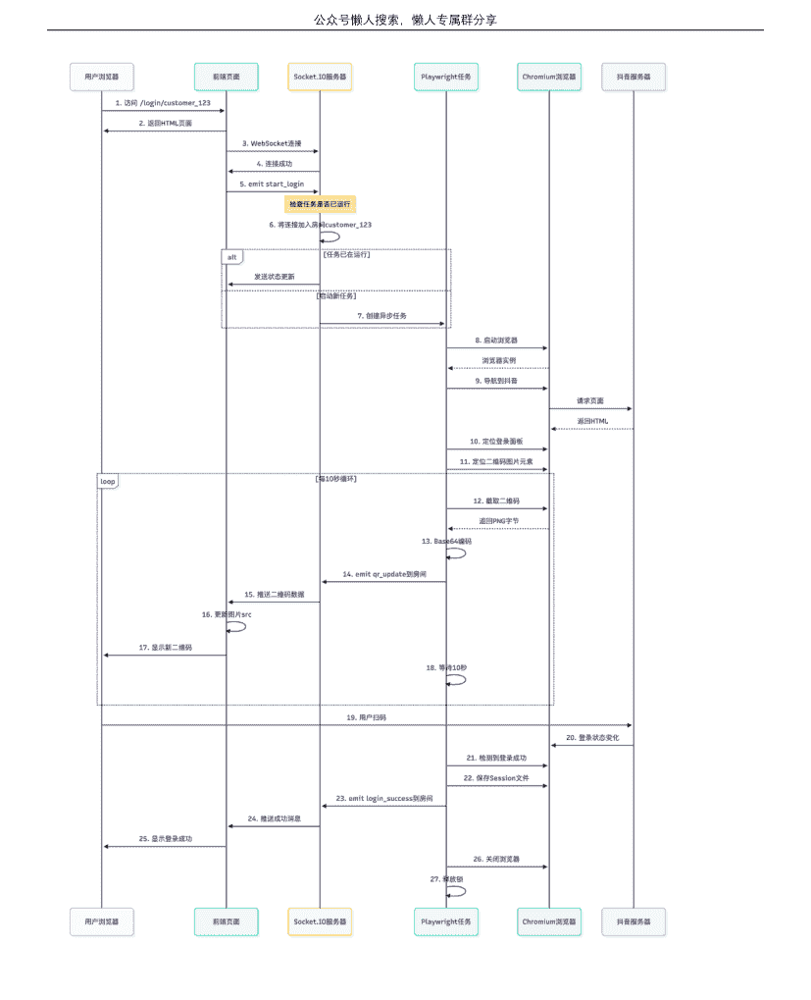

当客户登录后会把相关的 Cookie 等此客户的 context 信息保存下来，监控脚本则会持续监控加载这些 context 信息来持续监听私信以及作出自动回复了。

以上所有流程包括脚本生成，时序图绘制完全是由 AI 生成的，我自己全程没有写过一行代码。

此外你会发现我基本没有截 AI 生成的代码，因为这不重要，代码我压根没怎么看，有些也看不懂。

最重要的是你的思路，以及如何把上下文信息（如元素的定位截图，希望支撑多少客户等）详细地给到 AI。

AI 就会很聪明的根据这些信息给出你想要的解决方案。

## 四、一些坑点和收获

用 AI 来做这套系统虽然确实很快，但中间其实是有一些磕碰的，并没有想象中那么顺利，这里我把一些踩到的坑分享出来。

### 一）不要过分相信 AI

文中说可以用图片的方式来告诉 AI 元素对应的 CSS 属性相关信息，确实 Gemini 由于是多模态的，多数情况都能识别出来。

但注意不要过于依赖图片来让 AI 识别元素，因为实测发现即便你截的图片在你看来很清晰，但 AI 依然有可能误判（比如你截的 class 是 im-entry，但由于 AI 的幻觉或识别原因，它可能给你造出一个根本不存在的 class）。

最好是用「图片 + 文字说明」的形式来让 AI 更明确你表达的意思。

### 二) 考虑多个 AI 一起用

有时候碰到一个问题，如果你连续追问，但可能依然没法解决，不妨换一个 AI 来问一下。

因为此时 AI 可能会被你的上下文影响导致问题一直无法解决，此时另一个 AI 有可能「旁观者清」，一下把你的问题给解决了。

比如我在实测过程中就发现了一些 Flask socketio async mode error 相关的问题，连续问了多轮 Gemini 都无法解决，结果重新梳理了一下问了 Claude 立马就解决了。

### 三) 专业知识依然重要

虽然全程我都用 AI 来写代码，但其实如果你具备一定的技能的话会更容易定位解决问题。

比如在做登录时，有一个二次验证的判断，要判断此元素是否存在，如果不存在则认为登录成功。

结果一开始 AI 针对这个元素用的一个 visible 的属性，结果发现这个元素虽然出现在页面中，但一直被判断为不存在（因为这个元素的父元素 height 为 0，导致 visible 为 false），问了好几轮后来才发现应该用 attached 来判断元素是否存在。

## 五、总结

AI 确实太强了，仅通过自然语言就能打造商业级软件，编程门槛被大大降低。面对这样的变革，许多人尤其是程序员开始焦虑：我们会被取代吗？

我个人的看法是：恐慌大可不必，因为 AI 时代的分水岭不在技术，而在认知。

比如如果我不告诉 AI 这是一个需要服务几百上千商家的抖音私信回复系统，它就设计不出我想要的这种架构。

技术实现可以交给 AI，但业务洞察、问题定义、架构决策——这些只能来自对业务有深刻理解的人。

这揭示了一个残酷的真相：AI 不会淘汰程序员，但会淘汰「只会写代码」的程序员。

它淘汰的是那些满足于接需求、写代码、交任务的初级执行者。而那些能理解业务本质、发现真问题、做关键决策的人，反而因为 AI 而如虎添翼。

哈佛最近关于 AI 对招聘市场影响的调查印证了这一点：初级岗位大幅缩减，高级岗位需求不降反增。

## Rage against the machine


Source: "Generative AI as seniority-biased technological change", by S.M. Hosseini & G. Lichtinger, SSRN working paper, 2025

AI 时代最稀缺的，从来都不是执行能力，而是定义问题的能力。当工具越来越智能，人的价值就越发体现在：你能否问出好问题，能否看到别人看不到的机会，能否做出机器做不了的判断。

所以，与其担心被 AI 取代，不如思考：我是在成为业务专家，还是只想做个熟练工？

## 最后，安利小懒的付费群：

### 懒人专属群 (介绍)


微信:lazyhelper

📖 懒人专属群持续更新中，已持续运营 6 年，整理超 3000 份各类精选付费文章 & 年费社群干货，全部开放下载。

本资料为付费群内部分享，仅供真实有需要的朋友查阅🙇‍♂️

懒人专属群更新记录:

https://hk57gvIx7u.feishu.cn/docx/H0kRdZbSbolBR0xkaXtcuVE0nTg

懒人专属群更新记录 (需梯子，备用):

https://lazybook.fun/blog/record2