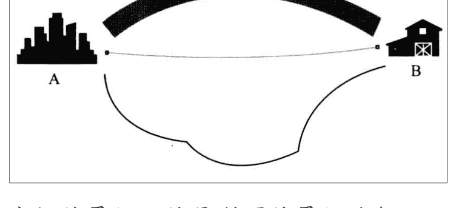

# 创业反思：选择最短路径，是对的吗？

## 251118 生财精华

整理：公众号懒人搜索，懒人专属群独享

懒人微信：lazyhelper

大家好，我是刘小排。

最近有一个创业中的重要反思，是当我在学习吴军老师新书《富足》时候得到的启发，在这里分享给大家。

我们先看这张图——已知，在 A 和 B 两个城市之间有三条路径，你的任务是尽快从 A 走到 B，每条路都是平坦的。请问你选择哪条路？

中间的最短，就是所谓的最短路径；上方的最宽，就是所谓的最大带宽路径；下方的既不短，也不宽。显然，下方的路径我们就可以首先排除。

多数人会选择走中间那条路，我也是。

我作为一个 AI 时代做 AI 产品的独狼，我不仅总是选择中间这条路，而且常常以选择中间这条路为荣：你看，哪些大厂多傻啊，那么多人废那么多时间做那么点东西，跟我两个星期做的差不多。

但是，这个问题的答案是：得看是什么人来选。如果是一个步行的或骑车的，他选择中间一条最短的道路就好了，但如果是一支由 500 辆卡车组成的车队，他们最好选择上面那条大道，因为中间的小路挤不下那么多车。

借用图论中的概念：最短路径和最大带宽，是互不相关的两个维度。

通俗翻译：一个人走得快，一群人走得远。

这类问题我们经常遇到。

例如：

- 如果是我自己买电脑，当然是自己在京东买配件来攒机器，比起买品牌机，同样的钱会买到好得多的性能。我甚至还会嘲笑大公司人傻钱多，只会买更贵的品牌机，还要走各种流程，又贵又慢。但是，大公司只可能买品牌机。

因为：

- 公司要一口气采购一千台，不可能自己一台一台去攒，
- 遇到机器故障时，需要有专业的人提供最好最快的服务，而不是让自己的员工花时间去修。如果自己攒机器，那就是省小钱、亏大钱了。

在前东家工作时，我很惊讶，采购竟然决定花近乎两倍的价格购买某个品牌的服务器。

正义的我，果断选择了伸张正义！我匿名举报采购，说采购涉嫌吃回扣，截图列举了淘宝上类似配置的报价，以及我询问淘宝客服报价的截图。

匿名举报发现没动静，我还改成了实名举报 …… 最后还是没太大动静，我失落了。

嘿嘿，是我太天真了。很久以后我才了解到：我们的软件需要安装到服务器中、连同服务器发给全国各地的客户，而只有这家品牌在全国一千多个县都可以 24 小时内上门排查问题。淘宝上报价只有一半、随时可能跑路的供应商，他能做到吗？他不能！因此，选择这个品牌，是当时我们唯一正确的解法。

在这里，我郑重地向当初被我匿名举报的采购同学，致以诚挚的歉意😊

我悟了：小公司做小事、找最便宜的路；大公司做大事、找最宽的路。

反思我自己公司的一些事情。

### 1. 员工写代码太慢的问题：

最短路径是「滚开，我来」，这样当然又快又好，但是它的带宽太小了——用通俗的话说，我会成为我公司的瓶颈。

正确的做法是选择带宽更大的路，让员工自己写，自己慢慢进步，假以时日，才能有公司整体的进步。

我需要锻炼自己眼睁睁看着员工把事情做砸的心态，和长期培养团队的耐心。

### 2. 算力问题：

我有很多算力是自建机房，而不是用云平台。同样，这是最短路径，因为自建机房，考虑做长期生意，我的成本只有电费网费和房租，便宜很多很多。我长期引以为豪，你们都会套壳，你们不会自建算力机房吧？我比你们有成本优势。

最近反思，这个解决方案仍然带宽太小了——如果业务要求突然扩容 3 倍算力，我无法短时间内扩容，自建机房成为业务的瓶颈；如果机房出问题，我业务会全部停机；如果硬件要升级，我还得去咸鱼处理老旧硬件，再重新采购......

想起了另一件在前东家打工时候的旧事。一个客户，租用的云服务器数量是自己有效使用服务器数量的三倍。

我团队做了"AI 智能省云成本”功能，很得意地去给客户推销，说经过 AI 的详细计算，只需要轻轻一点，就能够降低你 70% 的云服务器成本，我们收费很便宜，只从帮你节省下来的钱里收一点点比例。你看，你用我们的服务，不仅没花钱，还省钱了。你说好不好？

客户断然拒绝了我们，他说：不好！可千万别给我省！我一定要保证服务器有三倍的冗余！

现在自己做企业了，才意识到，这位客户可真是有大智慧、大格局啊！

算力问题，对于高度发展中的企业来说，正确的做法是选择带宽更大的路——尽量使用云服务，虽然贵，但是值。

推论：如果你发现一个企业花在“削减成本”的精力比“增加收入”的精力更多，说明它正在走下坡路。

## 3. 交通问题

在北京约朋友，经常需要从东五环到西北四环再回来，嗯，很多朋友都和我有跨域 18 环的友情。

如果不开车，我更习惯做地铁，不仅因为地铁便宜，还因为在北京跨越 18 环，打车往往比地铁慢。朋友们经常嘲笑我：排总，不至于省这点钱吧。我也不好意思地说：小时候穷惯了，省点钱请你喝奶茶吧。

上周开始，我变了，我的交通只有开车和打专车两种。

因为坐地铁的带宽太小了。什么带宽？我思考的带宽。

在地铁里，有噪音、有人挤人、还得时刻提防坐过站和换乘问题，我很难进行思考和休息。只有在自己开车、打专车的时候，我可以休息、深度思考。要是这一小时我能够思考出什么卡点的解决方案，那我可赚大了，远不是省下来的一两百块钱能比的。

至于为什么是专车而不是快车或者出租车？专车更安静，气味更好闻，留给我的思考带宽，比便宜车更大。

想到这个，还因为最近我看到我一位神秘朋友，她在周末想要去坐船放松时，谦卑地向工作人员提出了唯一的问题：我能不能包一艘船？

她是如此珍惜自己独自休息和思考的时间。我想，这也许是她的成功的一个要素吧。佩服。

最后，引用一段吴军老师新书《富足》中的话作为结尾

> 十多年前有一本书特别火，就是罗伯特·清崎的《富爸爸穷爸爸》。
> 在这本书中，罗伯特·清崎列举了很多“穷人思维”的例子。
> 在穷人思维中，一个大问题是因为觉得自己没有钱，所以眼前每一点省钱的机会都不愿意放过。这样时间一长，眼光就被局限在眼前那一点点利益上了。
> 很多企业在成长初期，节省每一分钱是应该的，而且因为它们体量小，只要花功夫，找到便宜货的可能性总是有的。
> 比如江浙沪一带的小企业，在初期都有这个特点。但是当这些企业成长起来后，如果管理层还是抱着这样的想法做事情，那就可能永远停留在小公司的规模上，发展不起来。

能不能找到一条带宽更宽的路，而不仅仅是最短的路，是它们能不能做大事的标志。

我来自一个普通家庭，典型小镇做题家。我挺羡慕那些小时候家境富裕的孩子，不是因为他们有钱，而是因为他们更有机会小时候就学会「选择更大带宽、不要省小钱」的道理。

今天学也不晚。

改变习惯并不容易。下次，如果你再看到我帮员工写代码、自己攒服务器、坐地铁、点外卖凑单，请狠狠嘲笑我，帮助我改变，好吗？谢谢！

与君共勉。

最后，安利小懒的付费群：

懒人专属群（介绍）

📢 懒人专属群持续更新中，已持续运营 6 年，整理超 3000 份各类精选付费文章&年费社群干货，全部开放下载。

本资料为付费群内部分享，仅供真实有需要的朋友查阅

### 懒人专属群更新记录:

https://lazy2025.top/blog/record2

### 懒人专属群更新记录 (需梯子，备用):

https://lazybook.fun/blog/record2