# 新手如何从 0 在小红书搭建高复购私域 IP 的流量地图

## 251118 生财精华

公众号懒人搜索，懒人专属群独享
懒人微信：lazyhelper

## 前言

### 1 背景介绍

大家好，我是东篱。

AI 自媒体领域的航海教练，专注于流量爆款，通过接爆款内容在全平台积累了 25 万粉丝。擅长的是通过人性的角度吸引点击获得曝光。

我一直在思考一个更深层的问题：怎么做更精准的流量？怎么提高粉丝的单价？

### 2 为什么选择这个赛道？

通过生财阅读各种信息我发现代写是一个不错的赛道。结合我擅长的事情，在学生时代擅长写高分作文。然后我试着把竞赛，作文，征文在小红书进行搜索。发现很多帖子下面有很多精准的流量。这是什么？这是白花花的人民币啊！所以我发现“竞赛作文”是一个被许多人忽视，但是需求不小的蓝海市场。

经过 4 个月从 0 到 1 的实践「内容获客 - 私域成交 - 高复购」，变现飞轮现已实现月稳定收入 2 万，客单价 100-300 元，飞轮已稳定转起来。

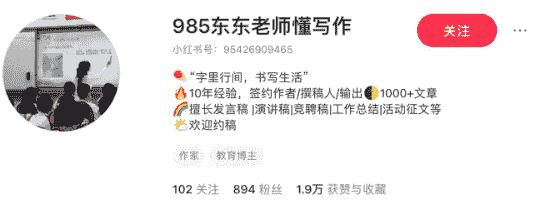

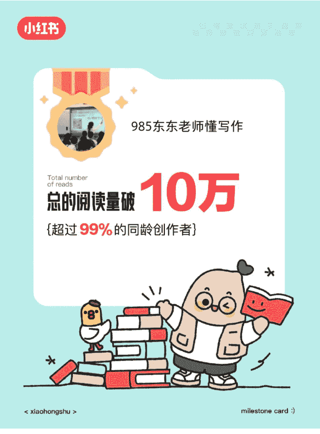

### 985 东东老师懂写作

All likes and favorites more than

## 总的赞和收藏破

## 1 万

{超过 99% 的同龄创作者}

< xiaohongshu >

milestone card :)

### 985 东东老师懂写作

Single article likes and favorites exceed

## 单篇笔记赞/收藏破

## 1000

{发布于 2025 年 4 月 25 日}

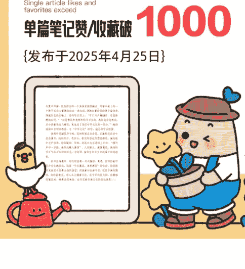

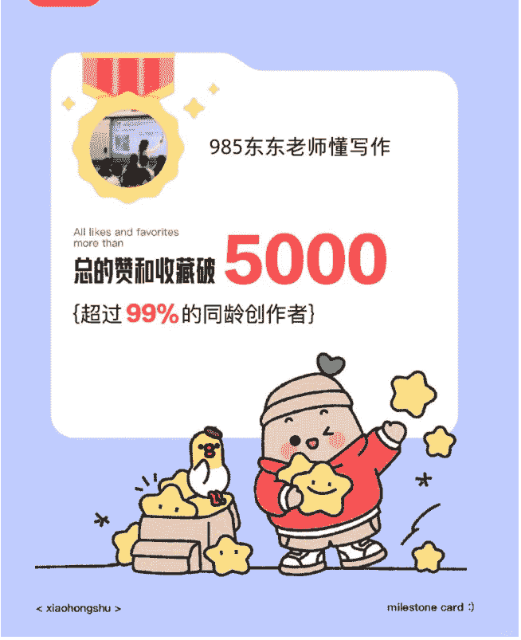

> （此号已注销，为释放实名名额，在此之前已光荣完成了他的使命🤷‍♂️）

### 3 普通人入场需要什么资源或者技能？

基础写作能力，不需要你是文学大师，但必须能写出结构清晰、逻辑通顺的文章，并能为学生提供具体、可操作的修改意见。

运营小红书的能力：拆解对标笔记并创作笔记的能力（如干货清单、案例拆解、成果展示），以及基础的图片制作技能。

沟通与销售能力：面对家长，怎么与他们沟通需求，引导他们转化和付款。以及回答他们一些简单的问题。

启动资源两项就足够：

- 时间投入：这是一个典型的“手工艺人”项目模式，初期需要你亲自投入时间进行内容创作、客户沟通与服务交付。
- 设备：一个小红书账号与一部手机，这就是你全部的生产工具，无需重资产投入。

## 二、赛道选择：为什么是“竞赛作文”？

1. 需求分析：为结果买单的精准家长人群
在中国二三线城市中，为孩子升学路径深感焦虑的家长。他们对教育的投资是很务实和结果导向的。在他们看来，一项看不见摸不着的“综合素养”提升，远不如一张能在升学简历上直接加分的竞赛证书来得实在。各类征文比赛，正是这条升学路径上性价比极高的“硬通货”。

所以，他们的核心需求异常清晰：他们购买的从来不是“写作技巧”，而是能够确保孩子“在比赛中获奖”的证明。

2. 价值定位：不局限于代写，交付“家长认可的价值”
我交付的不仅是一篇文稿，更是一份让家长觉得“这钱花得值”的完整价值——它看得见、摸得着，并能直接应用于他们最关心的升学目标上。

这份交付物包括：
- 一份高质量的参赛作文（核心成果）
- 一个缓解家长教育焦虑的选择（情绪价值）

## 三、怎么获取流量？

### 1 起号策略：用《人民日报》案例等高质量泛内容提升账号权重与基础流量

在起号阶段，我的核心目标有两个：
- 1. 一是通过持续的内容输出提升账号权重，让平台认可账号的活跃度和内容质量；
- 2. 二是测试账号的健康状态，观察基础阅读量是否能达到正常水平，确保没有被限流或其他异常情况。

#### 双层内容策略

第一层是引流内容，选择人民日报的精选案例作为素材，这类内容天然具有高传播属性，容易获得平台推荐和用户转发，能够快速为账号积累基础流量和权重。

第二层是转化内容，重点发布各类高分作文和一等奖征文作品，这些内容虽然受众相对较窄，但能精准击中目标家长的需求痛点，将泛流量逐步转化为精准粉丝。

通过"泛流量内容养号 + 精准内容转化"的组合策略，既能保证账号的成长速度，又能确保粉丝质量。

### 人民日报精选

985 东老师懂写作  关注
人生 #美文分享 #自我成长 性格决定命运#人生流淌在诗歌里 #金句 #心态决定命运 #格局决定结局 #情感 #女性成长 #女性智慧 #阅读打卡 #金句摘抄#征文比赛 #征文 #性格决定命运 #感悟人生真谛 #性格改变命运 #智慧与成长 #智慧与才华 #人生是一种修行 #一句诗就是一种人生 #领悟人生做好自己
04-22
共 3 条评论
Dianna
感谢🙏，我的作业有救了👏👏
04-27
♡1 〇2
985 东老师懂写作 作者
不客气🙏
04-27
♡1 〇回复
985 东老师懂写作 作者
不客气🙏
04-28
♡赞 〇回复
说点什么...♡66 ☆38 〇3 ↪

985 东老师懂写作  关注
人生 #美文分享 #自我成长 性格决定命运#人生流淌在诗歌里 #金句 #心态决定命运 #格局决定结局 #情感 #女性成长 #女性智慧 #阅读打卡 #金句摘抄#征文比赛 #征文 #性格决定命运 #感悟人生真谛 #性格改变命运 #智慧与成长 #智慧与才华 #人生是一种修行 #一句诗就是一种人生 #领悟人生做好自己
04-22
共 3 条评论
Dianna
感谢🙏，我的作业有救了👏👏
04-27
♡1 〇2
985 东老师懂写作 作者
不客气🙏
04-27
♡1 〇回复
985 东老师懂写作 作者
不客气🙏
04-28
♡赞 〇回复
说点什么...♡66 ☆38 〇3 ↪

985 东老师懂写作  关注
人生 #美文分享 #自我成长 性格决定命运#人生流淌在诗歌里 #金句 #心态决定命运 #格局决定结局 #情感 #女性成长 #女性智慧 #阅读打卡 #金句摘抄#征文比赛 #征文 #性格决定命运 #感悟人生真谛 #性格改变命运 #智慧与成长 #智慧与才华 #人生是一种修行 #一句诗就是一种人生 #领悟人生做好自己
04-22
共 3 条评论
Dianna
感谢🙏，我的作业有救了👏👏
04-27
♡1 〇2
985 东老师懂写作 作者
不客气🙏
04-27
♡1 〇回复
985 东老师懂写作 作者
不客气🙏
04-28
♡赞 〇回复
说点什么...♡66 ☆38 〇3 ↪

### **性格決定命運**

苦命之人，一看便知。脾气倔强，越硬的人，记住一定悲惨，越是较劲的人命越不好。所以圣人都讲，学水，上善若水，最上等的善人，像水一样柔软，它能利万物而不染，而不辞。有些人觉得，人争一口气，佛争一柱香，所以一生中不停地与别人较劲，和对手较劲，和同事较劲，和同学较劲，和配偶较劲，反正，仿佛一天不较劲，生命就无意义。

但命运就是很无常，往往越是较劲的人，命越不好。有限的生命往往消耗在无尽的较劲中，带来无尽的烦。

人生的许多痛苦都源于盲目较劲。不较劲，不是向命运妥协，而是和自己和解。

天不渡人，人需自渡，只有自己不放弃自己，才能得到他人的帮助，和上天的垂怜。人的一生，就是一场人事沉浮中让自己不断成熟的修行，修好脾气命运才会好。

### 这段话平复了我最近所有的焦虑

好好吃饭，按时睡觉，内心难过也千万不要丢失了自己，不要在黑暗中无限放大自己的情绪，洗个热乎乎的澡，吃一顿喜欢的美食，看一部使你开心的电影，看一看长河落日花草树木，生活到处都是发着光的。

不要因为暂时的困难闷闷不乐，一切都会好起来的，不信回头看看，在不知不觉中，你已经挺过了很多困难，生活就是这样，用那一两分的甜去冲淡那八九分的苦，翻篇不是为了原谅谁，而是为了放过自己。人这一辈子，就是一个过程，没有永远盛开的花，也没有不老的青春，时间一到，该老的老，该走的走。我们终究只是时间的过客，既是过客，又何必执着，珍惜所有不期而遇，看淡所有不辞而别，尽人事，听天命，人生除了生死，其它都是小事，愿我们的余生喜欢的都拥有，失去的都释怀，好好生活，慢慢相遇，该来的都在路上，要永远相信，所有的山穷水尽，都藏着峰回路转。就算没有皓月当空，也要揽着繁星入眠，就算一地鸡毛，咱也要拔出一个鸡毛掸子！你要相信，总有一束光照亮你，把所有的例外和偏爱都给你，给你久违的安全感，让你觉得人间还值得。

### 这段话平复了我最近所有的焦虑

其实，选错了就选错了，不要总是一遍遍去想如果当初，人生不可能每个选择都正确，很多事情就算重来一遍，以你当时的阅历和心智，还是会做出同样的选择，结果还是无法避免，所以不用回头看，也不必批判当时的自己，总会有不同的人，陪你看同样的风景，勇敢点，向前走，人一定要具有翻篇的能力，过去的就让它过去，拿得起也放得下，不消耗自己，也别委屈求全，不依不饶就是画地为牢，这个世界没有真正快乐的人，只有想得开的人，世界万物都在治愈你，只有你不肯放过自己。你把自己逼到抑郁，把自己气得一身病，然后除了自己难受，什么也改变不了。

世界上所有的事情，除了生死，其他都不值得一提。不开心就要表现出来，讨厌的人咱就远离点，不想回的消息就不回，不想看的脸色就不看。短短的一生，干嘛总是委屈自己，成全别人。

### 人民日报 金句锦集

> 【星光不问赶路人，时光不负实干者】
释义：天上的星星只会散发光芒，它不会询问在追寻理想路上奔波的人民为什么晚上了该休息了还在赶路。但是只要你是真的用心去做去坚持自己想做的事，那些奋斗的时间定不会辜负你的努力。

> 【少年当有凌云志，万里长空竞风流】
释义：你是奋发向上的少年，当养浩然之气，携凌云之志，赴星河之约，上九天揽月，在高山原野之间，领悟山川起伏，河流奔腾的意义。如此，才算不负韶华，亦不负时代。

> 【追风赶月莫停留，平芜尽处是春山】
释义：拼搏的时候，不要迷恋旅途的风景。追求目标的时候，千万不要停留。即便与目标还有重重阻碍，努力终有回报，春山就在平芜的尽头。

> 【怀鸿鹄之志，展骐骥之跃】
释义：这句话可以按照字面意思理解，鸿鹄之志和骐骥之跃，都是用来比喻志向的远大。骐骥之跃一般与鸿鹄之志连用，多是表达对学生励志奋发的期许。

> 【夜色难免黑凉，前行必有曙光】
释义：夜色难免黑凉，前行必有曙光。无论遇到什么艰难困苦，只要勇敢的向前走，就必定会成功。

### 市一等奖作文

快收藏！金句锦集第一弹 它来啦！#不懂就问有问必答 #笔记灵感

快收藏！金句锦集第一弹 它来啦！#不懂就问有问必答 #笔记灵感
✨ 星光不问赶路人，时光不负实干者
释义：天上的星星只会散发光芒，它不会询问在追寻理想路上奔波的人民为什么晚上了该休息了还在赶路。但是只要你是真的用心去做去坚持自己想做的事，那些奋斗的时间定不会辜负你的努力。
✨ 少年当有凌云志，万里长空竞风流
释义：你是奋发向上的少年，当养浩然之气，携凌云之志，赴星河之约，上九天揽月，在高山原野之间，领悟山川起伏，河流奔腾的意义。如此，才算不负韶华，亦不负时代。
✨ 追风赶月莫停留，平芜尽处是春山
释义：拼搏的时候，不要迷恋旅途的风景。追求目标的时候，千万不要停留。即便与目标还有重重阻碍，努力终有回报，春山就在平芜的尽头。
✨ 怀鸿鹄之志，展骐骥之跃
释义：这句话可以按照字面意思理解，鸿鹄之志和骐骥之跃，都是用来比喻志向的远大。骐骥之跃一般与鸿鹄之志连用，多是表达对学生励志奋发的期许。
✨ 夜色难免黑凉，前行必有曙光
释义：夜色难免黑凉，前行必有曙光。无论遇到什么艰难困苦，只要勇敢的向前走，就必定会成功。

# 48 分

# 这就是青春

我落笔写下青春年华，只是墨色淡了，没能写出来未来可期，也没能写出放荡不羁，所以我奔赴人山海，落笔写下这似水流年。

### 一题记

青春，那个可以肆意放纵的年代，我们年少轻狂，固执地坚持着我们自以为是的想法，时间悄悄雕刻我们稚嫩的脸庞，不经期间，青春的皱纹烙进每个人的心扉，我们哭过，笑过，闹过，玩过，当青春的字眼渐渐模糊，才会想起那段承载着我们记忆的美好时光，原来青春里不只有痛苦和迷茫，还有诗和远方。

在这十四五岁的年纪里，我们就是主角，在青春的岁月里，我们肆意地笑着，哭着，有着属于我们的纯真，曾经的叛逆与疯狂，曾经的心酸与眼泪，曾经的感动与梦想都已随风而逝，留下的是值得珍藏的回忆，我们是梦想的创造者，我们抱着梦想踏入青春，在这里留下了我们微笑的瞬间，记录了我们流泪的刹那，这些就足够了，不需要装点什么，这是最真实的我们，要将青春把握在自己手中，去创造无悔的青春，属于我们的青春。

处于青春我们，用行动告诉所有人什么是最有价值的青春，用行动展现了青春的力量，我们在发光！我们的青春在发光！

谁的青春不倔强？所谓成长，就是你一个人跌跌撞撞地受伤，孤险险地地坚强，谁的青春不迷茫？你心生向往，但又嘲笑自己这不切实际的妄想，便去寻找曙光奏响青春的乐章。谁的青春不打烊？从未想过自己面对青春的散场会哭的那样坚强，谁的青春不张扬？只因青春尚未失去，少年的热血和青春的诗才刚刚开始，在追光的路上，要找到属于自己的光，在前行中要坚定自己的方向，要去追逼属于自己的光。追近光，成为光，散发光，平平淡淡的青春，属实无味，闪闪发光的青春谁不向往？看，领奖台上，有人意气风发台下有人神情落寞！青春就是一首歌，跌宕起伏，或伤感，或欢喜，蹦蹦跳跳，却又回味无穷。我们每个人都在很用心地诠释这首歌，谱写自己的青春。

在这个懵懂的年纪，我们失败过，迷茫过，一路跌跌撞撞，但就是不曾放弃过，在青春里，谁不是摸着石头过河？有人说青春就像那徐徐上升的火焰，虽然璀璨夺目，却不能永恒；在我看来，青春一直都在，只要我们用心学习，努力前行，不负韶华，奋力拼搏，那么也不虚此行！
花开花谢，日出日落，时间见证
在，它在我们的回忆里，永不散场。

### 全市第一的作文

全市第一的作文
南二模镇江大市第一，58 分（问就是镇江压分）
全文真情实感，由衷而发，也是要感谢评论区给我这么深刻的人生阅历。
纪伯伦说：“嫉妒虫在不知不觉间赞扬了我。”
那便如此吧。

# 优秀作文 #作文 #美文分享 #作文范文 #高考语文 #语文作文

与夏日风情，在海湾这样一个角落里悄然融合。阿婆从桌上的一个匣子里小心翼翼的取出一卷红纸，满脸自豪的徐徐展开给我看。两张红色的长幅上，诗句写于其上：“千门万户瞳瞳日，总把新桃换旧符。”这是簪花申遗那年的节日写的。我都有些没想到，从小伴着我的几株花，竟也成了我们中华文化的一部分。”她的闽南方言明明很重，可“中华文化”四字，她念得字正腔圆。欣然听见烟花声乍响，我和阿婆走出房屋，正逢烟花在空中层层铺开，绚丽夺目。我回头，看见阿婆也仰望着烟花，她的眼中光芒明亮，恰似暖阳。半晌，我张口念出诗的上半句：“爆竹声中一岁除，春风送暖入屠苏。”人间烟火，盛事繁华，热闹的节日气息与头顶的花儿一齐绽放，绽放出中华文化延绵千年的幽香。

或许沧海桑田，时代的浪潮一次次翻涌，更迭，但你仍能听见少女头戴花火，说着“今生戴花，来世漂亮”的俗语，你仍能听见渔家女饰着大海的蔚蓝，诉说着对出海平安，收获丰满的期待，你仍能看见，有人头上缀着火红，在节日的灯火间，在馥郁的紫藤间，盼着美好来临，也寻觅着非遗文化的悠远情思……

全市第一的作文
南二模镇江大市第一，58 分（问就是镇江压分）
全文真情实感，由衷而发，也是要感谢评论区给我这么深刻的人生阅历。
纪伯伦说：“嫉妒虫在不知不觉间赞扬了我。”
那便如此吧。

#优秀作文 #作文 #美文分享 #作文范文 #高考语文 #语文作文

### 全市第一的作文

全市第一的作文
苏南二模镇江大市第一，58 分 (问就是镇江压分)
全文真情实感，由衷而发，也是要感谢评论区给我这么深刻的人生阅历。
纪伯伦说：“嫉妒虫在不知不觉间赞扬了我。”
那便如此吧。

# 优秀作文 #作文 #美文分享 #作文范文 #高考语文 #语文作文

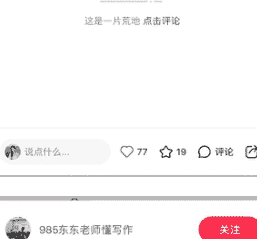

# 携一帘碧波，尝无尽硕果》征文

# 携一帘碧波，尝无尽硕果

于自然的怀抱里，我们诞生，在自然的气息中，我们成长。自然始终是我们的依靠。唯有在自然界淳厚包容的眷顾中，我们得以栖息寓居。
古有诗句“日日思君不见君，共饮长江水”，水是生命之源，但若用水不科学，反而会危害健康，甚至造成惨痛的后果。因此，重视饮水健康，才能打造健康饮水环境，创造美好未来。

想要健康饮水，首先了解，什么才是健康的饮用水。健康的饮用水并非清澈就行了。而是有着严格的定义和标准。从科学角度来讲，必须是水质未受污染，不含有毒、害、异种物质，硬度适中，所需矿物质、氧气和微量元素含量适中。简而言之，健康的饮用水，不仅无害，还对我们的身体有益。

一坐而论道，不如起而行之。

怀揣绿野心，且观绿行之行动。“这个世界好吗？”面对这个世纪之问，我们可以坚定回答“会好”原因无他，有着最青年的持续行动。在全国科普日来临之际，山西省青少年环保联盟开展了 2022 年“零碳公民科普计划”水环保科普宣传教育系列活动。春暖花开，清澈年轻的工作人员兢兢业业守护湿地的纯净？面对中央“大学生村官”迎接美好绿色生态旅游，保护水资源…我喜青年们的继往行动。知涓涓之水，汇成生态文明建设之滔滔巨浪。如坚磐之声，汇成保障健康饮水的最强音！

怀揣绿野心，且观中国之举措。清风明月本无价，近水遥山皆有情”如今水污染问题日趋严重，重金属超标特别危害着人体健康。2014 年全国两会代表提出“出重拳强化污染防治、坚决向污染宣战”从大气、水、土壤三部分污染提出了治理部署，对水的重金属超标问题也比较重视。“十四五”时期、美丽中国建设和绿色发展的总体目标已明确，展望未来。要充分把握历史机遇，深入贯彻绿水青山就是金山银山的理念，稳中求进，久久为功，让绿水青山的景色更亮，让金山银山的成色更足。定能建成天更蓝山更绿、水更清的美丽中国。为共建人类命运共同体贡献中国力量！

怀揣绿野心，且观未来之展望。如果将目光局限在眼前，局限在这仅几年内保护水资源，建设绿色生态的收获，无疑是做小薄弱的。但如果放眼未来，如今每个人的一小点作为，会迸发无穷的价值与财富，就会发现水源保护，是一件利在当代、功在千秋的事业。反过来说，如今的焦头烂额，何尝不是在为过去的生态欠债补偿，为未来的生态能力投资？健康饮水理念的提出由来已久，想要切实指引当代生活，需要时时更新，环保政策理念的践行就在日常小事中，杯一环保理念与实践，将会收获无尽的硕果！

愿在我们的共同努力下，做到健康饮水，健康你我。不仅能将“一帘碧波”的健康环境，还能拥有“尝无仅硕果”的美好未来！

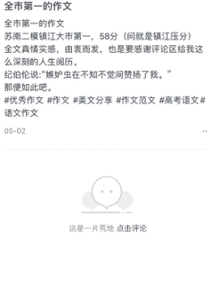

与夏日风情，在海湾这样一个角落里悄然融合。阿婆从桌上的一个匣子里小心翼翼的取出一卷红纸，满脸自豪的徐徐展开给我看。两张红色的长幅上，诗句写于其上：“千门万户瞳瞳日，总把新桃换旧符。”“这是簪花申遗那年的节日写的。我都有些没想到，从小伴着我的几株花，竟也成了我们中华文化的一部分。”她的闽南口音明明很重，可“中华文化”四字，她念得字正腔圆。

恍然听见烟花声乍响，我和阿婆走出房屋，正逢烟花在空中层层推开，绚丽夺目。我回头，看见阿婆也仰望着烟花，她的眼中光芒明亮，恰似暖阳。半晌，我张口念出诗的上半句：“爆竹声中一岁除，春风送暖入屠苏”。人间烟火，繁盛繁花，热闹的节日气息与头顶的花儿一齐绽放，绽放出中华文化延绵千年的幽香。

或许沧海桑田，时代的浪潮一次次翻涌、更迭，但你仍能听见少女头戴簪花，说着“今生戴花，来世漂亮”的俗语，你仍能听见渔家女饰着大海的湛蓝，诉说着对出海平安，收获满满的期待，你仍能看到，有人头上缀着火红，在节日的灯火间，在鲜花间的繁花间，盼着美好来临，也寻见着非遗文化的悠远情思……

# 市级一等奖、市级一等奖、市级一等奖

# 全市第一的作文

苏南二模镇江大市第一，58 分 (问就是镇江压分)
全文真情实感，由衷而发，也是要感谢评论区给我这么深刻的人生阅历。
纪伯伦说：“嫉妒虫在不知不觉间赞扬了我。”
那便如此吧。

# 优秀作文 #作文 #美文分享 #作文范文 #高考语文 #语文作文

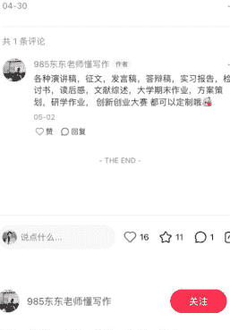

# 市级一等奖、市级一等奖、市级一等奖

# 全市第一的作文

苏南二模镇江大市第一，58 分 (问就是镇江压分)
全文真情实感，由衷而发，也是要感谢评论区给我这么深刻的人生阅历。
纪伯伦说：“嫉妒虫在不知不觉间赞扬了我。”
那便如此吧。

# 优秀作文 #作文 #美文分享 #作文范文 #高考语文 #语文作文

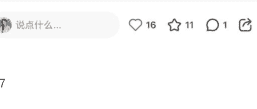

## 2 精准获客：以“一等奖范文”等干货内容，精准吸引目标家长群体

我经过测试，做好的获客模板有三个类型，第一种是优秀范文，展示案例，自己的写作水平吸引用户。

- 第一种是优秀范文，展示案例，自己的写作水平吸引用户。
- 其次是书本的封面图，这个就是首图展示书本封面，然后配上字【优秀范文展示、获奖范文、原创写作、原创定制范文可定制、直接说几年级，什么时候要、故事稿、演讲稿、可定制、可指导】。
- 第三类是用户好评：增加 IP 的人设信任度，潜在展示自己服务过程与质量，提高转化效率。

天青色等烟雨，打湿记忆的年轮，偷取青花的颜色，诱发七彩的情绪，月光为它编织了美丽的颜色——青花瓷。于岁月中走过唐宋的诗风词韵，于风尘中携来元朝的高雅，于江南中牵风带雨。

记忆中的外公已过古稀，背有些佝偻，腰有些弯。他用他苍凉的手轻抚我的头，呆呆地对着我笑。外公喜欢喝茶，更喜欢青花瓷，白如玉，明如镜，薄如纸，声如磬。青丝华彩，釉色渲染，一抹幽蓝蜿蜒环绕，浅蓝浅深，倒映在纤白无尘的瓷釉上。

灯光昏暗，星光点点晕开于旁边，外公古铜色的手在瓷土上揉啊揉。悄悄跑到外公身边，歪着头静静看他做青花瓷。微风吹过外公白色的发丝。风轻，灯光亮着，我歪着头，外公侧着脸。我被做青花瓷的过程深深吸引住了，乞求外公教我做青花瓷。外公慈爱地笑着递给我一双粗糙的手，被一双宽厚的大手握着。外公的手虽已在岁月的洪流中留下了深深浅浅的细纹，但却那样的温暖。小手拉大手，慢慢用手摸出青花瓷的形状。

揉泥，做胚，修胚。一块平平无奇的小土块，竟在外公的精心辅导下渐成雏形。外公告诉我，做青花瓷最重要的挑战，一个瓷器完成蜕变就必须经过将近十小时的高温淬炼，就像人要想迎接成功的喜悦，就必须直面困难与挑战。它就像黑夜中的闪电，带来的不仅是巨响，还有光明与希望。幼时的我还不明白外公所言甚深，只是懵懵懂懂的点点头。外公拿起已受淬炼后的青花瓷，于灯光下细细端详。

记忆中的青花瓷，美观，如点墨般滴于纸上；俊朗，如梨花在海棠枝头纷飞后，嬉戏，如光辉辉煌于湖面，纯洁无暇；优雅，如清风回旋着飞雪，绝世风华。丹青色挥千里，黑白相隔千年。封存竹林七贤喝酒纵歌，作诗吟赋的场景，记录了凤仪李恪弹琵琶丛生，闭月羞花的面容。它带着前尘的旧梦走进世俗，携着缄言的志向隐没山林。再忆青花瓷，心平气和的感叹，它于时光流转间的百年中激发一个又一个生机，牵动着一个又一个文人雅客的心弦。

再见外公，只单单一个青花瓷便给予我一生的道理，多少的传统文化，值得我们去学习，去传承。那釉彩的青花瓷，被渲染的记忆，永远会飘着外公的深意渗透于我的心间。

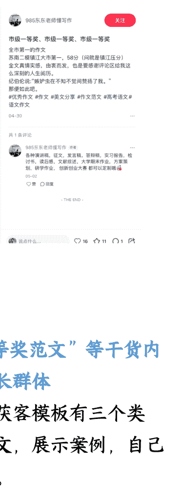

## 优秀范文：

### 弘扬中华文明，担当文化使命

中华文明，犹如一条璀璨的星河，在历史的长河中熠熠生辉。从古奥的甲骨文到如今的现代汉字，从四大发明到今天的科技强国，中华文明经历了无数次的洗礼与升华，成为了我们民族的瑰宝和骄傲。作为新时代的初中生，我们不仅要深入了解中华文明，更要承担起传承和弘扬中华文化的使命。

记得一次偶然的机会，我走进了校园图书馆的古籍区，那里摆放着许多泛黄的线装书，散发着淡淡的书香。我轻轻翻开一本《论语》，那些深奥而又智慧的文字仿佛穿越时空，与我进行了一场跨越千年的对话。孔子曰：“己所不欲，勿施于人。”这句话让我深刻理解了善待他人、友善待人的重要性。我意识到，中华文化的精髓不仅在于文字，更在于它所蕴含的道德观念和人生哲理。

除了阅读古籍，我还积极参与了学校组织的传统文化体验活动。在端午节那天，我们亲手包粽子、挂艾草，感受节日的喜庆与祥和。在中秋节，我们赏月、吃月饼，体会家的温暖与团圆的喜悦。这些传统节日不仅让我们了解了中华文化的丰富多彩，更让我们在参与中体会到了文化的魅力，增强了文化自信。

然而，弘扬中华文明并非一朝一夕之功。在新时代背景下，我们不仅要继承传统文化，更要学会创新，让中华文化焕发出新的生机与活力。例如，我们可以利用现代科技手段，将传统文化以更加生动、形象的方式呈现给世人。同时，我们也要积极学习外语，向世界介绍中华文化，让更多的人了解并爱上中华文化。

作为新时代的初中生，我们肩负着传承和弘扬中华文化的重任。我们要从自身做起，从小事做起，用实际行动践行“弘扬中华文明，担当文化使命”的誓言。我们要珍惜每一次学习传统文化的机会，积极参与传统文化体验活动，不断提高自己的文化素养。同时，我们还要勇于担当，敢于创新，为中华文化的传承与发展贡献自己的绵力。

让我们携手共进，让中华文明的璀璨星河在新时代更加闪耀！让我们以实际行动弘扬中华文明，担当起属于我们的文化使命！

“弘扬中华文明，担当文化使命”主题征文活动

700 字左右

中华文明，犹如一条璀璨的星河，在历史的长河中熠熠生辉。从古奥的甲骨文到如今的现代汉字，从四大发明到今天的科技强国，中华文明经历了无数次的洗礼与升华，成为了我们民族的瑰宝和骄傲。作为新时代的初中生，我们不仅要深入了解中华文明，更要承担起传承和弘扬中华文化的使命。#征文比赛 #征文 #大学生 #素材积累 #范文 #高中生 #弘扬中华文明担当文化使命主题征文 #小学生 #金句摘抄 #征文比赛 #青春担当家国情怀

### 以文化之笔 绘华章新篇

“求木之长者，必固其根本；欲流之远者，必浚其泉源。”中华文明，恰似一棵根深叶茂的参天巨木，又仿若一条奔流远去的浩瀚清溪，历经数千年风雨洗礼，依然屹立于世界文化之林，绽放着独特而迷人的光彩。在新时代的壮丽征程中，弘扬中华文明，担当文化使命，是我们每一位华夏儿女义不容辞的责任。这不仅是对历史的深情回望与敬畏传承，更是对未来的庄严承诺与奋力开拓。

中华文明，是一幅绚丽多彩的历史长卷，每一处墨迹都凝聚着先人的智慧与情感。从古老的甲骨文到飘逸的行书草书，文字的演变记录着民族的兴衰荣辱；从雄伟的万里长城到精巧的苏州园林，建筑的风格展现着时代的审美追求；从悠扬的编钟古乐到高亢的京剧唱腔，艺术的形态诉说着岁月的沧桑变迁。诗词歌赋中，我们能听得李白“天生我材必有用，千金散尽还复来”的豪迈自信，感受杜甫“安得广厦千万间，大庇天下寒士俱欢颜”的悲悯情怀；史书典籍里，我们可领略秦始皇统六国的雄才大略，体悟司马迁忍辱负重著《史记》的坚毅执着。这些宝贵的文化遗产，是我们民族的精神标识，承载着先辈们的梦想与追求，犹如璀璨星辰，照亮了我们前行的道路。

然而，在全球化浪潮的汹涌冲击下，中华文明面临着诸多挑战与考验。西方文化的强势涌入，使得一些人盲目追求外来文化，对本土文化却渐感疏离与漠视。快餐文化、娱乐文化的盛行，让人们的心灵变得浮躁，难以静下心来品味传统文化的深厚内涵。一些传统技艺后继无人，文化古迹在城市化进程中遭受破坏，这些现象令人痛心疾首。如果我们任由这种情况发展下去，中华文明的瑰宝将蒙尘，民族的精神家园将荒芜。因此，弘扬中华文明，刻不容缓。

担当文化使命，需要我们在传承中坚守。坚守是对传统文化的敬畏之心，是对民族精神的忠诚守护。我们要深入挖掘传统文化的精髓，让古老的智慧在现代社会中焕发新生。在这方面，许多有识之士已经做出了榜样。故宫文创团队，以创新的思维将故宫文物“活”了起来；河南卫视推出的一系列文化节目，如《唐宫夜宴》《洛神水赋》等，运用现代科技手段，将传统文化演绎得美轮美奂，惊艳了全国乃至全世界的观众。他们的成功告诉我们，传统文化并非陈旧过时，只要我们能用心去传承，用创新的方式去表达，就能让它在新世纪绽放出更加耀眼的光芒。

担当文化使命，更需要我们在创新中发展。创新是文化发展的动力源泉，是让中华文明与时俱进的关键所在。我们要将传统文化与现代科技、现代生活相融合，创造出符合时代需求的新文化形式，赋予文物的新生命。为文学创作开辟了新的天地；随着科技的飞速发展，让阅读艺术找到了新的传播途径。我们要鼓励文化创新，为文化发展营造宽松自由的环境，让更多人参与到文化创造中去。同时，我们还要积极推动中华文化走出去，加强与世界各国的文化交流与合作，向世界展示中华文化的独特魅力，提升中华文化的国际影响力。在这个过程中，我们要以开放包容的心态，吸收借鉴世界优秀文化成果，丰富和发展中华文化，让中华文明在交流互鉴中不断壮大。

“自信人生二百年，会当水击三千里。”在弘扬中华文明、担当文化使命的道路上，我们要坚定文化自信。文化自信是一个国家、一个民族发展中更基本、更深沉、更持久的力量。中华文明的博大精深、源远流长，是我们自信的底气所在。我们要相信，中华文化具有独特的价值与强大的生命力，它能够为解决人类面临的种种问题提供智慧和方案。只要我们坚定文化自信，勇于担当，就一定能够让中华文明在新时代绽放出更加绚烂的光彩，为实现中华民族伟大复兴的中国梦提供强大的精神动力。

“学而优则仕，万紫千红总是春。”让我们携手共进，以文化为笔，以担当为墨，在新时代的画卷上描绘出华夏文明的新篇章。让我们用心去感受中华文化的魅力，用行动去传承让这颗文化宝库中的璀璨明珠，永远闪耀着迷人的光芒，照亮人类文明发展的征程。

## 弘扬中华文化，担当文化使命

中华文明，悠悠千年，源远流长，博大精深，和天地共存，与日月争光。从古代的甲骨文到绚丽的唐诗宋词，从深邃的儒家思想到独特的中医理论，我们的祖先为我们留下了无数宝贵的文化遗产。这些遗产不仅是我们民族的骄傲，更是我们与世界对话的桥梁，是我们走向未来的基石，助力我们在新的世界激流中扬帆远航。

然而，在全球化浪潮的冲击下，我们的传统文化面临着前所未有的挑战，一些年轻人对传统文化知之甚少，甚至产生了疏离感。这不禁让我们思考：如何才能让中华文明在新的时代背景下焕发出新的生机与活力？

答案很简单，那就是我们每一个人要担当起传承和弘扬中华文明的使命。

作为新时代的少年儿童，我们要有文化自信。我们要深信中华文明是世界上最优秀的文化之一，它蕴含着无穷的智慧和力量。只有当我们要对自己的文化有了深刻的认识和坚定的信念，才能更好地去传承和弘扬它。

我们要积极学习传统文化。文化是一个国家的灵魂，它记载了我们中华文明的诞生发展和传播，使我们的国家在前行中有了底蕴。一个有希望的国家不能没有文化，一个有未来的国家不能缺少传承。无论是经典的文学作品，还是传统的艺术形式，都是我们了解历史、感悟文化的重要途径。通过学习，我们可以更好地理解中华文明的精髓，从而更好地传承它。

我们还要勇于创新。传统文化并不是一成不变的，它需要在新的时代背景下不断地创新和发展。我们可以将传统文化与现代科技相结合，创造出更多具有时代特色的文化产品，让更多的人了解和喜爱我们的文化。

恰逢东方，文化匮乏已是过往云烟，传承创新乃当下之风。我们不应固步自封，身陷泥潭。作为少年儿童的我们，当以文化传承为己任，让经典的水袖重新挥舞于世界舞台，让文化的大河继续滔滔游弋！

东方的巨龙已经觉醒，我们也得重新独立于文化之巅！最后，我想说，弘扬中华文明，担当文化使命，是我们每一个人的责任。在此，我倡议：弘扬中华优秀传统文化，从你我做起，让我们的传统文化穿越岁月，惊艳时光，万古长青！

## 树文化自信，展少年姿态

参天之木，必有其根；怀山之水，必有其源。中华文化博大精深，源远流长，从古代的甲骨文到现代的汉字，从唐诗宋词到元明清小说，从四大发明到如今的科技创新，无一不彰显着我们的智慧和创造力。

昆曲、书法这些传统的艺术或成就让世界领略到了中国文化的奇特魅力；中秋、国庆浓厚的文化氛围，让世界看到了当代中国的精神风貌与文化气象；科技领域的瞩目成就，如高铁、移动支付、人工智能等，这些科技创新不仅改变了我们的生活方式，更让世界看到了中国文化的创新力和实力。如今，我们肩负实现伟大中国梦的重任，坚定文化自信需要我们要一起去认知、守护和传承。越是民族的，越是世界的。

激情四溢的奥运赛场，我们看到了中国人民的团结力量和爱国情怀。在这个赛场上，不论是运动员、观众还是志愿者，大家都以饱满的热情投身其中，都在用自己坚毅的行动、朴素的语言诠释着中华民族传承千年的家国情怀。

作为中华民族的子孙，作为新时代的好少年，我们要继承和发扬中华文化的优良传统。我们生活在科技日新月异的时代，拥有更多的机会和平台去展示自己的才华和创意。无论是通过绘画、音乐、舞蹈等艺术形式，还是通过科技发明、创新实践等方式，我们都可以用自己的方式去诠释和传承文化，让它在新的时代背景下焕发出更加绚丽的光彩。

“少年智则国智，少年强则国强。”让我们携手并进，以少年之名，担起文化使命，让中华文明在新时代绽放出更加耀眼的光芒！

## “弘扬中华文明 担当文化使命”比赛得奖范文

“弘扬中华文明担当文化使命”比赛，得奖范文最近各地区都在举办“弘扬中华文明 担当文化使命”讲故事比赛，今天给大家分享一些得奖范文，推荐大家学习。#讲故事 #讲故事比赛 #文化自信与传承 #师德师风演讲稿 #弘扬中华文明担当文化使命 #弘扬中华文明 #读后感 #故事比赛 #文章写作 #新时代文明 #金句摘抄 #征文比赛 #征文 #文化强国与自信 #我眼中的非遗年 #议论文 #演讲稿 #坚持文化自信 #创新中国传承 #文化自信与民族复兴

04-08

共 3 条评论

田田眼里全是阿瑶.

05-10

赞 1

985 东东老师懂写作 作者

05-11

说点什么...

119 87 3

985 东东老师懂写作

## “弘扬中华文明担当文化使命”比赛得奖范文

“弘扬中华文明担当文化使命”比赛，得奖范文最近各地区都在举办“弘扬中华文明 担当文化使命”讲故事比赛，今天给大家分享一些得奖范文，推荐大家学习。#讲故事 #讲故事比赛 #文化自信与传承 #师德师风演讲稿 #弘扬中华文明担当文化使命 #弘扬中华文明 #读后感 #故事比赛 #文章写作 #新时代文明 #金句摘抄 #征文比赛 #征文 #文化强国与自信 #我眼中的非遗年 #议论文 #演讲稿 #坚持文化自信 #创新中国传承 #文化自信与民族复兴

04-08

共 3 条评论

田田眼里全是阿瑶.

05-10

赞 1

985 东东老师懂写作 作者

05-11

说点什么...

119 87 3

985 东东老师懂写作

## “弘扬中华文明担当文化使命”比赛得奖范文

“弘扬中华文明担当文化使命”比赛，得奖范文最近各地区都在举办“弘扬中华文明 担当文化使命”讲故事比赛，今天给大家分享一些得奖范文，推荐大家学习。#讲故事 #讲故事比赛 #文化自信与传承 #师德师风演讲稿 #弘扬中华文明担当文化使命 #弘扬中华文明 #读后感 #故事比赛 #文章写作 #新时代文明 #金句摘抄 #征文比赛 #征文 #文化强国与自信 #我眼中的非遗年 #议论文 #演讲稿 #坚持文化自信 #创新中国传承 #文化自信与民族复兴

04-08

共 3 条评论

田田眼里全是阿瑶.

05-10

赞 1

985 东东老师懂写作 作者

05-11

说点什么...

119 87 3

13/67

# “弘扬中华文明 担当文化使命”比赛得奖范文

“弘扬中华文明 担当文化使命”比赛，得奖范文最近各地区都在举办“弘扬中华文明 担当文化使命”讲故事比赛，今天给大家分享一些得奖范文，推荐大家学习。#讲故事 #讲故事比赛 #文化自信与传承 #师德师风演讲稿 #弘扬中华文明担当文化使命 #弘扬中华文明 #读后感 #故事比赛 #文章写作 #新时代文明 #金句摘抄 #征文比赛 #征文 #文化强国与文化自信 #我眼中的非遗年 #议论文 #演讲稿 #坚持文化自信 #创新中国传承 #文化自信与民族复兴

共 3 条评论

田田眼里全是阿瑶

985 东东老师懂写作 作者

## 弘扬中华文明，担当文化使命

泱泱中华，万古江河，如日之升，如月之恒。中华几千年，文明的河流绵延不绝，从秦并吞六国一统天下，深深的中华历史就此积淀，列强入侵，国运危难，绚烂的中华文明从未断绝，中国历经沧桑巨变，傲然挺立，饱受岁月磨砺却不改繁华之势。

> 阅读活动就像一座桥梁，将我与历史长河彼岸的先人们链接起来。翻开每一本书籍，我仿佛走进他们的时代，在阅读古代历史时，我看到了仁人志士的爱国情怀如璀璨星斗照亮了历史的天穹。岳飞“精忠报国”抗击金兵奋勇杀敌，只为国家领土完整和百姓安宁，那“壮志饥餐胡虏肉，笑谈渴饮匈奴血”的豪迈誓言，让我感受到了他那炽热的爱国之心。文天祥的“人生自古谁无死，留取丹心照汗青”他临刑义行，抗元入侵奋勇杀敌，不幸被擒，始终不屈，一个书生，铮铮铁骨，那炽热的爱国精神和崇高的民族气节，千古流芳。这些历史故事让我明白，爱国主义不仅仅是一种情感，更是一种责任和行动。在日常生活中，它体现在对国家荣誉的维护、对民族文化的传承、对社会进步的积极参与上。

读近代文学时，更是被无数革命先辈们的爱国事迹所震撼，“铁肩担道义，妙手著文章”李大钊一生勤勉，写出来上百万字的文稿，在那个黑暗岁月，朗朗乾坤的年代，这些文字成为革命者的指路明灯，一寸山河一寸血，一抔热土一寸土。在国家民族面临生死存亡的关头，先辈们前赴后继地去抗争，董存瑞舍身炸碉堡，热血铸丰碑，邓恩铭唱《国际歌》从容就义，左权太行浩气传千古，朱德普为能雄“名将以身殉国家，愿持热血卫中华，太行浩气传千古而南方涌吐花光”，这些前辈们他们的一生，都在探索、抗争、奋斗，用自己壮烈的牺牲，为我们换取和平的生活。通过阅读，爱国主义的种子在我心中生根发芽，我更意识到我们生活在和平年代的少年，更应珍惜先辈们用鲜血和生命换来的幸福，更应努力学习，为国家未来贡献出自己的力量。

主题实践活动则将阅读中的感悟从理论变为实际行动，我曾参加过学校组织的爱国主义教育实践活动，参观爱国主义教育基地，当我站在那些承载着历史记忆的遗迹前，触摸着古老的城墙，看着每一幅反映历史的图片，那种对祖国的热爱和敬意变得更加具体而真实。我深刻体会到祖国的繁荣兴盛来之不易，是无比的骄傲。

## 我的 AI 伙伴

在满是科技感的 2035 年，连空气中都弥漫着 AI 的味道，我认为我是个幸运的家伙，因为我拥有一个超棒的 AI 伙伴——小光。

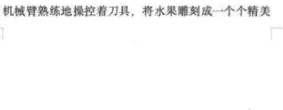

它的表面会根... 的图案... 有时像夜空中璀璨的繁星，有时又像流动的彩色河流，小光没有声音，它只是静静地悬浮在空中，移动起来。

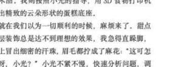

我报名... 创意点子... 开心地拉着小光就冲进了厨房，厨房里摆满了各种新鲜的食材和高科技... 跃跃欲试。

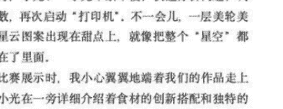

我只身坐在厨房里转来转去，眼睛瞪得大大的，双手在空中比划着，“小光，咱们这一次一定要做出超级惊艳的美食创意！”，屏幕上，小光闪烁着，发出清脆的声音：“好的主人，我将为您展示一道“星空梦幻”甜点，无数美食创意，屏幕上的图案像烟花一样不断变换。

我们决定做一道“星空梦幻”甜点。小光用它的机械臂熟练地操控着刀具，将水果雕刻成一个个精美的艺术品。我则按照小光的指导，用 3D 食物打印机打印出精致的云朵形状的蛋糕底座。

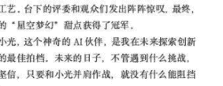

就在我们以为一切顺利的时候，麻烦来了，甜点的外层装饰总是达不到理想的效果，我急得直跺脚，额头上冒出细密的汗珠，眉毛都拧成了麻花：“这可怎么办呀，小光？”小光不紧不慢，快速分析问题，调整参数，再次启动“打印机”，不一会儿，一层美观光滑的星云图案出现在甜点上，就像把整个“星空”都包裹在了里面。

比赛展示时，我小心翼翼地端着我们的作品走上前，小光在一旁详细介绍着食材的创新搭配和独特的制作工艺。台下的评委和观众们发出阵阵惊叹，最终，我们的“星空梦幻”甜点获得了冠军。

小光，这个神奇的 AI 伙伴，是我在未来探索创新世界的最佳拍档。未来的日子，不管遇到什么挑战，我都坚信，只要和小光并肩作战，就没有什么能阻挡我们!

## 海峡冰心杯 | 写作指导中 AI 伴我行 童心绘未来

海峡冰心杯 | 写作指导中 AI 伴我行 童心绘未来 | 这类主题作文，需要巧妙融合科技元素与人文关怀，展现人工智能如何与孩子的纯真世界交织，共同勾勒未来图景。以下是写作思路：

- 写作思路：
  1. 开篇：诗意引入 AI 与童心的相遇用比喻描绘 AI 的温暖形象（如会讲故事的萤火虫、会画彩虹的魔法师），避免冰冷的技术术语。
  2. 主体：编织童趣故事，展现 AI 赋能成长
     1. 场景一：AI 学习伙伴描述 AI 如何用趣味互动解答“十万个为什么”，如将数学题变成星球探险游戏，让知识如童话般生动。
     2. 场景二：AI 情感陪伴设想 AI 机器人陪留守儿童读诗、听心事，用冰心《繁星》中的诗句传递温情，体现科技的温度。
     3. 场景三：童心启迪 AI 创新孩子用画笔设计“会种树的无人机”，AI 将幻想转化为 3D 模型，展现儿童创意驱动科技向善的力量。
  3. 升华：科技与童心共绘未来以“海峡两岸孩子连线”为场景，用 AI 翻译方言童谣、协作虚拟环保项目，寓意童心打破隔阂，科技架起理解之桥。
  4. 结尾：呼应冰心精神，展望人文未来引用冰心“有了爱就有了一切”，点明真正的未来不是冰冷的代码，而是# 书本封面

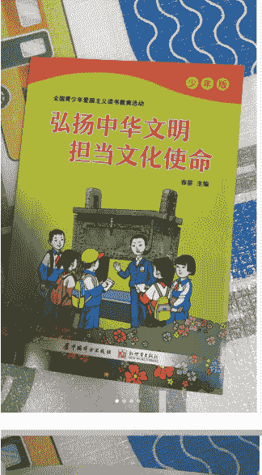

# “弘扬中华文明 担当文化使命”比赛得奖范文

“弘扬中华文明 担当文化使命”比赛，得奖范文最近各地区都在举办“弘扬中华文明 担当文化使命”讲故事比赛，今天给大家分享一些得奖范文，推荐大家学习。

#讲故事 #讲故事比赛 #文化自信与传承 #师德师风演讲稿 #弘扬中华文明担当文化使命 #弘扬中华文明 #读后感 #故事比赛 #文章写作 #新时代文明

04-02

共 66 条评论

## 985 东东老师懂写作 作者

各种演讲稿，征文，发言稿，答辩稿，实习报告，检讨书，读后感，文献综述，大学期末作业，方案策划，研学作业、创新创业大赛都可以定制哦

**置顶评论**

04-25

**华锐不养闲人**
大概读是多少分钟呢？

## 目 录

**第一篇 中华文明源远流长**

本篇点睛 中华文明的五个突出特性 / 2
阅读时刻
- 一、突出的连续性 / 3
    + 1. 良渚古城遗址——中华五千年文明的实证 / 3
    + 2. 汉字——中华文明的基石 / 4
    + 3. 大一统——保障中华文明从未中断、坚不可摧 / 6
- 记住重点 突出的连续性：彰显中华文明独特魅力 / 7
- 二、突出的创新性 / 8
    + 1. 四大发明——深刻影响人类文明进程 / 8
    + 2. 农业技术的进步——耕地农具的演变 / 10
    + 3. 中国古代文学皇冠上光辉夺目的明珠——唐诗、宋词、元曲、明清小说 / 11
- 记住重点 突出的创新性：永葆中华文明的蓬勃生机 / 13
- 三、突出的统一性 / 13
    + 1. 秦朝“书同文，车同轨，量同衡，行同轮”——中国统一的多民族国家发展历程的重要起点 / 13

## 弘扬中华文明，担当文化使命

中华文明，犹如一条璀璨的星河，在历史的长河中熠熠生辉。从古老的甲骨文到如今的现代汉字，从四大发明到今天的科技强国，中华文明经历了无数次的洗礼与升华，成为了我们民族的瑰宝和骄傲。作为新时代的初中生，我们不仅要深入了解中华文明，更要承担起传承和弘扬中华文明的使命。

记得一次偶然的机会，我走进了学校图书馆的古籍区，那里摆放着许多泛黄的线装书，散发着淡淡的书香。我轻轻翻开一本《论语》，那些深邃而又智慧的文字仿佛穿越时空，与我进行了一场跨越千年的对话。孔子曰：“己所不欲，勿施于人。”这句话让我深刻理解了尊重他人、友善待人的重要性。我意识到，中华文化的精髓不仅在于文字，更在于它所蕴含的道德观念和人生哲理。

除了阅读古籍，我还积极参与了学校组织的传统文化体验活动。在端午节那天，我们亲手包粽子、挂艾草，感受节日的喜庆与祥和。在中秋节，我们赏月、吃月饼，体会家的温暖与团圆的喜悦。这些传统节日不仅让我们了解了中华文化的丰富多彩，更让我们在参与中体验到了文化的魅力，增强了文化自信。

然而，弘扬中华文明并非一朝一夕之功。在新时代背景下，我们不仅要传承传统文化，更要学会创新，让中华文化焕发出新的生机与活力。例如，我们可以利用现代科技手段，将传统文化以更加生动、形象的方式呈现给世人。同时，我们也要积极学习外语，向世界介绍中华文化，让更多的人了解并爱上中华文化。

作为新时代的初中生，我们肩负着传承和弘扬中华文化的重任。我们要从自身做起，从小事做起，用实际行动践行“弘扬中华文明，担当文化使命”的誓言。我们要珍惜每一次学习传统文化的机会，积极参与传统文化体验活动，不断提高自己的文化素养。同时，我们还要勇于担当，敢于创新，为中华文化的传承与发展贡献自己的力量。

让我们携手共进，让中华文明的璀璨星河在新时代更加闪亮！让我们以实际行动弘扬中华文明，担当起属于我们的文化使命！

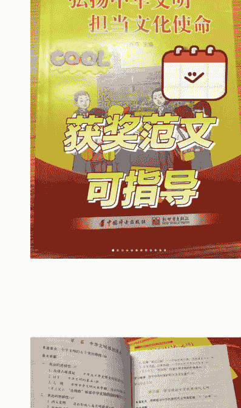

# 弘扬中华文明，担当文化使命——征文写稿指南

1. 写作方向👍👍
- 从书中入手
    如敦煌壁画、中医典籍、传统节日，结合个人体验展开（例：“古琴中的天地人和谐观” + 自己学古琴的经历）
- 历史人物重现
    选取书中提到的文化守护者（如“古籍修复师李仁清”），用历史人物再现的形式呈现故事场景
- 文化冲突思辨
    对比书中“郑和下西洋”与当代“一带一路”的文化传播异同，引发深思，讲述文化的传承

2. 人物选定建议👀👀
- 书中原型延伸
    聚焦书中“非遗传承人”“考古工作者”等群体（例：龙泉青瓷匠人陈坛根的故事，可延伸新生代传承困境）
- 跨时空对话设计
    让书中历史人物（如《天工开物》作者宋应星）与当代科学家展开虚拟对话
- 群体形象塑造
    用群像写法串联书中多个案例（如“故宫文物南迁护宝人 + 三星堆考古队 + 敦煌数字修复工程师”）

3. 结尾立意升华👏👏
- 个体→群体递进
    我笔尖流淌的不仅是墨香，更是从书中王懿荣发现甲骨文那刻起，绵延了 120 年的文明星火。
- 文化破圈展望
    当书中敦煌飞天的飘带化作 SpaceX 火箭的轨迹，文化使命早已超越地域，直指星河。#文化强国与文化自信 #宣扬中国传统文化 #弘扬中华文明担当文化使命 #弘扬中华文化 #征文投稿 #怎么写征文 #文化自信与传承 #写作干货 #征文技巧 #非遗文化

## 弘扬中华文明，担当文化使命

中华文明，如同一幅绵延五千年的壮丽画卷，以其深厚的历史底蕴和独特的文化魅力，屹立于世界文化之林。在新时代的背景下，弘扬中华文明，担当文化使命，不仅是对民族精神的传承，更是对全球文化多样性的贡献。这要求我们在尊重传统的

中华文明博大精深，儒家的仁爱、道家的自然、法家的秩序，共同构成了中华民族的精神基石。尊重传统，意味着我们要深入挖掘和传承这些文化精髓，让其在现代社会继续发挥积极作用。无论是通过学校教育普及传统文化知识，还是利用现代科技手段记录和展示传统文化，都是对文化之根的滋养与呵护。

传统不是束缚，而是创新的源泉。在弘扬中华文明的过程中，我们要敢于突破传统框架，将传统文化与现代审美、科技相结合，创造出既有文化底蕴又符合时代需求的新文化形态。比如，将传统手工艺与现代设计融合，开发出既实用又美观的文化创意产品；利用数字技术还原古代建筑，让历史遗迹以虚拟形式重现，让更多人能够近距离感受中华文明的魅力。

在全球化的今天，中华文明的国际传播显得尤为重要。我们要通过国际文化交流活动、海外中国文化中心等平台，向世界展示中华文明的独特魅力，增进各国人民之间的理解和友谊。同时，也要鼓励和支持中国文艺作品走向世界，用生动的故事和真挚的情感，讲述中国故事，传递中国声音，展现真实、立体、全面的中国形象。

该内容印刷于考卷背面纸。

青年是国家的未来，也是文化的传承者。在弘扬中华文明的过程中，青年一代应该承担起更多的责任。他们应该具备高度的文化自觉，深入了解和学习传统文化，同时也要有开放的心态，积极吸收外来文化的有益成分，实现文化的交流与融合。通过参与文化志愿服务、创新创业等活动，青年可以将自己的热情与智慧投入到文化传承与创新中，为中华文明的发展贡献力量。

在新时代的征程上，弘扬中华文明，担当文化使命，是我们共同的责任和使命。让我们以更加开放包容的心态，尊重传统，勇于创新，积极传播，让中华文明在新时代焕发出更加璀璨的光芒。同时，也要充分发挥青年的力量，让他们成为文化传承与创新的生力军，共同推动中华文明的繁荣发展，为构建人类命运共同体贡献中国智慧和力量。

## 985 东东老师懂写作 作者

一等奖作文《弘扬中华文明，担当文化使命》实至名归！！各位好呀，我是一名对文学创作满怀热忱的在职教师。要是你于写作之上遭遇困境，热切欢迎你我畅谈交流。期望我的协助，可以解除你暂时的烦恼。满分作文 作文 作文分享 作文素材 优秀作文 满分作文 作文摘抄 初中作文 文章 记录吧就在现

# “弘扬中华文明 担当文化使命”比赛得奖范文

“弘扬中华文明 担当文化使命”比赛，得奖范文最近各地区都在举办“弘扬中华文明 担当文化使命”讲故事比赛，今天给大家分享一些得奖范文，推荐大家学习。

+ #活动资源自然天成
#讲故事 #讲故事比赛 #文化自信与传承 #师德师风演讲稿 #弘扬中华文明担当文化使命 #弘扬中华文明 #读后感 #故事比赛 #文章写作 #新时代文明

# 弘扬中华文明，担当文化使命 主题征文活动 7

“弘扬中华文明，担当文化使命”主题征文活动 700 字左右。中华文明，犹如一条璀璨的星河，在历史的长河中熠熠生辉。从古老的甲骨文到如今的现代汉字，从四大发明到今天的科技强国，中华文明经历了无数次的洗礼与升华，成为了我们民族的瑰宝和骄傲。作为新时代的初中生，我们不仅要深入了解中华文明，更要担起传承和弘扬中华文化的使命。

+ #征文比赛 #征文 #大学生#素材积累 #范文 #高中生#弘扬中华文明担当文化使命主题征文#小学生#金句摘抄 #征文比赛 #青春担当家国情怀

# 弘扬中华文明，担当文化使命 主题征文~

正文：800 字左右。中华文明，如同一幅绵延五千年的壮丽画卷，以其深厚的历史底蕴和独特的文化魅力，屹立于世界文化之林。在新时代的背景下，弘扬中华文明，担当文化使命，不仅是对民族精神的传承，更是对全球文化多样性的贡献。这要求我们在尊重传统的
#征文比赛 #征文 #大学生 #素材积累 #范文 #高中生 #弘扬中华文明担当文化使命 #主题征文 #小学生 #中华文明

# 弘扬中华文明，展学子风采

浩荡长河，蔚蓝天空，孕育了华夏五千年古老璀璨的历史与文明。“路漫漫其修远兮，吾将上下而求索”，屈原追求真理的科学精神激励着多少中华儿女立志成才，报效祖国。“富贵不能淫，贫贱不能移，威武不能屈。”孟子的教诲激励和成就了多少中华伟丈夫，民族大英雄。还有岳飞精忠报国的故事，林则徐虎门销烟的壮举，孙中山“天下为公”的胸怀，周恩来“为中华之崛起而读书”的信念，都让我们回想起中华民族一段又一段荡气回肠的历史。从古代的四大发明到如今的“神舟”飞天，中国人演绎了多少了不起的神话！

梁启超先生早就说过：少年富则国富，少年强则国强。作为祖国未来接班人的我们，肩上的责任重大。我们要继承和发扬中国传统文化，让其指引着我们前进的方向。

我们孝敬父母，用一杯淡淡清茶，一句贴心的问候，传承着中华民族的传统美德；我们尊敬师长，文明礼貌，处处体现着我们礼仪之邦的风范；我们努力学习，“敬业乐群，臻于至善”，不断把自己培养成为具有“匠能镶嵌”素质的创启型人才。

“俱往矣，数风流人物，还看今朝。”未来属于我们，世界属于我们，让我们在中华民族伟大精神的熏陶下，刻苦学习，顽强拼搏，时刻准备着为中华民族的伟大复兴而努力奋斗！

# 弘扬中华文明，担当文化使命 主题征文~

正文：800 字左右。中华文明，如同一幅绵延五千年的壮丽画卷，以其深厚的历史底蕴和独特的文化魅力，屹立于世界文化之林。在新时代的背景下，弘扬中华文明，担当文化使命，不仅是对民族精神的传承，更是对全球文化多样性的贡献。这要求我们在尊重传统的
#征文比赛 #征文 #大学生 #素材积累 #范文 #高中生 #弘扬中华文明担当文化使命 #主题征文 #小学生 #中华文明

# 弘扬中华文化，担当文化使命

春节的时候，家家户户贴上红红的春联，燃放五颜六色的烟花，一家人团团圆圆地坐在一起吃年夜饭，充满了浓浓的爱意和欢乐。清明节的时候，我们会去扫墓，纪念祖先，表达对他们的思念。端午节的时候，吃着香香的粽子，看精彩的龙舟比赛。中华大地，就像一个大花园，里面盛开着各种各样美丽的花朵，而中华文化就是这个花园里最绚丽的色彩。

中华文化有很多有趣的故事，《盘古开天地》、《孔融让梨》、《程门立雪》等，这些故事传承着中华文化中的精神和魅力，代代流传。

中华文化有很多故事都是为了纪念伟大的爱国诗人屈原。中秋节的晚上，我们一边吃着甜甜的月饼，一边赏月，享受团圆的幸福。

汉字也是中华文化的瑰宝。我们写的每一个汉字就像一个个小小的精灵，它们有的像鱼在跳舞，有的在像唱歌。从甲骨文到现在的简体字，汉字经历了漫长的变化，每一个汉字都有着独特的意义。我们要好好学习汉字，把它们写得漂漂亮亮的。

作为新时代的少年儿童，我们要弘扬中华文化，担当文化使命。要多多学习中华优秀传统文化知识，了解中华优秀传统文化的历史、文化内涵。学习中华传统文化礼仪，尊敬长辈、讲究礼貌，从小树立正确的行为规范和价值观念。通过自己的言行举止，传承中华优秀传统

## 互动与咨询

985 东东老师懂写作 作者
- 学到了
- 明天
- 想了解一下
- 宁静
- 我先收藏了
- 顺其自然
- 定制弘扬中华文明 担当文化使命，征文 怎么搞啊？
- 你好 需要定制

## 新时代好少年强国有我征文

青春是什么？青春是一股强大的力量，青春是一种永不褪色的颜色。青春，因为磨炼而变得更加坚定；青春，因为奋斗而得到升华。青年，充满着蓬勃生机，青春，代表着奋发图强，青春，代表着劳动最光荣，青春，是你我他之间的合唱，是我们每一个人前行的进行曲。

青春有我，强国有我。青春，是许许多多的梦想启航的地方，我们看到了未来，看到了诗和远方，那里有我们实现梦想的地方。我们生逢盛世，必定不会辜负盛世，我们必须要珍惜机遇，把握机会，大胆地去放飞梦想，大施拳脚。做一个有理想、有本领、有担当的新时代好少年。

新时代少年生逢盛世。我们要胸怀理想、志存高远。我们作为新时代好少年，必须主动担负时代赋予的重担，能够坚定信念，能够积极作为，有担当、有抱负。能够向榜样学习，也能够成为榜样。我们要在自己大好时光，精力充沛的时候，将以国家富强、民族复兴、人民幸福为己任，发愤图强、刻苦钻研学习。时刻准备着为将来成长为社会主义事业的合格建设者和可靠接班人做好准备，打好坚实的基础。

---

## 用户互动与评价记录

### 评论区示例

985 东东老师懂写作
- 早上吃烧卖：怎么定制？ (04 月 28 日)
985 东东老师懂写作 (作者)
- 我来 (04 月 28 日)
今天吃烤蘑菇
- 写的真好怎么定制 (04 月 28 日)
985 东东老师懂写作 (作者)
- 滴滴🎉 (04 月 28 日)
香橙
- 怎么定制 (04 月 29 日)
985 东东老师懂写作
- 关注
今天吃烤蘑菇
- 写的真好怎么定制 (04 月 28 日)
985 东东老师懂写作 (作者)
- 滴滴🎉 (04 月 28 日)
香橙
- 怎么定制 (04 月 29 日)
明天
- 想了解一下 (04 月 29 日)
宁静
- 我先收藏了 (04 月 29 日)
说点什么...
- 2 1 14

985 东东老师懂写作
- 关注
早上吃烧卖
- 怎么定制？ (04 月 28 日)
985 东东老师懂写作
- 我来 (04 月 28 日)
今天吃烤蘑菇
- 写的真好 怎么定制 (04 月 28 日)
985 东东老师懂写作
- 滴滴 (04 月 28 日)
香橙
- 怎么定制 (04 月 29 日)
说点什么...

---

# 用户好评

又又又收到了一位家长的好评！

事情是这样子的，有一段我改的不是很好，家长不是满意，然后我决定在晚一点的时候帮她改，因为那时候才比较空闲，有更多足够的时间 但是因为老师要的比较急，所以家长就先亲自改了，虽然这件事情没有做特别好，但是家长觉得再沟通下来，我的态度特别好，然后认真负责也愿意，下次由相关内容还是继续找我帮忙定制，所以我觉得特别感谢每一位亲的认可。

#征文比赛 #征文 #客户好评 #家长的力量 #客户认可最大的坚持动力 #不辜负每一分信任 #被客户认可 #感谢支持与信任 #被顾客肯定 #优质的服务 #被认可是一种幸福 #主打一个信任 #顾客反馈 #不辜负每一份信任与支持 #金杯银杯不如客户的口碑 #被信任是一种幸福 #被信任是件开心的事 #家长的责任 #每一份信任都值得被珍惜 #价值感来自被肯定 #一切以客户的满意为根本

04 月 10 日

**家长好评合集**

虽然这段不是特别满意，但你很真诚。还是非常感谢你。

嗯嗯 感谢老师 🌹 我收了钱就要对你负责。不能辜负你的信任！还是有问题可以联系我。我看到会及时回复的

有机会还会找你合作的

感谢亲的信任! 🌹

---

# 凭良心写稿，晒下客户好评~~

凭良心写稿，晒下客户好评~~分享一些肺腑之言：

- ① 每篇文稿都像自己的孩子，希望她完美，优秀。
- 🌹 我是一个特别认真执着之人，稿子一旦接了，都是用心写，即使交稿之后还会去复盘、审阅，因此其实有好多客户已经结单了，但当我再次回看稿子时，依然会精益求精，继续打磨修改。（如图所示）
- ② 希望您慧眼如炬，寻到真诚、有缘的代笔之人。
- 🌹 接稿时，时不时听到一些老师跟我吐槽，找了一些其他写手，最后出品的稿子质量不行，既浪费时间🕰️又浪费时间，还耽误事，内心郁闷得不行。
- 🌹 希望您能找到与自己情趣相投，执笔风格相似，又虔诚专注写稿之人。
- ③ 我始终相信：认真、专注、真诚是任何行业，任何个人必备的品质。
- ④ 没有发动态的时间，都在自我充电（学习新东西）和持续写稿中…靠谱🏅

#公开课 #教学设计 #征文 #文案写作 #代笔 #教师 #数学 #师德师风 #逐字稿 #征文 #征文比赛 #范文 #文化强国与文化自信 #家长的力量 #独立老师 #家长的责任 #家长 #客户认可最大的坚持动力 #特教

---

# 用户的评价是最好的口碑

#征文 #征文比赛 #客户认可最大的坚持动力 #靠谱最重要 #被客户认可 #用心服务好每一个客户 #金杯银杯不如客户的口碑 #高质量服务 #客户好评

---

# 感谢家人们的支持！

一如既往的在坚持写作中😄
都是包修改的

#金句摘抄 #征文比赛 #征文 #征文 #感谢大家支持 #感谢热心人 #多谢大家的支持 #感谢所有爱我的人 #感谢小伙伴 #谢谢宝们的支持 #感谢所有人 #主打一个真诚 #谢谢大家喜欢

---

## 东老师 - 朋友圈动态

**感谢家人们的支持！**
一如既往的在坚持写作中😋
都是包修改的
#金句摘抄 #征文比赛 #征文 #征文 #感谢大家支持 #感谢热心人 #多谢大家的支持 #感谢所有爱我的人 #感谢小伙伴 #谢谢宝宝们的支持 #感谢所有人 #主打一个真诚 #谢谢家人们喜欢
04 月 11 日
这是一片荒地 点击评论

**演讲比赛进决赛啦！！٩(๑^o^๑)۶**
演讲比赛进决赛啦！！٩(๑^o^๑)۶小姐姐前天找到我，写一篇主题为“躬耕教坛 强国有我”的演讲，跟小姐姐聊了一会敲定内容后就开始了写，还是不负众望的进了决赛，有需要写演讲稿的快来找我呀!!
#演讲 #演讲稿 #演讲稿第一名 #金句摘抄 #文章写作 #师德师风演讲稿 #大学生参加比赛 #班干部竞选 #发言稿 #写文章
03 月 18 日
共 2 条评论
985 东东老师懂写作 作者 (03 月 18 日)
- THE END -

---

## 3 利用算法助力：用人工干预提升搜索与推荐排名

为什么我要投入精力做“评论区精准推流”？

这并非简单的“刷好评”，而是一套针对小红书算法的精准运营策略。其核心价值在于三点：

- 提升搜索权重，卡位精准流量：通过人工搜索目标关键词并互动，模仿真实用户行为，能显著提升笔记在相关搜索结果中的排名，让精准客户更容易“刷”到你。
- 制造“人气效应”，构建信任基石：用户的从众心理是天然的“信任放大器”。一个拥有大量真实好评的评论区，会无声地传递出“这个老师很受欢迎、很靠谱”的信号，极大地降低新客户的决策成本。
- 利用算法规则，放大推荐流量：在小红书的算法体系中，互动行为的权重极高。一条高评论量的笔记会被系统判定为优质内容，从而进入更大的推荐流量池，获得免费的、持续的曝光。

简而言之，此举旨在同时撬动“搜索流量”与“推荐流量”两大引擎，并将流量高效地转化为信任感，最终达成精准获客的目的。

---

### 人工搜索流

每天我会找 5 个人帮我人工走搜索流，评论在我的精准引流的帖子里面发布好评/或是 问怎么定制？

核心逻辑：我们不是在“刷评论”，而是在模拟真实用户的搜索与互动行为，以此精准利用小红书算法的推荐机制，从而提升排名、获取信任、撬动免费流量。

---

### 第一步：精准定位“帮手”

- **去哪里找？** 闲鱼是绝佳选择，此外还可以加入各种大学生兼职 QQ/微信群。
- **搜索关键词（非常重要）:**
  - 核心词：小红书评论、小红书互动、大学生兼职
- **筛选标准:**
  - 看评价：优先选择有多次交易好评的卖家。
  - 看简介：说明是“真人”、“人工”、“可定制”的为佳。
  - 避开机器：价格异常低廉 (如 0.5 元以下)、号称秒发的，很可能是机刷，风险高且无效。

---

### 第二步：下达清晰的需求

与小助手沟通时，必须一次性给清完整指令模板，避免来回沟通。可以复制以下话术：

> “你好，需要你做的是小红书人工搜索评论。
>
> 具体要求如下：
>
> - 搜索路径：在小红书首页搜索框，输入我的关键词 [这里填入你的精准关键词，如:“作文比赛”、]。
> - 找到目标：在搜索结果中，找到我的账号 [你的小红书账号名] 发布的帖子 (可以描述一下帖子封面或标题)。
> - 执行动作：进入帖子后，完整阅读 1 分钟以上，然后进行“点赞 + 收藏 + 评论”三连操作。
> - 评论内容：评论请这样写 [这里提供 1-2 条看起来真实的评论文案，如:“老师很专业，沟通后收获很大！”、“看了这篇终于知道怎么写了，感谢分享!”]。
> - 完成后请提供截图进行结算。”

---

### 第三步：质量怎么保证以及结算问题

- **价格区间:** 2-5 元/条是合理区间。价格过低质量难保，过高则成本不划算。
- **结算标准:** 要求对方提供“搜索关键词页面的截图”和“最终评论成功的截图”，确保每一步都按指令完成。
- **如何管理？**：如果长期需要，可以固定找 2-3 个靠谱的帮手，建立长期合作关系，效率和稳定性会更高。

---

## 评论区互动示例

- 塔萨尔：你好 需要定制 (04 月 28 日)
- 985 东东老师懂写作 作者：滴滴 (04 月 28 日)
- 小红薯 667CD563：怎么定制？ (04 月 28 日)
- 985 东东老师懂写作 作者：来啦 (05 月 13 日)
- 菏夏曙：写的真好，怎么定制 (04 月 28 日)
- 说点什么...
- 冰激凌：东东老师文采斐然，且写作结合学生年龄特点，作品广获好评！ (04 月 28 日)
- 985 东东老师懂写作 作者：谢谢🥰 (04 月 28 日)
- 美少女战士：写的真好 怎么定制 (04 月 28 日)
- 985 东东老师懂写作 作者：滴滴🍑 (04 月 28 日)
- 长期犯困💤：回消息速度很快，小姐姐态度也非常好 很有耐心。文章写的也很快，有要求也会积极去改~推荐推荐👍 (04 月 21 日)
- 说点什么...
- ❤244 ☆185 💬66 🔄
- Carol：老师写作水平很高，符合孩子年龄段认知🍑 (04 月 20 日)
- 985 东东老师懂写作 作者：👍👍感恩 选择我们家 (04 月 20 日)
- 椰🥥：可以定制吗？朋友推荐过来的 (04 月 15 日)
- 985 东东老师懂写作 作者：可以的👍 (04 月 18 日)
- 小汪汪呀：小姐姐在写作过程中认真沟通细节要求不厌其烦，并不因为是小学生征文而轻视。还有最重要的诚信交易，不跑单，让人安心。合作愉快🍑 (04 月 15 日)
- 说点什么...

---

# 通过好评提高搜索排名

在完成服务后感受到家长对这份作文和服务满意的情况下。我们可以主动出击向家长请求能否为我们置顶的帖子提供好评。

# 话术模板：

嗯呢。感谢呀～

亲 可以麻烦在小红书帖子上给个好评嘛～[玫瑰]

---

# 四 转化思路：打造从“刷到”到“成交”的丝滑路径

### 私域人设三件套

- **专业头像:** 利于建立第一印象信任
  - 专业度：高质量职业照 > 精致生活照 > 抽象 Logo/动漫头像

### 背景图：一个个人名片和价值的展示位

这是重要的广告位，极致利用。建议采用信息分层结构：

- **上部 (1/2 处):** 用一句话清晰说明您是谁，提供什么服务
  - 模板 1(结果导向): `帮您拿下作文竞赛一等奖 | 东老师竞赛作文教练`
  - 模板 2(用户导向): `专注为 6-18 岁学生 | 提供竞赛作文 1V1 定制方案`
- **下部 (黄金位置):** 专业能力的权威背书，列出最亮眼的成就，用事实说话。
  - 例如：
    - 高中作文满分获得者
    - XX 作文大赛一等奖
    - 全网 25 万粉丝写作教练

### 朋友圈美背景图

#### 一个天然广告位

### 一分钟教会你 做朋友圈高级背景

朋友圈美学 | 高级排版 | 审美视觉

#### 改变前
#### 改变后

什么是朋友圈背景图？它是私域里的天然广告位也是你自我展示的个人名片可以让别人第一时间知道：你是谁？你能提供什么价值。

---

### 个人签名：公式：[我是谁]+[我为您带来什么核心结果]

#### 备选方案：

- 专注结果型：`竞赛作文私人教练 | 专注用定制方案帮学生冲刺一等奖`
- 解决方案型：`帮您解决“比赛作文没思路、难出彩”的难题 | 提供 1V1 构思指导`
- 权威专业型：`全网 25 万粉丝写作教练 | 将我的获奖经验，转化为你的竞赛方案`

### 总结一下：

当用户添加后，他们会经历一个完美的认知链条：

- 专业头像（建立初始信任）→精彩背景图（展示全面价值与权威）→清晰签名（强化核心定位）。

这套组合拳打下来，你在开口说话前，就已经是一个“专业、靠谱、有结果”的专家形象了。

---

## 公众号懒人搜索，懒人专属群分享

# 东老师

- **2025 年 11 月**
  - 这三个用户，都是第一次合作就帮他们拿到了一等奖的征文!👼🏻...
- **8 月**
  - 又是老客户来定稿子🤝
- **2025 年 5 月**
  - 又是获奖的征文
- **4 月 30 日**
  - 😘感谢支持 全力以赴每一篇稿件
  - 用户的评价是最好的口碑
  - 🤫 客户满意度高达百分百 预计又一篇一等奖诞生...

- **2025 年**
  - 在线修改稿件中 冲，为了多一个奖项 为了孩子的未来
  - 帮写的征文获奖啦实在没想到会有后续哈哈哈，毕竟我也只是个接单的...
- **4 月 29 日**
- **4 月 28 日**
  - 不能因为时间耽误我们的稿件质量哈
- **今天早上醒来 7:00**
  - 就收到一个急稿 还要要求获奖！...
- **4 月 26 日**
  - 晚上的一个急单 帮助每个家长获奖！晚安
  - 各位家长朋友们 我们这边都是先付全款再开始 定做的哦
- **早起的鸟儿有虫吃**

---

## 详情 - 东老师

这三个用户，都是第一次合作就帮他们拿到了一等奖的征文！💕🥇
后面有需要写的征文，都是第一时间就找到我，

有时候第一次合作，客户不相信我们家
其实用户的评价就是我们最好的口碑，

半个月合作 3 次的客户真的不少
我们这边的家长基本上合作过一次就会回来继续找我！

2025 年 5 月 11 日 23:48
发表评论：

---

## 朋友圈运营

### 朋友圈运营比例：40% 专业 + 40% 服务 + 20% 生活

#### 第一层：专业能力展示 (40%) —— 打造“权威专家”人设
目标：让家长觉得“你是这个领域的顶尖高手”。

- **1. 成果公示：**
  - 内容：学生获奖证书、录取喜报、客户的成功反馈（如“演出效果炸裂”）。
- **2. 方法论输出：**
  - 内容：分享一个具体的写作技巧，如“3 个让作文开头惊艳的方法”、“竞赛作文如何避免跑题”。
  - 文案模板：竞赛作文想拿高分，开头 30 字定生死。分享一个评委最买账的“场景代入法”...
- **3. 价值观点分享：**
  - 内容：点评教育热点，分享你对竞赛、写作的独特见解。
  - 文案模板：很多家长问我，比赛作文和学校作文有啥区别？一句话：学校作文求“稳”，比赛作文要“尖”！

11 月 5 日
这三个用户，都是第一次合作就帮他们拿到了一等奖的征文!💗🥇...

08 月 5 日
又是老客户来定稿子🤝

02 月 5 日
又是获奖的征文

4 月 30 日
😘感谢支持 全力以赴每一篇稿件
用户的评价是最好的口碑
😂客户满意度高达百分百 预计又一篇一等奖诞生...

#### 第二层：服务过程展示 (40%) —— 打造“靠谱专家”形象
目标：让家长觉得“把孩子的比赛交给你，过程省心、结果放心”。

- **1. 沟通过程：**
  - 内容：展示与家长/学生沟通的截图 (打码)，体现你的耐心、专业和负责任。

文案模板：深夜 11 点，和 XX 同学妈妈沟通决赛稿的细节。您的信任，我必以百分百的认真回报。💪

## 2. 案例复盘：

内容：以一个案例为例，讲述你是如何将一个“普通选题”升级为“获奖作品”的。

文案模板：从“我的妈妈”到“妈妈手上的茧”，一个细节的改动，让文章有了灵魂。这就是构思～

## 3. 好评展示 (最强信任状):

内容：发布客户感谢的聊天记录、语音转文字。

文案模板：家长说，“这一个月不到我找你 3 次了”。

11:23

疯狂打 Call MOJI DESIGN

在不在

在

疯狂打 Call MOJI DESIGN

详细事迹.doc

6.45MB

微信电脑版

疯狂打 Call MOJI DESIGN

就按这个上面修改的话，你帮我看看需要多少费用

11:35

内容不是很突出，需要修改下

疯狂打 Call MOJI DESIGN

嗯，就是需要修改，按照我家的情况来写

疯狂打 Call MOJI DESIGN

大概多久能写好啊

疯狂打 Call MOJI DESIGN

25"

以后都找你

也不想换人了

这一个月不到的时间，找你三回

星期五 14:19

和上次一样的价格嘛～创作不易，

星期五 14:20

我昨天还让你以后给我便宜点

您好，辛苦您看看

星期六 21:44

题目能不能改一改，然后在地方文化方面不必面面俱到，挑一个方面详细写，详略得当

辛苦你了🌹🌹

## 用户修改记录

## 包修改的！

星期日 09:41

差不多这种类型的

公众号懒人搜索，懒人专属群分享

又有征文比赛了，这次只要 400 字以内，老客户了就吧，谢谢，我把内容发给你，今天晚上要，收到回我下哈。

龙岩市中小学生免费参赛通知，与作文就能 C 级...

龙岩发布

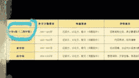

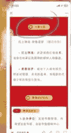

这种能写好不？

可以

什么时候交？

下周五（5 月 16 日）给我就行了

可以，

就写小学组的，不用限定三年级，可以往高年级写写

## 第三层：个人生活展示（20%）—— 生活感满满的真人

目标：让家长觉得“你是一个有血有肉、值得信赖的活人”。

### 1. 适度展示：

内容：你在看书、运动（如您的“体育课”）、参观博物馆等能体现积极生活状态的场景。

文案模板：充电时间。保持阅读，才能持续为大家输出高质量的观点。📚

### 2. 价值观输出：

内容：分享你对教育、成长的感悟，展现您的内核。

文案模板：我一直坚信，教育的本质不是灌满一桶水，而是点燃一把火。

### 3. 互动提问：

内容：发起一个与你领域相关的轻松话题，邀请朋友圈互动。

文案模板：朋友们，你们觉得对孩子来说，最重要的品质是什么？评论区聊聊。

在线修改稿件中

冲，为了多一个奖项

为了孩子的未来

帮写的征文获奖啦实在

没想到会有后续哈哈哈，

毕竟我也只是个接单的...

不能因为时间耽误我们的

稿件质量哈

昨天晚上醒来 7:00 就收到

一个急稿

还要要求获奖！...

我们加的稿子包修改吗？

肯定是包修改的哈！

晚上的一个急单

帮助每个家长获奖！

晚安

各位家长朋友们 我们这

边都是先付全款再开始

定做的哦

## 总结：

将朋友圈视为个人名片。家长只要连续翻

阅一周，就能完整地建立起对你“专业、

靠谱、有趣”的立体认知。

### 3 怎么和家长沟通需求？

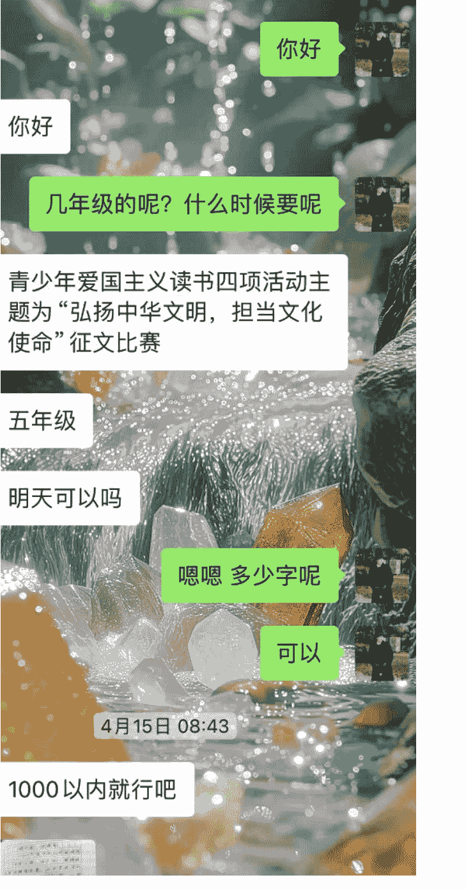

1. 围绕中华民族现代文明的科学内涵/45 擦亮历史文化“金名片”——北京中轴线焕发时代新韵 这个章节来写
2. 有孩子去北京旅游的亲身经历
3. 偏故事记叙类

4 月 15 日 10:09

嗯好的，收到

4 月 15 日 16:26

中轴线上的心跳...better.docx 11KB

家长，您好。辛苦看看

4 月 15 日 16:32

这个里面的内容是那个书里面的吗

还是您想象的？

标题好好哦

4 月 15 日 16:34

最后能不能再加个结尾呢

加结尾就超过 800 了

是的

字数有要求吗

好的

> better me:1000 以内就行吧

我结尾

4 月 15 日 17:08

中枢线上的心跳

### 销转话术核心：从审问客户到引导客户自然说出自己的需求

新手最容易犯的两个致命错误：

- 缺乏“价值铺垫”，像审问一样直接提问。(客户心理：你谁啊？我为什么要告诉你？)
- 问题过于开放，无法引导出有效信息。(客户回答“都行”，对话直接终结)

### “话术模板：

（在寒暄后，自然切入）

“家长您好，为了我能更精准地帮孩子构思，需要跟您确认几个关键信息~

（一句话完成价值铺垫，让对方有心理准备，并理解你的专业性）

#### 【锁定范围】

> “咱们这次是需要准备什么主题和类型的作文呢？是学校布置的命题作文，还是像‘冰心杯’、‘叶圣陶杯’这类具体的竞赛？如果有题目要求文件，可以直接发我。”

重点：给出封闭式选项（命题/竞赛），而不是开放地问“写什么”。这能快速锁定方向，避免无效沟通。

#### 【评估难度】

> “方便告诉我孩子现在读几年级吗？以及大致的截稿日期是什么时候？这样我能把握好文章的深度和时间安排。”

重点：将年级和 截止日期绑定在一起问，显得你非常有计划性，同时让家长感受到急切性 也能促进成交。

#### 【挖掘亮点】

> “这一点最关键：孩子平时有什么特别喜欢的兴趣爱好、或者印象深刻的经历吗？比如特别喜欢读历史、爱打篮球、有养小动物、或者参加过某个难忘的夏令营？我们尽量把文章的‘魂’立在孩子真实的特点上，这样写出来才独特、不生硬。”

重点：这是你的价值核心，不要问空泛的“有什么要求”，而是引导对方思考“孩子的个性”。这立刻将你与简单代写的区分开，展示了你的专业方法论——“基于真实素材进行创作”。当家长开始认真思考这个问题时，他已经认可了你的价值。

#### 4. 话术闭环：

当您拿到这些信息后，可以总结一句：

> “好的，信息我都收到了 (比如，X 年级，参加 XX 比赛，孩子喜欢 XX)。预计是下周二给到您 word 版本的作文。我们这边是先付款后写作的，麻烦您支付下 XX 元哦~

收到后可以说一句：”感谢信任，有问题我们随时沟通哦“

better me / 优质/ 合作 3 次

4 月 15 日 08:40

我是 better me

以上是打招呼的内容

你已添加了 better me，现在可以开始聊天了。

你好

你好

几年级的呢？什么时候要呢

4 月 15 日 08:42

青少年爱国主义读书四项活动主题为“弘扬中华文明，担当文化使命”征文比赛

五年级

明天可以吗

嗯嗯 多少字呢

02:03

better me / 优质/ 合作 3 次

可以

1000 以内就行吧

这是孩子写的

better me / 优质/ 合作 3 次

我觉得太空洞了

老师让明早交可以吗

我重新写吧

好的

可以。明天早上给你

多少钱

100/篇哦

好的

4 月 15 日 08:46

麻烦您先支付我一下哦🌹我大概明天早上给您内容

详细和我说说，我融入

> cream 莹^: 他们学校的课后服务无人机，

4 月 22 日 08:19

就是学校有很多类型课后服务，无人机是其中一个，，然后成绩好的孩子，一个班选两个去，再选拔培优，然后后期可以参赛，

刚开始学，目前学了绕椅子飞一圈，然后要稳稳停在椅子上

原来如此好的这个故事案例我得融合进去。然后再发挥孩子的童真和想象力哈

4 月 22 日 08:26

01:58

4G 35

## 合作 2 次

非常感谢

哪吒精神和读书活动结合到一起

4 月 8 日 15:33

嗯嗯 要结合书本

嗯呐

辛苦了哈

4 月 12 日 17:24

今晚能交稿吧？明天交了哦

4 月 12 日 18:40

按住说话

cream 莹^

最低了家长

我们这里很多都有获奖作品的 所以质量有保证

50 可以吗

3 月 24 日 22:15

行吧。您转我下 30 的定金哦

我大概周三可以给到

¥30.00 已被接收

就是要有四年级孩子的感觉，不要太成人

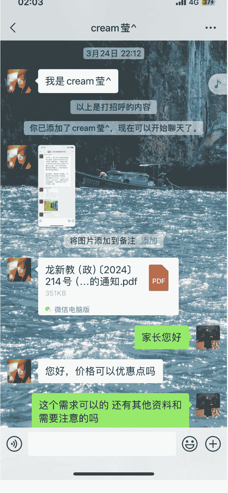

## 高复购怎么做？

核心中的核心是高质量，但凡孩子的作品获奖过一次的作品。家长下次大概率还会找你

## 让复购发生的核心心法

从“广撒网”到“精准提醒”：放弃群发。沟通都带上对方的历史信息（孩子名

字、上次比赛、获奖情况），让对方感觉您是真心关注他们，而非机械群发。

成为“赛事规划专家”，而不仅是“写手”：您的价值不仅在于写，更在于信息差。主动告知家最近有什么比赛可以参加，从被动接单，变成了不可或缺的指导老师。

用“专属感”替代“推销感”：“优先名额”、“老客户福利”这样的词汇，会让对方感到被重视，将商业交易转化为一种更有黏性的伙伴关系。

## 怎么做？

将您的老客户备注好，根据对他们需求的了解，选择以上最合适的策略，开始一次精准的、一对一的“复购激活”行动。

## 东老师

这三个用户，都是第一次合作就帮他们拿到了一等奖的征文！❤️🏅

后面有需要写的征文，都是第一时间就找到我，

_______

有时候第一次合作，客户不相信我们家其实用户的评价就是我们最好的口碑，

_______

半个月合作 3 次的客户真的不少我们这边的家长基本上合作过一次就会回来继续找我！

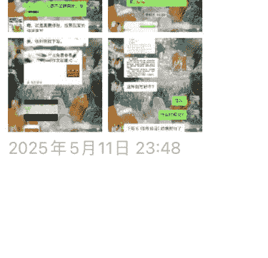

2025 年 5 月 11 日 23:48

8 月 15 日 17:57

哈喽宝，上次写的征文还满意不，最近暑假又到了，我来揽活了哈哈，不知道你有没有需要写的稿子呀，暑假一本书作文，比赛征文结课作业，ppt 都可以做哦。宝子有兴趣可以细聊（朋友圈也有介绍）

8 月 18 日 20:29

你好

可以的

这个价格多少呢？

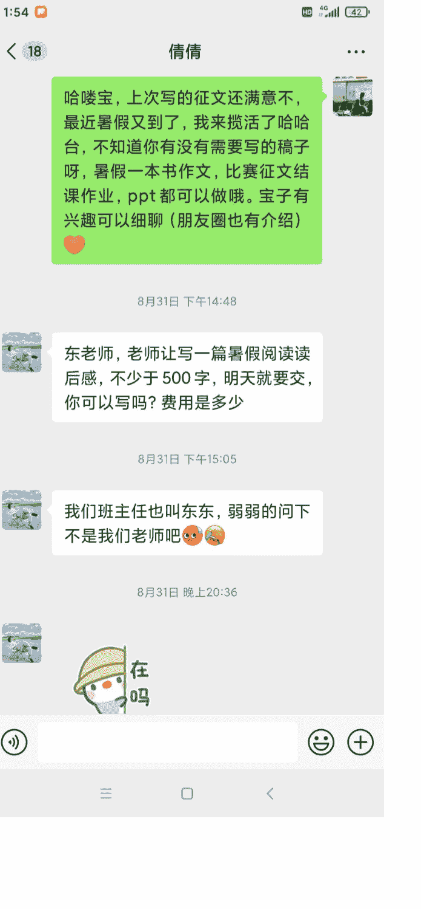

### 最后，安利小懒的付费群：

懒人专属群（介绍）

#### 💬 懒人专属群持续更新中，已持续运营 6 年，整理超 3000 份各类精选付费文章 & 年费社群干货，全部开放下载。

### 本资料为付费群内部分享，仅供真实有需要的朋友查阅🎁

### 懒人专属群更新记录：

https://hk57gvlx7u.feishu.cn/docx/H0kRdZbSbolBR0xkaXtcuVE0nTg

### 懒人专属群更新记录 (需梯子，备用):

https://lazybook.fun/blog/record2