# 深度调研：2025 年家具工厂出海，9 个蓝海

产品推荐

## 251118 生财精华

公众号懒人搜索，懒人专属群独享

懒人微信：lazyhelper


### 一、自我介绍

Hello 大家好，我是清秋。今年是创业第二年，擅长深入社媒、挖掘国内外的蓝海产品，帮助工厂线上获客，定宣传和运营打法，帮企业快速拿到结果。这是我在生财的第二篇帖子。

### 本文目录

- 一、自我介绍
- 二、本文使用方法
- 三、没有出海经验的厂家，从哪个平台起航？
- 四、短视频平台的选品技巧
- 五、以佛山家具工厂的沙发为例，分析短视频拍摄技巧&文案&怎么留联系方式
- 六、6 月 -11 月蓝海的地区性产品 or 全球性产品
- 七、致谢

### 二、本文使用方法

#### 谁适合看

这篇文章主要是给有自有供应链和工厂的老板、打算出海或已经在出海路上的老板看的。

#### 快速阅读

(1) 如果有想做的目标市场：

- ① 可以 Ctrl+F 搜索目标国家的名字，如果哪个评论区下面全是这个国家的用户要购买，清秋会单独提到。
- ② 更细的话，还可以点开清秋的评论区小图，看旁边的红字，清秋会标注用户地区，这里面还有很多信息。
- ③ 查看第六部分的产品后面标注的主要售卖国家

(2) 如果暂时还没有出海明确目标：

推荐可以全文阅读。篇幅受限，清秋前几版还写了详细的独立站和社媒的调研 + 同行分析方法，此处先按下不表，非常期待各位圈友可以和清秋进一步交流！

### 三、没有出海经验的厂家，从哪个平台起航？

答案是 TikTok 和 Instagram。清秋观察到的几乎所有家具卖家的账号，TK 和 Instagram 的数据都比 Facebook 数据好。而且 Instagram 的更新频率也比 Facebook 要高。

大部分独立站都有官号的平台是 Facebook 和 Instagram，很少人在上面宣传的平台是 YouTube。

### 四、短视频平台的选品技巧

主流平台分为电商平台和短视频平台，这两类平台的底层逻辑有一些差别。

我们的选品原则也是结合平台性质展开的，具体阐述如下：

#### (1) 技巧一：产品的功能或特点容易通过短视频展示

拍短视频的时候，要优先选择强视觉差异或核心功能的单品（如可伸缩餐桌），方便在视频中展示卖点。原因是短视频是“货找人”的场域，用户在刷 TikTok 的时候本来只是消遣一下，不像电商平台是带着目的性的“人找货”，所以要抓住用户是冲动消费为主导的这个特点。

可伸缩餐桌参考图：


尽量不要选择平平无奇的产品，比方说一个没啥特点的桌子。

也不用担心卖的太奇特了，别人光看不买，这只是引流步骤，接下来我们还有销转，还会给客户私发我们的产品单。

#### (2) 技巧二：优先选择“自带评论基因”的产品

咱们总是听说做线上要有网感，那么清秋给大家分享，培养网感的一条路径：刷短视频的时候，先不看评论，自己揣测用户会说什么，这是锻炼大家找爆点的能力，更是创业需要的揣摩人性、揣摩用户心理的手段。同样刷视频，我们比别人多做一步，我们就更能在残酷的市场竞争中活下来。

那么这个应用到选品上，我们可以想一想，面对这个产品，有什么想说的吗？如果除了问价之外想不到用户还会说什么，那这个产品的产品力就不是特别好。当然，这种情况下这个产品不是不能选，具体还要结合其他因素分析。

咱们第六部分的酒水柜，这个产品的“产品力”就很好，所以没有复杂的剪辑就爆了，TikTok 的用户自发讨论这个柜子装香水、墨西哥卷的场景巴拉巴拉

酒水柜展示图：

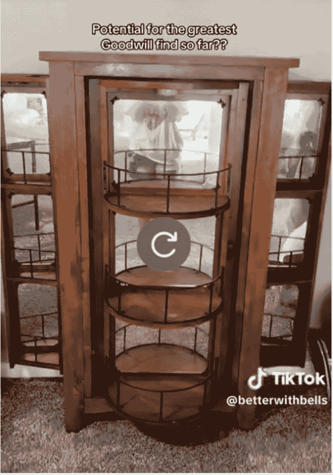

#### (3) 技巧三：小批量测品

如果想进一步稳妥，可以先不上货，把 3-5 款候选品挂网上，用一样的图和价格引流。3 天内点击超 500、咨询超 20 的，再备货，第一次就备 50-100 件。

### 五、以佛山家具工厂的沙发为例，分析短视频拍摄技巧&文案&怎么留联系方式

在家具这方面，清秋比较了很多账号，佛山的工厂是出海做的最好的了，和美国本土的一些号相比，我们国内拍摄剪辑这些自媒体水平都比他们更上好几层，目前来说，国内团队的运营能力和老外还是拉开了很大的差距的。

我们来看一下下面这个视频，这个视频在 Lemon8 和 TikTok 都有发布，他们团队也值得重点分析：

清秋把翻译后的文案放在这里：

> 我的天，这款沙发看起来就像一只章鱼，你绝对没见过。
>
> 它凭借其极具创意的章鱼造型，定价高达 3 万美元
>
> 一经推出，它就在高端家居设计圈爆红，但我们工厂凭借灵活的模块化设计，不到一周就完成了制作。
>
> 展开时，它是一把单人椅；折叠后，它就变成了一件艺术品。
>
> 这款沙发放在你的豪宅里，你派对上的每一位朋友都会抢着要坐它。
>
> 感兴趣的朋友，评论区扣 1，我给你们报个价：关注 Tangi，为您带来高品质且价格亲民的别墅家具。

#### 原视频的爆点是什么？

首先清秋先分析脚本做得好的地方，也就是爆点，然后再分析哪里还可以优化。

**优点：**

- ① 多机位拍摄 + 运镜：
    多机位的好处，清秋觉得第一点是从视觉上增加信息密度。我们刷短视频的时候，耐心程度都是随进度条递增的，也就是说，开头的时候决定了用户是不是留下来继续看。而这个章鱼沙发开头就是有一些运镜技巧在的，而且拍摄团队很巧妙的把沙发拆装成单个座位和整个章鱼的步骤省略掉，直接展示成果，这也是增加信息密度。

    关于信息密度这个点，清秋稍微展开说一下：举个例子，一个女生口播：“很多人都担心自己的闺蜜会和老公...”、“咱们就说这个女人的格局一定要大...”背景恰好就是自己的闺蜜和老公在后面聊天，那她如果说就在自己的房间里说，肯定没有这种多一层视觉信息效果好。就算她再讲述一下闺蜜和老公聊天，这个进程也很慢，开头的信息不够爆炸，违背了耐心递增的原则。

    这个账号在 TikTok 上另一个点赞量 32 万的视频，敲碎瓷片、快速切镜头，同样应用了开头信息爆炸的优势。这个视频也是他们团队数据最好的一条：

#### 视频翻译：

> 谁在说“中国制造质量差”？
>
> 看这里，1.5 万美元就能在我们工厂配齐一整套家居。
>
> 草编沙发，我们工厂已量产；章鱼沙发，我们工厂已量产；
>
> 弗莱彻餐桌——全球结构最复杂的餐桌，我们工厂终于攻克量产。
>
> 深海餐桌，桌面宛如澎湃海面，我们工厂也已成功量产。
>
> 沙丘沙发，无论摆放何处，都是焦点；
>
> 飞机柜——被誉为“全球最美柜体”，我们工厂已量产；
>
> 主管椅，我们工厂已量产；
>
> 悬浮床，我们工厂已量产。
>
> 评论区扣 1，我发产品图册给你。

这个章鱼沙发的品选的也好，很符合清秋前面提到的“外观或功能吸引用户、容易通过视频展示”。

- ② 社交价值：朋友来 party 也足够体面
- ③ 利用用户花小钱办大事的心理：“本来定价 3 万美元，我们工厂现在已经量产”
- ④ 多个吸睛姿势展示沙发的软：因为手机这个媒介决定了短视频咱们只能从视觉和听觉去展示，但是这个沙发的触觉怎么办呢？可以看到这个主角拍摄的时候，他是“葛优躺”到沙发上、趴在沙发上的，光姿势就有五六个。而且再抠细一点，这个主播的躺着的表情也很放松，给人感觉他在沙发上得到了充分了休息。运营就是要抠细节，我们越抠细节，市场给的正反馈越强烈。
- ⑤ 文案锚定有购买力的客户。原英文文案里提到"took the hot luxury home..."(登上豪华家装热点)、"bring you...villa furniture"(带来...别墅家具)，这都在锚定高端家装客户。

第四个优点还可以怎么加强？我们可以从一个较远的地方跳进沙发里（如下图），这个是更能凸显我们沙发很软的。

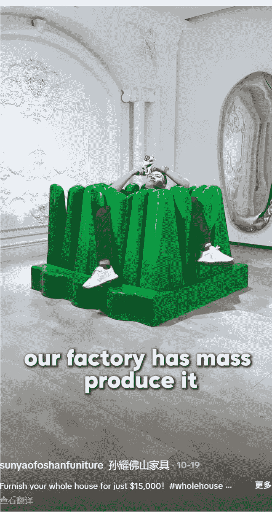

那么还可以怎么优化脚本呢？如果是清秋来策划脚本，清秋会把国内美妆博主宣传大牌平替的那一套拿来，叠加展示咱们工厂生产的过程：

不管用讲故事、素人分享、还是拍制作过程，这些所有的宣传的核心都是变着五感角度、变着视角晒咱们的产品有多硬、服务有多好。

#### 章鱼沙发的脚本优化

**视频时长：** 60-75 秒
**风格：** 快节奏、信息密集、信任感强

##### (0-3 秒) 悬念钩子

**画面：**
手机屏幕特写，正在播放一条国外设计博主的短视频，内容就是著名的“章鱼沙发”，配文"$30,000 Masterpiece".

**文案（画外音，语速快，带着不服气的劲头）：**

> “就这个沙发，同行卖 3 万刀！凭啥？”

##### (4-15 秒) 提出平替 & 展示投入

**画面：**
镜头突然拉远，展示大厅摆着两台沙发：一台是正品 (或极高仿的 1:1 模型), 一台是我们工厂生产的平替版。
桌面上散落着一堆采购单据、物流单 (打码关键信息), 视觉上给人看起来很震撼。

**文案 (画外音):**

> “我们不信这个邪！自费几十万，把原版买回来，1:1 拆解、对标、打样！今天就让你们看看，我们中国工厂做的平替版，到底差在哪儿！”

##### (16-35 秒) 核心对比：设计&工艺

**画面：**
【对比手法】 分屏镜头！左边原版，右边平替。
镜头 1: 对比整体造型、曲线。
镜头 2: 对比形变的流畅度。两个画面同步进行，几乎看不出区别。
镜头 3: 手部特写，抚摸两者面料；用卡尺测量关键部位的厚度或者做工。

**文案 (画外音):**

“来看，造型一模一样，模块化变形比原版还顺滑！”
“面料，我们用的同样是意大利进口科技布；框架，我们是更扎实的铝合金！它卖 3 万刀是品牌溢价，我们卖 XXX 元，是材料和工艺的良心价！”

##### (36-50 秒) 暴力测试 & 实力证明

**画面：**
一个壮汉测试员，反复、快速地在平替沙发上进行沙发耐磨损测试，XX 次后依旧稳固。
切一个工厂车间的快剪镜头：数控机床在切割材料，老师傅在手工打磨细节。

**文案 (画外音):**

“我们经过了 10 万次疲劳测试，保证十年不变形不异响！”
“因为我们就是 XXX 品牌的同源代工厂！我们太知道好家具该怎么做了！”

##### (51-60 秒) 场景构建 & 高级 call to action

**画面：**
切换到一个精致的豪宅客厅场景，一位模特优雅地使用沙发，朋友们投来欣赏的目光。
画面中央出现显眼的文字和 Logo。

**文案 (画外音，语调自信、收敛):**

> “所以，用 3% 的钱，享受 100% 的设计感和品质，这事儿成不成立？”
> “适合懂行的你。不公开报价，请私信‘章鱼’获取专属资料与目录。关注 Tangi，重新定义你的家居价值。”

看到这里，有老板可能会觉得清秋说的这个脚本拍起来太麻烦了，但清秋举这个例子是想说明：国内的自媒体打法搬到国外都是降维打击的，我们有 n 种方法更抓人地拍出来获客视频。我们可以选择拍出来足够获客的中等难度视频，同时等环境变卷的时候我们也有办法应对。

以前的 TikTok，固定机位拍一下机器都能火，现在咱们起码需要真人出镜 + 混剪 + 配乐潮流才能拿到一个好的效果了。

#### 关于留联系方式：

咱们的佛山友商没有花钱开独立站，也没有经营亚马逊店铺。基本都是让客户扣 1 然后私信对方，或者直接从主页联系，用的是 WhatsApp。


#### 链接

WhatsApp me
wa.me/8618138501793

Foshan Furniture Factory
Facebook 公共主页


接下来咱们点进孙耀佛山家具的 TK 主页，判断一下现在 TikTok 获客的难易程度。


这个号从一开始封面都是统一的，这说明运营人员不是小白，有一定经验。固定标题"foshan furniture"（佛山家具），另一个标题是产品名/材质。

### 六、6 月 -11 月蓝海的地区性产品 or 全球性产品

#### 镜子 - 实木挂钩板 - 全球

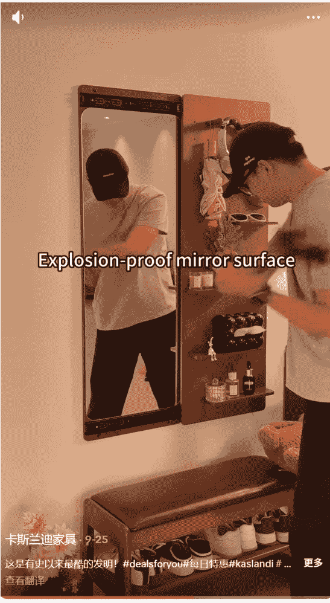

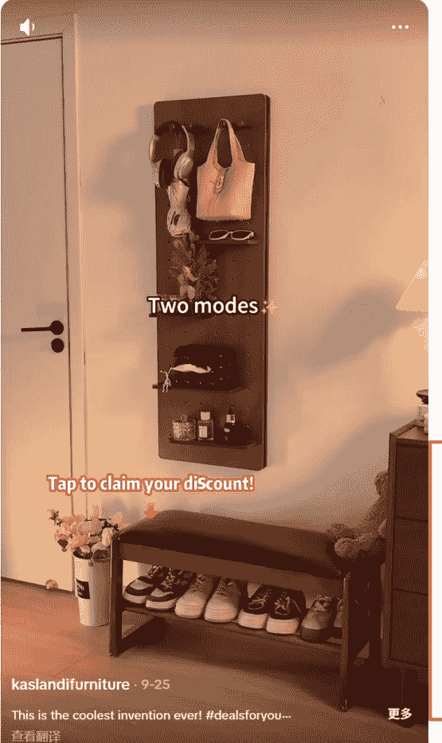

视频发布于 9 月 25 日，厂家说这是专门为了部分晚上不想看到镜子的美国人设计的，镜子做了防爆设计，而且可以收起来。视频点赞收藏转发的数据都不错，评论 115 条，略微有一点少，可能是因为这个视频有挂小黄车。最重要的是商家回复说已经缺货了，评论区还是有人一直在问怎么买。


最近的几个小时一直都有人要链接：

温馨提示：以下所有图片，但凡出现了小语种的，清秋都已经注明用户的地区，老板们点开小图就可以看到！

#### 评论 (115)

| 用户 | 评论内容 | 时间 | 状态/回复 |
| :--- | :--- | :--- | :--- |
| Benfrankrams | How much 多少 | 5 小时前 | 回复 |
| Kaslandi·创作者 | I've put the link in the bottom left of the video. Unfortunately, it's so popular that it's out of stock right now. Please follow my account--I'll notify you the minute it's back in stock! 我已经把链接放在视频左下角了。可惜的是，这款产品太受欢迎了，现在已经售罄。请关注我的账号——一旦补货，我会第一时间通知您! | 1 小时前 | 回复 |
| mayonesa picante | 400€💀400 欧元💀 | 6 小时前 | |
| RIRIONTHEBLOC | As a superstitious person I NEED THISS 作为一个迷信的人，我需要这个 | 7 小时前 | 查看 1 条回复 |
| user9567515004489 | do you ship to australia 重试 错误原因 | 4 小时前 | |
| Christine Mariane Orpiano | How to buy? 重试 错误原因 | | |
| Nani | whereto buy?? 哪里购买？ | 1 天前 | 回复 |
| Kaslandi·创作者 | I've put the link in the bottom left of the video. Unfortunately, it's so popular that it's out of stock right now. Please follow my account--I'll notify you the minute it's back in stock! 我把链接放在了视频的左下角。遗憾的是，它太受欢迎了，现在已经缺货了。请关注的账号——一旦补货，我会立即通知您！ | | |
| AlwysPrvddPrctd | How to buy this 如何购买这个 | 1 天前 | 回复 |
| Kaslandi·创作者 | I've put the link in the bottom left of the video. Unfortunately, it's so popular that it's out of stock right now. Please follow my account--I'll notify you the minute it's back in stock! 我把链接放在了视频的左下角。遗憾的是，它太受欢迎了，现在已经缺货了。请关注的账号——一旦补货，我会立即通知您！ | | |
| Fablán Montes | 西班牙语问价 Me gusta, donde lo venden ? | | |
| williamsilva6266 | quanto 多少 | 4 小时前 | 回复 (葡萄牙语国家) |
| Kaslandi·创作者 | I've put the link in the bottom left of the video. Unfortunately, it's so popular that it's out of stock right now. Please follow my account--I'll notify you the minute it's back in stock! 我把链接放在了视频的左下角。遗憾的是，它太受欢迎了，现在已经缺货了。请关注的账号——一旦补货，我会立即通知您！ | | |
| Miguel Salgueiro | no MDF is MDP 无 MDF 即无 MDP | 4 小时前 | |
| CvJake | where to buy? 哪里购买？ | 1 天前 | 回复 |
| Kaslandi·创作者 | I've put the link in the bottom left of the video. Unfortunately, it's so popular that it's out of stock right now. Please follow my account--I'll notify you the minute it's back in stock! 我把链接放在了视频的左下角。遗憾的是，它太受欢迎了，现在已经缺货了。请关注的账号——一旦补货，我会立即通知您！ | | |
| 公众号懒人搜索，懒人专属群分享 | | 1 小时前 | 回复 |
| brucesummers893 | So many questions - where to buy? Take my money? How to get it? I need it 这么多问题——在哪里购买？拿走我的钱？如何获得它？我需要它 | 1 天前 | 回复 |
| Kaslandi·创作者 | I've put the link in the bottom left of the video. Unfortunately, it's so popular that it's out of stock right now. Please follow my account--I'll notify you the minute it's back in stock! 我把链接放在了视频的左下角。遗憾的是，它太受欢迎了，现在已经缺货了。请关注我的账号——一旦补货，我会立即通知您! | | |
| 马来西亚客户 | | | |
| Meno | Nak order mana? 您要订购什么？ | 1 天前 | 回复 |
| Kaslandi·创作者 | I've put the link in the bottom left of the video. Unfortunately, it's so popular that it's out of stock right now. Please follow my account I'll notify you the minute it's back in stock 我把链接放在了视频的左下角。遗憾的是，它太受欢迎了，现在已经缺货。请关注我的账 旦补货，我会立即通知您。 | | |

创作者视频

在走廊里那个槽位放 LED 灯吧

这是任天堂 Wii 运动歌曲

我需要这个

I've put the link in the bottom left of the video.
Unfortunately, it's so popular that it's out of
stock right now. Please follow my account—I'll
notify you the minute it's back in stock!
我在视频的左下角放了链接。遗憾的是，它太受
欢迎了，现在已经售罄。请关注我的账号———
一旦有货，我会立即通知您!

天哪，我想要一个!

I've put the link in the bottom left of the video.
Unfortunately, it's so popular that it's out of
stock right now. Please follow my account—
notify you the minute it's back in stock!

#### 原视频:

https://www.tiktok.com/@kaslandifurniture/video/7553952605018295582

竞争格局也非常 nice，拿到谷歌搜同款，
在独立站和亚马逊都没有卖的:

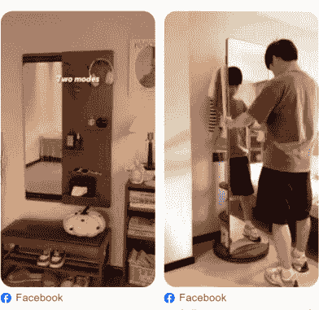

#### 酒水柜 - 全球

这个发布于 10-19 号的只有 7 秒的视频拿到了 70 多万赞，博主说这是自己淘二手淘到的，结果

评论区购买意愿相当强烈!2000 多条评论都表示非常羡慕，还有人询问品牌想购买。

#### 原视频:

原链接:

```
https://www.tiktok.com/@betterwithbells/video/7562745738254404895?q=Bar%20Cabinet&t=1762086579371
```

然后我们还是来看一下热评，往下划两页的评论平均点赞都是 6-7k:


| 用户名 | 原文内容 | 中文翻译 |
| :--- | :--- | :--- |
| rawrawttssarah | I've never been more jealous in my LIFE | 我这辈子都没这么嫉妒过。 |
| Bells · 创作者 | I NEVER imagined I would get this lucky | 我做梦也没想到自己会这么幸运 |
| Krelos515 | As a woodworker, I'm saving this for later. Looks like a fun project. 👓 | 作为一名木工爱好者，我先把这个收藏起来。看起来是个很有趣的项目。 👓 |
| Bells · 创作者 | Judging by the comments you have a lot of potential buyers! | 从评论来看，你有很多潜在买家！ |
| Sohaila | dream bar stand tbh 说实话，我梦想中的吧台 | |
| ekr1989 | It would be perfect for my Holo Taco collection 🤪 | 它简直太适合我的全息墨西哥卷饼收藏了 🤪 |
| Mar | That's so crazy I heard it looks much nicer next to an open unlocked window! 💜 | 太疯狂了！我听说它放在敞开的窗户旁边看起来更漂亮！ 💜 |
| Bells · 创作者 | If you can magically float it down three stories you've got it 🤝 | 如果你能神奇地把它从三层楼高的地方飘下来，你就成功了 🤝 |
| willow 🦋 | i heard that it's really good for the wood to leave it on your front porch unattended 💖 | 我听说把木头放在前廊上无人照看对木头真的很有好处 💖 |
| JohnSeriousmen | | |
| Just Sam | the ONE time I'm praying for a TikTok shop link 😩😭 | 我唯一一次祈祷能找到 TikTok 店铺链接😩😭 |
| Ryllie | You win 🥺🙌 | 你赢了😩🙌 |
| Lex | How I be showing up to your house | 我该如何出现在你家 |
| sexyjandra ;) | omg this would be perfect for all the girlies who have a lot of bath and body works products. | 我的天哪，这对于拥有大量 Bath & Body Works 产品的女孩们来说简直太完美了。 |
| Row 🦋 | does it have any brand marking on it anywhere? i've been looking for something like this for storage... | 它上面有任何品牌标识吗？我一直在找类似这样的收纳盒...... |
| Bells·创作者 | I posted a new video answering questions and showing the markings! | 我发布了一个新视频，回答问题并展示了标记! |
| Gracieeee B | It's a box for my trinkets | 这是一个装我小饰品的盒子 |
| Liyah 🙋 | literally thought you were gonna show us Narnia 🙃 | 我真的以为你要带我们去看纳尼亚传奇呢🙃 |
| degg | I'm obsessed | 我着迷了 |

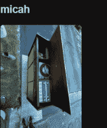

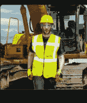

#### 可折叠壁柜 - 全球


这个视频是发布于 24 年 12 月，一直有陆陆续续的咨询。这个桌子配送范围是美国和加拿大。评论区有不同国家的人问怎么买，包括英国、德国、瑞典、加拿大、马来西亚、墨西哥等。

下图是清秋截取的评论区情况:


| 用户名 | 问题/评论 | 回复/翻译 |
| :--- | :--- | :--- |
| JinusTinyHat | hi! will you be shipping to the UK soon? | 你好！你们很快就会运送到英国吗？ |
| smartfurniture_gta·创作者 | unfortunately not, we only ship within Canada and the USA | 不幸的是，我们只在加拿大和美国境内发货 |
| HANNAH JAHA | Do you also ship to Germany? | 你们也运送到德国吗？ |
| smartfurniture_gta·创作者 | Unfortunately not | 很遗憾没有 |
| PureTot Party | Canada how much? | 加拿大多少钱？ |
| smartfurniture_gta·创作者 | $559 | |
| Elizabeth cyey | How much 多少 | |
| Nur Arif | Do you ship to malaysia? | 你们运送到马来西亚吗？ |
| smartfurniture_gta · 创作者 | Unfortunately not | 很遗憾没有 |
| Bruna and Lizzy | Need this! | 需要这个！ |
| missanne_collects | 💖💖💖 | |
| Olga_BlondieGk | Absolutely beautiful | 绝对美丽 |
| smartfurniture_gta · 创作者 | Thanks! | 谢谢！ |
| Gabriella | Do you ship to Sweden? | 你们运送到瑞典吗？ |
| smartfurniture_gta · 创作者 | Only Canada and USA | 仅限加拿大和美国 |
| Leonel Garcia | hacen envíos a México? | 你们运送到墨西哥吗？ |
| smartfurniture_gta · 创作者 | unfortunately not | 不幸的是没有 |
| kaminoronha | @Gabriela | |
| Love Amporn | hello how order it thanks | 你好如何订购它。谢谢 |
| smartfurniture_gta · 创作者 | our website | 我们的网站 |

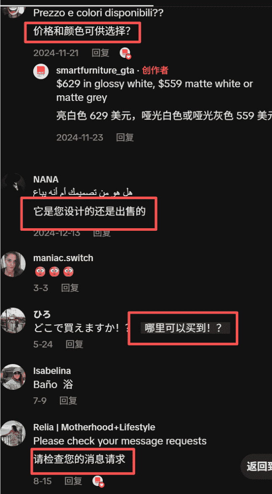

#### 原贴直达:

```
https://www.tiktok.com/@smartfurniture_gta/video/7434232123529235767?q=Space%20saving%20office%20furniture&t=1761834181950
```

还有一个很类似的产品，也是基于省空间设置的，清秋也截图放在下面。

公众号懒人搜索，懒人专属群分享


nikemoison96 麦克风 96 · 7-6 · 7-6

This foldable desk is amazing to save space! #foldabledesk ...

54.2K

232

14.1K

7442

28/64

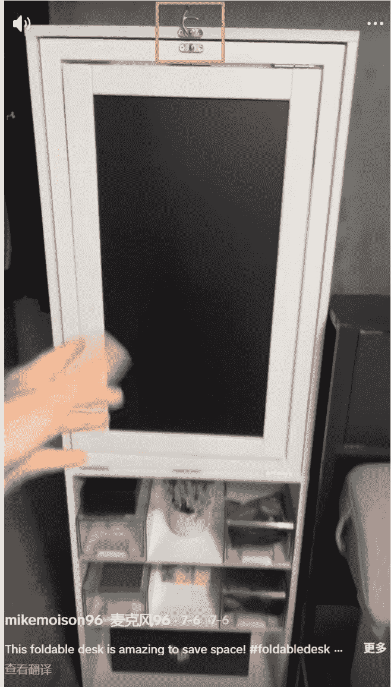

同样也是桌子可以收起来，而且有卡扣可以锁住架子上放的东西，这个视频有 5w 赞，评论区 232 条评论基本都是英文。

然后看独立站的竞争情况，竞争密度较低，划完前两屏才出现站点，前两屏是 facebook、instagram、pinterest 等页面。

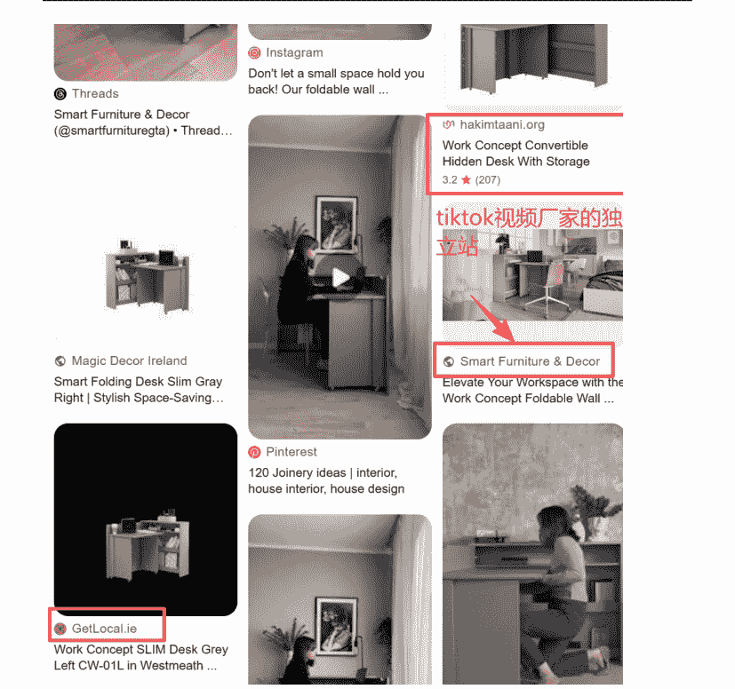

#### 人体工学椅 - 全球

这个视频发布于 9 月 30 日，有 170 万赞，点赞量是咱们这批产品里面最高的。

原链接:

```
https://www.tiktok.com/@dailydealswithpaige/video/7555697733764386062
```

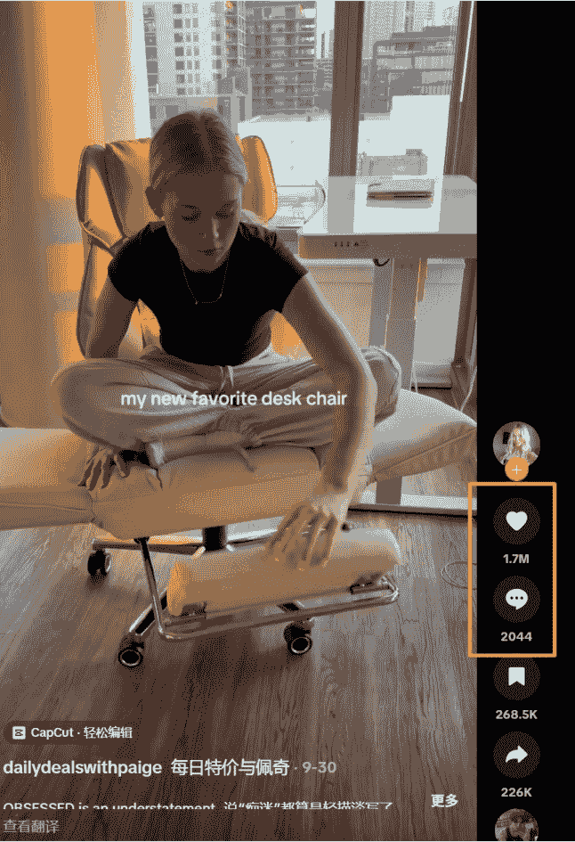

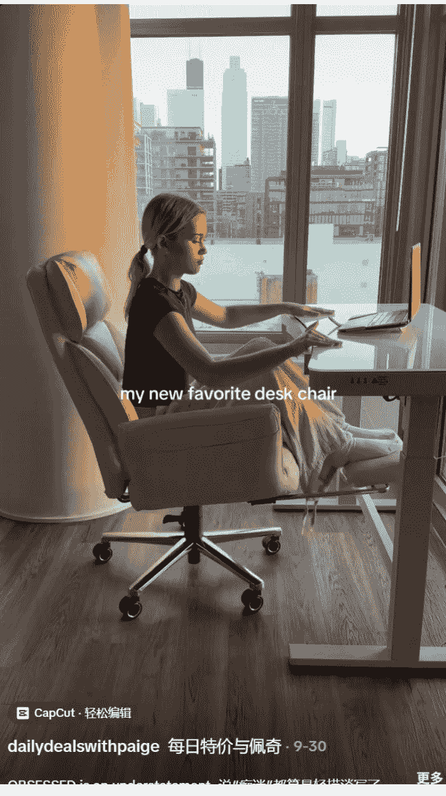

my new favorite desk chair

CapCut · 轻松编辑

dailydealwithpaige 每日特价与佩奇 · 9-30

OBSESSED is an understatement 说“痴迷”都算是轻描淡写了

更多

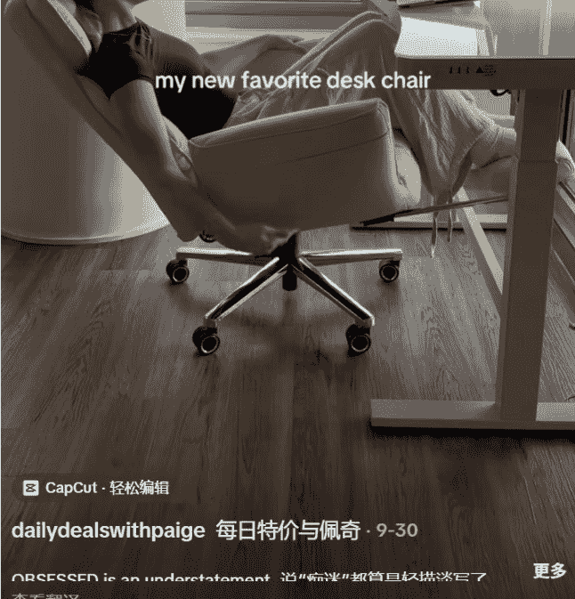

my new favorite desk chair

CapCut·轻松编辑

dailydealswithpaige 每日特价与佩奇 · 9-30

查看翻译

OBSESSED is an understatement 说“痴迷”都算是轻描淡写了

更多

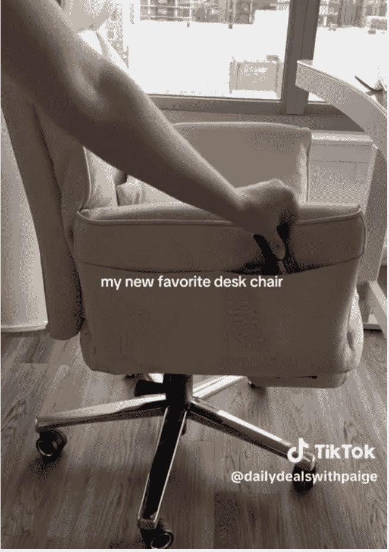

椅子有放脚的地方，两边扶手的地方都可以任意角度打开，侧边可以放零食。高度和靠背角度都可调。

2044 条评论，购买意愿非常强，有个俄罗斯用户问哪里能买的评论有 20k 点赞:

### 俄语地区用户

| 用户名 | 原文内容 | 中文翻译 |
| :--- | :--- | :--- |
| | no hate I love your chair 🤍 | 我没有恶意，我喜欢你的椅子🤍 |
| | I need that for school.. | 我上学需要那个。 |

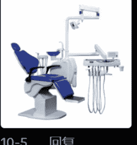

| 用户名 | 原文内容 | 中文翻译 |
| :--- | :--- | :--- |
| | cuánto cuesta y porqué tan caro? se paga con riñones? | 它要多少钱？为什么这么贵？难道要用肾脏来支付吗？ |
| ♡purpurrose♡ | я бы жила на таком стуле | 我愿意住在那样的椅子上。 |
| LaTreese Atkins 🍒⚡️🕐🧘‍♀️✨ | This is amazing 🤩 | 太棒了 🤩 |
| SANDRA ⭐ | "my new favorite desk chair" | "我最喜欢的新办公椅" |


| 用户名 | 原文内容 | 中文翻译 |
| :--- | :--- | :--- |
| evvu.lya | I NEED THIS CHAIR. | 我需要这把椅子。 |
| 10-9 | | |
| —— 查看 2 条回复 v | | |
| Horodenski | EU NÃO QUERO SABER O VALOR, EU QUERO SABER ONDE COMPRA | 我不想知道价格，我只想知道哪里可以买到。 |
| 葡萄牙语系客户需要，可能是巴西 | | |
| 10-7 | | |
| —— 查看 8 条回复 v | | |
| жена рей | стартовая цена 50 тыс долларов | 起价：5 万美元 |
| 10-3 | | |
| —— 查看 12 条回复 v | | |
| Vanessa Elsie | As someone who has a hard time sitting "normally" all day, I need this! 🙌 | 我很难整天“正常”坐着，所以我太需要这个了！🙌 |
| 10-6 | | |

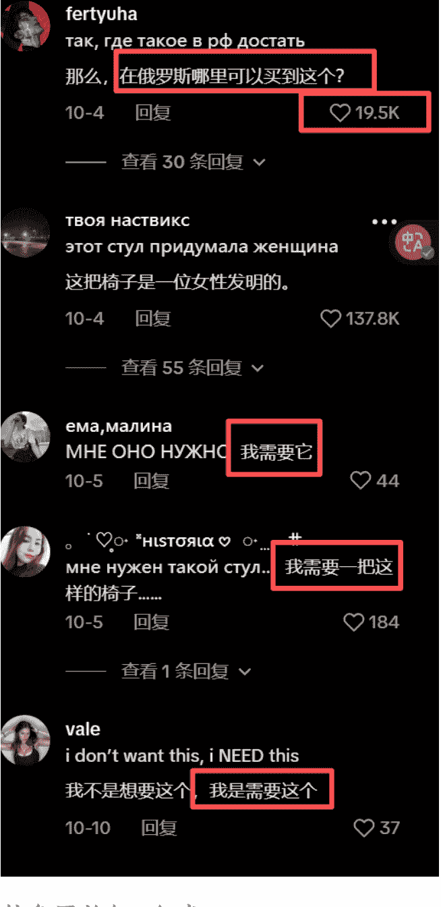

#### 转角置物架 - 全球

视频发布于一周前，7 万点赞，评论只有 288 条，和前面的相比来说评赞比偏低。

也是有一些英语国家和意大利、越南、西班牙等客户问价的。

| 用户名 | 原文内容 | 中文翻译/备注 |
| :--- | :--- | :--- |
| 🌸🌸 YANI 🌸🌸 | I hate when they post something and don't put where to purchase !!! | 我最讨厌他们发帖却不写购买渠道！！！ |
| 6 天前 回复 | | |
| —— 查看 12 条回复 | | |
| Yeffry Diaz93 | 😱 for my beautiful porsche's | 🤩为了我美丽的保时捷 |
| 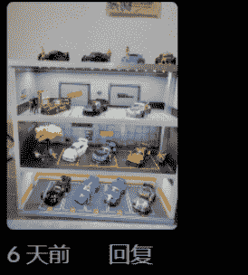 | | |
| 6 天前 回复 | | |
| 意大利客户 graziamancini0 | Dove posso trovarla | 哪里可以找到它？ |
| —— 查看 1 条回复 | | |
| Weezie | Love the shelves. | 喜欢这些架子。 |

#### 评论 猜你喜欢

| 用户名 | 原文内容 | 中文翻译/备注 |
| :--- | :--- | :--- |
| | I have no corners like this in my house. | 我家没有这样的角落。 |
| nelsonguio427 | precio 价格 | 意大利 |
| SHA Aviary | Price 价格 | |
| Umaru Doma | eu ameiiiii | 我太喜欢了! |
| BONNY | Nice !!! Where can I purchase it | 太棒了!!!请问哪里可以买到? |
| Lan | Xin giá | 价格询价 越南 |
| ——查看 1 条回复 | | |
| 10MS717 | bunlardan bizde nie yoxdu? | |


#### 类似的产品还有下面这些:

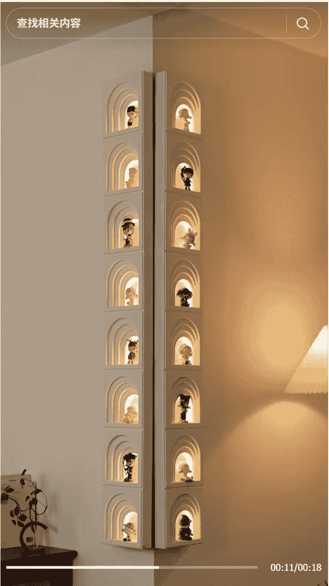


google 上没有 tiktok 完全一致的产品，有两个美国站点的类似产品。

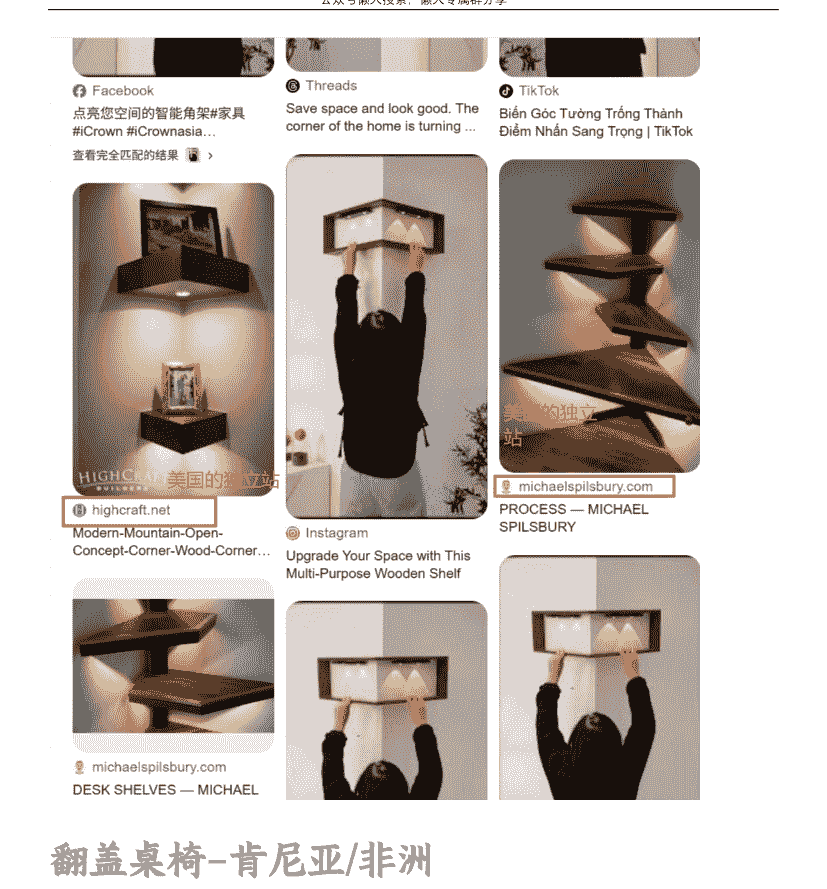

#### 翻盖桌椅 - 肯尼亚/非洲

这个是肯尼亚的一个公司做的，今年 3 月发的 tiktok。

这套座椅不用的时候能非常好的收起来推到其他地方，相当的省空间。这个视频有 10w 点赞，1809 条评论。

然后我们来看一下评论区的情况:

根据用户的头像和他们夹杂的当地语言来看，这个评论区基本全是非洲客户。1809 条评论中有大量表示需要的，归属地除了肯尼亚还有南非、尼日利亚等。

清秋这里截了部分评论出来:

| 用户名 | 原文内容 | 中文翻译 |
| :--- | :--- | :--- |
| ThatGirlPale | When I told my husband I need a movable office desk he laughed at me and said where will you find it ? In space omg I can't believe I need this now | 当我告诉我丈夫我需要一张可移动的办公桌时，他嘲笑我说你在哪里可以找到它？在太空中，天哪，我不敢相信我现在需要这个 |
| Makespace Functional Furniture·创作者 | wow. stories we love to hear. you can place your order via 0718.316.814 | 哇。我们喜欢听的故事。您可以通过 0718.316.814 下订单 |
| Sheakes | We also need this in South Africa | 我们在南非也需要这一点 |
| AI portrait | how much | 多少 |
| @Lucyhottie 25 | wow | 哇 |
| Jaydee@1944# | sema price tutoroke mbio 😂😂，it's nice thought.. tuma location | Sema 价格 Tutoroke mbio 😂😂，这是个好消息。图马位置 |
| 肯尼亚客户：报地址我马上过来 | | |
| Makespace Functional Furniture·创作者 | 😂😂 we are located in Ruai along Eastern Bypass. Makespace Functional Furniture on Google maps | 😂😂 我们位于东部绕道沿线的 Ruai。谷歌地图上的 Makespace 功能性家具 |
| Bright | Teni reposted ❤️ | 特尼转发❤️ |
| Gigie | vefurniture veZimbabwe huyai muone izvi tozvidawo izvi | 津巴布韦人民来看它。 |
| 津巴布韦客户说也需要 | | |

#### OVEN DRIED CATFISH IN IBADAN
太可爱了

Rembeka_Collections
This is so efficient 这太高效了

hildagade6/mama v
kazuri sana 佐奈一里

Xpensive Marvel
How much for this please
请多少钱

ministerngoizibello
Great work 👍 干得好 👍

Prince M Official.
Ngapi? 为什么？

Makespace Functional Furniture·创作者
KSH 17500 肯尼亚先令 17500

The Crown Prince (Norah)
bei hamtawahi ambiwa 贝·哈姆塔瓦希·安比瓦

Makespace Functional Furniture·创作者
goes for 17500 售价 17500

查看其它 9 条评论

Efman 96% 🤣👉💪 Liverpool FC
How can i get this
我怎样才能得到这个

查看 9 条回复

Tanitah Nitta
How much 多少

Makespace Functional Furniture·创作者
goes for 17500 售价 17500

查看其它 28 条评论

mama~abdimalik
wow 哇

DYNAMIC
wah 议员

肯尼亚人问价

user7776103541140
I need this too. I'm in South Africa
我在南非需要这个。I'm

Ronny
heri yeye 叶耶赫里

尼日利亚客户表示他们国家需要 650 人民币左右

Etienne 182
I know this can't be 17,500 NGN. For my country deh fit say 100K plus.
我知道这不可能是 17,500 NGN。对于我的国家来说，适合说 100K 以上。

Makespace Functional Furniture·创作者
KSH 17500 肯尼亚先令 17500

Hellen
Where are you based
你的基地在哪里
问地址

Makespace Functional Furniture·创作者
we are located in Ruai along Eastern bypass
我们位于东部绕道沿线的 Ruai

chinenye
i want it in Nigeria please
我想要在尼日利亚

Tony Asembo
17k kwani inakuja na nyumba?
17k，因为它有房子？

Bestfriend's Crochet
this is beautiful 这很美

Pal
Space saver🔥🔥🔥节省🔥🔥🔥空间

Selin Mendoza
how much 多少

Makespace Functional Furniture·创作者
goes for KSH 17500 售价 17500 肯尼亚先令

KIMZY DRIED FISH
What's your location pls
您的位置请在哪里

#### 有客户表示可以做成卡通主题

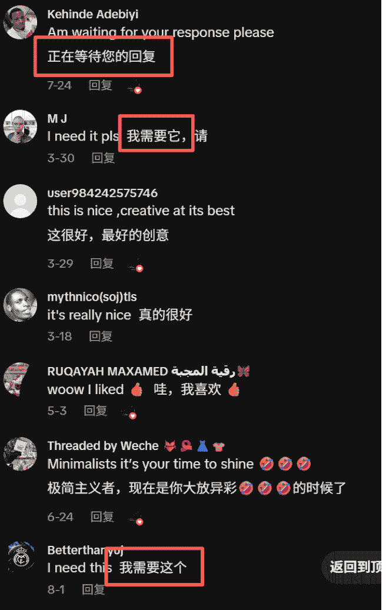

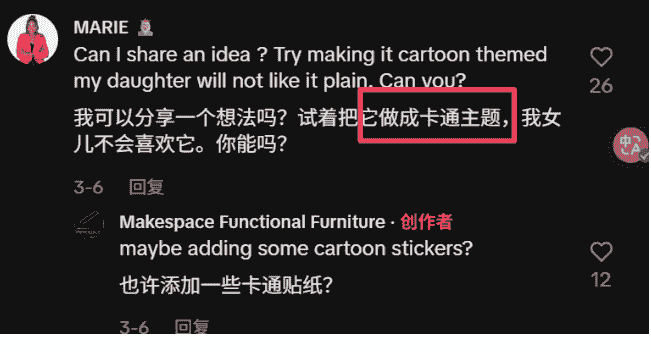

有非洲客户说太贵了（定价 17000 肯尼亚货币，人民币 935 左右）


#### 原贴直达

https://www.tiktok.com/@makespacekenya/video/7478636818544545030?q=Space%20saving%20office%20furniture&t=1761834181950

然后继续搜索其他平台的销售情况，竞争程度也非常低。独立站这边只有这位商家一个人在卖这个产品，其他的柜子只是有点像。

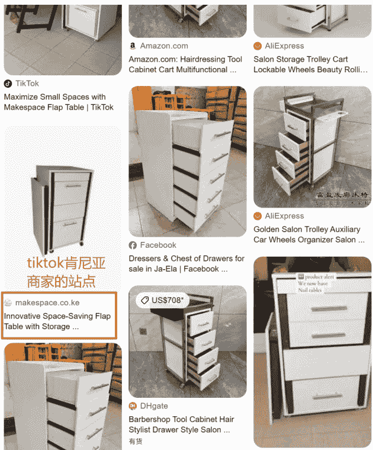

#### 自粘墙面装饰条 - 沙特/印尼

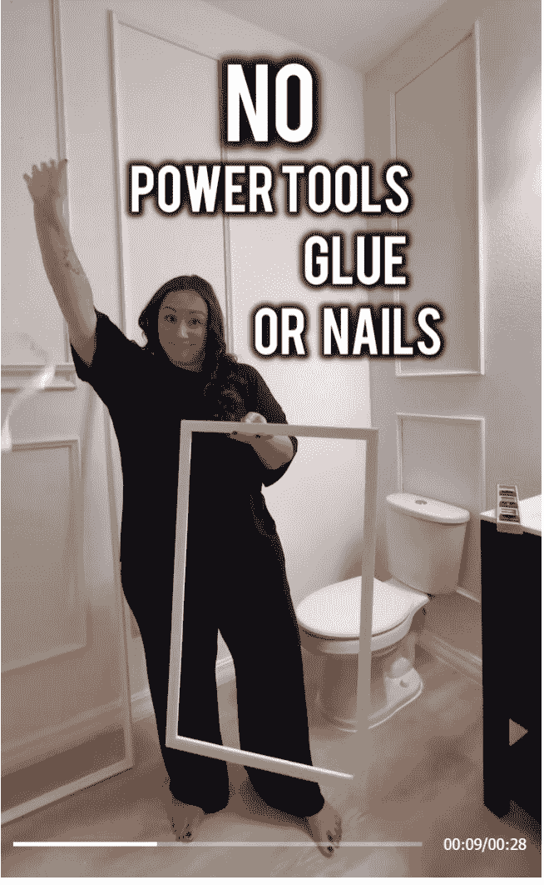


发布于 1 月 6 日，42 万点赞，3474 条评论。

这个自粘装饰条贴完之后，很明显的看到墙面的层次感一下就起来了，如下方视频：

这个定价比较贵，3 个 90 美元，评论区是大部分人都觉得贵，但大家是喜欢这个自粘条的，我们只要调整下定价就行，也很有利润空间。少部分人要链接。

清秋截了一下评论区的意见：

第一张图表示定价太贵了：

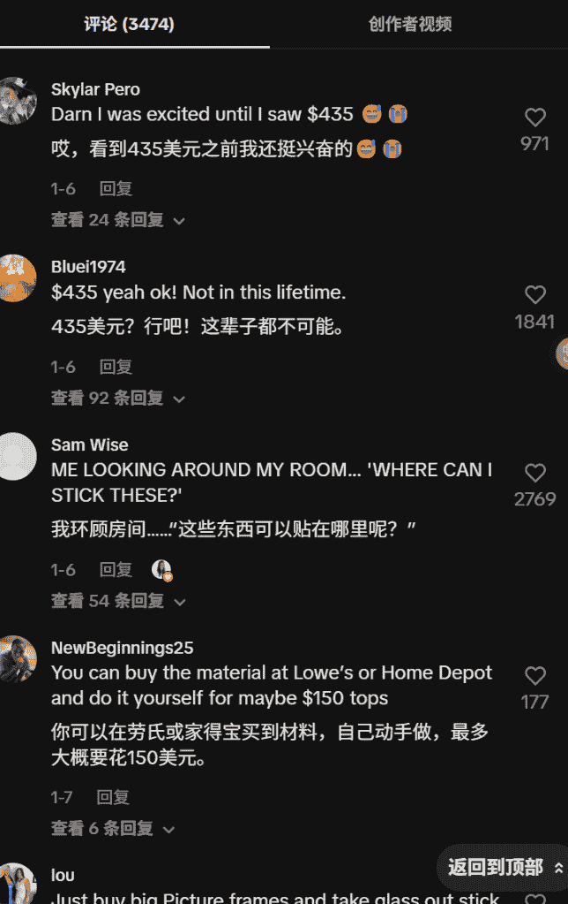

印尼的客户说他们就喜欢这种方便的产品，这条评论有 1729 点赞，说明其他印尼的人也比较认同：

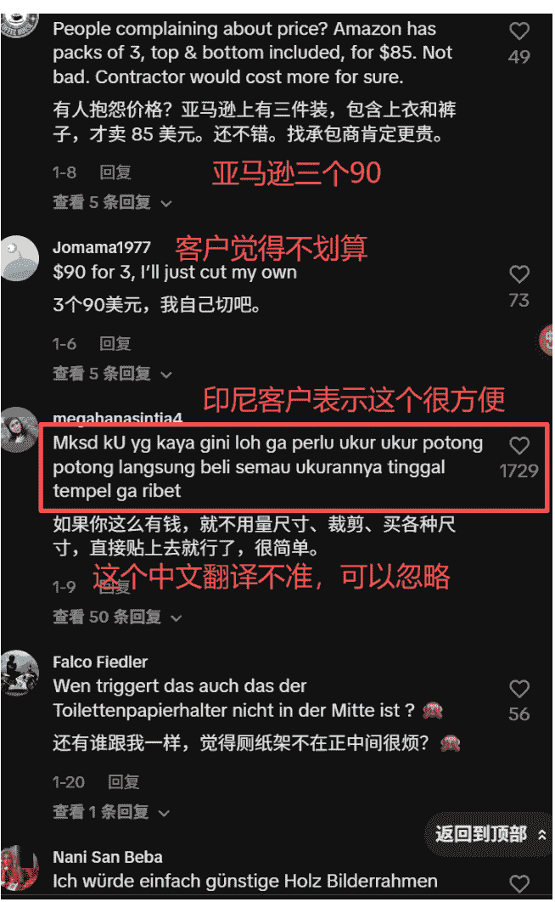

还有一些客户指出了可能存在的问题，比如不好清洁、不牢固：

Monik Gran
Eso nadamas sirve para retener mas polvo y limpiar uno por uno
那样只会积聚更多灰尘，让清洁变得更加困难。

有客户觉得不好清洁

Sophia
That really changes the whole look of the room❤️
这真的彻底改变了房间的整体感觉❤️
西班牙语，可能是墨西哥或者阿根廷、西班牙

Nihal89
Non le vendono su Amazon Italia
亚马逊意大利站不卖这个
意大利客户想买

mer
wah cocok ini buat mak2 ngak perlu bantuan tukang 👍
哇，这简直太适合不需要请维修工帮忙的妈妈们了 👍
印尼客户

_e_v_e_l_i_n_e_
A ja polecam Master Corgips-Gniewino. Tam kupicie listewki na ramki wykonane z gipsu (zbrojone włóknem szklanym). Tańsze, trwalsze i ładniejsze ✌🤗
我推荐格涅维诺的 Master Corgips 公司。在那可以买到石膏框架装饰条（玻璃纤维加固）。它们更便宜、更耐用、也更美观。

pengen banget beli yg udah jadi begini nggk perlu sewa tukang mahal2 tinggal tempel2 jadi deh
我真的很想买一个现成的，不用花钱请工匠，直接贴上去就行了
印尼客户想买

That Russian Barbie
I need this
我需要这个

NicMiller
Peel and stick wallpaper isn't totally secure, no chance this is staying on the wall without glue or nails!
自粘壁纸并不完全牢固，不用胶水或钉子根本不可能固定在墙上！
有客户觉得不牢固

Invisible
I could make this for fraction of the cost
我可以用很低的成本做出这个。

hope_live_breathe
I'd be too scared moisture would peel them...
我太太怕受潮了，它们会剥落，最后摔碎掉在地上

#### 还有一些其他国家的客户也想要：

rosagonzalez
Hola para pedirlo en Amazon? descripción, name ect..gracias
您好，请问如何在亚马逊上订购？请提供商品描述、名称等信息。谢谢。
西班牙或者拉美客户要链接

♡winnie♡
it's so easy to do this with moulding trim a saw and a mitre block and so cheap to do
用装饰线条、锯子和斜切块就能轻松完成这项工作，而且成本很低。

Sara Tarantino848
Non riesco a trovarle , qualcuno ha il link ?
我找不到，有人有链接吗？
意大利客户想要

LOLYA
作者评论道：“点击她账户里的链接，选择第一个选项......然后选择亚马逊，就能找到她的购物记录
沙特客户想买，但是只有小号
是他们只发货小号到沙特阿拉伯

原贴链接：

https://www.tiktok.com/@glamorouslyliving/video/7456548723301174559

清秋找了一下其他在卖这款产品的商家，没有找到竞品，只有一些帖子和这个博主自己发的其他平台。

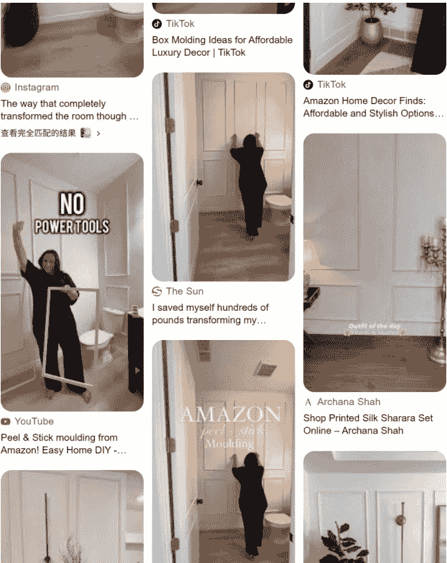

#### 办公桌 - 埃及

这个视频是 7 月 8 号发布的，有 1101 条评论。用的是埃及语言，一款非常普通的桌子，评论区几乎清一色全都是问价的，而且基本都是埃及人。清秋推断是埃及市场太好做了，大蓝海。这整个视频都平平无奇。

如果清秋做这条视频，我会在短视频下面写 1-2 行的文案：

短视频下面通常有一个能显示两行文案的地方，这个地方我们一定要写，不能空着。而且最好就写 1-2 行，不要让用户还要点开。

原因有三：

- ①这相当于平台多给了我们一次展示卖点、制造话题的机会，不写就是浪费这个机会。而且最好和视频里面加的字不一样，不要照搬。大家想一想，抖音刷的视频，是不是这里的字和视频里的都是不重复的？因为这又是我们一个增加信息量的机会。

- ②语言本身就能起到流量筛选器的作用，比方说我们就想做德国，打上德语小字能帮我们过滤到其他非目标国家用户，他们刷到就划走了，能使我们的人群更垂直。

- ③写 1-2 行就不用说了，这让用户一眼看到重点信息，字多了阅读麻烦，用户可能就不想看了。推荐这里放一些幽默的梗。

ok，接下来照例放这个产品的评论区：

#### 评论 猜你喜欢

بكام 多少？7-25 回复

nejar mahmoud بكام 多少？8-2 回复

查看 1 条回复

هايدي السيد. بكام 多少？7-13 回复

mokamohamed7962 بكام 多少？7-27 回复

عبدالرحمن العناني بكام 多少？7-30 回复

查看 1 条回复

Aseel.. بكام 多少？7-14 回复

SHAHD,, بكام 多少？

بكام 多少？7-14 回复

بكام 多少？8-1 回复

—— 查看 1 条回复

بكام 多少？8-6 回复

Hm 嗯 8-1 回复

أمانـي 🎀
بكام 多少？7-28 回复

محمد ايمن
بكام 多少？7-31 回复

—— 查看 1 条回复

بكام 多少？10-21 回复

#### 评论

#### 猜你喜欢

Haboba🎀. 
بكام 多少？8-3

Sh💕 
بكام 多少？8-7

Maruuooom🍒 
بكام 多少？8-8

Jana 
بكام 多少？8-6

= 
بكام 多少？8-3

Fatma Alagmy 
بكام 多少？8-2

添加评论

发布


原链接：

https://www.tiktok.com/@confu_wood/video/7524450414033423623?q=%D8%A3%D8%AB%D8%A7%D8%AB%20%D9%85%D9%83%D8%AA%D8%A8%D9%8A&t=1762008961337

#### 沙发 - 巴基斯坦

清秋已经刷到两个巴基斯坦商家发的沙发视频了，都是国内平平无奇的产品，问价也都不少。下面这个视频就是 11 月 3 号发的，清秋 11 月 4 号查看它有 6000 点赞，足以说明是非常蓝海的市场：

视频里展示了沙发制作的过程，点开发布者主页，他们留的联系方式是 +92 的，说明是巴基斯坦地区。评论区的购买者也使用英语和乌尔都语。

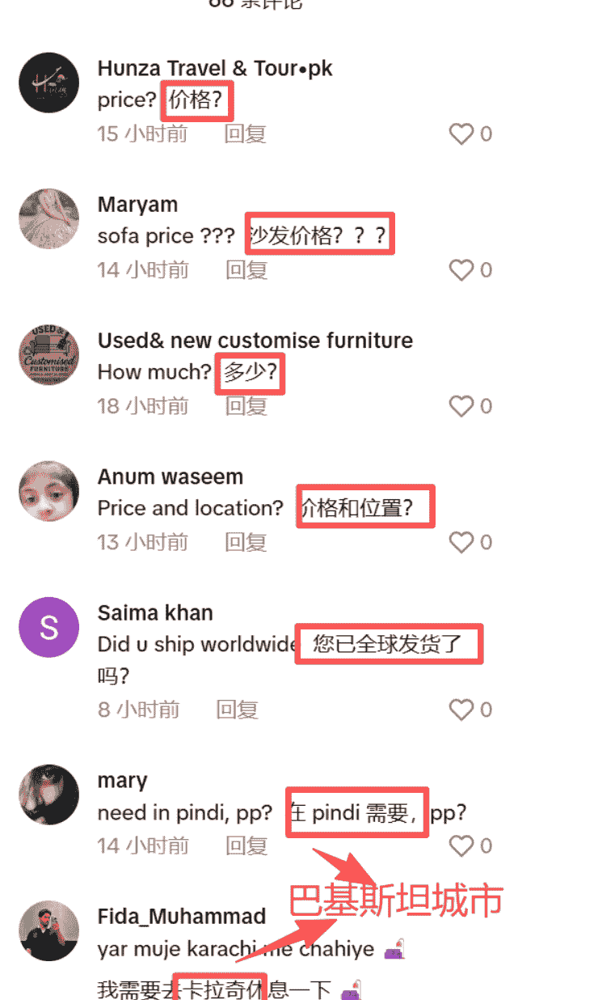

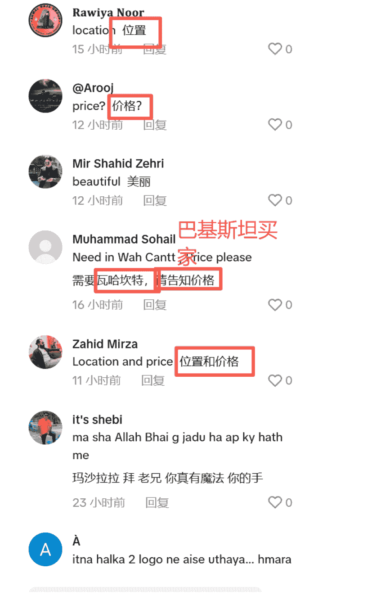

### 七、致谢

感谢珍妮老师和汐米老师耐心的内容指导，不断鼓励我更进一步的探索，甚至工作之余帮助我克服自己的负面情绪，让我建立自信！

感谢 whitt，权哥给我提供的一手外贸市场信息，让我细致了解到外贸工作的卡点和需求。

感谢生财有术，生财第一篇帖子就给我加精，给我这个新人曝光和机会，让我能够认识到像珍妮和汐米这样极致有实力的老板！全国最上进最互助的平台，生财有术值得狠狠种草！

最后，安利小懒的付费群：

#### 懒人专属群（介绍）


📖 懒人专属群持续更新中，已持续运营 6 年，整理超 3000 份各类精选付费文章&年费社群干货，全部开放下载。

本资料为付费群内分享，仅供真实有需要的朋友查阅🤫

懒人专属群更新记录：

https://hk57gvlx7u.feishu.cn/docx/H0kRdZbSbolBR0xkaXtcuVE0nTg

懒人专属群更新记录（需梯子，备用）：

https://lazybook.fun/blog/record2