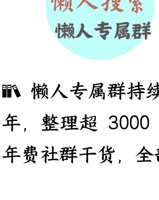

# 投资理论三层级学习方案，手把手教你成为股票投资高手（全网独家深度好文）

## 250921 费曼的小茶馆

整理：公众号懒人搜索，懒人专属群独享

懒人微信：lazyhelper

# 前言

全文 9800 字，分享价值投资从入门到进阶的路径。

最近的股票市场，出现了一定程度的震荡，这样的震荡，我认为是再正常不过的了，现在的牛市还并没有走完（当然，对于一些题材股、概念股来说，确实已经差不多了），还有很多板块都还有机会，但是能否抓住机会，主要就取决于你个人的认知水平和投资能力了。

最近经常有一些体制内的朋友谈到，想系统学习投资这门学科，不断提高自己的认知水平和投资能力，但是不知道如何系统学习，今天和大家系统说说，专业的投资理论到底应该如何学习。其实专业的投资理论并不复杂，至少没有很多人想象的那么复杂。作为千军万马过独木桥考公考编成功的体制内人士，大家的学习基础和学习能力，学好投资理论知识，我认为是绝对绰绰有余的，但是关键是要有人带你学习，有高手告诉你如何学习，让你尽快减少走弯路的时间，这一点和职场是一个道理。

作为一个跟随多位投资高手和名校教授学习过，并且自己投资实践也取得成功的过来人。今天和大家说说，投资理论学习的三个阶段，也就是小白阶段、进阶阶段、高手阶段，这三个阶段，我们到底应该如何学习？我们的学习要达到什么效果？到底要阅读哪些书籍？具体有哪些分层递进的学习方案？学习的逻辑闭环总结下来是什么？

今天就给大家认真总结梳理，并且形成了从小白到进阶到高手的三个层级的学习方案、以及推荐书籍，全部一篇文章告诉大家，绝对的价值千金。可以说，当你对投资认知到位以后，股票投资不再是追求短期收益的工具，而是提升人生质量、改变人生阶层、实现长期财富与认知双重增值的生活方式，这也是市场顶尖投资者的核心标志。千里之行始于足下，让我们就从今天开始吧！九千八百多字全干货文章，今日文章主要目录如下：

- 一、投资理论初级阶段学习方案（体制内投资小白适配版）
- 二、投资理论中级阶段学习方案（体制内进阶投资者适配版）
- 三、投资理论高级阶段学习方案（体制内高手投资者适配版）

# 投资理论初级阶段学习方案（体制内投资小白适配版）

对于大多数体制内人士，和投资小白而言，投资入门的核心痛点在于“时间碎片化、专业基础弱、风险承受力稳”，初级阶段学习需围绕“低门槛理解、强实操落地、稳收益预期”展开，最终实现“能看懂、会执行、有收益”的目标。本阶段通过 7 本分层递进的书籍，帮助学习者建立投资认知框架，掌握可直接落地的策略，为长期年化 8%-10% 的收益打下基础。

## 一、初级阶段学习效果要求

- 1. 认知层面：明确“投资不是投机”，理解“钱生钱”的底层逻辑——不是靠运气赌涨跌，而是依托金融体系的规则、企业的长期价值增长实现收益，破除“投资=高风险”“体制内不需要投资”的误区；
- 2. 能力层面：能独立看懂基金、股票等基础投资品的核心指标（如市盈率、分红率），掌握 1-2 种无需频繁操作的实操策略（如价值投资组合、指数基金定投），可结合自身工资、公积金等稳定收入，制定每月/每季度的投资计划；
- 3. 实践层面：学习后 3 个月内可启动小额实操（建议初始资金不超过月工资的 20%），能通过书籍中的方法判断“何时买、买什么、买多少”，1. 避免盲目跟风，且能通过后续学习持续优化策略，逐步实现“边实践边盈利”！

## 二、分层递进学习方案 (书籍解读 + 目标 + 意义)

### 第一本：博多舍费尔《小狗钱钱》——建立“钱生钱”的底层认知

- 1. 内容简介：本书以童话故事的形式，通过小女孩与会说话的狗“钱钱”的互动，讲解基础理财逻辑：比如“养鹅理论”（每月存一部分钱作为“鹅”，让“鹅”产生的利息为自己赚钱）、“目标导向存钱”（明确投资是为了实现教育、养老等具体目标）、“区分必要支出与欲望支出”等。书中没有复杂公式，全是贴近生活的案例（如如何通过兼职增加收入、如何选择安全的理财方式）。
- 2. 学习目标：破除“体制内收入稳定，不需要投资”的思维定式，理解“即使月薪固定，通过合理储蓄和投资，也能让钱主动增值”；掌握“强制储蓄”的方法（如每月发工资后先存 5%-10%，再规划支出），为后续投资积累初始资金；建立“长期投资”的耐心，明白“钱生钱”需要时间，避免追求“快速暴富”。
- 3. 学习意义：对体制内人士和小白而言，投资入门的第一步是“愿意开始”。本书用低门槛的故事降低学习焦虑，先解决“为什么要投资”的动机问题，再铺垫“如何开始”的基础动作，为后续理解复杂金融逻辑打心理地基。

### 第二本：《股市稳赚》(格林布拉特) ——对标境外成熟策略

- 1. 内容简介：本书提出“神奇公式”策略：通过“资本回报率”（判断企业赚钱能力）和“收益率”（判断股价是否便宜）两个指标，从美股中筛选出排名靠前的 30-50 家企业，构建投资组合，每年调整一次。作者用大量数据证明，这套策略在过去几十年的年化收益超过 15%，且逻辑简单、容易执行。书中还解释了“为什么这套策略有效”——本质是“用合理价格买赚钱能力强的企业”。
- 2. 学习目标：理解“价值投资策略的通用性”：不管是 A 股还是美股，“买优质、买便宜”的核心逻辑不变，只是指标细节（如市盈率的合理区间）因市场不同而有差异；学会“对标境外策略优化自己的方法”：比如将“神奇公式”的“资本回报率”指标，融入《终极价值投资》的策略中，更精准地筛选优质资产；建立“全球化投资视角”；知道未来可通过 QDII 基金参与境外市场，避免局限于 A 股，分散单一市场风险。
- 3. 学习意义：对体制内人士而言，投资需要“跨市场对比”以验证策略有效性。本书的“神奇公式”能让学习者更坚信“价值投资是普适的、可落地的”，同时拓宽投资边界，为后续参与境外市场打下基础。建议读纸质书，方便做笔记、对比两本书的指标差异。

### 第三本：《指数基金投资指南》(银行螺丝钉) 掌握“懒人投资”的最优解

- 1. 内容简介：本书是指数的入门经典，作者用通俗语言讲解：什么是指数基金（如沪深 300 指数基金，就是跟踪沪深 300 指数的基金，买一只相当于买 300 家优质企业）、为什么指数基金适合小白（费用低、风险分散、不需要选股）、如何定投指数基金（如“微笑曲线”策略：在市场下跌时多买，上涨时少买）、如何选择适合自己的指数基金（如宽基指数适合长期定投，行业指数适合波段操作）。
- 2. 学习目标：明确“指数基金是体制内人士的最优选择之一”：不需要盯盘、不需要选股，每月定投即可，完美适配“工作忙、没时间研究”的需求；掌握指数基金定投的全流程：比如选择“沪深 300 指数基金 + 中证消费指数基金”（这是纯假设举例子哈，不是推荐大家，现在不推荐这么买）的组合，每月发工资后自动定投，年化收益大概率能达到 8%-10%；学会“止盈止损”：比如设定“年化收益达到 15% 时止盈”“市场下跌超过 20% 时加仓”，避免因贪婪或恐惧错过收益。
- 3. 学习意义：初级阶段的收尾，需要一套“零门槛、高适配”的落地策略。指数基金定投既是对前面“价值投资”“资产配置”逻辑的实践，也是最适合体制内小白的“懒人方案”——学完这本书，学习者可以立即启动定投，实现“边实践边盈利”，为后续进阶学习提供“实战反馈”。建议读电子版，方便随时用手机查询书中提到的基金代码和定投步骤。

## 三、学习逻辑闭环总结

大家都是体制内人士，认知水平应该比普通人高得多，基本的一些常识大家自己搜一搜互联网都能知道，所以第一阶段就不需要花太长时间了。从《小狗钱钱》的基本理念意识启蒙，到《股市稳赚》提供“可落地的价值策略”，形成“意识 + 理论”的双重支撑；最后以《指数基金投资指南》的“懒人方案”收尾，让学习者能立即启动实操，实现“认知 - 方法 - 实践”的闭环。整个过程贴合体制内人士“稳、慢、准”的需求，避免复杂理论，聚焦“能理解、会执行、有收益”，为长期投资打下坚实基础。

# 投资理财中级阶段学习方案（体制内进阶投资者适配版）

度过初级阶段后，已具备基础投资认知与实操能力，中级阶段的核心目标是从“会操作”升级为“懂逻辑”——通过理解企业财务、商业本质与资产定价逻辑，实现投资决策从“跟随策略”到“自主判断”的跨越，同时契合体制内“求稳、重逻辑、善规划”的特质，成为散户中的投资高手。

## 一、中级阶段学习效果要求

- 1. 认知层面：彻底打通“投资 - 企业 - 商业”的逻辑链条，明白“投资本质是投企业未来现金流”，能清晰解释“资产定价为何有差异”“不同估值方法（如市盈率、现金流折现）的适用场景”，破除对“投资靠运气”的认知误区；
- 2. 能力层面：能独立阅读企业财报（资产负债表、利润表、现金流量表），通过财务数据判断企业盈利真实性、偿债能力与成长潜力；掌握“自上而下选行业 + 自下而上筛企业”的方法，从数千家上市公司中筛选出优质标的，同时具备识别财报粉饰的基本能力；
- 3. 实践层面：学习后 6 个月内，可基于企业分析构建个性化投资组合（如"3-5 只优质个股 +2-3 只行业指数基金”），能根据企业财报更新与行业变化调整持仓，不再依赖单一策略，实现“策略适配企业、决策匹配逻辑”的自主投资状态；
- 4. 心态层面：面对市场波动时，能基于企业价值判断而非短期涨跌做决策，比如知道“股价下跌但企业盈利不变时是加仓机会”，避免因情绪波动追涨杀跌，契合体制内“理性、抗压”的职业素养。

## 二、分层递进学习方案（书籍解读 + 目标 + 意义）

### (一) 第一本：《世界上最简单的会计书》——搭建财务认知的“地基”

- 1. 内容简介：本书以“小孩开柠檬水摊”为核心案例，用生活化场景拆解会计逻辑：从“买柠檬、糖（资产）”“收钱（收入）”“付摊位费（费用）”等日常操作，延伸到资产负债表、利润表、现金流量表的编制，手把手教读者理解“应收账款为什么是资产”“折旧如何影响利润”“现金流比利润更重要”等核心概念，全程无复杂术语，每个知识点都配套“做题练习”（如根据柠檬水摊流水填报表）。
- 2. 学习目标：掌握财务三表的核心勾稽关系：比如“利润表的净利润会影响资产负债表的未分配利润”“现金流量表反映企业真实资金流向，避免利润造假误导”；能用会计视角看商业行为：比如看到“企业扩产”，能联想到“资产负债表的固定资产增加”“未来可能产生折旧压力”；看到“预收款增加”，能判断“企业产品受欢迎，未来收入有保障”；消除对“财报”的畏惧感：明白“财务数据不是冰冷数字，而是企业经营的‘体检报告’，为后续阅读真实企业财报打下基础”。
- 3. 学习意义：对体制内人士而言，我发现很多股民搞投资多年，看不懂财报是进阶投资的一个很大的障碍，而本书用“柠檬水摊”的简单案例，将抽象会计规则转化为可感知的日常逻辑，降低学习门槛。更重要的是，体制内工作常涉及“预算、报表分析”，本书的会计思维可与职业能力互通，实现投资学习与工作能力的双重提升。

### (二) 第二本：《投资的本源》——掌握“自上而下”的选企方法

- 1. 内容简介：本书提出投资的本源是寻找好行业、好公司、好价格，提出选择优质公司、合理价格买入、分散投资及长期持有的策略框架。书中构建的稳健均衡投资体系强调关注企业基本面变化可帮助投资者在市场波动中保持平稳心态。通过本书，可以理解投资标的物选择，理解股权投资的基本逻辑，分析企业盈利与投资收益率的关联性。同时还介绍具体操作策略，包括如何筛选优质企业、确定合理价格、实施分散投资等。
- 2. 学习目标：建立“行业 - 企业”的层级认知：能判断“什么是好行业”（如市场空间大、竞争格局稳定、政策支持的行业），比如知道哪些行业处于成长期，市场空间仍在扩大，哪些行业处于衰退期；掌握“自上而下选标的”实操步骤，书里总结了一些中国好公司，可以多学习一下分析思路；另外招股说明书怎么去读，如何找到要点精髓，这本书里也有说明，这个非常重要，甚至和读财报一样重要。
- 3. 学习意义：稳健均衡投资体系的核心就是：选择优质的公司，以合理的价格买入，分散投资，并长期持有。这一方法，在笔者过往的投资经历中，已经被证明是易于操作，且适合个人投资者学习和使用。其实很多好公司、好行业，作为体制内人士，经常常接触政策文件、接触各个行业的纳税人，其实具备获取投资信息的天然优势。甚至可以说，很多优质公司本身就是体制内的人经常接触的，至少经常消费的，比如高端白酒中药，所以大家结合自身的经历经验，以及对政策的理解把握，可以多去思考和复盘，从书籍的理论思考，进一步提高辅助自己的投资实践。（并且本书提到的很多个股，后续都有很大的涨幅，并且最近这几年又调整的比较充分，根据金融市场风水轮流转的原则，这里面很多股票现在又到了值得关注的时间了。）

### (三) 第三本：《手把手教你读财报》——练就“财报证伪”的火眼金睛

- 1. 内容简介：这本书我很喜欢，作者老唐也是自身的价值投资高手，大家可以有空多看看他的文章。这本书可以说是 A 股投资者的“财报避雷指南”，聚焦“如何识别财报粉饰与造假”：从“应收账款异常增长”“存货周转率下降”“商誉过高”等常见信号，到“现金流与利润背离”“关联交易占比过高”等隐蔽问题，用 A 股真实案例（如某企业通过“虚增收入”造假）演示如何“从细节逻辑发现漏洞”。书中还教读者“重点看现金流量表”——因为“利润可以造假，但现金流很难造假”，比如“连续多年净利润为正但经营现金流为负的企业，大概率有问题”。看这本书，可以比较迅速的排查企业财报里的问题。
- 2. 学习目标：掌握“财报避雷”的核心方法：能识别 5-8 个常见的财报造假信号，比如“毛利率远超行业平均水平且无合理原因”“预付账款大幅增加但无后续采购”；学会“交叉验证企业盈利真实性”：比如用“经营现金流净额/净利润”判断盈利质量，用“应收账款周转率”判断企业回款能力等等；建立“风控优先”的投资思维：在选企业时，先“排除有问题的企业”，再“筛选优质企业”，避免因“踩雷”导致大幅亏损。
- 3. 学习意义：投资最忌“踩雷”——一旦投资标的暴雷，不仅损失资金，还可能因“投资决策失误”影响心态。本书的价值在于通过财务简单分析，可以建立风控护城河，让投资者在选标的时先“排雷”再“择优”，这与体制内“先控风险、再求收益”的工作原则完全一致，能最大程度保障投资的稳健性。

## 三、学习逻辑闭环总结

从《世界上最简单的会计书》的“财务入门”，随后用《投资的本源》的思路教你分析企业，结合体制内工作习惯思路、各种信息优势来分析理解企业；最后以《手把手教你读财报》的“风控避雷”收尾，构建“选得准、防踩雷”的核心能力。整个过程环环相扣，既贴合体制内“重逻辑、求稳健”的特质，又能逐步提升“理解企业、判断价值”的核心能力，为后续深入研究企业、优化资产配置打下基础。

# 投资理论高级阶段学习方案（体制内高手投资者适配版）

度过中级阶段后，基本上应该已经具备企业分析、财报解读与策略优化能力，高级阶段的核心是从“会投资”升级为“懂投资”——通过构建个性化投资体系、深化企业研究能力、驾驭市场情绪，实现投资收益更高，更重要的是让投资反哺人生，形成理性应对贪婪与恐惧的成熟心态，最终成长为贴合 A 股实际、适配自身特质的市场顶尖投资者。

## 一、高级阶段学习效果要求

- 1. 体系层面：形成完整且可落地的“个性化投资体系”，包含“宏观政策判断 - 行业筛选 - 企业研究 - 估值定价 - 仓位管理 - 风险对冲”全流程逻辑，能根据 A 股政策市、散户多、波动大的特点动态调整，比如“政策支持的、渗透率不高、正处于产业爆发期的行业优先配置”；
- 2. 研究层面：具备“精准穿透企业本质”的能力，能从“商业模式 - 竞争壁垒 - 管理层能力 - 财务健康度”四维拆解企业，比如判断“某国企的核心优势是政策壁垒而非技术优势”“某成长股的高增速是否依赖不可持续的补贴”，并能结合历史数据与行业趋势预判企业 3-5 年发展；
- 3. 心态层面：彻底驾驭市场情绪，面对极端行情（如熊市跌幅超 30%、牛市涨幅超 50%）时，能基于企业价值而非短期涨跌决策——熊市中敢于加仓被低估的优质标的，牛市中能理性止盈避免站岗，形成“贪婪时我恐惧，恐惧时我贪婪”的逆向思维；
- 4. 人生适配层面：实现“投资与人生的深度融合”，能根据自身人生阶段（如青年期侧重成长股、中年期侧重平衡配置、临近退休侧重价值股）调整投资组合，用投资收益反哺生活（如覆盖子女教育、养老储备），同时将投资中的“理性分析、长期思维”反哺职业发展与生活决策。

## 二、分层递进学习方案 (书籍解读 + 目标 + 意义)

### (一) 第一本：《超额收益 - 价值投资在中国的最佳实践》——构建本土化投资观的“基石”

- 1. 内容简介：本书由国内资深价值投资者撰写，核心聚焦“价值投资如何适配 A 股土壤”：不同于境外成熟市场，A 股受政策影响大、散户情绪波动剧烈、优质国企占比高，书中通过定性分析公司基本面、定量分析公司基本面、系统的价值评估、以及各种不同价值投资策略，又辅以 80 余个 A 股、港股正反案例，生动地讲解了如何抓住投资机会及规避投资风险。书中还纠正了“价值投资=死拿不放”的误区，强调"A 股价值投资需结合估值动态调整”。
- 2. 学习目标：建立"A 股特色价值投资观”：明白“在 A 股做价值投资，既要坚守‘买优质企业’的核心，又要适配‘政策影响大、波动高’的特点”，比如“国企龙头因政策兜底，抗风险能力更强，适合作为组合压舱石”；学会“用本土化案例验证投资逻辑”：能结合某些国企“高毛利率、强品牌壁垒”的案例，举一反三分析其他消费国企的投资价值，避免照搬境外经验；形成“政策 - 行业 - 企业”的联动判断：比如看到“国家支持新能源政策”，能预判“新能源国企可能迎来发展机遇，同时需关注产能过剩风险”，并能用财务数据（如营收增速、ROE）验证。
- 3. 学习意义：投资的核心是“贴合实际、可控可测”——本书的价值在于“破除对境外投资理论的盲目崇拜”，提供适配 A 股与国企特质的投资思路。体制内人士对政策、国企的认知本就有天然优势，本书能帮助将这种优势转化为投资竞争力，避免因“水土不服”导致投资失误。

### (二) 第二本：《投资至简：从原点出发构建价值投资体系》——整合前两阶段知识的“框架”

- 1. 内容简介：本书是投资体系的整合器，从现金流折现是投资的“第一性原理”出发，回答进入股市的首要问题：股权思维还是现金思维？书中从现金流折现视角阐述资产选择、估值及风控等核心要素；从商业模式、成长空间、竞争壁垒及企业文化等各个维度评估企业价值；结合牧原股份、伊利股份、五粮液、长生生物（是作为案例解读、不是推荐个股哈）等案例解析投资策略的实际应用。
- 2. 学习目标：完成“碎片化知识→体系化框架”的跨越：能画出自己的“投资决策流程图”，清晰呈现“从政策解读→行业筛选→企业分析→估值定价→仓位管理→止盈止损”的每一步标准与逻辑；学会“动态优化投资体系”：能根据自身情况（如工资增长、风险偏好变化）调整体系参数，比如“临近退休时，将成长股仓位从 40% 降至 20%，增加高分红国企（如某某电力）仓位至 50%"；建立“投资体系的自我验证机制”：学会运用归纳法、演绎法、学会复盘投资决策是否符合体系逻辑、不符合的原因是体系漏洞还是情绪干扰，避免因临时冲动偏离核心策略。
- 3. 学习意义：就像体制内工作强调“体系化、流程化”，本书的价值在于通过系统化的理论框架和实战案例，为投资者提供了构建价值投资体系的实用指南。本书从“第一性原理”出发，提出投资的本质是“放弃一种资产以获取另一种资产未来现金流折现值”，并以此为基础推导出资产配置、企业评估、风险控制等核心要素。通过现金流折现视角，结合商业模式、成长空间、竞争壁垒等四维度评估企业价值，形成完整的价值投资逻辑体系。一套完整的投资体系是抵御市场波动的护城河，既能避免因知识碎片化导致的决策混乱，又能让投资决策有迹可循、可复盘优化。

### (三) 第三本：《股市进阶之道一个散户的自我修养》——打通投资全脉络的“进阶课”

- 1. 内容简介：本书是高级阶段的“核心干货”，被称为"A 股

## （四）第四本：《彼得林奇的成功投资》——对标大师、激活生活观察的“实践指南”

- 1. 内容简介：本书由传奇基金经理彼得林奇撰写，核心颠覆了“投资需要专业背景”的认知——普通人在生活中就能发现优质企业：比如“在商场看到某品牌奶粉热销，就去研究其母公司的财报”“用某款APP时发现其用户体验好、渗透率提升，就去分析其母公司的成长潜力”。书中将企业分为“缓慢增长型（如公用事业国企）、稳定增长型（如消费龙头）、快速增长型（如科技成长股）、周期型（如煤炭、钢铁）”以及困境反转型、隐蔽资产型等六类，针对每类企业给出“买入时机、估值方法、持仓策略”，比如“周期型企业需在 PE 高时卖出、PE 低时买入（逆周期操作），稳定增长型企业需在估值低于历史均值时买入”。书中还强调“投资最大的风险是‘不懂装懂’，普通人应聚焦自己能理解的行业（如日常消费、公用事业）”。

- 2. 学习目标：激活“生活中的投资线索”：能从日常观察中发现优质标的，比如“发现单位或者商场周边的某个品牌客流量持续增长，就去研究其财报中的‘营收增速、毛利率、分红率’，判断是否符合买入标准”，将个人的工作体验、生活体验转化为投资优势；掌握“企业分类投资策略”：能根据企业类型动态调整操作，比如“持有缓慢增长型的某某电力，侧重‘长期拿分红、忽略短期波动’；持有快速增长型的某某电池龙头，侧重‘跟踪营收增速与技术迭代，增速下滑时及时止盈’；持有周期型的中国某煤炭企业，侧重‘逆周期操作，PE 高时减仓、PE 低时加仓’”；对标大师的“理性与谦逊”：学会“只投资自己能理解的行业”，比如体制内人士对公用事业、消费、国企更熟悉，就聚焦这些领域，避免盲目跟风投资看不懂的科技股、题材股，同时保持“持续学习”的心态，比如定期跟踪企业财报与行业政策，更新认知。

- 3. 学习意义：普通人的优势在于“贴近生活、熟悉生活”，本书的价值在于“将这种优势最大化”——不需要频繁调研，不需要复杂模型，只需在生活中多一份“商业敏感度”，就能找到优质标的。更重要的是，彼得林奇“‘买入前充分研究，买入后耐心持有’的理性思维”，能帮助抵御 A 股市场的“短期投机诱惑”，坚守长期价值，最终实现“从‘会投资’到‘懂投资’”的跨越，成为市场顶尖高手。

散户的进阶圣经”，从“认知、方法、心态”三个维度彻底打通投资脉络：认知上，明确“投资的本质是认知的变现”，你能赚到的钱永远超不过你对企业与市场的理解；方法上，详细讲解“精准研究一家企业的全流程”——从“商业模式拆解”（如判断“某公司的商业模式是‘强品牌 + 高壁垒 + 高现金流’”）、“竞争壁垒分析”（如技术壁垒、政策壁垒、规模壁垒），到“管理层能力评估”（如国企管理层的“政策执行力”与“分红意愿”）、“估值实操”（如用 DCF 给成长股估值、用股息率给价值股估值）；心态上，教读者“如何在熊市中保持耐心”“如何在牛市中控制贪婪”，强调“投资的终极对手是自己”。

- 2. 学习目标：掌握“精准穿透企业本质”的能力：能独立撰写深度企业分析报告，比如分析“长江电力”时，不仅看“PE 15 倍、分红率 3%”的表面数据，更能拆解其“水电站资产的永续性（商业模式）、政策特许经营权（竞争壁垒）、现金流稳定（财务健康度）”，判断其“适合作为组合压舱石，测算其长期年化收益”；学会“估值的动态平衡”：能根据企业类型（成长股/价值股/周期股）选择适配的估值方法，避免单一估值方法导致的误判；形成“认知、方法、心态”的统一：比如“当某成长股因市场情绪下跌 20%，但企业营收增速仍保持 30%、ROE 25% 时，能基于认知判断‘这是买入机会’，用方法（估值合理）支撑决策，用心态（长期思维）抵御短期波动”！

- 3. 学习意义：对想成为“市场顶尖高手”的体制内人士而言，本书的价值在于“从‘会分析’升级为‘会决策’”——中级阶段能看懂企业财报，高级阶段需穿透企业本质并做出正确决策。体制内人士的“深度分析、逻辑推导”能力本就突出，本书能将这种能力转化为投资中的“精准判断”，比如用“研究单位项目的方法”研究企业商业模式，用“评估工作成效的方法”评估企业管理层，实现“职业能力与投资能力”的深度协同，为个人年化 15% 收益提供核心方法论支撑。

## 三、学习逻辑闭环总结

从《价值投资在中国的最佳实践》的“本土化投资观构建”，到《投资至简》的前两阶段知识整合，解决“如何适配 A 股与自身特质”的基础问题；再通过《股市进阶之道》的“全脉络打通”，掌握“精准研究企业、驾驭市场情绪”的核心能力；最后以《彼得林奇的成功投资》的“生活实践对标”收尾，激活自身优势、坚守理性本质，形成“本土化体系 + 精准研究 + 理性心态”的完整闭环。整个过程既贴合体制内“重逻辑、求稳健、善于“年化 15% 收益、投资反哺人生”的目标。

可以说，当你对投资认知到位以后，股票投资不再是追求短期收益的工具，而是提升人生质量、改变人生阶层、实现长期财富与认知双重增值的生活方式，这也是市场顶尖投资者的核心标志。

最后，安利小懒的付费群：

懒人专属群 (介绍)

懒人专属群持续更新中，已持续运营 6 年，整理超 3000 份各类精选付费文章 & 年费社群干货，全部开放下载。

本资料为付费群内部分享，仅供真实有需要的朋友查阅

懒人专属群更新记录：

https://lazy2025.top/blog/record2

懒人专属群更新记录 (需梯子，备用)：

https://lazybook.fun/blog/record2