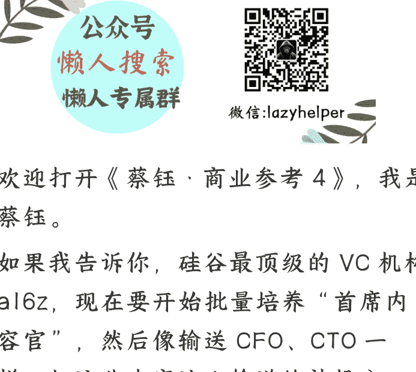

# 164 | 从硅谷到中国：内容成为核心资产

251119

整理:公众号懒人搜索,懒人专属群独享懒人微信:lazyhelper

欢迎打开《蔡钰,商业参考4》,我是蔡钰。

如果我告诉你,硅谷最顶级的VC机构a16z,现在要开始批量培养“首席内容官”,然后像输送CFO、CTO一样,把这些内容达人输送给被投公司,你听完会不会觉得:嚯,文科生的时代,又来了?

事情是这样的:

2025年11月,a16z推出了“新媒体伙伴计划”。这是一个为期8周的项目,a16z要面向社会,公开招募内容达人,尤其是Operator运营者、Creator创作者和Storyteller叙述者,给他们提供集中培训,然后组成一支内容团队,去帮a16z的被投公司们实现“互联网霸屏”。

VC们给被投项目做好投后服务,比如找合适的CFO、CMO,这是行规。不过a16z这个动作的创新之处在于,它等于是把“首席内容官”CCO当作核心资产，来给被投公司培养和输送了。

a16z 的创始人马克·安德森和本·霍洛维茨解释这个计划动机时，说得很直白：a16z，想要成为“科技界的 CAA”，还要拥有自己的“a24 团队”。

CAA 是什么？好莱坞最顶级的经纪公司，专门帮演员和艺术家打造个人品牌。它 1975 年创立后，完全改变了好莱坞娱乐行业的运作模式，让有创造力的演员和艺术家，能够脱离大公司的控制，按自己的方式打造系列品牌。你听听，这是不是也契合创业者想拥抱的命运？

a24 又是什么？是一家 2012 年成立的美国独立电影公司，特长是用故事建构文化认同和审美标准，近年来拿奖无数。《月光男孩》《瞬息全宇宙》这两部奥斯卡最佳影片，就是 a24 的作品。

你品品。a16z 本就是硅谷叙事能力最强的风投之一，但即便如此，它还打算进一步强化自己的媒体系统。

不知你的第一感受是什么。我的第一感受是，内容能力成为企业的产品能力，甚至战略能力这事，在科技行业也加速了。

a16z 这次的主张其实是：用“发布叙事”，来代替“发布产品”。

## 硅谷新玩法

我们来看看 a16z 的这个计划细节。

a16z 说，计划的目标是要打造风投领域最卓越的一站式媒体运营平台，让创业者们能在这里赢得“在线叙事之战”所需的公信力、审美品位、品牌建设能力、专业知识和传播势能。

你请注意这个用词，“在线叙事之战”，narrative battle online。不是 Compete，而是 battle。

a16z 说，自己是一场 F1 赛事里的维修保养站，创业公司当然就是赛车们。它要建构的新媒体团队，就是要在最短的时间内，给你换上最好的“内容轮胎”：制作关键视频、组织发布活动、在社交媒体上瞬间霸屏。这套叙事能力，必须是每次都能完美且瞬间执行的。

你看，这套玩法，既解释了这个“新媒体伙伴计划”的目标，又重新定义了科技 VC 的价值。

传统 VC，给创业者的是钱和人脉，而现在 a16z 想给创业者的，是一套打造“合法性”和“影响力”的叙事服务。

a16z 自己，过去几年已经把自己的媒体矩阵架设好了：a16z 自己的播客每周更新 5 次；新闻邮件每周发布 5 次。现在它的被投公司有发声需求，就已经能得到投资大佬马克·安德森亲自出镜的访谈播客，专业团队制作的发布短片，协调整个硅谷媒体生态的发声，在 TikTok、YouTube 和 X 的充分传播资源。

这等于，直接把一家青涩的创业公司推上了科技话语权的顶层——硅谷的话语体系。

而这还没完——

这次 2026 年 1 月开始的“新媒体伙伴计划”，其实是要批量生产“首席内容官”和内容小组，把他们像派驻董事一样，派驻到 a16z 的被投企业里去，帮创业公司打造叙事传播、渠道分发和社群运营的深度运营能力。

a16z 自己说，它要交付的这一整套能力，叫作“发布即服务”，Launches as a service。

今天的科技创业者，已经很难被大资本、大人脉打动了，但对长于技术、讷于叙事的理工科人才来说，面对这种顶级的内容部署能力，有几位能禁得住诱惑呢？

## 中国的呼应

a16z 的雄心先说到这里。我们回来看中国。在中国，内容成为核心资产的类似趋势也在出现。

我们在专栏 61 讲（《特厨隋坡的 MCN 纠纷：人格资产崛起》）聊过特厨隋坡的故事。

会吃、会做、会表达的特级厨师隋坡，因为分成问题跟 MCN 公司分家，转头自立门户。MCN 公司指责他同业竞争，结果整个舆论都在支持隋坡，而不是 MCN 公司。因为大众认为，在资产价值上，内容高于账号，真实人格又高于内容。

近几个月，中国互联网还涌现了一位商业新秀——视频博主影视飓风。

影视飓风其实不是新公司。它 2014 年就创立了，最早就是创始人 Tim（潘天鸿）的个人兴趣，拍拍数码评测、接接科技公司的商单。但是 2024 年，影视飓风突然实现了团队营收破亿，2025 年的影响力和收入还在进一步快速增长，这让中国大大小小的自媒体羡慕得不行。

影视飓风发生了什么变化呢？最大的变化是，从内容变现转向了电商交易，不再大密度地用内容接广告，而是去直播荒岛求生、采访苹果 CEO 库克、做深海纪录片和团建综艺。团队在展示这些生活体验的同时，卖起了 T 恤、帽子、背包、冲锋衣。

听起来也不是什么稀缺单品呀，谁在买呢？科技理工男们。理工男们认为，影视飓风的创始人 Tim 热爱科技、有动手能力、注重产品性能的特点，正是自己的完美精神替身。于是，他们就干脆把 Tim 的衣食住行当成了“生活样板间”来跟随，向心目中的“高我”靠近。

所以啊，2019 年时，影视飓风的团队营收主要还是靠广告，收入占比高达 50%，电商只占 25%。而到了 2025 年，在团队的有意经营之下，电商收入占比超过了 50%，广告降到 10% 左右。它旗下最畅销的一件 T 恤，销量超过了 20 万单。

特厨隋坡和影视飓风的故事说明了什么？

它们都说明，好内容、魅力人格已经不再是产品和现成商业模式的附庸，而是开始有了独立的商业生命力，资产化了。

新能源汽车行业也出现了类似的戏剧性变化。

理想汽车的 CEO 李想，2025 年 7 月突然发微博说，很多人让他学习雷军，走到台前，通过视频和大家面对面沟通，他本人在认真考虑此事。一天后，他就开通了抖音账号，发了一条活人感十足的视频，题目叫《我的第一条抖音，恳请大家，听我讲完！》，在这条视频里特意回应了早年在一个综艺节目发脾气的缘由，承认自己脾气大。

这之后，李想在“自我打开”的路上一路狂奔：他积极参与了不少深度访谈，包括现身罗永浩的长播客，各种剖析自己的成长历程和人格养成；谈理想汽车的设计初衷和社交困境，甚至在提到投资人王兴时，毫不介意地哽咽了几次。

你看，作为一个技术产品导向的创业者，李想也发生了“叙事觉醒”，开始有意识把创始人人格，当作企业的核心资产来运营。

甚至，类似的变化也在 ToB 企业当中发生。

我们来看字节的办公文档——飞书。飞书当然是典型的企业端工具。但这几年，它也做了一档名叫《组织进化论》的播客。这档播客，一开始主要是邀请飞书的明星企业客户们来接受访谈，强化“先进企业先用飞书”这个暗示。

但很快，它也开始邀请有魅力的个人大 V，比如心理学家李松蔚、直播之神朱萧木、读书博主携隐等等，来聊他们生活当中的境遇和思考。

ToB 的工具为什么要跟有影响力的 ToC 大 V 抱团？我想也是因为，这能帮一个个活生生的职场人，找到“先进感”的共情对象。在一个人人都在线上生活的时代，连组织也需要“人格接口”，去获得共情的合法性。

所以你看，从美国到中国，叙事能力正在成为企业的战略能力，成为一把手工程。

## 复合型文科生的机会

那么，这个变化对我们普通人意味着什么呢？

我觉得，最直接的答案当然是：世界不是不需要文科生，而是需要更复合的文科生。

传统的文科生，可能只会写文章、做策划。但现在需要的是什么？就像“大语文”里既有文学，也要有历史、政治、哲学；a16z 要挖掘和培养的新媒体伙伴，既要懂内容，也要懂网络、懂创业、懂科技、懂商业。

给你布置个小作业呗？a16z 给想找的人列了 5 个条件：

- 第一，精通技术、媒体与文化的交汇点，熟知新思想与新产品在网络世界的传播法则。
- 第二，身份可能是创始人、运营者、设计师、写作者、编辑、策展人，或者内容策略师，本质都是创造者与实干家，都擅长打造能引发共鸣的叙事。
- 第三，有过创造影响力的实绩，比如在创建时事通讯、播客、社区、品牌或公司方面。有成功经验，作品能塑造他人对技术或未来的看法。
- 第四，渴望探索新的内容形式，比如短视频、生成式媒体、故事叙述、传播或电影制作。
- 第五，有志于连接思想与影响力，愿意帮助创业者、初创公司和投资者进行人性化、清晰且与文化语境相关的有效沟通。

请教你，如果6个月后，中国也有超大VC、超大平台，或者新锐科技公司，希望在市场上找到有类似能力和经验的“首席内容官”，我们从今天开始可以做些什么，届时能够进入猎头的名单？

说不定，这会是未来一年最值得提前准备的一场“内容复兴”。

期待你分享你的计划。

再见。

最后，安利小懒的付费群：

懒人专属群（介绍）

懒人专属群持续更新中，已持续运营6年，整理超3000份各类精选付费文章&年费社群干货，全部开放下载。

本资料为付费群内部分享，仅供真实有需要的朋友查阅 🙇

懒人专属群更新记录：

https://hk57gvlx7u.feishu.cn/docx/H0kRdZbSboIBROxkaXtcuVE0nTg

懒人专属群更新记录（需梯子，备用）：

https://lazybook.fun/blog/record2