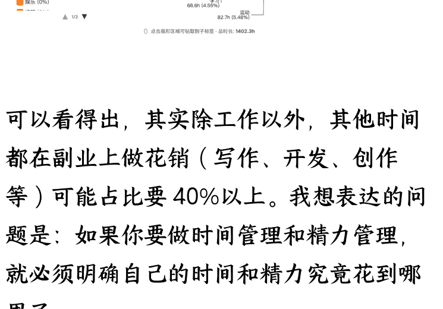
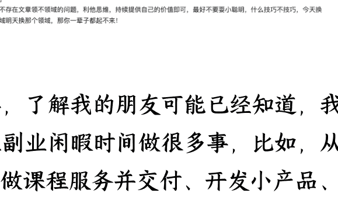
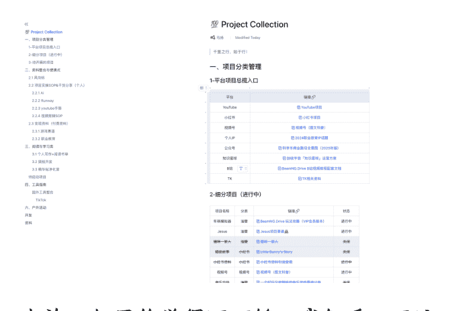
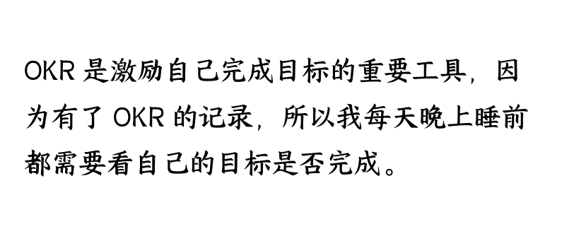

# 如何做好精力管理：主业太忙，没时间干副业怎么办？

## 251119 生财精华

公众号懒人搜索，懒人专属群独享

懒人微信：lazyhelper

“主业太忙，没时间干副业怎么办？”被大家高度关心。在官方邀请下，我想为圈友们分享在时间与精力管理方面的实践经验。

这个话题对我来说非常契合，因为过去一直有人好奇：“你怎么做到一边上班，一边做油管，还能持续更新公众号？而且每一项都有实际成绩？”

事实上，我不仅在做 YouTube，也在持续运营公众号内容，并且还有一些不为人知的项目在同步推进。这些事情看起来繁杂，但我依然能稳定产出、有条不紊，并且不断看到结果。

所以今天这篇分享，我会从以下方面给大家拆开讲讲，看看一个上班族，如何做到高频、多线、且高质量地输出内容。

- 1/ 为什么精力比时间更重要
- 2/ 精力的四大来源：像充电一样管理自己
- 3/ 建立你的“精力分配模型”
- 4/ 实践建议：三步打造你的“个人能量系统”

Start～

## 前言

关于时间精力管理，很多人其实有 2 个重度受限区，一个是我哪有那么多时间、一个是我每日回到家都很累，哪有精力。

怎么办？

哪有时间，哪有精力。比如很多人回去还要做家务、要带娃（我也是）、还要处理家庭关系，工作问题等等。

好吧，其实我想说，既然我们选择了走自媒体求个人快速发展的道路，就必须明白，有舍必有得，你必须在时间和精力上花点功夫。

好，接下来我们详细谈谈关于这个话题的问题，在这个过程中详细为大家拆解我的技巧与经验。

给大家先看一个数据，这是我本人在 2025 年截止本月筛选的时间明细分布，这个时间可能并不是很准，但是足够说明问题。

数据来源于我自己设计软件并同步了我的 iphone 的日历，以及我自己平时花碎片化时间在这个软件的时间记录。

可以看得出，其实除工作以外，其他时间都在副业上做花销（写作、开发、创作等）可能占比要 40%以上。我想表达的问题是：如果你要做时间管理和精力管理，就必须明确自己的时间和精力究竟花到哪里了。

比如，我本周 2025（11 月 2 日 ~11 月 8 日）的数据：

本周，我除了工作，其他 80% 的时间都在学习、写作、阅读、开发（Ai编程）等方面，学习和阅读是为了提升自己认知，而其他方面是通过获得的认知来输出自己的结果！

如果你还想看的再细一点的话，请看下面这张图，这是我无数个日夜里的随便某一天的输出！

其实，了解我的朋友可能已经知道，我自己再副业闲暇时间做很多事，比如，从0到1做课程服务并交付、开发小产品、写公众号、写书、带货、油管运营等等，这一系列给我带来的收益早就超过了10w+RMB。

另外，我对自己做的项目还专门做了一个飞书文档用来做记录，如图（仅供参考）：

也许，如果你觉得还不够，我们看下面这张表：

OKR 是激励自己完成目标的重要工具，因为有了 OKR 的记录，所以我每天晚上睡前都需要看自己的目标是否完成。

因为，很多自媒体的教练都明白一个道理，一件再复杂的事，只要你拆解的足够细，细到你可能不到几分钟就能搞定，那么这个“宏伟”的目标最终也能完成。

就好比我们平时徒步一样，只要方向对了，走好每一步最终都能达到终点。

## 一、为什么精力比时间更重要

首先，你必须知道，精力是非常非常重要的，如果你要大片的时间，但却没有精力，那么你的时间将毫无意义！

### 所以说，管理时间，不如经营精力！

首先，第一步，就是要有一个好身体，这是第一性原理，也是正确的废话。其次，我们要懂得精力管理的基本方程，和价值观。具体如下：

### 时间人人平等，精力却千差万别

每个人都有 24 小时，但不是每个人都能在这 24 小时里“点燃”自己。所以我们要保持警惕，多留意到底哪些时间段是自己的高峰期。

### “疲惫感”是副业的最大的敌人

很多人不是缺时间，而是下班后已经精力枯竭。之所以如此，我认为其实和个人习惯有关系，比如上班太过拼雨工作，导致晚上精神不济。这就好比充满电的手机，白天拼命刷视频导致晚上没有电了。

### 精力不是无限的，需要刻意经营

很多人以为自己做不成副业，是因为时间不够。

但真正的问题从来不是时间，而是——你的能量每天从哪里来、又被耗到哪里去？

精力是一种“可再生资源”，但不是自动恢复。它由四部分组成：身体能量、情绪能量、专注能量、意义能量。

你不经营，它就自动流失；你刻意投入，它就会像账户余额一样越攒越多。

### 举个我自己的例子：

清晨是我的“吸收时段”，我会阅读、记灵感，精力满格的时候做输入就像海绵吸水一样。

晚上 9:30 是我的“输出时段”，写公众号、剪短视频、准备课程。

上班时间是我的“素材时段”，浏览案例、记录笔记、观察话题。

看上去好像我每天做了很多事，但实际上我只是把不同类型的任务，放进了最适合它们的精力段。

精力经营不是逼自己更努力，而是更聪明地使用能量。

用一句话总结就是：一个会经营精力的人，看起来就像拥有“比别人多的时间”。

### 高效不是“做更多”，而是“把精力用在最值得的地方”

我们永远不可能把一天安排得满满当当、事事完美。但我们可以让最关键的事情，在我们最有能量的时候完成。

这就是为什么我一直强调：不是把所有事做好，而是把重要的事做好。

好，接下来我们具体谈谈以上细节。

## 二、精力的四大来源：像充电一样管理自己

### 什么是“精力点”

我发现一个很有趣的问题，我记得以前高中早读，大家都是6:50开始就上早自习，一直持续到7:50才下自习。这个时间段其实大家都觉得很困，大部分人都在打盹。

但我发现自己在这个时间段非常精神，我相信我们很多人都是如此，所以我发现直到现在，我清晨的精力非常旺盛，所以我会早起去阅读。也就是学习，趁精力旺盛去像海绵一样去吸收知识。

我为什么讲这个？

其实我想告诉你，每个人应该都有自己的“精力旺盛期”，比如有些人是晚上等。

这个时间段很重要，因为你在这个时间段做对了事情，你将会获得一天的电力保障。

很多人会觉得，没事呀，我喝茶或者咖啡也可以得到这个状态。不，不一样，靠外界的能量不够稳定，而且很难实现生物钟的记忆。

所以记得，一天的精力最好不要靠外力，而是靠自己的感觉和实践慢慢成为肌肉记忆才好。

### 如何给自己身体充能?

好，既然我们知道了这个每日的核心精力点，那下一个问题是，如何才能获得一个精力充沛的身体呢?

我认为主要有以下4点要注意:

### 2.1 身体能量:基础电量

睡眠、饮食、运动决定你的“续航力”。

先说睡眠，这个估计已经被说烂了，我们都懂，没什么好讲的，如果你要做自媒体副业，要是你每天晚上搞到凌晨三四点，那可能不叫副业。

### 早晚会垮！

亦仁说过：既然是副业，其实只要管理好自己的精力，每天抽出 1 个多钟就可以了！因为你把时间拉长，只要持续必出结果，无论是成败！

> 亦仁回答：
> 不要急着一下子放弃自己已有的，然后全力投入到一个不确定性很高的领域，这是赌博，我们不要做赌徒。
> 不管你是多忙的人，你每天至少有两个小时是浪费掉的，我自己可能每天也有好几个小时是浪费的毫无意义的，别说你了。
> 所以你每天只需要抽其中一个小时用来学习AI web，坚持三个月，你自己就判断力了，对很多问题就会有自己的答案。

所以，我也不建议，大家看到生财让你心动的项目一上来就搞个通宵，这就不是要精力管理的问题了。

另外，饮食就按自己的方式来就好啦。没啥好说的。

接下来就是运动，这个我要特别特别讲一下！

可能，也许，我的路和你不一样，虽然我没有走遍千山万水去高能运动，也没有去健身房为自己提升身体素质。但是我在广东周边把方圆周围的山都爬了个遍。

### 关于我们徒步的心路历程，感兴趣请详细阅读：

前几年，我就是单纯为了提升自己的体力，加强免疫与健康，我在东莞组织了一个近 100 人的徒步团队。我们几乎每周都组织去徒步，从东莞到惠州再到深圳、广州、梅州等附近的山都爬了个遍。

早上出门晚上归家，那段日子非常辛苦，但这个精力让我体会到一个人可能一生都体会不了的生活感悟。当然这里不谈，我们只需要知道，我当初为了能带领团队去征服一座座山，我需要做的就是一周至少 1~2 次跑 10 公里。就这样，咱不说体力好不好，精力肯定没啥问题。

运动其实就是给自己的精力池扩容，而睡觉和饮食就是给这个精力池充电。

很多人觉得自己精力一下子就没有了，其实就是你运动的太少了，只要你走出去一定会有不一样的收获。

提示：规律睡眠 > 多睡；轻运动 > 暴汗；晚上副业时别逼自己硬撑，先恢复身体电量。

### 2.2 情绪能量:心情就是燃料

俗话说的好：白天情绪被耗尽，晚上自然“空电”。

我自己的方法就是情绪修复法：散步、静坐喝茶、轻音乐。这就是间接补充能量的方式。

其实这里也有一个误区：你要知道，人的潜力和精力其实是无限的！

有些时候，我们是自己给自己带了标签。你知道吗？真正的休息其实不是回家刷剧、打游戏、睡觉。而是——换脑子。我中学的时候就知道，你看我们平时那么多课，学生不累吗，其实不会。比如你学语文、数学，其实他们之间的切换用脑子是不同的区域。

同理，白天你去工作和晚上下班回来做的事也会大脑不同区域，所以根本不存在累不累，只是看你这个事情是不是你想做的事。

那么情绪能量，我认为其实只是催化剂！

学会识别“能量黑洞”：抱怨群、无效社交、长时间刷短视频。

### 2.3 专注能量：做一件事的底层火力

大脑切换任务很耗能，不如设立“副业专属时段”。

你可以用滴答清单或者番茄工作法等有的工具，专门给自己设定“90 分钟专注区”。在这个过程中，减少干扰：关闭通知、固定工作台、保持仪式感。

比如，我都是每天晚上九点半开始正式为自己干活，这就是打雷都不会变的事情，除非还有更重要的事。所以慢慢成了习惯，因为我知道这个时间我该输出了。

### 2.4 意义能量：精神层面的充电

我相信，任何干副业的人都有自己很清晰的目的，无论是为了实现个人价值，还是盈利，还是投资，这都是意义所在，我无需多谈。

当副业与你的“个人价值”挂钩，你会自带能量。

问自己三个问题：

- 我做这件事，是为了什么？
- 它能让我变成谁？
- 我在创造什么价值？

意义感，是精力的“核能”。

## 三、建立你的“精力分配模型”

所谓，精力分配模型，总结就是经营好自己什么时候该干什么事，让你的流程如流水般自由。

回到我们上面的经验，可以提炼出：

### 识别能量周期：找到你的"黄金时段"

- 早晨脑力强 → 用来做主业的深度工作。
- 晚上创意高 → 留给副业构思或输出。
- 周末集中时段 → 副业规划与内容生产。

很多人的困惑是：明明有时间，为什么就是做不出东西？

答案很简单——你在错误的时间做了错误的事。

我自己的能量周期是这样的：

- 清晨 6:00-8:00：大脑最清醒，用来阅读学习、吸收知识
- 晚上 9:30-11:00：创意最活跃，专门写作、剪辑、输出内容
- 周末集中时段：做系统性规划、批量生产素材

关键不是时间多不多，而是你有没有把最重要的事，放在你能量最强的时刻。

### 建议你这样做：

用一周时间观察自己的能量波动（每2小时记录一次状态）。

找出3个能量高峰时段（通常是早晨、傍晚、深夜某个时段）。

把最需要脑力的任务（写作、思考、规划）安排在高峰期。

把机械性任务（回复消息、整理文件）扔给低能时段。

总之，时间管理的本质，是能量管理。

### 拆分任务层级：让精力配得上优先级

很多人做副业失败的原因，不是不够努力，而是用低能量硬刚高难度任务。

- 比如：
  - 你已经累成狗了，还逼自己写深度长文——结果憋3小时写不出一段
  - 精力最好的早晨，却用来刷邮件、回微信——等想做正事时已经没电了

这就是典型的"精力错配"。

我的方法是用"能量-任务矩阵"来规划：

| 能量状态 | 适合做什么 | 具体举例 |
|---|---|---|
| 高能量 | 深度思考、创作输出 | 写文章、做规划、学新知识 |
| 中能量 | 执行类任务 | 剪视频、做图、回复私信 |
| 低能量 | 机械性操作 | 整理素材、收藏选题、归档文件 |

### 留出能量回收区：允许自己合法"摸鱼"

很多人有个误区：觉得做副业就要榨干每一分钟，恨不得 24 小时不停歇。

结果呢？撑了一周，第二周直接躺平。

精力不是用完就没了，而是需要"充放电循环"。

我每天会强制给自己留 30 分钟"能量回收区"：

- 不学习（大脑需要停机）
- 不刷手机（信息过载只会更累）
- 不社交（情绪消耗是隐形杀手）

### 那做什么？

- 散步、发呆、喝茶、听音乐
- 简单的家务（洗碗、叠衣服，这种"肌肉记忆"活动反而让大脑放松）
- 纯粹的"无意义时光"

因为我早就知道：真正的休息不是睡觉，而是切换能量消耗模式。你会发现，30 分钟的"空白"之后，接下来 2 小时的工作效率能翻倍。

这不是偷懒，这是续航。

### 重建能量闭环：让副业反哺精力，而非消耗精力

这是最反直觉的一点：好的副业，不会让你更累，反而会让你更有能量。

### 为什么？

因为副业如果和你的热爱、价值感挂钩，它就不是"额外负担"，而是"精神充电站"。

### 举个我自己的例子：

- 白天在公司做项目，经常被各种需求搞得头大（消耗能量）
- 晚上写公众号、做自己的内容，反而越做越兴奋（反哺能量）

### 核心差别在哪？

- 主业：为别人的目标服务，有约束感
- 副业：为自己的梦想努力，有掌控感

### 如何让副业反哺精力？

- ✔ 互补原则：白天干主业头晕眼花，晚上通过副业释放自我
- ✔ 意义原则：副业必须是你真心热爱的事，而非"看起来能赚钱"的事
- ✔ 掌控原则：副业 100%由你说了算，这种自主权本身就是能量来源

如果你的副业让你感到疲惫、焦虑、内耗，那不是副业，那是第二份主业。

真正的副业，应该是你的"精神按摩师"——让你在被主业消耗后，重新找回"我还活着"的感觉。

## 四、实践建议：三步打造你的“个人能量系统”

### 建立精力方法

记录一天能量波动（何时最专注、何时最疲惫）。

当然，这个方法不一定要完全为了记录去记录，大家一定要记得，记录只是为了让自己更清楚自己的时间花费与产出的关系，然后不断调整自己的目标。

其实，我自己每天都会给自己列清单，也就是这几件事无论遇到什么困难我都要把它完成。

那么这个时候其实你做的事就和时间无关了，按照 OKR 的理论观点，我只需要完成就好。

举个例子，你知道我为什么一天可以更3篇公众号吗？（提醒，我是手动操作），而且一年可以产生1000多篇原创。

很多人说，我是如何保证能日更就算了，还能保证高质量的文章。

其实，这是一个秘密，如果你学过刘润老师的《商业洞察力》，你应该知道系统思维吧。

不好意思，其实这里没有任何什么毅力呀、精力呀啥的。我认为这可能是精力管理的最高境界吧——系统化！

我是这么做的，平时上班摸鱼会专门带着目的性去浏览自己接下来要写的选题，然后整理成表格，如下图参考：

| | A | B | C | D |
|---|---|---|---|---|
| 55 | 54 | 有史以来最远的：从110亿光年外探测到的星系磁场 | 物理学 | SciTechDaily |
| 56 | 55 | 金星上的生命？均造线索指向一个可居住的过去 | 物理学 | SciTechDaily |
| 57 | 56 | 成熟的微型语言模型 | 计算机 | Quanta 杂志 |
| 58 | 57 | 为什么人类大脑能更好地感知小数 | 神经科学 | Quanta 杂志 |
| 59 | 58 | 解决方案：“自然法则与优雅数学” | 数学 | Quanta 杂志 |
| 60 | 59 | 数学与测量 | 数学 | 得到 |
| 61 | 60 | 费马大定理 | 数学 | 逻辑思维 |
| 62 | 61 | 为什么费马最后定理的证明不需要加强 | 数学 | Quanta 杂志 |
| 63 | 62 | 计算机能成为数学家吗？ | 计算机 | Quanta 杂志 |
| 64 | 63 | 费马最后定理 | 数学 | Quanta 杂志 |
| 65 | 64 | 三次方程式的航船过去 | 数学 | Quanta 杂志 |
| 66 | 65 | 在拓扑学中，什么时候两种形状是一样的？ | 数学 | Quanta 杂志 |
| 67 | 66 | 只有数学才能解决的物理学核心之谜 | 数学 | Quanta 杂志 |
| 68 | 67 | 数学美的两种形式 | 数学 | Quanta 杂志 |
| 69 | 68 | 宇宙的几何是什么？ | 数学 | Quanta 杂志 |
| 70 | 69 | 为什么数学家喜欢对事物进行分类 | 数学 | Quanta 杂志 |
| 71 | 70 | 爱因斯坦之谜：揭开宇宙加速膨胀之谜 | 物理学 | SciTechDaily |
| 72 | 71 | 皮埃尔·德·费马的链接到一个高中生的主要数学证明 | 数学 | Quanta 杂志 |
| 73 | 72 | 木星的卫星木卫二可能正在把氧气拉到冰层下面来喂养生命 | 物理学 | SciTechDaily |
| 74 | 73 | 宇宙消失行为：NASA 揭开系外行星萎缩之谜 | 物理学 | SciTechDaily |
| 75 | 74 | 宇宙台球：“弹跳”彗星如何在银河系孕育生命 | 物理学 | SciTechDaily |
| 76 | 75 | 330亿光年之外：韦伯太空望远镜发现挑战天文学理论的星系 | 物理学 | SciTechDaily |
| 77 | 76 | 关于土星环的真相：它们真的会在2025年消失吗？ | 物理学 | SciTechDaily |
| 78 | 77 | 我们不观察世界，世界存在吗？ | 物理学 | 得到 |
| 79 | 78 | 爱因斯坦和谁下班 | 物理学 | 得到 |
| 80 | 79 | 《费马大定理》怎么解开一个困惑智者... | 物理学 | 得到 |
| 81 | 80 | 引发第三次数学危机的罗素悖论，如何逃离循环的怪圈？ | 数学 | 公众号 |
| 82 | 81 | 44丨计算：为什么数学家对质数很着迷？ | 数学 | 得到 |
| 83 | 82 | 学数学到底有什么用？ | 数学 | 得到 |
| 84 | 83 | 转变数学的“无用”视角 | 数学 | Quanta 杂志 |
| 85 | 84 | 递归序列的惊人行为 | 数学 | Quanta 杂志 |
| 86 | 85 | 哈勃大揭秘：揭开附近一个地球大小的世界的秘密 | 物理学 | other |
| 87 | 86 | 银河系外的惊喜：首次发现银河系外的环绕星盘 | 物理学 | SciTechDaily |
| 88 | 87 | 新数学消除广义相对论译者 | 物理学 | Quanta 杂志 |
| 89 | 88 | 复杂性理论走向知识极限的50年历程 | 物理学 | SciTechDaily |
| 90 | 89 | 我们在宇宙中是孤独的吗？NASA 在太阳系及其以外寻找生命 | 物理学 | SciTechDaily |

接下来，我会挑自己感兴趣的话题去阅读，然后将自己的学习笔记总结成草稿，放到草稿笔记文档，然后我的草稿笔记可能经过日积月累有上千条内容。

接下来我会专门去提炼成精文，这里的每个过程并不是我同一时间完成的，而是摸鱼后闲暇时间完成。

然后关键点来了，因为已经成稿了很多内容，那我晚上岂不是不到几分钟就可以改好一篇文章呢？甚至发多篇！

其秘密不在于一次性搞定，而是把它系统化、流程化、精细化，就像福特生产汽车一样，每一个步骤在自己选择的时间里做好就行了。那么成品只是时间的事！

万法归一！其他项目也是一样，比如我在做 Youtube-Short 的时候，都是上班的时候抽空找素材，然后晚上去剪辑，几分钟的事。

所以，就是一旦你开始，就精细化，系统化去经营自己就好啦！

所谓，冰冻三尺，非一日之寒！

### 定义能量触发器

很多人误以为能量触发器就是喝杯咖啡、听首音乐这么简单。其实不然，真正的能量触发器是建立条件反射式的工作仪式感。

举个例子，我每次开始写作前都会做这几件事：
- 打开特定的音乐播放列表（纯音乐，没有歌词干扰）
- 清空桌面，只留笔记本和水杯
- 深呼吸三次，告诉自己"现在进入创作时间"。

这个过程不超过2分钟，但它像一个开关，能让我的大脑迅速切换到"高效模式"。

关键不是这些行为本身有多神奇，而是你通过重复训练，让大脑形成了"一旦做这些动作=就该专注工作"的条件反射。

你可以这样建立自己的能量触发器：
- 1. 选择3-5个简单的固定动作（喝水、整理桌面、戴耳机等）
- 2. 每次工作前按固定顺序执行
- 3. 坚持21天，让它成为习惯

记住：仪式感的意义不是形式，而是给大脑一个明确的信号——现在该切换状态了。

### 守住能量边界

做自媒体最大的能量黑洞不是创作本身，而是无意义的情绪内耗和信息过载。我见过太多博主，每天花 3 小时刷同行账号、看数据起伏、纠结评论区的杠精，结果真正用来创作的时间不到 1 小时。

精力管理的核心，是守住能量边界。

具体怎么做？我有三个原则：
- **情绪边界：心如止水，佛系操作**
  - 数据好不狂喜，数据差不焦虑——这只是正常波动
  - 遇到杠精不争辩——你的时间比证明自己对更值钱
  - 定期屏蔽负能量信息源——取关让你焦虑的账号
- **社交边界：减少无效社交**
  - 不是所有饭局都要去，不是所有群聊都要回
  - 每周固定 2-3 个时间段集中处理社交事务，学会用"我在忙项目"礼貌拒绝无关紧要的邀约
- **信息边界：对抗信息噪音**
  - 关闭所有非必要推送通知（微信、抖音、小红书...）
  - 每天只在固定时间段刷信息流（比如午休 15 分钟、晚饭后 30 分钟），建立"信息收纳箱"——看到有用的内容先收藏，统一在能量高峰期处理。

记住一个公式：你的产出 = 可用精力 × 专注时长

当你不再让情绪、社交、信息噪音偷走你的精力，你会发现，原来自己一天能完成的事，可以是过去的 3-5 倍。

## 五、结语：精力，是人生真正的资本

能量管理，是成年人最稀缺的竞争力。

上班为生活，副业为热爱；
管好精力，让你白天高效，晚上有梦。

总之，就是一句话：

> “时间让我们活着，精力让我们有光。”

好了，本次分享结束，我是科学羊🐑，感谢各位圈友的指正～

## SCIENTIFIC SHEEP CONSULTING
## 精力管理
### 上班族副业公式

饮食 + 锻炼 + 睡眠
规律睡眠 > 多睡
轻运动 > 暴汗

身体
Health

心如止水
+ 换脑子
守住三大边界
情绪·社交·信息

情绪
Emotion

系统化
System

意义
Meaning

价值感 +
掌控感
副业与热爱挂钩
自带精神核能

专注
Focus

固定时段 + 仪式感
条件反射式触发
90分钟专注区

产出 = 可用精力 × 专注时长

> 管理时间，不如经营精力
> 时间让我们活着，精力让我们有光
> —— 科学羊

## 精力管理
### 上班族副业公式

- **01 识别能量周期**
  - 观察自己的能量波动
  - 找出3个能量高峰时段
- **02 拆分任务层级**
  - 需要脑力的任务安排在高峰期
  - 机械性任务扔给低能时段

### 精力分配模型

- **03 留出能量回收区**
  - 允许自己合法摸鱼
  - 散步、发呆、喝茶、听音乐
  - 简单的家务、纯粹的"无意义时光"
- **04 重建能量闭环**
  - 让副业反哺精力，而非消耗精力
  - 和你的热爱、价值感挂钩
  - 为自己的梦想努力，有掌控感

### 精力的四大来源

身体能量 + 情绪能量 + 专注能量 + 意义能量

产出 = 可用精力 x 专注时长

> 管理时间，不如经营精力
> 时间让我们活着，精力让我们有光。
> ——科学羊

## 时间精力管理推荐工具：时间的朋友-时迹

最后，安利小懒的付费群：
懒人专属群（介绍）

公众号
懒人搜索
懒人专属群
微信:lazyhelper

懒人专属群持续更新中，已持续运营 6 年，整理超 3000 份各类精选付费文章 & 年费社群干货，全部开放下载。

本资料为付费群内部分享，仅供真实有需要的朋友查阅

懒人专属群更新记录：
https://hk57gvIx7u.feishu.cn/docx/H0kRdZbSbolBR0xkaXtcuVE0nTg

懒人专属群更新记录（需梯子，备用）：
https://lazybook.fun/blog/record2