# 出海物流单月客资800+营收80W+，高职老师副业破局

## 251121 顶级社群精华

公众号懒人搜索，懒人专属群独享

懒人微信：lazyhelper

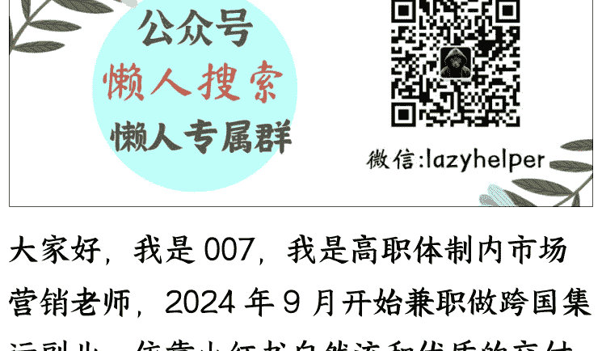

大家好，我是007，我是高职体制内市场营销老师，2024年9月开始兼职做跨国集运副业，依靠小红书自然流和优质的交付流程，到2025年9月，最高单月获客800+，月营收80W+，虽做副业，但让一个破产的企业起死回生。

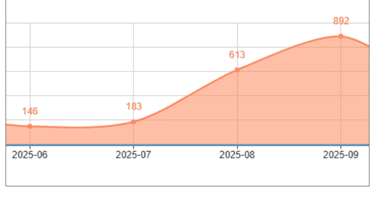

（2025.6-9每个月新增客资）

已付款 9月营收 9月总订单数 总计843个记录

（9月总营收83W，订单数843票）

起步时为夫妻档，我和先生都是在职在编老师，我是经济师，我先生是3D建模师，我俩寒暑假全职，平时工作日中午3小时+晚上5小时兼职，负责运营、客服、打包，日常仓库收货验货由我爸爸一人负责（工作时间为9—17点），拿到了从月营收6000到20W的结果。

起步半年后团队增加了四个全职人员（财务、跟单客服、打包员、验货员）以及1个临时工（按单结算的法务），拿到了从月营收20W到80W的结果。

## 这篇文章分享的是：

- 1. 没有运营能力，看了很多教程却无法生成爆款客资笔记，怎么办
- 2. 如何比同行低成本获客
- 3. 有点运营能力，如何寻找好赛道落地
- 4. 会引流，但交付出现问题，无法变现，怎么办

## 一、集运行业的现状

### 1.什么是集运

跨国集运是一个小众的赛道，服务对象是留学生以及华侨，门槛低，在深圳宝安区有多如牛毛的小型集运公司，大部分是夫妻档，一个40平方的小仓库、一个打包、一个客服即可开店，这个赛道跟装修赛道一样看重专业、踏实做事，集运公司主要是提供了收货验货打包服务，包裹出仓后交给第三方承运商运输和目的国派送公司派送，对于集运公司来说，做好服务和选择靠谱的承运商就足够了。

### 寄国际快递的全流程

网购物品 -> 仓库代收 -> 核对清单 -> 物品筛选 -> 拍照确认 -> 货品装箱 -> 整理发货
路线选择 -> 海运 / 空运 / 铁路
海关清关 -> 申报 -> 查验 -> 放行
抵达派送 -> 包裹已抵达注意查收~ -> 签收提醒 -> 上门派送

### 2.集运赛道获客卷不卷

业界顶流是分为几个流派：

- 1) 淘宝系：菜鸟国际集运、君丰集运等
- 2) 自媒体系：寄小样、panda eu、诚天集运、雁巢集运、九邦集运等（短视频以及博主推广）
- 3) 实体店系：转瞬达等（全国有 7 个分店）
- 4) 顺丰国际、京东国际等（出门就能寄，但物品限制多、费用贵、没有人工客服）

总的来说，集运行业做短视频、小红书获客的人在短视频赛道比较能取得成绩，特别是自媒体系中的寄小样，所有短视频均为原创，老板亲自拍视频做 IP，它的客资每个月咨询稳定在 3000+；而小红书获客比较厉害的是 pandaeu、诚天集运、雁巢集运、九邦集运，他们懂小红书爆款封面和文章，会通过博主图文直发和聚光投流去获客；而其他小型集运还不太知道短视频和小红书的喜好，习惯用 “10KG=85” 的方式去引流：

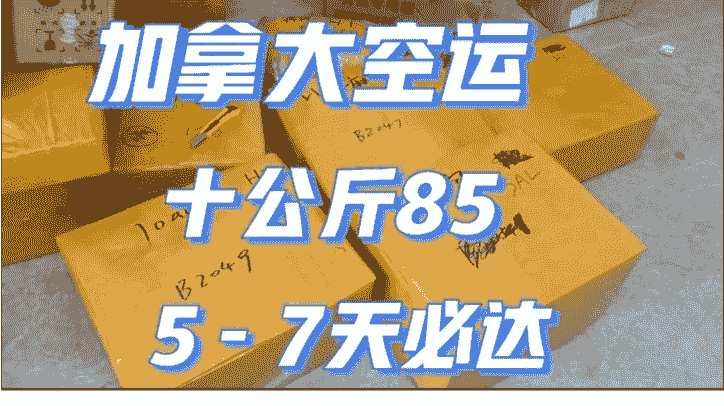

（这种低价虚假的引流方式为交付埋下了雷点）

纵观整个赛道，发现 2025 年和 2024 年的爆款笔记基本款式一致：

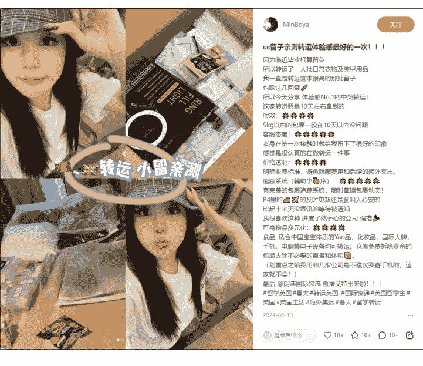

### 2024 年的爆款笔记

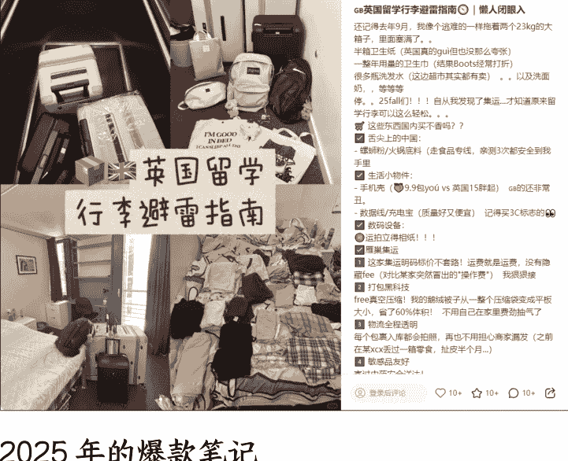

### 2025 年的爆款笔记

而集运公司在消费者中口碑不好，在小红书搜一下，会发现很多避雷贴：

- 1) 低价引流（吐槽最多），包裹到仓后一大堆隐形收费以及附加费，还有收了钱不发货，上图的 10KG=85 是重灾区。
- 2) 打包不当，物品破损、保留太多纸箱增加重量、虚报体积重；
- 3) 售后无门，由于集运公司并非实际承运人无法控制后端的运输派送，在售前没有清晰给客户说明赔付标准，甚至打包票说什么都能寄，最后扣关了、货物被销毁了，或者时效跟宣传的不一样，都会引起客诉，很多公司玩失踪已读不回或者跑路。

低价陷阱、体积重坑、售后无门是留学生和华人找集运公司可能踩到的坑，很多集运公司出了问题就换名称换营业执照换地方继续骗。

基本可以判断，集运在自媒体获客方面是不难的，难点是线下交付，未来，提升服务履约和品牌效应是集运公司生存的重点。

### 3.集运行业适合什么样的人进入

这里分成了引流端和交付端。

### 引流端：

- 1) 已经有留学生资源的商家，可以在原有服务的基础上为留学生提供留学行李和网购物品转运服务。
- 2) 懂得自媒体获客但没有落地盘的，尤其是留学赛道的操盘手，集运和留学的消费群体都是留学生，各种打法基本一致，只要抓住每个月宣传重点，就可以用留学赛道的方法降维打击。
- 3) 想学习自媒体获客，看了很多教程却无法生成爆款客资笔记的新手，集运赛道是偏蓝海的赛道，适合拿来练手，能快速打出客资。
- 4) 有出海资源的商家，集运可以助你一臂之力。

### 交付端：

- 1) 数学专业或者物理专业的人：因为能够快速知道怎么打包更能节约体积。
- 2) 喜欢收纳的人：知道怎样做好物品防护、怎样轻重搭配规划纸箱，面对日复一日的打包工作不会觉得枯燥。
- 3) 愿意钻研的人：集运虽然门槛低，但需要一些基本的国际物流知识，以及常规的客户应对技巧，需要有耐心和不断打磨专业度。

## 二、从业 1 年复盘以及卡点破解

2024 年 9 月，刚接手这个公司，只有一个打包台、一把打包称、五个货架、四台电脑以及一个系统，说是空壳也不为过了，是我最迷茫的时候，我虽然是市场营销专业出身，也教了十年的市场营销了，但我发现自己都是纸上谈兵，学的教的早就与市场脱节了。

而 2025 年 1 月之前，每个月新增十几个客户，加上薪酬比例设置不当，导致整个公司现金流为负，我每个月还需要掏一笔钱来给销售业务员发工资，到最后不得不关停所有的电话营销、百度投流推广，随着销售员的离开也带走了大量的老客户，整个公司面临破产变卖。

### 卡点1：不了解集运市场

#### 解决过程：同行是最好的老师

我独自一个人去了广州东莞浙江福建，走遍了我认识的同行，他们都很慷慨地分享获客、运营、渠道选择和仓库管理经验，也跑了很多承运商了解现在每个国家的形式和行情，2025年1月，我还参加了集运行业的交流会，让我全面了解了小红书获客、短视频拍摄技巧、国际物流法律法规、仓库积分绩效管理等，我才知道原来集运有那么多东西要学。

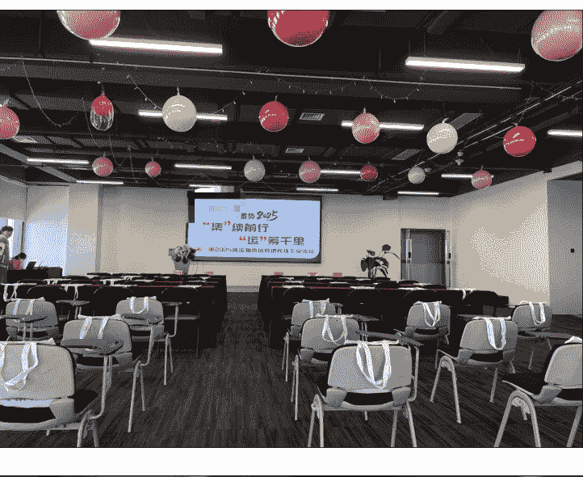

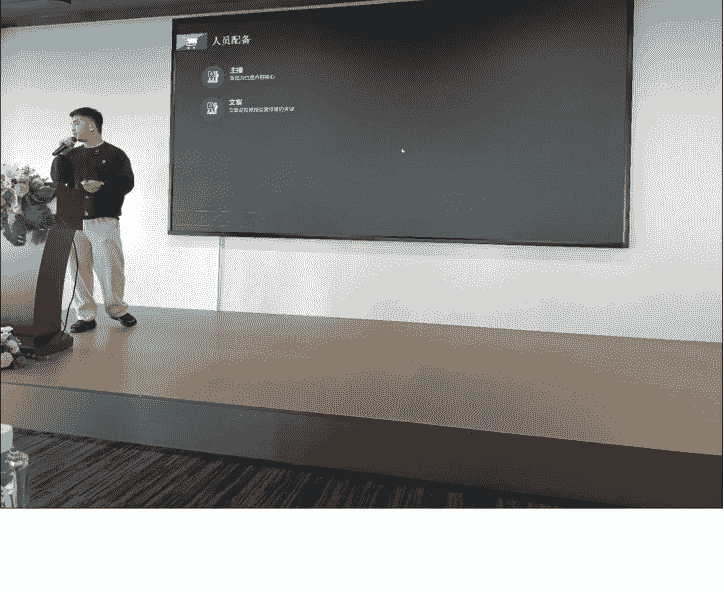

### 解决方案：选英国弃澳洲

经过多番对比和走访了解，最后定下了几家靠谱的承运商，并且选择攻下英国集运市场，原因有三：

- 1) 经过走访留学机构，了解到目前加拿大和美国留学申请很难，英国、澳洲、东南亚的留学生数量不断增长，而这几个国家中，英国的清关宽松且客单价高；
- 2) 淘宝没有开放英国的直邮，英国的消费者需要找集运公司才能寄包裹出国；
- 3) 英国的空海运比较稳定，不会像美国那样加关税和经常查验，也不会像加拿大那样经常罢工影响派送。

不选择澳洲市场：

- 1) 澳洲集运的承运商经常走私电子烟，低价在市场上收留学生的行李去冲电子烟，把电子烟放在货柜中间，留学行李放在最外面以备查验，被查出来就会整柜扣关销毁。
- 2) 客单价低，客户接受不了正常的报价。
- 3) 清关经常出现问题赔付多。

### 卡点 2：不懂得客户痛点，盲目打价格战

#### 解决过程：深挖痛点

2024 年 10 月，我慢慢尝试在小红书上找客户，在无数帖子下留言，同行回复价格，我也拼低价，但是得到的回复寥寥无几。还记得我的第一个客户是加拿大的一个 B 端，因为有时差，那个晚上我跟她聊到凌晨两三点，我穷极所能地去展示我对加拿大物流的专业，从我会怎样给她验货到末端派送公司罢工的影响都一一相告，当她答应在我们家尝试走一次的时候我在沙发上兴奋地跳起来。我对那一单也很紧张，客户寄的是太阳能灯，一共两箱 100 个，我还拍了长达 40 分钟的验货视频发给她，多少个灯珠给数得清清楚楚的，出货后每天都盯着轨迹，从上飞机清关派送都时刻提醒。

#### 360度视频验货 再也不怕被商家坑

- 1. 每箱 50 盒，每盒 2 个。
- 2. 检查太阳能板背后应有两个按钮，一个是开关，一个是模式。
- 3. 按下开关，灯应该会亮，按键会变化亮灯模式。
- 4. 检查灯珠数量及排列。
- 5. 检查灯线是否是 50 支，差 1, 2 根需记录。
- 6. 检查每支灯线上应有三个小灯珠。

姐，通过抽检，1.2.3.4.5.6 点检查过了，第 5 点那里最多刚好 50 支，最少 47 支，总的来说你订得这批货物质量挺不错的，是否可以申请打包出库？

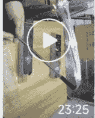

最后 60 公斤的空运稳妥地送到目的地了，我第一次觉得自己总算入门了！

现在同行大多数是 00 后，我的年龄在这个行业是偏大了，但我觉得 33 岁重新挑战自己无论是阅历、心态、资金都刚刚好。

2024.11，双11来了，原本以为会有一个寄包裹出国的高峰期，其实并没有，因为没有持续新增的客户，导致营收跌至谷底，看着同行的仓库塞得满满的快递，每天打包出货货如轮转的，我暗暗告诉自己，别人可以做到的我也可以！

我翻遍了小红书所有关于集运的笔记，把所有用过集运的留学生和华侨的留言记录下来，了解为什么现在的集运公司差评那么多（如上述说明的低价陷阱、体积重虚报、清关交付能力差、收不到货、售后无门），总结出：

用户的需求：
是经济实惠安全如期地收到自己的行李或者网购物品。

痛点是：
- 商家发了货不对版或者破损的物品但集运公司验货没发现直接寄到国外去了
- 集运公司不会收纳打包，体积重很大，运费很高
- 集运公司报价表不透明会有各项附加费
- 验货打包过程看不到会有偷件漏件风险
- 前期说能寄结果被海关扣关
- 末端派送能力差丢件
- 丢件破损不赔付
- 售后找不到人等

### 解决方案：服务定位

最后决定我的理念是做一名没有坑点和槽点的集运公司，我优化了服务流程，并且整理了大量的服务案例，让整个服务交付更加高效透明。

#### 【集运说明书】没有坑点，没有槽点

- 1. 每个包裹到仓都免费拆箱验货，免费个别物品视频或者单独验货，免费仓期是360天，免费代退包裹。
- 2. 打包全程有监控视频，逐一扫扫描、拆箱、装箱，上传到小程序里随意回放观看，且小程序全程可查物流轨迹。
- 3. 验货-打包所有服务都是免费的（打木架、木箱除外），打包后所有重量和体积重均支持复量，如有误差可退差，报价表没有任何隐形收费或者套路。
- 4. 主动裁剪多余纸皮，节省体积重，打包后实际重量多了0.1公斤，会主动割掉部分纸皮，或者跟你协商是否需要添加或者减少物品，帮你节省1公斤的计费重量，曾主动为客户减少1CM的纸箱长度省下300元超长附加费。
- 5. 一对一真人客服，思路清晰回复快，非常有耐心，会主动说清楚体积重计算方式、什么情况下会发生丢件等风险。
- 6. 团队有经济师、会计师、3D建模师、律师，擅长做优化省钱的邮寄方案，曾优化打木架方案为英国客户省下1000元卡板费。
- 7. 独立自有仓库，不转包不外包。
- 8. 不扯皮、不犟嘴、不推卸责任，涉及我司赔付均在48小时内现金一次性赔付。
- 9. 所用航司均为严格挑选，口碑好、负责任、服务好、靠谱的、清关能力强的才选用，以确保包裹安全和时效。

...，没有坑点，没有槽点，更没有任何...
...坑点没有槽点，更没有任何的隐藏套路哈
...一次就知道了。我们家没有坑点没有槽点
...一次就知道了。我们家没有坑点没有槽点
> 服务承诺:
> 没有坑点
> 没有槽点
你坐过一次就知道了，我家没有槽点和坑...
...，也没有槽点，没有任何套路和隐形消费
你走过一次就知道了，我们家没有槽点也...
...次就知道了，我们家没有坑点没有槽点的

### 卡点 3：没有流量，不懂获客

#### 解决过程：学习学习学习

2025 年 2 月，过完年后，我真正开始学习小红书运营，看了珍妮老师的飞书，才明白原来小红书主要是看封面，爆款内容需要洗稿，我发了好几篇笔记，看着两位数的小眼睛，我问珍妮：

#### 我会有天像易寒一样月入20万吗？

#### 没想到我现在月入80万!

经过一个月的打磨,我对洗稿渐渐上手,发的笔记带来了几个客资,虽然不多,但我知道,我的方向是对的,不懂就学,为知识付费。

##### 1)深度学习

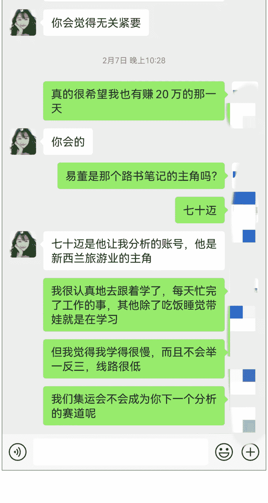

#### 珍妮改作业

#### 从集运公司离职后才敢说的大实话

集运公司离职后的大实话！内容很脏但保真
从集运公司离职后，才敢说的真相
从集运公司离职后，终于能把憋在心里的大实话一股脑倒出来了！干这行这些年，真的见太多人被坑了，今天必须给大家好好避坑！
先泼个冷水，有些集运公司真的就只看钱！你以为交了运费就能当“上帝”？想得美！要是你的包

从集运公司离职后
才敢爆出来的大实话！
内容很脏
但保真

集运公司离职后才敢说的一些事...
从事集运工作5年，换了N个集运公司，离职后总结出来出来的集运避坑tips！
价格：割韭菜中国寄英国38元10KG!!!
因为他们的箱子要20块一个，验货5块钱一件，打包操作费50块一次，报价张口就来，转仓费300一次，10公斤的货最后上千块。

集运公司离职后的大实话!
内容很脏
但保真!

集运公司离职后大爆料！
干了10年集运，换过N家公司
离职后终于能说大实话
了！
这些行业“黑话”今天全曝光

价格陷阱：38元/10KG都是套路！
别被低价迷惑！箱子费20/个、验货5元/件、打包费50/次、转仓费300/次...
10KG货物最后运费上千！

图片比例不对，字也不够黑不够粗。你对比一下你的其他图片，就这张聊天记录的字体粗细不够粗

### 改写：

#### 标题：集运公司离职员工大爆料！中国寄英国必看
正文：
干了集运8年，换了5间集运公司，现在彻底离开集运这个行业了，终于可以把这个行业见到的亲身体会到的都说出来！

价格文字游戏：
【中国寄英国48元/10公斤】：很多集运公司没什么客户，就天天举牌，以低价引流，箱子验货打包都要额外收费，不贵了还要天价转仓费，几公斤的

#### 2）起步时的笔记

| 收货日期 | 单号 | 状态 | 揽收时间 | 揽收时效 | 签收时间 | 签收时效(天) |
|---|---|---|---|---|---|---|
| 1月24日 | OJ328389 | GB | 成功签收 | 1月30日 | 1月30日 | 6 |
| 1月24日 | OJ32831 | GB | 成功签收 | 1月30日 | 1月30日 | 6 |
| 1月24日 | OJ32838 | GB | 成功签收 | 1月30日 | 1月30日 | 6 |
| 1月24日 | OJ328 | GB | 成功签收 | 1月30日 | 1月30日 | 6 |
| 1月24日 | OJ3283 | GB | 成功签收 | 1月30日 | 1月30日 | 6 |
| 1月24日 | OJ3283 | GB | 成功签收 | 1月30日 | 1月30日 | 6 |
| 1月24日 | OJ3281 | GB | 成功签收 | 1月30日 | 1月30日 | 6 |
| 1月24日 | 28097 | 3 | 成功签收 | 1月29日 | 1月30日 | 6 |
| 1月24日 | 28021 | 3 | 成功签收 | 1月29日 | 1月30日 | 6 |
| 1月25日 | OJ328 | GB | 成功签收 | 1月30日 | 1月30日 | 5 |
| 1月25日 | OJ32 | GB | 成功签收 | 1月30日 | 1月30日 | 5 |
| 1月25日 | OJ3281 | GB | 成功签收 | 1月30日 | 1月30日 | 5 |
| 1月25日 | OJ3281 | GB | 成功签收 | 1月30日 | 1月30日 | 5 |
| 1月25日 | OJ3282 | GB | 成功签收 | 1月30日 | 1月30日 | 5 |
| 1月25日 | OJ3281 | GB | 成功签收 | 1月30日 | 1月30日 | 5 |
| 1月25日 | OJ3281 | GB | 成功签收 | 1月30日 | 1月30日 | 5 |
| 1月25日 | OJ3281 | GB | 成功签收 | 1月30日 | 1月30日 | 5 |
| 1月25日 | OJ3281 | GB | 成功签收 | 1月30日 | 1月30日 | 5 |
| 1月25日 | OJ3281 | GB | 成功签收 | 1月30日 | 1月30日 | 5 |
| 1月25日 | OJ3281 | GB | 成功签收 | 1月30日 | 1月30日 | 5 |
| 1月25日 | OJ32818 | GB | 成功签收 | 1月30日 | 1月30日 | 5 |

中国寄英国实锤了！

##### 深圳神仙集运

##### 免费派送上门

##### 包清关包税

##### 0破损

##### 0额外加价

##### 近一年客户增长统计

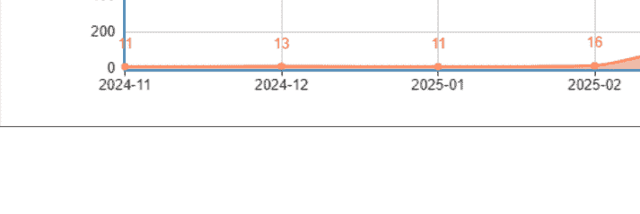

#### 3）成长期的笔记

3月-5月，我继续寻找爆款笔记去洗稿，不断换封面测试，很幸运，第一篇爆款笔记诞生了，蓝V号后台多了很多咨询，从原来十几个咨询一下子跃升到两三百，且转化率很高。

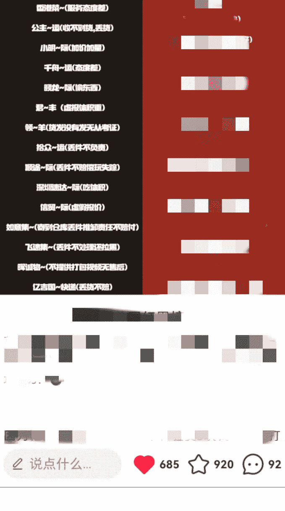

##### 二刷加拿大海运

##### 此生不再海运！

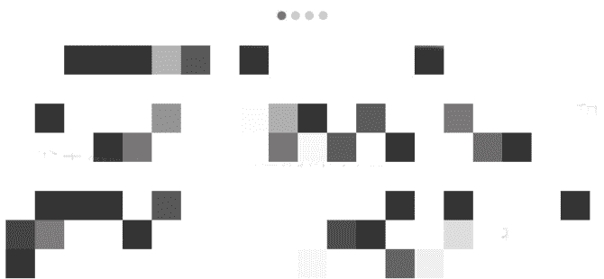

| 指标 | 2025-02 | 2025-03 | 2025-04 | 2025-05 |
|---|---|---|---|---|
| 客户数量 | 16 | 203 | 178 | 226 |

### 解决方案：用学习打破认知天花板

这个东西我不会，我就花学费去请教会的人做得好的人，站在巨人的肩膀上才能看到更多走得更远，比如进入生财的圈子，让我见识了我做教师十年都触碰不到的领域。PS：蓝海赛道的获客成本特别低，同行找博主代发（平均一篇笔记200-500元），或者聚光投流（客资开口成本50元一个）都是比较高的，我用纯自然流的打法最低限度地降低了自己的成本。

### 卡点 4：流量有了，如何提供转化和交付

流量有了，接下来就是交付了，这几个月，我继续优化整套服务流程和案例然后发笔记推出去，比如添加了免费单独拍照和视频验货、打包天花板案例、还有各种疑难杂症的解决方法，收获了600+新用户，并且大部分都会选择下单发一次，这些新客户对我们的评价就是很良心！很靠谱！没有坑点和槽点！

- 1）极致的验货-解决痛点：商家发了货不对版或者破损的物品，但集运公司验货没发现直接寄到国外去了
- 食品检查保质期

#### 无穷鸡翅
验货时间：2025-11-09 11:38:11 验货
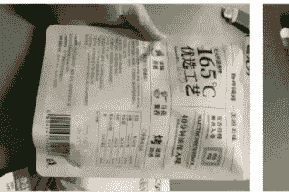
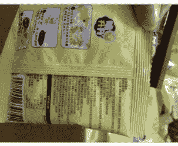

#### 吃的
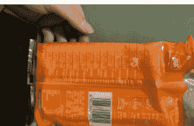
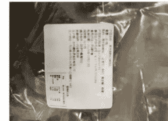

#### 香肠
验货时间：2025-11-07 18:54:05
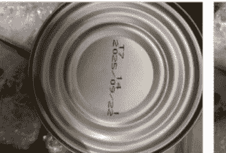

#### 芝麻丸
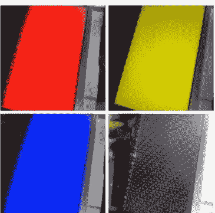
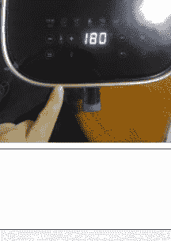

#### 食品

#### 午餐肉
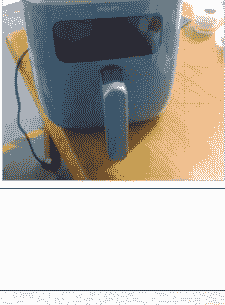

#### 显示屏通电测试：
很多25 Fall都想邮寄显示器出国，来验360°无死角验货，先看外观有无破损，再在线测试色差~
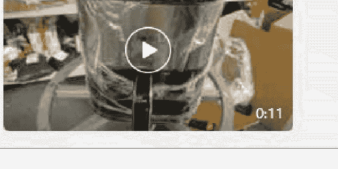

2025年8月27日 19:28

#### 小家电通电测试：
验货时间：2025-07-24 13:23:18 验货人：
功能正常

#### 大家具开箱检查款式以及破损：

10月31日 晚上8:12
0:06
0:25
10月31日 晚上8:19

- 2）打包天花板-解决痛点：集运公司不会收纳打包，体积重很大运费很高

#### 详情
我们的打包小哥真是宝藏男孩🤔一场大雨把这些超重的微波炉纸箱全部弄湿了，小哥们怕这样的纸箱空运到英国会不稳固，连夜加班用吹风机把原箱表面吹干，再用加厚纸皮把每个箱子重新包装一遍，最后再打满防水胶布出货，三台微波炉重达一百多公斤，稳稳地送到你手上！

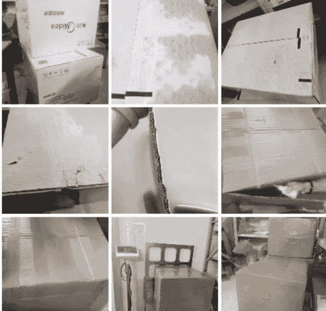
2025年5月8日23:57

本来这个箱子110CM的，DPD超过100也是要附加费330了，我们强行改箱子，改到刚好99CM
哈哈哈哈哈哈6
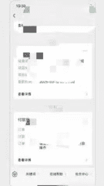
这个我就不用管他了对吧
要是别家就跟你说哥，没办法了，我们尽力了，刚好100
3月12日 晚上21:33
然后怒收你330
😂不，他们应该都不会讲的，就收附加费

上海嘉定区的林前辈要去加拿大生活了，老家的旧家具也有感情了想一起带过去，亿赞上门打包，先用气泡柱把沙发茶几桌子包好，到仓后再打上木架，45天左右可以收到了，低至11元每公斤，服务好运费便宜👍
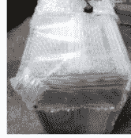
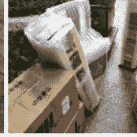
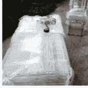
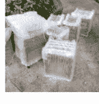
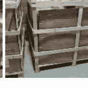
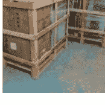
2025年11月3日 20:02

北爱尔兰的顾先生第一次用集运邮寄一批猫笼和宠物用品过去，第一次打木架时发现常规方案会产生两个托盘的卡板费，团队会计师、经济师、建模师齐齐出动，经过两个小时调整，从2个托盘卡板变成了1个，省了1000+的派送费，昨天完好签收了，第一次寄超大件，遇到了神仙集运（emoji）是双向奔赴的幸福🌹🌹🌹
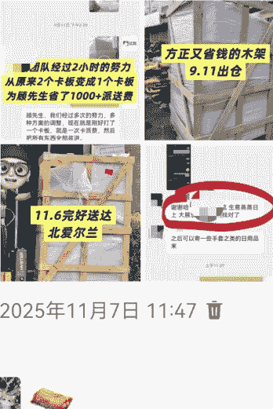
2025年11月7日 11:47

- 3）售后事事有回应-解决痛点：末端派送能力差丢件、丢件破损不赔付、售后找不到人
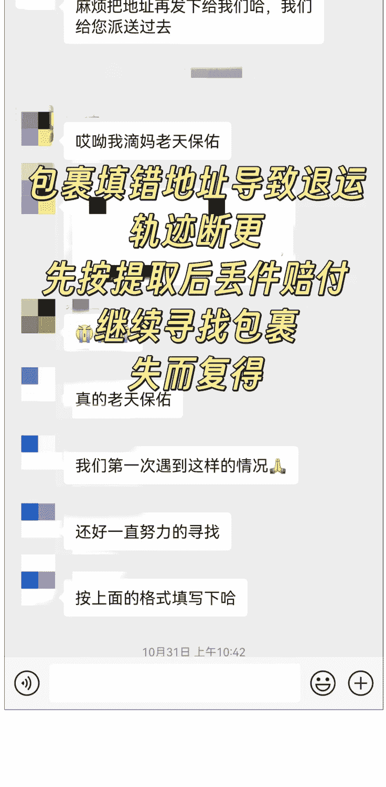

您好，航司已回复，包裹是在香港海关清关中，遇到了海关查验，海关进行开箱检查了，在收拾物品的时候遗漏了您的物品。属于海关丢件了。
我们这边 您...哈，一共 58+26.6=84.6 元。您看下可以

#### 海关查验导致部分丢件核实后现金赔付
您发下收款码哈
我们这边 给您转账
好等会

嗯嗯，目前看起来是还在邮局，麻烦致电皇邮让他们赶紧给孩子送过去吧
用街景看到的
我提醒孩子看下你们的信息，希望她能打通电话

#### 包裹疑似丢件
通过谷歌地图定位
发现还在邮局
成功找回包裹
亲，包裹还在邮局
就在这里

- 4）新增打包视频上传小程序-解决痛点：
验货打包过程看不到，会有偷件漏件风险

#### ( 从拆包到装箱全程视频 )

- 5）详细的服务协议+赔付说明+服务流程-解决痛点：集运公司报价表不透明，会有各项附加费
> 关于报价表:
1. 此报价表有效期为 10 天，超过此期限请重新询价，我司会在小程序不定期更新报价表。
2. 我们的报价表，除了偏远邮编，或者超长超大件，否则没有附加费，报价表也是包清关包税免费派送到门了。
3. 计费方面，请注意：
A. 我们是打包装箱后按实际重量取整计费，15kg 以内是 0.5kg 进位，15kg 以上是 1kg 进位，特厚加硬的纸箱重量为 1-1.5 公斤。
B. 我们的空运是单票单清的，单箱算费，海运是一票多叠加计费。
C. 我们是以实际重量取整计费。
4. 不计体积专线每个箱子的重量是限制 20 公斤，如果你的物品超过了这个重量，或者很轻抛，折叠后或者抽真空后用 50*40*40 的箱子装不下（超过 55CM 的物品请单询），就用两个箱子去装，装箱后的重量取整后根据对应的报价段分别计费。

#### 关于打包：
- 1. 要是你寄递的物品有普货、敏感货：
  - A. 如果普货少就一个包裹走敏感货渠道，因为分开需要增加一个首重以及一个箱子的重量；
  - B. 要是普货多就拆开普货和敏感货两个渠道发运，这样可以节省费用，因为普货价格比敏货要便宜。
  - C. 至于到时用什么方案发运，我们打包的时候会视乎包裹内件情况给出建议。
- 2. 对于你的物品我们会重新整理装箱的，我们家没有任何套路，抽真空、加固、防护、防水等耗材服务全免费（打木架和木箱除外），但我们采用的加固包装，比如易碎品用气泡纸包裹、液体用箱中箱防护，对包装导致的破损不承担责任，玻璃、陶瓷、没有原箱包装的家电等易碎物品只保丢失，不保破损，如有特殊打包要求，请在申请邮寄时提前备注。
- 3. 因物流环节众多，破损通常发生于尾端派送环节或是海关开箱查货环节，物品过期多数因海关清关问题导致的时效延误，集运公司无法做到避免和干预，因此破损、物品过期不提供额外理赔。

### 服务协议
我司工作人员有权在监视器下查验会员的货物是否属于国家禁止或限寄物品，以及确认物品名称，类别数量等，并在仓库百分百过安检机，一旦发现有危禁品或国家管制品我司有权立即向相关部门报告，并配合有关部门处理。

#### 二、跨国运输及通关
我司需负责将会员的货物大陆通关出口，订舱运往目的地，且有义务协助会员目的地通关事宜，并负责将货物交接承运商派送到达目的地。会员填写运单需务必备申报正确品名、数量、货值，以便货物更好的顺利通关，如因会员谎报品名数量货值，或因当地政策原因导致货物无法顺利通关，被目的地海关退回，罚款或罚没，造成的损失后果需由会员承担。

#### 三、跨国关税
货物到达目的地都会经过目的地海关，如货物价值超过目的地国家或地区的免税范围，则可能被征收关税，邮寄货物前会员需要把可能产生的关税成本预算在内，(包税服务渠道除外)，如果被征收关税，会有当地海关税单给到收件人，需收件人自行支付税金，如收件人拒付自动更改为会员支付。
请仔细阅读协议(还剩5秒)

- 6）会获客+懂交付拿到的结果
你们在小红书的口碑很好的
现在在海外的人更多的用小红书
我不太清楚這種情況，因為我就是在小紅書看到你們非常好
我在小红书上看到的你家，推荐说不错

### 卡点 5:小红书爆款笔记违规下架，素人号被大规模封号
2025.6-7 月，我找了珍妮老师深度请教，当时珍妮团队给了我两个方向：
1）集运现在是蓝海赛道，要在赛道不卷的时候做 IP；
2）图文笔记现在可以拿到结果的话，形成自己 SOP。但我还是选择了最容易下手的单篇图文，因为来钱快，可以快速拿到结果，就这样，不温不火地度过了两个月。

2025.8-9 月，恰逢留学行李季，经过两个月的打磨，诞生了好几篇爆款笔记，但有些被同行举报，有些被平台判定违规了，
这时候我了解到有些同行是通过找博主图文直发的形式去推广，我也模仿同行，找了几个博主推广，在爆款笔记和博主的双重推力下，这两个月新增客资 1500 个（是以前三年总和的 2 倍），9 月营收达 85W，团队从原来的 4 个人变成了 10 个人。
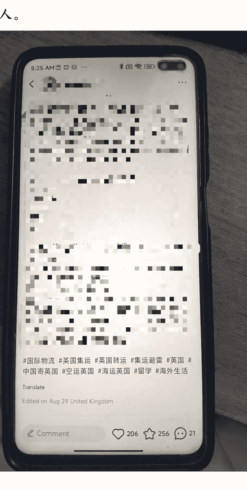

#### 账号审核详情
#### 处置结果
- 1. 禁止修改用户资料
- 2. 历史评论、笔记将不被对外展示，新发内容不受影响
- 3. 账号的流量曝光和商业权益已受到限制
永久生效

#### 存在问题
亲爱的小红薯，根据平台安全机制检测，你的账号可能存在非本人操作风险。为保护你的创作内容与隐私安全，我们暂时关闭了社交互动功能。请通过下方“自助解除”按钮进行实名信息+人脸识别双验证确认账号归属，验证通过后将即时解除限制，同时验证过程中的相关信息我们也会严格保密。

#### 以上内容对你是否有帮助
无帮助
有帮助

#### 笔记审核详情
发布于 2025-02-26 19:00:00
#### 处置结果
该篇笔记已不可被他人查看
处置时间：2025-09-17 16:26

#### 存在问题 规则百科 >
- 1. 可能存在发布虚假产品测评的问题，如以合集的方式对同类产品进行不合理排序、利用非实拍抠图合集进行虚假评价、利用商品真假对比测评间接推广假货等
- 2. 可能存在利用资源分享等方式引导用户前往第三方平台的问题，如创业教学、小说推文、影视资料等
- 3. 可能存在假冒专家或权威机构推广产品/服务的问题，如以专家名义科普小妙招、以权威机构为背景夹带推广产品/服务等
- 4. 可能存在使用绝对化、保证性用语或过度美化使用效果的图片素材，夸大宣传产品/服务功效的问题
- 5. 可能存在虚构人设或经历的问题，如编造前后行为矛盾、人设不一的故事吸引流量，继而推广产品/服务等
- 6. 可能存在构建互动话题推广产品/服务的问题，如利用博眼球素材引流进行铺垫营销、与他人问答式打配合推广特定产品/服务等

#### 平台建议
建议修改笔记后重新发布：
平台鼓励“真诚分享、客观评价”的种草态度，使用引流手段进行虚假营销推广可能会干扰其他小红薯的消费决策，引起他人反感，且重复违规可能会影响到账号的商业权益。分享真实且客观的种草心得，才更容易获得他人的关注与喜爱，点击上方【规则中心】按

### 解决过程：
#### 自我复盘：
- 1）不熟悉留学进度，所有推广都比同行慢半拍。
- 2) 单凭个人力量，不能放大爆款笔记的效果。

#### 解决方案：
- 1) 找了汐米做一次集运赛道的深度调研，然后找乔庭在调研报告上形成 SOP，购买小红书实名号，找成熟的写手去广泛铺稿，提高小红书的搜索排位；
- 2) 找博主图文直发，争取在年货节时再冲量，并为未来留学季做好铺垫；
- 3) 研究聚光投流，放大爆款笔记效果。
- 4) 开多张营业执照，把爆款账号全部升级蓝V号，防止封号。

## 致谢
最后，感谢生财有术！这里聚集了全国最最最会搞钱，最最最上进内卷的富哥富姐，
有留学生资源、出海商家资源的圈友欢迎和我交流，
我正在设计一套佣金结算机制，每个客户你都能溯源并且自动分配佣金，
愿我们携手共进，一起出海取财！

## 最后，安利小懒的付费群：
### 懒人专属群（介绍）

懒人专属群持续更新中，已持续运营6年，整理超3000份各类精选付费文章&年费社群干货，全部开放下载。
本资料为付费群内部分享，仅供真实有需要的朋友查阅

### 懒人专属群更新记录：
https://hk57gvIx7u.feishu.cn/docx/H0kRdZbSboIBROxkaXtcuVE0nTg

### 懒人专属群更新记录（需梯子，备用）：
https://lazybook.fun/blog/record2