# 只想当个小 UP，却觉醒了 B 站好物系统

251121 生财精华
公众号懒人搜索，懒人专属群独享
懒人微信：lazyhelper

## 前言

书藏锋敛，才惊四野。哈喽大家好，我是生财 00 后鹿书野，第一年加入生财，聚焦做 B 站好物从 0 开始。75 天，160 个小时，10 来个视频，带货 8000 多单。

总体路程是一步一个脚印吧，第一个月拿到五位数收益，第二个月成为 B 站好物满级推荐官，第三个月（下个月能看到我）进入百万榜。

一共做了 10 来个视频，其中两个 10w+，写了一篇精华帖。佣金 4 万，平台补贴+商单 1 万+，品牌方给的东西一屋子。下个月我的账号就能在 B 站百万榜上被看见了。

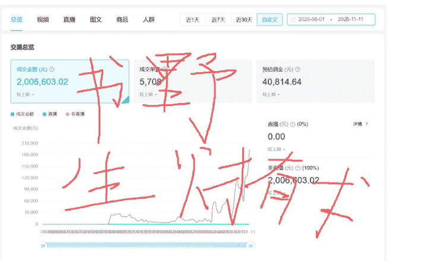

越分享，越收获。深海圈现在已经从几颗星星，逐步往群星闪耀的势头发展了，群内分享的流派和玩法也非常多，但目前的话我还是依旧选择常规横评流，因为太喜欢拆快递了，品牌方给的东西（加上我也买了一些）快把我的出租屋给填满了。

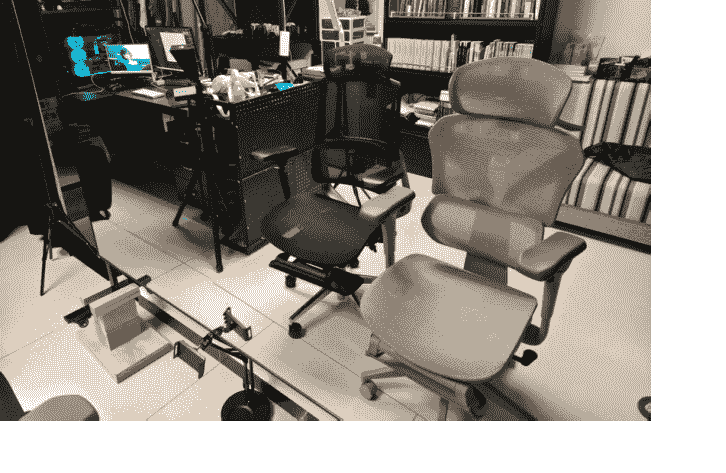

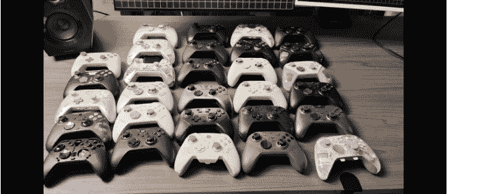

看过我之前的帖子的友友应该知道我的帖子都是比较干的，上一篇精华帖在这里。这一篇当然也延续了这种风格，本篇帖子是当时作为优秀学员的直播稿，虽然是两个月前的了，可这段时间以来，整个工作流程核心上没有变，依然非常有价值。之所以现在才发布，一是因为我需要 3 个月的时间来去验证我的方向是否正确，而不是一时的侥幸；第二是因为备战双十一太忙了；最后外加“深海圈圈友先吃”的一点点偏爱。

## 直播海报信息

**B站好物 | 优秀学员分享 | HOT SALE!! | bilibili**
只想当个小 UP，却觉醒了 B 站好物系统
分享嘉宾：鹿书野
简介：【生财实战深海圈】优秀学员
9月25日 周四晚上 20:00 企微直播 扫码预约 >>>
【深海圈】B站好物交流群(426)

+ 感谢书野大佬的分享🎉🎉
+ 感谢书野大佬的分享🎉🎉
+ 感谢书野大佬的分享🎉🎉
+ 感谢书野大佬的分享🎉🎉
+ 感谢书野大佬的分享🎉🎉
+ 感谢书野大佬的分享🎉🎉
+ 感谢书野大佬的分享🎉🎉
+ 感谢书野大佬的分享🎉🎉

当然现在做也不会晚，就是有一点，就是我比较享受爬坡的过程，是能接受不断的投入 10 来个小时去做一个视频的，并且边做边大量思考的。并且由于我做出来了第一个 10w+（自然流），已经有手感了，第二个月又做出了爆款的 10w+，正反馈是比较高的（当然我前期的积累也很多）。可能有的圈友花了大量的时间但是不出单的情况，我还是比较推荐大家先尝试源神口播流获取一点点正反馈，再做我这种号。

## 一、复杂的事情想要不乱，当然需要系统

### 顶层设计与认知 / 系统化思考 / 模块化执行

做长视频嘛，就是在慢慢爬坡~~~
大伙一开始做视频会遇到的卡点可能有这三个：

### 阶段一：卡在视频制作上

剪辑最耗时，成片又不满意；返工多、效率低、节奏乱，如何能稳定的输出质量还不错的视频？

### 阶段二：卡在选品上

生产稳定了，那接下来，“管他三七二十一，先做了再说”。

前期没问题，但若注意选品，更可能事半功倍！猛猛出单！
更深一层，还有个隐性卡点——心法和自驱力。
目标不清、焦虑与恐惧、反馈机制弱、难形成稳定正循环。

### 那么我的解决方案就是建立系统

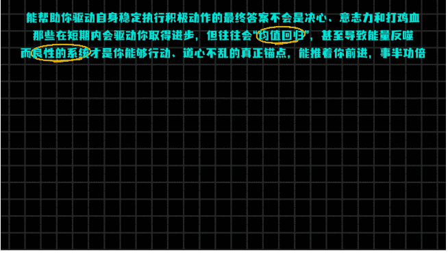

系统能告诉你，你当下应该做什么——下一步要做什么，减少思考耗能。
系统能提醒你，这步该怎么做——要注意什么，让你更能聚焦。

#### 丰田 TPS 两大支柱：标准化和自动化，先有标准化，才能“自动化”

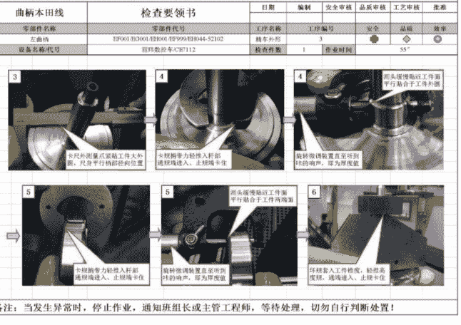

e.g. 作业要领书
- 记录工作的所有步骤
- 以及每个步骤中要注意的点
这就是“标准化”。

我把这套系统模型打磨得差不多啦～目前主要有两个核心模块：一个是 **我在选品时系统化的思考模型**，一个是我自己用的 **标准化生产系统模型**。此外，文章的最后一部分还专门增设一个“心力加油站”。

## 二、差异化竞争的选品模型

之前一直都没太正式介绍过我是做什么的，这次简单介绍一下，我是公司战略运营部门的，做精益管理工作。这里有两个关键词，一个是战略，一个是精益管理（起源于丰田的生产方式，研究提效的，写 SOP 算是基本功）。精益管理，大家看第三部分生产系统模型就行啦，我的生产系统是有很多流程的分析与设计在里面的。

目前还是手工，但已经标准化了，下一步就是考虑自动化了，利用 AI、RPA 的提效，把自己能最大的发挥价值的事情留给自己。

| 流程程序图 |
| :--- |
| **图号:** | **页号:** | **总页数:** |
| 地点: *** | 编号: *** | 对象: 饺子准备 |
| 制表人: *** | 日期: 2009 年 12 月 16 日 | 方法: 改善前 |
| **统计** | | | |
| **活动** | **次数** | **时间/min** | **距离/m** |
| 作业 | 11 | 79 | |
| 搬运 | 6 | 41.5 | 2435 |
| 等待 | 3 | 4 | |
| 检查 | 2 | 1.5 | |
| 储存 | 1 | 1 | |

| **序** | **说明** | **距离/m** | **时间/min** | **符号** | **备注** |
| :--- | :--- | :--- | :--- | :--- | :--- |
| 1 | 至好又多超市 | 1200 | 20 | O → | |
| 2 | 挑白菜 | 2 | | O → | |
| 3 | 至面粉柜台 | 5 | 0.5 | | |
| 4 | 挑面粉 | 2 | | O → | |
| 5 | 至称重服务台 | 5 | 0.2 | | |
| 6 | 排队称重 | 1 | | D | |
| 7 | 称白菜及面粉 | 1 | | □ | |
| 8 | 至卖猪肉柜台 | 10 | 0.3 | | |
| 9 | 挑肉 | 3 | | O → | |
| 10 | 排队称重 | 1 | | D | |
| 11 | 称肉 | 0.5 | | □ | |
| 12 | 至收银台 | 15 | 0.5 | | |
| 13 | 排队付款 | 2 | | D | |
| 14 | 付款 | 1 | | ∇ | |
| 15 | 回家 | 1200 | 20 | O → | |
| 16 | 洗菜 | 2 | | O | |
| 17 | 切菜 | 3 | | O | |
| 18 | 剁肉末 | 15 | | O | |
| 19 | 制作饺子馅 | 5 | | O | |
| 20 | 和面 | 12 | | O | |
| 21 | 擀皮 | 8 | | O | |
| 22 | 手工包饺子 | 12 | | O | |
| 23 | 下锅煮熟 | 15 | | O | |

| 流程程序图 |
| :--- |
| **图号:** | **页号:** | **总页数:** |
| 地点: *** | 编号: *** | 对象: 饺子准备 |
| 制表人: *** | 日期: 2009 年 12 月 16 日 | 方法: 改善后 |
| **统计** | | | |
| **活动** | **次数** | **时间/min** | **距离/m** |
| 作业 | 9 | 36 | |
| 搬运 | 4 | 20.4 | 1210 |
| 等待 | 0 | 0 | |
| 检查 | 3 | 0.6 | |
| 储存 | 3 | 1.5 | |

| **序** | **说明** | **距离/m** | **时间/min** | **符号** | **备注** |
| :--- | :--- | :--- | :--- | :--- | :--- |
| 1 | 至宏路菜市场 | 600 | 10 | O → | |
| 2 | 挑饺子皮 | 2 | | O → | |
| 3 | 称重 | 0.2 | | □ | |
| 4 | 付款 | 0.5 | | ∇ | |
| 5 | 卖菜摊位 | 5 | 0.2 | O → | |
| 6 | 挑白菜 | 1 | | O → | |
| 7 | 称重 | 0.2 | | □ | |
| 8 | 付款 | 0.5 | | ∇ | |
| 9 | 至卖猪肉摊位 | 5 | 0.2 | O → | |
| 10 | 挑五花肉 | 2 | | O → | |
| 11 | 称重 | 0.2 | | □ | |
| 12 | 机器绞碎 | 1 | | O → | |
| 13 | 付款 | 0.5 | | ∇ | |
| 14 | 回家 | 600 | 10 | O → | |
| 15 | 洗菜 | 2 | | O | |
| 16 | 切菜 | 3 | | O | |
| 17 | 制作饺子馅 | 5 | | O | |
| 18 | 机器包饺子 | 5 | | O | |
| 19 | 下锅煮熟 | 15 | | O | |

那么我们首先聊聊战略：

### 1. 战略的根本目的是要做什么呢？

战略并不是什么高高在上的东西。学术上讲，战略的设计与实施起源于适应外部环境变化的认知，终于形成差异化的核心竞争力。通俗的说，战略的目的就是为了做到差异化，是为了摆脱无意义的卷，也可以理解为我们熟知的 IP 与垂直。

正面战斗永远是最亏的战斗~
同一周期铺很多数量且同质化的视频分流量，导致两败俱伤。
> 最好的战斗：不战而屈人之兵——《孙子兵法》
同一周期没人跟你竞争，偷偷的一家独大没什么人跟你竞争，你先占领了一片天地，那短期内，马太效应会持续稳固你的优势地位。

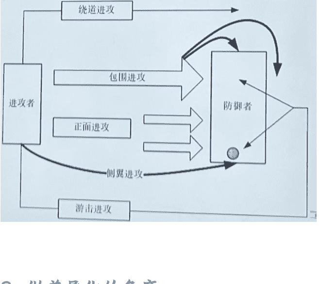

### 2. 做差异化的角度

#### 内部的差异化

- **(1) 个人魅力：信任的硬通货**
  - 举例：
  - **真实的脆弱普通人感**：大方地分享创作过程中的挑战、失败和学习心得。这种不加掩饰的真实能够迅速拉近与观众的距离，建立起“我们是一路人”的强烈情感纽带。
  - **感染力十足的热情**：对所探讨的主题展现出源自内心的、不容置疑的热爱。这种热情具有极强的感染力，能够跨越屏幕，点燃观众的兴趣，并为创作者的专业性背书。
  - **权威性的幽默感**：能够用风趣、易懂的语言将复杂或高深的知识“翻译”给大众，既展现了专业深度，又避免了居高临下的说教感。
- **(2) 视频结构**
  - 举例：一则经验的带货视频，其结构绝非简单的“开箱-测评-总结”三段论。
  > @老师好我叫何同学——故事→挑战/创意→作为解决方案/工具的产品
- **(3) 视频风格**
  - 剪辑节奏：快节奏的蒙太奇，还是舒缓的长镜头；跳切、匹配剪辑等手法的运用。
  - 图形标识：字体、片头片尾、信息图表等视觉元素的统一性。
  - 影像语言：构图、镜头运动、色彩调校，都是可以打造特色的地方。
- **(4) 人设 IP**
  - 标志性元素：口头禅、反复出现的“梗”、固定的视频栏目，这些小细节能让你更有记忆点。
  - 鲜明的原型：扮演一个清晰且令人印象深刻的角色，大家一下子就记住你了。

#### 外部的差异化

- **(5) 人群的垂直**：专卖给 xxx 人群，简单说就是“专门服务某一类人”～比如你就聚焦“职场新人”“宝妈群体”“学生党”这类特定人群，做他们专属的内容和选品，精准又有亲和力。
- **(6) 价位的垂直**：比如就盯着“500-1000 元价位”的产品做内容，不管是数码、家居还是服饰，都围绕这个价位段深耕，让用户想到这个预算区间就想起你～
- **(7) 需求的垂直**：国庆旅行必备套装合集，这个就是一个典型的需求垂直——精准抓准大家“国庆出行要备什么”的明确需求，做针对性的推荐，你说转化率能不高嘛～
- **(8) 小众爱好的垂直**：骑行，卖车和配件。

### 3. 抓好周期更替与群体需求

在充电宝的视频失败后，我还敢选择床帘这个小众的品，原因在于我知道开学季，大学生群体对床帘有需求，且这个品类在今年并没有太多竞争者。

- **(1) 经验**：平日里总结好好“周期 x 群体 x 需求”矩阵，提前准备好高质量的子弹，针对性的往上打。
**床帘——完美交汇典例**
**周期**：“开学季”（8月至9月）是一个极其明确、能量高度集中的市场周期。每年此时，数百万大学生集中进入或返回校园，触发了对宿舍用品的刚性需求。这是一个可预测、高强度的消费浪潮。
**需求**：“大学生群体”是一个边界清晰、需求明确的目标客群。在集体宿舍这一特定场景下，他们面临着隐私缺失、空间有限、个性化表达受限等共同痛点。
这也是为什么我 3 个视频产生的收益能比有的账号做 200 多个视频的收益还多十几倍的原因。

17:14 | 美团 | 4分钟 | 鹏LuLu·心电同频 CD.007683
1.1万粉丝 | 73关注 | 3342获赞 | 充电 已关注
扑克君通透测评 LV5 年度超大会员
找我官方合作 这里是一个把市场品类和选购要点都… 详情 IP属地：天津
没名字了We… 阿七评测… 等20人也关注了TA >
小店 已售3000+单 | 充电 2人充电
主页 动态 投稿 小店
视频 数码横评 | 播放全部 三 最新发布

**2025年9月开学季 宿舍好物推荐 洗漱用品 小电器 床上用品 08:49**
【宿舍好物】大学生宿舍好物推荐！寝室好物推荐！2025宿…
9月19日 | 457 | 4

**2025年9月开学季 寝室床帘怎么选？ 一体式 分片式 折叠式 U轨式 12:11**
【床帘】大学生宿舍床帘该怎么选？2025全站最全床帘推荐！…
9月3日 | 7.8万 | 115

**2025年9月开学季 新国标全价位充电宝推荐 附带新国标要点解析！ 13:35**
【新国标充电宝推荐】2025年9月开学季新国标安全充电宝推荐…
8月30日 | 1.1万 | 58

再怎么找也没有啦。

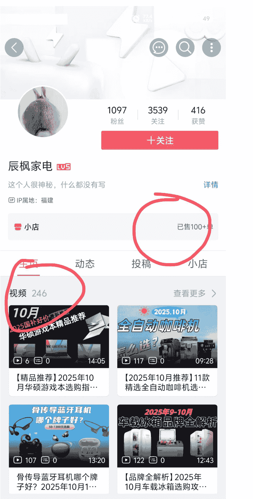

- **(2) 做法**：多总结购物平台、B站平台每段时间的爆品，记录下来，大不了等明年再备战。

| 序号 | 大型卖点 | 时间段 | 类别 | 需求 | 群体 | 时间点 | 星级 | 效果 | 备注 | 评价 |
| :--- | :--- | :--- | :--- | :--- | :--- | :--- | :--- | :--- | :--- | :--- |
| 1 | 开学季 | 8月末-9月 | 家居，日杂 | 床帘 | 大学生 | 9月初的第一周内 | 5（已验证） | 大爆特爆 | 10万以上gmv | |
| | | | | 麻袋 | | 8月底最后一周周一 | 4 | | | |
| | | | | 除螨 | | 月初刚需 | 5 | | | |
| | | | | 宿舍好物 | | 月初刚需 | 3（待深入） | 合集，报出单，但不太有针对性 | 1000左右gmv | |
| | | | | 床垫 | | 月初刚需 | 4 | | | |
| | | | | 枕头 | | 月中末可能买 | 3 | | | |
| | | | | 电动牙刷 | | 月中末可能买 | 3 | | | |
| | | | | 椅子 | | 月中末可能买 | 4 | | | |
| | | | 外设产品 | 键盘 | | 月中末可能买 | 4 | | | |
| | | | | 鼠标 | | 月中末可能买 | 4 | | | |

## 三、标准化生产系统模型

### 个人用的模板在这里

目前基本上一个视频的产出要 12 个小时，剪辑时间大概 2 个小时以内。

| ☐ | ☑ A=任务 | ☑ 是否完成 | A=计划做的时间 | A=时间记录 | A=预估时间 |
| :--- | :--- | :--- | :--- | :--- | :--- |
| 1 | 一轮选品 | ☐ | | | 20 |
| 2 | ppt模板 | ☐ | | | 20 |
| 3 | 商品介绍 | ☐ | | | 3,4,5-180 |
| 4 | 商品ppt | ☐ | | | |
| 5 | 二轮定品 | ☐ | | | |
| 6 | 写前言+铺垫 | ☐ | | | 60 |
| 7 | 修稿+录音频+定稿 | ☐ | | | 120 |
| 8 | 划素材 | ☐ | | | 20 |
| 9 | 稿定设计补充素材 | ☐ | | | 60 |
| 10 | 粗剪辑 | ☐ | | | 30 |
| 11 | 补实拍、挑选之... | ☐ | | | 40 |
| 12 | 精剪辑 | ☐ | | | 60 |
| 13 | 做封面 | ☐ | | | 30 |
| 14 | 做蓝链格式 | ☐ | | | 20 |
| 15 | 发布+蓝链 | ☐ | | | 40 |
| 16 | 素材归档 | ☐ | | | 20 |

### 0. 系统设计时考虑的核心要素

- **（1）自创的高效剪辑方法**
  把剪辑分为粗剪辑和精剪辑。
  - **粗剪辑任务（30 分钟左右）**：铺音轨，铺底片（动态背景/人物口播），文稿对齐，根据字幕铺照片。
  > ps：视频分为 A-roll 流（底片铺人物口播）和 B-roll 流（底片铺动态背景）。
  - **精剪辑任务（60 分钟左右）**：填空白，加入场与出场，加音效，做完视频。

### 围绕着剪辑来构建生产系统

- **（2）模块化的拆分，为自动化铺垫**
  所有的任务都要模块化拆分，动作标准化，标准化的工作未来可以让 AI 来做。
  - **1. 初步选品（20分钟）**
    - (1) 做什么：在确定品类后对品类进行选品。
    - (2) 小技巧：
      - 01：利用锁佣机制，提升佣金收入。

**锁佣机制：**
点了链接，15天，同店锁佣（好像是，不太确定），异店锁佣，时间会短很多。
同店没买这个买别的，也有佣金。没买这个品类，跨店买相同品类，也有佣金。
e.g. 即使佣金少我也会带类似于京东京造的百货模式的牌子。你没卖这个品类，卖了别的，有佣金，例如推京造充电宝的链接，他买了京造的椅子，毛巾和雨伞。

### 佣金

**京东京造黑武士pro全自动雨伞自动折叠伞便携遮阳男士晴雨两用10骨**
佣金比例 10.10% | 分成比例：100.00%
| 购买数量 | 预估计佣金额 | 预估佣金 |
| :--- | :--- | :--- |
| 1 | ¥45.94 | ¥4.64 |
主订单号：321723506782 | 订单号：336026383905 | 下单：2025-09-03 18:12:51

**京东京造90g纯棉7A级抗菌毛巾A类柔软吸水新疆长绒棉洗脸大面巾单条浅灰**
佣金比例 2.00% | 分成比例：100.00%
| 购买数量 | 预估计佣金额 | 预估佣金 |
| :--- | :--- | :--- |
| 1 | ¥9.11 | ¥0.18 |
主订单号：321723506782 | 订单号：336039935397 | 下单：2025-09-03 18:12:51

**京东京造Z5 Soft人体工学椅电脑椅办公椅子电竞椅人工力学座椅久坐学习椅**
佣金比例 5.00% | 分成比例：100.00%
| 购买数量 | 预估计佣金额 | 预估佣金 |
| :--- | :--- | :--- |
| 1 | | |

首页 | 佣金 | 榜单 | 消息 | 我

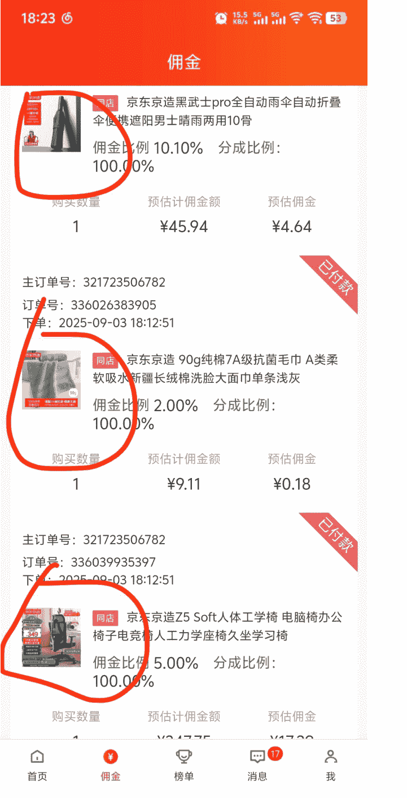

- 02：京东搜索榜，把主流商品留下，要确保横评里每个品牌至少留一到两个。利用锁佣机制，只要观众打算买这个品类，会搜一搜搜索榜单，看一看有哪些牌子，或者本身就有一些带有预期的牌子。

当观众看到你的视频介绍了他熟悉的牌子，大概率会看，点一下蓝链。

咱们的核心目标就是观众点击蓝链。因为不管观众买具体哪一款（无论低价档还是高价档），都能吃到锁佣，都有money。

- 03：埋一两款“高佣小众”品牌；且在对应的品类/价格档位里，不要同时摆放可平替的主流低佣产品。

比如从 0 到 500 有 5 个价格档位，你挑一个价位，例如 300-400 价位，这个价位只埋高佣，不要放低佣主流产品。

或者这个产品有若干个类型，挑一个类型，这个类型只放高佣，不要放低佣主流产品。

可以有更多的维度，可以综合使用，排列组合。

万一观众真就买了呢，一单高佣能抵 5-10 单主流中低佣。

| 佣金比例 | 分成比例 | 预估计佣金额 | 预估佣金 | 实际计佣 | 备注 |
|---|---|---|---|---|---|
| 30.00% | 90.00% | 210.8 | 56.92 | 210.8 | |
| 30.00% | 90.00% | 103 | 27.81 | 103 | |
| 30.00% | 90.00% | 322.4 | 87.05 | 322.4 | |
| 30.00% | 90.00% | 167.4 | 45.2 | 167.4 | |
| 30.00% | 90.00% | 39.47 | 10.66 | 43 | |
| 30.00% | 90.00% | 139.53 | 37.67 | 136 | |
| 30.00% | 90.00% | 155 | 41.85 | 155 | |
| 30.00% | 90.00% | 155 | 41.85 | 155 | |
| 30.00% | 90.00% | 155 | 41.85 | 155 | |
| 30.00% | 90.00% | 155 | 41.85 | 155 | |
| 30.00% | 90.00% | 155 | 41.85 | 155 | |
| 3.00% | 90.00% | 158 | 4.27 | 158 | |
| 3.00% | 90.00% | 168 | 4.54 | 168 | |
| 3.00% | 100.00% | 127.05 | 3.81 | 127.05 | |
| 3.00% | 90.00% | 158 | 4.27 | 158 | |
| 3.00% | 90.00% | 158 | 4.27 | 158 | |
| 3.00% | 100.00% | 127.05 | 3.81 | 127.05 | |
| 3.00% | 100.00% | 207.05 | 6.21 | 207.05 | |
| 3.00% | 90.00% | 268 | 7.24 | 268 | |
| 3.00% | 90.00% | 168 | 4.54 | 168 | |

### 04：高效选品，先划类型，再划价格档位，每个类型里的不同档位都至少选 3 个，确保能满足上面的两条需求。

先多选一些，先不要做筛选，不要过多的用脑子判断，20 分钟先选出来，查缺补漏后面再做，不然会很浪费时间。

因为你大概是不知道各个商品的特点的，等后面写商品文案的时候，了解了商品，再去掉没有必要带的品。

（去掉在类型上，价格档位上，功能差不多的这种重复的品）

#### 2. 做 PPT 模板（20 分钟）

(1) 做什么：确定核心数据，做一个能套用的初版 PPT 模板。确定核心数据比较重要，但可以用别人的，但自己要清楚要关注哪几个点，主要方便自己后面写文案。做一个差不多的能套用的 PPT 模板就行，尽量用以前的模板微调。

(2) 小技巧：利用套版批量套用 PPT。基本上各种设计软件都有这个功能，参数你甚至可以用 AI 爬取到信息表里，上传数据一套就行。

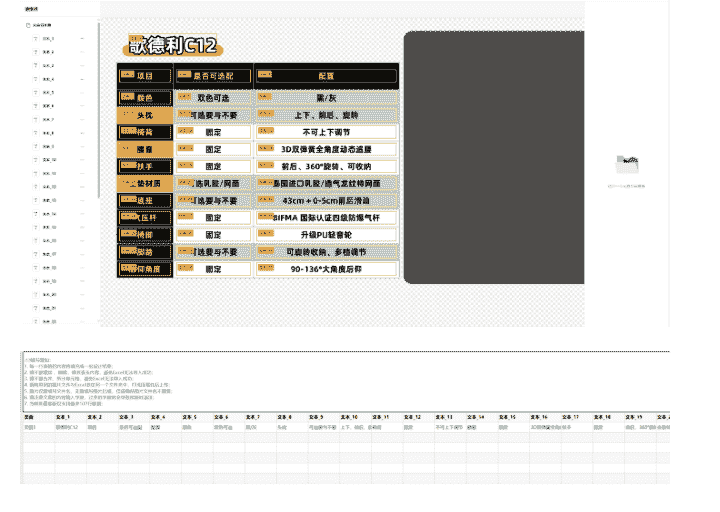

#### 3. 商品介绍 + 商品 PPT + 二轮定品（平均一个商品 10 分钟，预计要 3 个小时做完）

(1) 做什么：边看品，边写介绍稿（先写粗略版的，后面还会精修），边做商品 PPT，边去掉多余的品做定品。看商品介绍页面，他有啥你写啥就行，也不用提参数什么的，顺带截图把商品图片之类的粘到 PPT。过程中每个商品基本都看了一遍了，要去掉在类型上，价格档位上，功能差不多的这种重复的品。

#### 4. 写前言 + 铺垫稿（60分钟）

(1) 做什么：写前言 + 铺垫稿，这步的核心是铺钩子，想想怎么激发观众兴趣。

(2) 怎么写：可以看看我之前写的帖子中第二部分 2.3.1 的部分。

#### 5. 修稿 + 录音频 + 定稿（120分钟）

(1) 做什么：主要修改商品稿，录稿子的时候发现有不通顺的地方修改一下措辞。之前写稿的那版稿子都是商品描述，这版要修一遍商品稿子，技巧可以看看我之前写的帖子中第二部分 2.3.1 的部分。

(2) 提示：要录全部的稿子，定稿很重要，不定稿就没有音轨，没有音轨就做不到高效剪辑。如果剪辑的时候突然发现文稿还能优化怎么办呢？不要管他，每个视频推的品这个月推荐完了，下个月还能推荐，这版就不要动了，可以下个月复用的时候再修稿子。

#### 6. 划素材（20分钟）

(1) 做什么：过一遍定稿文档，确定各个句子做成视频的时候用什么素材。

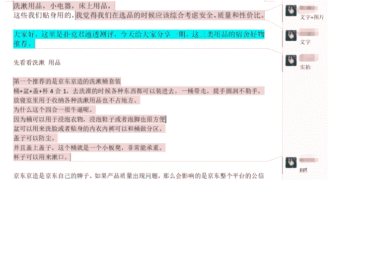

洗漱用品、小电器、床上用品，这些我们贴身用的，我觉得我们在选品的时候应该综合考虑安全、质量和性价比。

文字 + 图片
大家好，这里是扑克君通透测评，今天给大家分享一期，这三类用品的宿舍好物推荐。

文字
先看看洗漱用品

实拍
第一个推荐的是京东京造的洗漱桶套装。桶 + 盆 + 盖 + 杯 4 合 1，去洗澡的时候各种东西都可以装进去，一桶带走，提手圆润不勒手，放寝室里用于收纳各种洗漱用品也不占地方。为什么这个四合一很牛逼呢？因为桶可以用于浸泡衣物，浸泡鞋子或者泡脚也很方便；盆可以用来洗脸，或者贴身的内衣内裤可以和桶做分区；盖子可以防尘；并且盖上盖子，这个桶就是一个小板凳，非常能承重；杯子可以用来漱口。

PPT
京东京造是京东自己的牌子，如果产品质量出现问题，那么会影响的是京东整个平台的公信力。

(2) 划分类别举例一共有五种，要交叉着排布。

- 01 实拍
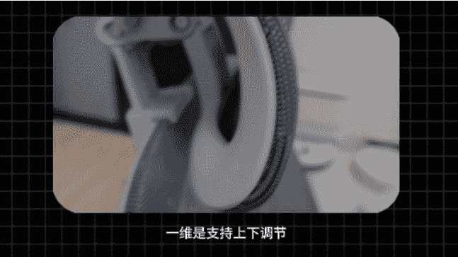

- 02 文字

- 03 商品视频

- 04 图表
洗漱用品
小电器
床上用品
洗漱用品，小电器，床上用品
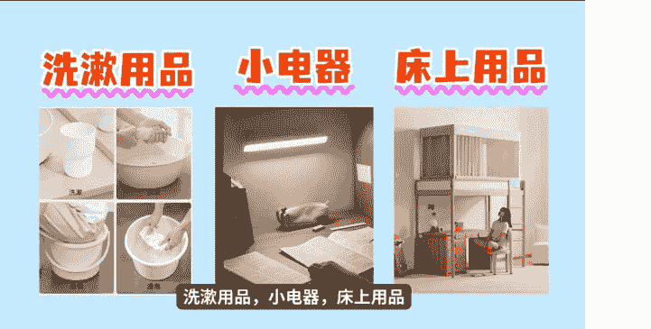

| 快充协议 | 说明 |
|---|---|
| PD协议 | 苹果设备/部分安卓高端机的首选协议，支持高功率快充，通用性强，覆盖面广。 |
| QC协议 | 高通推出的快充标准，适合大多数中高端安卓机型。 |
| SCP/FCP协议 | 华为私有快充协议，华为用户首选。 |
| UFCS 协议 | 融合快充标准，由中国信通院、华为、小米、OPPO、vivo等联合制定的新一代融合快充协议。 |
| VOOC/Flash Charge 协议 | OPPO和 vivo 的专属协议，充电快但兼容性一般。 |
| 注：表述为常见理解与使用场景，具体兼容性以设备与厂商公布为准。 | |

- 05 表情包
城市套路深，我要回农村...
充电宝水太深了

- 06 PPT（主要是在商品介绍部分用）

#### 7. 稿定设计补充素材（60 分钟）

(1) 做什么：除了商品视频和实拍，缺的一切素材都用稿定设计补充（为了后面的剪辑）。

(2) 怎么做：图片（包括 GIF 图）、文字一排版，背景调成透明。像这种动画，你要是自己在剪映里做也需要半个小时，但这个你在稿定设计里做图片只需要 10 分钟。做完图片拖到导轨加个入场就是质感牛逼的动画了。

动画效果：
图片效果：

#### 8. 粗剪辑（全是 PPT 的那种，基本 10 分钟就行，复杂一点的差不多 30 来分钟）

(1) 做什么：素材一导入，铺音轨，铺底片（动态背景/人物口播），文稿对齐，根据字幕配图片，部分需要听音频的才听一下。文稿对齐功能的位置：

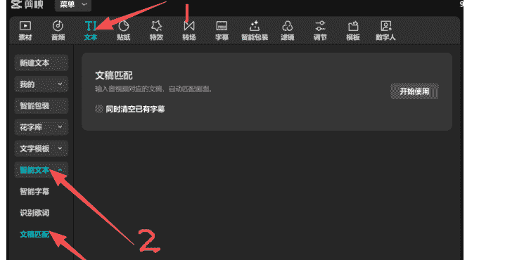

(2) 比较复杂的粗剪辑的全过程录像如下。

#### 9. 补实拍、挑选之前收集的视频素材（40分钟）

(1) 做什么：看看还有哪些空位置，补一下实拍（人露脸与物品实拍）、挑选之前收集的视频素材。也可以补充一些稿定设计能做的素材，主要是为了补空位，把画面填满，让作品完整。

#### 10. 精剪辑（60分钟左右）

(1) 做什么：加特效，加音效，把不通畅的地方搞通畅，把视频做完。

(2) 小技巧：标准化的特效制作（5分钟加完）。先主轨道加一个渐变转场，之后个别素材加个入场效果和出场效果即可，效果很高级。做起来几分钟的事。

#### 11. 做封面（30分钟）

(1) 可以多看看别人的模板，进行替换。

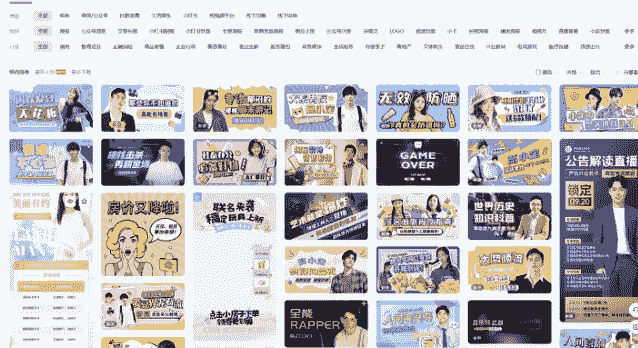

(2) B站平台的封面要做两个，一个 16:9，一个 4:3。

#### 12. 提前规划蓝链格式（20分钟）

小技巧：为了防止出错，一次合格，要提前写这个。挂蓝链时反正也能复制粘贴，速度特别快，也没多花时间，反而整体时间更快了。

> 视频里推荐的床帘已经为大家整理好了，点击链接直达，部分地区有国补，少部分商品有卷~

【PART1 洗漱用品】

京东京造洗漱桶套装
参考价：39.9
京东京造旗下百货推荐

京造巨厚实双耳盆
参考价：19.9

#### 13. 发布视频，挂蓝链（40分钟）

这里是常规动作了。

#### 14. 素材归档（20分钟）

- 2508-1-充电宝横评 2025/9/1 8:55
- 2509-1-床帘横评 2025/9/20 15:37
- 2509-2-歌德利c12 2025/9/19 21:51
- 2509-3-宿舍好物 2025/9/19 8:37
- 背景素材 2025/9/1 8:56
- 封面对标图片 2025/8/28 16:32
- 学习资料 2025/9/1 8:50
- 品类表.xlsx 2025/9/1 8:46

以上我把这套标准化生产系统模型把内容生产给大家拆得明明白白！

从选品、做PPT模板（套版批量用），到商品介绍、做稿、修稿录音频，再到划素材、使用稿定设计、粗剪辑、补实拍、精剪辑，最后做封面、规划蓝链格式、发布视频和素材归档，每一步都有时间规划和实操小技巧~~~

你只要把内容生产流程化、高效化了，新手跟着走也能很快上手~

## 四、你走的每一步，都算数

### 1、一个有良好发展前景的事物的整体波动曲线符合函数中的正弦波模型

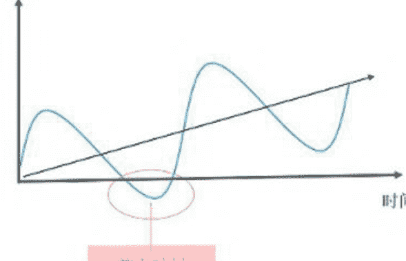

当收益跌破了你的容忍阈值，你就会选择放弃行动或者不得不退出行动，从而无法获得后面的收益，得到一个不太理想的结果。

我建议大家不要在遇到挫折的时候，就退出朝阳赛道。事物的发展一定是有拐点的，最容易倒下的就是黎明前的黑暗，拐点来临前的那一刻。大多数人经常会等不及得到成果而中途退场，使之前的努力的价值无法兑现。

### 2、事物的发展存在着巨大的滞后现象。

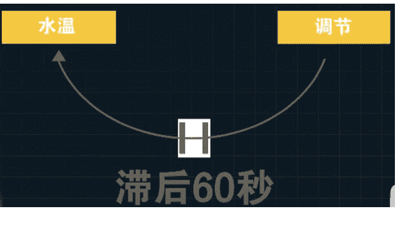

生活就像是用一个有60秒时间延迟的热水器洗澡，而且你还不知道这60秒的存在。过冷的时候拼命拧热，之后又必然过热，最后导致一会很热一会很冷。现实中许多事情的滞后时间都相当长，这也就是为什么会有长尾流这个词。

### 3、你走的每一步，都算数

每一步，都算数。

@Cheer林悦己从0学习ai编程做产品，第一个站做了116天，才出第一个单。第二个站从想法到上线做了9天，已经出了12单，赚了37.88刀。每一次都是10x速，最难的就是第一块美金，坚持下来最重要。所有的赚钱规律都是 gradually then suddenly。

> “不管是好的转折，还是坏的转折，都存在一个“渐渐的，突然的”(gradually，then suddenly)规律。这里的一个关键是，你无法提前准确预测“突然”的转折点在哪里。所以这个东西才叫“突然”。你不知道压垮骆驼的是哪一根稻草，只是知道，继续这样加稻草，迟早会压垮。同样的，只要你不断全面的积累，肯定迟早会有突破，只是无法提前预测在哪一个点什么时间突破。但正是因为无法提前精确预测，所以很多人就把它等价于转折不会发生。所以放纵坏习惯不积累也不纠正，好习惯懒得去培养因为短期看不到回报。然后把任何突发的自己遭遇的坏的重大转折，别人收获的好的重大转折，都说是运气。”——from 王川

### 4、量变向质变的过渡往往是一个指数函数

一开始发展极其缓慢，然后突然间就快的难以置信。

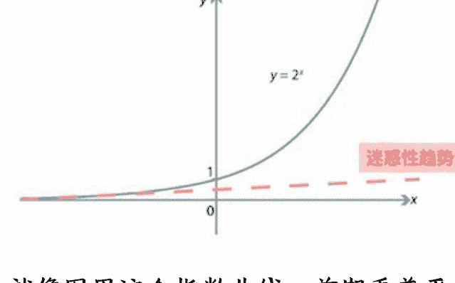

就像图里这个指数曲线，前期看着平平无奇，甚至会被“迷惑性趋势”骗到，觉得没啥变化。但一旦过了某个点，它就会“蹭蹭”往上冲，这就是量变积累到一定程度后，质变突然爆发的样子～

### 5、尾声

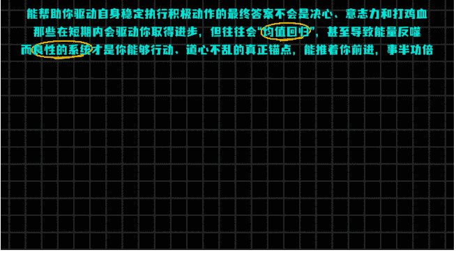

我从当初只想做个 UP 主，到意外跑通 B 站好物的系统化路径，这一路的前行让我明白：加入了星球后参加航海实战的过程中，日常我所做的看似零散的动作，看准了项目，只要用系统串联、用复利思维深耕，终会在某个节点迎来爆发。

你看我在做选品的差异化模型让我跳出同质化竞争，标准化生产系统把内容产出效率拉满，上面所展示到的那些关于发展曲线、滞后效应的认知，也在提醒我做项目时候“坚持的价值”。哪怕中途遇到流量异常订单，咱们也有申诉经验兜底。

别觉得现在的努力是 “慢动作”，就像指数函数的曲线，前期看似平缓的积累，每一步深耕，都是未来做好项目的伏笔，总会在某个瞬间迎来 “狂飙式” 突破。咱们在深海圈里打磨的选品模型、生产系统，还有对行业规律的认知，都是未来在年货节、618、下一个双 11 里 “抓到红利” 的资本！

期待我们都能在 “当个 UP 主” 的初心里，找到适合你的 “系统玩法” 的底气，把每一次创作、每一笔成交，都变成自己商业版图里的一块牢固拼图。

最后，安利小懒的付费群：

懒人专属群（介绍）

懒人专属群持续更新中，已持续运营 6 年，整理超 3000 份各类精选付费文章 & 年费社群干货，全部开放下载。

本资料为付费群内部分享，仅供真实有需要的朋友查阅 🙇‍♂️

懒人专属群更新记录：
https://hk57gvlx7u.feishu.cn/docx/H0kRdZbSbolBR0xkaXtcuVE0nTg

懒人专属群更新记录（需梯子，备用）：
https://lazybook.fun/blog/record2