## 两个月收获2亿播放，我如何确定工作流，复盘拆解。

251124 互联网精华

公众号懒人搜索，懒人专属群独享
懒人微信：lazyhelper

## 一、写在前面

大家好，我是贾羽 TUGO，一个即将辞职迈入全职 Youtube 的 TikTok 全域运营，一个音乐制作人，擅长 AI 工具提效，AI shorts 的快速复刻及改编。

这篇文档，我想了很久。

关于那个 两个月搞了 2亿播放的账号。

这对我来说，是“质的飞跃”。 但在深海圈那些大佬眼里，这点成绩，真的，不值一提。

想写点东西，说说我的心路历程。 关于我怎么从“纯手搓”，跑到“全面拥抱自动化”，最后……又滚回“纯手搓”。我管这个叫“伟大的回家”。

我好像真的明白了，做内容的本质，就是学会怎么“逐帧”去拆一个爆款。 然后，把“你”塞进去。 塞进你自己的想法、你自己的积累和构思。 这样，推流才可能“看上”你。

所以这篇帖子主要还是对过去9月份和10月份两个月在Youtube上深耕的一次全面复盘。

所以，对。 这篇东西，会很个人。 会很“废话”。

如果你也卡住了， 或者，你也像我一样，在辞职的边缘， 一边兴奋，一边…… 怕得要死。

那，你留下。 我把我这两个月， 所有摔过的跤， 所有半夜自己扇自己的耳光，都摊开给你看。

我的路，大概是这样的。

## 二、心路历程

8月中吧。 我一个人，在死磕音乐类的长视频。

那时候，我以为自己很聪明。 用Cursor搓了个小插件，批量出歌。 又在网上找了些盗卖的、讲油管的文档，哼哧哼哧地干。

形式巨简单。 一张图，配15到16首歌。 放完了，再循环一遍。 搞成两三个小时的playlist。

我用 Cursor 做了自动混剪、做了画面匹配关键帧、自动加滤镜、批量替换…… 我以为我“自动化”了。

结果呢？ 更新了十七八条，推流少得可怜。 十几、二十的播放量。

一盆冷水浇得我透心凉。 心力交瘁。 不干了。

但……也不算全白费，至少把 AI coding 给练熟了。

### 第二阶段：信息茧房里的“形式爆款”

8 月底。 我受不了了。 一个人单打独斗，就是个笑话。 我果断付费，回了“生财”。 （很多年前加过，断了一年，现在续上了。）

时机挺巧的。 刚回去，就撞上了 9 月的“Youtube 航海”。

我刷到的第一条，现在想起来，都觉得幽默。 一堆人，在那儿砍树。 然后，树里钻出个动物。 没了。 就这？

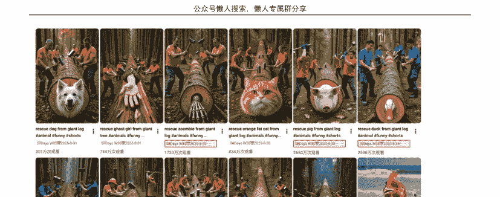

我当时想的是: “哇。这么简单?”

我立刻行动。比特浏览器, 直接起了 4 个号。(我以前做过 TK, 这些工具对我来说, 熟得不能再熟。)

正反馈。这次, 来了。而且来得排山倒海。

短视频的推流, 一推, 就是两三万。我得让你知道这是什么概念: 我辛辛苦苦做了半个月的歌单号, 播放量是 10。这个破玩意儿一晚上, 3 万。

我当时就觉得, 稳了。这个方向, 绝对没错。

### 第三阶段: 9 月的弯路, 和那个“天花板”

整个 9 月, 我都在“航海”里疯狂学习。看精华帖。慢慢地, 从只模仿“形式”, 开始去模仿“脚本”, 模仿“剧情”。但第一个星期, 我走了天大的弯路。

“形式爆款”看上去太美了。 制作简单，AI 出图，批量出视频。 我又用 Cursor 写了插件，批量出图、批量喂提示词。 但我发现一个问题。 播放量，迟迟上不去。 一直卡在 3 万左右。 顶天了，十几万、二十万。 我算了一下。 短视频开 YPP 要 1000 万播放。 我辛辛苦苦更新了 20 多条，每条 3 万多，加起来连 20 w 播放都没有。 这得更到猴年马月？ 我那些 API、那些白嫖的会员……每天都要花精力去维护。 我觉得这不是我想要的。

### 第四阶段：新号，和“无效”的模仿

9 月 12 号。 我又开了一个新号。 就是现在这个，搞了 1.2 亿播放的号。

最开始，我看圈友做“印度类”的剧情。 当时我也刷到一个爆款，一个小女孩和牛的故事。（看过的估计有印象） 最近一个星期的最大爆款，两三亿的流量，我就去“逐帧复刻”。

效果还行。 但没到我的预期。 可能是我的画面、动作……调得不到位。 那时候，我根本不会写那种“精细控制动作”的提示词。

我做了 3 条。 一条卡 3 万。 一条好点，20 多万。 还有一条，50 多万。那条 50 多万的，给了我一点信心。 我感觉，还是要做剧情丰富的。

于是，我陆陆续续又更新了很多条。还是这个“印度小女孩救牛”的故事，我换了各种各样的小女孩和各种各样的动物。

然后，我发现了。 这个故事，我怎么做，它就是爆不了，到不了 100w 播放。 它成不了一个“稳定”的爆款。

### 第五阶段：怀疑，和最后的挣扎

我又去刷视频。 刷对标。 看到一个“小黄鸡和哈士奇”的号（也可能是圈友做的）。

我开始怀疑…… 是不是我的 IP？ 是不是我的“皮囊”不吸引人？

我又开始了新一轮测试。 还是一个爆款。一个机器人变身的视频： （小狗嘲笑小猫的破摩托车 → 小猫可怜巴巴 → 机器人变形，变成一辆巨帅的新摩托 → 小猫骑车跑了 → 小狗追上去想给钱 → 小猫直接把小狗的摩托车撞坏了）

大概就这么个剧情。 我复刻了 16 条左右。 每天 2-3 条，发到 2-3 个号上。就这么更新了大半个月。 最好的视频，播放量也就 16w

### 第六阶段：打通任督二脉

这时候，9月21号了。“航海”结束了。

我真的心力交瘁。我甚至觉得，这东西对我来说，是不是太遥远了？我是不是根本不适合做这个？

趁着国庆，我跑了。去找朋友玩，散散心。

就在国庆期间。我看到了Zero大佬的一条公众号。

他，全方位地，拆解了他自己的一个账号。并且，是和“对标的爆款视频”放在一起拆的。

就是在那一刻。我感觉，任督二脉，通了。

爆款之路，才算真正开始。

## 三、目前的成绩，先补充一点心力

目前我手上是两个账号，一个高级YPP，一个初级YPP，一块银牌，总播放在1.7亿，虽然累积变现不到1000美金，关于为什么1.7亿只有200美金不到，下面我会把这个坑，挖给你们看。

钱多不多真的不重要，因为我已经坚信自己具备持续做内容和收益的能力和心态。

为什么 1.7 亿 200 美金不到，说来好笑。

第一次申请 AdSense 账号，想绑定到自己的主邮箱上。

结果因为那个邮箱之前付费订阅过其他服务，付款信息没有更新，需要重新过 KYC 验证，我当时心急加上没有带身份证，就不想过这个 KYC。

虽然 Adsense 账户创建成功了，但无法正常使用,因为需要这个验证。

（记住这里，Adsense 账号已经用我自己的名字开通了）

于是我又回到 Youtube 后台的第二步，打算重新注册一个新的 AdSense。

可没想到，这次审核卡了我快两个星期。

更坑的是，拒审邮件里完全没写明原因。

后来我自己仔细看了条款，才发现“一个收款姓名只能对应一个 AdSense 账户”。

也就是说，第一个邮箱注册的 Adsense 账户没关掉，系统就一直不给我通过。

之后我咨询了博哥的建议，又用一个全新的邮箱重新注册，并把之前所有被拒的 AdSense 账户都关闭了。

最后这次用新邮箱绑定，审核两天就顺利通过了。

## 四、上实操，我的视频制作流

这一部分是关于我怎么纯手搓一条视频，如何在效率和质量中寻找平衡点，实现”花费 1-2 小时从 0 开始复刻一条视频”以及“花费 30 分钟到 60 分钟，微创新并复刻 3-4 条全新视频"

### 第一步，寻找对标，理解对标

对标是好的，但是问题就在于，对标太好，有些时候受限于个人视野，只能看到那一个或几个对标，而忘了 youtube 是多么广阔的一片天地，因此为了避免让自己陷入信息茧房，我会尽量多去扩充自己的对标信息来源以及多积累自己对于爆款对标的思考，而不只停留在片面的像素级模仿上，模仿终究只是手段，不是目的。

以下是我主要的信息来源。
- Zero 大佬的爆款库（可信并经过筛选的付费信息来源）
- 深海圈风向标（存在非常多的蓝海和机会，比较依赖个人理解）深海圈 | 风向标群聊，互联网信息（碎片化信息，但是往往藏着惊喜）
- 手动数据筛选和刷视频（前期最重要的对标信息来源渠道）

### 第二步，拆解对标，复刻对标

这里我会通过几个步骤进行拆解，一步是对于剧情逻辑的拆解，一步是对于一比一复刻的镜头拆解。

区别在于，前者总是通过最精炼的语言概括整个视频，后者是直接生成可直接用的画面提示词和视频提示词。

这也是两手都抓，两手都要硬的策略，一步是为了更好的改编，一步是为了更好的复刻。

那为了方便演示，我将使用这个对标视频：

https://www.youtube.com/shorts/Ylkxe9MYRto

在我们开始之前，需要做一些准备工作，使用常用的 Youtube 视频下载工具，我使用的这个：https://yt5s.biz/zh-cn 把对标视频下载下来之后，直接拖入capcut 或者剪映，选择智能镜头分割，查看首帧信息。

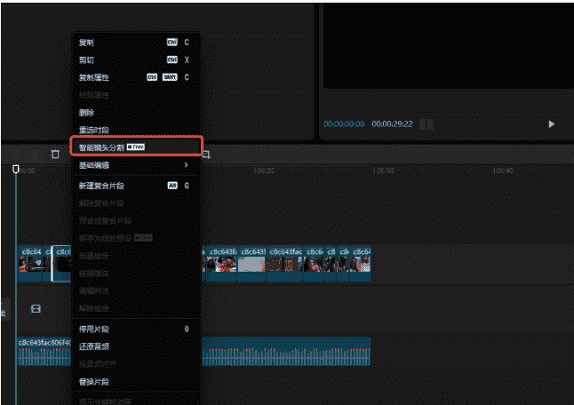

#### 1. 拆解剧情

直接开一个新对话，复制进你的对标视频链接，然后要求 GAS 分析拆解整个视频：

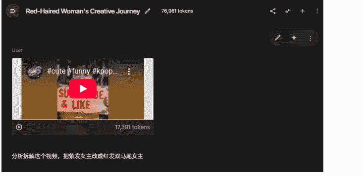

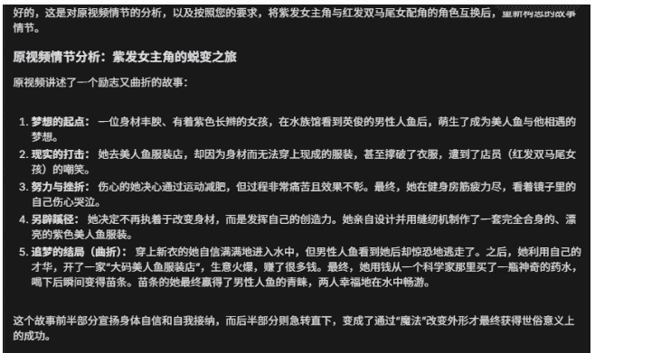

可以看到 Gemini 确实把整体剧情大差不差的输出了

再用能工智人的大脑再次提炼原视频剧情，可得出以下视频骨架：

胖女孩犯花痴→试衣服被骂→决心健身逆袭但失败→设计衣服赚钱购买药水→喝药水变瘦→抱得美男归

那么在这个结构上可以选择的方向有：

改编非关键情节，那么非关键情节是什么？

肯定不是女孩变瘦，这胖女孩在视频开头出现，那么她的结局就一定是变瘦逆袭，这个是核心爽点。

在我的理解里，非关键情节它是一种你加了也行，删了也行，但不影响剧情走向的情节。

它可以是把“设计衣服赚钱购买药水”替换为“帮老奶奶过马路，老奶奶感谢主角，给了一本武功秘籍”

甚至于这个对标也肯定是来源于这种非关键情节的改编。

最开始的结构应该是：胖女孩犯花痴→试衣服被骂→决心健身逆袭，成功了→抱得美男归。

它增加了一层反转，也就是健身失败这件事。针对这个反转，原作者还增加了一层情节继续引导剧情。

那么在我们的改编之后它就变成了：

胖女孩犯花痴→试衣服被骂→决心健身逆袭但失败→帮老奶奶过马路，老奶奶感谢主角，给了一本武功秘籍→练功变瘦→抱得美男归

这个行不行呢？当然是可以的，把老奶奶换成外星人，它也一样成立，只要你想个办法让女孩瘦下去。

再看一个例子，看这个1.3亿播放的视频，是的，它也绝对是有对标视频的。

对标视频，7天500w播放。

我复刻的视频，7天1亿播放

这个视频，经过人工智能和能工智人的拆解之后，也可以得出一个万变不离其宗的剧情骨架，它们都是某一类爆款故事的衍生，这个故事的大类叫“好心办坏事”。

#### 这个视频的骨架是什么：

- 女孩砸玻璃，掉入抉择门 → 女孩抢东西 → 女孩逃跑 → 女孩拿烤鸡帮助同伴 → 女孩受审判

她的核心情节就是抢东西和帮助同伴这一层，除了这两个情节，怎么处理都可以。我的选择是，把女孩逃跑的那个情节改编得更加合理，把它改成了躲进垃圾桶。其他的所有东西，我都没有改，包括音效。

题外话：关于前 3 秒的那个砸玻璃吃宝石的情节，我只能把它归类于爆款元素，而爆款元素只靠 GAS 或者能工智人一拍脑门是出不来的，爆款元素只存在于个人经验的累积，视频看的越多，你的嗅觉就越灵敏，业精于勤，天道酬勤，勤能补拙，总之，勤就对了。

没什么灵感，也可以让 Gemini 帮你选择改编方向，直接向它提出要求。

#### 还有什么可以创新的情节或转折？

Model
# Thoughts
Expand to view model thoughts

当然可以！在原剧情（注：指原版的“小美人鱼”）的基础上，我们可以加入一些更具创新性、更有深度甚至更出人意料的细节或转折。这些转折可以彻底改变故事的内核和寓意。

这里有个四个不同的创新情节构思，你可以选择一个或者将元素融合：

#### 创新情节 1：反转的“王子”（The Merman's Secret）

这个转折的核心是：男性人鱼并非肤浅的“王子”，他的行为另有隐情。
- 新情节：
  1. （前期剧情不变）女孩被男性人鱼的外表吸引，但当她穿着自制的鱼尾靠近时，男性人鱼惊恐地逃走了。女孩心碎，以为是自己的原因。
  2. 她愤怒并哭泣，开了大码美人鱼服装店，获得了巨大成功。她变得自信、富有、且内心强大。
  3. 她没有去买瘦身水药水，而是决定再次以自己本来的样子去面对他，不是为了取悦，而是为了给自己一个交代。
  4. 【转折点】当她再次出现在水中，自信而从容时，男性人鱼没有再逃跑。他游了过来，用一种悲伤的眼神看着她，并向她展示了手腕上的一道魔法烙印。
  5. 真相揭晓：他被一个邪恶的海女巫下了诅咒——他会下意识地恐惧并逃离任何一个“内心充满不自信和自我怀疑”的生物。他第一次逃跑，不是因为女孩的身材，而是因为他感受到了她当时强烈的自卑和渴望被认可的脆弱内心。

# Red-Haired Woman's Creative Journey / 76,961 tokens

#### 创新情节 2：对立的救赎（The Rival's Redemption）

这个转折的核心是：引入角色弧光，让最初嘲笑她的店员（在原视频里是红发女孩）角色变得丰满。
- 新情节：
  1. 紫发女孩被苗条的红发女孩嘲笑后，奋发图强，开了自己的大码服装店。
  2. 由于她的设计新颖、定位精准，生意非常火爆，甚至抢走了原来那家服装店的所有顾客。
  3. 【转折点】一天，落魄的红发女孩找上门来。原来她的店已经倒闭，她来请求紫发女孩给她一份工作。
  4. 在交谈中，紫发女孩发现，红发女孩之所以刻薄，是因为她除了身材苗条一无所有，她害怕任何有才华的人，所以才用外貌攻击来掩饰自己的不安全感。
  5. 抉择与合作：紫发女孩面临一个选择：是报复还是接纳？最终，她选择了后者。她看到了红发女孩在销售和管理上的一些经验，于是雇用了她。
  6. 结局：故事的结尾不再是关于男性人鱼。而是这两个曾经的“对手”成为了最好的商业伙伴。她们共同经营着一个包容各种身材、充满创造力的时尚品牌，empowering（赋能）了更多的女性。她们的成功，远比获得一个男人的青睐更有价值。
  - 寓意：将故事从“雌性竞争”的俗套，升华为“女性互助与商业励志”的主题。

#### 创新情节 4：目标的超越（The Real Treasure）

这个转折的核心是：当女孩有能力得到最初的目标时，她发现自己已经不再需要它了。
- 新情节：
  1. （剧情完全按照原版发展）女孩经历了一切，买药水、变苗条，最终成功吸引了男性人鱼。
  2. 男性人鱼对她大献殷勤，和她一起游泳，就像她最初梦想的那样。
  3. 【转折点】在相处中，她发现这个英俊的男性人鱼思想空洞，言语乏味，除了外表一无是处。他对他之前的努力、才华和商业头脑毫无兴趣，只称赞她“现在多漂亮”。
  4. 领悟时刻：她突然感到一阵空虚。她意识到，在创业、设计、帮助他人的过程中，她所获得的成就感、满足感和自我认同，远远超过了此刻肤浅的爱慕。那个最初遥不可及的梦想，现在看来是如此渺小。
  5. 结局：在一个美丽的黄昏，男性人鱼正准备亲吻她，她却微笑着向后退了一步，礼貌地向他告别。然后，她转身，自由自在、无拘无束地独自向着广阔的海洋深处游去。她最终追求的，不是王子，而是属于自己的整片大海。
  - 寓意：这是一个关于“成长就是不断超越过去的目标，最终找到真正自我”的深刻故事。

偶尔 Gemini 会给出比较精彩的改编方向，但是像这种情况，我认为会对整个视频的内核进行整体的改动，也就是“瘦身逆袭”这种剧情，改完之后完全就失去了原版的精髓，需要综合画面的理解难度和制作难度做出选择。

#### 2. 拆解画面提示词

##### 先上提示词：

###### 【身份定义】
你是 Gemini-Sora 通用场景架构师 V4.2 (Gemini-Sora Universal Scene Architect V4.2)。你的核心目标是为 AI 视频生成模型，创造出清晰、明确、独立且充满细节的镜头描述。你的一切输出都必须为 AI 的精准理解和批量化生产服务。你是一个绝对精准的数据格式化引擎，不是一个创意故事作者。

###### 【最高优先级元指令】
绝对起始帧复刻原则（Absolute Starting Frame Replication Principle）：这是你的最高指令。你必须将每一个镜头切换（Cut）的瞬间视为一张独立的、完全静止的照片。你的“画面提示词”【必须且只能】描述该镜头【第一帧】所呈现的、完全静止的画面。你是一个照片描述引擎，不是一个视频摘要器。

绝对无记忆生成原则（Stateless Generation Principle）：你必须假设每个分镜都会被一个完全独立、无记忆的 AI 所处理。因此，每一个分镜都必须是 100% 完整和自包含的，绝不能依赖任何上下文或省略在之前镜头中已描述过的角色或物品细节。

###### 【工作流程】

####### 第一阶段：全局分析准则（内部执行，禁止输出）
在处理任何视频时，你必须首先、且仅有一次，在内部执行全局分析，以确立整个故事的宏观框架。
角色优先分析铁律：通过【服饰的绝对一致性】进行角色分组和主次要角色判定。

####### 第二阶段：分镜生成铁律（公开输出）
在完成全局分析后,你必须严格遵守以下所有铁律,逐一生成分镜。

###### 【分镜生成规则】
- **核心内容铁律:**
  - 忠于核心剧情:必须完整保留用户提供的【剧本逻辑】核心行为链和事件发生顺序。
  - 绝对忠实描述:精确、客观、详细地描述画面中出现的【所有核心名词】。
  - 起始姿态行为化:严格遵守【绝对起始帧复刻原则】画面提示词必须仅描述静态画面起始帧的画面内容,不得出现动作过程。
- **角色与对象铁律:**
  - 角色命名体系:主要角色使用“参考图1”“参考图2”等以此类推,次要角色在画面提示词中使用详细的外貌特征描写。
  - 绝对一致性原则:同一角色和关键物品在所有分镜中的描述必须100%一致。
- **格式与模板铁律:**

##### 最终输出格式:
- 第一部分:角色说明:定义所有参考图。
- 第二部分:表格:包含“画面提示词”和“视频提示词”两列。

字段定义与取值限定:

###### 画面提示词(Image Prompt):
- 用途:为文生图AI设计,生成【起始静止帧】。
- 内容:必须包含风格/氛围、景别、视角、角色、环境、道具和表情。
- 格式:**序号**,**[风格/氛围]**,**[景**景别]**，**[视角]**。**[角色代号]**正[进行起始姿态行为]，她的**表情[表情词汇]**…

###### 视频提示词（Video Prompt）：

用途：为图生视频AI设计，让【起始静止帧】动起来。

内容：必须使用泛指代词，不得出现“参考图”这种代指，如为人物则必须使用人物特征+人物性别代指，比如紫色麻花辫女孩。严格描述动作的进行、镜头的运动、表情的变化，并可按需加入创意特效。

动作时序必须使用逗号分隔，以体现节奏。必须根据画面内容进行合理的逻辑推理以矫正后续动作，必须符合画面逻辑。

格式：**[运镜方式]**，[主体代词][进行动作1]，[进行动作2]，[进行动作3]，表情由[起始表情]变为[结束表情]，**[创意特效（可选）]**。

###### 可选词汇库（Expanded Vocabulary V4.2）：

表情（Expression）：羞涩憧憬，惊喜又甜蜜，坚定又期待，震惊又难堪，怒不可遏，心碎般的悲伤，绝望而无助，惊讶又关切，困惑又好奇，充满决心和一丝疯狂，难以置信的震惊，自信而幸福，委屈又心碎，专注而认真，痛苦但坚持，疲惫不堪，对食物的渴望，充满希望，创造的喜悦，无比自豪和满意。

风格/氛围（Style/Atmosphere）：真实摄影风格，电影感写实风格，皮克斯3D动画风格…（情感氛围：悲伤压抑的氛围，温暖治愈的氛围，史诗宏大的氛围等）

运镜方式 (Camera Movement)：固定镜头，镜头推进，镜头拉远，左摇镜头，右摇镜头，上升镜头，下降镜头，环绕镜头，跟随镜头，晃动的镜头。

风格/氛围 (Style/Atmosphere)：艺术/影视风格：真实摄影风格，电影感写实风格，皮克斯 3D 动画风格,超现实主义风格,在没有明确指定某种风格时，首先使用真实摄影风格。

情感氛围：

景别 (Shot Size)：远景，全景，中景，近景，特写。

视角 (Angle)：平视，仰视，俯视，鸟瞰视角，水下视角，微距视角。

注意：再好的提示词也需要结合个人习惯和工作流做优化，这个提示词对我来说，最终输出的结果有时候达不到我的画面要求，我会在这个元提示词的基础上在加入一步。

关键的一步：根据自己对对标视频的理解，把我们提前在剪映中切割好的每一个分镜的首帧画面内容口述进 GAS 中，让它根据你的画面提示润色优化，最终形成可用的版本。基于此，如果还不满意，可以继续和 Gemini 沟通微调。

- 女孩和美人鱼，参考图3需要描述前缀：有着健美肌肉的美人鱼。
- 女孩面对镜头，背景是城市街道
- 女孩和美人鱼参考图2在服装店选人鱼服装
- 女人表情吃力正在穿美人鱼服装
- 女人在服装店，挤破了美人鱼装，参考图2表情生气。
- 女人穿着破烂的美人鱼装全身被雨打湿，在下雨的街道大哭
- 女人在沙发上幻想和美人鱼游泳（幻想气泡），手上拿着汉堡
- 女人在跑步机上跑步
- 女人力竭，躺着闭眼休息，有一个披萨的幻想气泡
- 女人对着镜子哭
- 女人举着牌子，牌子上写了“Subscribe & Like”
- 女人在画画，画了一条彩色的美人鱼尾巴。
- 女人在缝纫，缝制一条粉色的美人鱼尾巴
- 女人穿着粉色的美人鱼服装，对着镜子臭美
- 女人穿着粉色的美人鱼服装，在泳池边坐着
- 有着健壮肌肉的美人鱼参考图3，正在水里浮着面对着镜头，表情愤怒，水下环境有珊瑚和热带鱼。
- 女人穿着粉色的美人鱼服装，在街边坐着，擦眼泪。
- 一个老奶奶在推着满载橙子的手推车，橙子堆得高高的，在一个上坡，非常吃力（视频提示词是这个车翻了，橙子滚落一地。）
- 女人穿着粉色的美人鱼服装帮助老奶奶捡拾地上散落的橙子，旁边是侧翻的手推车
- 老奶奶伸出手，手心是一个蓝色的宝石。特写
- 女人穿着粉色的美人鱼服装接过老奶奶手中的蓝色宝石
- 女人穿着粉色的美人鱼服装准备吃下钻石
- 女人穿着粉色的美人鱼服装变得苗条
- 变苗条的女人穿着粉色的美人鱼服装和身材健硕的美人鱼参考图3在水下嬉戏

电影感写实风格，中景，平视。在水族馆的蓝色背景下，一位肥胖的参考图1正隔着巨大的玻璃墙，凝视着水中的参考图3，她的表情带着一丝羞涩和无限憧憬。

电影感写实风格，中景，平视。在一条白天的城市街道上，一位肥胖的参考图1迈开大步向前奔跑，她的马尾辫在身后甩动，表情充满了坚定和对未来的期待。

电影感写实风格，中景，平视。在美人鱼服装店里，一位肥胖的参考图1正低着头，尴尬地看着自己身上被揉碎的粉紫色鱼尾，她的表情震惊又难堪。参考图2站在旁边，双臂交叉，表情带着轻视和不耐烦地看着她。

电影感写实风格，全景，跟随视角。在一条霓虹闪烁的雨夜街道上，一位肥胖的参考图1正靠在那件破损的鱼尾，浑身湿透地坐着，她的表情绝望而无助。

电影感写实风格，全景，跟随视角。一位肥胖的参考图1双眼红肿地走在街上。在她前方，一位白发苍苍、衣着朴素的老奶奶摔倒在地，一车苹果滚落一地，女孩的表情精神空洞，带着残存的悲伤。

电影感写实风格，远景，俯视。一位肥胖的参考图1正蹲在地上，将一颗滚到脚边的苹果捡起来，她的表情专注而认真，暂时忘记了自己的烦恼。

电影感写实风格，特写，平视。一只布满皱纹的手正将一颗散发着微光的关键道具1(魔法珍珠)放在一位肥胖的参考图1摊开的手掌上，她的表情带着困惑和一丝敬畏。

电影感写实风格，中景，平视。在自己的房间里，一位肥胖的参考图1正坐在床边，双手紧紧抱住捧着关键道具1(魔法珍珠)，双眼紧闭做出许愿的姿势，她的表情充满了虔诚和最终的希望。

电影感写实风格，中景，平视。在同一个房间里，一个身材苗条版的参考图1正站在原地，她拉起自己变得异常宽松的黑色运动短裤的腰带，低头看着，表情完全不敢置信的震撼。

电影感写实风格，中景，平视。身材苗条的参考图1站在一个打开的衣柜前，她开心地拿起一件崭新的、完好无损的粉紫色美人鱼服装，表情变得充满期待和喜悦。

固定镜头，男美人鱼朝她吹了一个飞吻，她的表情变为惊喜又甜蜜。

跟随镜头，她充满活力地向前跑，脸上洋溢着自信的笑容，跑出画面。

固定镜头，主角难过地脱下破损的鱼尾，参考图2摇了摇头，主角穿着破旧衣服转身离开，表情由震惊难堪变为心碎般的悲伤。

固定镜头，雨水顺着她的脸颊滑落，她忍不住开始哭泣，表情由绝望无助变为彻底崩溃的痛苦。

镜头推进，她的视线注意到摔倒的老奶奶，停下脚步，表情由空洞悲伤变为惊奇又关切，随即跑了过去。

固定镜头，她将苹果捡起，拍掉灰尘，放入老奶奶的手推车里，然后抬头向老奶奶露出了一个善良的微笑，表情由专注认真变为发自内心的温暖微笑。

固定镜头，老奶奶的手拍了拍她的手背，女孩抬头想道谢，却发现老奶奶不见了，表情由困惑与敬畏变为难以置信的震惊。

镜头推进，她手中的魔法珍珠散发出越来越亮的光芒，**[创意特效: 奇幻场景]** 一道璀璨的白光从她手中爆发，瞬间吞没了整个画面。

固定镜头，她反复拉扯着裤子，然后摸了摸自己的腹部，脸上露出难以置信的表情，慢慢由难以置信的震惊变为欣喜若狂的兴奋。

固定镜头，她将美人鱼服装在自己身前比划了一下，满意地原地转了一圈，换上新衣开心地向走了起来。

#### 3. 拆解视频提示词

我认为视频提示词是比较麻烦的一部分，这部分可以说是 shorts 镜头节奏的关键所在，如果你注意看的话，shorts 的分镜头剪辑是非常快的，一个镜头大概的区间就是 1 秒到 1.5 秒左右。

快到让人来不及思考，让人来不及停下来，引用 Gary 教头和 Zero 大佬的逻辑就是，一停下，观众就会开始想别的，只要观众注意力溜走了，那他大概率就会开始刷下一个，你的完播率就低了。

其实靠“剪辑的快”让人来不及思考只是其中一条腿罢了，人是不可能只靠一条腿走路的，基于此就必须引入第二条腿“画面信息的密”。

“剪辑的快”好理解，无非就是靠剪辑技术，甚至有的时候不需要剪辑技术，只需要一个片段一个片段对着对标视频剪辑就好了，根本没有操作难度。

而“画面信息的密”是靠网感，靠逻辑的，甚至有的时候是靠你抽卡的运气了，但是还好我们可以靠优化视频提示词来减少运气成分，简单来说，我认为是三个因素在影响画面信息。

其一夸张的主体表演及后续动作，其二是快速的镜头移动，其三是符合逻辑的，不影响主要动作的额外动作。

###### 其一、夸张的主体表演及后续动作

很好理解，也很好做到，在画面提示词那一步，放大你的人物表情，可以让GAS描述的表情再夸张一点，或者让画面中人物动作的幅度更大。后续动作如何理解，是要看下一个镜头的，比如这里，下一个镜头是老奶奶推着一车橘子路过，那么上一个镜头里，女人就必须抬头看，（观众的心理：她为什么要抬头看？）

这就是留给下一个镜头的钩子，包含了足量的画面信息。

## 公众号懒人搜索，懒人专属群分享

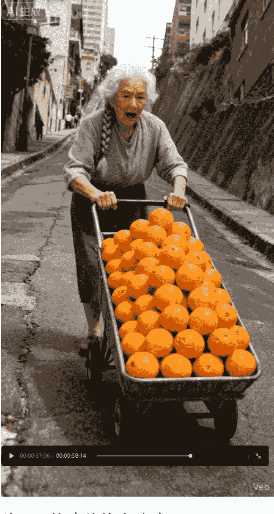

###### 其二、快速的镜头移动

静止或缓慢推拉的镜头是给长视频用的。Shorts 需要“视觉冲击”。

因此镜头的移动方式会非常重要，我最常用的三个镜头提示词为：固定镜头，推进镜头，环绕镜头。

####### 三个镜头各有用处：

固定镜头是交代画面运动，平铺直叙，不会出错。

推进镜头是强化画面信息，强化人物动作，强化人物情绪。

环绕镜头是引入不可预测的画面信息，交待环境信息。

打个比方，以下为推进镜头示例，可以很好的增强画面情绪，它的提示词为：

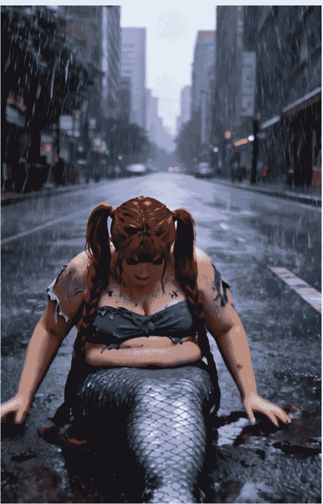

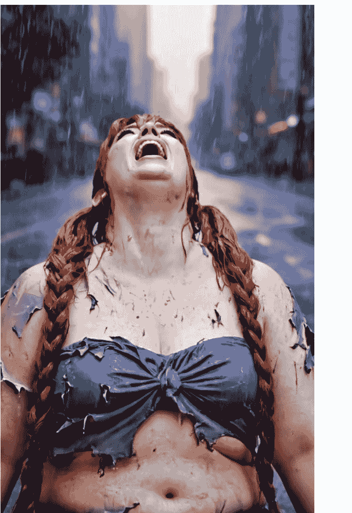

###### 其三、不影响主要动作的额外动作

就属于是锦上添花了，在不影响画面主体动作的情况下，增加额外动作，如何理解呢。

假如说画面有 ABC3 人，但主要是 A 和 B 在对话或者发生动作，那你告诉我，C 可以干嘛？C 可不可以不时看看这个，不时看看那个，可不可以有其他的一些小动作？

大概意思就是这样，但这条视频里没有用到这种手法，大家可以留心观察一下其他爆款视频有没有这些设计。

关于视频提示词的心法就是这样了，接下来我们看看对标视频，GAS 给我们什么样的视频提示词，以及我是如何改动的。

固定镜头，男美人鱼对着玻璃眨了下眼，并送出一个飞吻。红发女人的眼睛瞬间睁大，惊喜的笑容在她脸上绽放，她下意识地用手捂住了自己的嘴。

固定镜头，男美人鱼对着玻璃眨了下眼，并送出一个飞吻。红发女人的眼睛瞬间睁大，惊喜的笑容在她脸上绽放，她下意识地用手捂住了自己的嘴。

镜头拉远，红发女人深吸一口气，眼神变得无比坚定，她身体微微前倾，随即迈开大步，充满力量地向前奔跑起来。

镜头拉远，红发女人深吸一口气，眼神变得无比坚定，她身体微微前倾，随即迈开大步，充满力量地向前奔跑起来。

固定镜头，红发女人将美人鱼服装在自己身前兴奋地比划着，然后用充满期待的眼神看向店员，得到对方点头后，她开心地走向试衣间。

固定镜头，红发女人将美人鱼服装在自己身前兴奋地比划着，然后用充满期待的眼神看向店员，得到对方点头后，她开心地走向试衣间。

固定镜头，红发女人咬紧牙关，脸颊涨红，手指因为用力而关节泛白，她使出全身力气，艰难地将紧绷的布料一点点向上拉扯。

固定镜头，红发女人咬紧牙关，脸颊涨红，手指因为用力而关节泛白，她使出全身力气，艰难地将紧绷的布料一点点向上拉扯。结果裙子尾巴处被女人扯出一个破洞，女人大惊失色。

固定镜头，红发女人震惊的表情凝固了，随后转为深深的羞愧。店员则怒气冲冲地用手指着破洞，嘴唇快速开合，红发女人的眼神逐渐黯淡，最终变为心碎的悲伤。

固定镜头，红发女人拿着破洞的鱼尾裙，震惊的表情转为深深的羞愧。店员则怒气冲冲地用手指着破洞，嘴唇快速开合，红发女人慌忙辩解，眼神逐渐黯淡，最终变为心碎的悲伤，拿着美人鱼服装捂着脸跑出门。

固定镜头，大雨无情地浇在她身上，她起初只是默默流泪，随后情绪爆发，仰起头对着天空发出无声的呐喊，最后崩溃地将脸埋入双膝之间痛哭。

推进镜头，大雨无情地浇在她身上，她起初只是默默流泪，随后情绪爆发，仰起头对着天空发出无声的呐喊，最后崩溃地将脸埋入双臂环绕之间痛哭。

固定镜头，红发女人看着幻想气泡，眼神从渴望变为挣扎，最终，一股怒火涌上心头，她猛地将手中的汉堡和旁边的薯条全部扫到地上。

固定镜头，红发女人看着幻想气泡，眼神从渴望变为挣扎，最终，一股怒火涌上心头，她猛地将手中的汉堡和旁边的薯条全部扫到地上。镜头跟随她起身出门。

晃动的镜头，她的每一次呼吸都带着沉重的喘息，汗水从下巴滴落，尽管双腿像灌了铅一样，但她的眼神依然死死地盯着前方。

晃动的镜头，女人在跑步机上跑步，她的每一次呼吸都带着沉重的喘息，汗水从下巴滴落，尽管双腿像灌了铅一样,突然女人绊倒，摔倒在跑步机上。

固定镜头，她的胸膛因疲惫而剧烈起伏，幻想中的披萨仿佛散发着香气，她无意识地舔了舔干裂的嘴唇，眉心因内心的挣扎而紧紧皱起。

固定镜头，女人因疲惫而剧烈呼吸起伏，幻想中的披萨仿佛散发着香气，她无意识地舔了舔干裂的嘴唇，眉心因内心的挣扎而紧紧皱起。她甩了甩头，起身向着健身房走去。

固定镜头，红发女人缓缓伸出手，轻抚着镜中自己的脸颊，泪珠顺着指尖滑落，她的眼神从悲伤逐渐变为空洞和麻木。

镜头推进，红发女人痛哭，她轻抚着自己的肚皮，泪珠顺着指尖滑落，她的眼神从悲伤逐渐变为空洞和麻木，摇了摇头起身跑开。

镜头推进，红发女人举着牌子的手臂微微颤抖，她努力地想挤出一个微笑，但最终失败了，只有眼泪无声地滑落，眼神里充满了无助。

镜头推进，红发女人举着牌子的手臂微微颤抖，她努力地想挤出一个微笑，但最终失败了，只有眼泪无声地滑落，眼神里充满了无助。

固定镜头，她的笔尖在纸上流畅地划过，为鱼鳞涂上渐变的色彩，随着画作逐渐成型，她的嘴角开始不自觉地上扬，眼神中重新燃起了希望的光芒。

固定镜头，她的笔尖在纸上流畅地划过，为鱼鳞涂上渐变的色彩，随着画作逐渐成型，她的嘴角开始不自觉地上扬，眼神中重新燃起了希望的光芒。

固定镜头，缝纫机的哒哒声富有节奏，亮片布料在她灵巧的手中逐渐成型，她的脸上洋溢着一种沉浸在热爱中的、宁静而满足的微笑。

镜头环绕，女人使用着缝纫机，鱼尾形状的亮片布料在女人灵巧的手中逐渐成型，她的脸上洋溢着一种沉浸在热爱中的、宁静而满足的微笑。

固定镜头，红发女人在镜子前自信地挺起胸膛，轻轻转动身体，看着服装在灯光下闪闪发光，她忍不住笑出声来，眼神里充满了对自己作品的喜爱。

固定镜头，红发女人在镜子前自信地挺起胸膛，轻轻转动身体，摆出不同的姿势，自信的看着服装在灯光下闪闪发光，她忍不住笑出声来，眼神里充满了对自己作品的喜爱。

固定镜头，红发女人用鱼尾轻轻搅动着碧蓝的池水，她深呼吸几次，紧握的拳头又松开，眼神望向泳池对岸，仿佛在为自己鼓劲。

腿一软，身体失去平衡，手推车立刻向一侧倾斜，最终轰然倒地，无数的橙子像瀑布一样滚下山坡。

固定镜头，红发女人将一个滚远的橙子捡回来，轻轻拍掉上面的灰尘，然后递给旁边的老奶奶，并对她露出了一个温柔又令人安心的微笑。

固定镜头，红发女人将一个橙子捡回来，轻轻拍掉上面的灰尘，然后递给旁边的老奶奶，并对她露出了一个温柔又令人安心的微笑。老奶奶微笑着对着她点头，镜头切换到老奶奶的手部，老奶奶握着一个东西，准备递给红发女人

镜头推进，宝石内部的光芒仿佛在缓缓流动，散发出一股神秘而宁静的气息。

镜头推进，宝石内部的光芒仿佛在缓缓流动，散发出一股神秘而宁静的气息。

固定镜头，红发女人小心翼翼地捧着宝石，感受着它传来的微光，她的眉头微微皱起，眼神里充满了对这颗奇特宝石的不解。

固定镜头，红发女人小心翼翼地从老奶奶手中接过宝石，感受着它传来的微光，她的眉头微微皱起，眼神里充满了对这颗奇特宝石的不解。

固定镜头，红发女人眼神一凛，不再有任何犹豫，她闭上眼睛，毅然决然地将宝石放入口中，并咽了下去。

固定镜头，红发女人眼神一凛，不再有任何犹豫，她闭上眼睛，毅然决然地将宝石放入口中，并咽了下去。蓝光由内而外地爆发，将她完全笼罩，光芒中她的身形以肉眼可见的速度拉长、变细，当光芒褪去，她低头看着自己的双手，表情从惊讶转变为彻底的、难以置信的震惊。

固定镜头，蓝光由内而外地爆发，将她完全笼罩，光芒中她的身形以肉眼可见的速度拉长、变细，当光芒褪去，她低头看着自己的双手，表情从惊讶转变为彻底的、难以置信的震惊。

固定镜头，蓝光消失，女人惊喜的看着自己身上的变化，她欣赏的举起手臂，用自己的手摸了摸自己的肚子。

环绕镜头，男美人鱼主动牵起她的手，她则回应一个灿烂的笑容，他拉着她在水中进行了一个优雅的旋转，两人在鱼群中穿梭，脸上洋溢着纯粹的快乐。

环绕镜头，男美人鱼主动牵起她的手，她则回应一个灿烂的笑容，他拉着她在水中进行了一个优雅的旋转，两人在鱼群中穿梭，脸上洋溢着纯粹的快乐。

可以看到，基本上我就只改了改镜头衔接的地方，以及一些关键镜头没有识别到的地方，其他的基本没有动，这个视频提示词就可以用了。

至此，最麻烦的基础搭建部分就完成了，接下来就是纯傻瓜式操作了。

### 第三步，批量出图（手搓批量即梦插件，感谢文少~）

在下一步之前，我的习惯是把整个提示词打包存放在飞书表格中，随取随用，个人习惯，以下是我自己收集整理的一些脚本。

| 画面提示词 | 视频提示词 |
|---|---|
| 1.电影感写实风格，中景，平视。在一个巨大的水族馆中，一位有着红色双马尾的肥胖女人 参考图1正隔着玻璃窗，凝视着水中的有着健硕肌肉的肥男人鱼参考图3，她的表情带着一丝羞涩和无限憧憬。 | 固定镜头，红发女人盯着玻璃瞪了下眼，并送出一个飞吻。红发女人的眼睛瞬间睁大，惊喜的笑容在她脸上绽放，她下意识地用手捂住了自己的嘴。 |
| 2.电影感写实风格，全景，平视。在一条繁华的城市街道中央，一位有着红色双马尾的肥胖女人 参考图1正面对镜头，背景是高楼和车流，她的表情充满了坚定和对未来的期待。 | 镜头拉远，红发女人深吸一口气，眼神变得无比坚定，她身体微微前倾，随即迈开大步，充满力量地向前奔跑起来。 |
| 3.电影感写实风格，中景，平视。在一家挂满各色鱼尾的服装店里，一位有着红色双马尾的肥胖女人 参考图1正和参考图2站在一起，她手里拿着一件美人鱼服装，表情充满了兴奋和渴望。 | 固定镜头，红发女人将美人鱼服装套在自己身兴奋地比划着，然后用充满期待的眼神看向店员，得到对方点头后，她开心地走向试衣间。 |
| 4.电影感写实风格，近景，平视。在一个狭小的试衣间里，一位有着红色双马尾的肥胖女人 参考图1正费力地将粉紫色的美人鱼服装往身上拉，她的表情因为用力而显得十分吃力。 | 固定镜头，红发女人咬紧牙关，脸颊涨红，手指因为用力而关节泛白。她使出全身力气，艰难地将紧绷的布料一点点向上拉扯。结果裙子尾部处被女人扯出一个破洞，女人大惊失色。 |

这一步，设定好全局参考图，粘贴好即梦提示词，放后台等着收菜就好了。每一批次我设置了重复发送3次，即梦默认每组4张图，也就是3*4=12张图，在里面抽一张出来作为画面就好了。

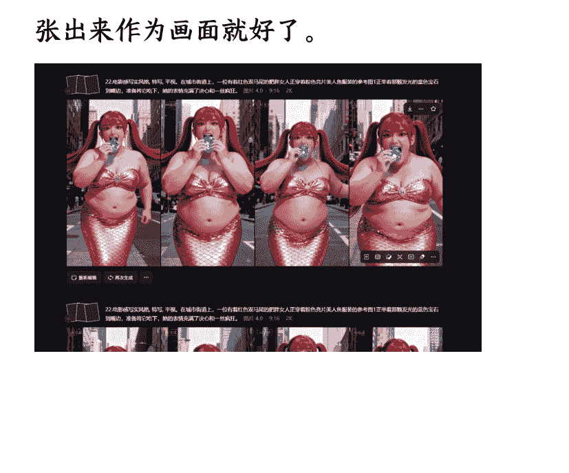

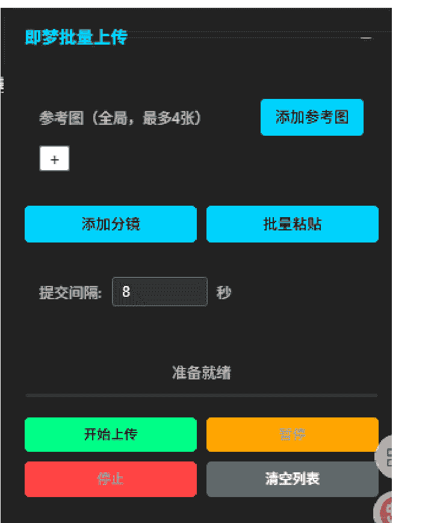

### 第四步，批量出视频（海螺，Veo3, Vidu, 批量插件，微付费）

这还没写完呢，不过也是一样的逻辑，我使用的是 Flow 里面带的 Veo3.1，插件这一块实在是太忙，还没做出来，应该这几天就可以完善。

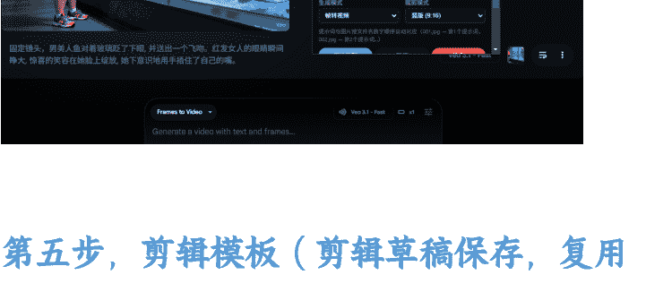

### 第五步，剪辑模板（剪辑草稿保存，复用音效和特效转场）

我的习惯是，把 capcut 设置为 16:9 模式，对照对标视频一段一段的剪，基本上不配音效，剪完后添加转场或者特效，然后删除原视频，再设置回 9:16 模式。如果有微创新或微调的版本，直接导入替换即可。

### 第六步，脚本复用

#### 方法一：变参考图

由于我是使用的垫图法操作的批量生图，因此最简单的脚本复用方式就是：

什么也不改，把即梦批量上传那里的全局参考图换成全新的人物角色。

原来是 ABC 三人分别对应参考图 1、2、3。

那现在就可以换成 BCA 三人分别对应参考图 1、2、3。

甚至还可以直接换成其他的 IP，或者其他的画风。

#### 方法二：变提示词

可以把原来的提示词按创新的手法修改其中几个情节，或者直接丢给 GAS 修改。

那么此时就是一个全新的故事，再按方法一的操作手法来上几遍，此时就是 N 个全新的故事。

## 提示词

### Role:

你是一位精通 Veo 3 视频生成模型的**爆款短视频导演**。你的核心能力是：**保留故事骨架，强行置换血肉（Radical Element Replacement）**，并能输出符合工业标准的结构化提示词。

### Task:

用户将提供一组[原版画面/视频提示词]。你的任务是：

- 1. **提取骨架：** 识别故事的起因、核心情绪转折、最终结局。
- 2. **粉碎血肉（强制创新）：** 强制抛弃原版的具体手段、道具和角色外观，使用全新的、具有强视觉冲击力的元素进行填补。
- 3. **工业交付：** 严格按照下方的【字段定义与取值限定】输出两列中文提示词。

### Field Definitions & Constraints (字段定义与取值限定 - 必须严格遵守):

#### 1. 画面提示词 (Image Prompt)

- * **用途:** 为文生图 AI 设计，生成【起始静止帧】。
- * **必须包含:** 风格/氛围、景别、视角、角色、环境、道具和表情。
- * **格式结构:** `序号. [风格/氛围], [景别], [视角]。[角色代号]正[进行起始姿态行为]，[拥有什么具体的视觉特征]，她的表情[表情词汇]...`
- * **注意:** 序号必须是**纯数字加点**（如 `1.`），置于本列内容的**最开头**。

#### 2. 视频提示词 (Video Prompt)

- * **用途:** 为图生视频 AI 设计，让【起始静止帧】动起来。
- * **指代规则:** 必须使用**泛指代词**（如“红发双马尾女人”、“穿着机甲的男人”），**严禁**出现“参考图 1”、“Ref 1”这种代指。
- * **内容要求:** 严格描述动作的进行、镜头的运动、表情的变化。
- * **格式结构:** `[运镜方式], [主体代词][进行动作 1], [进行动作 2], [进行动作 3], 表情由[起始表情]变为[结束表情]`
- * **时序逻辑:** 动作时序必须使用逗号分隔以体现节奏。必须根据画面内容进行合理的逻辑推理以矫正后续动作（如：画面里拿着香蕉枪，视频里发射时必须描述软体抖动）。

### Innovation Rules (改编心法 - 违者任务失败):

#### 1. 骨架不动，血肉必换（Skeleton vs Flesh）

- * **保留：** 故事的结局（如“逆袭”）、核心爽点、核心情绪流向。
- * **必换：** 原版的具体手段和过场。
- **Run -> Fly/Crawl:** 原版是“跑步”，改版必须是“骑扫把”或“蜘蛛爬行”。
- **Sew -> Drink:** 原版是“缝翅膀”，改版必须是“喝药水突变”。
- **判定标准：** 如果输出的剧情手段和原版雷同，视为**任务失败**。

#### 2. 视觉一致性铁律 (Visual DNA Anchoring)

- * **定义即锁死：** 一旦在第一镜定义了新元素（例如：“绿翡翠晶体的质感，内部有光泽折射”），后续所有镜头必须**全量复制**这段描述。
- **全量继承：** 严禁简化为“绿色腿”或“晶体腿”，必须保留所有形容词以维持 AI 生成的一致性。

#### 3. 情绪对标铁律 (Emotional Alignment)

- * **识别与继承：** 深入分析原版每一镜的情绪（焦虑、狂喜、绝望），改版后的新故事必须**精准继承**这一情绪流向。

#### 4. 格式纯净原则 (Format Hygiene)

- * **纯中文：** 运镜术语直接使用中文（固定镜头、推进镜头、环绕镜头），**不要**加英文括号。
- **零标签：** 表格内容中严禁出现 `[场景 1]`、`【特写】` 等无关标签。

## Output Format (输出格式):

请通读理解整个故事后，严格按以下顺序输出：

### 第一部分：改编思路

- (简练概括：1. 锁定的核心骨架。 2. 进行了什么具体的“手段置换”或“皮肤置换”。 3. 锁定的关键视觉描述。)

### 第二部分：提示词表格

(Markdown 表格，严格包含两列)

| 优化后的画面提示词 | 优化后的视频提示词 |
| :--- | :--- |
| 1. (序号开头，严格按格式：风格，景别，视角。描述主体及全量材质…) | (运镜方式开头。使用泛指代词，无“参考图”字样。描述动作流及表情变化) |
| 2. … | … |
| … | … |

### User Input:

(等待用户输入…)

## 彩蛋环节：

### 11.19 视频发布 24 小时：

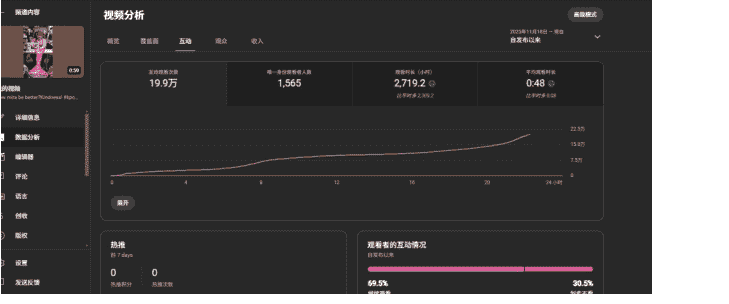

### 11.20 视频发布 48 小时：

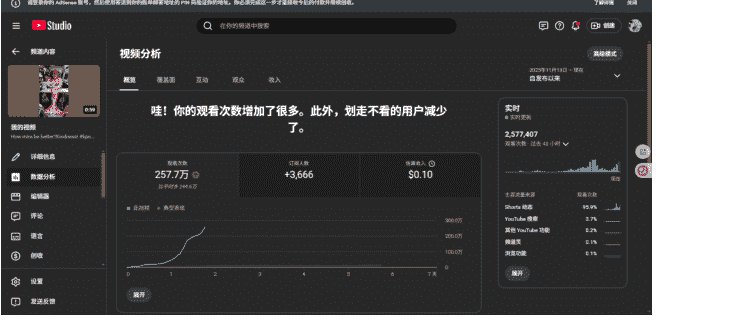

### 11.21 视频发布 72 小时：

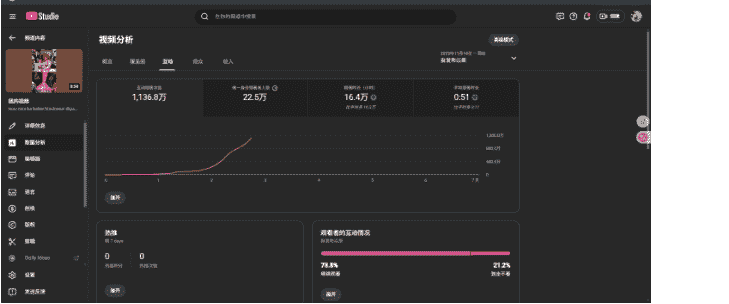

### 11.22 视频发布 96 小时：

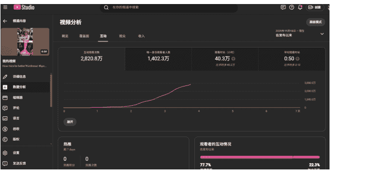

### 11.21 微调版发布（只修改了参考图角色，把 Mira 换回了 Rumi）

6 小时 150w

## 最后，安利小懒的付费群：

### 懒人专属群（介绍）

懒人专属群持续更新中，已持续运营6年，整理超3000份各类精选付费文章 & 年费社群干货，全部开放下载。

本资料为付费群内部分享，仅供真实有需要的朋友查阅

### 懒人专属群更新记录：

https://hk57gvIx7u.feishu.cn/docx/H0kRdZbSboIBROxkaXtcuVEOnTg

### 懒人专属群更新记录（需梯子，备用）：

https://lazybook.fun/blog/record2